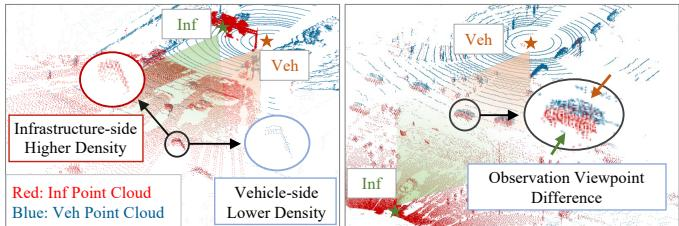
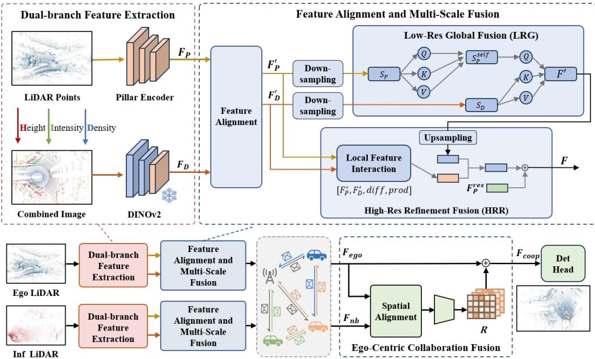
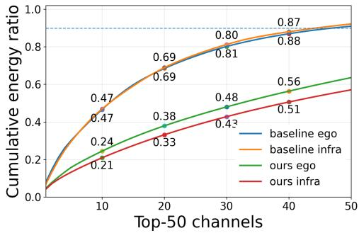
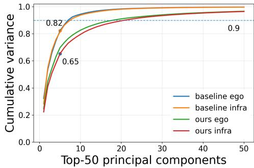
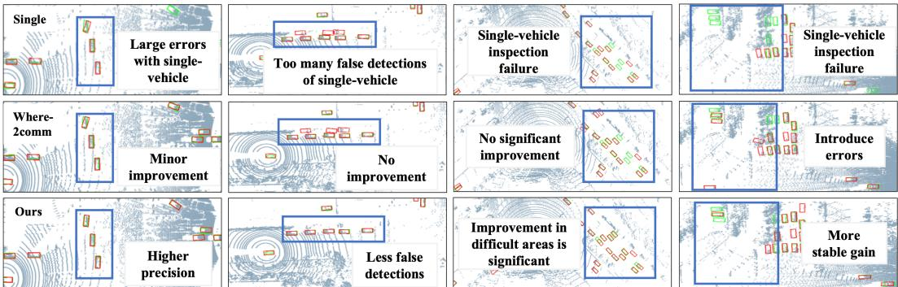

# ViCo3D: Empowering LiDAR-based Collaborative 3D Object Detection with Vision Foundation Models

Haojie Ren, Songrui Luo, Lingfeng Wang, Yan Xia, Yao Li, Lu Zhang, Jiajun Deng, and Yanyong Zhang University of Science and Technology of China rhj@mail.ustc.edu.cn

## Abstract

LiDAR-based collaborative 3D perception in Vehicle-to-Everything (V2X) systems typically relies on fusing bird’s-eye-view (BEV) features across agents. However, current BEV representations, typically extracted by LiDAR backbones trained from scratch, are geometry-dominated and lack general semantic priors, inherently limiting the efficacy of feature-level collaboration. Meanwhile, vision foundation models (VFMs) pretrained on large-scale image data have demonstrated strong capability in learning general-purpose and informative visual representations for 2D tasks, and have the potential to enhance agent-wise LiDAR BEV representations for collaboration. Despite this potential, adapting VFMs to LiDAR-based 3D detection remains challenging due to the substantial image–point cloud modality gap. To bridge this gap, we propose ViCo3D, a collaborative 3D object detection framework powered by VFMs. Specifically, ViCo3D adapts VFMs to LiDAR-based collaborative perception from three aspects: First, ViCo3D projects point clouds onto the BEV plane as three-channel images, enabling DINOv2 to extract BEV-space visual features from LiDAR inputs. Besides, to effectively integrate these DINOv2- derived features with LiDAR geometric features, ViCo3D introduces a multi-scale BEV fusion module within the single-agent encoder. In addition, ViCo3D adopts an ego-centric cross-agent fusion strategy to aggregate complementary information from multiple agents. Experiments on DAIR-V2X and V2XSet demonstrate that ViCo3D achieves state-of-the-art 3D detection performance. Remarkably, it delivers up to 1.8× greater collaborative gains than prior methods on DAIR-V2X. The code will be made public available for future investigation.

## 1 Introduction

LiDAR-based V2X collaborative perception methods typically rely on fusing bird’s-eye-view (BEV) features extracted by LiDAR backbones from the point clouds of multiple agents. These backbones are commonly trained from scratch on task-specific 3D detection datasets and mainly encode local point-cloud geometry. However, different agents often exhibit substantial discrepancies in sensor configurations, observation perspectives, and data distributions, as shown in Fig. 1. Such discrepancies can lead to heterogeneous BEV feature representations, thereby constraining the effectiveness of feature-level collaborative fusion. Existing studies have not sufficiently addressed this issue. This paper focuses on mitigating cross-agent feature heterogeneity by learning more fusion-friendly BEV representations, thereby improving collaborative 3D detection performance.

Existing feature-level V2X collaborative perception methods mainly focus on learning consistent BEV features across agents to improve collaborative perception performance. For example, DI-V2X ( Li et al. [2024]) uses feature distillation to encourage different agents, such as vehicles and infrastructure, to learn more consistent feature representations. However, we argue that collaborative perception should not only pursue feature consistency, but also preserve detection-relevant complementary information introduced by diverse observations. Tab. 1 provides empirical support for this view: ViCo3D produces lower cross-view feature similarity than the baseline, yet achieves better detection performance. However, existing LiDAR backbones may be insufficient for learning such detectionrelevant complementary representations, as they are trained from scratch on task-specific 3D detection datasets with limited scale and diversity. Although point-cloud foundation models offer a direct route, they remain limited by the sparse, irregular, and sensor-dependent nature of LiDAR data.

  
Figure 1: Density Distribution and Viewpoint Discrepancies Between Veh-Inf Point Clouds.

Table 1: Our method yields lower cross-view feature similarity and higher detection performance.

<table><tr><td>Metric</td><td>Baseline</td><td>Ours</td></tr><tr><td>FG-Both</td><td>0.8316</td><td>0.5140</td></tr><tr><td>FG-Union</td><td>0.7537</td><td>0.4858</td></tr><tr><td>AP@0.3 ↑</td><td>0.8265</td><td>0.8635</td></tr><tr><td>AP@0.7 ↑</td><td>0.6473</td><td>0.7139</td></tr></table>

As an alternative, we observe that BEV projection provides an image-like interface: projecting point clouds onto the BEV plane produces structured 2D maps that preserve spatial layouts and geometric patterns. Meanwhile, vision foundation models (VFMs) have demonstrated strong capability in extracting rich and diverse visual features through large-scale image pretraining. This motivates us to explore whether VFMs can be adapted to enhance agent-wise LiDAR BEV representations for collaboration. However, as shown in Tab. 4, using DINOv2-derived BEV features alone leads to severe performance degradation. This indicates that directly applying VFMs to LiDAR-based 3D detection is non-trivial due to the image–point cloud modality gap. Therefore, instead of replacing LiDAR backbones with VFMs, we design a fusion framework that integrates VFM-derived features with LiDAR BEV features. Nevertheless, this fusion remains challenging. Attention-based fusion is a natural choice for modeling interactions between different feature sources, but directly applying dense attention on BEV feature maps incurs prohibitive memory and computational costs due to the large number of spatial tokens.

To address these challenges, we propose ViCo3D, a VFM-enhanced framework for LiDAR-based collaborative 3D detection. ViCo3D projects point clouds onto the BEV plane as three-channel images, enabling DINOv2 to extract BEV-space visual features from LiDAR inputs. To efficiently integrate these DINOv2-derived features with LiDAR geometric features, ViCo3D introduces a multi-scale BEV fusion module within the single-agent encoder. It first applies a Low-Resolution Global Fusion (LRG) module to capture global contextual interactions, and then uses a High-Resolution Refinement Fusion (HRR) module to refine local spatial details at a finer BEV scale. Finally, after receiving data from other agents, the ego vehicle fuses them under an ego-centric paradigm.

Overall, ViCo3D is designed to better exploit complementary information across agents by integrating DINOv2-based visual representations with point-cloud-based BEV features. In this way, ViCo3D provides richer and more informative representations for vehicle-infrastructure collaborative percep tion. We conduct extensive experiments on the real-world DAIR-V2X ( Li et al. [2024]) dataset and the simulated V2XSet ( Xu et al. [2022a]) dataset. Experimental results show that ViCo3D achieves the best performance among BEV-based detection methods, reaching 82.80/71.39 BEV AP@0.5/0.7 on DAIR-V2X and 97.20/93.23 on V2XSet. Moreover, ViCo3D achieves the largest collaborative gain. At IoU = 0.5 on DAIR-V2X, it improves the single-vehicle baseline by 13.01 percentage points, which is about 1.89× that of INSTINCT ( Xu et al. [2025]) and 1.60× that of DI-V2X ( Li et al. [2024]).

## 2 Related Work

## 2.1 Collaborative Perception

Collaborative perception enables multiple agents to share complementary information while alleviating occlusion and limited sensing range. Depending on the type of data exchanged among agents, V2X collaborative perception methods can be broadly categorized into three groups: early fusion, intermediate fusion, and late fusion. Early fusion aggregates 3D point clouds from different agents to obtain a more complete scene representation (Arnold et al. [2020]Chen et al. [2019b]Chen et al. [2019a]Yu et al. [2022]). However, raw point cloud data are large in volume, and transmitting them incurs substantial communication overhead, which limits their application in real-world V2X scenarios. In contrast, late fusion approaches (Li et al. [2022]Xu et al. [2022b]Yu et al. [2023]) perform collaboration only at the result level, such as the 3D bounding boxes predicted by individual agents, thereby significantly reducing communication costs. However, their performance heavily depends on the perception quality of individual agents and is also sensitive to pose errors between agents. Intermediate fusion methods (Liu et al. [2020a,b], Xu et al. [2022a], Chen et al. [2019b], Hu et al. [2024]) provide a balanced strategy between the amount of exchanged information and communication bandwidth. By transmitting only compressed feature maps that contain task-critical information across agents, these methods significantly reduce communication costs while remaining more robust to pose errors than the other two types.

In this paper, we focus primarily on intermediate-fusion approaches. V2X-ViT (Xu et al. [2022a]) employs heterogeneous multi-agent self-attention to adaptively aggregate BEV features from different agents. Where2comm (Hu et al. [2022]) reduces bandwidth by transmitting only spatially critical regions guided by confidence maps. CodeFilling (Hu et al. [2024])extends this idea by introducing a codebook-based representation. V2X-PC (Liu et al. [2024]) departs from dense BEV feature transmission by communicating compact point clusters.

Besides extensive efforts on communication optimization, a few studies have also investigated the data distribution discrepancies across agents, especially between vehicle-side and infrastructureside agents. DI-V2X (Li et al. [2024]) adopts a distillation-based framework to align feature representations across agents. While this strategy helps reduce the representation discrepancy among heterogeneous agents, how to sufficiently preserve and exploit the complementary information in their observations remains underexplored. To this end, we propose ViCo3D, which not only mitigates distribution discrepancies among agents but also fully exploits their complementary information.

## 2.2 Vision and 3D Foundation Models for 3D Data

Most existing 3D foundation models (Wu et al. [2024]Wu et al. [2025]) are trained on small-scale point cloud datasets and primarily target object-level tasks, which limits their generalization to largescale outdoor 3D perception. On the contrary, recent vision foundation models (VFMs) (Kirillov et al. [2023]Radford et al. [2021]), such as DINOv2 (Oquab et al. [2023]) and MAE (He et al. [2022]), demonstrate strong transferability due to large-scale self-supervised pretraining on massive image datasets. Driven by the representational strength of VFMs, recent studies have investigated transferring visual pretraining to point cloud understanding.

Existing studies mainly explore two paradigms for transferring VFMs to point cloud understanding. The first is feature distillation, where pretrained visual models act as teachers to guide 3D representation learning. Representative methods include Seal (Liu et al. [2023]), which distills knowledge from pretrained visual models into point cloud sequences, and HVDistill (Zhang et al. [2024]), which aligns image and point cloud representations across multiple 2D projections through unsupervised hybrid-view distillation. The second paradigm projects point clouds into image-like representations, such as bird’s-eye view (BEV) (Luo et al. [2023]) or range image view (RIV) (Chen et al. [2021]), allowing VFMs to be directly reused for LiDAR-based perception tasks. For example, ImLPR (Jung et al. [2025]) projects LiDAR data into RIVs and applies vision-pretrained backbones for LiDAR place recognition (LPR) without relying on RGB images.

In this work, we are the first to explore the potential of vision foundation models for enhancing collaborative perception.

## 3 Method

## 3.1 Overall Framework

In V2X collaborative perception, different agents can provide complementary observations of the scene from diverse perspectives. However, due to differences in sensor poses, viewpoints, and occlusion patterns, they usually exhibit distinct point cloud distributions. How to overcome the representation discrepancies among agents while preserving their complementary cues remains a challenging problem in V2X perception.

  
Figure 2: The Framework of ViCo3D.

To address this problem, we propose ViCo3D, a DINOv2-guided framework for V2X collaborative perception. The core idea is to leverage the transferable representation capability of pretrained DINOv2 to enhance the BEV feature space of heterogeneous agents. As shown in Fig. 2, ViCo3D contains three modules. First, the dual-branch feature extraction module (Sec. 3.2) extracts two types of BEV features for each agent. Second, the feature alignment and multi-scale fusion module (Sec. 3.3) integrates DINOv2 features with LiDAR BEV features. In this module, we first align the features encoded by the two branches to reduce their representation mismatch. We then propose a multi-scale fusion paradigm to integrate global context and local spatial details, with low-resolution fusion for global feature interaction (LRG) and high-resolution fusion for local feature refinement (HRR). Finally, in the ego-centric collaboration fusion module (Sec. 3.5), the enhanced BEV features from collaborating agents are transformed into the ego coordinate system and aggregated for final 3D object detection.

## 3.2 Dual-branch Feature Extraction

In this paper, we leverage a pretrained vision model, DINOv2, to enhance LiDAR-based 3D perception. However, we still face two key challenges: 1) DINOv2 is designed for image inputs and cannot directly process irregular LiDAR point clouds; 2) as shown in Tab. 4, directly using DINOv2 features leads to suboptimal performance, because they are not specifically optimized for localization-sensitive 3D object detection. To address these challenges, we adopt a dual-branch encoding framework.

## 3.2.1 Pillar Branch

In the pillar branch, we adopt a PointPillars-based encoder (Lang et al. [2019]) to extract LiDARbased BEV features. Specifically, each agent first voxelizes its point cloud into vertical pillars in the BEV space. Each pillar is encoded into a feature vector, and the resulting features are scattered onto the BEV grid according to their spatial locations. The output is a dense LiDAR BEV feature map $F _ { P } \in \mathbb { R } ^ { C \times H \times W }$ , where C denotes the number of feature channels, and H and W denote the height and width of the BEV feature map, respectively.

## 3.2.2 DINOv2 Branch

As DINOv2 is designed for image inputs and cannot directly process irregular point clouds, we convert each raw LiDAR point cloud into a BEV image. Specifically, given a point cloud $P = \{ p _ { i } \} _ { i = 1 } ^ { N } ,$ each point is represented as $p _ { i } = ( x _ { i } , y _ { i } , z _ { i } , I _ { i } )$ , where $x _ { i } , y _ { i } , z _ { i }$ denote the 3D coordinates of the i-th point and ${ \bar { I } } _ { i }$ denotes its intensity. We first filter out points outside the predefined 3D region of interest, defined by $[ x _ { \mathrm { m i n } } , x _ { \mathrm { m a x } } ] , [ y _ { \mathrm { m i n } } , y _ { \mathrm { m a x } } ]$ , and $[ z _ { \mathrm { m i n } } , z _ { \mathrm { m a x } } ]$ . The remaining points are then projected onto a regular BEV grid with spatial resolution r. For each point $p _ { i }$ , its corresponding BEV pixel coordinates are computed as $u _ { i } = \lfloor ( x _ { i } - x _ { \operatorname* { m i n } } ) / r \rfloor$ and $v _ { i } = \lfloor ( y _ { \mathrm { m a x } } - y _ { i } ) / r \rfloor$

After mapping all valid points onto the BEV grid, we construct a three-channel BEV image. The first channel records the maximum normalized height of points within each grid cell, capturing local vertical geometric structures. The second channel stores the normalized reflectance intensity, providing complementary surface property information. The third channel represents the point density of each cell, where the raw point count is further normalized using logarithmic scaling to alleviate the imbalance caused by non-uniform point distributions. Finally, the three channels are stacked into a structured BEV image and fed into the DINOv2 branch, producing a BEV feature map $F _ { D } \in \mathbb { R } ^ { D \times H \times W }$ , where $D$ denotes the number of feature channels.

## 3.3 Feature Alignment and Multi-Scale Fusion

After obtaining the PointPillars branch feature $F _ { P }$ and the DINOv2 branch feature $F _ { D } ,$ , we introduce a feature alignment and multi-scale fusion module to construct a unified and robust fused representation.

## 3.3.1 Feature Alignment

Since $F _ { P }$ and $F _ { D }$ are derived from different input forms and learning objectives, their feature spaces may differ. Specifically, the PointPillars branch encodes raw point clouds for 3D detection, whereas the DINOv2 branch extracts features from BEV images based on visual pretraining. Therefore, direct fusion without alignment may make it difficult to effectively exploit their complementary information. To mitigate this issue, we first use two learnable projection layers to map $\bar { F _ { P } }$ and $F _ { D }$ into a shared feature space, obtaining the aligned features $F _ { P } ^ { \prime } \doteq \overset { \vartriangle } { \phi _ { P } } ( F _ { P } )$ and $F _ { D } ^ { \prime } = \bar { \phi _ { D } } ( F _ { D } )$ , respectively. Here, $\phi _ { P } ( \cdot )$ and $\phi _ { D } ( \cdot )$ denote learnable projection functions implemented by $\mathrm { ~ a ~ } 1 \times 1$ convolution followed by normalization and a nonlinear activation.

## 3.3.2 Low-Res Global Fusion (LRG)

Considering that BEV feature maps are dense, directly applying transformer-based interaction at the original resolution would incur substantial computational and memory overhead. As shown in Tab. 6, when the feature map size is $1 1 2 \times 2 5 2$ , each branch contains 28,224 tokens, leading to an attention score matrix that requires up to 48.62 GB of memory in FP32. In contrast, when the downsampling ratio is 4×, the memory cost is reduced to 1/256 of that at the original resolution, i.e., approximately 0.186 GB, making the overhead acceptable. Therefore, we perform global feature interaction on 4×-downsampled features.

Specifically, the low-resolution global fusion proceeds as follows. We first downsample the aligned features $F _ { P } ^ { \prime }$ and $F _ { D } ^ { \prime } \mathrm { : }$ , and flatten them into token sequences $S _ { P }$ and $S _ { D } .$ , respectively. To preserve the BEV spatial layout after flattening, we add 2D positional embeddings to the tokens. We then apply self-attention on $S _ { P }$ , producing $S _ { P } ^ { s e l f }$ , to model long-range spatial dependencies within the detectionoriented BEV representation. After that, cross-attention is performed in a PointPillars-dominant manner, where $\dot { S } _ { P } ^ { s e l f }$ serves as the query and $S _ { D }$ serves as the key and value, producing the fused token sequence $S _ { P } ^ { f u s e }$ . This design preserves the task-specific structure of the PointPillars feature stream while selectively aggregating complementary information from DINOv2 features. Finally, $S _ { P } ^ { f u s e }$ is reshaped into a 2D feature map and upsampled to the original BEV resolution, yielding the low-resolution global fusion feature $F ^ { ' }$

## 3.3.3 High-Res Refinement Fusion (HRR)

However, as shown in Tab. 5, performing feature fusion only at a low resolution facilitates global information integration and significantly improves recall, but leads to a 5.4% drop in detection precision. We attribute this to the fact that low-resolution interaction inevitably discards part of the fine-grained local details, especially those in the DINOv2 features, thereby weakening the representation of object boundaries and local structures. Motivated by this observation, we further introduce a high-resolution local refinement stage after low-resolution global fusion to compensate for the loss of local information.

In this stage, we directly model the aligned features $F _ { F } ^ { \prime }$ and $F _ { D } ^ { \prime }$ at the original BEV resolution. Although attention-based interaction is effective for feature fusion, applying it to high-resolution dense BEV features would incur prohibitive memory overhead. Therefore, we explicitly construct lightweight local feature relationships between the PointPillars and DINOv2 features. Specifically, beyond simple concatenation, we introduce two interaction terms, $| F _ { P } ^ { \prime } - F _ { D } ^ { \prime } |$ and $F _ { P } ^ { \prime } \overset { \cdot } { \odot } F _ { D } ^ { \prime }$ . The former captures local discrepancies between the two feature sources, while the latter highlights their complementary activation regions. These features are then concatenated and processed by a lightweight convolutional module to produce a high-resolution refinement feature $F _ { l o c a l }$

Finally, we concatenate $F ^ { \prime }$ and $F ^ { l o c a l }$ , and feed them into a lightweight convolutional layer to generate the multi-scale fused feature $F ^ { m s }$ . In addition, to maintain the stability of the detectionoriented feature stream, we further introduce a residual pathway from $F _ { P } ^ { \prime } . \mathrm { \bf ~ A }$ spatial dynamic gate is then used to adaptively balance $F ^ { m s }$ and the PointPillars residual:

$$
F = \sigma \left(\psi \left([ F ^ {m s}, F _ {P} ^ {\prime} ]\right)\right) \odot F ^ {m s} + \left(1 - \sigma \left(\psi \left([ F ^ {m s}, F _ {P} ^ {\prime} ]\right)\right)\right) \odot F _ {P} ^ {\prime},\tag{1}
$$

where $[ \cdot , \cdot ]$ denotes channel-wise concatenation, $\psi ( \cdot )$ denotes a lightweight convolutional layer, and $\sigma ( \cdot )$ is the sigmoid function, and ⊙ denotes element-wise multiplication. The final output feature $F$ serves as the enhanced BEV representation for subsequent collaborative fusion.

## 3.4 Active Feature Communication

To reduce redundant communication, we incorporate a Where2comm-style active communication mechanism (Hu et al. [2022]) into our framework. This module estimates the communication value of each BEV location from the enhanced BEV feature $F ^ { ( k ) }$ and selectively transmits informative regions instead of the entire dense feature map. Specifically, a lightweight confidence generator predicts a spatial confidence map, which is thresholded to obtain a binary communication mask. The transmitted feature is then computed by applying this mask to $F ^ { ( k ) }$ ). In our framework, this selection is performed on the DINOv2-guided enhanced BEV representation, and the resulting sparse feature is used for subsequent ego-centric collaborative fusion.

This active communication mechanism connects single-agent feature enhancement with cross-agent fusion. It determines which regions should be transmitted from each agent, while the subsequent cooperative fusion module focuses on how to incorporate the received complementary features into the ego representation.

## 3.5 Ego-Centric Collaborative Fusion

After the ego vehicle receives selected features from neighboring agents, we first transform them into the ego coordinate system and then perform feature aggregation. We adopt an ego-centric residual fusion strategy, where the ego feature serves as the primary representation and neighboring features provide complementary residual information. Here, a gating mechanism is further introduced to adaptively adjust the information contribution ratios of ego and neighboring features in the corresponding spatial regions, leading to a more robust cross-agent fusion result.

Specifically, let $F _ { e g o }$ denote the ego feature and $\{ F _ { n b } ^ { k } \} _ { k = 1 } ^ { K }$ denote the features received from neighboring agents after spatial alignment. We first align the ego feature and each neighboring feature with two independent projection functions:

$$
\tilde {F} _ {\mathrm{ego}} = \phi_ {e} (F _ {\mathrm{ego}}), \qquad \tilde {F} _ {\mathrm{nb}} ^ {k} = \phi_ {n} (F _ {\mathrm{nb}} ^ {k}), \quad k = 1, \ldots , K,\tag{2}
$$

where $\phi _ { e } ( \cdot )$ and $\phi _ { n } ( \cdot )$ denote learnable alignment mappings for the ego and neighbor branches, respectively.

After spatial alignment, we use a lightweight gating network to estimate where the ego feature may benefit from neighboring information. Specifically, the gate is predicted based on the ego feature, the neighboring feature, and their absolute difference:

$$
G _ {k} = \sigma \left(\psi_ {g} \left([ \tilde {F} _ {e g o}, \tilde {F} _ {n b} ^ {k}, | \tilde {F} _ {n b} ^ {k} - \tilde {F} _ {e g o} | ]\right)\right),
$$

where $\psi _ { g } ( \cdot )$ denotes a lightweight convolutional network, $\sigma ( \cdot )$ is the sigmoid function, and $[ \cdot ]$ denotes channel-wise concatenation. The gate $G _ { k }$ adaptively indicates the BEV regions where neighboring feature should contribute more to compensate for insufficient ego observations.

Table 2: Comparison with state-of-the-art methods on DAIR-V2X and V2XSet validation datasets.

<table><tr><td>Fusion</td><td>Model</td><td>DAIR-V2XAP@0.3/0.5/0.7</td><td>V2XSetAP@0.3/0.5/0.7</td></tr><tr><td>No Fusion</td><td>PointPillars (2019)</td><td>72.32/69.29/59.86</td><td>66.92/64.03/41.42</td></tr><tr><td>Late Fusion</td><td>PP-LF (2019)</td><td>79.24/67.76/49.92</td><td>86.30/83.72/58.25</td></tr><tr><td rowspan="6">Intermediate Fusion</td><td>PP-IF (2019)</td><td>75.87/68.31/51.98</td><td>95.28/89.67/65.75</td></tr><tr><td>Where2comm (2022)</td><td>82.65/78.94/64.73</td><td>87.11/84.41/71.61</td></tr><tr><td>CoAlign (2023)</td><td>82.65/77.55/62.64</td><td>96.68/95.83/88.86</td></tr><tr><td>DI-V2X (2024)</td><td>81.58/77.77/65.54</td><td>94.96/93.93/85.14</td></tr><tr><td>INSTINCT (2025)</td><td>82.76/78.44/69.39</td><td>95.61/94.59/87.97</td></tr><tr><td>Ours</td><td>86.35/82.80/71.39</td><td>97.91/97.21/93.25</td></tr></table>

Finally, the collaborative fusion result is obtained by applying a residual update to the ego feature:

$$
F _ {c o o p} = F _ {e g o} + \alpha \odot R,\tag{3}
$$

where α is a learnable channel-wise scaling parameter. In this way, the fused representation remains centered on the ego feature, while selectively incorporating complementary information from neighboring agents through spatially adaptive residual aggregation. Finally, the output feature $F _ { c o o p }$ is fed into the downstream detection head for final 3D object detection.

## 4 Experiments

To comprehensively evaluate ViCo3D, we conduct experiments on two widely adopted benchmarks (Dair-V2X and V2XSim) for collaborative perception. This section presents the experimental setup, quantitative results, and analysis. Due to space limitations, detailed descriptions of the datasets and evaluation metrics are provided in the supplementary material (App.A).

## 4.1 Experimental Setup

## 4.1.1 Implementation Details

We set the point cloud range to $[ - 1 0 0 . 8 , 1 0 0 . 8 ] \times [ - 4 4 . 8 , 4 4 . 8 ] \times [ - 3 . 5 , 1 . 5 ]$ m in the vehicle coordinate system, with the voxel size set to [0.4, 0.4, 5] m along the X, Y , and Z axes, respectively. To preserve more spatial details, we use a planar resolution of 0.1 m for BEV projection. In the DINOv2 branch, we adopt dinov2\_vits14 as the pretrained visual backbone, and freeze its first eight blocks during training.

To ensure a fair comparison, all methods are evaluated under a unified BEV perception setting. We note that different methods may adopt different detection heads, and some of them are not implemented based on the PointPillars detector. Therefore, instead of enforcing a strictly unified detector architecture, we compare all methods under the same input range and a consistent BEV representation setting.

## 4.2 Main Result

Tab. 2 presents the comparison of different V2X collaborative perception methods, including intermediate-fusion, and late-fusion approaches. Here, PP denotes PointPillars trained jointly with mixed vehicle-side and roadside data. It can be observed that the late-fusion method PP-LF achieves performance gains on V2XSet. However, on DAIR-V2X, although PP-LF improves AP@0.3, its performance drops on AP@0.5 and AP@0.7 due to pose errors in real-world scenarios. In contrast, the naive feature-fusion strategy outperforms the late-fusion one.

Additionally, we compare our method with several competitive intermediate-fusion methods. IN-STINCT (Xu et al. [2025]) reproduces its BEV-detection-based version, which outperforms DI-V2X (Li et al. [2024]) on the DAIR-V2X dataset. It can be observed that our method achieves further improvements over existing models.

Table 3: Comparison between baselines and ours under single and fusion settings.

<table><tr><td>Method</td><td>Setting</td><td>AP@0.3</td><td>AP@0.5</td><td>AP@0.7</td></tr><tr><td rowspan="2">Where2comm</td><td>Single</td><td>71.60</td><td>68.03</td><td>57.49</td></tr><tr><td>Fusion</td><td>82.65 (+11.05)</td><td>78.94 (+10.91)</td><td>64.73 (+7.24)</td></tr><tr><td rowspan="2">INSTINCT</td><td>Single</td><td>75.26</td><td>71.57</td><td>63.70</td></tr><tr><td>Fusion</td><td>82.76 (+7.50)</td><td>78.44 (+6.87)</td><td>69.39 (+5.69)</td></tr><tr><td rowspan="2">DI-V2X</td><td>Single</td><td>73.73</td><td>69.77</td><td>59.22</td></tr><tr><td>Fusion</td><td>81.58 (+8.25)</td><td>77.88 (+8.11)</td><td>65.54 (+6.32)</td></tr><tr><td rowspan="2">Ours</td><td>Single</td><td>72.70</td><td>69.79</td><td>62.65</td></tr><tr><td>Fusion</td><td>86.35 (+13.65)</td><td>82.80 (+13.01)</td><td>71.39 (+8.74)</td></tr></table>

On the V2XSet, our method also achieves the best performance across all IoU thresholds. The improvement is particularly significant under the stricter IoU threshold of 0.7, indicating that our method not only enhances object detection recall but also produces more accurate localization results.

These results demonstrate the effectiveness of our method in leveraging complementary multi-view information for collaborative detection. We primarily attribute this to the fact that our method extracts more diverse features, thereby better exploiting the complementary information from multiple viewpoints. We provide a more detailed discussion in the following sections. Additional qualitative visualization results are also provided in App. A.

## 4.3 Gain Comparison

To demonstrate that our method extracts diversity features and better facilitate collaborative perception, we compare the performance of our method with existing baselines under both single-agent and fusion settings. We further report the performance gains brought by collaboration for each method. As shown in Tab. 3, all methods benefit from collaborative fusion, while our method achieves the largest improvements across all IoU thresholds. Specifically, compared with the single-agent setting, our method improves AP by 13.65%, 13.01%, and 8.74% at IoU thresholds of 0.3, 0.5, and 0.7, respectively. These gains outperform those of Where2comm, INSTINCT, and DI-V2X, indicating that the features learned by our method are more suitable for cross-agent alignment and fusion. In the next subsection, we further analyze this improvement from the perspective of the feature space.

## 4.4 Feature Space Analysis: Alignment vs. Complementarity

To address the data distribution discrepancies among different agents in V2X collaborative perception, existing methods often encourage agents to learn highly consistent feature representations for easier alignment and fusion. However, due to differences in sensor positions, viewpoints, and visible regions, different agents tend to focus on different aspects of the scene, and their feature representations should preserve such complementary differences. Simply pursuing cross-agent feature consistency may suppress the complementary information among agents, thereby limiting the benefit of multi-view collaboration.

First, we sort the channel-wise energy in descending order and compute the cumulative energy ratio. As shown in Fig. 3, the baseline features are highly concentrated in a small number of dominant channels. For example, the top-40 channels already account for about 0.87 and 0.88 of the total energy for ego and infrastructure features, respectively. In contrast, ViCo3D distributes feature energy more evenly across channels, where the top-40 channels only account for about 0.56 and 0.51. This indicates that ViCo3D activates a broader set of channels for feature representation, rather than relying on a few dominant channels.

Second, we perform PCA analysis on the foreground features. As shown in Fig. 4, the first five principal components of the baseline explain about 0.82 of the variance, while those of ViCo3D explain only about 0.65, indicating that the baseline concentrates approximately 1.26× more variance in the leading components. Moreover, the baseline reaches a cumulative explained variance of 0.9 with only around seven principal components, whereas ViCo3D requires more than twenty components to reach a comparable level. This suggests that the foreground representation learned by ViCo3D occupies a more distributed feature subspace.

  
Figure 3: Cumulative channel energy ratio.

  
Figure 4: PCA cumulative explained variance.

Table 4: Ablation of feature branch.

<table><tr><td>Metric</td><td>Only- PP</td><td>Only- DINOv2</td><td>PP+ DINOv2</td></tr><tr><td>AP@0.3</td><td>85.91</td><td>35.92</td><td>86.35</td></tr><tr><td>AP@0.5</td><td>81.56</td><td>14.49</td><td>82.80</td></tr><tr><td>AP@0.7</td><td>68.52</td><td>1.74</td><td>71.39</td></tr><tr><td>Recall</td><td>73.99</td><td>7.72</td><td>75.56</td></tr><tr><td>Precision</td><td>62.55</td><td>10.11</td><td>65.85</td></tr></table>

Table 5: Ablation study of the proposed framework.

<table><tr><td>LRF</td><td>HRF</td><td>GRF</td><td>AP@0.3</td><td>AP@0.7</td><td>Recall</td><td>Precision</td></tr><tr><td>-</td><td>-</td><td>-</td><td>82.65</td><td>64.71</td><td>69.95</td><td>63.96</td></tr><tr><td>√</td><td>-</td><td>-</td><td>85.00</td><td>65.96</td><td>72.34</td><td>58.56</td></tr><tr><td>√</td><td>√</td><td>-</td><td>85.97</td><td>71.02</td><td>75.31</td><td>66.20</td></tr><tr><td>√</td><td>√</td><td>√</td><td>86.48</td><td>71.42</td><td>75.69</td><td>65.12</td></tr></table>

These observations indicate that the DINOv2-guided representation does not simply enforce feature similarity across agents. Instead, it constructs a richer and more diversity feature space, allowing different agents to preserve complementary information from their own observations. This property helps explain why ViCo3D achieves larger gains under collaborative fusion.

## 4.5 Ablation Studies

## 4.5.1 Ablation on PP-DINOv2 Feature Fusion

In Sec. 3.3, we adopt a fusion design that combines PP features with DINOv2 features. To validate this design, we compare three configurations while keeping other modules unchanged: PP-only, DINOv2-only, and PP-DINOv2 fusion. As shown in Tab. 4, PP-only already achieves strong detection performance, whereas DINOv2-only performs much worse, indicating that DINOv2 features are not suitable as standalone detection features. However, incorporating DINOv2 with Pillar-branch consistently improves all metrics. This experiment validates the effectiveness of our design.

## 4.5.2 Ablation on Different Modules

As shown in Tab. 5, the proposed components bring consistent improvements. Low-resolution fusion benefits global context modeling and target discovery, but using it alone may introduce additional false positives. High-resolution refinement alleviates this issue by enhancing local details and improving localization. The collaborative fusion module further incorporates complementary information from neighboring agents, resulting in the best overall performance.

## 5 Conclusion And Discussion

This paper presents ViCo3D, a novel framework for vehicle-infrastructure collaborative perception. By introducing vision foundation models into point cloud-based pipelines, the proposed framework effectively enhances feature representation and improves perception performance. Compared with existing methods, our method achieves not only the best collaborative perception results but also the largest collaborative gain.

## References

Eduardo Arnold, Mehrdad Dianati, Robert De Temple, and Saber Fallah. Cooperative perception for 3d object detection in driving scenarios using infrastructure sensors. IEEE Transactions on Intelligent Transportation Systems, 23(3):1852–1864, 2020.

Qi Chen, Xu Ma, Sihai Tang, Jingda Guo, Qing Yang, and Song Fu. F-cooper: Feature based cooperative perception for autonomous vehicle edge computing system using 3d point clouds. In Proceedings of the 4th ACM/IEEE Symposium on Edge Computing, pages 88–100, 2019a.

Qi Chen, Sihai Tang, Qing Yang, and Song Fu. Cooper: Cooperative perception for connected autonomous vehicles based on 3d point clouds. In 2019 IEEE 39th International Conference on distributed computing systems (ICDCS), pages 514–524. IEEE, 2019b.

Xieyuanli Chen, Thomas Läbe, Andres Milioto, Timo Röhling, Olga Vysotska, Alexandre Haag, Jens Behley, and Cyrill Stachniss. Overlapnet: Loop closing for lidar-based slam. arXiv preprint arXiv:2105.11344, 2021.

Kaiming He, Xinlei Chen, Saining Xie, Yanghao Li, Piotr Dollár, and Ross Girshick. Masked autoencoders are scalable vision learners. In Proceedings of the IEEE/CVF conference on computer vision and pattern recognition, pages 16000–16009, 2022.

Yue Hu, Shaoheng Fang, Zixing Lei, Yiqi Zhong, and Siheng Chen. Where2comm: Communication-efficient collaborative perception via spatial confidence maps. Advances in neural information processing systems, 35: 4874–4886, 2022.

Yue Hu, Juntong Peng, Sifei Liu, Junhao Ge, Si Liu, and Siheng Chen. Communication-efficient collaborative perception via information filling with codebook. In Proceedings of the IEEE/CVF Conference on Computer Vision and Pattern Recognition, pages 15481–15490, 2024.

Minwoo Jung, Lanke Frank Tarimo Fu, Maurice Fallon, and Ayoung Kim. Imlpr: Image-based lidar place recognition using vision foundation models. arXiv preprint arXiv:2505.18364, 2025.

Alexander Kirillov, Eric Mintun, Nikhila Ravi, Hanzi Mao, Chloe Rolland, Laura Gustafson, Tete Xiao, Spencer Whitehead, Alexander C Berg, Wan-Yen Lo, et al. Segment anything. In Proceedings of the IEEE/CVF international conference on computer vision, pages 4015–4026, 2023.

Alex H Lang, Sourabh Vora, Holger Caesar, Lubing Zhou, Jiong Yang, and Oscar Beijbom. Pointpillars: Fast encoders for object detection from point clouds. In Proceedings of the IEEE/CVF conference on computer vision and pattern recognition, pages 12697–12705, 2019.

Xiang Li, Junbo Yin, Wei Li, Chengzhong Xu, Ruigang Yang, and Jianbing Shen. Di-v2x: Learning domaininvariant representation for vehicle-infrastructure collaborative 3d object detection. In Proceedings of the AAAI Conference on Artificial Intelligence, volume 38, pages 3208–3215, 2024.

Yiming Li, Dekun Ma, Ziyan An, Zixun Wang, Yiqi Zhong, Siheng Chen, and Chen Feng. V2x-sim: Multi-agent collaborative perception dataset and benchmark for autonomous driving. IEEE Robotics and Automation Letters, 7(4):10914–10921, 2022.

Si Liu, Zihan Ding, Jiahui Fu, Hongyu Li, Siheng Chen, Shifeng Zhang, and Xu Zhou. V2x-pc: Vehicle-toeverything collaborative perception via point cluster. arXiv preprint arXiv:2403.16635, 2024.

Yen-Cheng Liu, Junjiao Tian, Nathaniel Glaser, and Zsolt Kira. When2com: Multi-agent perception via communication graph grouping. In Proceedings of the IEEE/CVF Conference on computer vision and pattern recognition, pages 4106–4115, 2020a.

Yen-Cheng Liu, Junjiao Tian, Chih-Yao Ma, Nathan Glaser, Chia-Wen Kuo, and Zsolt Kira. Who2com: Collaborative perception via learnable handshake communication. In 2020 IEEE International Conference on Robotics and Automation (ICRA), pages 6876–6883. IEEE, 2020b.

Youquan Liu, Lingdong Kong, Jun Cen, Runnan Chen, Wenwei Zhang, Liang Pan, Kai Chen, and Ziwei Liu. Segment any point cloud sequences by distilling vision foundation models. Advances in Neural Information Processing Systems, 36:37193–37229, 2023.

Lun Luo, Shuhang Zheng, Yixuan Li, Yongzhi Fan, Beinan Yu, Si-Yuan Cao, Junwei Li, and Hui-Liang Shen. Bevplace: Learning lidar-based place recognition using bird’s eye view images. In Proceedings of the IEEE/CVF International Conference on Computer Vision, pages 8700–8709, 2023.

Maxime Oquab, Timothée Darcet, Théo Moutakanni, Huy Vo, Marc Szafraniec, Vasil Khalidov, Pierre Fernandez, Daniel Haziza, Francisco Massa, Alaaeldin El-Nouby, et al. Dinov2: Learning robust visual features without supervision. arXiv preprint arXiv:2304.07193, 2023.

Alec Radford, Jong Wook Kim, Chris Hallacy, Aditya Ramesh, Gabriel Goh, Sandhini Agarwal, Girish Sastry, Amanda Askell, Pamela Mishkin, Jack Clark, et al. Learning transferable visual models from natural language supervision. In International conference on machine learning, pages 8748–8763. PmLR, 2021.

Xiaoyang Wu, Li Jiang, Peng-Shuai Wang, Zhijian Liu, Xihui Liu, Yu Qiao, Wanli Ouyang, Tong He, and Hengshuang Zhao. Point transformer v3: Simpler faster stronger. In Proceedings of the IEEE/CVF conference on computer vision and pattern recognition, pages 4840–4851, 2024.

Xiaoyang Wu, Daniel DeTone, Duncan Frost, Tianwei Shen, Chris Xie, Nan Yang, Jakob Engel, Richard Newcombe, Hengshuang Zhao, and Julian Straub. Sonata: Self-supervised learning of reliable point represen tations. In Proceedings of the Computer Vision and Pattern Recognition Conference, pages 22193–22204, 2025.

Runsheng Xu, Hao Xiang, Zhengzhong Tu, Xin Xia, Ming-Hsuan Yang, and Jiaqi Ma. V2x-vit: Vehicle-toeverything cooperative perception with vision transformer. In European conference on computer vision, pages 107–124. Springer, 2022a.

Runsheng Xu, Hao Xiang, Xin Xia, Xu Han, Jinlong Li, and Jiaqi Ma. Opv2v: An open benchmark dataset and fusion pipeline for perception with vehicle-to-vehicle communication. In 2022 International Conference on Robotics and Automation (ICRA), pages 2583–2589. IEEE, 2022b.

Yunjiang Xu, Lingzhi Li, Jin Wang, Yupeng Ouyang, and Benyuan Yang. Instinct: Instance-level interaction architecture for query-based collaborative perception. In Proceedings of the IEEE/CVF International Conference on Computer Vision, pages 25464–25473, 2025.

Haibao Yu, Yizhen Luo, Mao Shu, Yiyi Huo, Zebang Yang, Yifeng Shi, Zhenglong Guo, Hanyu Li, Xing Hu, Jirui Yuan, et al. Dair-v2x: A large-scale dataset for vehicle-infrastructure cooperative 3d object detection. In Proceedings of the IEEE/CVF conference on computer vision and pattern recognition, pages 21361–21370, 2022.

Haibao Yu, Wenxian Yang, Hongzhi Ruan, Zhenwei Yang, Yingjuan Tang, Xu Gao, Xin Hao, Yifeng Shi, Yifeng Pan, Ning Sun, et al. V2x-seq: A large-scale sequential dataset for vehicle-infrastructure cooperative perception and forecasting. In Proceedings of the IEEE/CVF Conference on Computer Vision and Pattern Recognition, pages 5486–5495, 2023.

Sha Zhang, Jiajun Deng, Lei Bai, Houqiang Li, Wanli Ouyang, and Yanyong Zhang. Hvdistill: Transferring knowledge from images to point clouds via unsupervised hybrid-view distillation. International Journal of Computer Vision, 132(7):2585–2599, 2024.

Table 6: Comparison of feature scales under different downsampling ratios.

<table><tr><td>Metric</td><td>Original</td><td>2×</td><td>4×</td></tr><tr><td>Spatial size</td><td>112 × 252</td><td>56 × 126</td><td>28 × 63</td></tr><tr><td>Tokens / modality</td><td>28,224</td><td>7,056</td><td>1,764</td></tr><tr><td>Query tokens</td><td>28,224</td><td>7,056</td><td>1,764</td></tr><tr><td>Memory tokens</td><td>56,448</td><td>14,112</td><td>3,528</td></tr><tr><td>Token reduction</td><td>1×</td><td>4×</td><td>16×</td></tr><tr><td>Attention cost</td><td>1×</td><td>1/16</td><td>1/256</td></tr><tr><td>Attention score (FP32)</td><td>48.62 GB</td><td>2.07 GB</td><td>0.186 GB</td></tr></table>

## A Technical appendices and supplementary material

## A.1 Memory Cost Analysis of Attention-Based Fusion

Tab. 6 analyzes the computational cost of applying attention-based fusion under different BEV feature resolutions. At the original resolution of ${ \bar { 1 } } { \bar { 1 } } { \bar { 2 } } \times { \bar { 2 } } { 5 2 }$ , each branch contains 28,224 tokens, resulting in 56,448 memory tokens for cross-feature interaction. The corresponding attention score matrix requires 48.62 GB of memory in FP32, making direct attention-based fusion on dense BEV features impractical.

Downsampling effectively reduces the token number and attention cost. With a 2× downsampling ratio, the attention cost is reduced to 1/16 of the original cost, and the FP32 attention memory decreases to 2.07 GB. When using a 4× downsampling ratio, the attention cost is further reduced to 1/256, requiring only 0.186 GB of memory. Therefore, we perform global attention-based fusion in the 4× downsampled space, which substantially reduces the memory overhead while still allowing long-range interaction between PointPillars and DINOv2 features.

## A.2 Experimental Datasets

DAIR-V2X. We evaluate our method on the challenging DAIR-V2X dataset (Yu et al. [2022]), a large-scale benchmark for vehicle-infrastructure cooperative perception in real-world scenarios. The dataset contains around 9,000 synchronized vehicle and infrastructure LiDAR frames from 100 representative scenes at a frequency of 10 Hz. The roadside unit is equipped with a 300-line solid-state LiDAR, while the vehicle is equipped with a 40-line mechanical LiDAR.

V2XSet. We further evaluate our method on the V2XSet dataset (Xu et al. [2022a]), which explicitly models realistic V2X noise. The dataset consists of 6,694 training samples and 1,920 validation samples. Each scene includes point clouds collected from 2 to 7 agents, which are equipped with 36-beam LiDAR sensors, providing a 360◦ horizontal field of view.

## A.3 Licenses for Existing Assets

This work uses publicly available datasets and pretrained models. DAIR-V2X1 is released under the Apache 2.0 license. V2XSet2 is used under its research usage terms. DINOv23 is released under the Apache 2.0 license by Meta AI.

All assets are properly cited in the main paper, and we adhere to their respective terms of use.

## A.4 Compute Resources

All main experiments are conducted on the DAIR-V2X dataset using a server equipped with four NVIDIA RTX A6000 GPUs (48GB memory each) and a 32-core CPU with 32 data loading workers.. We adopt a multi-GPU data-parallel training strategy to accelerate training and improve throughput. Under this setting, a single training epoch on DAIR-V2X takes approximately 30 to 40 minutes, and the full training process typically completes within 90 epochs. This setup enables efficient experimentation and ablation studies while maintaining consistent and fair training conditions across all compared methods.

  
Figure 5: Visualization Results Comparison.

## A.5 Computation Metric Details

A predicted bounding box is considered a true positive (TP) if its Intersection-over-Union (IoU) with a ground-truth box exceeds a predefined threshold and the predicted category is correct. Otherwise, it is counted as a false positive (FP). A ground-truth object that is not matched by any prediction is counted as a false negative (FN).

The IoU between a predicted box $B _ { p }$ and a ground-truth box $B _ { g }$ is defined as:

$$
\mathrm{IoU} = \frac {\left| B _ {p} \cap B _ {g} \right|}{\left| B _ {p} \cup B _ {g} \right|}\tag{4}
$$

where $| B _ { p } \cap B _ { g } |$ and $| B _ { p } \cup B _ { g } |$ denote the intersection and union areas (or volumes) of the two boxes, respectively.

A higher Precision indicates that the model produces fewer incorrect detections, meaning that most predicted objects are correct; however, it does not reflect missed detections. In contrast, a higher Recall indicates that the model misses fewer ground-truth objects, meaning that more real objects are successfully detected, but it may also introduce more false positives and thus reduce Precision. Therefore, relying on either metric alone cannot fully reflect the overall detection performance. To jointly evaluate both Precision and Recall, Average Precision (AP) is introduced as the area under the Precision–Recall (PR) curve.

Precision and Recall are defined as:

$$
\text { Precision } = \frac {T P}{T P + F P}, \quad \text { Recall } = \frac {T P}{T P + F N}.\tag{5}
$$

Where T P , F P , and F N denote the numbers of true positive, false positive, and false negative detections, respectively.

Average Precision (AP) is computed as the area under the Precision–Recall curve:

$$
\mathrm{AP} = \int_ {0} ^ {1} p (r) d r,\tag{6}
$$

Where $p ( r )$ represents the precision value at recall level r. We report AP at IoU thresholds of 0.30, 0.50, and 0.70 denoted as AP@0.3, AP@0.5, and AP@0.7.

## A.6 Visualization Results

We provide qualitative visualization results in the supplementary material to further demonstrate the effectiveness of ViCo3D. Specifically, we compare Single, Where2comm, and our method under multiple representative scenarios. As shown in Fig. 5, ViCo3D achieves more accurate detection results with fewer false positives. In addition, our method shows improved detection performance in challenging regions, where objects are difficult to perceive due to sparse observations, occlusions, or limited viewpoints. These results further indicate that the proposed DINOv2-guided feature learning and multi-scale fusion strategy can enhance collaborative perception in complex driving scenes.

Table 7: Extended cross-view feature similarity comparison.

<table><tr><td>Metric</td><td>Region</td><td>Baseline</td><td>Ours</td><td> $\Delta$  (Ours–Base)</td></tr><tr><td>Cosine</td><td>All</td><td>0.8243</td><td>0.6622</td><td>-0.1621</td></tr><tr><td>Cosine</td><td>FG-Both</td><td>0.8316</td><td>0.5140</td><td>-0.3176</td></tr><tr><td>Cosine</td><td>BG-Both</td><td>0.8257</td><td>0.6742</td><td>-0.1515</td></tr><tr><td>Cosine</td><td>FG-Union</td><td>0.7537</td><td>0.4858</td><td>-0.2680</td></tr><tr><td>Correlation</td><td>All</td><td>0.8055</td><td>0.5941</td><td>-0.2114</td></tr><tr><td>Correlation</td><td>FG-Both</td><td>0.8086</td><td>0.4085</td><td>-0.4001</td></tr><tr><td>Correlation</td><td>BG-Both</td><td>0.8072</td><td>0.6090</td><td>-0.1983</td></tr><tr><td>Correlation</td><td>FG-Union</td><td>0.7229</td><td>0.3768</td><td>-0.3461</td></tr></table>

Table 8: Ablation study on the number of unfrozen DINO blocks during fine-tuning.

<table><tr><td>Unfrozen DINO blocks</td><td>AP IoU@0.3</td><td>AP IoU@0.5</td><td>AP IoU@0.7</td></tr><tr><td>0</td><td>85.93</td><td>81.33</td><td>68.02</td></tr><tr><td>4</td><td>86.35</td><td>82.80</td><td>71.39</td></tr><tr><td>12</td><td>73.77</td><td>70.54</td><td>63.03</td></tr></table>

## A.7 Collaborative Gain Definition

The goal of collaborative perception is not only to achieve high detection performance, but also to effectively exploit complementary observations from other agents. However, the absolute performance under the collaborative setting cannot fully reflect how much a method benefits from collaboration. For example, a method may achieve high collaborative performance mainly because its single-agent detector is strong, while the additional improvement brought by cross-agent fusion is limited. Therefore, to explicitly measure the benefit brought by collaboration itself, we introduce the collaborative gain metric. Formally, it is computed as

$$
\Delta M = M _ {f u s i o n} - M _ {s i n g l e},
$$

where $M _ { s i n g l e }$ denotes the performance obtained using only the ego agent’s observation, $M _ { f u s i o n }$ denotes the performance obtained after collaborative fusion, and M can be any evaluation metric, such as AP at a specific IoU threshold.

A larger ∆M indicates that the model obtains more benefit from cross-agent collaboration. This metric is important because a larger collaborative perception gain suggests that the learned feature representation and fusion mechanism are more favorable for cross-agent information sharing. Therefore, in this paper, we report collaborative perception gains under different IoU thresholds to evaluate how much different methods benefit from collaboration.

## A.8 Regional Similarity Evaluation and Analysis

To quantify the consistency between vehicle-side and infrastructure-side representations, we compute cross-view feature similarity in the BEV feature space. Let the BEV features from the vehicle and infrastructure branches be denoted by

$$
\mathbf {F} ^ {v}, \mathbf {F} ^ {i} \in \mathbb {R} ^ {C \times H \times W},
$$

where $C , H ,$ , and W denote the channel number, height, and width, respectively. For each BEV location (u, v), we extract the corresponding channel vectors

$$
\mathbf {f} _ {u, v} ^ {v} \in \mathbb {R} ^ {C}, \qquad \mathbf {f} _ {u, v} ^ {i} \in \mathbb {R} ^ {C},
$$

and compute their cosine similarity as

$$
s _ {u, v} = \frac {\mathbf {f} _ {u , v} ^ {v} \cdot \mathbf {f} _ {u , v} ^ {i}}{\| \mathbf {f} _ {u , v} ^ {v} \| _ {2} \| \mathbf {f} _ {u , v} ^ {i} \| _ {2} + \epsilon},
$$

where ϵ is a small constant for numerical stability. This yields a spatial similarity map

$$
\mathbf {S} \in \mathbb {R} ^ {H \times W}.
$$

To avoid the influence of invalid spatial positions, we only evaluate similarity over locations where both branches have valid feature responses. Furthermore, to distinguish the behavior in different semantic regions, we construct foreground masks from the anchor labels and report the average cosine similarity over three regions: (1) all valid locations (All), (2) the intersection of foreground regions from both views (FG-Both), and (3) the union of foreground regions from the two views (FG-Union). Specifically, if $\mathbf { M } _ { f g } ^ { v }$ and $\mathbf { M } _ { f g } ^ { i }$ denote the foreground masks of the vehicle and infrastructure branches, respectively, then

$$
\mathbf {M} _ {\mathrm{FG-Both}} = \mathbf {M} _ {f g} ^ {v} \cap \mathbf {M} _ {f g} ^ {i}, \qquad \mathbf {M} _ {\mathrm{FG-Union}} = \mathbf {M} _ {f g} ^ {v} \cup \mathbf {M} _ {f g} ^ {i}.
$$

The reported similarity is obtained by averaging S over the corresponding masked region. A higher value indicates stronger cross-view feature consistency.

Tab. 7 reports the average cosine similarity in the above three regions, where a larger value indicates higher cross-view feature consistency. Although the proposed method achieves clear improvements in the final detection performance, the cross-view cosine similarity reported in Tab. 7 is consistently lower than the baseline in the All, FG-Both, and FG-Union regions. This indicates that our method does not explicitly increase the consistency between vehicle-side and infrastructure-side features. We believe this is mainly because our optimization objective is not cross-view feature alignment, but rather the learning of more discriminative task-oriented representations and more effective cooperative fusion. In vehicle–infrastructure cooperation, preserving a certain degree of cross-view discrepancy can itself be beneficial, since such discrepancy may provide complementary information for subsequent fusion. Combined with the ablation results, it can be observed that the DINOv2 branch in our framework mainly serves as an auxiliary semantic branch. Its value lies in enhancing single-agent representations and improving their utility for downstream cooperative fusion, rather than explicitly pulling the cross-view features closer in the shared space. Therefore, the decrease in cosine similarity is not necessarily inconsistent with the observed performance gains; instead, it suggests that the proposed method tends to learn complementary task-driven representations rather than simply more aligned ones.

## A.9 Ablation on the number of LoRA-adapted DINOv2 blocks

As shown in Tab. 8, partially fine-tuning the top layers of DINOv2 brings consistent improvements over the fully frozen setting. When the number of unfrozen blocks increases from 0 to 4, AP@0.3, AP@0.5, and AP@0.7 all improve, with the most notable gain observed on AP@0.7. This suggests that moderate adaptation of high-level semantic features is beneficial for the target detection task. However, when the number of unfrozen blocks is further increased to 12, the performance drops significantly on all metrics.

A possible explanation is two-fold. First, the current task setting may not provide sufficient data scale and supervision strength to stably fine-tune a large portion of the pretrained DINOv2 backbone, and excessive updating may therefore weaken its pretrained visual priors. Second, in our framework DINOv2 mainly serves as an auxiliary semantic branch rather than a primary geometric detection backbone. Its main role is to provide high-level semantic context complementary to the PointPillars branch. Therefore, adapting only the top layers is more suitable, since it allows task-specific refinement of high-level semantics while preserving the general pretrained representation in the lower and middle layers. Overall, partially fine-tuning the top layers provides a better balance between task adaptation and prior preservation under the current setting.

## A.10 Feature-space metrics

Fig. 3 and Fig. 4 show the cumulative channel-energy ratio and the cumulative PCA explained variance of the learned representations, respectively. Here we provide additional details on how these two quantities are computed, and further discuss what these results imply about the structure of the learned feature space.

## A.11 Channel Energy

For a feature map $F \in \mathbb { R } ^ { C \times H \times W }$ , where C is the number of channels and $H \times W$ is the spatial resolution, we define the energy of channel c as

$$
E _ {c} = \sum_ {h = 1} ^ {H} \sum_ {w = 1} ^ {W} F _ {c, h, w} ^ {2}.\tag{7}
$$

This quantity measures the overall response magnitude of the c-th channel over the entire feature map. After computing $\{ E _ { c } \} _ { c = 1 } ^ { C }$ , we sort the channel energies in descending order,

$$
E _ {(1)} \geq E _ {(2)} \geq \dots \geq E _ {(C)},\tag{8}
$$

and define the cumulative energy ratio of the top-k channels as

$$
R _ {k} = \frac {\sum_ {i = 1} ^ {k} E _ {(i)}}{\sum_ {j = 1} ^ {C} E _ {(j)}}.\tag{9}
$$

The curve in Fig. 3 plots $R _ { k }$ as a function of k. A rapidly increasing curve indicates that most of the response energy is concentrated in a small number of head channels, whereas a slower increase suggests that the energy is distributed across a broader set of channels.

## A.11.1

PCA-based variance analysis. To further analyze the feature distribution from the subspace perspective, we perform PCA on pooled feature vectors. Specifically, for each sample, we extract region-level averaged features such as global pooled features, foreground-intersection pooled features (FG-Both), and foreground-union pooled features (FG-Union). For a given feature type, these pooled vectors form a matrix

$$
X \in \mathbb {R} ^ {N \times C},\tag{10}
$$

where N is the number of samples and C is the feature dimension. After mean-centering X, PCA is applied to obtain eigenvalues

$$
\lambda_ {1} \geq \lambda_ {2} \geq \dots \geq \lambda_ {C}.\tag{11}
$$

The explained variance ratio of the i-th principal component is

$$
r _ {i} = \frac {\lambda_ {i}}{\sum_ {j = 1} ^ {C} \lambda_ {j}},\tag{12}
$$

and the cumulative explained variance of the top-k principal components is

$$
\operatorname{CEV} (k) = \frac {\sum_ {i = 1} ^ {k} \lambda_ {i}}{\sum_ {j = 1} ^ {C} \lambda_ {j}}.\tag{13}
$$

The curve in Fig. 4 plots CEV(k) as a function of k. A rapidly increasing PCA curve indicates that the feature variance is concentrated in a few dominant principal directions, while a slower curve indicates that the representation occupies a broader feature subspace and requires more principal components to explain the same amount of variance.

## A.11.2 Discussion.

The two analyses characterize two complementary aspects of feature concentration. The channelenergy analysis is performed in the original channel basis, and therefore reveals whether the representation is dominated by a small set of high-energy channels. In contrast, PCA is performed in the principal-direction basis, and therefore reveals whether the feature variance is concentrated in a few dominant modes after a linear change of basis.

As shown in Fig. 3, the baseline accumulates channel energy substantially faster than our method. For example, the top-10 channels already account for a much larger portion of the total energy in the baseline, while our method requires many more channels to reach the same cumulative ratio. This indicates that the baseline representation is more strongly dominated by a few head channels, whereas our representation distributes activation energy across a broader set of channels.

Fig. 4 shows a consistent trend from the PCA perspective. The cumulative explained variance of the baseline rises much more rapidly than that of our method, especially on foreground features. In other words, the baseline can be explained by a relatively small number of dominant principal components, whereas our method requires a larger number of principal directions to explain the same proportion of variance. This suggests that our representation is not only less concentrated in the original channel basis, but also less concentrated in the transformed principal subspace.

Taken together, these results indicate that the learned representation of our method is more distributed both at the channel level and at the subspace level. Importantly, this observation should not be interpreted as stronger cross-view alignment. In fact, our region-level similarity results show that the intermediate cross-view feature similarity of our method is lower than that of the baseline. Therefore, the advantage of our method is better understood not as learning a more compact shared representation, but as preserving a broader and less compressed feature space, which is more compatible with retaining complementary information for downstream collaborative fusion.

## A.12 Broader Impact and Safety Considerations

The proposed framework aims to improve perception reliability in vehicle-infrastructure collaborative systems, which may contribute to enhanced safety and traffic efficiency in autonomous driving.

Potential risks mainly arise from the deployment of V2X systems in real-world environments. In particular, cross-agent communication and data sharing may introduce privacy and security concerns. In addition, communication instability or synchronization errors may affect the reliability of collaborative perception and influence downstream decision-making modules.

To mitigate these risks, future work should focus on improving system reliability, incorporating uncertainty estimation, and enforcing appropriate data governance and privacy protection mechanisms.

## A.13 Limitations and Future Work

Despite the strong performance, the proposed method has several limitations.

Time synchronization. In this paper, we do not explicitly discuss the effects of communication latency and temporal misalignment among different agents. In practical V2X systems, observations from different agents may not be perfectly synchronized due to transmission delays and clock offsets. Such asynchrony can introduce feature inconsistency and potentially degrade fusion performance. Therefore, handling asynchronous inputs and developing robust temporal alignment mechanisms remain important directions for future work.

In our framework, the ego-centric fusion architecture may provide partial robustness to temporal misalignment. First, our feature- and attention-based fusion mechanism can adaptively aggregate information from different agents, making the model less sensitive to noisy or inconsistent features caused by temporal offsets. Second, the impact of data asynchrony could be further mitigated by incorporating feature-flow prediction, delay-aware positional encoding, or temporal-aware attention mechanisms. These extensions would allow the model to better compensate for motion-induced feature displacement and explicitly reason about temporal offsets across agents.

Limited modality coverage. Our method is designed and evaluated primarily on LiDAR-based inputs. Although DINOv2-based semantic representations are incorporated as auxiliary BEV features, the framework does not explicitly exploit raw RGB observations or perform image-level multi-modal fusion. Extending the framework to incorporate richer multi-modal cues such as joint camera-LiDAR modeling is a promising direction for future research.

## NeurIPS Paper Checklist

## 1. Claims

Question: Do the main claims made in the abstract and introduction accurately reflect the paper’s contributions and scope?

Answer: [Yes]

Justification: The claims in the abstract are consistent with the contributions of the paper. The proposed framework, including DINOv2-based feature extraction, multi-scale BEV fusion, and ego-centric collaboration, is clearly described and implemented. The performance claims, including improved detection accuracy and collaborative gains, are supported by experimental results on a public benchmark, without overgeneralization beyond the evaluated settings.

Guidelines:

• The answer [N/A] means that the abstract and introduction do not include the claims made in the paper.

• The abstract and/or introduction should clearly state the claims made, including the contributions made in the paper and important assumptions and limitations. A [No] or [N/A] answer to this question will not be perceived well by the reviewers.

• The claims made should match theoretical and experimental results, and reflect how much the results can be expected to generalize to other settings.

• It is fine to include aspirational goals as motivation as long as it is clear that these goals are not attained by the paper.

## 2. Limitations

Question: Does the paper discuss the limitations of the work performed by the authors?

Answer: [Yes]

Justification: We discuss the limitations in Sec. A.13.

Guidelines:

• The answer [N/A] means that the paper has no limitation while the answer [No] means that the paper has limitations, but those are not discussed in the paper.

• The authors are encouraged to create a separate “Limitations” section in their paper.

• The paper should point out any strong assumptions and how robust the results are to violations of these assumptions (e.g., independence assumptions, noiseless settings, model well-specification, asymptotic approximations only holding locally). The authors should reflect on how these assumptions might be violated in practice and what the implications would be.

• The authors should reflect on the scope of the claims made, e.g., if the approach was only tested on a few datasets or with a few runs. In general, empirical results often depend on implicit assumptions, which should be articulated.

• The authors should reflect on the factors that influence the performance of the approach. For example, a facial recognition algorithm may perform poorly when image resolution is low or images are taken in low lighting. Or a speech-to-text system might not be used reliably to provide closed captions for online lectures because it fails to handle technical jargon.

• The authors should discuss the computational efficiency of the proposed algorithms and how they scale with dataset size.

• If applicable, the authors should discuss possible limitations of their approach to address problems of privacy and fairness.

• While the authors might fear that complete honesty about limitations might be used by reviewers as grounds for rejection, a worse outcome might be that reviewers discover limitations that aren’t acknowledged in the paper. The authors should use their best judgment and recognize that individual actions in favor of transparency play an important role in developing norms that preserve the integrity of the community. Reviewers will be specifically instructed to not penalize honesty concerning limitations.

## 3. Theory assumptions and proofs

Question: For each theoretical result, does the paper provide the full set of assumptions and a complete (and correct) proof?

Answer: [N/A]

Justification: This paper is primarily an empirical systems and model design study for collaborative 3D object detection. It does not present formal theoretical results, theorems, or mathematical proofs requiring assumptions or derivations.

Guidelines:

• The answer [N/A] means that the paper does not include theoretical results.

• All the theorems, formulas, and proofs in the paper should be numbered and crossreferenced.

• All assumptions should be clearly stated or referenced in the statement of any theorems.

• The proofs can either appear in the main paper or the supplemental material, but if they appear in the supplemental material, the authors are encouraged to provide a short proof sketch to provide intuition.

• Inversely, any informal proof provided in the core of the paper should be complemented by formal proofs provided in appendix or supplemental material.

• Theorems and Lemmas that the proof relies upon should be properly referenced.

## 4. Experimental result reproducibility

Question: Does the paper fully disclose all the information needed to reproduce the main experimental results of the paper to the extent that it affects the main claims and/or conclusions of the paper (regardless of whether the code and data are provided or not)?

Answer: [Yes]

Justification: The paper provides detailed descriptions of the model architecture, feature fusion modules, training setup, voxelization parameters, DINOv2 configuration, evaluation protocols, and dataset settings in Sec. 4.1 and App. A.2. These details are sufficient to reproduce the reported main experimental results.

## Guidelines:

• The answer [N/A] means that the paper does not include experiments.

• If the paper includes experiments, a [No] answer to this question will not be perceived well by the reviewers: Making the paper reproducible is important, regardless of whether the code and data are provided or not.

• If the contribution is a dataset and/or model, the authors should describe the steps taken to make their results reproducible or verifiable.

• Depending on the contribution, reproducibility can be accomplished in various ways. For example, if the contribution is a novel architecture, describing the architecture fully might suffice, or if the contribution is a specific model and empirical evaluation, it may be necessary to either make it possible for others to replicate the model with the same dataset, or provide access to the model. In general. releasing code and data is often one good way to accomplish this, but reproducibility can also be provided via detailed instructions for how to replicate the results, access to a hosted model (e.g., in the case of a large language model), releasing of a model checkpoint, or other means that are appropriate to the research performed.

• While NeurIPS does not require releasing code, the conference does require all submis sions to provide some reasonable avenue for reproducibility, which may depend on the nature of the contribution. For example

(a) If the contribution is primarily a new algorithm, the paper should make it clear how to reproduce that algorithm.

(b) If the contribution is primarily a new model architecture, the paper should describe the architecture clearly and fully.

(c) If the contribution is a new model (e.g., a large language model), then there should either be a way to access this model for reproducing the results or a way to reproduce the model (e.g., with an open-source dataset or instructions for how to construct the dataset).

(d) We recognize that reproducibility may be tricky in some cases, in which case authors are welcome to describe the particular way they provide for reproducibility. In the case of closed-source models, it may be that access to the model is limited in some way (e.g., to registered users), but it should be possible for other researchers to have some path to reproducing or verifying the results.

## 5. Open access to data and code

Question: Does the paper provide open access to the data and code, with sufficient instructions to faithfully reproduce the main experimental results, as described in supplemental material?

Answer: [No]

Justification: The datasets used in this work are publicly available. We provide anonymized supplementary materials with partial code to support reproducibility. However, the complete codebase is not publicly released at submission time and will be made publicly available upon acceptance.

Guidelines:

• The answer [N/A] means that paper does not include experiments requiring code.

• Please see the NeurIPS code and data submission guidelines (https://neurips.cc/ public/guides/CodeSubmissionPolicy) for more details.

• While we encourage the release of code and data, we understand that this might not be possible, so [No] is an acceptable answer. Papers cannot be rejected simply for not including code, unless this is central to the contribution (e.g., for a new open-source benchmark).

• The instructions should contain the exact command and environment needed to run to reproduce the results. See the NeurIPS code and data submission guidelines (https: //neurips.cc/public/guides/CodeSubmissionPolicy) for more details.

• The authors should provide instructions on data access and preparation, including how to access the raw data, preprocessed data, intermediate data, and generated data, etc.

• The authors should provide scripts to reproduce all experimental results for the new proposed method and baselines. If only a subset of experiments are reproducible, they should state which ones are omitted from the script and why.

• At submission time, to preserve anonymity, the authors should release anonymized versions (if applicable).

• Providing as much information as possible in supplemental material (appended to the paper) is recommended, but including URLs to data and code is permitted.

## 6. Experimental setting/details

Question: Does the paper specify all the training and test details (e.g., data splits, hyperparameters, how they were chosen, type of optimizer) necessary to understand the results?

Answer: [Yes]

Justification: The paper specifies the experimental setup, including point cloud range, voxel size, BEV projection resolution, pretrained backbone configuration, evaluation metrics, and dataset splits in Sec. 4.1 and App. A.2, and we will make our code publicly available upon acceptance.

Guidelines:

• The answer [N/A] means that the paper does not include experiments.

• The experimental setting should be presented in the core of the paper to a level of detail that is necessary to appreciate the results and make sense of them.

• The full details can be provided either with the code, in appendix, or as supplemental material.

## 7. Experiment statistical significance

Question: Does the paper report error bars suitably and correctly defined or other appropriate information about the statistical significance of the experiments?

Answer: [No]

Justification: The reported results are based on standard benchmark evaluation metrics, but the paper does not report error bars or repeated-run statistics since it is time-consuming to conduct experiments of 3D object detection on large scale datasets.

## Guidelines:

• The answer [N/A] means that the paper does not include experiments.

• The authors should answer [Yes] if the results are accompanied by error bars, confidence intervals, or statistical significance tests, at least for the experiments that support the main claims of the paper.

• The factors of variability that the error bars are capturing should be clearly stated (for example, train/test split, initialization, random drawing of some parameter, or overall run with given experimental conditions).

• The method for calculating the error bars should be explained (closed form formula, call to a library function, bootstrap, etc.)

• The assumptions made should be given (e.g., Normally distributed errors).

• It should be clear whether the error bar is the standard deviation or the standard error of the mean.

• It is OK to report 1-sigma error bars, but one should state it. The authors should preferably report a 2-sigma error bar than state that they have a 96% CI, if the hypothesis of Normality of errors is not verified.

• For asymmetric distributions, the authors should be careful not to show in tables or figures symmetric error bars that would yield results that are out of range (e.g., negative error rates).

• If error bars are reported in tables or plots, the authors should explain in the text how they were calculated and reference the corresponding figures or tables in the text.

## 8. Experiments compute resources

Question: For each experiment, does the paper provide sufficient information on the computer resources (type of compute workers, memory, time of execution) needed to reproduce the experiments?

Answer: [Yes]

Justification: We provide information about the experimental compute resources in App. A.4. Guidelines:

• The answer [N/A] means that the paper does not include experiments.

• The paper should indicate the type of compute workers CPU or GPU, internal cluster, or cloud provider, including relevant memory and storage.

• The paper should provide the amount of compute required for each of the individual experimental runs as well as estimate the total compute.

• The paper should disclose whether the full research project required more compute than the experiments reported in the paper (e.g., preliminary or failed experiments that didn’t make it into the paper).

## 9. Code of ethics

Question: Does the research conducted in the paper conform, in every respect, with the NeurIPS Code of Ethics https://neurips.cc/public/EthicsGuidelines?

Answer: [Yes]

Justification: The research uses publicly available datasets and standard experimental protocols for collaborative perception. To the best of our knowledge, all aspects of the work conform to the NeurIPS Code of Ethics.

Guidelines:

• The answer [N/A] means that the authors have not reviewed the NeurIPS Code of Ethics.

• If the authors answer [No], they should explain the special circumstances that require a deviation from the Code of Ethics.

• The authors should make sure to preserve anonymity (e.g., if there is a special consideration due to laws or regulations in their jurisdiction).

## 10. Broader impacts

Question: Does the paper discuss both potential positive societal impacts and negative societal impacts of the work performed?

Answer: [Yes]

Justification: We discuss both potential positive societal impacts and negative societal impacts in Sec. A.12.

Guidelines:

• The answer [N/A] means that there is no societal impact of the work performed.

• If the authors answer [N/A] or [No], they should explain why their work has no societal impact or why the paper does not address societal impact.

• Examples of negative societal impacts include potential malicious or unintended uses (e.g., disinformation, generating fake profiles, surveillance), fairness considerations (e.g., deployment of technologies that could make decisions that unfairly impact specific groups), privacy considerations, and security considerations.

• The conference expects that many papers will be foundational research and not tied to particular applications, let alone deployments. However, if there is a direct path to any negative applications, the authors should point it out. For example, it is legitimate to point out that an improvement in the quality of generative models could be used to generate Deepfakes for disinformation. On the other hand, it is not needed to point out that a generic algorithm for optimizing neural networks could enable people to train models that generate Deepfakes faster.

• The authors should consider possible harms that could arise when the technology is being used as intended and functioning correctly, harms that could arise when the technology is being used as intended but gives incorrect results, and harms following from (intentional or unintentional) misuse of the technology.

• If there are negative societal impacts, the authors could also discuss possible mitigation strategies (e.g., gated release of models, providing defenses in addition to attacks, mechanisms for monitoring misuse, mechanisms to monitor how a system learns from feedback over time, improving the efficiency and accessibility of ML).

## 11. Safeguards

Question: Does the paper describe safeguards that have been put in place for responsible release of data or models that have a high risk for misuse (e.g., pre-trained language models, image generators, or scraped datasets)?

Answer: [N/A]

Justification: Our work does not release high-risk generative models, scraped datasets, or other assets that pose significant misuse risks requiring specific safeguards.

Guidelines:

• The answer [N/A] means that the paper poses no such risks.

• Released models that have a high risk for misuse or dual-use should be released with necessary safeguards to allow for controlled use of the model, for example by requiring that users adhere to usage guidelines or restrictions to access the model or implementing safety filters.

• Datasets that have been scraped from the Internet could pose safety risks. The authors should describe how they avoided releasing unsafe images.

• We recognize that providing effective safeguards is challenging, and many papers do not require this, but we encourage authors to take this into account and make a best faith effort.

## 12. Licenses for existing assets

Question: Are the creators or original owners of assets (e.g., code, data, models), used in the paper, properly credited and are the license and terms of use explicitly mentioned and properly respected?

## Answer: [Yes]

Justification: All datasets and pretrained models used in this work are properly cited, and their licenses and terms of use are described in App. A.3.

Guidelines:

• The answer [N/A] means that the paper does not use existing assets.

• The authors should cite the original paper that produced the code package or dataset.

• The authors should state which version of the asset is used and, if possible, include a URL.

• The name of the license (e.g., CC-BY 4.0) should be included for each asset.

• For scraped data from a particular source (e.g., website), the copyright and terms of service of that source should be provided.

• If assets are released, the license, copyright information, and terms of use in the package should be provided. For popular datasets, paperswithcode.com/datasets has curated licenses for some datasets. Their licensing guide can help determine the license of a dataset.

• For existing datasets that are re-packaged, both the original license and the license of the derived asset (if it has changed) should be provided.

• If this information is not available online, the authors are encouraged to reach out to the asset’s creators.

## 13. New assets

Question: Are new assets introduced in the paper well documented and is the documentation provided alongside the assets?

Answer: [No]

Justification: We provide anonymized supplementary materials to support reproducibility. However, the complete codebase and trained models are not publicly released at submission time, and full documentation for the new assets will be provided upon acceptance.

Guidelines:

• The answer [N/A] means that the paper does not release new assets.

• Researchers should communicate the details of the dataset/code/model as part of their submissions via structured templates. This includes details about training, license, limitations, etc.

• The paper should discuss whether and how consent was obtained from people whose asset is used.

• At submission time, remember to anonymize your assets (if applicable). You can either create an anonymized URL or include an anonymized zip file.

## 14. Crowdsourcing and research with human subjects

Question: For crowdsourcing experiments and research with human subjects, does the paper include the full text of instructions given to participants and screenshots, if applicable, as well as details about compensation (if any)?

Answer: [N/A]

Justification: Our work does not involve crowdsourcing experiments or research with human subjects.

Guidelines:

• The answer [N/A] means that the paper does not involve crowdsourcing nor research with human subjects.

• Including this information in the supplemental material is fine, but if the main contribution of the paper involves human subjects, then as much detail as possible should be included in the main paper.

• According to the NeurIPS Code of Ethics, workers involved in data collection, curation, or other labor should be paid at least the minimum wage in the country of the data collector.

## 15. Institutional review board (IRB) approvals or equivalent for research with human subjects

Question: Does the paper describe potential risks incurred by study participants, whether such risks were disclosed to the subjects, and whether Institutional Review Board (IRB) approvals (or an equivalent approval/review based on the requirements of your country or institution) were obtained?

Answer: [N/A]

Justification: Our work does not involve human subjects research requiring IRB approval or equivalent ethical review.

Guidelines:

• The answer [N/A] means that the paper does not involve crowdsourcing nor research with human subjects.

• Depending on the country in which research is conducted, IRB approval (or equivalent) may be required for any human subjects research. If you obtained IRB approval, you should clearly state this in the paper.

• We recognize that the procedures for this may vary significantly between institutions and locations, and we expect authors to adhere to the NeurIPS Code of Ethics and the guidelines for their institution.

• For initial submissions, do not include any information that would break anonymity (if applicable), such as the institution conducting the review.

## 16. Declaration of LLM usage

Question: Does the paper describe the usage of LLMs if it is an important, original, or non-standard component of the core methods in this research? Note that if the LLM is used only for writing, editing, or formatting purposes and does not impact the core methodology, scientific rigor, or originality of the research, declaration is not required.

Answer: [N/A]

Justification: Large language models are not used as part of the proposed methodology, experiments, or scientific analysis. Any potential use of LLMs for language editing does not affect the core research content.

Guidelines:

• The answer [N/A] means that the core method development in this research does not involve LLMs as any important, original, or non-standard components.

• Please refer to our LLM policy in the NeurIPS handbook for what should or should not be described.