# SeeSE3: Emergence of 3D Space in Vision Features

Caroline Chen Google DeepMind

Sayna Ebrahimi Google DeepMind

Ming-Hsuan Yang Google DeepMind

Fedor Kitashov Google DeepMind

Leonidas Guibas Google DeepMind

Viorica Patr˘ aucean˘ Google DeepMind

Maks Ovsjanikov Google DeepMind

## Abstract

In this paper, we ask whether vision foundation models construct representations that reflect the intrinsic properties of 3D Euclidean space. Unlike previous works that probe 3D awareness of vision features by regressing image-centric quantities such as depth or normals, we investigate the relation between the structure of the space of visual features and the group of Euclidean transformations SE(3). We propose a set of probes to evaluate this relation from both topological and geometric perspectives: a mutual neighborhood metric that measures the alignment between feature neighborhoods and spatial topology, and a Poincaré Adapter to test the linear accessibility of the geometry of camera motion from latent displacements in static scenes. We show that self-supervised vision models, which, in principle, have not been trained with direct 3D supervision or active agency, possess latent subspaces that are remarkably strongly correlated with three-dimensional Euclidean space, when probed correctly. Building on this insight we propose a new class of “Latent-Space Navigation” techniques that perform visual odometry and localization purely in the latent space, bypassing the need for explicit 3D reconstruction.

## 1 Introduction

Learning to perceive the 3D structure of the world is integral to human development [1, 2, 3, 4, 5]. In contrast, in most existing vision, robotics or world models, the geometry of 3D space is imposed a priori, either through an explicit choice of a coordinate system, e.g., [6, 7, 8, 9] or by distilling from human knowledge. One can therefore ask whether it is possible for a vision model to “discover” the 3D structure of the world with minimal intervention, e.g., purely from the statistics of visual data.

A prominent view in both cognitive science and philosophy is that to discover the geometry of Euclidean space, one must have agency, e.g., [10, 11, 4]. For example, Henri Poincaré hypothesized that “A motionless being could never have acquired the concept of space because, he would have had no reason to distinguish [changes of position] from changes of state. Nor would he have been able to acquire it if his movements had not been voluntary.” ([12] Chap. 4).

Modern vision foundation models present an opportunity to test this hypothesis. These models are, in a strict sense, “motionless beings.” Even when trained on video, they are passive observers of someone else’s movement. Inspired by Poincaré, we thus formulate the following problem:

The Poincaré Task: Can a motionless observer, given only passive visual input, “discover” the structure of 3D space? In particular, does a vision model naturally organize its latent space in a way that reflects the special Euclidean group SE(3) of Euclidean transformations?

Note that the latent spaces of vision models associate features with the content of the scene, which is naturally present in 3D, while 3D space itself is not directly observable. Unlike prior works that either probe the 3D awareness of visual features by regressing local visible-surface-centric quantities such as depth and normals [13], or employ high-capacity decoders to extract pose [14, 15, 16], we test whether the feature space itself is organized to reflect Euclidean 3D structure.

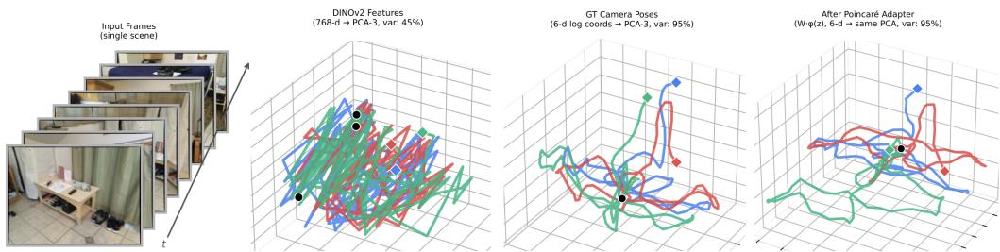  
Figure 1: Overview: we investigate whether vision features are aligned with the geometry of Euclidean transformations, as captured by motion (trajectories) within a static scene (left). While raw features are chaotic and tangled (middle left), we show that a lightweight network that we call the “Poincaré adapter” can identify the subspace of the feature space, associated with spatial motion, and unroll it to closely follow the ground truth camera trajectories (middle right and right).

The key characteristics of Euclidean space are its low-dimensionality (6D for position and camera orientation), and its homogeneity, e.g., relative displacements have the same meaning regardless of the position in space. This is seemingly in contrast to vision features which are both high-dimensional and fundamentally tied to visual content. It is thus not obvious a priori whether such a low-dimensional, homogeneous coordinate system resides in the visual features of even the most powerful models.

To answer this question, we define an appropriate protocol and test several vision foundation models on static scenes taken from diverse datasets. Our experiments show that information contained in several purely self-supervised image models, when probed correctly, possesses a remarkably strong alignment with the spatial structures of SE(3) — so these models are able to “see” SE(3). We build on this insight to propose efficient ways to regress camera motion and to enable closed-form latent visual navigation. The key contributions of this work are:

1. We formulate the problem of inferring the structure of 3D space from visual features, by comparing their structure to the group of Euclidean transformations SE(3), and introduce several probes to evaluate the performance of a range of encoders with respect to this task.

2. We show that while no features are directly isomorphic to SE(3) even locally, this structure can nevertheless be extracted using a lightweight Siamese decoder that we call the “Poincaré adapter,” which produces a homogeneous coordinate system.

3. We provide a theoretical analysis of the conditions under which self-supervised methods can recover geometric structure, and investigate the difficulty of recovering different components of SE(3) — for example, we show that rotation is easier to encode than translation. We also establish the necessary conditions for the emergence of geometric structure through a large ablation comparing different variants of vision features trained on the same dataset.

4. Building on this insight, we introduce a novel closed-form visual navigation approach, which exploits the linearization enabled by our Poincaré adapter.

Overall, our work investigates the conditions for the emergence of the 3D spatial structure within vision-based architectures. Furthermore, these insights are related to Visual Navigation Models [17, 18, 19] and Navigation World Models [20, 21] by identifying the geometry that underlies spatial reasoning and navigation in the latent space.

## 2 Related Work

Probing 3D Awareness. Our work is closely related to the recent literature on probing the 3D awareness of vision foundation models. For example, Probe3D [13] proposed a protocol and evaluated a range of vision models on depth and surface normals, as well as multi-view feature consistency (keypoint matching). Similarly, You et al. [22] demonstrated that multi-view feature consistency is strongly correlated with improved performance on various downstream tasks, while Amir et al. [23] showed that self-supervised ViT features serve as effective dense visual descriptors for keypoint correspondence. Huang et al. [24] evaluated a range of vision models by estimating multiple

3D properties from their features via shallow read-outs, while Man et al. [25] performed a similar analysis in the context of scenes, by considering both low-level geometric as well as semantic 3D tasks. Other works have probed for viewer-centric properties such as depth (e.g., [26, 27] among many others). Our work is fundamentally different from all these efforts, in that we focus on the underlying structure of the vision features themselves, and specifically on the presence of a homogeneous spatial coordinate system within them, which, we argue, is the hallmark of intrinsic geometric discovery.

Explicit 3D Reconstruction and Visual Odometry. The field of explicit 3D estimation has seen rapid progress with models like DUSt3R [15] and VGGT [16]. These approaches treat 3D reconstruction as a sequence-to-sequence problem, employing heavy Transformer architectures to “compute” geometry from features. Similarly, classical Visual Odometry (VO) [28] explicitly solves for pose. However, these approaches typically employ high-capacity decoders, which might demonstrate that geometric information exists within the features, but do not reveal whether visual features are organized and structured in a way that reflects Euclidean 3D space.

Closely related to our goals is RUST [29], which demonstrated that a generative model trained on static scenes naturally organizes its latent space into a geometric structure isomorphic to physical camera parameters. Our work broadens this by asking if discriminative models trained on arbitrary, diverse data (like ImageNet or YouTube) can also discover this geometric substructure for static scenes. Interestingly, related recent work by Mitchel et al. [30] shows that in the context of Novel View Synthesis, letting the network “discover” pose space through transferability, rather than imposing it a priori leads to better performance.

Cognitive and Neuroscientific Foundations. Our investigation is also motivated by the work of Hénaff et al. [31], who demonstrated that the primary visual cortex (V1) transforms curved video trajectories into “straighter” paths—a hypothesis recently extended to learned world models [32] in the temporal domain. We ask whether vision foundation models perform a similar linearization to recover the 6D generators of rigid motion. Our finding that a “Visual Grid Code” emerges in passive, motionless observers challenges the prevailing view that grid-cell-like representations require active motor agency for path integration [33, 34].

Visual Navigation Models and Navigation World Models. Our work is also related to Visual Navigation Models (VNMs) [35, 36, 17, 18, 37, 19] and Navigation World Models [20, 38, 21, 32]. The former typically take a source and target frame and output a set of actions to reach the target from the source without building a map, while the latter (NWMs) are typically tasked with predicting the next visual state or observation given a current state and a simulated action. Although our work does not directly deal with action selection, these two problems are closely related to our pose linearization and latent space navigation (Section 4 below). Furthermore, both VNMs and NWMs have so far been driven primarily by architectural and scaling advances. Instead, our work aims to establish and improve the fundamental mechanisms that enable navigation and prediction in vision feature space.

## 3 Background and Motivation

The overall objective of our work is to study the structure of vision features and to relate it to the group of Euclidean transformations. To make the problem well-posed, we consider static scenes, where the mapping from camera pose to an image (and thus feature) is stable and well-defined.

Problem Statement. Let $s$ be a static scene observed by a moving camera across time t. An encoder $f _ { \theta }$ maps the image $I _ { t }$ at time t to a high-dimensional feature vector $z _ { t } = f _ { \theta } ( I _ { t } )$ . Our goal is to determine if these features reflect the structure of Euclidean transformations the camera undergoes.

In particular, we consider image acquisition as a sampling process $\mathcal { U } \to \mathbb { R } ^ { d }$ from the camera pose space $\mathcal { U } \subseteq S E ( 3 )$ to the feature space $\mathbb { R } ^ { d }$ . For a static scene, this process is defined via composition $P _ { t } \to I _ { t } \to z _ { t } .$ , where $P _ { t } \in \mathcal { U }$ is the camera-to-world pose at time $t , I _ { t }$ is the image associated with that pose, and $z _ { t }$ is the vision feature. After assembling the set of features $\mathcal { Z } = \{ \breve { z } _ { t } \} _ { t = 1 \ldots N }$ we then compare the properties of the point set $\mathcal { Z }$ to the structure of $S E ( 3 )$ , as defined by the set $\{ P _ { t } \}$

Topology Consistency and Submanifold Dimensionality. We first evaluate whether the topology of the feature point set $\left\{ { z } _ { t } \right\}$ locally respects the topology of $S E ( 3 )$ by comparing the nearest neighbors in the feature space to nearest neighbors in camera pose space (metric M1 below). We then evaluate whether $\{ z _ { t } \}$ locally forms a 6D manifold (metric M2 below).

Geometry – Local Linearization and Lie Algebra. Most importantly, we are interested in evaluating whether $\left\{ { z } _ { t } \right\}$ (or a projection of it) captures the geometry of $S E ( 3 )$ , or, more precisely, whether it is isomorphic to $S E ( 3 )$ . Unfortunately, it is generally impossible to construct a global isomorphic representation of $S E ( 3 )$ with additive operations in $\mathbb { R } ^ { d }$ , regardless of the dimensionality d (see $\mathrm { e . g . , [ 3 9 , 4 0 ] ) }$ . We thus focus on recovering the structure of $S E ( 3 )$ locally. This aligns with the concept of “straightening” proposed by Hénaff et al. [31], which suggests that the visual cortex transforms non-linear pixel-space trajectories into straighter paths. This behavior has been investigated in the context of temporal straightening (e.g., [41, 42, 43, 32]), whereas we ask if the “straight” paths in latent space correspond to the generators of rigid body motion.

Formally, we let $P _ { t } , P _ { t + s } \in S E ( 3 )$ be the camera-to-world pose matrices at frames t and $t + s .$ . The relative transformation between them is given by $P _ { r e l } = P _ { t } ^ { - 1 } P _ { t + s }$ . We map this relative pose to its tangent vector $\Delta P$ in the Lie Algebra $\mathfrak { s e } ( 3 )$ using the matrix logarithm:

$$
\Delta P = \left(\operatorname{Log} (P _ {t} ^ {- 1} P _ {t + s})\right) ^ {\vee} \in \mathbb {R} ^ {6}.\tag{1}
$$

Here, $\Delta P$ is a 6-dimensional vector comprising 3 translational velocities and 3 rotational velocities (axis-angle), and ∨ is the vee operator, which extracts the 6D twist coordinates from the 4×4 matrix in $\mathfrak { s e } ( 3 )$ . We argue that if the latent space is geometrically structured, there should exist a fixed and uniform (i.e., applicable for every point in space) linear operator $W$ such that:

$$
\Delta P \approx W (z _ {t + s} - z _ {t}).\tag{2}
$$

The requirement for W to be linear ensures that the latent space itself supports vector arithmetic isomorphic to the tangent space of $S E ( 3 )$ .

Space Discovery. To link this optimization problem to the original Poincaré task, suppose $\Delta P =$ $\bar { W } ( z _ { t + s } - z _ { t } )$ . Since $W \in \mathbb { R } ^ { 6 \times d }$ , this implies that transitions in the feature space z can be decomposed into a 6D row space of W (“changes of position”). Crucially, the modifications within this subspace are homogeneous: i.e., the difference vectors $z _ { t + s } - z _ { t }$ , after projection, can be captured by the same set of 6 basis vectors, regardless of t. This means that, by isolating such a subspace an agent can, in principle, discover the primary degrees of freedom in the 3D physical world, and those degrees of freedom have a consistent meaning irrespective of the visual content observed.

## 4 Protocol

We evaluate a range of vision encoders on static scenes from ScanNet [44], ARKitScenes [45], TUM RGB-D [46], 12 Scenes [47], and 7 Scenes [48] datasets. As mentioned above, we introduce several metrics of increasing complexity to probe spatial awareness of vision models.

Metric 1 (M1): Topological Alignment. We use the mutual k-nn alignment metric [49, 50] to eval uate the similarity between neighborhoods in the visual feature and camera pose spaces, respectively. While previous works have used it to compare signals as captured by different encoders (vision vs. text), here we adapt this metric to compare vision encoders directly to spatial transformations as captured by camera motion in a static scene. We describe our precise protocol in Appendix Sec. A.1.

Metric 2 (M2): Intrinsic Dimensionality (ID). We estimate the Local Intrinsic Dimensionality using MLE [51] and Two-NN [52] estimators. An intrinsic dimensionality closer to 6 suggests a representation that potentially captures the underlying degrees of freedom.

Note that both metrics M1 and M2 are training-free and directly evaluate the structural similarity between the feature space of different encoders and camera pose space. While the results depend on the choice of representation for camera pose, we found that the relative ordering of different vision encoders is remarkably robust across different representations.

Metric 3 (M3): Linear Equivariance. We test if the feature space is globally Euclidean. For this, we train a linear regressor $\mathbf { \bar { \theta } } _ { W }$ to predict the relative pose change $\Delta P$ from the feature difference: $\Delta P \approx W ( z _ { t + s } - \overline { { z } } _ { t } )$ across frames separated by stride s. Success here implies the manifold is natively flat. The regression targets are standardized (zero mean, unit variance) per component to account for scale differences between translational and rotational units (see Appendix A.2 for details).

Metric 4 (M4): The Poincaré Adapter. Since the metric M3 above imposes a restrictive linear constraint, we introduce a lightweight, trainable adapter $\varphi _ { \theta }$ (an MLP) in a Siamese manner:

$$
\Delta P \approx W (\varphi_ {\theta} (z _ {t + s}) - \varphi_ {\theta} (z _ {t}))\tag{3}
$$

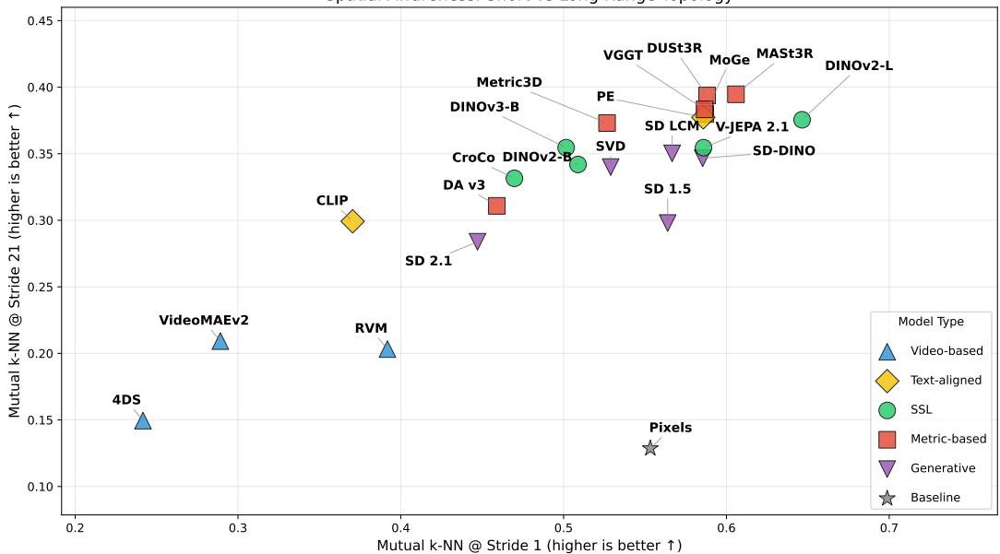  
Figure 2: Mutual k-nn Alignment (M1). Alignment between camera poses and vision features for short (x axis) and long (y axis) strides on ScanNet. The former captures pixel-level dependencies, while the latter is more indicative of spatial awareness. Explicit geometric models (DUSt3R, MoGe) achieve high alignment. Among self-supervised models, DINO-family encoders show emergent spatial topology, while video models (4DS, RVM) struggle to maintain a consistent spatial embedding.

We call the network $\varphi _ { \theta }$ a “Poincaré Adapter,” since its goal is to unroll the non-linear feature space to construct a homogeneous coordinate system, where changes of pose become linear. We emphasize that the adapter network $\varphi$ is applied independently to any latent vector z, thus allowing a restructuring of the latent space to reveal the $S E ( 3 )$ geometry. Please see Figure 1 for a qualitative illustration. The full training and implementation details are provided in Appendix A.2. Although Eq. (3) is our main formulation, we investigate several alternatives in Section 6 and Appendix $_ { \mathrm { A . 5 } }$

Following recent work (e.g., [53]), which has shown that intermediate layers of vision models tend to carry more geometric awareness, for all metrics M1-M4, we perform a layer sweep across the encoder blocks to achieve the best performance.

## 4.1 Application: Latent Space Navigation

As a proof of concept enabled by our study, we apply our approach to Latent Space Navigation. The key idea is that, if the visual latent space can be structured to reflect the local topology of $\bar { S } E ( 3 )$ then an agent should be able to “imagine” the visual consequence of a physical movement without requiring explicit 3D reconstruction. This objective relates to both latent novel view synthesis [7, 54], and, more closely, to Navigation World Models [20, 21]. Unlike both of these frameworks, our goal is not to synthesize views, however, but rather to show that navigation can be greatly simplified (reduced to vector arithmetic) after identifying the appropriate camera-aligned linear feature subspace.

Formally, given the adapted feature $g _ { t } = \varphi _ { \theta } ( z _ { t } )$ of a starting frame and a desired physical displacement (pose change) $\Delta \bar { P } .$ , our goal is to predict the feature representation of the destination frame, $\hat { g } _ { t + s }$ by inverting the Poincaré Adapter. We evaluate a completely training-free navigator (which we call Inverse Poincaré). Since our adapter projects features such that $\Delta \bar { P } \approx W ( g _ { t + s } - g _ { t } )$ , (where $g _ { t } = \varphi _ { \theta } ( z _ { t } )$ as in Eq. (3)), we can linearly invert this relationship:

$$
\hat {g} _ {t + s} = g _ {t} + W ^ {\dagger} \Delta P,\tag{4}
$$

where $W ^ { \dagger }$ is the pseudo-inverse of the linear projection weights. We compare this approach to parametric correctors (e.g., Linear, MLP, and Attention layers) trained to predict $\hat { g } _ { t + s }$ from the concatenated input $[ g _ { t } ; \Delta \bar { P } ]$ . To give the networks a strong geometric foundation, the higher-capacity models (MLP and Attention) are constructed to predict a non-linear residual correction on top of the baseline prediction $( \mathrm { i . e . , } \ \hat { g } _ { t + s } = g _ { t } + W ^ { \dagger } \Delta P + \mathrm { N e t } ( [ g _ { t } ; \Delta P ] ) )$ ).

<table><tr><td>Metric</td><td>Pixels</td><td>CroCo [55]</td><td>DINOv2-B [56]</td><td>DINOv3-B [57]</td><td>DUSt3R [15]</td><td>V-JEPA [21]</td><td>VGGT-L [16]</td></tr><tr><td>ID (TwoNN)</td><td>5.01</td><td>7.66</td><td>9.15</td><td>10.76</td><td>7.16</td><td>9.55</td><td>7.74</td></tr><tr><td>ID (MLE)</td><td>4.03</td><td>5.92</td><td>6.41</td><td>7.88</td><td>4.40</td><td>5.13</td><td>5.36</td></tr><tr><td> $R^2$ (M3)</td><td>-5.29</td><td>-0.42</td><td>-0.28</td><td>-0.26</td><td>-0.22</td><td>0.09</td><td>-0.09</td></tr></table>

Table 1: Intrinsic Dimension & Linear Equivariance. Representative models compared on intrinsic dimension (TwoNN and MLE) and raw linear readout $\hat { R ^ { 2 } }$ (M3). Values correspond to the layer maximizing M3 performance. We provide the full table with 18 different models in Appendix A.3.

To evaluate navigation success, we perform a nearest-neighbor retrieval task. We query the test set of unseen scene frames using the predicted $\hat { g } _ { t + s }$ via $L _ { 2 }$ distance in the adapted feature space, and measure Pose-Error Hits (Hit@ϵ). For each frame, we compute the $L _ { 2 }$ distance between the raw 6D twist vectors (3D translation in meters + 3D axis-angle rotation in radians) of the target and retrieved relative poses. As this distance mixes translation and rotation, the thresholds $\epsilon \in \{ 0 . 1 , 0 . 2 , 0 . 3 , 0 . 5 \}$ correspond approximately to a pure translation error of ϵ m, a pure rotation error of ϵ rad, or some combination thereof. Hit@ϵ reports the fraction of retrievals for which this distance is below ϵ.

## 5 Main Results

We first evaluate a diverse set of vision foundation models on static scenes from ScanNet [44]. Our evaluation suite includes: patchified Raw Pixels (baseline), CLIP [58], DINOv2 [56], DI-NOv3 [57], CroCo [55] (3D-pretext SSL), V-JEPA 2.1 [21], against explicit geometric foundation models DUSt3R [15] and MoGe [59]. We also evaluated Depth Anything v3 [60], Perception Encoder [61], Metric3d v2 [62], and generative models: Stable Diffusion SD 1.5 DDIM and SD 2.1 DDIM features, [63, 64], LCM DDIM [65, 63, 64], SD-DINO VAE and SD-DINO UNet features [66], Stable Video Diffusion (SVD) [67], as well as several video models: VideoMAEv2 [68], RVM (Recurrent Video Masked autoencoders) [69] and the base variant from the 4DS family [70].

Topological Alignment (Metric M1). We first evaluate if the neighborhood structure of the visual latent space mirrors the neighborhood structure of the physical world. We use the mutual k-nn alignment score described in Appendix A.1, across both short and long temporal strides. A higher stride introduces larger viewpoint changes, reducing pixel overlap and testing global spatial awareness.

As shown in Figure 2, models explicitly trained with geometric objectives (DUSt3R, MoGe, MASt3R) achieve the highest alignment scores (≈ 0.35 − 0.40) at high strides. This highlights that their representations map visual inputs to a metric-aligned coordinate system. Interestingly, although most of these methods require a decoder to regress camera pose, our results show that the encoder itself tends to structure the latent space to align with the structure of the pose space.

Perhaps more surprisingly, among purely self-supervised vision models, DINOv2 and DINOv3 exhibit remarkably strong topological alignment (≈ 0.38), significantly outperforming other baselines and Raw Pixels. Crucially, this structure emerges purely from passive image-level self-supervision, without explicit depth or pose signals. We also note that video models (VideoMAE, RVM, 4DS) perform less successfully on this metric (≈ 0.15 − 0.25). We hypothesize that while these models cap ture temporal motion, their latent states are highly context-dependent (entangled with the generative trajectory) and fail to form a stable, globally consistent spatial map of the static environment.

Geometry of Raw Features (Metrics M2 & M3). We estimate the Local Intrinsic Dimensionality (ID) using both Two-NN and MLE estimators. Theoretically, a perfectly space-aligned representation of a static scene viewed by a moving camera should have an ID of ≈ 6. As shown in Table 1, most encoders result in features with intrinsic dimensionality around 6 (we justify this effect theoretically in Section 6). We observe that DINOv2 and DINOv3 exhibit higher IDs (≈ 5.8 − 10.0), reflecting a richer semantic manifold that has expanded beyond simple pixel correlations. CroCo, which is pre-trained with explicit 3D cross-view completion, shows a lower ID (≈ 5.9, MLE) closer to the physical degrees of freedom.

We then test if physical displacements $\Delta P$ can be recovered via a global linear projection $\Delta P \approx$ $W ( z _ { t + s } - z _ { t } )$ . As reported in Table 1, models generally fail this test, yielding negative or near-zero $R ^ { 2 }$ scores (e.g., DINOv2 $R ^ { 2 } \approx - 0 . 2 8$ , Pixels $R ^ { 2 } \approx - 5 . 2 9 )$ . This confirms that the “Manifold of Vision” is natively curved; standard vector arithmetic on raw features does not correspond to physical motion. We provide a full comparison across a wide range of models in Appendix A.3.

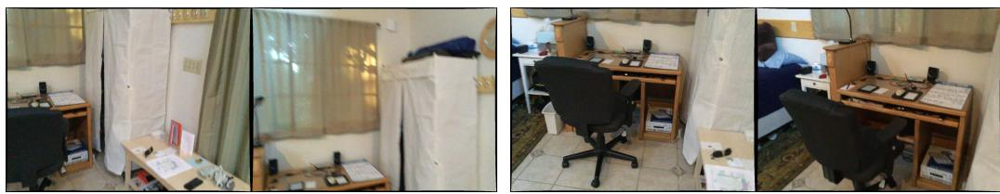  
Figure 3: Example frame pairs from ScanNet. The frames within each of these two pairs are separated by a stride of s = 40 frames, illustrating the typical viewpoint change that the Poincaré adapter must decode.

Best adapter R2 vs frame stride (all models, best layer per s)  
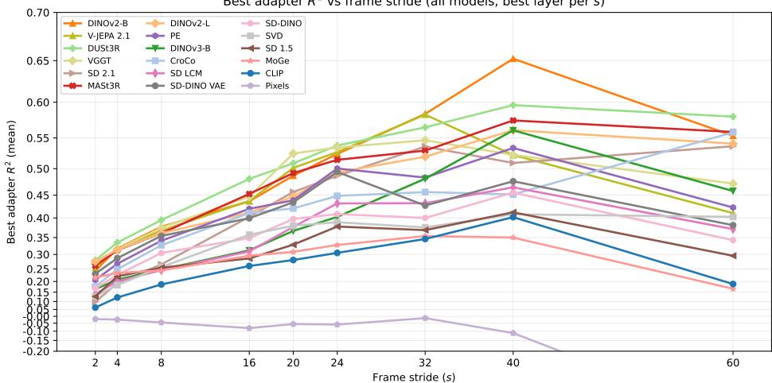  
Figure 4: Poincaré Adapter (M4). Quantitative evaluation across a range of encoders and frame strides s. We evaluate whether changes in the latent features as observed across s frames can be linearly mapped to changes in camera pose.

Emergence of Linear Structure (Metric M4). As shown above, Metrics M2 and M3 do not tend to differentiate vision encoders because they are, respectively, too easy (most models have ID close to 6) and too hard (no model possesses an easily linearizable subspace aligned with motion). We thus focus on the Poincaré Adapter described in Eq. (3). Example input frame pairs (Figure 3) illustrate the typical viewpoint change across a stride of s=40 frames in ScanNet [44].

Remarkably, by applying a lightweight Siamese MLP adapter $\varphi ,$ we recover strong linear equivariance. As shown in Figure 4, DINOv2 achieves strong performance, reaching test set ${ \check { R } } ^ { 2 } \approx 0 . 6 { \dot { 5 } } .$ averaged over 3 scenes from ScanNet. This implies that the latent space contains a locally Euclidean submanifold isomorphic to SE(3)—effectively a “Visual Grid Code”—which can be accessed via a non-linear projection. Notably, CroCo, despite being trained with explicit 3D tasks, underperforms DINOv2 $( \dot { R } ^ { 2 } \tilde { \approx } 0 . 3 8 )$ , suggesting that massive passive observation (DINOv2’s scale) may be more effective for discovering spatial laws than smaller-scale explicit 3D pre-training

We also note that topological alignment already emerges without any training (M1), and that raw pixels remain strongly negative ${ \check { R } } ^ { 2 }$ even with the adapter (Figure 4), confirming that the decodable structure arises in and is dependent on the properties of learned features.

To provide a complete picture of geometric decodability across different environments, we summarize the results of 5 different datasets in Table 2. We compare the three representative foundation models (DINOv2, V-JEPA, DUSt3R) and average decodability metrics within each dataset. Overall, we note that V-JEPA 2.1 [21] and DUSt3R [15] possess, on average, the strongest geometric awareness. We also remark that the difficulty of decoding the spatial structure is highly dependent on the environment, and present a scene difficulty analysis in Sec. A.4.

Generalization and Scaling. To understand how geometric awareness generalizes, we trained Poincaré adapters on varying numbers of ScanNet rooms $( N \in \{ 5 , 1 0 , 1 5 , \ldots , 2 0 0 \} )$ ) and evaluated them zero-shot on a fixed set of 31 held-out rooms. As shown in Figure 5, generalization improves monotonically with scale across multiple vision foundation models (DINOv2, V-JEPA, DUSt3R) despite their different pre-training objectives. For example, the fraction of rooms where the zero-shot adapter recovers a positive $R ^ { 2 }$ signal grows from roughly 18% at $N = 5$ to 50% at $N = 2 0 0$ , while the overall recoverable signal increases accordingly. Notably, these scaling curves do not plateau at $N = 2 0 0$ , confirming that geometric awareness is a scalable, universal emergent property of vision transformers that transfers to unseen environments.

<table><tr><td rowspan="2">Dataset</td><td rowspan="2">Scenes</td><td colspan="3">V-JEPA 2.1 [21]</td><td colspan="3">DUSt3R [15]</td><td colspan="3">DINOv2 [56]</td></tr><tr><td>Max  $R^2$ </td><td> $R^2 > 0$ </td><td> $R^2 > 0.3$ </td><td>Max  $R^2$ </td><td> $R^2 > 0$ </td><td> $R^2 > 0.3$ </td><td>Max  $R^2$ </td><td> $R^2 > 0$ </td><td> $R^2 > 0.3$ </td></tr><tr><td>12-Scenes [47]</td><td>10</td><td>0.803</td><td>100%</td><td>70%</td><td>0.789</td><td>90%</td><td>80%</td><td>0.682</td><td>80%</td><td>50%</td></tr><tr><td>ScanNet [44]</td><td>707</td><td>0.735</td><td>35%</td><td>4%</td><td>0.711</td><td>37%</td><td>6%</td><td>0.673</td><td>31%</td><td>3%</td></tr><tr><td>ARKitScenes [45]</td><td>133</td><td>0.344</td><td>51%</td><td>3%</td><td>0.412</td><td>50%</td><td>4%</td><td>0.339</td><td>47%</td><td>1%</td></tr><tr><td>TUM RGB-D [46]</td><td>17</td><td>0.337</td><td>41%</td><td>12%</td><td>0.435</td><td>41%</td><td>18%</td><td>0.348</td><td>35%</td><td>12%</td></tr><tr><td>7-Scenes [48]</td><td>46</td><td>0.254</td><td>4%</td><td>0%</td><td>0.320</td><td>7%</td><td>2%</td><td>0.331</td><td>2%</td><td>2%</td></tr></table>

Table 2: Overall Dataset Success Rates (M4). Aggregate performance metrics across all evaluated rooms and representative model backbones. The results highlight that datasets with clean bundleadjusted poses and dense captures (e.g., 12-Scenes) achieve near-perfect decodability, whereas sparse or noisy datasets (e.g., single-scan ARKitScenes) exhibit much lower success rates.

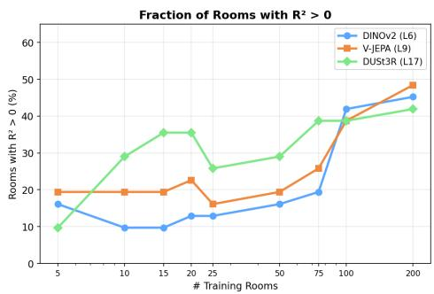

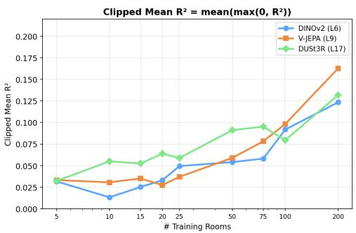  
Figure 5: Generalization and Scaling (M4). Evaluation of zero-shot pose recovery on 31 unseen test rooms as a function of the number of training rooms (N ). Left: The fraction of successfully recovered rooms $( \mathrm { T o p } { \cdot } R ^ { 2 } > 0 )$ increases monotonically. Right: The total recoverable signal (Clipped Mean $R ^ { 2 } )$ grows substantially without plateauing.

## 5.1 Latent Space Navigation

Building upon the linear structure revealed by the Poincaré Adapter, we test our Latent Space Navigation proof-of-concept using the intermediate features of DINOv2 (Layer 7) and the explicitly geometric DUSt3R (Layer 16). The results, averaged across multiple scenes, are summarized in Table 3. We include an Identity baseline that simply returns the source frame’s feature $( \widehat { g } _ { t + s } = g _ { t } , \mathrm { i . e . }$ no navigation at all) to calibrate the difficulty of the task. We compare the training-free “Inv. Poincaré” approach—which simply adds the pseudo-inverse scaled pose displacement to the current feature $( \bar { g } _ { t } + W ^ { \dagger } \Delta P )$ )—against a learned Attention corrector for both backbones. As shown in Table 3, the zero-shot Inv. Poincaré approach yields highly competitive retrieval, significantly outperforming the static Identity baseline at all scales. While the Attention corrector achieves better regression metrics $( R ^ { 2 } )$ , it lags behind Inv. Poincaré in physical region retrieval, suggesting that simple vector arithmetic is sufficient to move the observer to the correct spatial neighborhood. A full comparison including additional correctors is provided in Appendix Table 9.

Cross-Room Generalization. We extend our navigation evaluation to 31 unseen test rooms to test generalizability. While the zero-shot pseudo-inverse $( W ^ { \dagger } )$ correctly retrieves frames better than Identity in roughly 60% of rooms, adapting it using a Ridge-Refit (fitting only the linear mapping component of $\bar { \Delta } \dot { P _ { \mathrm { } } }  \Delta g$ on the test room, given a frozen adapter) pushes navigation success to 90– 94% across DINOv2, DUSt3R, and V-JEPA backbones. This demonstrates that the adapter discovers a geometrically structured manifold that is robust even across entirely different environments.

We also note that this linear structure allows for Multi-Step Navigation in the latent space. Given a source and a target frame from an unseen test room, we split the desired pose displacement $\Delta P$ into S equal sub-steps and iteratively apply the adapter in an open-loop fashion to generate intermediate latent features, without generating any pixels. We then retrieve the nearest neighbor frame from the test set. We note that for moderate displacements $( \mathrm { e . g . , 0 . 6 8 m , 1 9 ^ { \circ } } )$ in the 12 Scenes dataset [47], the 4-step retrieved trajectory reaches the exact target frame. Even for extreme displacements (e.g.,

<table><tr><td>Backbone</td><td>Method</td><td>MSE (↓)</td><td> $R^{2}$ (↑)</td><td>Top-1 (↑)</td><td>Hit@0.1 (↑)</td><td>Hit@0.2 (↑)</td><td>Hit@0.3 (↑)</td><td>Hit@0.5 (↑)</td></tr><tr><td>DINOv2</td><td>Identity</td><td>0.578</td><td>-0.323</td><td>0.000</td><td>0.090</td><td>0.204</td><td>0.302</td><td>0.523</td></tr><tr><td>DINOv2</td><td>Inv. Poincaré</td><td>0.350</td><td>0.199</td><td>0.041</td><td>0.252</td><td>0.479</td><td>0.628</td><td>0.741</td></tr><tr><td>DINOv2</td><td>+ Attention</td><td>0.258</td><td>0.407</td><td>0.018</td><td>0.167</td><td>0.323</td><td>0.383</td><td>0.422</td></tr><tr><td>DUSt3R</td><td>Inv. Poincaré</td><td>0.226</td><td>0.155</td><td>0.030</td><td>0.216</td><td>0.346</td><td>0.467</td><td>0.629</td></tr><tr><td>DUSt3R</td><td>+ Attention</td><td>0.108</td><td>0.597</td><td>0.024</td><td>0.201</td><td>0.357</td><td>0.455</td><td>0.535</td></tr></table>

Table 3: Latent Space Navigation Results (Averaged over 3 scenes). The Identity baseline (no navigation) calibrates task difficulty. The zero-shot Inv. Poincaré approach dominates in topological retrieval (Hit@ϵ) despite the Attention corrector achieving better regression metrics (R2).

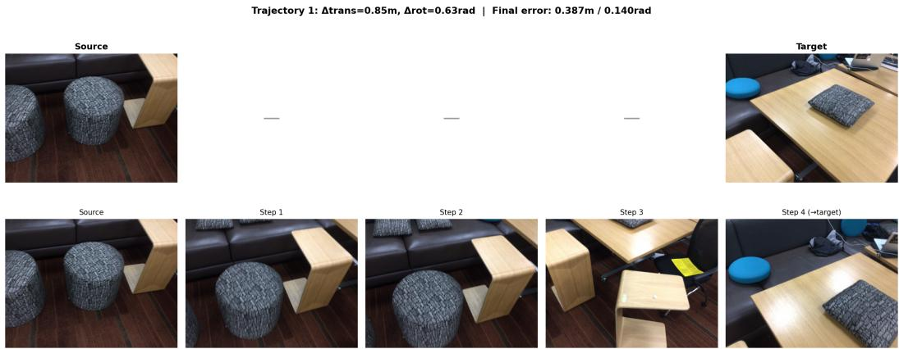  
Figure 6: Multi-Step Latent Navigation. A 4-step open-loop trajectory $( \Delta P = 0 . 8 5 \mathrm { m } , 3 6 ^ { \circ } )$ . The path drifts slightly due to the open-loop integration, but the retrieved frames remain visually coherent and successfully approach the target view.

2.45m, 37◦), the path remains semantically coherent and rotation recovery remains highly precise $( < 5 ^ { \circ }$ error), although translation drift accumulates. Figure 6 shows a representative trajectory, and further examples are provided in Appendix A.11. This confirms the feasibility of open-loop latent planning over extended paths. We also explore extending the single-chart adapter to a Mixture-of-Experts (MoE) architecture, described in Appendix A.11.

## 6 Analysis

Going back to the original Poincaré question formulated in the introduction, our findings suggest that the answer is: Yes, a motionless observer can discover space, but only up to a nonlinear unwrapping that a simple adapter can undo. In this section we provide a more in-depth analysis of both the theoretical underpinnings of this behavior and the practical conditions under which it arises. Full derivations, proofs, and detailed tables are deferred to the Appendix.

Probe design is important. We compare the Poincaré adapter against four alternative formulations for pose recovery from frozen DINOv2-B features (Appendix A.5, Table 6). Three design choices prove to be important. First, Lie algebra linearization: predicting the 6D twist vector via a linear readout W outperforms SE(3) matrix regression $( R ^ { 2 } = \dot { 0 . 6 } 1 { \mathrm { v s . } } - \mathsf { \bar { 0 } } . 4 3 )$ , confirming that the adapted feature differences are naturally aligned with the tangent space of $S E ( 3 )$ . Second, predicting absolute poses fails entirely $( R ^ { 2 } = - \mathrm { \bar { 1 } } . 7 5 )$ , indicating that DINOv2 encodes relational structure between views, not scene-specific locations. Lastly, Siamese structure: applying the adapter independently to each feature before subtraction $( \varphi ( z _ { 2 } ) - \varphi ( z _ { 1 } ) )$ outperforms operating on the raw difference $( \varphi ( z _ { 2 } - z _ { 1 } ) )$ by $\Delta R ^ { 2 } = + 0 . 1 3$ , with translation magnitude collapsing from +0.60 to −0.08 without it. The Siamese design enforces homogeneity: each feature is normalized into a common coordinate frame before comparison.

Why does the adapter work? In the Appendix Sec. A.7, we provide a formal analysis of the conditions under which the Poincaré adapter recovers SE(3) displacements. We show (Theorem 3) that any smooth encoder whose Jacobian has rank 6 admits a local linear readout. We then analyze global decodability: when does a single W work across all poses? We show (Theorem 5a–b) that the error is controlled by the curvature of the feature manifold, as measured by the variation of the feature encoder’s Jacobian across poses. A nonlinear adapter $\varphi$ removes the feature-manifold curvature entirely by “unrolling” the curved manifold into a flat coordinate patch (Theorem 5c); a residual from the non-commutativity of SE(3) remains, whose rotational component vanishes for pure translational displacements and which is small when the angular extent of the region is modest—consistent with the observed $R ^ { 2 } \approx 0 . 6 1$ where raw linear decoding fails $( R ^ { 2 } < 0 )$ ). We note that on the training set, $R ^ { 2 }$ exceeds 0.9, suggesting that the remaining gap is due to generalization rather than a structural ceiling of the problem formulation.

We also study the relative difficulty of recovering different $S E ( 3 )$ components by decomposing the Poincaré adapter’s output into rotation (3 DoF), translation direction (2 DoF), and translation magnitude (1 DoF). Across a sweep of 3,328 adapter configurations (varying bottleneck dimension, learning rate, and loss type) evaluated over multiple random seeds on frozen DINOv2-B features, a consistent pattern emerges (detailed in Appendix A.6): rotation is reliably decodable (positive $R ^ { 2 }$ in 88% of configurations), while translation magnitude is not (positive in only 27%, with 6× the seed standard deviation). With a well-tuned adapter, all components achieve comparable $R ^ { 2 }$ (Table 8: 0.63 trans, 0.59 rot for pretrained $\operatorname { D I N O v } 2 \mathbf { - B } )$ , but translation magnitude is far more sensitive to hyperparameters and initialization. This asymmetry has a geometric origin (Theorem 7): rotational optical flow depends only on pixel coordinates and focal length, while translational flow scales as $1 / Z$ with scene depth—introducing an additional source of Jacobian variation that makes translation harder to decode reliably. Translation magnitude is further confounded with depth via the rescaling invariance $( v , Z ) \mapsto ( \lambda v , \lambda Z )$ , making ∥v∥ unrecoverable without metric priors.

Model training – topology is stable; geometry is fragile. To identify the necessary training conditions, we train 25 DINOv2-B checkpoints from scratch on frames taken from a single walking tour video (using the setup introduced in [71]). We perform systematic ablations across the main DINOv2 hyperparameters to investigate the necessary conditions for the emergence of geometric structure in the feature extractor (Table 8). We make several observations. First, mutual k-nn alignment (metric M1) is stable across recipes $( \mathbf { M } { - } k { \mathrm { - n n } } \in [ 0 . 3 5 , 0 . 4 2 ] )$ , while Poincaré $R ^ { 2 }$ ranges from 0.08 to 0.47—even four identical runs yield $R ^ { 2 } \in [ \bar { 0 . 0 8 } , 0 . 3 5 ]$ with $\mathsf { M } \mathrm { - } k \mathrm { - } \mathsf { n n } = 0 . 3 8 \pm 0 . 0 1$ The sole ablation that degrades topology is removing DINO self-distillation (M-k-nn drops to 0.24); reducing batch size to 128 collapses manifold formation entirely $( \mathbf { M } { - } k { \ - } \mathbf { n } \mathbf { n } = \ 0 . 1 5 )$ . Data scale is the dominant factor for geometry: the pretrained model $( R ^ { 2 } = 0 . { \dot { 6 } } 1$ , 142M images) outperforms the best single-video checkpoint $( \bar { R ^ { 2 } } = 0 . \bar { 4 } 7 )$ ), with the gap concentrated in translation magnitude (Mag $R ^ { 2 } = + 0 . 6 0$ vs. all negatives)—consistent with Theorem 7(d): metric scale requires statistical priors over object sizes that only diverse training can provide.

## 7 Conclusion, Limitations and Future Work

In this paper, we investigated whether vision features capture the structure of Euclidean space by studying the alignment between these features and the group $S E ( 3 )$ of rigid motions. We showed that, although no encoder reflects this structure directly, it is nevertheless possible to “unroll” the feature manifold using a relatively simple adapter network in some cases. It is remarkable that visual feature changes can be mapped to pose changes by a homogeneous low-dimensional adapter that is independent of location. Interestingly, self-supervised models, while only trained through passive observation, do form a representation of 3D space, decodable when probed correctly.

One limitation of our study is that we only considered static scenes where feature changes are only associated with camera motion, and thus do not test Poincaré’s distinction between “changes of position” and “changes of state”. It would be interesting to extend our formalism and approach to dynamic scenes, which are governed by both camera motion as well as scene motion from underlying physical processes, aiming for an understanding of more profound spatio-temporal symmetries or conservation laws.

## 8 Acknowledgements

The authors would like to thank Dima Damen, João Carreira, Daniel Zoran, Gabrijel Boduljak and Andrew Zisserman for the many useful comments, discussions and feedback on this work.

## References

[1] Edward C Tolman. Cognitive maps in rats and men. Psychological review, 55(4):189, 1948. 1

[2] James J Gibson. The ecological approach to visual perception: classic edition. Psychology press, 2014. 1

[3] Roger N Shepard and Jacqueline Metzler. Mental rotation of three-dimensional objects. Science, 171(3972):701–703, 1971. 1

[4] Jean Piaget. Child’s Conception of Space: Selected Works vol 4. Routledge, 2013. 1

[5] Roberta L Klatzky. Allocentric and egocentric spatial representations: Definitions, distinctions, and interconnections. In Spatial cognition: An interdisciplinary approach to representing and processing spatial knowledge, pages 1–17. Springer, 1998. 1

[6] Johannes L Schonberger and Jan-Michael Frahm. Structure-from-motion revisited. In Proceed ings of the IEEE conference on computer vision and pattern recognition, pages 4104–4113, 2016. 1

[7] Ben Mildenhall, Pratul P Srinivasan, Matthew Tancik, Jonathan T Barron, Ravi Ramamoorthi, and Ren Ng. Nerf: Representing scenes as neural radiance fields for view synthesis. Communications of the ACM, 65(1):99–106, 2021. 1, 5

[8] Manolis Savva, Abhishek Kadian, Oleksandr Maksymets, Yili Zhao, Erik Wijmans, Bhavana Jain, Julian Straub, Jia Liu, Vladlen Koltun, Jitendra Malik, et al. Habitat: A platform for embodied ai research. In Proceedings of the IEEE/CVF international conference on computer vision, pages 9339–9347, 2019. 1

[9] Chuhan Zhang, Guillaume Le Moing, Skanda Koppula, Ignacio Rocco, Liliane Momeni, Junyu Xie, Shuyang Sun, Rahul Sukthankar, Joëlle K Barral, Raia Hadsell, et al. Efficiently reconstructing dynamic scenes one d4rt at a time. arXiv preprint arXiv:2512.08924, 2025. 1

[10] George Berkeley. An essay towards a new theory of vision. IndyPublish.com, 1709. 1

[11] Richard Held and Alan Hein. Movement-produced stimulation in the development of visually guided behavior. Journal of comparative and physiological psychology, 56(5):872, 1963. 1

[12] Henri Poincaré. Science and hypothesis. Dover Publications, 2011. 1

[13] Mohamed El Banani, Amit Raj, Kevis-Kokitsi Maninis, Abhishek Kar, Yuanzhen Li, Michael Rubinstein, Deqing Sun, Leonidas Guibas, Justin Johnson, and Varun Jampani. Probing the 3D awareness of visual foundation models. In Proceedings of the IEEE/CVF Conference on Computer Vision and Pattern Recognition, pages 21795–21806, 2024. 2

[14] Z. Teed, L. Lipson, and J. Deng. Deep patch visual odometry. In Advances in Neural Information Processing Systems (NeurIPS), volume 36, 2023. 2

[15] S. Wang, V. Leroy, Y. Cabon, B. Chidlovskii, and J. Revaud. DUSt3R: Geometric 3D vision made easy. In Proc. IEEE/CVF Conf. Comput. Vis. Pattern Recognit. (CVPR), pages 20697– 20709, 2024. 2, 3, 6, 7, 8

[16] J. Wang, M. Chen, N. Karaev, A. Vedaldi, C. Rupprecht, and D. Novotny. VGGT: Visual geometry grounded transformer. In Proc. IEEE/CVF Conf. Comput. Vis. Pattern Recognit. (CVPR), pages 5294–5306, 2025. 2, 3, 6

[17] Ajay Sridhar, Dhruv Shah, Catherine Glossop, and Sergey Levine. Nomad: Goal masked diffusion policies for navigation and exploration. In 2024 IEEE International Conference on Robotics and Automation (ICRA), pages 63–70, 2024. 2, 3

[18] Ria Doshi, Homer Walke, Oier Mees, Sudeep Dasari, and Sergey Levine. Scaling crossembodied learning: One policy for manipulation, navigation, locomotion and aviation. arXiv preprint arXiv:2408.11812, 2024. 2, 3

[19] Maeva Guerrier, Karthik Soma, Jana Pavlasek, and Giovanni Beltrame. Can vision foundation models navigate? zero-shot real-world evaluation and lessons learned. arXiv preprint arXiv:2603.25937, 2026. 2, 3

[20] Amir Bar, Gaoyue Zhou, Danny Tran, Trevor Darrell, and Yann LeCun. Navigation world models. In Proceedings of the Computer Vision and Pattern Recognition Conference, pages 15791–15801, 2025. 2, 3, 5

[21] Lorenzo Mur-Labadia, Matthew Muckley, Amir Bar, Mido Assran, Koustuv Sinha, Mike Rabbat, Yann LeCun, Nicolas Ballas, and Adrien Bardes. V-JEPA 2.1: Unlocking dense features in video self-supervised learning. arXiv preprint arXiv:2603.14482, 2026. 2, 3, 5, 6, 7, 8

[22] Yang You, Yixin Li, Congyue Deng, Yue Wang, and Leonidas Guibas. Multiview equivariance improves 3D correspondence understanding with minimal feature finetuning. arXiv preprint arXiv:2411.19458, 2024. 2

[23] Shir Amir, Yossi Gandelsman, Shai Bagon, and Tali Dekel. Deep ViT features as dense visual descriptors. arXiv preprint arXiv:2112.05814, 2(3):4, 2021. 2

[24] Zixuan Huang, Xiang Li, Zhaoyang Lv, and James M Rehg. How much 3d do video foundation models encode? arXiv preprint arXiv:2512.19949, 2025. 2

[25] Yunze Man, Shuhong Zheng, Zhipeng Bao, Martial Hebert, Liang-Yan Gui, and Yu-Xiong Wang. Lexicon3D: Probing visual foundation models for complex 3D scene understanding. Advances in Neural Information Processing Systems, 37:76819–76847, 2024. 3

[26] A. Bhattad, D. McKee, D. Hoiem, and D. A. Forsyth. StyleGAN knows normal, depth, albedo, and more. arXiv preprint arXiv:2306.00987, 2023. 3

[27] Y. Chen, F. Viégas, and M. Wattenberg. Beyond surface statistics: Scene representations in a latent diffusion model. arXiv preprint arXiv:2306.05720, 2023. 3

[28] C. Campos, R. Elvira, J. J. Gómez Rodríguez, J. M. M. Montiel, and J. D. Tardós. ORB-SLAM3: An accurate open-source library for visual, visual–inertial, and multimap SLAM. IEEE Transactions on Robotics, 37(6):1874–1890, 2021. 3

[29] Mehdi SM Sajjadi, Aravindh Mahendran, Thomas Kipf, Etienne Pot, Daniel Duckworth, Mario Luciˇ c, and Klaus Greff. Rust: Latent neural scene representations from unposed imagery. In ´ Proceedings of the IEEE/CVF Conference on Computer Vision and Pattern Recognition, pages 17297–17306, 2023. 3

[30] Thomas W Mitchel, Hyunwoo Ryu, and Vincent Sitzmann. True self-supervised novel view synthesis is transferable. arXiv preprint arXiv:2510.13063, 2025. 3

[31] Olivier J Hénaff, Yoon Bai, Julie A Charlton, Ian Nauhaus, Eero P Simoncelli, and Robbe LT Goris. Primary visual cortex straightens natural video trajectories. Nature communications, 12(1):5982, 2021. 3, 4

[32] Lucas Maes, Quentin Le Lidec, Damien Scieur, Yann LeCun, and Randall Balestriero. LeWorld Model: Stable end-to-end joint-embedding predictive architecture from pixels. arXiv preprint arXiv:2603.19312, 2026. 3, 4

[33] B. Sorscher, G. C. Mel, S. A. Ocko, L. M. Giocomo, and S. Ganguli. A unified theory for the computational and mechanistic origins of grid cells. Neuron, 111(1):121–137, 2023. 3

[34] W. Dorrell and J. Whittington. If grid cells are the answer, what is the question? a review of normative grid cell theory. arXiv preprint arXiv:2601.12424, 2026. 3

[35] Dhruv Shah, Ajay Sridhar, Arjun Bhorkar, Noriaki Hirose, and Sergey Levine. Gnm: A general navigation model to drive any robot. In 2023 IEEE International Conference on Robotics and Automation (ICRA), pages 7226–7233, 2023. 3

[36] Dhruv Shah, Ajay Sridhar, Nitish Dashora, Kyle Stachowicz, Kevin Black, Noriaki Hirose, and Sergey Levine. Vint: A foundation model for visual navigation. arXiv preprint arXiv:2306.14846, 2023. 3

[37] Hao Ren, Yiming Zeng, Zetong Bi, Zhaoliang Wan, Junlong Huang, and Hui Cheng. Prior does matter: Visual navigation via denoising diffusion bridge models. In Proceedings of the IEEE/CVF Conference on Computer Vision and Pattern Recognition, pages 12100–12110, 2025. 3

[38] Xuan Yao, Junyu Gao, and Changsheng Xu. Navmorph: A self-evolving world model for vision-and-language navigation in continuous environments. In Proceedings of the IEEE/CVF International Conference on Computer Vision, pages 5536–5546, 2025. 3

[39] R. M. Murray, Z. Li, and S. S. Sastry. A Mathematical Introduction to Robotic Manipulation. CRC Press, 1994. 4

[40] Yi Zhou, Connelly Barnes, Jingwan Lu, Jimei Yang, and Hao Li. On the continuity of rotation representations in neural networks. In Proceedings of the IEEE/CVF conference on computer vision and pattern recognition, pages 5745–5753, 2019. 4, 16

[41] Nikhil Parthasarathy, SM Eslami, Joao Carreira, and Olivier Henaff. Self-supervised video pretraining yields robust and more human-aligned visual representations. Advances in Neural Information Processing Systems, 36:65743–65765, 2023. 4

[42] Xueyan Niu, Cristina Savin, and Eero P Simoncelli. Learning predictable and robust neural representations by straightening image sequences. Advances in Neural Information Processing Systems, 37:40316–40335, 2024. 4

[43] Piyush Nitin Bagad and Andrew Zisserman. Chirality in action: Time-aware video representation learning by latent straightening. Advances in Neural Information Processing Systems, 38:92695–92726, 2026. 4

[44] A. Dai, A. X. Chang, M. Savva, M. Halber, T. Funkhouser, and M. Nießner. ScanNet: Richlyannotated 3D reconstructions of indoor scenes. In Proc. IEEE Conf. Comput. Vis. Pattern Recognit. (CVPR), pages 5828–5839, 2017. 4, 6, 7, 8

[45] Gilad Baruch, Zhuoyuan Chen, Afshin Dehghan, Tal Dimry, Yuri Feigin, Peter Fu, Thomas Gebauer, Brandon Joffe, Daniel Kurz, Arik Schwartz, et al. ARKitScenes: A diverse realworld dataset for 3D indoor scene understanding using mobile RGB-D data. arXiv preprint arXiv:2111.08897, 2021. 4, 8

[46] Jürgen Sturm, Nikolas Engelhard, Felix Endres, Wolfram Burgard, and Daniel Cremers. A benchmark for the evaluation of rgb-d slam systems. In 2012 IEEE/RSJ international conference on intelligent robots and systems, pages 573–580, 2012. 4, 8

[47] Julien Valentin, Angela Dai, Matthias Nießner, Pushmeet Kohli, Philip Torr, Shahram Izadi, and Cem Keskin. Learning to navigate the energy landscape. In 2016 Fourth International Conference on 3D Vision (3DV), pages 323–332. IEEE, 2016. 4, 8

[48] Jamie Shotton, Ben Glocker, Christopher Zach, Shahram Izadi, Antonio Criminisi, and Andrew Fitzgibbon. Scene coordinate regression forests for camera relocalization in rgb-d images. In Proceedings of the IEEE conference on computer vision and pattern recognition, pages 2930–2937, 2013. 4, 8

[49] M. Huh, B. Cheung, T. Wang, and P. Isola. The platonic representation hypothesis. arXiv preprint arXiv:2405.07987, 2024. 4

[50] Tyler Zhu, Tengda Han, Leonidas Guibas, Viorica Patr˘ aucean, and Maks Ovsjanikov. Dynamic˘ reflections: Probing video representations with text alignment. In The Fourteenth International Conference on Learning Representations, 2026. 4

[51] E. Levina and P. Bickel. Maximum likelihood estimation of intrinsic dimension. In Advances in Neural Information Processing Systems (NeurIPS), volume 17, 2004. 4

[52] E. Facco, M. d’Errico, A. Rodriguez, and A. Laio. Estimating the intrinsic dimension of datasets by a minimal neighborhood information. Scientific Reports, 7(1):12140, 2017. 4

[53] Sebastian Ray Mason, Anders Gjølbye, Phillip Chavarria Højbjerg, Lenka Tetková, and Lars Kaiˇ Hansen. Large vision models can solve mental rotation problems. In IEEE International Conference on Acoustics, Speech and Signal Processing (ICASSP), pages 1571–1575, 2026. 5

[54] G. Metzer, E. Richardson, O. Patashnik, R. Giryes, and D. Cohen-Or. Latent-NeRF for shapeguided generation of 3D shapes and textures. In Proc. IEEE/CVF Conf. Comput. Vis. Pattern Recognit. (CVPR), pages 12663–12673, 2023. 5

[55] P. Weinzaepfel, V. Leroy, T. Lucas, R. Brégier, Y. Cabon, V. Arora, L. Antsfeld, B. Chidlovskii, G. Csurka, and J. Revaud. CroCo: Self-supervised pre-training for 3D vision tasks by cross-view completion. In Advances in Neural Information Processing Systems (NeurIPS), volume 35, pages 3502–3516, 2022. 6

[56] M. Oquab, T. Darcet, T. Moutakanni, H. Vo, M. Szafraniec, V. Khalidov, P. Fernandez, D. Haziza, F. Massa, A. El-Nouby, et al. DINOv2: Learning robust visual features without supervision. arXiv preprint arXiv:2304.07193, 2023. 6, 8

[57] Oriane Siméoni, Huy V Vo, Maximilian Seitzer, Federico Baldassarre, Maxime Oquab, Cijo Jose, Vasil Khalidov, Marc Szafraniec, Seungeun Yi, Michaël Ramamonjisoa, et al. DINOv3. arXiv preprint arXiv:2508.10104, 2025. 6

[58] A. Radford, J. W. Kim, C. Hallacy, A. Ramesh, G. Goh, S. Agarwal, G. Sastry, A. Askell, P. Mishkin, J. Clark, et al. Learning transferable visual models from natural language supervision. In Int. Conf. Mach. Learn. (ICML), pages 8748–8763, 2021. 6

[59] R. Wang, S. Xu, C. Dai, J. Xiang, Y. Deng, X. Tong, and J. Yang. MoGe: Unlocking accurate monocular geometry estimation for open-domain images with optimal training supervision. In Proc. IEEE/CVF Conf. Comput. Vis. Pattern Recognit. (CVPR), 2025. 6

[60] H. Lin, S. Chen, J. H. Liew, D. Y. Chen, Z. Li, G. Shi, J. Feng, and B. Kang. Depth Anything 3: Recovering the visual space from any views. arXiv preprint arXiv:2511.10647, 2025. 6

[61] D. Bolya, P.-Y. Huang, P. Sun, J. H. Cho, A. Madotto, C. Wei, T. Ma, J. Zhi, J. Rajasegaran, H. Rasheed, et al. Perception encoder: The best visual embeddings are not at the output of the network. arXiv preprint arXiv:2504.13181, 2025. 6

[62] M. Hu, W. Yin, C. Zhang, Z. Cai, X. Long, H. Chen, K. Wang, G. Yu, C. Shen, and S. Shen. Metric3D v2: A versatile monocular geometric foundation model for zero-shot metric depth and surface normal estimation. arXiv preprint arXiv:2404.15506, 2024. 6

[63] Robin Rombach, Andreas Blattmann, Dominik Lorenz, Patrick Esser, and Björn Ommer. High resolution image synthesis with latent diffusion models. In Proceedings of the IEEE/CVF conference on computer vision and pattern recognition, pages 10684–10695, 2022. 6

[64] Jiaming Song, Chenlin Meng, and Stefano Ermon. Denoising diffusion implicit models. arXiv preprint arXiv:2010.02502, 2020. 6

[65] Simian Luo, Yiqin Tan, Longbo Huang, Jian Li, and Hang Zhao. Latent consistency models: Synthesizing high-resolution images with few-step inference. arXiv preprint arXiv:2310.04378, 2023. 6

[66] Junyi Zhang, Charles Herrmann, Junhwa Hur, Luisa Polania Cabrera, Varun Jampani, Deqing Sun, and Ming-Hsuan Yang. A tale of two features: Stable diffusion complements dino for zero-shot semantic correspondence. Advances in Neural Information Processing Systems, 36:45533–45547, 2023. 6

[67] Andreas Blattmann, Tim Dockhorn, Sumith Kulal, Daniel Mendelevitch, Maciej Kilian, Dominik Lorenz, Yam Levi, Zion English, Vikram Voleti, Adam Letts, et al. Stable video diffusion: Scaling latent video diffusion models to large datasets. arXiv preprint arXiv:2311.15127, 2023. 6

[68] L. Wang, B. Huang, Z. Zhao, Z. Tong, Y. He, Y. Wang, Y. Wang, and Y. Qiao. VideoMAE v2: Scaling video masked autoencoders with dual masking. In Proc. IEEE/CVF Conf. Comput. Vis. Pattern Recognit. (CVPR), pages 14549–14560, 2023. 6

[69] D. Zoran, N. Parthasarathy, Y. Yang, D. A. Hudson, J. Carreira, and A. Zisserman. Recurrent video masked autoencoders. arXiv preprint arXiv:2512.13684, 2025. 6

[70] J. Carreira, D. Gokay, M. King, C. Zhang, I. Rocco, A. Mahendran, T. A. Keck, J. Heyward, S. Koppula, E. Pot, et al. Scaling 4D representations. arXiv preprint arXiv:2412.15212, 2024. 6

[71] Tengda Han, Sayna Ebrahimi, Dilara Gokay, Li Yang Ku, Maks Ovsjanikov, Iva Babukova, Daniel Zoran, Viorica Patraucean, Joao Carreira, Andrew Zisserman, et al. Unique lives, shared world: Learning from single-life videos. arXiv preprint arXiv:2512.04085, 2025. 10

[72] H. Federer. Geometric Measure Theory. Springer, 1969. 21

[73] J. M. Lee. Introduction to Smooth Manifolds. Springer, 2nd edition, 2012. 21

## A Appendix

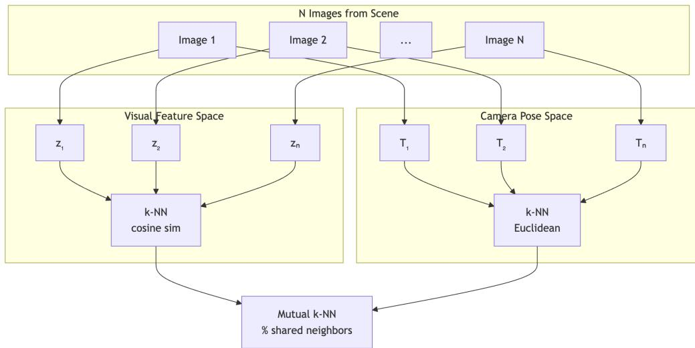  
Figure 7: Overview of the mutual nearest neighbor metric M1. For each frame in a scene we extract its visual features, as well as its corresponding (ground truth) camera pose. We then compare the nearest neighbor graphs computed in the feature (left) and pose (right) spaces.

## A.1 Metric M1: Mutual k-nn protocol

For a fixed scene we sample 256 frames, at a given stride. We compute a feature vector for each frame, and also associate to it the corresponding camera pose (see Figure 3 for examples of such frame pairs). We then compute the k nearest-neighbors (k = 10) in the feature space using cosine similarity, and compare these nearest neighbors to the nearest neighbors computed in the camera pose space. We use the 9D camera pose representation, comprising 3D translation and the first two columns of the rotation matrix, as defined in [40], in world coordinates. To reduce the impact of temporal sampling, we exclude temporal neighbors within 10 frames from the nearest neighbor computation in both visual feature and pose space. The mutual k-nn metric is defined as the average intersection (number of shared edges) between these nearest neighbor graphs (illustrated in Figure 7). The metric ranges from 0 (no alignment) to 1 (perfect alignment) between visual and spatial representations.

For video encoders that require, as input, a temporal window of frames, we sample the encoder-native set of frames around each anchor frame and pool all features within this temporal window to obtain a single feature vector. We also experimented with keeping only the features associated with a specific anchor frame, without a noticeable difference in the results.

Since this metric requires a single vector per frame, for encoders that contain a CLS token, we take features from that token. For others, we perform mean pooling over the patch tokens.

## A.2 Metrics M3 and M4: implementation details

For both metrics, we construct frame pairs at a fixed temporal stride s and split them using a timebased strategy: for each scene, the first 80% of frames (ordered by timestamp) are used for training and the remaining 20% for testing, ensuring that no test frame appears during training. For M3 (Linear Equivariance), we fit a Ridge regression (scikit-learn, α=1.0, with intercept) from the raw feature displacement $\Delta z = z _ { t + s } - z _ { t }$ to the 6D Lie-algebra pose target $\Delta P _ { : }$ , and report the test $R ^ { 2 }$ (uniform average over the 6 components). Table 1 reports results at the layer maximizing M3 for each model.

To train and evaluate the Poincaré Adapter (M4), we use the same temporal train/test split. The Siamese projection network $\varphi _ { \theta }$ is a 2-layer MLP: Linear(d, 64) → LayerNorm → GELU → Linear(64, 20), followed by a bias-free linear readout $W \in \dot { \mathbb { R } } ^ { 6 \times 2 0 }$ . The regression targets $\Delta P$ are z-scored (zero mean, unit variance) per component on the training set before training, and predictions are un-normalized before computing the test $R ^ { 2 }$ . The adapter is optimized with AdamW (lr=1e-3, weight decay=1e-2) for 10 epochs with batch size 512 and gradient clipping at norm 1.0. Similarly to M1 described above, for video encoders we use a temporal window around each anchor frame and pool features within this window to obtain a single feature vector. We use a CLS token when available, or, mean pooled patch tokens, otherwise. The representative architecture of the “Poincaré Adapter” network is visualized in Figure 8.

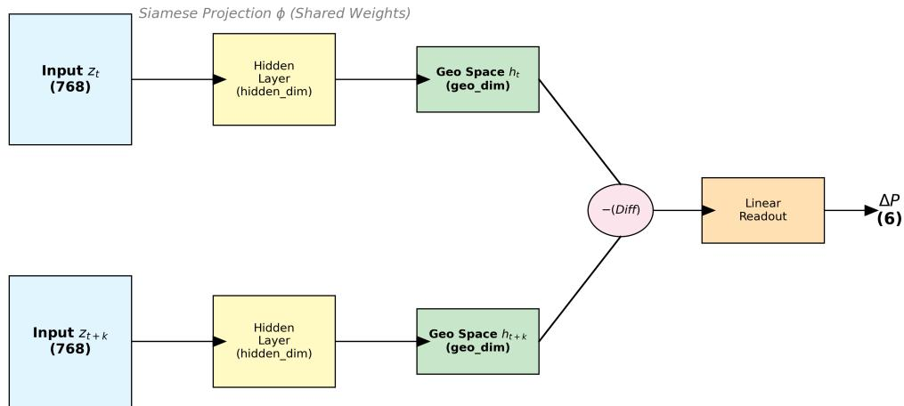  
Figure 8: Poincaré Adapter architecture: illustration of the Siamese architecture of our “Poincaré adapter” used in our Metric M4.

## A.3 Full Intrinsic Dimension and M3 Results for All Models

In Table 4, we report the Intrinsic Dimension (TwoNN and MLE) and the M3 metric (Max Test $R ^ { 2 } )$ for 18 different models evaluated in our sweep, using the layer that maximized M3 performance for each model.

<table><tr><td>Model</td><td>Layer</td><td>ID (TwoNN)</td><td>ID (MLE)</td><td>M3 (Max Test  $R^{2}$ )</td></tr><tr><td>clip</td><td>9</td><td>9.61</td><td>7.77</td><td>0.07</td></tr><tr><td>croco</td><td>10</td><td>7.66</td><td>5.92</td><td>-0.42</td></tr><tr><td>dinov2-B</td><td>9</td><td>9.15</td><td>6.41</td><td>-0.28</td></tr><tr><td>dinov2-L_reg_pooled</td><td>11</td><td>8.00</td><td>5.20</td><td>-0.11</td></tr><tr><td>dinov3</td><td>9</td><td>10.76</td><td>7.88</td><td>-0.26</td></tr><tr><td>dust3r</td><td>19</td><td>7.16</td><td>4.40</td><td>-0.22</td></tr><tr><td>lcm_ddim_noise</td><td>3</td><td>9.16</td><td>7.72</td><td>-0.06</td></tr><tr><td>mast3r</td><td>10</td><td>7.37</td><td>5.17</td><td>-0.23</td></tr><tr><td>moge</td><td>-1</td><td>5.93</td><td>4.78</td><td>-0.69</td></tr><tr><td>pe</td><td>15</td><td>14.87</td><td>6.91</td><td>-0.35</td></tr><tr><td>pixels</td><td>-1</td><td>5.01</td><td>4.03</td><td>-5.29</td></tr><tr><td>sd15_ddim_noise</td><td>3</td><td>9.87</td><td>8.35</td><td>-0.04</td></tr><tr><td>sd21_ddim_noise</td><td>3</td><td>10.51</td><td>9.15</td><td>-0.07</td></tr><tr><td>sd_dino_unet</td><td>8</td><td>9.29</td><td>5.83</td><td>-0.75</td></tr><tr><td>sd_dino_vae</td><td>9</td><td>10.18</td><td>6.16</td><td>-0.04</td></tr><tr><td>svd</td><td>3</td><td>7.70</td><td>6.70</td><td>-0.02</td></tr><tr><td>vggt_dinov2</td><td>11</td><td>7.74</td><td>5.36</td><td>-0.09</td></tr><tr><td>vjepa21</td><td>10</td><td>9.55</td><td>5.13</td><td>0.09</td></tr></table>

Table 4: Intrinsic Dimension and M3 Metric. Full results for all 18 models evaluated on ScanNet. Most models cluster near the theoretical ID of 6, while M3 $R ^ { 2 }$ is negative or near-zero for all, suggesting that no model is natively linearly equivariant.

<table><tr><td>Dataset</td><td>Scenes</td><td>Avg Frames/Scene</td><td> $R^2 > 0$  Rate</td><td>Best  $R^2$ </td><td>Bottleneck</td></tr><tr><td>12-Scenes</td><td>10</td><td>≈ 1,000</td><td>100%</td><td>0.80</td><td>None — perfect dataset</td></tr><tr><td>ScanNet</td><td>707</td><td>200–5,000</td><td>40%</td><td>0.74</td><td>Single-scan data scarcity</td></tr><tr><td>ARKitScenes</td><td>133</td><td>≈ 1,500</td><td>59%</td><td>0.37</td><td>Single iPhone scan, motion blur</td></tr><tr><td>TUM RGB-D</td><td>17</td><td>200–800</td><td>47%</td><td>0.44</td><td>Traversals, texture-less scenes</td></tr><tr><td>7-Scenes</td><td>46</td><td>≈ 500</td><td>9%</td><td>0.19</td><td>≈ 40 test frame pairs — evaluation noise</td></tr></table>

Table 5: Multi-Dataset Evaluation. We evaluate the decodability of geometric features across 913 individual scenes. Performance varies dramatically by dataset, driven by data sufficiency, visual richness, and workspace geometry rather than foundation model capability.

## A.4 Dataset Summary & Difficulty Analysis

We summarize the different datasets and the key performance in Table 5. To understand why pose recovery varies across environments, we trained independent Poincaré adapters on 913 scenes spanning 5 diverse datasets (ScanNet, 12-Scenes, ARKitScenes, TUM RGB-D, 7-Scenes) using three representative encoders (V-JEPA 2.1, DUST3R, DINOv2-B). Consistently with the results presented in the main paper, we use a temporal 80%/20% train/test split separation. From a large-scale comparison across multiple environments, we observe that scene difficulty is driven, to a significant extent by data properties, in addition to the choice of foundation model. Specifically, success hinges on three factors: (1) Data Sufficiency: scenes with > 1000 pairs succeed 81% of the time, explaining why dense datasets like 12-Scenes achieve 100% success while sparse ones like 7-Scenes (often $< 5 0$ test pairs) artificially fail (9% success). (2) Visual Richness: highly textured rooms provide the necessary semantic anchors, outperforming texture-less traversals. (3) Workspace Geometry: bounded rooms naturally support dense view overlap and closure, yielding much higher decodability than linear hallway traversals. A summary of the dataset difficulties is provided in Table 5.

Note that the intrinsic dimensionality of most features typically is close to the theoretical value 6 (see Theorem 1 below), while the $R ^ { 2 }$ value for linear equivariance Metric M3 is negative or close to zero, suggesting that no model is natively aligned with rigid motion.

## A.5 Ablation: Alternative Formulations for Pose Recovery

We compare the Poincaré adapter formulation against four alternatives for recovering camera pose from frozen DINOv2-B (Layer 7) features on ScanNet. All methods share the same feature backbone, train/test splits (time-based, 3 scenes), and adapter capacity (hidden\_dim=64, geo\_dim=20). Results are averaged over 15 random seeds.

Methods. Let $z _ { i } = z ( I _ { g _ { i } } ) \in \mathbb { R } ^ { 7 6 8 }$ denote the frozen feature for image I at pose $g _ { i } \in \mathrm { S E } ( 3 )$ , and let $\Delta P = \log ( g _ { 2 } g _ { 1 } ^ { - 1 } ) \in \bar { \mathbb { R } } ^ { 6 }$ be the Lie algebra target.

• Poincaré adapter (baseline): $\hat { \Delta P } = W \big ( \varphi ( z _ { 2 } ) - \varphi ( z _ { 1 } ) \big )$ , where $\varphi$ is a 2-layer MLP and W is a bias-free linear readout. Loss: MSE on z-scored Lie algebra targets. Siamese: $\varphi$ is applied independently to each feature before taking the difference.

• Method A (unanchored relative): $\hat { M } = \psi ( z _ { 2 } ) \cdot \psi ( z _ { 1 } ) ^ { - 1 }$ , where ψ maps each feature to an SE(3) matrix (3D translation + 6D rotation representation), consistent with the target convention $M _ { \mathrm { { g t } } } = g _ { 2 } g _ { 1 } ^ { - 1 }$ . Loss: $\Vert \log ( \hat { M } ^ { - 1 } M _ { \mathrm { g t } } ) \Vert ^ { 2 }$ (geodesic on SE(3)).

• Method B (absolute pose): ${ \hat { W } } _ { i } = \psi ( z _ { i } )$ predicts the absolute camera-to-world pose; the relative pose is recovered as $\hat { M } = \hat { W } _ { 2 } \cdot \hat { W } _ { 1 } ^ { - 1 }$ , consistent with $M _ { \mathrm { { g t } } } = g _ { 2 } g _ { 1 } ^ { - 1 }$ . Loss: geodesic on ${ \mathrm { S E } } ( 3 )$ for each absolute pose independently, i.e., $\textstyle \sum _ { i } \| \log ( { \hat { W } } _ { i } ^ { - 1 } g _ { i } ) \| ^ { 2 }$ . Note that the composition formula is used only at evaluation time; the training signal is purely on absolute poses.

• Method C (SE(3) MLP on $\Delta \varphi )$ $\hat { M } = \mathrm { M L P } _ { \mathrm { S E 3 } } \big ( \varphi ( z _ { 2 } ) - \varphi ( z _ { 1 } ) \big )$ , using the same Siamese φ but outputting an SE(3) matrix instead of a Lie algebra vector. Loss: geodesic on $\operatorname { S E } ( 3 )$ .

• Method D (non-Siamese difference): $\begin{array} { r } { \hat { \Delta P } = W \cdot \varphi ( z _ { 2 } - z _ { 1 } ) } \end{array}$ , where φ operates on the raw feature difference rather than on individual features. Loss: MSE on z-scored Lie algebra targets (same as baseline).

Results. Table 6 summarizes the main results of this ablation.

<table><tr><td>Method</td><td>Overall  $R^{2}$ </td><td>Trans.  $R^{2}$ </td><td>Rot.  $R^{2}$ </td><td>Dir.  $R^{2}$ </td><td>Mag.  $R^{2}$ </td></tr><tr><td>Poincaré adapter</td><td> $0.61 \pm 0.04$ </td><td> $0.63$ </td><td> $0.59$ </td><td> $0.41$ </td><td> $0.60$ </td></tr><tr><td>D:  $\varphi(\Delta z)$  non-Siamese</td><td> $0.48 \pm 0.07$ </td><td> $0.44$ </td><td> $0.53$ </td><td> $0.08$ </td><td> $-0.08$ </td></tr><tr><td>C: SE(3) MLP on  $\Delta\varphi$ </td><td> $-0.43 \pm 2.36$ </td><td> $0.25$ </td><td> $-1.10$ </td><td> $-0.05$ </td><td> $-1.45$ </td></tr><tr><td>A: Unanchored relative</td><td> $-6.82 \pm 4.83$ </td><td> $-0.66$ </td><td> $-12.98$ </td><td> $-0.97$ </td><td> $-0.99$ </td></tr><tr><td>B: Absolute pose</td><td> $-1.75 \pm 2.52$ </td><td> $-0.80$ </td><td> $-2.70$ </td><td> $-0.98$ </td><td> $-3.10$ </td></tr></table>

Table 6: Probe Formulations for SE(3) Recovery from frozen DINOv2-B (Layer $\overline { { 7 ) } }$ features. The Siamese Poincaré adapter $( R ^ { 2 } { = } 0 . 6 1 )$ substantially outperforms all alternatives, including absolute pose prediction (which fails) and non-Siamese variants.

Three findings emerge. (1) Relative changes over absolute poses. Method B, which predicts absolute camera pose from individual features, fails catastrophically $( R ^ { 2 } = - 1 . 7 5 )$ , while all relative-change methods achieve positive $R ^ { 2 }$ on at least some components. We attribute this failure to the fact that DINOv2 features do not encode scene-specific absolute camera coordinates—they encode relational structure between views. Even a hypothetically perfect composition formula cannot recover meaningful relative poses from absolute predictions that do not correlate with the true camera positions. (2) Linearization helps. Methods A and C operate on SE(3) directly rather than on the flat Lie algebra $\mathfrak { s e } ( 3 )$ , yet both perform worse than the linearized Poincaré adapter. Method C uses the same Siamese architecture and differs only in replacing the linear readout $W$ with an MLP outputting SE(3) matrices, yet its $R ^ { 2 }$ drops from $0 . 6 1 \ \mathrm { t o } \ - 0 . 4 3$ This suggests that the feature differences $\varphi ( z _ { 2 } ) - \varphi ( z _ { 1 } )$ are naturally aligned with the Lie algebra structure, and that the linearization $\Delta P \approx \dot { W } \cdot \Delta \varphi ( z )$ is not a lossy approximation but rather matches the geometry of the representation. (3) Siamese structure matters. Method D uses the same linear readout and loss as the baseline but applies $\varphi$ to the raw difference $z _ { 2 } - z _ { 1 }$ instead of computing $\varphi ( z _ { 2 } ) - \varphi ( z _ { 1 } )$ This seemingly minor change drops $R ^ { 2 }$ from 0.61 to 0.48, with the translation magnitude component collapsing from $0 . 6 0 \ \mathrm { t o \ - } 0 . 0 8$ The Siamese architecture, in which $\varphi$ normalizes each feature independently before subtraction, is essential for the pose signal to be linearly decodable from the difference.

## A.6 Pose Recovery Components Difficulty Analysis

To further elaborate on our key metric M4 results and analyze the difficulty of recovering different components of camera pose, we decompose the Poincaré adapter’s overall $\dot { R } ^ { 2 }$ into three major parts: rotation (3 DoF), translation direction (2 DoF), and translation magnitude (1 DoF), where direction and magnitude together form the full translation (3 DoF).

We assess whether there is a difference in the difficulty of recovering these components. To this end, we conducted a hyperparameter sweep training different Poincaré adapters to optimize metric M4 following the protocol in ${ \tt A } . 2$ . We trained $^ { 3 , 3 \bar { 2 } 8 }$ unique adapter configurations evaluated with up to 20 random seeds each, totaling 38,929 runs. All runs use frozen DINOv2-B features (Layer 7, CLS token, $d \ : = \ : 7 6 8 )$ extracted from 3 ScanNet scenes (∼1,200 frames total, stride 2). The adapter consists of a Siamese nonlinear projection $\varphi$ (2-layer MLP) followed by a bias-free linear readout $W ;$ we sweep over bottleneck dimension geo\_dim $\in \{ 1 0 , 2 0 , 4 0 , 8 0 , 1 6 0 , 3 2 0 \}$ , number of mixture-of-experts heads $K \in \{ 1 , 2 , 4 \}$ , learning rate $\mathtt { l r } \in [ \mathrm { 3 } { \times } 1 0 ^ { - 4 } , \mathrm { 3 } { \times } \mathrm { 1 } 0 ^ { - 2 } ]$ , and loss type $\in \{ \mathrm { M S E } $ , cosine, rot-only}. Evaluation pairs are sampled at a fixed temporal gap (stride) of $s = 4 0$ frames, and $R ^ { 2 }$ is computed on a held-out time-based test split.

Difficulty hierarchy. Table 7 reports the fraction of adapter configurations achieving positive $R ^ { 2 }$ (better than predicting the constant mean) and $R ^ { 2 } > 0 . 5$ , aggregated over all runs.

A consistent ordering emerges: $R _ { \mathrm { r o t } } ^ { 2 } > R _ { \mathrm { t r a n s } } ^ { 2 } > R _ { \mathrm { d i r } } ^ { 2 } > R _ { \mathrm { m a g } } ^ { 2 }$ . Rotation is positive in 88% of configurations; translation magnitude in only $27 \%$ . Moreover, translation magnitude has 6× the seed variance of rotation $( \sigma = 1 . 0 3 \mathrm { v s . 0 . 1 7 ) }$ , meaning that even the configurations that achieve positive $R _ { \mathrm { m a g } } ^ { 2 }$ in one seed often fail in another. While individual configurations occasionally achieve $\bar { R } _ { \mathrm { m a g } } ^ { 2 }$ up to 0.72, the metric is not reliably linearly decodable: across all runs, the mean $R _ { \mathrm { m a g } } ^ { 2 }$ is −3.30.

<table><tr><td>Component</td><td>Best  $R^{2}$ </td><td>% configs &gt;0</td><td>% configs &gt;0.5</td><td>Seed  $\sigma$ </td></tr><tr><td>Rotation</td><td>0.813</td><td>88.1%</td><td>11.2%</td><td>0.17</td></tr><tr><td>Translation</td><td>0.730</td><td>71.7%</td><td>7.0%</td><td>0.32</td></tr><tr><td>Trans. direction</td><td>0.665</td><td>60.5%</td><td>3.9%</td><td>0.30</td></tr><tr><td>Trans. magnitude</td><td>0.725</td><td>26.7%</td><td>6.7%</td><td>1.03</td></tr></table>

Table 7: Success Rates and Seed Stability across 38,929 Poincaré adapter runs (DINOv2-B, Layer 7, ScanNet). Seed σ is the average within-config standard deviation. Rotation is reliably decodable (88% positive $R ^ { 2 } )$ , while translation magnitude is not (27%, with $6 \times$ the seed variance).

Why rotation is easier. The difficulty hierarchy has a precise geometric explanation rooted in optical flow and formalized in Theorem 7 below. Intuitively, rotational flow is depth-independent, whereas the translational Jacobian depends on depth map (see Theorem 7 for details).

Joint training regularizes rotation. Perhaps counter-intuitively, training the adapter to predict all 6 DoF jointly produces better rotation $R ^ { 2 }$ than predicting rotation alone. Under matched conditions (same architecture, 5 seeds):

<table><tr><td>Objective</td><td>Rot  $R^{2}$  mean</td><td>Rot  $R^{2}$  std</td><td>Rot  $R^{2}$  max</td></tr><tr><td>Full 6D (rot + trans)</td><td>0.613</td><td>0.19</td><td>0.813</td></tr><tr><td>Rot-only (3D readout)</td><td>0.552</td><td>0.05</td><td>0.634</td></tr></table>

One possible interpretation is that the translation objective acts as a multi-task regularizer for the shared feature projection $\varphi ,$ reducing the possibility of overfitting.

## A.7 Theoretical Analysis

Before proceeding, we note that even without considering the specifics of the visual feature extractor, under fairly general conditions, the acquisition process itself imposes theoretical constraints on the structure in the feature domain. To state this formally, we frame the visual feature acquisition as a continuous generative process over time, and express these constraints with the theorem below (which is derived from basic principles, but which we state explicitly for clarity and completeness):

Theorem 1. Let S be a static scene, and let $\mathcal { U } \subseteq S E ( 3 )$ be an open set of valid camera poses. Consider a visual feature acquisition process $\mathcal { P } ( t )$ parameterized by time $t \in \mathbb R$ , and defined as:

$$
\mathcal {P} (t) = (\mathcal {F} \circ P \circ C) (t)\tag{5}
$$

where $C : \mathbb { R }  \mathcal { U }$ maps time to a camera pose, $P : \mathcal { U }  \mathcal { I }$ is the rendering mapping from a camera pose to an image in the space of pixel values $\mathcal { T } ,$ and $\mathcal { F } : \mathcal { T }  \mathbb { R } ^ { d }$ is a visual feature extractor. Then:

1. $P$ is a well-defined function, with a unique image for any given pose, and any temporal trajectory $\mathcal { P } ( t )$ is confined to the scene-specific latent set $\mathcal { M } _ { S } = ( \mathcal { F } \circ P ) ( \mathcal { U } )$

2. Assuming $\Phi = \mathcal { F } \circ P$ is a smooth mapping, the intrinsic (Hausdorff) dimensionality of $\mathcal { M } _ { \mathcal { S } }$ is at most 6.

3. If $\Phi = \mathcal { F } \circ \mathcal { I }$ P is a smooth embedding—meaning it is an injective immersion that maps homeomorphically onto its image—then $\mathcal { M } _ { \mathcal { S } }$ is a regular smooth submanifold $o f \mathbb { R } ^ { d }$ with intrinsic dimension of exactly 6.

## Proof. We address each claim sequentially:

1. For a strictly static scene $s ,$ the geometry, materials, and illumination of the environment are invariant over time. Thus, time t influences the visual observation solely through the trajectory $C ( t )$ , making $P : \mathcal { U }  \mathcal { T } \mathrm { a }$ well-defined mapping that assigns a unique, repeatable image to any specific pose. Moreover, by definition, the camera trajectory is restricted to valid poses, meaning $\bar { C } ( t ) \in \mathcal { U }$ for all $t \in \mathbb { R }$ . Therefore, the composed mapping evaluated at any time t yields $\mathcal { P } ( \dot { t } ) = \mathcal { F } ( P ( C ( t ) ) ) \in ( \mathcal { F } \circ P ) ( \mathcal { U } ) = \mathcal { M } _ { S } ^ { \ }$ . The continuous, timeparameterized sequence of features ${ \mathcal { P } } ( \mathbb { R } )$ is thus a 1-dimensional curve constrained entirely within the bounds of the spatial set $\mathcal { M } _ { \mathcal { S } }$

2. Let $\Phi = \mathcal { F } \circ P$ . The domain of valid poses U is an open subset of the Lie group $S E ( 3 )$ which is a smooth manifold of dimension 6. Because the composition $\Phi : \mathcal { U } \to \mathbb { R } ^ { d }$ is assumed to be a smooth mapping, it is continuously differentiable and therefore locally Lipschitz continuous. By standard results in geometric measure theory [72], locally Lipschitz mappings do not increase the Hausdorff dimension of a set. Therefore, dim $_ { \mathcal { H } } ( _ { } \mathcal { M } _ { S } ) =$ $\mathrm { d i m } _ { \mathcal { H } } ( \bar { \Phi } ( \mathcal { U } ) ) \leq \mathrm { d i m } _ { \mathcal { H } } ( \mathcal { U } ) = 6$

3. By definition, a smooth embedding Φ is an immersion (its differential $d \Phi$ has a full rank of 6 everywhere) that is injective and maps homeomorphically onto its image. Under these assumptions, standard differential topology [73] guarantees that the image of an embedded manifold is a regular smooth submanifold, diffeomorphic to the domain. Because diffeomorphisms preserve dimensionality, $\mathcal { M } _ { \cal S } = \Phi ( \mathcal { U } )$ is a regular smooth submanifold of $\mathbb { R } ^ { d }$ with an exact intrinsic dimension of 6.

## A.7.1 Geometric Decodability from Features – Setup and Notation

Throughout the theoretical analysis, relative pose is expressed in the body frame: $\xi = \log ( g _ { 1 } ^ { - 1 } g _ { 2 } )$ which describes the displacement as seen from $g _ { 1 }$ . This is consistent with Eq. (1) of the main paper. Note that for the Poincaré adapter we define the target motion $\Delta P$ in the local camera coordinate frame (the body frame). In this frame, a translation vector corresponds to an agent-centric action $( \mathrm { e . g . }$ , “move forward 1 meter”) rather than a change in absolute map coordinates $( \mathrm { e . g . }$ , “move $\mathrm { { N o r t h } ^ { \prime \prime } ) }$ This choice is essential for homogeneity: a specific visual change (like the radial expansion of optical flow) should always correspond to the same displacement vector $\Delta P ,$ , regardless of where the agent is located in the world or which direction it is facing.

In Appendix A.5, Methods A and B use the world-frame convention log $( g _ { 2 } g _ { 1 } ^ { - 1 } )$ ; the two are related by the adjoint action $\log ( g _ { 2 } g _ { 1 } ^ { - 1 } ) = \mathrm { A d } _ { g _ { 1 } } , \log ( g _ { 1 } ^ { - 1 } g _ { 2 } )$

Rendering model. Fix a 3D scene s. A camera with pose $g \in \mathrm { S E } ( 3 )$ renders an image $I _ { g } = $ $\mathcal { R } ( g , s ) \in \mathbb { R } ^ { H \times W \times 3 }$ . We write the Lie algebra decomposition $\mathfrak { s e } ( 3 ) = \mathfrak { s o } ( 3 ) \oplus \mathbb { R } ^ { 3 }$ , so a tangent vector $\xi = ( \omega , \boldsymbol { v } )$ encodes infinitesimal rotation $\boldsymbol \omega \in \mathbb { R } ^ { 3 }$ and translation $v \in \mathbb { R } ^ { 3 }$

Encoder. Let $\boldsymbol { z } \colon  { \mathbb { R } } ^ { H \times W \times 3 } \to  { \mathbb { R } } ^ { d }$ be a feature encoder (e.g., a vision transformer). Define the posed feature map:

$$
f \colon \operatorname{SE} (3) \to \mathbb {R} ^ {d}, \quad f (g) = z (\mathcal {R} (g, s)).
$$

Definition 2 (Poincaré adapter). We say f admits a Poincaré adapter at $g _ { 0 }$ if there exist a $C ^ { 1 }$ diffeomorphism $\varphi \colon U  V$ (where $U \ni f ( g _ { 0 } )$ is open in $\mathbb { R } ^ { d } )$ and a matrix $\bar { W } \in \mathbb { R } ^ { 6 \times d }$ such that for g near $g _ { 0 } { \mathrm { : } }$

$$
W \cdot \big (\varphi (f (g)) - \varphi (f (g _ {0})) \big) = \log (g _ {0} ^ {- 1} g) + O \big (\| \log (g _ {0} ^ {- 1} g) \| ^ {2} \big).
$$

We say f admits a linear Poincaré adapter if the above holds with $\varphi = \mathrm { i d }$

## A.7.2 Local Geometric Decodability

Theorem 3 (Local Geometric Decodability). Let $f \colon \mathrm { S E } ( 3 )   { \mathbb { R } } ^ { d }$ with $d \geq 6$ be the posed feature map of a $C ^ { 1 }$ encoder z. Suppose:

(C1) Smoothness. f is $C ^ { 1 }$ on a neighborhood of $g _ { 0 } \in \mathrm { S E } ( 3 )$

(C2) Local discriminability. The differential $\mathrm { d } f _ { g _ { 0 } } \colon \mathfrak { s e } ( 3 )   { \mathbb { R } } ^ { d }$ has rank 6.

Then f admits a linear Poincaré adapter at $g _ { 0 }$ . Explicitly, there exists $W \in \mathbb { R } ^ { 6 \times d }$ such that:

$$
W \cdot (f (g) - f (g _ {0})) = \log (g _ {0} ^ {- 1} g) + O (\| \log (g _ {0} ^ {- 1} g) \| ^ {2}).
$$

Proof. Define $F \colon \mathfrak { s e } ( 3 ) \cong \mathbb { R } ^ { 6 } \to \mathbb { R } ^ { d }$ by $F ( \xi ) = f ( g _ { 0 } \cdot \exp ( \xi ) ) - f ( g _ { 0 } )$ . Then $F ( 0 ) = 0$ and the Jacobian at the origin is $J _ { F } ( 0 ) = \mathrm { d } f _ { g _ { 0 } }$ (since $\mathrm { d e x p } _ { 0 } = \mathrm { i d } \ \mathrm { o n } \ \mathfrak { s e } ( 3 ) )$

By (C2), $J _ { F } ( 0 ) \in \mathbb { R } ^ { d \times 6 }$ has rank 6, so it admits a left inverse: there exists $W \in \mathbb { R } ^ { 6 \times d }$ with $\dot { W } \cdot J _ { F } ( 0 ) = { \bf \dot { \cal I } } _ { 6 } . { \bf B } { \bf y }$ Taylor’s theorem:

$$
W \cdot F (\xi) = W \cdot J _ {F} (0) \cdot \xi + O (\| \xi \| ^ {2}) = \xi + O (\| \xi \| ^ {2}).
$$

Since $g = g _ { 0 } \cdot \exp ( \xi )$ implies $\xi = \log ( g _ { 0 } ^ { - 1 } g )$ , this gives the result.

Remark 4. Theorem 3 is essentially trivial—it follows from Taylor’s theorem and the existence of a left inverse. The content is in recognizing that (C2) is the only condition needed for local decodability: any smooth, locally discriminative encoder automatically admits a Poincaré adapter. The hard question is: when does a single W work across a range of poses $g _ { 0 } { ? }$ This is the content of Theorem 5.

## A.7.3 Global Linear Decodability and Its Obstruction

The local readout $W ( g _ { 0 } )$ from Theorem 3 depends on $g _ { 0 }$ because the Jacobian $\mathrm { d } f _ { g _ { 0 } }$ varies with pose. Define the Jacobian field:

$$
J \colon \operatorname{SE} (3) \to \mathbb {R} ^ {d \times 6}, \quad J (g) = \mathrm{d} f _ {g}.
$$

Theorem 5 (Global Geometric Decodability). Let $f \colon \mathrm { S E } ( 3 )  \mathbb { R } ^ { d } b e C ^ { 2 }$ with rank $( \mathrm { d } f _ { g } ) = 6 f o r$ all g in a connected compact geodesically convex region $K \subset \operatorname { S E } ( 3 ) ( i . e .$ , every minimizing geodesic between points in K lies in $\bar { K } )$

(a) Linear Poincaré adapter. Fix any $W \in \mathbb { R } ^ { 6 \times d }$ that is a left inverse of $J ( g _ { * } )$ for some base pose $g _ { * } \in K ( i . e . , \bar { W ^ { . } } J ( g _ { * } ) = \bar { I } _ { 6 } )$ . Then:

$$
W \cdot (f (g _ {2}) - f (g _ {1})) = \log (g _ {1} ^ {- 1} g _ {2}) + \varepsilon (g _ {1}, g _ {2})
$$

with first-order error

$$
\| \varepsilon (g _ {1}, g _ {2}) \| \leq \Big (\sup _ {g \in K} \| W \cdot J (g) - I _ {6} \| \Big) \cdot \| \log (g _ {1} ^ {- 1} g _ {2}) \| + O \big (\| \log (g _ {1} ^ {- 1} g _ {2}) \| ^ {2} \big).
$$

The first-order error vanishes if and only $i f W \cdot J ( g )$ is constant over $K { - } i . e .$ ., the Jacobian field is constant modulo ker W .

(b) Obstruction (manifold curvature). The first-order error is controlled by the curvature of the feature manifold $f ( K ) \subset \mathbb { R } ^ { d } .$

$$
\sup _ {g \in K} \| W \cdot J (g) - I _ {6} \| \leq \operatorname{diam} (K) \cdot \sup _ {g \in K} \| W \cdot \nabla J (g) \|,
$$

where ∇J denotes the covariant derivative of J along K, and diam(K) is the diameter of K in SE(3).

(c) Nonlinear adapter and intrinsic curvature. Suppose further that the feature map f is globally injective on K (hence an embedding). Without loss of generality, choose the world coordinate frame such that the identity pose $I \in K$ . There exists a $\dot { C } ^ { 1 }$ diffeomorphism $\varphi \colon U  V$ (where $U , V \subset \mathbb { R } ^ { d }$ are open neighborhoods of $f ( K )$ and $\varphi ( f ( K ) { \bar { ) } }$ , respectively) and a readout matrix $W \in \mathbb { R } ^ { 6 \times d }$ such that for all $g _ { 1 } , g _ { 2 } \in K$ , the Siamese adapter yields:

$$
W \cdot \big (\varphi (f (g _ {2})) - \varphi (f (g _ {1})) \big) = \log (g _ {1} ^ {- 1} g _ {2}) + \varepsilon_ {\mathrm{Lie}} (g _ {1}, g _ {2}) + O \big (\| \log (g _ {1} ^ {- 1} g _ {2}) \| ^ {2} \big).
$$

The nonlinear adapter flattens the extrinsic curvature of the neural feature manifold (removing the Jacobian variation). The remaining first-order error, $\varepsilon _ { \mathrm { L i e } } ,$ is strictly intrinsic to the non-commutative geometry of SE(3), governed by the inverse differential of the exponential map $( \mathrm { d } \exp _ { X } ) ^ { - 1 }$ . Its leading term is the Lie bracket, and it is bounded by:

$$
\| \varepsilon_ {\mathrm{Lie}} (g _ {1}, g _ {2}) \| \leq C (R _ {K}) \cdot \| \log (g _ {1} ^ {- 1} g _ {2}) \|,
$$

where $C ( R _ { K } )  0$ as $R _ { K }  0 ,$ , with leading behavior $\begin{array} { r } { C ( R _ { K } ) = \frac 1 2 C _ { \mathrm { L i e } } R _ { K } + O ( R _ { K } ^ { 2 } ) } \end{array}$ where $R _ { K } = \operatorname* { m a x } _ { g \in K } \| \log ( g ) \|$ is the radius of K in the Lie algebra.

Proof of (a). Fix any $W$ that is a left inverse of $J ( g _ { * } )$ for some $g _ { * } \in K$ . By the fundamental theorem of calculus along a geodesic $\gamma$ from $g _ { 1 }$ to $g _ { 2 }$ with body velocity $\xi = \log ( g _ { 1 } ^ { - 1 } g _ { 2 } )$

$$
f (g _ {2}) - f (g _ {1}) = \left(\int_ {0} ^ {1} J (\gamma (t)) d t\right) \cdot \xi .
$$

Applying $W { : }$

$$
W \cdot (f (g _ {2}) - f (g _ {1})) = \xi + \left(\int_ {0} ^ {1} (W \cdot J (\gamma (t)) - I _ {6}) d t\right) \cdot \xi .
$$

The error term satisfies:

$$
\left\| \int_ {0} ^ {1} (W \cdot J (\gamma (t)) - I _ {6}) d t \cdot \xi \right\| \leq \sup _ {g \in K} \| W \cdot J (g) - I _ {6} \| \cdot \| \xi \|.
$$

The error vanishes to first order iff $W \cdot J ( g ) = I _ { 6 }$ for all $g \in K$

Proof of (b). Since $W \cdot J ( g _ { * } ) = I _ { 6 }$ , for any $g \in K$

$$
\left\| W \cdot J (g) - I _ {6} \right\| = \left\| W \cdot \left(J (g) - J \left(g _ {*}\right)\right) \right\| \leq \left\| W \right\| \cdot \left\| J (g) - J \left(g _ {*}\right) \right\|.
$$

By the mean value theorem on the Lie group, $\begin{array} { r } { \| J ( g ) - J ( g _ { * } ) \| \leq \operatorname* { s u p } _ { \gamma } \| \nabla J \| \cdot d ( g , g _ { * } ) } \end{array}$ . Taking the supremum over $K$ and noting $d ( g , g _ { * } ) \leq \dim ( K )$ gives the result (absorbing $\| W \|$ into the $\nabla J$ term).

Proof of (c). Since $f \mathrm { ~ i s ~ a ~ } C ^ { 1 }$ immersion and globally injective on the compact set $K$ , the image $\mathcal { M } = f ( K )$ is an embedded 6-dimensional submanifold of $\mathbb { R } ^ { d }$ . By the Tubular Neighborhood Theorem, there exists an open neighborhood U of M and a smooth projection π : $U  \bar { \mathcal { M } }$

Define the Lie algebra chart around the identity $\psi ( g ) = \log ( g ) \in { \mathfrak { s e } } ( 3 ) \cong \mathbb { R } ^ { 6 }$ . We first define a map on the manifold $\bar { \hat { \varphi } } = \psi \circ f ^ { - 1 } \circ \pi \colon U \to \mathbb { R } ^ { 6 }$ . To make this a full diffeomorphism onto its open image in $\mathbb { R } ^ { d }$ , we append the normal bundle coordinates: $\varphi ( x ) = ( \hat { \varphi } ( x ) , x - \pi ( \dot { x } ) ) \in \mathbb { R } ^ { 6 } \times \mathbb { R } ^ { d - 6 } \cong \mathbb { R } ^ { d }$

Setting $W = \left[ I _ { 6 } \mid 0 \right]$ , the adapter exactly evaluates differences in the absolute Lie algebra coordinates (linearizing around 0):

$$
W \cdot \left(\varphi (f (g _ {2})) - \varphi (f (g _ {1}))\right) = \log (g _ {2}) - \log (g _ {1}).
$$

Let $X = \log ( g _ { 1 } )$ and let $\xi = \log ( g _ { 1 } ^ { - 1 } g _ { 2 } )$ be the true relative body velocity. Observe the exact group composition: $g _ { 2 } = g _ { 1 } ( g _ { 1 } ^ { - 1 } g _ { 2 } ) = \exp ( X )$ exp(ξ). By the Baker–Campbell–Hausdorff (BCH) formula, the full linear-in-ξ expansion is:

$$
\log \bigl (\exp (X) \exp (\xi) \bigr) = X + (\mathrm{d} \exp_ {X}) ^ {- 1} (\xi) + O (\| \xi \| ^ {2}),
$$

where $\begin{array} { r } { ( \mathrm { d } \exp _ { X } ) ^ { - 1 } ( \xi ) = \xi + \frac { 1 } { 2 } [ X , \xi ] + \frac { 1 } { 1 2 } [ X , [ X , \xi ] ] + \cdot \cdot \cdot } \end{array}$ is the full BCH series in $\xi$ (convergent for $\| X \| < 2 \pi )$ . Substituting this back, the adapter evaluates to:

$$
\left(X + \left(\mathrm{d} \exp_ {X}\right) ^ {- 1} (\xi) + O \left(\| \xi \| ^ {2}\right)\right) - X = \xi + \left(\left(\mathrm{d} \exp_ {X}\right) ^ {- 1} (\xi) - \xi\right) + O \left(\| \xi \| ^ {2}\right).
$$

The residual first-order error is $\varepsilon _ { \mathrm { L i e } } = ( \mathrm { d } \exp _ { X } ) ^ { - 1 } ( \xi ) - \xi$ , whose leading term is $\scriptstyle { \frac { 1 } { 2 } } \left[ X , \xi \right]$ , with higher-order corrections ${ \scriptstyle { \frac { 1 } { 1 2 } } } [ X , [ X , \xi ] ] + \cdots$ that scale as $O ( \| X \| ^ { 2 } \| \xi \| )$ . Because $g _ { 1 } \in K ,$ , we have $\| \bar { X } \| = \| \log ( g _ { 1 } ) \| \le R _ { K }$ . Since the full series converges and each term is bounded by $O ( R _ { K } ^ { n } \| \xi \| )$ 44 we obtain $\| \varepsilon _ { \mathrm { L i e } } \| \leq C ( R _ { K } ) \| \xi \|$ with $\begin{array} { r } { C ( R _ { K } ) = \frac 1 2 C _ { \mathrm { L i e } } R _ { K } + O ( R _ { K } ^ { 2 } ) } \end{array}$ , yielding the result.

## Remark 6 (Interpretation).

• (a) says that a linear readout W always exists, and its error is controlled by how much the Jacobian $J ( g )$ varies over the trajectory. The Jacobian variation is the fundamental obstruction to linear geometric decodability.

• (b) says the obstruction is geometric: it is the curvature of the feature manifold $f ( K ) \subset \mathbb { R } ^ { d }$ A flat (affine) feature manifold gives perfect linear readout; curvature creates error.

• (c) says the nonlinear adapter $\varphi ^ { \mathrm { ~ } \cdots } u n r o l l s ^ { \prime \prime }$ the curved feature manifold, removing the Jacobian-variation error from $( a ) - ( b ) .$ . However, even after perfect unrolling, the Siamese difference $\varphi ( z _ { 2 } ) - \varphi ( z _ { 1 } )$ incurs a residual from the Lie bracket ${ \frac { 1 } { 2 } } [ \xi , X ]$ , because subtraction in $\mathbb { R } ^ { d }$ cannot exactly mirror the non-Abelian group operation. This residual is $O ( \| \xi \| \cdot R _ { K } )$ and is an intrinsic property of $\operatorname { S E } ( 3 )$ , not of the encoder. Importantly, the se(3) bracket satisfies $\left[ ( \omega _ { 1 } , v _ { 1 } ) , ( \omega _ { 2 } , v _ { 2 } ) \right] = ( \omega _ { 1 } \times \omega _ { 2 } , \ \omega _ { 1 } \times v _ { 2 } - \omega _ { 2 } \times v _ { 1 } )$ . When both X and ξ are pure translations, the bracket vanishes entirely. When the relative displacement ξ is a pure translation $( \omega _ { \xi } = 0 )$ but the base pose $X = ( \omega _ { X } , v _ { X } )$ is rotated relative to the coordinate origin, a cross-coupling term $\omega _ { X } \times v _ { \xi }$ remains; however, the rotational component of the bracket still vanishes. In general, the residual scales with the rotational extent of the region K, and is small when the angular range $R _ { K }$ is modest.

## A.7.4 Rotation–Translation Asymmetry

Theorem 7 (Rotational Jacobian is Depth-Independent). Let $\textstyle { \mathcal { R } } ( g , s )$ be the rendering of scene s from pose $g = ( R , t ) \in \mathrm { S E } ( 3 )$ , and let the encoder z compute any weighted spatial average of local image features. Decompose the Jacobian:

$$
\mathrm{d} f _ {g} = [ J _ {\omega} (g) \quad J _ {v} (g) ] \in \mathbb {R} ^ {d \times 6},
$$

where $J _ { \omega } = \partial f / \partial \omega$ (rotational) and $J _ { v } = \partial f /$ ∂v (translational).

(a) Rotational Jacobian. The rotational optical flow at pixel $( u , v )$ is:

$$
\frac {\partial}{\partial \omega} \binom{u}{v} = \left( \begin{array}{c c c} - \frac {u v}{f _ {y}} & f _ {x} + \frac {u ^ {2}}{f _ {x}} & - \frac {f _ {x} v}{f _ {y}} \\ - f _ {y} - \frac {v ^ {2}}{f _ {y}} & \frac {u v}{f _ {x}} & \frac {f _ {y} u}{f _ {x}} \end{array} \right).
$$

This depends only on the pixel coordinates and focal lengths $( f _ { x } , f _ { y } )$ —not on scene depth Z.

(b) Translational Jacobian. The translational optical flow at pixel $( u , v )$ with depth Z is:

$$
\frac {\partial}{\partial v} \binom{u}{v} = \frac {1}{Z} \left( \begin{array}{c c c} f _ {x} & 0 & - u \\ 0 & f _ {y} & - v \end{array} \right).
$$

This depends on $Z ^ { - 1 }$ , which varies across the image and across scenes.

(c) Consequence for Jacobian variation. $J _ { \omega } ( g )$ varies only through the encoder’s nonlinearity (how z processes different image content), not through the geometry of the flow itself. $J _ { v } ( g )$ varies both through the encoder’s nonlinearity and through the depth distribution $Z ( u , v ; g )$ Since $J _ { v }$ has a strictly larger set of variation sources than $J _ { \omega } ,$ , the upper bound from Theorem 5(b) is generically larger for translation. This provides an analytical justification for the empirically observed inequality:

$$
\inf _ {W _ {\omega}} \sup _ {g \in K} \| W _ {\omega} \cdot J _ {\omega} (g) - I _ {3} \| \leq \inf _ {W _ {v}} \sup _ {g \in K} \| W _ {v} \cdot J _ {v} (g) - I _ {3} \|,
$$

with equality only when the scene has constant depth. Note that this is a heuristic expectation based on the structure of the upper bounds, not a strict deduction; the actual optimized readout errors depend on the specific encoder and scene geometry.

(d) Scale ambiguity. The translational flow $\partial I / \partial v \propto Z ^ { - 1 }$ is invariant under the rescaling $( v , Z ) \mapsto ( \lambda v , \lambda Z )$ . Therefore, translation magnitude and depth are confounded: no encoder operating on pixel intensities alone can disambiguate ∥v∥ from Z. Note that the local Jacobian $J _ { v } ( g )$ for a fixed scene generically has full column rank 3, since the depth map $Z ( u , v ; g )$ is fixed and any non-zero translation induces non-trivial optical flow. However, scale ambiguity implies that no universal linear readout $W _ { v }$ trained across scenes with varying depth distributions can reliably recover translation magnitude—only the translation direction (2 DoF) is universally recoverable without metric priors.

Proof sketch of (c). The chain rule gives $\begin{array} { r } { J _ { \omega } ( g ) = \frac { \partial z } { \partial I } \Bigr | _ { I _ { q } } \cdot \frac { \partial I _ { g } } { \partial \omega } } \end{array}$ and $\begin{array} { r } { J _ { v } ( g ) = \frac { \partial z } { \partial I } \Bigr | _ { I _ { q } } \cdot \frac { \partial I _ { g } } { \partial v } } \end{array}$ . Both share the encoder sensitivity factor $\partial z / \partial I$ . The rotational flow operator $\partial I _ { g } / \partial \omega$ is depth-independent by (a); the translational flow operator $\partial I _ { g } / \partial v$ includes $Z ^ { - 1 } ( u , v ; g )$ , which varies with scene geometry. This adds an extra source of variation to $J _ { v } ,$ , so $\lVert \nabla J _ { v } \rVert \ge \lVert \nabla \bar { J _ { \omega } } \rVert$ generically. □

## A.8 Vision Encoder Training, Performance Analysis

To understand the necessary and sufficient conditions for spatial structure to emerge in self-supervised features, we train DINOv2-B from scratch on a single walking-tour video (Amsterdam WalkingTours, ∼20 minutes) with systematic ablations of the training recipe. We evaluate 25 checkpoints spanning component ablations (removing individual losses or crop strategies), a prototype count sweep (64 to 65k), and multiple independent reruns of the same 65k-prototype baseline to measure training stochasticity. All checkpoints are trained for 62,500 iterations with effective batch size 192 (3× A100, batch\_size\_per\_gpu = 64), except one checkpoint trained with batch size 128 (2× A100). Each checkpoint is evaluated on ScanNet (3 scenes, ∼1,200 frames) using two complementary metrics across all 12 transformer layers:

• Mutual k-nn (M1): a non-parametric measure of topological alignment between features and SE(3) camera poses, evaluated at frame stride 5 with oracle over layers.

• Poincaré adapter $R ^ { 2 } \mathrm { : }$ : a parametric measure of linear geometric decodability. Following the optimal configuration found in our hyperparameter sweep, we use $s \in [ \dot { 1 } 0 , 4 0 ]$ range pairing with 30,000 pairs, a bottleneck dimension of 20, and train for 200 epochs averaging over 15 random seeds per checkpoint with oracle over layers.

Table 8 reports both metrics. The central finding is that topology is stable while geometry is fragile.

<table><tr><td rowspan="2">Checkpoint</td><td rowspan="2">Ablation</td><td>Topology</td><td colspan="5">Geometry (Poincaré  $R^{2}$ , oracle layer)</td></tr><tr><td>M1</td><td>Best L</td><td>Overall</td><td>Trans</td><td>Rot</td><td> $\pm\sigma$ </td></tr><tr><td>Pretrained DINOv2-B</td><td>(142M images)</td><td>0.37</td><td>L7</td><td>0.61</td><td>0.63</td><td>0.59</td><td>0.04</td></tr><tr><td colspan="8">Component ablations (all BS = 192):</td></tr><tr><td>no_ibot</td><td>- iBOT</td><td>0.39</td><td>L7</td><td>0.30</td><td>0.30</td><td>0.30</td><td>0.05</td></tr><tr><td>no_koleo</td><td>- KoLeo</td><td>0.42</td><td>L7</td><td>0.11</td><td>-0.10</td><td>0.33</td><td>0.11</td></tr><tr><td>no_local</td><td>0 local crops</td><td>0.40</td><td>L0</td><td>0.30</td><td>0.26</td><td>0.34</td><td>0.09</td></tr><tr><td>no_global</td><td>global scale [1, 1]</td><td>0.35</td><td>L1</td><td>0.27</td><td>0.12</td><td>0.41</td><td>0.04</td></tr><tr><td>no_dino</td><td>- DINO loss</td><td>0.24</td><td>L0</td><td>0.31</td><td>0.30</td><td>0.32</td><td>0.05</td></tr><tr><td>geo regularized</td><td>+ geo loss</td><td>0.38</td><td>L10</td><td>0.26</td><td>0.24</td><td>0.27</td><td>0.06</td></tr><tr><td colspan="8">Prototype count sweep (all BS = 192):</td></tr><tr><td>4k protos</td><td></td><td>0.38</td><td>L6</td><td>0.47</td><td>0.42</td><td>0.51</td><td>0.05</td></tr><tr><td>12k protos</td><td></td><td>0.39</td><td>L7</td><td>0.31</td><td>0.37</td><td>0.26</td><td>0.06</td></tr><tr><td>1k protos</td><td></td><td>0.39</td><td>L11</td><td>0.29</td><td>0.34</td><td>0.25</td><td>0.05</td></tr><tr><td>256 protos</td><td></td><td>0.38</td><td>L6</td><td>0.21</td><td>0.17</td><td>0.24</td><td>0.03</td></tr><tr><td>64 protos</td><td></td><td>0.38</td><td>L9</td><td>0.08</td><td>0.00</td><td>0.17</td><td>0.10</td></tr><tr><td colspan="8">Reproducibility: identical 65k config, different runs:</td></tr><tr><td>65k_rerun</td><td></td><td>0.40</td><td>L6</td><td>0.35</td><td>0.17</td><td>0.52</td><td>0.04</td></tr><tr><td>v2_65k</td><td></td><td>0.38</td><td>L0</td><td>0.21</td><td>0.11</td><td>0.30</td><td>0.03</td></tr><tr><td>65k_base</td><td></td><td>0.38</td><td>L3</td><td>0.15</td><td>0.14</td><td>0.15</td><td>0.06</td></tr><tr><td>65k_rerun</td><td></td><td>0.38</td><td>L8</td><td>0.08</td><td>-0.06</td><td>0.23</td><td>0.05</td></tr><tr><td>(BS = 128)</td><td>65k, 2×A100</td><td>0.15</td><td>L3</td><td>0.11</td><td>-0.04</td><td>0.26</td><td>0.03</td></tr><tr><td>random weights</td><td>(no training)</td><td>0.11</td><td>L8</td><td>-0.12</td><td>-0.23</td><td>-0.00</td><td>0.03</td></tr></table>

Table 8: Training Ablation (ScanNet). Topology (mutual k-nn metric M1) is measured at stride = 5, oracle over 12 layers. Geometry $( R ^ { 2 } )$ is the mean over 15 seeds at the oracle layer. All checkpoints trained on Amsterdam WalkingTours for 62,500 iterations. Topology is stable across training recipes; geometry is fragile and depends critically on data scale.

Topology is stable; geometry is fragile. Mutual k-nn alignment is remarkably stable: excluding the no\_dino and (BS = 128) outliers, all trained checkpoints achieve mutual $\dot { k } \mathrm { - n n } \in [ 0 . 3 5 , 0 . 4 2 ]$ within 15% of each other and comparable to the pretrained model (0.37). In contrast, Poincaré adapter $R ^ { 2 }$ varies from 0.06 to 0.47 across the same checkpoints—a significantly larger spread relative to the metric range. This dissociation reveals that DINOv2 training reliably produces features that are topologically aligned with camera pose, but the metric quality of this alignment (whether a linear adapter can quantitatively decode pose) is far more sensitive to training details and stochasticity.

DINO self-distillation shapes depth representation. While no\_dino achieves a reasonable overall $R ^ { 2 }$ of 0.31, its best layer is L0 (the patch embedding), and performance collapses in deeper layers. This indicates that without the DINO objective, the network fails to build abstract geometric representations in its deeper layers, defaulting to low-level pixel correlations available at the input. Furthermore, no\_dino is the sole ablation that substantially degrades mutual k-nn (0.24 vs. 0.38 baseline), identifying self-distillation as a unique mechanism for topological alignment.

Batch size is critical for manifold formation. The (BS = 128) checkpoint, trained with effective batch size 128 instead of 192, achieves mutual k-nn = 0.15—near random weights (0.11) and far below all BS = 192 checkpoints $( \geq 0 . 3 5 )$ . This suggests a sharp phase transition in self-distillation effectiveness as a function of batch diversity, where insufficient contrastive signal prevents the formation of a pose-aligned manifold.

Geometry is stochastic even under identical configs. Four independent training runs of the same 65k-prototype configuration yield Poincaré $R ^ { 2 }$ ranging from 0.08 to 0.35 (Table 8, reproducibility block), with the oracle layer migrating from L0 to L8 across runs. Their mutual k-nn scores, however, are nearly identical $( 0 . 3 \dot { 8 } \pm 0 . \dot { 0 1 } )$ . This confirms that the topology-to-geometry gap reflects intrinsic training stochasticity: the feature manifold’s global shape is reproducible, but its local metric structure is not.

## A.9 Full Latent Space Navigation Results

Table 9 provides the complete latent space navigation results including all corrector variants (Linear, MLP-2, MLP-3, Attention) for both DINOv2 and DUSt3R backbones. The condensed version in the main paper (Table 3) reports only the Identity baseline, Inv. Poincaré, and the Attention corrector.

<table><tr><td>Corrector</td><td>MSE (↓)</td><td> $R^2$ (↑)</td><td>Top-1 (↑)</td><td>Hit@0.1 (↑)</td><td>Hit@0.2 (↑)</td><td>Hit@0.3 (↑)</td><td>Hit@0.5 (↑)</td></tr><tr><td colspan="8">DINOv2 (Layer 7)</td></tr><tr><td>Identity</td><td>0.578</td><td>-0.323</td><td>0.000</td><td>0.090</td><td>0.204</td><td>0.302</td><td>0.523</td></tr><tr><td>Inv. Poincaré</td><td>0.350</td><td>0.199</td><td>0.041</td><td>0.252</td><td>0.479</td><td>0.628</td><td>0.741</td></tr><tr><td>Linear</td><td>0.254</td><td>0.414</td><td>0.020</td><td>0.141</td><td>0.263</td><td>0.342</td><td>0.415</td></tr><tr><td>MLP-2</td><td>0.280</td><td>0.355</td><td>0.029</td><td>0.185</td><td>0.342</td><td>0.410</td><td>0.473</td></tr><tr><td>MLP-3</td><td>0.219</td><td>0.498</td><td>0.051</td><td>0.261</td><td>0.451</td><td>0.532</td><td>0.581</td></tr><tr><td>Attention</td><td>0.258</td><td>0.407</td><td>0.018</td><td>0.167</td><td>0.323</td><td>0.383</td><td>0.422</td></tr><tr><td colspan="8">DUSt3R (Layer 16)</td></tr><tr><td>Identity</td><td>0.266</td><td>0.021</td><td>0.000</td><td>0.090</td><td>0.204</td><td>0.302</td><td>0.523</td></tr><tr><td>Inv. Poincaré</td><td>0.226</td><td>0.155</td><td>0.030</td><td>0.216</td><td>0.346</td><td>0.467</td><td>0.629</td></tr><tr><td>Linear</td><td>0.171</td><td>0.327</td><td>0.007</td><td>0.030</td><td>0.063</td><td>0.136</td><td>0.203</td></tr><tr><td>MLP-2</td><td>0.149</td><td>0.429</td><td>0.016</td><td>0.156</td><td>0.279</td><td>0.369</td><td>0.439</td></tr><tr><td>MLP-3</td><td>0.112</td><td>0.577</td><td>0.019</td><td>0.190</td><td>0.338</td><td>0.400</td><td>0.462</td></tr><tr><td>Attention</td><td>0.108</td><td>0.597</td><td>0.024</td><td>0.201</td><td>0.357</td><td>0.455</td><td>0.535</td></tr></table>

Table 9: Full Latent Space Navigation Results (Averaged over 3 scenes). We evaluate different methods for predicting the destination feature $\hat { g } _ { t + s } .$ . The Identity baseline (no navigation) calibrates the task difficulty. The zero-shot Inv. Poincaré approach (using pseudo-inverse $W ^ { \dagger } )$ dominates in topological retrieval at all scales, even though parametric correctors like MLP-3 achieve better regression metrics (MSE and $R ^ { 2 } )$ . The Hit@ϵ metric measures the fraction of retrievals where the $L _ { 2 }$ error on the raw 6D twist vector (translation in meters, rotation in axis-angle radians) is below ϵ.

## A.10 Cross-Room Navigation Results

To rigorously test the generalizability of the learned geometric structures, we evaluated latent space navigation on a held-out set of 31 test rooms. A Poincaré adapter was trained on a separate set of rooms, and we evaluated navigation success using the Hit@0.1 metric. We compared a pure zero-shot inverse (using W † directly on unseen rooms) against a Ridge-Refit approach (which fits a direct inverse mapping $\Delta P \to \Delta g$ on the test room). As shown in Table 10, while the zero-shot mapping succeeds in approximately 60% of rooms (beating the Identity baseline), the Ridge-Refit correction

pushes this to 90–94% across all three major backbone families. This confirms that the geometric manifold is a robust, transferable property of the features.

<table><tr><td>Backbone</td><td>Zero-Shot &gt; Identity</td><td>Ridge-Refit &gt; Identity</td><td>Hit Rate (Ridge-Refit)</td></tr><tr><td>DINOv2</td><td>19/30 (63%)</td><td>29/31 (94%)</td><td>94%</td></tr><tr><td>DUSt3R</td><td>17/29 (59%)</td><td>26/29 (90%)</td><td>90%</td></tr><tr><td>V-JEPA 2.1</td><td>19/31 (61%)</td><td>29/31 (94%)</td><td>94%</td></tr></table>

Table 10: Cross-Room Latent Space Navigation. Fraction of 31 held-out test rooms where navigation (Hit@0.1) outperforms the no-navigation Identity baseline. Ridge-Refit dramatically improves generalization, indicating that while the exact inverse mapping may shift between environments, the underlying vector space remains highly linear and navigable.

## A.11 Mixture-of-Experts Poincaré Adapter

To capture the full geometry of complex scenes, we extend the single-chart Poincaré adapter to a Mixture-of-Experts (MoE) architecture with K local charts. Each expert k possesses its own value projection $W _ { V } ^ { k } : \mathbb { R } ^ { d }  \mathbb { R } ^ { j }$ and linear readout $W _ { R } ^ { k } \in \mathbb { R } ^ { 6 \times g }$ . The prediction is a gated combination of expert outputs:

$$
\hat {y} = \sum_ {k = 1} ^ {K} \alpha_ {k} (z _ {t}) \cdot W _ {R} ^ {k} \cdot (\varphi_ {k} (z _ {t + s}) - \varphi_ {k} (z _ {t}))
$$

Gating is performed via prototype routing on the source feature $z _ { t }$ alone:

$$
\alpha_ {k} (z _ {t}) = \operatorname{softmax} \left(\frac {\left(W _ {\text { route }} z _ {t}\right) \cdot p _ {k}}{\exp (\tau)}\right)
$$

where $W _ { \mathrm { r o u t e } } \in \mathbb { R } ^ { r \times d }$ is a shared linear projection, $p _ { k } \in \mathbb { R } ^ { r }$ are K learnable prototype vectors, and τ is a learnable log-temperature scalar. The key design decisions are: (i) routing depends only on $z _ { t }$ (the observer’s current position), not on $z _ { t + s }$ , enforcing that chart selection depends on where the observer is rather than where it is going; (ii) a shared routing projection reduces parameters by ∼60× compared to per-expert Q/K projections; and (iii) a learnable temperature allows soft-to-hard expert selection during training, avoiding the “uniform gating” trap. For $\stackrel { \cdot } { K } = 1$ , the routing layers are omitted entirely, ensuring exact numerical equivalence with the baseline single-chart adapter.

## A.12 Multi-Step Latent Space Navigation

We provide qualitative examples of the open-loop Latent Space Navigation described in Section 5.1. In each case, given a source frame and a target frame, we compute the target pose displacement $\Delta P$ and subdivide it into 4 equal sub-steps. The trajectory is integrated entirely in the frozen latent space by recursively predicting the next feature. We then query the nearest-neighbor image from the test set. Because the navigation operates open-loop, drift can accumulate on long paths. Figure 9 summarizes three navigation scenarios of increasing difficulty, with detailed strip visualizations shown in Figures 10, 11, and 12.

Trajectory 1: ∆trans=0.68m, Δrot=0.33rad | Final error: 0.000m / 0.000rad  
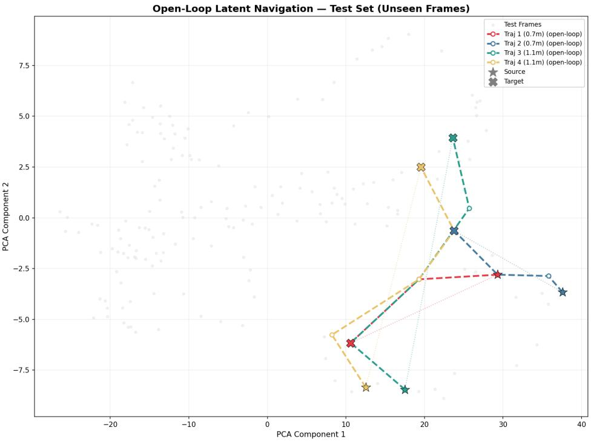  
Figure 9: Multi-Step Navigation Trajectories. Three trajectories of varying difficulty generated via open-loop navigation in the latent space. Top $( \Delta = 0 . 6 8 \mathbf { m } , 1 9 ^ { \circ } ) \colon$ The planner successfully traverses the exact path with zero final NN retrieval error. Middle $( \Delta = 0 . 8 5 \mathbf { m } , 3 6 ^ { \circ } ) \colon$ Moderate drift, but semantically consistent room traversal. Bottom (∆ = 2.45m, 37◦): Large translation creates drift, but rotation is recovered exceptionally well $( < 5 ^ { \circ } \mathrm { e r r o r } )$

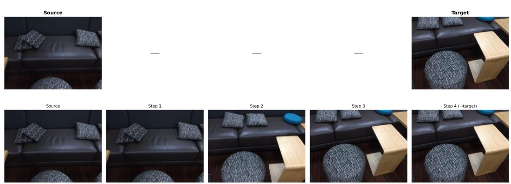  
Figure 10: Trajectory 1 (Perfect Recovery). $\Delta P = 0 . 6 8 \mathrm { { m } , 1 9 ^ { \circ } }$ rotation. The final retrieved frame perfectly matches the target image. (Final error: 0.000m, 0.000rad).

Trajectory 1: Δtrans=0.85m, Δrot=0.63rad | Final error: 0.387m / 0.140rac  
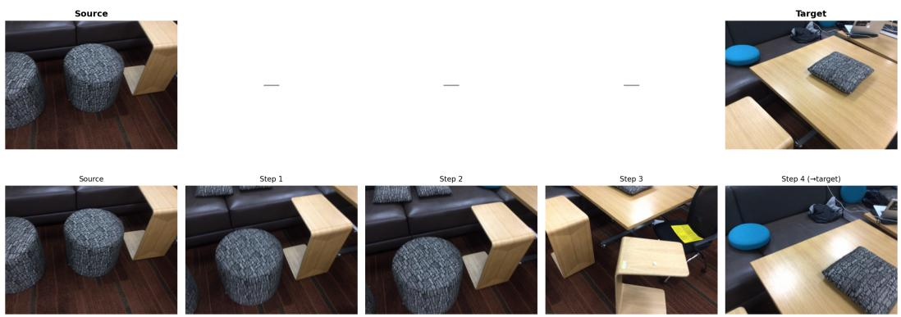  
Figure 11: Trajectory 2 (Moderate Drift). $\Delta P = 0 . 8 5 \mathrm { m } , 3 6 ^ { \circ }$ rotation. The path drifts slightly due to the open-loop integration, but the retrieved frames remain visually coherent and approach the target view. (Final error: 0.387m, 0.140rad).

Trajectory 4: Δtrans=2.45m, ∆rot=0.65rad|Final error: 1.020m / 0.084rad  
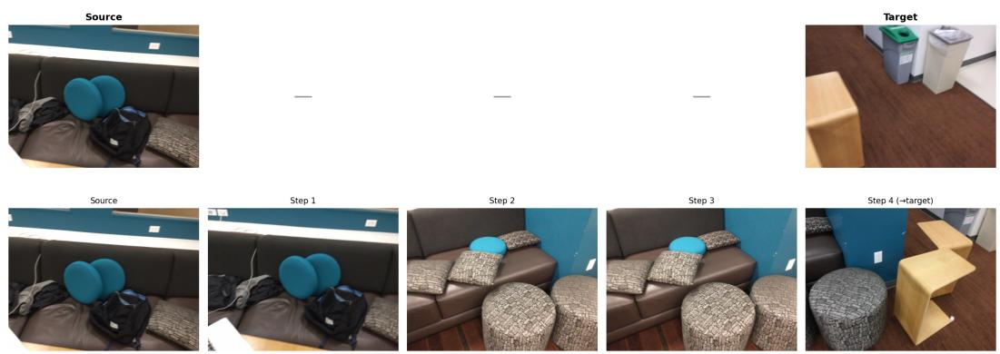  
Figure 12: Trajectory 3 (Extreme Displacement). $\Delta P \ : = \ : 2 . 4 5 \mathrm { m } , 3 7 ^ { \circ }$ rotation. The largest displacement tests the limits of the open-loop linear model. While translation error accumulates, the rotation is extremely well recovered (0.084rad ≈ 5◦). (Final error: 1.020m, 0.084rad).