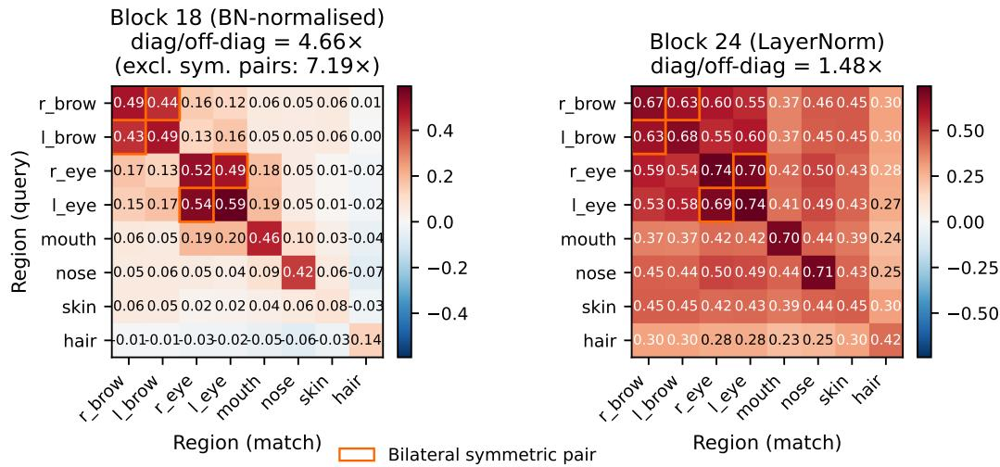
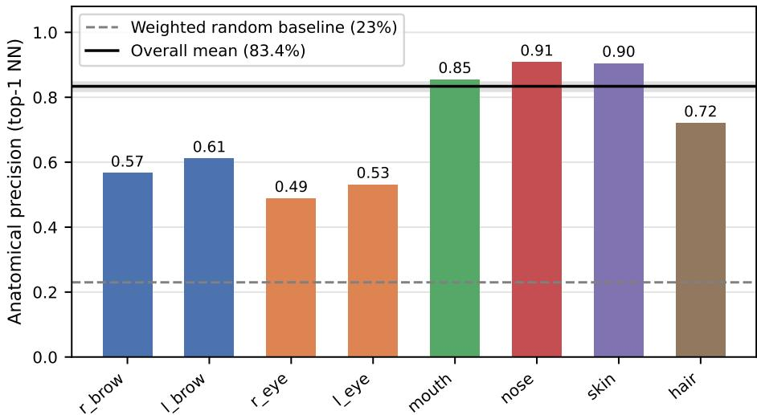
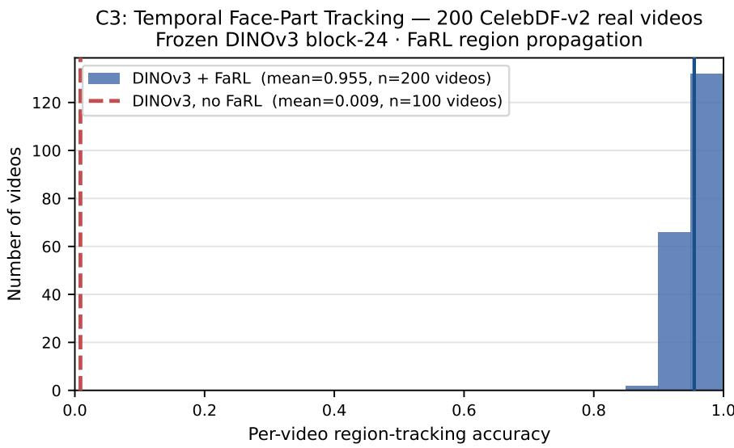
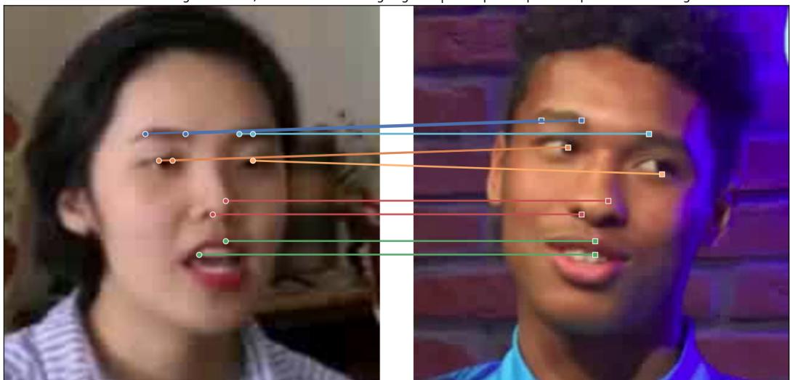
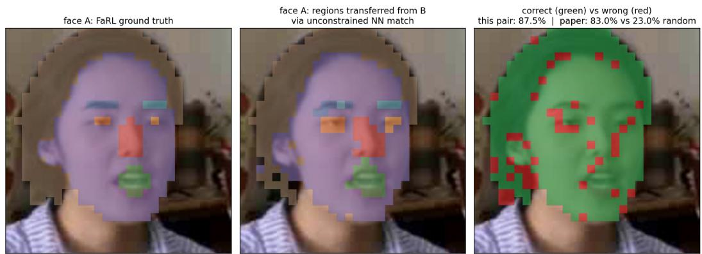
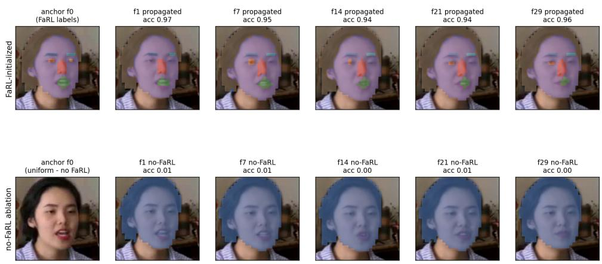
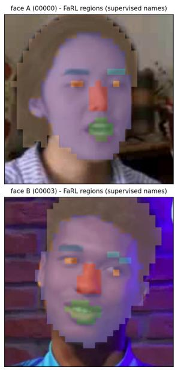
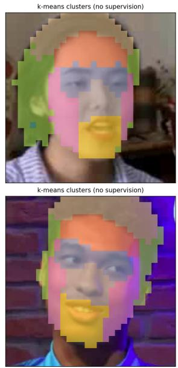

# Emergent Region-Level Facial Correspondence in Frozen Vision Foundation Models

Izaldein Al-Zyoud∗ Abdulmotaleb El Saddik MCRLab, School of Electrical Engineering and Computer Science University of Ottawa, Ottawa, ON, Canada

## Abstract

Frozen self-supervised vision models can align parts of generic objects, but it remains unclear whether this correspondence extends to human faces, where global layout is shared while identity-specific appearance varies sharply. We test whether frozen DINOv3 features define a region-level facial coordinate system: a feature space in which eyes, brows, nose, mouth, skin, and hair remain distinguishable across people and across time without face-specific training. Using DINOv3 ViT-L/16 patch embeddings and FaRL only as a face-part labeling interface, we evaluate cross-identity nearest-neighbor matching and temporal label propagation on 200 CelebDF-v2 real videos. DINOv3 achieves 83.0% region-level semantic accuracy under unconstrained cross-identity matching, compared with a 23.0% area-weighted random baseline, and 95.5% temporal tracking accuracy without a learned temporal module. A no-FaRL control collapses to 0.9%, showing that FaRL supplies semantic initialization while DINOv3 supplies dense spatial correspondence. The strongest correspondence appears at an intermediate layer: block 18 gives a 4.93× same-region versus cross-region discrimination ratio, compared with 1.48× at the final block. Against CLIP ViT-L/14, DINOv3 shows only a small aggregate advantage but a +16.8 pp gain on anatomical regions, indicat ing that image-level contrastive supervision captures coarse facial layout but not fine-grained anatomical identity. These results establish frozen DINOv3 as a strong zero-shot representation for region-level facial correspondence and identify intermediate self-supervised features as the most useful layer for dense face analysis.

## 1 Introduction

Frozen vision foundation models have shown a surprising ability to support dense visual correspondence. Features learned without correspondence supervision can often match object parts across images [1], suggesting that self-supervised training may produce a shared visual coordinate system. However, most evidence for this property comes from generic object categories and point-level benchmarks [14]. Human faces remain a more delicate test case.

Faces are highly structured: most subjects share the same coarse layout of eyes, brows, nose, mouth, skin, and hair. This makes spatial alignment easier than in many object categories. But the same regularity also creates a harder question. Does a frozen representation merely encode approximate facial layout, or does it preserve anatomical region identity across different people? A true regionlevel coordinate system should know that a nose patch belongs with noses rather than mouths or nearby skin, even when identity, expression, lighting, and local appearance change.

We study this question using frozen DINOv3 ViT-L/16 [9] features. DINOv3 is a natural candidate because its training is designed to preserve stable patch-level structure at scale. We use FaRL face parsing [15] only as a labeling interface: FaRL assigns semantic names to patches, while all correspondence is computed by nearest-neighbor search or label propagation in frozen DINOv3 feature space. We do not claim that DINOv3 assigns human-readable names to facial parts by itself; rather, FaRL supplies region names, and we test whether frozen DINOv3 features provide the dense correspondence structure that preserves those names across identities and time.

Our evaluation follows three increasingly stringent tests. First, we ask whether patches from the same facial region are closer across identities than patches from different regions. Second, we ask whether unconstrained nearest-neighbor matching across two different people recovers the correct facial region without being told the target region. Third, we ask whether the same structure persists over time, allowing face-part labels from one frame to propagate through video without any temporal model.

The results support a clear picture. Intermediate DINOv3 features encode strong region-level facial correspondence: block 18 produces a 4.93× same-region versus cross-region discrimination ratio, rising to 7.19× when bilateral symmetric pairs are excluded. Under unconstrained cross-identity matching, frozen features achieve 83.0% semantic region accuracy against a 23.0% weighted random baseline. In video, the same representation supports 95.5% temporal face-part tracking accuracy without training a temporal module. A no-FaRL control collapses to 0.9%, confirming that FaRL provides the initial semantic names while DINOv3 provides the spatial correspondence needed to move those names through time.

A comparison with CLIP ViT-L/14 [16] clarifies what kind of correspondence is being measured. CLIP performs competitively when matching is constrained to the correct facial region, but falls far behind under unconstrained anatomical matching. This means CLIP captures coarse facial layout but does not reliably separate eyes, brows, mouth, and nose across identities. DINOv3’s advantage is therefore not merely better localization; it is stronger anatomical identification in feature space.

This paper makes three contributions. First, it introduces a region-level evaluation of frozen vision features for facial correspondence, complementing point-level PCK-style correspondence benchmarks [14]. Second, it shows that frozen DINOv3 features support cross-identity and temporal facial correspondence without face-specific training. Third, it identifies an important layer-depth dissociation: intermediate features preserve the local region structure needed for dense correspondence, while final-layer features are more globally mixed and less discriminative for facial anatomy.

## 2 Measuring Facial Correspondence in Frozen Features

## 2.1 DINOv3 and the Gram-Anchored Shared Coordinate System

DINOv3 [9] extends the DINOv2 multi-crop consistency objective [8] to a curated corpus of ∼1.7 billion images with a Gram-matrix anchoring regularizer that constrains the covariance structure of patch tokens across training views. This regularizer has a specific geometric consequence: each feature dimension d develops a stable functional role consistent across all spatial positions and all inputs. This is the shared coordinate system property: feature dimension d encodes the same structural role consistently across all spatial positions and identities.

Layer dissociation. At block 18 of 24, patch tokens retain local spatial discriminability: each region carries a distinctive per-dimension amplitude profile — a characteristic direction in feature space specific to the local structural content of the patch. At the final block 24, the learned LayerNorm affine transform $( \gamma , \beta )$ maps tokens onto the unit hypersphere; the block-depth pattern suggests that this token-wise final normalization mixes token directions, leaving regions less directionally distinct. Because the region-confusion protocol L2-normalizes each patch, vector magnitude is already removed from the comparison: what collapses at block 24 is the directional separation of regions (their per-dimension pattern), not raw feature magnitude. Empirically (§3.1), block 18 yields 4.93× vs. 1.48× for block 24. This property is specific to DINOv3’s training: Siméoni et al. [9] demonstrate that DINOv2 [8] suffers from progressive patch-level consistency collapse at scale, which the Gram-matrix anchoring regularizer was introduced to arrest.

## 2.2 FaRL Face Parsing

FaRL [15] (farl/lapa/448) produces per-pixel segmentation over 11 LaPa classes [7] at 448 × 448 resolution. We downsample to the $2 8 \times 2 8$ patch grid by majority vote, assigning each of the 784 DINOv3 patch tokens a region label, and group 11 classes into 8 foreground regions: mouth from labels {7, 8, 9}; brows and eyes kept laterally separate. Background patches are excluded from all metrics. FaRL is run on CPU due to an MPS adaptive-pool divisibility constraint.

## 2.3 Frozen Features and Correspondence

Amir et al. [1] established zero-shot correspondence for general objects using frozen DINO ViT-S/8, reporting 56.48% PCK on SPair-71k [14]. PCK measures geometric proximity to annotated keypoints — a point-level test that requires human-curated landmark pairs and does not directly test semantic region membership. Wang et al. [11] showed self-supervised video models support tracking via cycleconsistency; Jabri et al. [4] formalized this as contrastive random walk. No prior work applies frozen VFM features to face correspondence at the region level. We introduce region-level semantic accuracy as the direct test: whether unconstrained nearest-neighbor search respects face-part identity across individuals. The feature extractor is the most crucial component in a correspondence pipeline [14]; among extractors, ViT-family backbones outperform CNNs and DINOv3’s Gram-anchored training produces stronger dimensional correspondence than DINOv2 [8].

## 2.4 Feature Extraction Pipeline

Face detection. RetinaFace [2] detects the largest face with 22% padding; the square crop is resized to $4 4 8 \times 4 4 8 .$

DINOv3 patch tokens. Frozen DINOv3 ViT-L/16 produces 784 patch tokens $( 2 8 \times 2 8 $ grid, $D = 1 0 2 4 )$ via two separate get\_intermediate\_layers calls: (i) Block 18 (norm=False), BNnormalized per dimension $\hat { f } _ { 1 8 } = ( f _ { 1 8 } - \mu ) / \sigma ;$ used for the region confusion test and as a secondary reference for cross-identity matching. (ii) Block 24 (norm=True), yielding x\_norm\_patchtokens; primary layer for cross-identity matching and temporal tracking.

FaRL face-part segmentation. Frozen FaRL produces per-pixel labels; each patch token is assigned the majority label over its $1 6 \times 1 6$ pixel area, grouped into 8 foreground regions.

## 2.5 Region Confusion Protocol

For a cross-identity pair (A, B), we sample K = 20 patches per region from each face, L2-normalize each patch, and compute the mean cosine similarity between region $R _ { i }$ in face A and region $R _ { j }$ in face B for all pairs, yielding an $8 \times 8$ confusion matrix. A ratio $> 1$ (diagonal / off-diagonal) indicates features encode semantically consistent structure across identities.

## 2.6 Best-Buddy Cross-Identity Correspondence

Metric rationale. PCK measures keypoint localization precision against annotated sparse landmark pairs; it presupposes human-curated correspondence ground truth unavailable in our setting and tests geometric proximity, not semantic membership. Region-level semantic accuracy tests regionlevel correspondence: whether unconstrained (whole-vector) nearest-neighbor search in DINOv3 feature space respects face-part identity across individuals. Per-dimension role stability — the shared coordinate system property of §2.1 — is the proposed mechanism behind this correspondence and is tested only indirectly: all metrics here are cosine-based and hence invariant to a global rotation of the feature axes, so they do not probe per-dimension identity itself. The evaluation is dense — all foreground patches rather than 10–17 annotated landmarks — and the weighted random baseline (23.0%) accounts for the skewed patch-area distribution (skin: 57% of foreground patches).

Normalization. Per-channel L2 is applied at query time: $\begin{array} { r c l } { \tilde { F } } & { = } & { F / \| F \| _ { \mathrm { c o l } } . } \end{array}$ , normalizing each of the $\begin{array} { l l l } { D } & { = } & { 1 0 2 4 } \end{array}$ columns across $\begin{array} { r l r } { N } & { { } = } & { 7 8 4 } \end{array}$ patches, following the official dense\_sparse\_matching.ipynb protocol [9].

  
Figure 1: $8 \times 8$ cross-identity region confusion matrix (50 face pairs). Block-18 diagonal is 4.93× the off-diagonal (rising to 7.19× excluding the symmetric pairs in orange boxes). Block-24 collapses to 1.48× due to global LayerNorm mixing.

Unconstrained variant. For each foreground patch $p _ { i }$ in face $A \colon \hat { p } = \arg \operatorname* { m a x } _ { j } \tilde { f } _ { i } \cdot \tilde { f } _ { j }$ over all 784 patches of face B. Semantic accuracy = fraction of matches in the same FaRL region as $p _ { i }$

FaRL-constrained variant. Search restricted to same-region patches of face B. Spatial precision = fraction of matches within the median within-region pairwise patch-grid distance (random baseline = 0.50). All metrics bootstrapped over 200 pairs (1000 resamples, 95% CIs).

## 2.7 Temporal Label Propagation

We implement the official propagate() protocol [9]: per-patch L2 normalization; anchor frame 0 (FaRL-labeled) always in context plus rolling queue of last Q = 7 frames; circular neighbourhood mask radius $r = 1 2 ; { \mathrm { t o p } } { - } K = 5$ matches; softmax temperature $\tau = 0 . 2 ;$ soft label probability propagation. Metric: mean per-frame accuracy of predicted vs. ground-truth FaRL label over foreground patches, averaged over frames 1–30 and over all 200 videos. No-FaRL ablation: anchor initialized with uniform $q _ { j } = 1 / M \left( M = 8 \right)$ , collapsing argmax to class 0 for all patches.

## 2.8 Setup

All experiments use CelebDF-v2 real videos [6] (YouTube-real split). Region confusion and crossidentity matching use static frame pairs (segment 0, frame 0) from distinct identities. Temporal tracking uses 200 videos, 30 consecutive frames each. DINOv3 ViT-L/16: 448 × 448 input, 784 patches, $D = 1 0 2 4$ ; block-18 with BN normalization, block-24 with LN-affine. FaRL lapa/448: 8 foreground regions. Normalization applied at query time only, never cached. All experiments run on a Mac Pro 2019 with AMD Radeon Pro discrete GPU (MPS via Metal, not Apple Silicon); FaRL on CPU.

## 3 Region-Level Correspondence Emerges Across Identity

## 3.1 Region Confusion Matrix

Results are shown in Figure 1 and Table 1. Block-18 achieves a 4.93× ratio. The elevated offdiagonal entries for r\_brow↔l\_brow (0.436) and r\_eye↔l\_eye (0.492) reflect bilateral symmetry, not feature noise; excluding these yields 7.19×. Block 24 shows only 1.48×: the final token-wise

C2: Cross-Identity Anatomical Precision tok\_b18 200 pairs · unconstrained NN · n\_pairs=200  
  
Figure 2: Per-region semantic accuracy for tok\_b18 (200 pairs, unconstrained NN). Dashed: weighted random baseline (23.0%). Solid: overall mean (83.4%). Brow and eye regions achieve 0.49–0.61 against ≤0.4% random chance.

LayerNorm projects all tokens toward the unit hypersphere and mixes token directions, blending the per-dimension profiles that keep regions directionally distinct into a global face representation.

Table 1: Region confusion ratios. Ratio = diag mean / off-diag mean. Symmetric-pair exclusion columns are computed on an independent 50-pair sampling (c1\_symmetric\_analysis; b18 diag 0.398), whose all-pairs ratio (4.7×) is consistent with the main sampling.

<table><tr><td>Block</td><td>Diag</td><td>Off-diag</td><td>Ratio</td><td>Off-diag (excl. sym.)</td><td>Ratio (excl. sym.)</td></tr><tr><td>b18 (BN)</td><td>0.414</td><td>0.084</td><td> $4.93 \times$ </td><td>0.055</td><td> $7.19 \times$ </td></tr><tr><td>b24 (LN)</td><td>0.637</td><td>0.429</td><td> $1.48 \times$ </td><td>0.411</td><td> $1.55 \times$ </td></tr></table>

## 3.2 Cross-Identity Semantic Accuracy

Results are shown in Figure 2 and Table 2. Overall semantic accuracy: b18 0.830, b24 0.823, vs. weighted random 0.230. The random baseline is dominated by skin (57% of foreground patches, random= 0.29) and hair (35%, random= 0.18); small regions (eyes, brows) have random baselines $\leq 0 . 4 \%$ . Nose (0.974 b24) and mouth (0.919 b24) are the most reliably matched mid-face regions. The b18/b24 crossover is region-dependent: b18 outperforms b24 on brows (local structure favors intermediate layers); b24 outperforms on mouth and nose (global context aids structurally stable regions). b18 and b24 are statistically tied on spatial precision (FaRL-constrained: 0.801 vs. 0.805). Qualitative examples of the matching, temporal-propagation, and clustering protocols are shown in Appendix A.

Cross-backbone comparison. Replicating cross-identity matching with frozen CLIP ViT-L/14 (32×32 patch grid) mirrors the temporal cross-backbone gap (Table 3). Under the unconstrained protocol CLIP achieves only 0.678 overall (−15.2 pp vs. DINOv3-b18) and 0.433 on the face-only mean (−25.3 pp), with the largest deficits on l\_eye (−45.9 pp) and l\_brow (−29.2 pp). Under the FaRL-constrained variant the face-only gap collapses to ≈ 0.4 pp (0.260 for CLIP vs. 0.256 for DINOv3-b18): once told “this is a brow,” CLIP can localize within the region. The asymmetry sharpens the interpretation: CLIP encodes facial layout but cannot discriminate brow patches from non-brow patches across identities. DINOv3 provides both anatomical identification and spatial

Table 2: Semantic accuracy (unconstrained, random=0.230) and spatial precision (FaRL-constrained, random=0.50) for 200 cross-identity pairs.

<table><tr><td rowspan="2">Region</td><td colspan="3">Unconstrained</td><td colspan="2">FaRL-constrained</td></tr><tr><td>Random</td><td>b18 [95% CI]</td><td>b24 [95% CI]</td><td>b18 [95% CI]</td><td>b24 [95% CI]</td></tr><tr><td>r_brow</td><td>0.004</td><td>0.597 [.548,.650]</td><td>0.372 [.323,.424]</td><td>0.279 [.228,.337]</td><td>0.256 [.201,.311]</td></tr><tr><td>l_brow</td><td>0.004</td><td>0.585 [.533,.637]</td><td>0.437 [.384,.497]</td><td>0.255 [.203,.308]</td><td>0.257 [.205,.311]</td></tr><tr><td>r_eye</td><td>0.002</td><td>0.443 [.367,.518]</td><td>0.544 [.468,.619]</td><td>0.100 [.047,.167]</td><td>0.078 [.028,.136]</td></tr><tr><td>l_eye</td><td>0.002</td><td>0.693 [.622,.762]</td><td>0.523 [.446,.596]</td><td>0.090 [.045,.146]</td><td>0.062 [.028,.102]</td></tr><tr><td>mouth</td><td>0.012</td><td>0.878 [.857,.897]</td><td>0.919 [.894,.940]</td><td>0.362 [.320,.402]</td><td>0.342 [.301,.390]</td></tr><tr><td>nose</td><td>0.019</td><td>0.920 [.910,.929]</td><td>0.974 [.967,.980]</td><td>0.449 [.399,.497]</td><td>0.454 [.400,.503]</td></tr><tr><td>skin</td><td>0.292</td><td>0.901 [.896,.905]</td><td>0.874 [.868,.879]</td><td>0.901 [.889,.914]</td><td>0.912 [.894,.928]</td></tr><tr><td>hair</td><td>0.183</td><td>0.723 [.683,.762]</td><td>0.712 [.667,.756]</td><td>0.768 [.729,.805]</td><td>0.763 [.720,.804]</td></tr><tr><td>FG overall</td><td>0.230</td><td>0.830 [.814,.845]</td><td>0.823 [.808,.838]</td><td>0.801 [.779,.822]</td><td>0.805 [.781,.825]</td></tr></table>

alignment; CLIP provides only the latter. This implies the temporal face-only advantage (Table 5) is specifically about anatomical identification, not spatial encoding.

Table 3: Cross-backbone semantic accuracy (200 cross-identity pairs). Face-only = mean over r/l brows, r/l eyes, mouth, nose (skin/hair excluded). CLIP closes the gap on constrained faceonly matching (knows layout) but fails on unconstrained matching (cannot identify anatomy across identities).

<table><tr><td rowspan="2">Backbone</td><td colspan="2">Unconstrained</td><td colspan="2">FaRL-constrained</td></tr><tr><td>Overall</td><td>Face-only</td><td>Overall</td><td>Face-only</td></tr><tr><td>DINOv3-b18</td><td>0.830</td><td>0.686</td><td>0.801</td><td>0.256</td></tr><tr><td>DINOv3-b24</td><td>0.823</td><td>0.628</td><td>0.805</td><td>0.242</td></tr><tr><td>CLIP</td><td>0.678</td><td>0.433</td><td>0.680</td><td>0.260</td></tr><tr><td>Δ (b18 - CLIP)</td><td>+15.2</td><td>+25.3</td><td>+12.1</td><td>-0.4</td></tr></table>

## 4 The Correspondence Persists Through Time but Depends on the Right Semantics

## 4.1 Temporal Face-Part Tracking

Results are in Figure 3 and Table 4. Frozen DINOv3 + FaRL achieves $0 . 9 5 5 \pm 0 . 0 1 9$ across 200 videos. Both blocks perform identically (0.955 vs. 0.954): temporal tracking depends on local appearance consistency, encoded equally by both layers. The no-FaRL ablation $( 0 . 0 0 9 \pm 0 . 0 0 4 )$ is the most informative result: uniform anchor initialization causes propagation to collapse to class 0 (r\_brow) for all patches, revealing that FaRL initialization is entirely load-bearing for semantics and DINOv3 is entirely load-bearing for spatial correspondence. The PoC protocol (hard argmax, no neighbourhood, single-frame context) achieves only 0.509: the +44.6pp improvement from PoC to official protocol comes from the measurement protocol, not the features.

Table 4: Temporal tracking results (200 CelebDF-v2 real videos).

<table><tr><td>Protocol</td><td>Block</td><td>Mean</td><td>Std</td></tr><tr><td>FaRL-initialized (official propagate())</td><td>b24</td><td>0.955</td><td>±0.019</td></tr><tr><td>FaRL-initialized (official propagate())</td><td>b18</td><td>0.954</td><td>±0.020</td></tr><tr><td>No-FaRL (uniform anchor)</td><td>b24</td><td>0.009</td><td>±0.004</td></tr><tr><td>Hard argmax, no protocol (PoC baseline)</td><td>b24</td><td>0.509</td><td>±0.131</td></tr></table>

Block-depth and cross-model sweep. Table 5 reports temporal tracking results across all five DINOv3 blocks and CLIP ViT-L/14 [16] (32×32 patch grid) under three metrics: the patch-weighted aggregate (Agg.), a balanced metric (uniform mean over all 8 regions), and a face-only metric (uniform mean over r/l brows, r/l eyes, mouth, nose; skin and hair excluded). Skin and hair together account for 91% of foreground patches, structurally dominating the aggregate.

  
Figure 3: Per-video region-tracking accuracy distribution (200 CelebDF-v2 real videos, frozen DINOv3 block-24 + FaRL propagation). No-FaRL ablation (dashed red, mean=0.009) collapses entirely, isolating the two load-bearing components.

The aggregate is flat across all DINOv3 blocks (0.953–0.955, ±0.2 pp), but face-only reveals a monotonic decline: b18 peaks at 0.731 and b24 reaches only 0.634 (−9.7 pp), exposing degradation of anatomical tracking quality through later layers that the aggregate conceals. Against CLIP, DINOv3-b18 shows +1.8 pp aggregate advantage but +16.8 pp face-only — a ∼9× amplification from headline to geometrically-sensitive metric. DINOv3’s advantage concentrates in eyes (+24 pp) and brows (+19–20 pp); both models track skin and hair comparably (≤2 pp gap), confirming that CLIP’s image-level contrastive training is sufficient for coarse region tracking but insufficient for the fine-grained anatomical correspondence that temporal facial analysis requires.

Table 5: Block-depth and cross-model sweep on temporal tracking (200 CelebDF-v2 real videos; FaRL-initialized propagate()). Balanced: uniform mean over 8 regions. Face-only: r/l brows, r/l eyes, mouth, nose (skin/hair excluded).

<table><tr><td>Backbone</td><td>Agg. mean</td><td>Balanced</td><td>Face-only</td></tr><tr><td>DINOv3-b16</td><td>0.953</td><td>0.785</td><td>0.723</td></tr><tr><td>DINOv3-b18</td><td>0.954</td><td>0.791</td><td>0.731</td></tr><tr><td>DINOv3-b20</td><td>0.955</td><td>0.773</td><td>0.706</td></tr><tr><td>DINOv3-b22</td><td>0.955</td><td>0.765</td><td>0.695</td></tr><tr><td>DINOv3-b24</td><td>0.955</td><td>0.721</td><td>0.634</td></tr><tr><td>CLIP</td><td>0.936</td><td>0.662</td><td>0.563</td></tr></table>

## 5 Controls and Mechanistic Checks

## 5.1 Attention Facet Ablation

Following Amir et al. [1] (DINO keys > tokens for object correspondence), we hook blocks[17].attn.qkv and blocks[23].attn.qkv to capture pre-RoPE projections and evaluate cross-identity unconstrained precision (Table 6). Token outputs outperform all pre-RoPE projections: tok\_b18 achieves the highest overall (0.834), reversing Amir et al.’s finding. Among projections, values > keys > queries for both blocks. DINOv3 applies RoPE to keys at query time; pre-RoPE keys are content-only and lack positional phase required for spatial consistency. The b18/b24 brow dissociation persists across all facet types, confirming a block-depth effect rather than an aggregation artefact.

Table 6: Attention facet ablation on cross-identity matching (200 pairs, unconstrained). tok\_b18 achieves highest overall precision, reversing the DINO key > token ordering.

<table><tr><td>Facet</td><td>Overall</td><td>r_brow</td><td>l_brow</td><td>r_eye</td><td>l_eye</td><td>mouth</td><td>nose</td><td>skin</td></tr><tr><td>q_b18</td><td>0.789</td><td>0.567</td><td>0.634</td><td>0.595</td><td>0.619</td><td>0.686</td><td>0.856</td><td>0.871</td></tr><tr><td>k_b18</td><td>0.804</td><td>0.531</td><td>0.496</td><td>0.582</td><td>0.571</td><td>0.717</td><td>0.865</td><td>0.889</td></tr><tr><td>v_b18</td><td>0.824</td><td>0.555</td><td>0.599</td><td>0.542</td><td>0.558</td><td>0.782</td><td>0.879</td><td>0.884</td></tr><tr><td>q_b24</td><td>0.821</td><td>0.409</td><td>0.466</td><td>0.506</td><td>0.469</td><td>0.792</td><td>0.915</td><td>0.898</td></tr><tr><td>k_b24</td><td>0.808</td><td>0.441</td><td>0.444</td><td>0.342</td><td>0.387</td><td>0.766</td><td>0.867</td><td>0.888</td></tr><tr><td>v_b24</td><td>0.832</td><td>0.387</td><td>0.392</td><td>0.561</td><td>0.480</td><td>0.836</td><td>0.888</td><td>0.889</td></tr><tr><td>tok_b18</td><td>0.834</td><td>0.566</td><td>0.611</td><td>0.489</td><td>0.531</td><td>0.855</td><td>0.908</td><td>0.905</td></tr><tr><td>tok_b24</td><td>0.826</td><td>0.372</td><td>0.408</td><td>0.618</td><td>0.513</td><td>0.917</td><td>0.970</td><td>0.879</td></tr></table>

## 5.2 Independent Labeler Check

To verify the cross-identity matching precision is not an artefact of FaRL serving as both method and ground truth, we evaluate matching (b24, 200 pairs) under SegFormer-b5 [12] pretrained on CelebAMask-HQ (19 classes, human-annotated, independent of LaPa and FaRL). FaRL–SegFormer inter-labeler agreement: 89.1% on 100 frames. Large and mid-face regions are stable: nose (0.974 vs. 0.980), skin (0.874 vs. 0.867), mouth (0.919 vs. 0.873). Eye and brow divergence at the 1–2 patch scale reflects label boundary differences between CelebAMask-HQ and LaPa, not feature failure.

## 5.3 Unsupervised Validation

To verify that FaRL labels reflect genuine structure in the DINOv3 feature space rather than an evaluation artifact, we apply an Amir et al. [1]-style protocol: pool all foreground DINOv3 patch descriptors from the 200 evaluation frames, run k-means $( k \in \{ 4 , 8 , 1 2 \}$ , no FaRL supervision), and measure NMI and ARI of the discovered clusters against FaRL region labels as independent ground truth (Table 7). Block-18 achieves ${ \bf N M I } = 0 . 4 5 ( k = 8 )$ , stable across $k \in \{ 4 , 8 , 1 2 \}$ (range 0.42–0.52); cluster purity of 0.83 indicates each discovered cluster is dominated by a single FaRL region. $\mathrm { A t } k = 4$ , NMI rises to 0.52, consistent with DINOv3 encoding four macro-groups (upper face, nose, mouth, surface) that FaRL’s 8-region scheme subdivides. Block-24 shows comparable clustering alignment (NMI = 0.45, purity = 0.88). These results establish that FaRL labels are not an arbitrary evaluation choice: DINOv3 independently organises facial patches into the same semantic groups, and FaRL provides a named interface for structure the model encodes without supervision. The clustering equivalence of b18 and b24 does not contradict the 4.93× vs. 1.48× finding: the block-18 advantage is an amplitude discriminability property; k-means on L2-normalised features probes spatial cluster structure where amplitude is removed.

Table 7: Unsupervised validation: k-means (no FaRL) vs. FaRL labels as ground truth. 200 frames, 80,973 foreground patches.

<table><tr><td rowspan="2">Block</td><td colspan="2">k=4</td><td colspan="3">k=8</td><td>k=12</td></tr><tr><td>NMI</td><td>ARI</td><td>NMI</td><td>ARI</td><td>Purity</td><td>NMI</td></tr><tr><td>b18 (BN)</td><td>0.524</td><td>0.429</td><td>0.450</td><td>0.230</td><td>0.830</td><td>0.422</td></tr><tr><td>b24 (LN)</td><td>0.482</td><td>0.386</td><td>0.453</td><td>0.223</td><td>0.879</td><td>0.415</td></tr><tr><td>Random</td><td>≈0</td><td>≈0</td><td>≈0</td><td>≈0</td><td>0.13</td><td>≈0</td></tr></table>

## 6 Related Work

Frozen ViT features for dense correspondence. Amir et al. [1] demonstrated zero-shot part-level correspondence using frozen DINO-ViT keys (56.48% PCK on SPair-71k [14]). PCK is the fieldstandard metric for semantic correspondence; it measures geometric proximity to annotated keypoints and requires human-curated landmark pairs. All prior frozen-feature correspondence work operates at the keypoint level. We are the first to evaluate frozen VFM features at the face-part region level, introducing region-level semantic accuracy as a direct test of whether the feature space respects semantic region identity — rather than geometric proximity to annotated landmarks.

Self-supervised temporal correspondence. Wang et al. [11] showed cycle-consistency in time provides free supervisory signal for correspondence. Jabri et al. [4] formalized this via contrastive random walk, learning features that transfer to video object segmentation. DINOv3’s Gram-anchored training is a stronger instance; our temporal tracking result (95.5%) shows it is sufficient for face tracking without temporal training.

Diffusion features for correspondence. Tang et al. [10] showed Stable Diffusion U-Net features support semantic correspondence without fine-tuning. Zhang et al. [13] showed SD and DINO features are complementary for zero-shot semantic correspondence. These confirm correspondence as a general emergent property of large-scale self-supervised models [14]; our work makes the mechanistic claim specific to DINOv3’s Gram anchoring and establishes it at the face-part region level for the first time.

Point tracking and trained upper bounds. TAP-Vid [3] introduced the point-tracking benchmark and propagate() API we adopt for temporal tracking. Chrono [5] augments frozen DINOv2 with a learned temporal adapter, achieving state-of-the-art on TAP-Vid-DAVIS. Our evaluation uses frozen DINOv3 with no temporal adapter evaluated on face-part labels; the 95.5% accuracy shows that face-specific Gram anchoring reduces the need for temporal training in the face domain.

## 7 Limitations and Conclusion

Frozen DINOv3 ViT-L/16 features support region-level facial correspondence across identities and time without any face-specific training. The strongest signal comes from an intermediate layer: block 18 yields 4.93× same-region versus cross-region discrimination, 83.0% unconstrained cross-identity matching accuracy, and 95.5% temporal tracking, while the final block is markedly more mixed. The cross-backbone comparison clarifies what kind of structure is being measured: CLIP closes the gap once the search is constrained to the correct region, but lags by +16.8 pp on unconstrained anatomical matching. The comparison is diagnostic rather than merely competitive — DINOv3 provides anatomical identification, not only spatial alignment.

Three limitations bound the claims. FaRL is both labeling interface and ground truth, though a SegFormer replication (§5.2) and unsupervised clustering [1] (§5.3, NMI = 0.45) indicate the evaluation reflects feature-space structure rather than labeler artefact. The evaluation uses a single dataset (CelebDF-v2) and parsing scheme (LaPa). And the cross-identity matching test measures region-level semantic accuracy by design rather than keypoint PCK, since cross-identity landmark pairs are not available for our setting; [14] identify fine-tuning as the dominant performance factor in semantic correspondence, so our frozen numbers should be read as a principled lower bound for the face domain. Useful next steps include a DINOv3-native LaPa face parser, a mutual best-buddy variant for cross-identity matching, and face-specific fine-tuning to establish the supervised upper bound.

Conceptually, the contribution is to identify a frozen, intermediate-layer coordinate system for facial regions: a representation in which anatomical identity is preserved across people and through time, recoverable by simple nearest-neighbor matching, without any face-specific supervision.

## 8 Broader Impact

Region-level facial correspondence in frozen vision foundation models supports several beneficial applications: face normalization and recognition under pose and expression variation, biometric and forensic identification, real-time avatar animation in XR/AR/VR systems, and clinical analyses including facial asymmetry measurement, post-surgical change tracking, syndrome diagnosis (e.g., Noonan syndrome), and morphometric studies. Segmentation tells you what each pixel is; correspondence tells you where it maps in another face — modern pipelines combine both. We acknowledge dual-use risk (face manipulation, surveillance, unauthorized biometric tracking) and mitigate it by introducing no novel correspondence algorithm and using only publicly released frozen pre-trained models, releasing no new face data or weights.

## References

[1] Amir, S., Gandelsman, Y., Bagon, S., & Dekel, T. (2022). Deep ViT features as dense visual descriptors. ECCV Workshops.

[2] Deng, J., Guo, J., Ververas, E., Kotsia, I., & Zafeiriou, S. (2020). RetinaFace: Single-stage dense face localisation in the wild. CVPR, 5203–5212.

[3] Doersch, C., et al. (2022). TAP-Vid: A benchmark for tracking any point in a video. NeurIPS.

[4] Jabri, A., Owens, A., & Efros, A.A. (2020). Space-time correspondence as a contrastive random walk. NeurIPS.

[5] Kim, I.H., Cho, S., Huang, J., Yi, J., Lee, J.-Y., & Kim, S. (2025). Exploring temporally-aware features for point tracking. CVPR.

[6] Li, Y., Yang, X., Sun, P., Qi, H., & Lyu, S. (2020). Celeb-DF: A large-scale challenging dataset for DeepFake forensics. CVPR, 3207–3216.

[7] Liu, Y., et al. (2020). A new dataset and boundary-attention semantic segmentation for face parsing. AAAI.

[8] Oquab, M., et al. (2023). DINOv2: Learning robust visual features without supervision. TMLR.

[9] Siméoni, O., et al. (2025). DINOv3. arXiv preprint arXiv:2508.10104.

[10] Tang, S., et al. (2023). Emergent correspondence from image diffusion. NeurIPS.

[11] Wang, X., Jabri, A., & Efros, A.A. (2019). Learning correspondence from the cycle-consistency of time. CVPR.

[12] Xie, E., Wang, W., Yu, Z., Anandkumar, A., Alvarez, J.M., & Luo, P. (2021). SegFormer: Simple and efficient design for semantic segmentation with transformers. NeurIPS.

[13] Zhang, C., et al. (2023). A tale of two features: Stable diffusion complements DINO for zero-shot semantic correspondence. NeurIPS.

[14] Zhang, K., Li, X., Lu, J., & Han, K. (2025). Semantic correspondence: Unified benchmarking and a strong baseline. arXiv preprint arXiv:2505.18060.

[15] Zheng, Y., et al. (2022). General facial representation learning in a visual-linguistic manner. CVPR.

[16] Radford, A., Kim, J.W., Hallacy, C., Ramesh, A., Goh, G., Agarwal, S., Sastry, G., Askell, A., Mishkin, P., Clark, J., Krueger, G., & Sutskever, I. (2021). Learning transferable visual models from natural language supervision. ICML.

## A Qualitative Examples

This appendix illustrates the protocols of §2 on individual samples from the evaluation set (two identities from the CelebDF-v2 YouTube-real split). All panels are rendered from the same cached features and FaRL patch labels used in the quantitative experiments; per-panel numbers are single-pair (or single-video) values, shown next to the corresponding evaluation-set statistics from the main text. Figure 4 shows unconstrained cross-identity best-buddy matching (the C2 protocol); Figure 5 the resulting dense region-label transfer; Figure 6 temporal label propagation together with its no-FaRL collapse (the C3 protocol); and Figure 7 the unsupervised k-means validation of §5.3.

Best-buddy matches, face A → face B (block 18; unconstrained over all 784 patches) solid = same-region match, dotted red = wrong region | sampled 2 patches per structural region

  
Figure 4: Unconstrained best-buddy matching between two identities (block 18, per-channel L2). Each sampled patch of face A (two per structural region) is connected to its nearest neighbor among all 784 patches of face B; the search is never told the target region. Solid lines: same-region matches; dotted red: wrong-region matches. Matches land on the correct anatomy despite the pose difference.

  
Figure 5: Dense label transfer for the same pair: every foreground patch of face A is recolored by the FaRL region of its best buddy in face B. Left: FaRL ground truth; middle: transferred regions; right: agreement map (green correct, red wrong). Accuracy on this pair is 87.5%; the 200-pair mean is 0.830 against the 0.230 weighted random baseline (Table 2).

Temporal label propagation, video 00000 (block 24) - paper: 95.5% vs 0.9%  
  
Figure 6: Temporal label propagation (block 24, official propagate() protocol). Top row: FaRL labels the anchor frame only; propagated labels track the face through frame 29 (this video: 0.951; 200-video mean: 0.955, Table 4). Bottom row: the no-FaRL ablation replaces the anchor with a uniform distribution, and the same features and protocol collapse to a single class (this video: 0.008; mean: 0.009). FaRL is load-bearing for semantics; DINOv3 is load-bearing for spatial correspondence.

DINOv3 organizes facial patches into regions on its own (NMI 0.46  

  
Figure 7: Unsupervised validation (§5.3): k-means (k = 8) on frozen block-18 patch features, fit without FaRL supervision, painted on the two demo identities next to the FaRL regions. Cluster identities are arbitrary (unsupervised palette); their spatial support recovers the facial regions (NMI = 0.459 on this fit; 0.450 in Table 7).