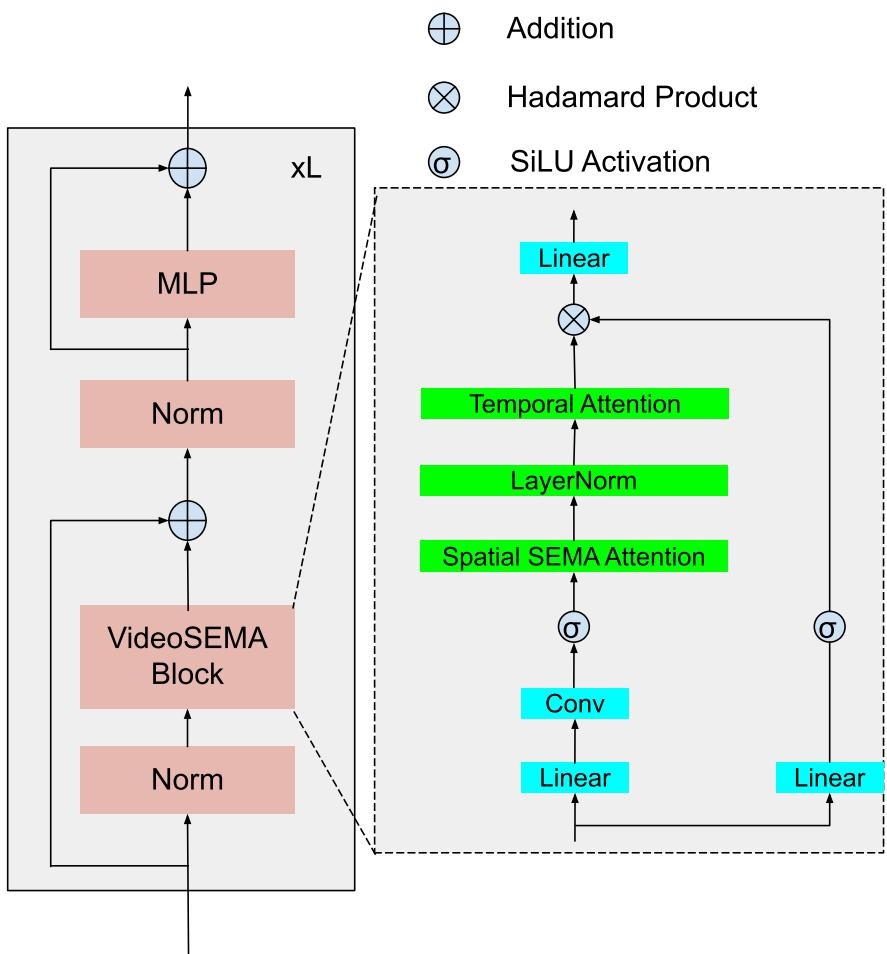
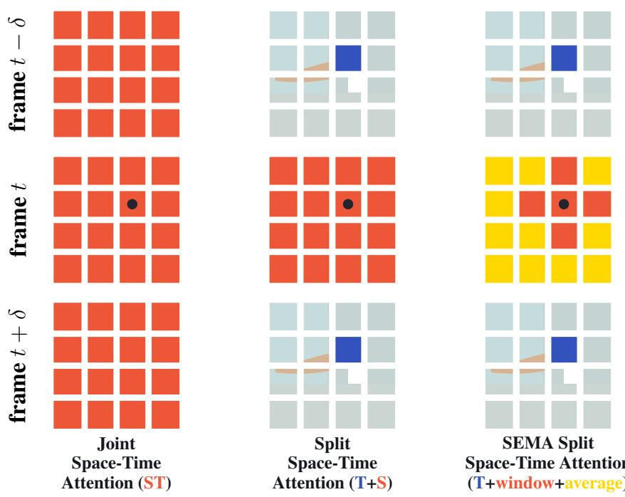
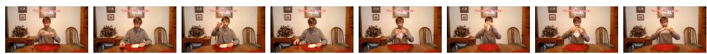

# VideoSEMA: a scalable and efficient Mamba-like attention for video understanding

Nhat Thanh Tran Department of Mathematics University of California, Irvine Irvine, USA nhattt@uci.edu

Shuai Zhang Qualcomm AI Research San Diego, USA shuazhan@qti.qualcomm.com

Yunling Zheng Qualcomm AI Research San Diego, USA yunlzhen@qti.qualcomm.com

Jack Xin Department of Mathematics University of California, Irvine Irvine, USA jack.xin@uci.edu

Fanghui Xue Qualcomm AI Research<sup>†</sup> San Diego, USA fangxue@qti.qualcomm.com

Jiancheng Lyu Qualcomm AI Research San Diego, USA jianlyu@qti.qualcomm.com

Yingyong Qi Qualcomm AI Research San Diego, USA yingyong@qti.qualcomm.com

## Abstract

We present for video understanding (classification) a split space-time attention model, VideoSEMA, consisting of a scalable and efficient Mamba-like attention (SEMA) block in space and a softmax temporal attention in time. In each frame, SEMA attention applies a local window attention in parallel with a global averaging in a Mamba macro-architecture, which is called Mamba-like. Under certain rank conditions, we prove that the computationally cheaper split space-time attention is equivalent to full space-time attention. On benchmark K400 data sets, VideoSEMA out-performs heavier vision transformer and Mamba models. On benchmark SSv2 data, VideoSEMA leads in top-1 accuracy among models of similar parameter sizes. As image resolution scales up from standard 224<sup>2</sup> to 1024<sup>2</sup> on K400 and without fine-tuning, VideoSEMA degrades much more gracefully than VideoMamba in accuracy. It is promising to extend VideoSEMA to longer videos with a dilated/sparse temporal attention.

## 1 Introduction

Understanding complex spatiotemporal patterns in videos remains a fundamental challenge in com puter vision, with application ranging from classification and segmentation to world modeling for autonomous system such as robotics and self-driving vehicles. With the widespread of usage of mul timodal models in combination with language models, recent advances have leveraged transformer based architecture and large foundation models to capture long range dependencies, achieving state of the art performance [2, 4, 15, 27, 25, 1]. Despite their success, these models predominately rely on Vision Transformer (ViT) backbones, which incur high computational costs for large video inputs. To alleviate this problem, some works explores Mamba [8] as backbone, which reduces the computation cost for long sequences, such as in VideoMamba [13]. Linear attention is another approach to reduce the cost of classical attention mechanism and WLiT demonstrates that it is an effective way to process video [21]. Lately, Mamba-like attention models have been developed as an efficient replacement of classical softmax attention in image application [10]. Mamba-like means to keep the macro-architecture of Mamba yet embed in it light weight non-Mamba attention blocks. Along this line, SEMA [24] is designed to mimic the exponential forgetting property of Mamba by an asymp totically guided global approximation of softmax attention. For a duality view and treatment of softmax and efficient attentions, see [18, 28]. An operator splitting and integro-differential equation perspective of transformer is in [22]. In this work, we explore the efficacy of SEMA backbone in video applications.

## Our main contributions are:

• We develop a novel video model in the split space-time attention framework based on a Mamba-like scalable and efficient image backbone (SEMA,[24]).

• To our best knowledge, this is the first work to explore Mamba-like backbones for videos.

• We show theoretically that the split space-time attention is equivalent to the full space-time attention under specific rank conditions.

• We demonstrate on K400 (SSv2) classification tasks that VideoSEMA is an efficient model, outperforming much larger (comparable) parameter and flops size transformer and Mamba video models to date. Post-training and without fine-tuning on K400, it is much more robust than VideoMamba [13] as video frames scale up in size.

## 2 Related Works

Video representation learning has evolved from CNN to attention based models to hierarchical and efficient sequence architectures such as Mamba [8]. TimeSformer [2] demonstrated that factorized space time attention can replace 3D convolutions for video recognition, while MViT and MViTv2 [4, 15] introduced multiscale hierarchical Transformer that improves efficiency and scalability across image and video tasks. More recently, state space models have been explored for long range temporal modeling, with VideoMamba achieving competitive performance on video understanding tasks [13]. At scale, foundation models such as InternVideo2 unify self-supervised, constrastive, and generative objectives for multimodal video understanding [27]. Other efforts focus on efficiency and prediction such as adaptive token strategies improving training and inference flexibility [25], while V-JEPA 2 advanced self-supervised world modeling for motion prediction and long horizon reasoning in video [1]. However, many of these rely on ViT as a vision backbone, whereas our work explores a light weight Mamba-like model (SEMA [24]) as an alternative backbone to capture spatial and temporal features efficiently.

## 3 Methodology

## 3.1 Preliminary

## 3.1.1 Attention and SEMA

Attention is a core component of Transformer which is the main driving force of deep learning in recent years. Formally, given an input $x \in \mathbb { R } ^ { n \times d }$ , then softmax full attention is defined as:

$$
A (Q, K, V) = \operatorname{softmax} (Q K ^ {T}) V,\tag{1}
$$

where $Q \ = x W _ { Q } + b _ { Q } , K \ = x W _ { K } + b _ { K } , V \ = x W _ { V } + b _ { V }$ , for $W _ { Q } , W _ { K } , W _ { V } \in \mathbb { R } ^ { d \times d }$ and $b _ { Q } , b _ { K } , b _ { V } \in \mathbb { R } ^ { n \times d }$ . We observe that compute the attention matrix (softmax $( Q K ^ { T } ) )$ requires $\mathcal { O } ( n ^ { 2 } )$ operations. Also as $n \to \infty$ , the attention matrix disperses, i.e. tending to zero uniformly [24]. Thus, it is unable to distinguish the variations across the keys. On the other hand, SEMA [24] is designed to mimic the recurrent relation of Mamba [8] in the large token number limit with an averaging operation to approximate the global aspect of the attention matrix. This alleviates the burden in calculating full attention, with an access to global information in an efficient manner. Concretely,

$$
S E M A (Q, K, V) := A _ {w} (Q, K, V) + \left[ \frac {1}{n} \sum_ {j = 1} ^ {n} v _ {j} \right],\tag{2}
$$

where [·] broadcasts the row n times to permit matrix addition and $A _ { w }$ is window attention [16] defined as:

$$
A _ {w} (Q, K, V) := \left[ \begin{array}{c} \frac {\sum_ {j \in J (1)} \exp (q _ {1} k _ {j} ^ {T}) v _ {j}}{\sum_ {i \in J (1)} \exp (q _ {1} k _ {i} ^ {T})} \\ \vdots \\ \frac {\sum_ {j \in J (n)} \exp (q _ {n} k _ {j} ^ {T}) v _ {j}}{\sum_ {i \in J (n)} \exp (q _ {n} k _ {i} ^ {T})} \end{array} \right],\tag{3}
$$

for some index set $J ( m )$ . An example is $J ( m ) = \{ M w + 1 , \ldots , ( M + 1 ) w \}$ , where $\begin{array} { r } { M = \lfloor \frac { m - 1 } { w } \rfloor } \end{array}$

The latter term of Eq. (2) is proven to be a good approximation for softmax $( Q K ^ { T } )$ as $n \to \infty$ under realistic assumption of the input feature x, and also with high probability that such an approximation holds [24]. Thus SEMA is an effective mechanism to process large input sequence with ${ \mathcal { O } } ( n )$ computational complexity.

## 3.1.2 Mamba as a Recursive Attention

Mamba [8] is a state space models to handle long input sequence with computational complexity of ${ \mathcal { O } } ( n )$ . For complete derivation of state space models, we refer to [8, 9]. Concretely, Mamba is a map from x to $y$ through the dynamical system:

$$
h _ {t} = A _ {t} \odot h _ {t - 1} + B _ {t} (\Delta_ {t} \odot x _ {t}),\tag{4}
$$

$$
y _ {t} = C _ {t} h _ {t} + D \odot x _ {t},\tag{5}
$$

where $x _ { t } , \Delta _ { t } \in \mathbb { R } ^ { 1 \times d } , A _ { t } , h _ { t } \in \mathbb { R } ^ { d \times d } , B _ { t } \in \mathbb { R } ^ { d \times 1 }$ and $y _ { t } \in \mathbb { R } ^ { 1 \times d } , C _ { t } \in \mathbb { R } ^ { 1 \times d } , D \in \mathbb { R } ^ { 1 \times d }$ , and ⊙ denotes the Hadamard product. It follows in discrete form that

$$
y _ {m} = \sum_ {i = 1} ^ {m} q _ {m} \tilde {k} _ {i} ^ {T} \tilde {v} _ {i} + D \odot x _ {m},\tag{6}
$$

where $\begin{array} { r } { \tilde { k } _ { i } ^ { T } = \left( \prod _ { j = 1 } ^ { m - i } A _ { m - ( j - 1 ) } \right) \odot B _ { i } , \tilde { v } _ { i } = \Delta _ { i } \odot x _ { i } . } \end{array}$ , <sup>Q</sup> is short for multiple matrix products in the elementwise (Hadamard) sense, with the convention that <sup>Q</sup> acts as identity if the upper index is zero. The first term in (6) reveals the $( Q , K , V )$ structure implicit in Mamba, while the second term can be understood as a skip connection (a casual masked attention).

## 3.2 Proposed Method - VideoSEMA

Given an input video $x \in \mathbb { R } ^ { C \times T \times h \times w }$ . VideoSEMA first tokenizes using a 3D convolution (e.g. kernel=(1,4,4)) to project the input video into $X \in \mathbb { R } ^ { C \times T \times H \times W }$ of non-overlapping spatiotemporal patches where $H = h / 4 , W = w / 4$ . Second, we append a learnable classifier token at the end of the sequence. The last step of pre-processing is to add learned positional embedding and then temporal embedding. Concretely,

$$
X = 3 \mathrm{DConv} (x)\tag{7a}
$$

$$
X = [ X, X _ {c l s} ] + \operatorname{Emb} _ {p o s} + \operatorname{Emb} _ {t e m p},\tag{7b}
$$

where $X _ { c l s } ~ \in ~ \mathbb { R } ^ { H \times W \times C }$ is classifier token, Emb $_ { p o s } ~ \in ~ \mathbb { R } ^ { H \times W \times C }$ and $\mathbf { E m b } _ { t e m p } \in \mathbb { R } ^ { T \times C }$ are learned positional and temporal embedding respectively. Here the addition is broadcast along the appropriate dimension to enable matrix addition.

Next, we will process the spatial and temporal information of the input via the VideoSEMA block. The VideoSEMA block is constructed as

$$
y = S p a t i a l \_ S E M A (X),\tag{8a}
$$

$$
y ^ {\prime} = \text { LayerNorm } (y),\tag{8b}
$$

$$
z ^ {\prime} = T e m p \_ A t t n (y ^ {\prime}),\tag{8c}
$$

$$
z = X + z ^ {\prime},\tag{8d}
$$

where spatial function operates over the $H \times W$ dimension of the input, while the temporal function operates over the T dimension. To be precise, for $Q , K , V \in \mathbb { R } ^ { T \times H \times W \times C }$ , we have

$$
\begin{array}{l} S p a t i a l \_ S E M A (q _ {t, h, w}) := \frac {1}{H W} \sum_ {i = 1} ^ {H} \sum_ {j = 1} ^ {W} v _ {t, i, j} \\ \qquad + \sum_ {l, p \in I (h, w)} \frac {\exp (q _ {t , h , w} k _ {t , l , p} ^ {T})}{\sum_ {i , j \in I (h , w)} \exp (q _ {t , h , w} k _ {t , i , j} ^ {T})} v _ {t, l, p}, \end{array}\tag{9}
$$

where $I ( h , w )$ is the index set for the window, e.g. window size of 7. And temporal attention

$$
T e m p \_ A t t n (q _ {t, h, w}) := \sum_ {i = 1} ^ {T} \frac {\exp (q _ {t , h , w} k _ {i , h , w} ^ {T})}{\sum_ {j = 1} ^ {T} \exp (q _ {t , h , w} k _ {j , h , w} ^ {T})} v _ {i, h, w}.\tag{10}
$$

The alternating spatial and temporal attention treatment in (8a) and (8c) can be viewed as an efficient operator splitting approximation of the full SEMA obtained by directly extending SEMA formula (2) to space and time. For video frames of moderate lengths considered here, a softmax attention in (8c) is affordable and effective as supported by our ablation study, making linear complexity approximations unnecessary in time. As seen later, VideoSEMA outperforms much heavier networks (Tab.1). As a future direction for handling longer videos, a sparse or dilated attention [3] in the temporal attention step is a promising alternative to leverage continuity of information in time at reduced computational costs.

VideoSEMA’s macro-structure is shown in Fig.1, and is repeated in the network. Between two adjacent repeats, we use a convolutional layer to down-sample the spatial dimension of the video signal to produce a hierarchical network (similar to [10, 24, 16]). Lastly in Algorithm 1, the representation of the [CLS] token is normalized before passing through a linear classification head.

## 3.3 Complexity

Given an input video $x \in \mathbb { R } ^ { T \times H \times W \times C }$ , the joint space-time attention treats the video as a sequence of length $\bar { N } = T H W .$ Therefore, the attention matrix has size $N \times N$ , yielding computational complexity $\mathcal { O } ( ( T H W ) ^ { 2 } C )$ . In practice, this formulation is prohibitively expensive for videos due to the quadratic memory and compute cost of the attention matrix. Consequently, fully joint space time attention is rarely used in large scale video models [2].

The split space time attention approach works with a factorized (or separate spatial and temporal) attention, thereby lower the computational costs similar to operator splitting [20, 6]. In particular, TimeSformer [2] applies a split 2-step procedure: (1) spatial attention independently in each frame, and (2) temporal attention independently across frames at each spatial location. The spatial attention complexity in (1) is $\mathcal { O } ( T ( H \dot { W } ) ^ { 2 } C )$ as each of the T frames performs full attention over the HW spatial tokens. The temporal attention complexity in (2) is $\dot { \mathcal { O } } ( T ^ { 2 } H W C )$ as each spatial location performs full attention over T tokens. So the total complexity of the split attention design becomes $\overset { \cdot } { \mathcal { O } } ( ( T ^ { 2 } H W + T ( H W ) ^ { 2 } ) C )$

In contrast, VideoSEMA replaces full spatial attention with SEMA, whose complexity scales linearly with spatial dimension $\mathcal { O } ( \bar { T } H W w C )$ where w denotes the window size. The temporal attention is still performed globally, thus the total computational complexity of VideoSEMA is $\mathcal { O } ( ( T ^ { 2 } H W + $ $T H \bar { W } w ) C )$ , linear in spatial resolution $\dot { H { W } }$ . In the datasets of this paper, the number of video frames is at most $3 2 ( \mathrm { i . e . } \overline { { T } } \leq 3 2 $ in Tab. 1, and $T \leq 1 6$ in Tab. 2 and Tab. 3). The main contribution to the complexity comes from spatial resolution $H W = ( 2 2 4 ) ^ { 2 }$ . With a linear complexity in H W , VideoSema made considerable computational savings from TimeSformer [2], as seen in Table 1 on $1 6 \times 2 2 4 ^ { 2 }$ resolution of K400 dataset where VideoSema’s parameter size is a fraction 31/121 of TimeSformer’s while achieving better accuracies. We present visualization of each space-time attention in Fig. 2.

  
Figure 1: Overview of VideoSEMA macro-structure.

## 4 Theoretical Explanation

## 4.1 A Simplified Setting

In this section, we show that in an ideal setting, the split space-time attention can be equivalent to full attention. Given an input $\boldsymbol { x } \in \mathbb { R } ^ { N \times T \times d }$ , where $\bar { N , } T .$ , d represent spatial, temporal and channel dimensions respectively. For simplicity, let $V \ = \ x ,$ , then the full attention for a fixed query q becomes:

$$
A _ {S T} = \sum_ {i = 1} ^ {N} \sum_ {j = 1} ^ {T} \eta_ {i j} x _ {i j}, \eta_ {i j} = \frac {\phi (q k _ {i j} ^ {T})}{\sum_ {i j} \phi (q k _ {i j} ^ {T})},\tag{11}
$$

where $k _ { i j }$ and $x _ { i j }$ are vectors in $\mathbb { R } ^ { d }$ at space-time location $( i , j ) , 1 \le i \le N , 1 \le j \le T$ . Here we define $\phi : \mathbb { R } \to \check { \mathbb { R } ^ { + } }$ to be any continuous function.

  
Figure 2: Visualization of space time attention types. For illustration, the dark dot denotes the query patch and colored patches show its self-attention space-time neighborhood under each scheme. Patches without color are not used for the self-attention computation of the query patch. Multiple colors within a scheme denote attentions separately applied along different dimensions, e.g., space and time for $( T + S )$ . Note that self-attention is computed for every single patch in the video clip, i.e., every patch serves as a query. Although the attention pattern is shown for only two adjacent frames, it extends in the same fashion to all frames of the clip.

Now we compute split space-time attention $A _ { T + S }$ for the fixed query q. Without loss of generality, we have the split space-time function as the composite function of space and then time. The order does not matter, as it is up to a swap in the first and second dimensions of the input x. We have

Algorithm 1 Proposed VideoSEMA algorithm. Here cls, temp, pos denote classifier tokens, temporal embedding, and positional embedding respectively. When there are dimensions mismatch in binary operations, there are implicit reshaping/broadcasting to match the dimensions. On the right hand side, we denote the current running shape of $x .$

```txt
Input: Input x (C × T × H × W)
Learnable Params: cls ∈ R^{H×W×C}, temp ∈ R^{T×C}, pos ∈ R^{HW×C}
1: x = reshape(x) (T × H × W × C)
2: x = concat((x, cls), dim=0) ((T + 1) × H × W × C)
3: x = reshape(x) ((T + 1) × HW × C)
4: x = x + pos ((T + 1) × HW × C)
5: x = x + temp ((T + 1) × HW × C)
6: x = reshape(x) ((T + 1) × HW × C)
7: x = VideoSEMA(x) ((T + 1) × HW × C)
8: Process spatial information via SEMA
9: Process temporal information via classical attention
10: x = AvgPooling(x) ((T + 1) × C)
11: Return x[-1, :] (1 × C)
```

$$
A _ {T + S} = \sum_ {j = 1} ^ {T} \alpha_ {j} \left(\sum_ {i = 1} ^ {N} \beta_ {N (j - 1) + i} x _ {i j}\right),\tag{12}
$$

where $\alpha _ { j } { ' } \mathrm { s }$ represent attention score in the time dimension, and $\beta . \mathrm { ^ { \circ } s }$ represent the frame-wise attention score. The equivalence $A _ { S T } = A _ { T + S }$ is realized if the following system of equations hold:

$$
\eta_ {i j} = \alpha_ {j} \beta_ {N (j - 1) + i},\tag{13}
$$

$$
\sum_ {i, j = 1} ^ {N, T} \eta_ {i j} = 1,\tag{14}
$$

$$
\sum_ {i = 1} ^ {N} \beta_ {N (j - 1) + i} = 1, \forall j \in [ 1, \dots , T ],\tag{15}
$$

$$
\sum_ {j = 1} ^ {T} \alpha_ {j} = 1.\tag{16}
$$

An ideal solution for this system exists as follows. Suppose the standard full attention weights $\eta _ { i j }$ are given as in (11) and so (14) is satisfied. To match these attention scores by the split space-time attention (12), we let

$$
\beta_ {N (j - 1) + i} = \frac {\eta_ {i j}}{\sum_ {l = 1} ^ {N} \eta_ {l j}},\tag{17}
$$

and

$$
\alpha_ {j} = \sum_ {l = 1} ^ {N} \eta_ {l j},\tag{18}
$$

then (15) and (16) hold automatically. In practice however, one computes the weights $( \alpha . , \beta . )$ of the split attention (12) without knowledge of full attention weights. The corresponding factorization (13) may not satisfy normalization condition (14), and may not be equal to the $( \eta _ { i j } )$ in (11). The ideal solution (17)-(18) would only be an indirect theoretical target for the training of $A _ { T + S }$

## 4.2 Attention Factorization and Rank Conditions

Now we turn to standard attention. The previous section only addresses a single query, however in practice one works with multiple queries. Assume we have M queries, and let m $\in \{ 1 , \ldots , M \}$ index the query row, and let $\eta _ { m i j }$ be the full softmax attention coefficient from query m to spatial location i in frame $j .$ . The single-query construction above applies row-wise, so define

$$
\alpha_ {m j} = \sum_ {l = 1} ^ {N} \eta_ {m l j}, \quad \beta_ {m i | j} = \frac {\eta_ {m i j}}{\alpha_ {m j}}.\tag{19}
$$

Since softmax coefficients are strictly positive, $\alpha _ { m j } > 0$ and the definition is well-defined. Moreover,

$$
\sum_ {j = 1} ^ {T} \alpha_ {m j} = 1, \qquad \sum_ {i = 1} ^ {N} \beta_ {m i | j} = 1, \qquad \alpha_ {m j} \beta_ {m i | j} = \eta_ {m i j}.\tag{20}
$$

Thus the split output equals the full output for every query:

$$
A _ {S T} ^ {(m)} = \sum_ {j = 1} ^ {T} \sum_ {i = 1} ^ {N} \eta_ {m i j} x _ {i j} = \sum_ {j = 1} ^ {T} \alpha_ {m j} \left(\sum_ {i = 1} ^ {N} \beta_ {m i | j} x _ {i j}\right) = A _ {T + S} ^ {(m)}.\tag{21}
$$

Therefore split space time attention is an exact marginal-conditional decomposition of each row of the full attention matrix. The only remaining question is whether a chosen dot-product parameterization can realize the required temporal and spatial logits.

For positive normalized attention, $\alpha _ { m j } > 0$ , and these coefficients again satisfy $\alpha _ { m j } \beta _ { m i | j } = \eta _ { m i j }$ A particular split attention module realizes this decomposition exactly when its temporal branch can produce the distribution $\alpha _ { m , \ast }$ <sub>:</sub> and its spatial branch can produce the conditional distributions $\beta _ { m : | j }$ under the same normalized φ operation. If φ is invertible on its positive range, one possible choice of temporal and spatial scores is any $r _ { m j }$ and $s _ { m i j }$ satisfying

$$
\phi (r _ {m j}) = c _ {m} \alpha_ {m j}, \qquad \phi (s _ {m i j}) = c _ {m j} \beta_ {m i | j},\tag{22}
$$

for arbitrary positive constants $c _ { m }$ and $c _ { m j }$ .

Theorem 4.1 (Exact rank condition for normalized $\phi )$ . Assume $\phi : \mathbb { R } \to \mathbb { R } ^ { + }$ is invertible on its positive range. Choose positive constants $c _ { m }$ and $c _ { m j }$ so that $c _ { m } \alpha _ { m j }$ and $c _ { m j } \beta _ { m i | j }$ lie in the range of $\phi ,$ and define the target temporal score matrix $R ^ { \phi } \in \mathbb { R } ^ { M \times T }$ and target spatial score matrix $\check { S } ^ { \phi ^ { \prime } } \in \mathbb { R } ^ { M \times N T } \ b$ y

$$
R _ {m j} ^ {\phi} = \phi^ {- 1} (c _ {m} \alpha_ {m j}), \qquad S _ {m, (j, i)} ^ {\phi} = \phi^ {- 1} (c _ {m j} \beta_ {m i | j}).\tag{23}
$$

Let $d _ { T } , d _ { S } \in \mathbb { N }$ be the temporal and spatial head dimensions. If

$$
d _ {T} \geq \operatorname{rank} (R ^ {\phi}), \quad d _ {S} \geq \operatorname{rank} (S ^ {\phi}),
$$

(24)

then there exist learned query and key matrices $Q ^ { \tau } \in \mathbb { R } ^ { M \times d _ { T } } , K ^ { \tau } \in \mathbb { R } ^ { T \times d _ { T } }$ and $Q ^ { S } \in$ $\mathbb { R } ^ { M \times d _ { S } } , K ^ { S } \in \mathbb { R } ^ { N T \times d _ { S } }$ such that

$$
Q ^ {\tau} (K ^ {\tau}) ^ {T} = R ^ {\phi}, \qquad Q ^ {S} (K ^ {S}) ^ {T} = S ^ {\phi}.\tag{25}
$$

Consequently, normalized φ attention over the temporal scores produces $\alpha _ { m , : }$ <sub>:</sub>, normalized φ attention over the spatial scores inside each frame produces $\beta _ { m : | j } ,$ and split space time attention exactly equals full attention for every query row m.

Proof. The rank assumptions imply matrix factorizations $R ^ { \phi } = Q ^ { \tau } ( K ^ { \tau } ) ^ { T }$ and $S ^ { \phi } = Q ^ { S } ( K ^ { S } ) ^ { T }$ for example by the compact singular value decomposition. For each query row m, normalizing $\phi ( R _ { m , : } ^ { \phi } )$ over the temporal index gives

$$
\frac {\phi (R _ {m j} ^ {\phi})}{\sum_ {n = 1} ^ {T} \phi (R _ {m n} ^ {\phi})} = \frac {c _ {m} \alpha_ {m j}}{\sum_ {n = 1} ^ {T} c _ {m} \alpha_ {m n}} = \alpha_ {m j}.\tag{26}
$$

Likewise, for each fixed $( m , j )$ , normalizing $\phi ( S _ { m , ( j , : ) } ^ { \phi } )$ over the spatial index gives

$$
\frac {\phi (S _ {m , (j , i)} ^ {\phi})}{\sum_ {l = 1} ^ {N} \phi (S _ {m , (j , l)} ^ {\phi})} = \frac {c _ {m j} \beta_ {m i | j}}{\sum_ {l = 1} ^ {N} c _ {m j} \beta_ {m l | j}} = \beta_ {m i | j}.\tag{27}
$$

Therefore the split coefficient is $\alpha _ { m j } \beta _ { m i | j } = \eta _ { m i j }$ for all $m , i , j$

Remark 4.2 (Softmax as a special case). $\mathrm { I f } \phi ( x ) = \exp ( x )$ , then the above construction recovers the usual softmax factorization. In this case

$$
\beta_ {m i | j} = \frac {\exp (e _ {m i j})}{\sum_ {l = 1} ^ {N} \exp (e _ {m l j})}, \qquad \alpha_ {m j} = \frac {\exp (\tau_ {m j})}{\sum_ {n = 1} ^ {T} \exp (\tau_ {m n})},\tag{28}
$$

where the temporal score can be chosen as the frame-level log-sum-exp

$$
\tau_ {m j} = \log \left(\sum_ {l = 1} ^ {N} \exp (e _ {m l j})\right), e _ {m i j} = q _ {m} k _ {i j} ^ {T}.\tag{29}
$$

More generally, if the desired normalized coefficients $\eta _ { m i j }$ are already known, softmax scores can be chosen as

$$
r _ {m j} = \log (\alpha_ {m j}) + c _ {m}, \qquad s _ {m i j} = \log (\beta_ {m i | j}) + c _ {m j},\tag{30}
$$

since adding a constant to all scores in a normalized softmax does not change the resulting distribu tion. This is the special case of Theorem 4.1 with $\phi ^ { - 1 } ( x ) = \log ( x )$

Now suppose that we are given a full rank condition as in Theorem 4.1, then we can realize the matrices $\mathbf { \bar { \psi } } Q ^ { \tau } , K ^ { \tau } , Q ^ { S } , K ^ { S }$ under a typical condition, for example, given $y \in \mathbb { R } ^ { M \times d _ { T } }$ , we want $Q ^ { \tau } = y W _ { Q }$ , for some $W _ { Q } \in \mathbb { R } ^ { d _ { T } \times d _ { T } ^ { \bullet } }$ . Thus we solve the optimization problem

$$
\min _ {W} \| Q ^ {\tau} - y W \| _ {2},\tag{31}
$$

and this has an exact solution if $c o l ( Q ^ { \tau } ) \subset c o l ( y )$

Theorem 4.3 (Low-rank approximation for normalized $\phi ) _ { - }$ . Assume φ is invertible on its positive range, and let $R ^ { \phi }$ and $S ^ { \phi }$ be the target score matrices from Theorem 4.1. Let $\widehat { R }$ and $\widehat { S }$ be rankconstrained approximations with

$$
\operatorname{rank} (\widehat {R}) \leq d _ {T}, \quad \operatorname{rank} (\widehat {S}) \leq d _ {S}.\tag{32}
$$

Define the approximate normalized coefficients

$$
\widehat {\alpha} _ {m j} = \frac {\phi (\widehat {R} _ {m j})}{\sum_ {n = 1} ^ {T} \phi (\widehat {R} _ {m n})}, \qquad \widehat {\beta} _ {m i | j} = \frac {\phi (\widehat {S} _ {m , (j , i)})}{\sum_ {l = 1} ^ {N} \phi (\widehat {S} _ {m , (j , l)})},\tag{33}
$$

and let $\widehat { \eta } _ { m i j } = \widehat { \alpha } _ { m j } \widehat { \beta } _ { m i \mid j } . \mathrm { ~ } I f$

$$
\epsilon_ {T} = \max _ {m} \| \widehat {\alpha} _ {m,:} - \alpha_ {m,:} \| _ {1}, \quad \epsilon_ {S} = \max _ {m, j} \| \widehat {\beta} _ {m: | j} - \beta_ {m: | j} \| _ {1},\tag{34}
$$

then for every query row $m ,$

$$
\sum_ {j = 1} ^ {T} \sum_ {i = 1} ^ {N} | \widehat {\eta} _ {m i j} - \eta_ {m i j} | \leq \epsilon_ {T} + \epsilon_ {S}.\tag{35}
$$

If additionally $\| x _ { i j } \| _ { 2 } \le B$ for all $i , j ,$ , then

$$
\| \widehat {A} _ {T + S} ^ {(m)} - A _ {S T} ^ {(m)} \| _ {2} \leq B (\epsilon_ {T} + \epsilon_ {S}).\tag{36}
$$

Proof. Add and subtract $\widehat { \alpha } _ { m j } \beta _ { m i | j }$

$$
| \widehat {\eta} _ {m i j} - \eta_ {m i j} | = | \widehat {\alpha} _ {m j} \widehat {\beta} _ {m i | j} - \alpha_ {m j} \beta_ {m i | j} |\tag{37}
$$

$$
\leq \widehat {\alpha} _ {m j} | \widehat {\beta} _ {m i | j} - \beta_ {m i | j} | + | \widehat {\alpha} _ {m j} - \alpha_ {m j} | \beta_ {m i | j}.\tag{38}
$$

Summing over $i , j$ , and using that $\widehat { \alpha }$ and $\beta$ are probability distributions, gives

$$
\sum_ {j = 1} ^ {T} \sum_ {i = 1} ^ {N} | \widehat {\eta} _ {m i j} - \eta_ {m i j} | \leq \| \widehat {\alpha} _ {m,:} - \alpha_ {m,:} \| _ {1} + \sum_ {j = 1} ^ {T} \widehat {\alpha} _ {m j} \| \widehat {\beta} _ {m: | j} - \beta_ {m: | j} \| _ {1} \leq \epsilon_ {T} + \epsilon_ {S}.\tag{39}
$$

The output bound follows from

$$
\| \widehat {A} _ {T + S} ^ {(m)} - A _ {S T} ^ {(m)} \| _ {2} \leq \sum_ {j = 1} ^ {T} \sum_ {i = 1} ^ {N} | \widehat {\eta} _ {m i j} - \eta_ {m i j} | \| x _ {i j} \| _ {2}.\tag{40}
$$

Remark 4.4. In particular, one may choose $\widehat { R }$ and $\widehat { S }$ as best rank-d<sub>T</sub> and rank- $- d _ { S }$ approximations of $R ^ { \phi }$ and $S ^ { \phi }$ in Frobenius norm. By the Eckart-Young theorem,

$$
\| R ^ {\phi} - \widehat {R} \| _ {F} ^ {2} = \sum_ {r > d _ {T}} \sigma_ {r} (R ^ {\phi}) ^ {2}, \qquad \| S ^ {\phi} - \widehat {S} \| _ {F} ^ {2} = \sum_ {r > d _ {S}} \sigma_ {r} (S ^ {\phi}) ^ {2},\tag{41}
$$

where $\sigma _ { r }$ is the r singular value. Thus the approximation quality is controlled by the singular value tails of the target temporal and spatial score matrices, together with how sensitively the normalized $\phi$ map converts score errors into coefficient errors.

Remark 4.5. We are mostly dealing with long sequence, thus the number of query M or spatial N is large. Therefore the rank condition is quite strict, that is we are most likely to be in the scenario of Theorem 4.3. However when we work with short video clips as in SSv2 dataset, i.e. $T$ is small, $Q ^ { \tau }$ and $K ^ { \tau }$ may be found exactly during training.

Table 1: Performance reported on standard K400 dataset. Here $F \times m \times n$ denotes by F the total FLOPs, m the number of testing segments, n the number of testing crops. Res: resolution, T: transformer. P(M): parameter size in millions. T1: top-1, T5: top-5. C: CNN, CT: CNN +T, M: Mamba, Ml: Mamba-like.

<table><tr><td>Method</td><td>Type</td><td>P(M)</td><td>FLOPs (G)</td><td>Res</td><td>T1(%)</td><td>T5(%)</td></tr><tr><td>X3D-XL [5]</td><td>C</td><td>20</td><td> $194 \times 3 \times 10$ </td><td> $16 \times 224^{2}$ </td><td>80.4</td><td>94.6</td></tr><tr><td>Swin-T [17]</td><td>T</td><td>28</td><td> $88 \times 3 \times 4$ </td><td> $32 \times 224^{2}$ </td><td>78.8</td><td>93.6</td></tr><tr><td>MViTv1-B [4]</td><td>CT</td><td>37</td><td> $70 \times 1 \times 5$ </td><td> $32 \times 224^{2}$ </td><td>80.2</td><td>94.4</td></tr><tr><td>MViTv2-S [15]</td><td>CT</td><td>35</td><td> $64 \times 1 \times 5$ </td><td> $16 \times 224^{2}$ </td><td>81.0</td><td>94.6</td></tr><tr><td>Uniformer-S [14]</td><td>CT</td><td>21</td><td> $42 \times 1 \times 4$ </td><td> $16 \times 224^{2}$ </td><td>80.8</td><td>94.7</td></tr><tr><td>WLiT [21]</td><td>T</td><td>22</td><td> $21 \times 1 \times 4$ </td><td> $8 \times 224^{2}$ </td><td>74.6</td><td>92.0</td></tr><tr><td>TimeSformer-L [2]</td><td>T</td><td>121</td><td> $2380 \times 3 \times 1$ </td><td> $16 \times 224^{2}$ </td><td>80.7</td><td>94.7</td></tr><tr><td>Uniformer-S [14]</td><td>CT</td><td>311</td><td> $3992 \times 3 \times 4$ </td><td> $16 \times 224^{2}$ </td><td>81.3</td><td>94.7</td></tr><tr><td>Mformer-HR [19]</td><td>T</td><td>311</td><td> $959 \times 3 \times 10$ </td><td> $16 \times 336^{2}$ </td><td>81.1</td><td>95.2</td></tr><tr><td>VideoMamba-M [13]</td><td>M</td><td>74</td><td> $202 \times 3 \times 4$ </td><td> $16 \times 224^{2}$ </td><td>81.9</td><td>95.4</td></tr><tr><td>VideoMamba-S [13]</td><td>M</td><td>26</td><td> $34 \times 3 \times 4$ </td><td> $8 \times 224^{2}$ </td><td>79.3</td><td>94.2</td></tr><tr><td>VideoMamba-S [13]</td><td>M</td><td>26</td><td> $68 \times 3 \times 4$ </td><td> $16 \times 224^{2}$ </td><td>80.8</td><td>94.8</td></tr><tr><td>VideoMamba-S [13]</td><td>M</td><td>26</td><td> $135 \times 3 \times 4$ </td><td> $32 \times 224^{2}$ </td><td>81.5</td><td>95.2</td></tr><tr><td>VideoSEMA (Ours)</td><td>Ml</td><td>31</td><td> $46 \times 3 \times 4$ </td><td> $8 \times 224^{2}$ </td><td>81.3</td><td>94.9</td></tr><tr><td>VideoSEMA (Ours)</td><td>Ml</td><td>31</td><td> $87 \times 3 \times 4$ </td><td> $16 \times 224^{2}$ </td><td>82.4</td><td>95.4</td></tr><tr><td>VideoSEMA (Ours)</td><td>Ml</td><td>31</td><td> $172 \times 3 \times 4$ </td><td> $32 \times 224^{2}$ </td><td>82.6</td><td>95.2</td></tr></table>

Table 2: Performance reported on standard SSv2 dataset. Here $F \times m \times n$ denotes by F the total $\mathrm { F L O P s } ,$ m the number of testing segments, and n the number of testing crops. Res: resolution, T: transformer. P(M): parameter size in millions. T1: top-1, T5: top-5. C: CNN, CT: CNN +T, M: Mamba, Ml: Mamba-like.

<table><tr><td>Method</td><td>Type</td><td>P(M)</td><td>FLOPs (G)</td><td>Res</td><td>T1(%)</td><td>T5(%)</td></tr><tr><td>CT-Net $_{R50}$  [12]</td><td>C</td><td>21</td><td>75 × 1 × 1</td><td>16 × 224 $^{2}$ </td><td>64.5</td><td>89.3</td></tr><tr><td>TDN $_{R50}$  [26]</td><td>C</td><td>26</td><td>75 × 1 × 1</td><td>16 × 224 $^{2}$ </td><td>65.3</td><td>91.6</td></tr><tr><td>WLiT [21]</td><td>T</td><td>22</td><td>50 × 3 × 1</td><td>16 × 224 $^{2}$ </td><td>66.3</td><td>91.5</td></tr><tr><td>VideoMAE [23]</td><td>T</td><td>22</td><td>57 × 2 × 3</td><td>16 × 224 $^{2}$ </td><td>66.8</td><td>90.3</td></tr><tr><td>MViTv1-B [4]</td><td>CT</td><td>37</td><td>71 × 3 × 1</td><td>16 × 224 $^{2}$ </td><td>64.7</td><td>89.2</td></tr><tr><td>VideoMamba-S [13]</td><td>M</td><td>26</td><td>34 × 3 × 2</td><td>8 × 224 $^{2}$ </td><td>65.2</td><td>89.6</td></tr><tr><td>VideoMamba-S [13]</td><td>M</td><td>26</td><td>68 × 3 × 2</td><td>16 × 224 $^{2}$ </td><td>66.0</td><td>90.2</td></tr><tr><td>VideoSEMA (Ours)</td><td>Ml</td><td>31</td><td>46 × 3 × 2</td><td>8 × 224 $^{2}$ </td><td>67.2</td><td>91.0</td></tr><tr><td>VideoSEMA (Ours)</td><td>Ml</td><td>31</td><td>87 × 3 × 2</td><td>16 × 224 $^{2}$ </td><td>67.3</td><td>90.4</td></tr></table>

## 5 Experiments

## 5.1 Dataset

We evaluate our approach on two widely used large-scale video action recoginition benchmarks: Kinetic-400 (K400) [11] and Something-Something v2 (SSv2) [7]. K400 contains around 240000 training, 20000 validation, and 40000 testing videos spanning 400 human action categories, with clips source from YouTube and trimmed to focus on a single action that lasted around 10 seconds. The dataset is focused on human action from diverse scenes, actors, and viewpoints, making it a standard benchmark for learning high-level semantic. In contrast, SSv2 consists of around 220000 videos, with approximately 170000 training, 25000 validation and 27000 testing videos that last around 2-6 seconds. SSv2 places a strong temporal reasoning and fine-grained actions. Together, these datasets provide complementary evaluation settings.

## 5.2 Setting

A common strategy to train a video model is to pretrain a model with an image-based architecture [2, 13, 17, 23] on ImageNet-1K or ImageNet-21K, and then inflate the image model into a video

label: peeling potatoes  	l -  	ll -

  
(a) example depicts a person peeling potatoes, where VideoSEMA correctly predicts the action with high (<sup>P =</sup> <sup>0.9</sup>), while VideoMamba incorrectly classifies it as peeling apples.  
ll VideoSEMA prediction: drinking shots, P=0.5002 VideoMamba prediction: tasting beer, P=0.4820

  
(b) example shows a person drinking shots, which VideoSEMA correctly recognizes with moderate confidence P = 0.5<sub>.</sub>

label: ripping paper VideoSÉMA prediction: ripping paper, P=0.2000 VideoMamba prediction: folding napkins, P=0.4225

  
(c) example contains a video of a person ripping paper played in reverse time; VideoSEMA correctly identifies the action with low confidence, whereas VideoMamba fails to classify it correctly despite assigning moderate confidence to its prediction.  
Figure 3: Qualitative comparison of VideoSEMA and VideoMamba on the K400 test set. Shown are representative test samples along with the predicted labels and corresponding highest confidence scores.

model. For fair comparison with VideoMamba, we pretrain the SEMA model on ImageNet-1K, then incorporate the temporal component and train the model on K400 and SSv2 to obtain the VideoSEMA results. For SEMA, we use the same training setup as described in [24]. We use the setting of the T model variant, i.e. 4 stages with hidden dimension of 64, 128, 256, and 512 respectively. To train VideoSEMA, we use a similar setup to VideoMamba. In particular, for K400 we use a set of 5 warmup epochs, 50 total epochs, a 0.35 stochastic depth rate, and 0.05 weight decay, with an initial learning rate of $2 \times 1 0 ^ { - 4 }$ using the AdamW optimizer. For SSv2, we use a set of 5 warmup epochs, 30 total epochs, a 0.35 stochastic depth rate, and 0.05 weight decay, with initial learning rate of $4 \times 1 0 ^ { - 4 }$ . We train and test VideoSEMA and VideoMamba on 8 NVIDIA RTX A6000 GPUs, each with 46G of memory. Code will be available upon publication.

## 5.3 Experimental Results

## 5.3.1 K400

We present the overall performance of VideoSEMA on K400 dataset in Table 1. Compared to VideoMamba under a similar computational budget, VideoSEMA’s top-1 accuracies are 1-2% better across different input resolutions. Compared to other state of the art methods under similar training methodologies and computational budgets shown in the first row group of Table 1, VideoSEMA performs significantly better in both top-1 and top-5 metrics. For example, at an input resolution of ${ \bar { 1 } } 6 \times 2 2 4 ^ { 2 }$ , it is 1.4% better than MViTv2-S in top-1 and 0.8% in top-5.

Notably, the second row group of Table 1 includes models with substantially larger parameter counts and FLOPs. Despite operating under much smaller computational budget, VideoSEMA consistently achieves superior performance. This demonstrates that VideoSEMA is a

In addition, we present a few visual example comparisons between VideoSEMA and VideoMamba on somewhat challenging predictions in Fig. 3. Example (A) depicts a video of a person peeling potatoes. VideoSEMA correctly predicts the action with a high probability of 90%, while VideoMamba incorrectly classifies it as the similar label peeling apples. The global action of peeling is correct for both models; however, this particular video is challenging due to the local distinction between apples and potatoes, which occupy only a small region of the image. This could be explained by the window attention of SEMA, which keeps the fine details. Example (B) shows a person drinking shots. VideoSEMA correctly identifies the action with a medium probability of 50%, while Video Mamba misidentifies it as tasting beer. Drinking shots involves rapidly consuming a small amount of liquid, while tasting beer is a slower action. This shows that the attention in time between frames allows VideoSEMA to understand quick changes in motion between frames, while VideoMamba processes these tokens in sequential order, thus reducing its temporal capability. Lastly, example (C) shows a video of a person ripping paper recorded in reverse time. VideoSEMA classifies it correctly with low confidence of 20%, while VideoMamba predicts folding napkins. Because the video plays in reverse, the model needs strong temporal understanding. VideoSEMA with temporal attention allows the model to access frames in both directions simultaneously, which helps the model predic tion. In contrast, VideoMamba’s forward-direction processing observes the person putting the paper together and thus predicts folding napkins.

Table 3: Performance (ablation study) of VideoSEMA using various temporal processing units on K400 dataset. Here $F \times m \times n$ denotes by F the total FLOPs, m the number of testing segments, n the number of testing crops.

<table><tr><td>Time Component</td><td># Params (M)</td><td>FLOPs (G)</td><td>Res</td><td>Top-1 (%)</td></tr><tr><td>3DConv (ker=7)</td><td>26</td><td> $40 \times 3 \times 4$ </td><td> $8 \times 224^{2}$ </td><td>80.0</td></tr><tr><td>3DConv (ker=7)</td><td>26</td><td> $76 \times 3 \times 4$ </td><td> $16 \times 224^{2}$ </td><td>79.3</td></tr><tr><td>3DConv (ker=13)</td><td>26</td><td> $76 \times 3 \times 4$ </td><td> $16 \times 224^{2}$ </td><td>80.8</td></tr><tr><td>Mamba</td><td>36</td><td> $47 \times 3 \times 4$ </td><td> $8 \times 224^{2}$ </td><td>76.3</td></tr><tr><td>Attention</td><td>31</td><td> $46 \times 3 \times 4$ </td><td> $8 \times 224^{2}$ </td><td>81.3</td></tr></table>

## 5.3.2 SSv2

We present the overall performance of VideoSEMA on the SSv2 dataset in Table 2. We observe that with 8 frames inputs, VideoSEMA achieve a 2% improvement over VideoMamba-S, and with 16 frames inputs, it outperforms VideoMAE by 0.5%. Notably, using only 8 frames, VideoSEMA is able to outperform other models that utilize all 16 frames. This demonstrates that VideoSEMA achieves strong efficacy and temporal efficiency. We also note that the performance improvement with 16 frames is smaller compared to that with 8 frames. One possible explanation is the short temporal duration of videos in SSv2, thus limiting the benefit of longer input sequences.

## 5.4 Ablation Study

We extend the SEMA model from image domain to processing videos by adding a temporal processing unit. There are many standard choices for this component such as convolution, attention, and Mamba. In this subsection, we examine the performance of each choice. For convolution, to maintain relatively low parameter count, we employed a depthwise convolution. For Mamba, we use a single directional Mamba from VideoMamba [13]. And lastly, for attention we use softmax full attention. From Table 3, we observe that on K400, convolution performs relatively well, and as the number of frames increases, we need larger temporal convolutional kernel. Mamba on the other hand, performs poorly as a temporal processing unit. One possible explanation is that Mamba is applied only in the temporal dimension, resulting in independent operations on spatial positions. Lastly, since attention provides the best trade-off between accuracy and efficiency, we use attention as a temporal processing unit for VideoSEMA on the datasets here.

Table 4: Top-1 accuracy (%) at higher input resolutions to models pretrained on $1 6 \times 2 2 4 ^ { 2 }$ videos of K400, without fine-tuning.

<table><tr><td>Method</td><td> $16 \times 224^{2}$  (baseline)</td><td> $16 \times 512^{2}$ </td><td> $16 \times 1024^{2}$ </td></tr><tr><td>VideoMamba</td><td>80.8</td><td>74.4</td><td>40.8</td></tr><tr><td>VideoSEMA</td><td>82.4</td><td>75.3</td><td>54.6</td></tr></table>

## 5.5 Scalability to Higher Resolution Videos

SEMA is designed to handle high-resolution frames. In this subsection, we examine the adaptability of the model when applied to larger input resolutions. We use the model pretrained on $2 2 4 ^ { 2 }$ and evaluate it on larger input sizes of $5 1 2 ^ { 2 }$ and $1 0 2 4 ^ { 2 }$ with 16 frames on K400. From Tab. 4, we observe that VideoMamba and VideoSEMA perform similarly on $2 2 4 ^ { 2 } \mathrm { { ; } }$ ; however, at $1 0 2 4 ^ { 2 }$ , the performance of VideoMamba degrades much more quickly compared to VideoSEMA. In particular, the performance gap between VideoMamba and VideoSEMA is about 13.8 percentage points. This demonstrates the robustness and scalability of VideoSEMA for large input resolutions.

## 6 Conclusion

We introduced a space-time attention model (VideoSEMA) consisting of a scalable and efficient Mamba-like attention (SEMA) in space and a regular attention in time. For moderate number of video frames, the model out-performs recent space-time transformers and video-mamba of larger (comparable) sizes on benchmark K400 (SSv2) datasets. In future work, we plan to scale the model to longer videos by using dilated/sparse attention [3] in time and evaluate the model’s robustness on higher spatial resolutions across more datasets.

## Acknowledgments

The work was partly supported by NSF grants DMS-2219904, DMS-2309520, and a Qualcomm Gift Award. NTT was also funded by a Faculty Endowed Fellowship and the Graduate Scholar Success Fund from the University of California, Irvine.

## References

[1] Mido Assran, Adrien Bardes, David Fan, Quentin Garrido, Russell Howes, Mojtaba, Komeili, Matthew Muckley, Ammar Rizvi, Claire Roberts, Koustuv Sinha, Artem Zholus, Sergio Arnaud, Abha Gejji, Ada Martin, Francois Robert Hogan, Daniel Dugas, Piotr Bojanowski, Vasil Khalidov, Patrick Labatut, Francisco Massa, Marc Szafraniec, Kapil Krishnakumar, Yong Li, Xiaodong Ma, Sarath Chandar, Franziska Meier, Yann LeCun, Michael Rabbat, and Nicolas Ballas. V-jepa 2: Self-supervised video models enable understanding, prediction and planning. arXiv:2506.09985, 2025.

[2] Gedas Bertasius, Heng Wang, and Lorenzo Torresani. Is space-time attention all you need for video understanding? In Proceedings of the International Conference on Machine Learning (ICML), July 2021.

[3] J. Ding, S. Ma, L. Dong, X. Zhang, S. Huang, W. Wang, N. Zheng, and F. Wei. Longnet: Scaling transformers to 1,000,000,000 tokens. arXiv preprint arXiv:2307.02486, 2023.

[4] Haoqi Fan, Bo Xiong, Karttikeya Mangalam, Yanghao Li, Zhicheng Yan, Jitendra Malik, and Christoph Feichtenhofer. Multiscale vision transformers. In Proceedings of the IEEE/CVF International Conference on Computer Vision (ICCV), pages 6824–6835, October 2021.

[5] Christoph Feichtenhofer. X3d: Expanding architectures for efficient video recognition. In Proceedings of the IEEE/CVF Conference on Computer Vision and Pattern Recognition (CVPR), June 2020.

[6] R. Glowinski, S. J. Osher, and W. Yin. Splitting methods in communication, imaging, science, and engineering. Springer, 2017.

[7] Raghav Goyal, Samira Ebrahimi Kahou, Vincent Michalski, Joanna Materzynska, Susanne Westphal, Heuna Kim, Valentin Haenel, Ingo Fruend, Peter Yianilos, Moritz Mueller-Freitag, Florian Hoppe, Christian Thurau, Ingo Bax, and Roland Memisevic. The “something something” video database for learning and evaluating visual common sense. In 2017 IEEE International Conference on Computer Vision (ICCV), pages 5843–5851, 2017.

[8] Albert Gu and Tri Dao. Mamba: Linear-time sequence modeling with selective state spaces. In First Conference on Language Modeling, 2024.

[9] Albert Gu, Tri Dao, Stefano Ermon, Atri Rudra, and Christopher Ré. Hippo: Recurrent memory with optimal polynomial projections. In H. Larochelle, M. Ranzato, R. Hadsell, M.F. Balcan, and H. Lin, editors, Advances in Neural Information Processing Systems, volume 33, pages 1474–1487. Curran Associates, Inc., 2020.

[10] Dongchen Han, Ziyi Wang, Zhuofan Xia, Yizeng Han, Yifan Pu, Chunjiang Ge, Jun Song, Shiji Song, Bo Zheng, and Gao Huang. Demystify Mamba in Vision: A Linear Attention Perspective. NeurIPS, 2024.

[11] Will Kay, Joao Carreira, Karen Simonyan, Brian Zhang, Chloe Hillier, Sudheendra Vijayanarasimhan, Fabio Viola, Tim Green, Trevor Back, Paul Natsev, Mustafa Suleyman, and An drew Zisserman. The kinetics human action video dataset. arXiv:1705.06950, 2017.

[12] Kunchang Li, Xianhang Li, Yali Wang, Jun Wang, and Yu Qiao. CT-Net: Channel tensorization network for video classification. In International Conference on Learning Representations, 2021.

[13] Kunchang Li, Xinhao Li, Yi Wang, Yinan He, Yali Wang, Limin Wang, and Yu Qiao. Video-Mamba: State space model for efficient video understanding. arXiv:2403.06977, in ECCV, 2024.

[14] Kunchang Li, Yali Wang, Gao Peng, Guanglu Song, Yu Liu, Hongsheng Li, and Yu Qiao. Uniformer: Unified transformer for efficient spatial-temporal representation learning. In International Conference on Learning Representations, 2022.

[15] Yanghao Li, Chao-Yuan Wu, Haoqi Fan, Karttikeya Mangalam, Bo Xiong, Jitendra Malik, and Christoph Feichtenhofer. MViTv2: Improved multiscale vision transformers for classification and detection. In Proceedings of the IEEE/CVF Conference on Computer Vision and Pattern Recognition (CVPR), pages 4804–4814, June 2022.

[16] Ze Liu, Yutong Lin, Yue Cao, Han Hu, Yixuan Wei, Zheng Zhang, Stephen Lin, and Baining Guo. Swin transformer: Hierarchical vision transformer using shifted windows. In Proceedings of the IEEE/CVF International Conference on Computer Vision (ICCV), pages 10012– 10022, October 2021.

[17] Ze Liu, Jia Ning, Yue Cao, Yixuan Wei, Zheng Zhang, Stephen Lin, and Han Hu. Video swin transformer. In Proceedings of the IEEE/CVF Conference on Computer Vision and Pattern Recognition (CVPR), pages 3202–3211, June 2022.

[18] Tan Nguyen, Tam Nguyen, Nhat Ho, Andrea Bertozzi, Richard Baraniuk, and Stanley Osher. A primal-dual framework for transformers and neural networks. in Proc. of ICLR, 2023.

[19] Mandela Patrick, Dylan Campbell, Yuki Asano, Ishan Misra, Florian Metze, Christoph Feichtenhofer, Andrea Vedaldi, and Joao F. Henriques. Keeping your eye on the ball: Trajectory attention in video transformers. In A. Beygelzimer, Y. Dauphin, P. Liang, and J. Wortman Vaughan, editors, Advances in Neural Information Processing Systems, 2021.

[20] G. Strang. On the construction and comparison of difference schemes. SIAM Journal on Numerical Analysis, 5(3):506–517, 1968.

[21] Ruochen Sun, Tian Zhang, Yiming Wan, Feng Zhang, and Jian Wei. WLiT: Windows and linear transformer for video action recognition. Sensors (Basel, Switzerland), 23(3):1616, 2023.

[22] Xue-Cheng Tai, Hao Liu, Lingfeng Li, and Raymond H Chan. A mathematical explanation of transformers. arXiv:2510.03989, 2025.

[23] Zhan Tong, Yibing Song, Jue Wang, and Limin Wang. VideoMAE: Masked autoencoders are data-efficient learners for self-supervised video pre-training. In S. Koyejo, S. Mohamed, A. Agarwal, D. Belgrave, K. Cho, and A. Oh, editors, Advances in Neural Information Processing Systems, volume 35, pages 10078–10093. Curran Associates, Inc., 2022.

[24] Nhat Thanh Tran, Fanghui Xue, Shuai Zhang, Jiancheng Lyu, Yunling Zheng, Yingyong Qi, and Jack Xin. SEMA: a scalable and efficient mamba like attention via token localization and averaging. arXiv:2506.08297; in Proc. of ICML, 2026.

[25] Chenting Wang, Kunchang Li, Tianxiang Jiang, Xiangyu Zeng, Yi Wang, and Limin Wang. Make your training flexible: Towards deployment-efficient video models. In Proceedings of the IEEE/CVF International Conference on Computer Vision (ICCV), pages 23880–23891, October 2025.

[26] Limin Wang, Zhan Tong, Bin Ji, and Gangshan Wu. Tdn: Temporal difference networks for efficient action recognition. In Proceedings of the IEEE/CVF Conference on Computer Vision and Pattern Recognition (CVPR), pages 1895–1904, June 2021.

[27] Yi Wang, Kunchang Li, Xinhao Li, Jiashuo Yu, Yinan He, Guo Chen, Baoqi Pei, Rongkun Zheng, Zun Wang, Yansong Shi, Tianxiang Jiang, Songze Li, Jilan Xu, Hongjie Zhang, Yifei Huang, Yu Qiao, Yali Wang, and Limin Wang. Internvideo2: Scaling foundation models for multimodal video understanding. In Aleš Leonardis, Elisa Ricci, Stefan Roth, Olga Russakovsky, Torsten Sattler, and Gül Varol, editors, Computer Vision – ECCV 2024, pages 396– 416, Cham, 2025. Springer Nature Switzerland.

[28] Y. Zheng, Z. Xu, F. Xue, B. Yang, J. Lyu, S. Zhang, Y. Qi, and J. Xin. AFIDAF: Alternating Fourier and Image Domain Adaptive Filters as an Efficient Alternative to Attention in ViTs. International Symposium of Visual Computing, Reno, NV, 15046:17–30, 2024.