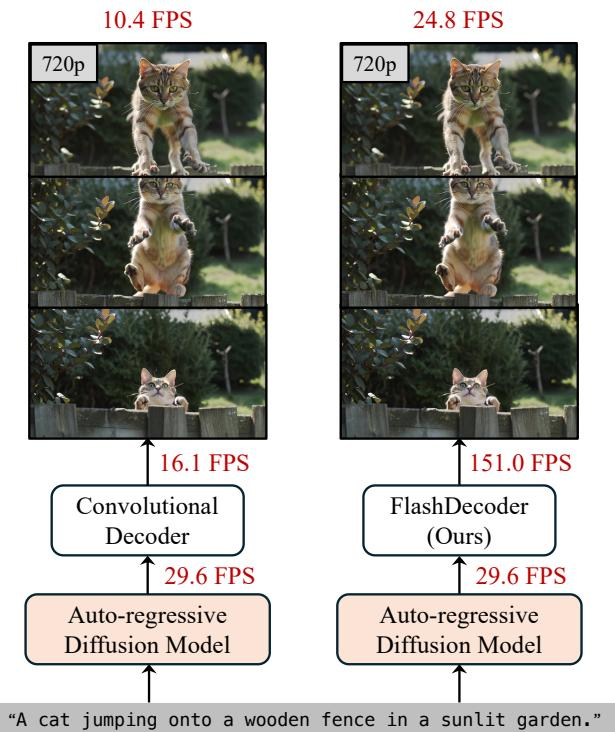
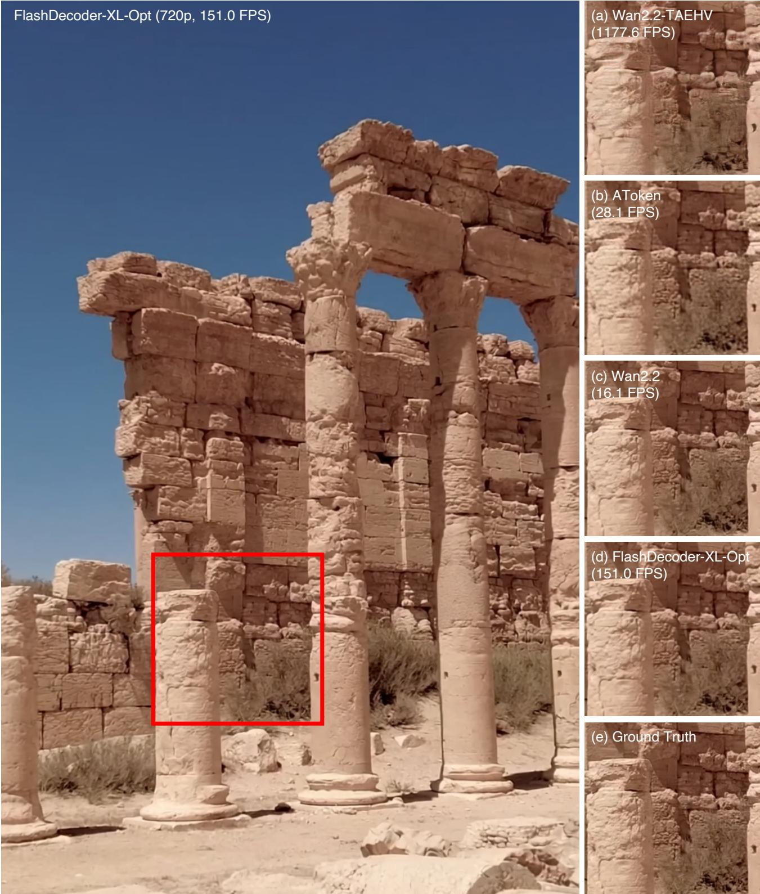
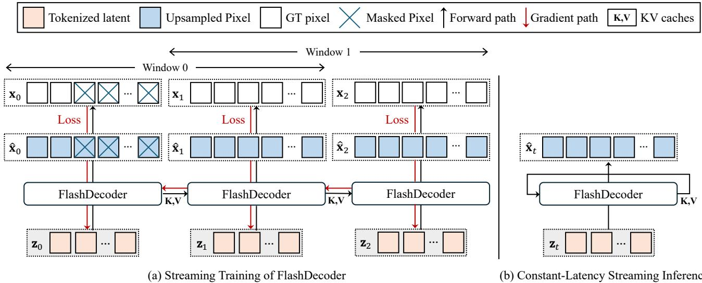
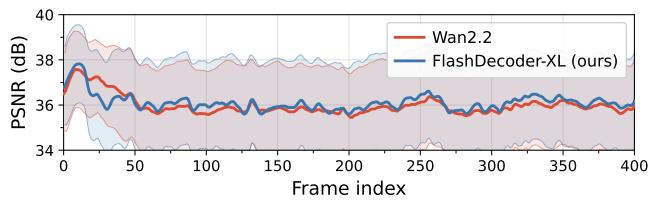
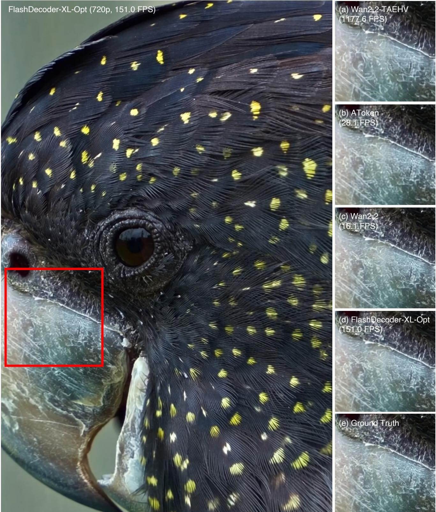
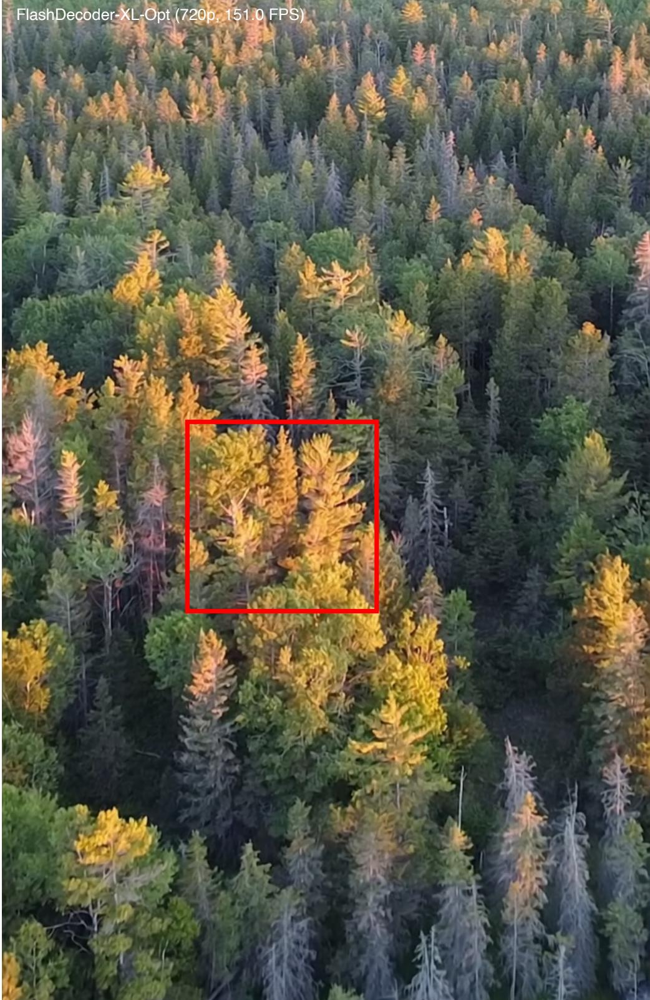
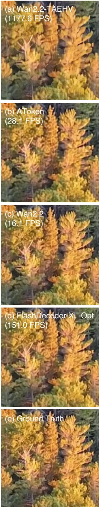
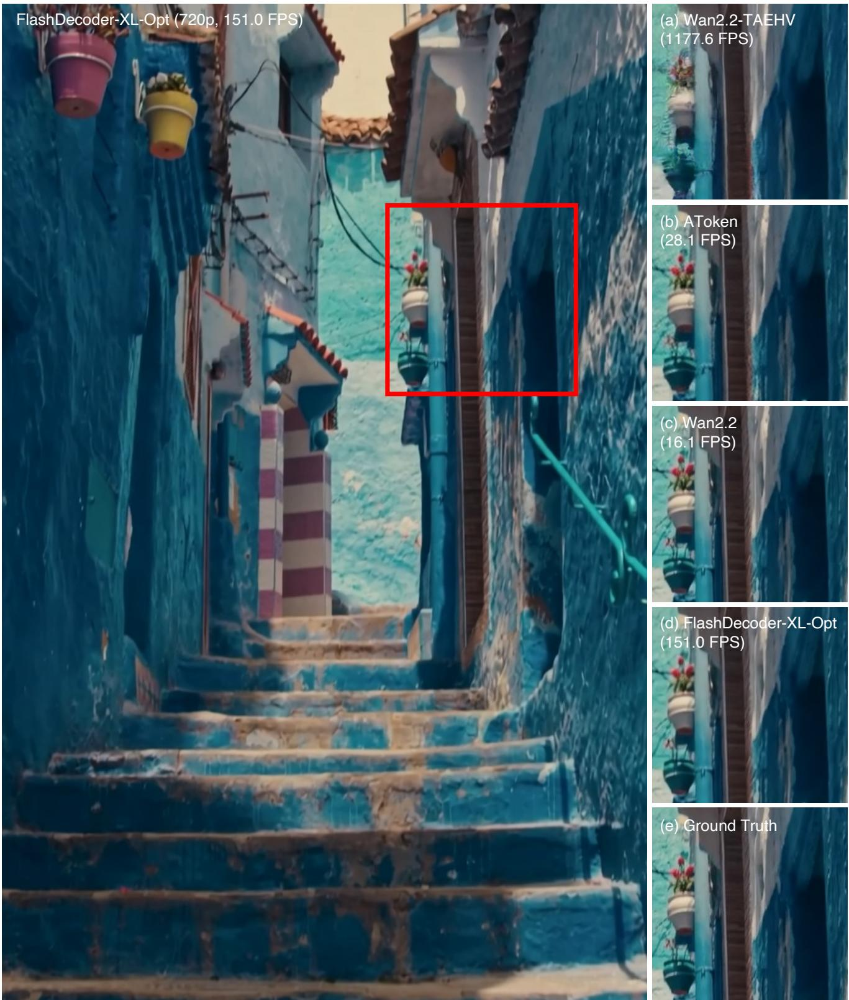

# FlashDecoder: Real-Time Latent-to-Pixel Streaming Decoder with Transformers

Minguk Kang1,2

1Pika Labs

Suha Kwak2

## Abstract

Real-time video generation demands fast decoding as much as fast denoising, yet current latent video diffusion models rely on 3D convolutional decoders that are slow and memory-intensive at high resolutions or for long video. We introduce FlashDecoder, a fast, memory-efficient pure-Transformer video decoder that decodes latents to pixels frame by frame. At each step, the current frame attends only to a fixed-size window of past frames through a rolling KV cache. The fixed temporal window keeps decoding fast and memory bounded regardless of video length, enabling constant-latency streaming. Because frames are processed sequentially, temporal causality is enforced without explicit attention masks, enabling training at resolutions up to 1080p and matching the reconstruction quality of convolutional decoders. On the Wan2.1 and Wan2.2 latent spaces, FlashDecoder matches each convolutional decoder in reconstruction quality (e.g., 41.55 vs. 41.49 dB PSNR at 1080p) while decoding 3.6×–4.7× faster with up to 11× less memory on a single H100 GPU. With architectureaware inference optimizations, the speedup widens to 12×.

## 1. Introduction

2POSTECH

Latent diffusion models [45] have become the dominant framework for image [11, 28, 44] and video generation [8, 13, 41, 52, 65]. An encoder [19, 26] compresses pixels into a low-dimensional latent space where diffusion models [20, 40, 50] generate content, and a decoder then reconstructs the final output pixels. By operating in latent space rather than pixel space, this design reduces computational costs by orders of magnitude, enabling scaling to billions of parameters with Diffusion Transformers (DiT) [11, 43]. However, most progress has focused on accelerating the generation stage, while the decoder that maps latents back to pixels has remained largely convolutional and comparatively underexplored.

Originally, the main inference bottleneck was iterative denoising. Since then, more efficient architectures [13, 67,

  
Figure 1. VAE decoding is a major bottleneck for real-time video generation. Measured with our MotionStream [49] implementation at 720p. The Wan2.2 [65] decoder consumes 64.6% of total inference time, limiting generation to 10.4 FPS. FlashDecoder reduces this share to 16.4%, more than doubling end-to-end throughput to 24.8 FPS.

71, 83], higher-compression VAEs [1, 5, 16, 65, 72], and few-step distillation [6, 23, 25, 32, 38, 46, 47, 51, 73] have largely removed this bottleneck. But real-time streaming also requires causal frame-by-frame generation. Recent causal video generators [21, 33, 34, 49, 57, 74] are closing in on interactive frame rates. With latent generation nearing real-time speed, the bottleneck has shifted to the decoder: VAE decoding consumes over 64.6% of total inference time with the Wan2.2 decoder [65] at 720p (Figure 1).

Existing video decoders are predominantly 3D causal convolutional networks [13, 27, 31, 65, 70, 79]. They reconstruct well but are slow and memory-intensive, making real-time streaming impractical. High-resolution decoding further requires spatial-temporal tiling, which multiplies decoder evaluations and latency. Transformer-based [63] decoders have been explored as alternatives, but face a tradeoff between streaming and quality. Causal variants [64, 66] require explicit causal masks that prevent efficient FlashAttention [7] usage at high resolutions, limiting reconstruction fidelity. Bidirectional variants [37, 58] achieve better quality by attending across all frames, but cannot stream because each frame requires access to future frames.

The limitations of both convolutional and Transformer decoders suggest four desired properties for a real-time video decoder: (1) frame-by-frame decoding without padding or blending, (2) reconstruction quality competitive with convolutional decoders, (3) fast inference with consistent per-frame latency and bounded memory, and (4) high-resolution and long-duration decoding without spatialtemporal tiling. Transformers can in principle provide all four: sequential processing enables frame-by-frame decoding, self-attention captures spatial-temporal dependencies for high-quality reconstruction, and windowed attention bounds memory and computation per frame, ensuring consistent latency without tiling. However, no existing Transformer-based decoder satisfies all four properties.

We introduce FlashDecoder, a pure-Transformer latentto-pixel decoder that satisfies all four properties. FlashDecoder processes one latent frame at a time with a fixedsize rolling KV cache. The fixed temporal window keeps per-frame computation and memory bounded regardless of video length, enabling constant-latency streaming without spatial-temporal tiling. Prior causal Transformer decoders train with explicit causal masks but switch to KV caching at inference. FlashDecoder instead uses the same temporalorder processing for both training and inference, removing the need for attention masks entirely. This makes highresolution training feasible, matching the reconstruction quality of convolutional decoders. Evaluated on the Wan2.1 and Wan2.2 [65] latent spaces, FlashDecoder matches each convolutional decoder in reconstruction quality (e.g., 41.55 vs. 41.49 PSNR at 1080p on Wan2.2) while providing 3.6×–4.7× higher throughput and up to 11× lower memory on a single H100 GPU. With architecture-aware inference optimizations, the throughput gap widens to up to 12×.

## 2. Related Work

## 2.1. Autoencoders for Visual Generation

Latent diffusion models [45] rely on learned autoencoders to compress inputs into a low-dimensional latent space. For images, autoencoders have evolved from Stable Diffusion VAE [45] to more efficient designs such as FLUX VAE [28] and DC-AE [5], improving compression ratios and reconstruction quality, with most designs primarily based on convolutions. For video, these spatial autoencoders have been extended to spatiotemporal variants that compress both spatial and temporal dimensions [1, 13, 27, 31, 41, 52, 55, 58, 65, 70, 79, 82]. Dedicated video VAE works such as MagViT-v2 [76], CV-VAE [80], WF-VAE [30], VidTok [54], and VideoVAE+ [68] have further advanced reconstruction fidelity through improved architectures, loss formulations, and temporal modeling. Despite this progress, spatiotemporal decoding remains computationally expensive, particularly at high resolutions. Lightweight alternatives such as TurboVAED [84] and TAEHV [3] trade fidelity for speed, and all of the above video decoders remain convolutional.

A separate line of work has begun moving away from convolutional decoders entirely. Representation Autoencoders such as RAE [59, 81] and LV-RAE [35] pair frozen pretrained encoders (e.g., DINOv2 [42] and SigLIP 2 [60]) with Transformer decoders, achieving faster convergence and stronger generation quality than convolutional VAEs for image generation. This trend has yet to reach video, where a streaming-capable Transformer decoder would be needed.

## 2.2. Transformer-based Video Decoders

For video, Transformer-based decoders have been explored across discrete tokenization models [64, 75], hybrid discrete-continuous VAEs [37, 66], and fully continuous latent VAEs [17, 58]. These designs face a fundamental tradeoff in how they handle temporal attention. Causal attention, as in OmniTokenizer [66], enables streaming through KV caching but requires explicit causal masks during training, making memory-efficient high-resolution training difficult and limiting reconstruction quality. Per-frame latency also grows as temporal context accumulates. Bidirectional attention, as in AToken [37] and the MAGI-1 VAE decoder [58], improves quality by attending across all frames but cannot support streaming decoding due to global temporal dependencies. FlashDecoder takes the causal approach but removes its key limitations: causality is enforced by processing order rather than masks, and a fixed-size window bounds memory regardless of video length, unifying training and inference under the same streaming mechanism.

## 3. Method

Figure 3 illustrates the overall pipeline. We first describe the latent diffusion framework (Sec. 3.1), then detail the Transformer backbone (Sec. 3.2), the streaming mechanism with rolling KV cache (Sec. 3.3), the temporal-first upsampling strategy (Sec. 3.4), and training objectives (Sec. 3.5).

## 3.1. Preliminaries: Latent Diffusion Model

FlashDecoder operates within the Latent Diffusion Model (LDM) framework [45]. A pretrained encoder E maps a video $\mathbf { x } \in \mathbb { R } ^ { B \times C \times T \times H \times W }$ to a latent tensor $\mathbf { z } = \mathcal { E } ( \mathbf { x } ) \in$ $\mathbb { R } ^ { B \times C ^ { \prime } \times T ^ { \prime } \times H ^ { \prime } \times W ^ { \prime } }$ , where $( C ^ { \prime } , T ^ { \prime } , H ^ { \prime } , W ^ { \prime } )$ are the compressed channel, temporal, and spatial dimensions. The diffusion process operates on z, and a decoder D reconstructs pixels via $\hat { \textbf { x } } = \mathcal { D } ( \mathbf { z } )$ FlashDecoder is agnostic to the choice of encoder; we train decoders on both the Wan2.1 and Wan2.2 [65] latent spaces and use Wan2.2 as the primary example throughout.

  
Figure 2. Qualitative comparison of 720p reconstruction results. We compare reconstructed frames from video decoders with 4× temporal and 16× spatial compression: (a) Wan2.2-TAEHV [3], (b) AToken [37], (c) Wan2.2 [65], (d) our FlashDecoder-XL-Opt, and (e) ground truth. (a) fails to synthesize fine details such as wall textures, while (b) produces blurry reconstructions. (c) and (d) yield visually comparable outputs, yet (d) achieves over 9× higher throughput (151.0 vs. 16.1 FPS). Additional comparisons are provided in the supplementary material.

  
Figure 3. FlashDecoder pipeline. FlashDecoder is a pure-Transformer decoder that converts video latents to pixels in a frame-by-frame manner. Each latent frame $\mathbf { z } _ { t }$ is linearly projected, processed by a Transformer backbone with a fixed-size rolling KV cache that stores the most recent $W _ { \mathrm { f r m } }$ frames (temporal window size), temporally upsampled by factor $r _ { \mathrm { t } }$ via channel expansion and refinement layers, and spatially upsampled via MLP and PixelShuffle. Shown here with $W _ { \mathrm { f r m } } { = } 2$ and $r _ { \mathrm { t } } { = } 4 .$ , streaming 3 latent frames into 9 output frames. (a) Attention pattern: each frame’s ${ \cal L } _ { \mathrm { f r m } } { = } H ^ { \prime } { \times } W ^ { \prime }$ spatial tokens attend bidirectionally to each other and causally to the previous $W _ { \mathrm { f r m } } { - } 1$ frames. $\mathbf { z } _ { 0 }$ is decoded alone; z1 attends to [z0, z1]; z2 attends to $[ \mathbf { z } _ { 1 } , \mathbf { z } _ { 2 } ]$ after evicting $\mathbf { z } _ { 0 } .$ . (b) Streaming inference: each incoming latent frame $\mathbf { z } _ { t }$ is projected and processed through the Transformer with the rolling KV cache, then upsampled to pixel frames. The bounded cache ensures constant per-frame latency and memory regardless of video length.

## 3.2. Transformer Backbone Design

Base Architecture. The decoder is a Transformer [63] with stacked self-attention and feedforward layers. We use Grouped-Query Attention (GQA) [2], which shares keyvalue heads across query groups to reduce KV cache memory during streaming. For stable training, we apply RM-SNorm [77] before each sublayer and normalize keys and values within attention (KV-norm) [56]. Spatiotemporal position is encoded with 3D Rotary Positional Embeddings (3D-RoPE) [53], applied separately to the temporal $( T ^ { \prime } )$ and spatial $( H ^ { \prime } \times W ^ { \prime } )$ dimensions.

Latent Projection. Each latent frame $\mathbf { z } _ { t }$ is flattened into $L _ { \mathrm { f r m } } = H ^ { \prime } W ^ { \prime }$ spatial tokens in raster order, and a linear layer maps the latent channels $C ^ { \prime }$ to model dimension $D \colon$

$$
\mathbf {P} = \mathrm{Linear} _ {C ^ {\prime} \to D} (\mathbf {z}) \in \mathbb {R} ^ {B \times L \times D},\tag{1}
$$

where $L = T ^ { \prime } \cdot L _ { \mathrm { f r m } }$ is the total sequence length.

## 3.3. Streaming with Rolling KV Cache

FlashDecoder processes video latents one frame at a time while maintaining a sliding-window KV cache of fixed size $W _ { \mathrm { f r m } }$ frames. We set $W _ { \mathrm { f r m } } { = } 2$ throughout, so each latent frame attends only to itself and the immediately preceding latent frame; the effect of this choice is ablated in Sec. 4.4. Because future frames have not yet been fed to the model, temporal causality is enforced by construction without explicit attention masks.

Frame-by-Frame Processing. Given $T ^ { \prime }$ latent frames $\left\{ { \bf z } _ { 0 } , \ldots , { \bf z } _ { T ^ { \prime } - 1 } \right\}$ , we process them sequentially. At each timestep t: (1) the latent frame $\mathbf { z } _ { t }$ is projected into $L _ { \mathrm { f r m } }$ tokens via Eq. (1); (2) new key-value pairs $( \mathbf { K } _ { t } ^ { \mathrm { n e w } } , \mathbf { V } _ { t } ^ { \mathrm { n e w } } )$ are computed with 3D-RoPE at temporal offset $t \cdot L _ { \mathrm { f r m } } .$ , appended to the cache, and the oldest frame is evicted if the cache exceeds $W _ { \mathrm { f r m } }$ frames; (3) current queries $\mathbf { Q } _ { t } ^ { \mathrm { n e w } }$ attend to the full cache. The resulting cache shape is:

$$
\mathbf {K} _ {t}, \mathbf {V} _ {t} \in \mathbb {R} ^ {B \times G \times (W _ {\mathrm{frm}} L _ {\mathrm{frm}}) \times D _ {h}},\tag{2}
$$

where $G$ is the number of KV groups in GQA and $D _ { h }$ is the head dimension.

Attention Pattern. The resulting pattern is a sliding window: within each frame, tokens attend to all $L _ { \mathrm { f r m } }$ spatial positions (bidirectional); along the temporal axis, attention is restricted to the most recent $W _ { \mathrm { f r m } }$ frames (causal).

Training–Inference Consistency. A distinctive property of FlashDecoder is that training and inference follow an identical streaming protocol: the model never sees more than $W _ { \mathrm { f r m } }$ frames at once during either phase. Conventional approaches load all $T ^ { \prime }$ frames into a single forward pass, which requires a full-sequence causal mask that FlexAttention [29] must materialize, causing out-ofmemory failures at 480p, 720p, and 1080p on an H100 80 GB GPU. FlashDecoder instead performs $T ^ { \prime }$ sequential forward passes, each attending to at most $W _ { \mathrm { f r m } } \cdot L _ { \mathrm { f r m } }$ tokens with standard FlashAttention [7] at per-step memory cost $O ( W _ { \mathrm { f r m } } \cdot L _ { \mathrm { f r m } } )$

Complexity Analysis. The attention cost per latent frame is $\mathcal { O } ( N W _ { \mathrm { f r m } } L _ { \mathrm { f r m } } ^ { 2 } D _ { h } )$ , linear in the temporal window $W _ { \mathrm { f r m } }$ and head count N, but quadratic in spatial tokens $L _ { \mathrm { f r m } }$ . The KV cache memory per layer is $\mathcal { O } ( B G W _ { \mathrm { f r m } } L _ { \mathrm { f r m } } D _ { h } )$ , benefiting from GQA’s reduced group count $( G \ll N )$ . After temporal upsampling (Sec. 3.4), refinement layers operate on $r _ { \mathrm { t } } { \cdot } L _ { \mathrm { f r m } }$ tokens per frame with cache capacity $r _ { \mathrm { t } } W _ { \mathrm { f r m } } L _ { \mathrm { f r m } } ,$ preserving the same scaling properties.

## 3.4. Temporal-First Upsampling Strategy

Progressive spatio-temporal upsampling is computationally prohibitive for Transformers. Spatial upsampling by factor $r _ { \mathrm { s } }$ increases tokens per frame by $r _ { \mathrm { s } } ^ { 2 } .$ , resulting in $O ( r _ { \mathrm { { s } } } ^ { 4 } )$ attention cost (65,536× for $r _ { \mathrm { s } } \mathrm { = } 1 6 )$ . Temporal upsampling by factor $r _ { \mathrm { t } }$ incurs only $O ( r _ { \mathrm { t } } ^ { 2 } )$ cost (16× for $r _ { \mathrm { t } } { = } 4 )$ , a 4,096× difference. We therefore adopt a temporal-first strategy: temporal upsampling via Transformer layers, followed by spatial upsampling via MLP and PixelShuffle [48].

Step 1: Temporal Upsampling. Starting from the backbone output $\bar { \mathbf { Y } } \in \mathbb { R } ^ { B \times L \times D }$ (where $L = T ^ { \prime } H ^ { \prime } W ^ { \prime } )$ , a linear layer expands channels by temporal factor rt:

$$
\mathbf {P} ^ {\text { temp }} = \operatorname{Linear} _ {D \to D \cdot r _ {\mathrm{t}}} (\mathbf {Y}) \in \mathbb {R} ^ {B \times L \times (D \cdot r _ {\mathrm{t}})}.\tag{3}
$$

Reinterpreting expanded channels as new temporal indices yields $\mathbf { P } ^ { \mathrm { f u l l } } \in \mathbb { R } ^ { B \times ( T ^ { \prime } r _ { \mathrm { t } } H ^ { \prime } W ^ { \prime } ) \times D }$

Step 2: Temporal Refinement. Two Transformer blocks process $\mathbf { P } ^ { \mathrm { f u l l } }$ using the same streaming mechanism from Sec. 3.3, with expanded window size $W _ { \mathrm { f r m } } ^ { \mathrm { f u l l } } = r _ { \mathrm { t } } \cdot W _ { \mathrm { f r m } }$ to preserve effective temporal context.

Step 3: Spatial Upsampling. A 2-layer MLP projects features from $\textit { D }  { t o } \textit { C } \cdot \textit { r } _ { \mathrm { s } } ^ { 2 }$ channels, followed by PixelShuffle [48] to produce the final output $\hat { \textbf { x } } \in$ $\mathbb { R } ^ { B \times C \times ( T ^ { \prime } r _ { \mathrm { t } } ) \times \left( H ^ { \prime } r _ { \mathrm { s } } \right) \times \left( \dot { W ^ { \prime } } r _ { \mathrm { s } } \right) }$

Algorithm 1 Streaming Video Decoding from Latent
Require: Latent  $z \in R^{B \times C' \times T' \times H' \times W'}$  for any  $T'$ 
Require: Window size  $W_{frm}$ 
Require: Tokens per frame  $L_{frm} = H'W'$ 
Require: Upsampling factors  $r_t$  (temporal),  $r_s$  (spatial)
Require: Backbone Transformer B
Require: Temporal Refinement Transformer R
1: Initialize  $(\mathbf{K}^{\mathcal{B}}, \mathbf{V}^{\mathcal{B}}) \leftarrow \varnothing, (\mathbf{K}^{\mathcal{R}}, \mathbf{V}^{\mathcal{R}}) \leftarrow \varnothing$ 
2: Initialize output  $\hat{x} \leftarrow []$ 
3: for  $t = 0, \ldots, T' - 1$  do
4:  $P_t \leftarrow Project(z[:, :, t : t + 1, :, :])$ 
5: ▷ Backbone processing with RoPE offset  $t \cdot L_{frm}$ 
6:  $Y_t, (K_t^{\mathcal{B}}, V_t^{\mathcal{B}}) \leftarrow \mathcal{B}(P_t, K_t^{\mathcal{B}}, V_t^{\mathcal{B}}, t)$ 
7:  $K^{\mathcal{B}} \leftarrow concat(tail_{(W_{frm}-1)L_{frm}}(K^{\mathcal{B}}), K_t^{\mathcal{B}})$ 
8:  $V^{\mathcal{B}} \leftarrow concat(tail_{(W_{frm}-1)L_{frm}}(V^{\mathcal{B}}), V_t^{\mathcal{B}})$ 
9: ▷ Temporal upsampling: channel → temporal axis
10:  $P_t^{temp} \leftarrow Linear_{D \to r_t D}(Y_t)$ 
11:  $P_t^{full} \leftarrow Reshape(P_t^{temp}) \quad ▷ Yields r_t \cdot L_{frm} tokens$ 
12: ▷ Temporal refinement with window  $r_t W_{frm}$ 
13: ▷ RoPE offset  $t \cdot r_t \cdot L_{frm}$ 
14:  $Y_t^{full}, (K_t^{\mathcal{R}}, V_t^{\mathcal{R}}) \leftarrow \mathcal{R}(P_t^{full}, K_t^{\mathcal{R}}, V_t^{\mathcal{R}}, t)$ 
15:  $K^{\mathcal{R}} \leftarrow concat(tail_{r_t(W_{frm}-1)L_{frm}}(K^{\mathcal{R}}), K_t^{\mathcal{R}})$ 
16:  $V^{\mathcal{R}} \leftarrow concat(tail_{r_t(W_{frm}-1)L_{frm}}(V^{\mathcal{R}}), V_t^{\mathcal{R}})$ 
17: ▷ Spatial upsampling: MLP + PixelShuffle
18:  $F_t \leftarrow MLP_{D \to Cr_s^2}(Y_t^{full})$ 
19:  $\hat{x}_t \leftarrow PixelShuffle(F_t, r_s)$ 
20: Append  $\hat{x}_t$  to  $\hat{x}$ 
21: return  $\hat{x}$

## 3.5. Training Objectives

The decoder D is trained with a combination of pixel-wise, perceptual, and adversarial losses:

$$
\mathcal {L} _ {\text { total }} = \lambda_ {\mathrm{L1}} \mathcal {L} _ {\mathrm{L1}} + \lambda_ {\mathrm{LPIPS}} \mathcal {L} _ {\mathrm{LPIPS}} + \lambda_ {\mathrm{adv}} \mathcal {L} _ {\mathrm{adv}},\tag{4}
$$

where ${ \mathcal { L } } _ { \mathrm { L 1 } }$ is the pixel-wise L1 loss between the reconstructed video xˆ and ground truth x, ${ \mathcal { L } } _ { \mathrm { L P I P S } }$ [78] measures perceptual similarity in a pretrained feature space, and $\mathcal { L } _ { \mathrm { a d v } }$ [15] is computed using a 3D patch-based discriminator [9, 22]. L1 ensures pixel-level fidelity, LPIPS encourages perceptually realistic outputs, and the adversarial term produces sharp high-frequency details. Hyperparameter values are provided in the supplementary material. Algorithm 1 summarizes the full streaming pipeline.

## 4. Experiments

Unless stated otherwise, all experiments use FlashDecoder trained on the Wan2.2 latent space (4×16×16). All training is conducted on a single node with 8 NVIDIA H100 GPUs.

Table 1. Component ablation. We incrementally add architectural and training components to a blockwise causal vanilla Transformer decoder. SW-CA: Sliding-Window Causal Attention; GQA: Grouped-Query Attention [2]; TR: Temporal Refinement; SU: Spatial Upsampling; Scale-up: model scale-up from 56.8M to 769.3M parameters; Streaming: streaming training with a rolling KV cache; Adv: adversarial training. All evaluations are performed on 480p videos with 17 frames for efficient ablation.

<table><tr><td>Components</td><td>PSNR↑</td><td>LPIPS↓</td><td>rFVD↓</td><td>FPS↑</td></tr><tr><td>Baseline</td><td>30.30</td><td>0.16</td><td>117.77</td><td>331.4→16.6</td></tr><tr><td>(a) + SW-CA</td><td>30.20</td><td>0.15</td><td>136.08</td><td>333.8</td></tr><tr><td>(b) + GQA</td><td>30.13</td><td>0.14</td><td>121.87</td><td>340.7</td></tr><tr><td>(c) + TR</td><td>31.05</td><td>0.13</td><td>86.94</td><td>260.3</td></tr><tr><td>(d) + SU</td><td>31.49</td><td>0.12</td><td>96.19</td><td>262.1</td></tr><tr><td>(e) + Scale-up</td><td>32.56</td><td>0.09</td><td>44.74</td><td>166.0</td></tr><tr><td>(f) + Streaming</td><td>37.52</td><td>0.05</td><td>12.29</td><td>166.0</td></tr><tr><td>(g) + Adv</td><td>37.08</td><td>0.05</td><td>10.77</td><td>166.0</td></tr></table>

## 4.1. Datasets and Evaluation Protocol

Training Data. FlashDecoder is trained on joint image– video data in three stages. We use DataComp-small [12] (12.8M image–text pairs) and video data from Kinetics-600 [4] and an internal collection, with a 2:8 image-to-video sampling ratio. Stage 1 trains at 224×224 for fast convergence. Stage 2 transitions to 480p, 720p, and 1080p. Stage 3 adds adversarial training. Full details are provided in the supplementary material.

Evaluation Data. We evaluate on the UltraVideo [69] dataset (clips short 1.zip split), which provides 1,145 high-quality videos at 4K+ resolution covering diverse content from static scenes to fast motion. Each video is first resized to 720×1280 using PIL bicubic interpolation [24, 61], then center-cropped to the target resolution (480p, 720p, or 1080p), and 25-frame clips are extracted. Unless stated otherwise, all evaluations use 25-frame clips. We re-evaluate all baselines using their official implementations and checkpoints on a single H100 GPU.

Evaluation Metrics. We report PSNR for pixel-level fidelity, LPIPS [78] for perceptual quality, and Content-Debiased FVD (rCD-FVD) [14] for temporal realism. Standard FVD [62] is known to be biased toward per-frame spatial quality rather than temporal consistency; rCD-FVD removes this content bias, providing a more faithful measure of temporal coherence. We refer to rCD-FVD as rFVD for simplicity. Throughput (FPS) is measured as decoded frames per second, and Mem denotes peak GPU memory in GB during decoding. FlashDecoder uses streaming mode while other methods use their native inference modes.

## 4.2. Effectiveness of Each Component

Table 1 ablates each component using FlashDecoder-S (Table 5). We evaluate on 480p with 17-frame clips for fast iteration. The baseline is a vanilla Transformer with full block causal attention (no windowing). Components are added incrementally: rows (a)–(d) train for 100K iterations at 224×224; rows (e)–(g) add scale-up, streaming training at 480p/720p, and adversarial training, respectively.

Baseline and Streaming Efficiency. The baseline’s KV cache grows linearly with video length, collapsing throughput from 331.4 to 16.6 FPS. We additionally compare Sliding-Window Causal Attention (SW-CA), a separate reference that restricts attention to a fixed window during training. SW-CA restores stable throughput (333.8 FPS) but still requires mask materialization, causing out-of-memory failures at 480p and 720p. Both SW-CA and GQA increase rFVD over the baseline, indicating that limiting temporal context without dedicated temporal modeling hurts temporal coherence.

Architectural Components. Among the added components, Temporal Refinement (TR) yields the largest single gain (rFVD: 121.87→86.94), confirming that raw channel expansion alone produces temporally inconsistent frames that benefit from dedicated refinement. Spatial Upsampling (SU) improves pixel fidelity (PSNR, LPIPS) but slightly increases rFVD, suggesting a trade-off between spatial detail and temporal smoothness. Model scaling provides consistent improvements across all metrics.

Streaming Training and Adversarial Loss. The most significant jump occurs when streaming training is introduced (row e→f). Streaming training enables highresolution fine-tuning at 480p and 720p, directly improving reconstruction quality by closing the domain gap between 224×224 pretraining and the evaluation resolution. Adversarial training (row f→g) trades a small PSNR decrease (37.52→37.08) for sharper outputs (rFVD: 12.29→10.77), a well-known characteristic of GAN-based losses [15].

## 4.3. Video Reconstruction Results

Table 2 compares FlashDecoder against state-of-the-art video decoders on UltraVideo at 480p, 720p, and 1080p, grouped by compression ratio (T×H×W). We train separate FlashDecoder-XL models for each compression group: one on the Wan2.1 encoder latent space (4×8×8) and one on the Wan2.2 encoder latent space (4×16×16).

Convolution-based Models. In the 4×16×16 group, FlashDecoder-XL closely matches Wan2.2 [65] in PSNR and LPIPS across all three resolutions while streaming

Table 2. Video reconstruction benchmark. Results on UltraVideo [69] at 480p, 720p, and 1080p. We report PSNR, LPIPS [78], rFVD [14, 62], throughput (FPS), and peak GPU memory (Mem, GB). All measurements use 25-frame clips on a single H100 GPU. FlashDecoder uses streaming mode; other methods use their native inference modes. †Causal/streaming. ∗256px only.

<table><tr><td rowspan="2">Method</td><td rowspan="2">Params (M)</td><td colspan="5">480p</td><td colspan="5">720p</td><td colspan="5">1080p</td></tr><tr><td>PSNR</td><td>LPIPS</td><td>rFVD</td><td>FPS</td><td>Mem</td><td>PSNR</td><td>LPIPS</td><td>rFVD</td><td>FPS</td><td>Mem</td><td>PSNR</td><td>LPIPS</td><td>rFVD</td><td>FPS</td><td>Mem</td></tr><tr><td colspan="17"> $4 \times 8 \times 8$  Compression</td></tr><tr><td>OmniTokenizer*† [66]</td><td>26.9</td><td>17.25</td><td>0.20</td><td>60.40</td><td>2333.6</td><td>0.3</td><td>-</td><td>-</td><td>-</td><td>-</td><td>-</td><td>-</td><td>-</td><td>-</td><td>-</td><td>-</td></tr><tr><td>HunyuanVideo† [27]</td><td>146.1</td><td>37.84</td><td>0.05</td><td>7.67</td><td>11.1</td><td>7.2</td><td>38.65</td><td>0.05</td><td>10.25</td><td>4.8</td><td>7.3</td><td>41.93</td><td>0.05</td><td>7.74</td><td>2.1</td><td>7.6</td></tr><tr><td>Wan2.1† [65]</td><td>73.3</td><td>36.63</td><td>0.04</td><td>9.91</td><td>36.0</td><td>7.3</td><td>37.43</td><td>0.04</td><td>12.43</td><td>15.9</td><td>16.4</td><td>40.36</td><td>0.05</td><td>9.94</td><td>6.9</td><td>36.8</td></tr><tr><td>Wan2.1-TAEHV† [3]</td><td>9.8</td><td>32.65</td><td>0.11</td><td>33.37</td><td>663.3</td><td>5.7</td><td>33.43</td><td>0.11</td><td>35.52</td><td>309.8</td><td>13.1</td><td>36.80</td><td>0.11</td><td>33.37</td><td>135.1</td><td>23.7</td></tr><tr><td>MAGI-1 [58]</td><td>306.5</td><td>35.08</td><td>0.14</td><td>42.24</td><td>43.8</td><td>2.3</td><td>34.82</td><td>0.15</td><td>46.23</td><td>9.3</td><td>3.8</td><td>37.02</td><td>0.17</td><td>60.52</td><td>2.0</td><td>7.1</td></tr><tr><td>FlashDecoder-XL†</td><td>750.4</td><td>35.92</td><td>0.05</td><td>11.62</td><td>162.3</td><td>1.8</td><td>37.46</td><td>0.05</td><td>12.13</td><td>76.1</td><td>2.4</td><td>40.74</td><td>0.05</td><td>13.34</td><td>25.9</td><td>3.6</td></tr><tr><td>FlashDecoder-XL-Opt†</td><td>750.4</td><td>35.72</td><td>0.05</td><td>12.42</td><td>449.0</td><td>1.2</td><td>37.17</td><td>0.05</td><td>14.02</td><td>152.0</td><td>1.5</td><td>40.44</td><td>0.05</td><td>14.12</td><td>43.0</td><td>2.3</td></tr><tr><td colspan="17"> $4 \times 16 \times 16$  Compression</td></tr><tr><td>Wan2.2† [65]</td><td>555.0</td><td>37.47</td><td>0.04</td><td>7.97</td><td>36.6</td><td>9.6</td><td>38.29</td><td>0.04</td><td>10.39</td><td>16.1</td><td>19.3</td><td>41.49</td><td>0.04</td><td>8.16</td><td>7.1</td><td>41.0</td></tr><tr><td>Wan2.2-TAEHV† [3]</td><td>9.9</td><td>30.16</td><td>0.21</td><td>88.54</td><td>2329.5</td><td>1.4</td><td>30.68</td><td>0.21</td><td>88.32</td><td>1177.6</td><td>3.3</td><td>33.55</td><td>0.21</td><td>88.49</td><td>524.9</td><td>7.4</td></tr><tr><td>AToken [37]</td><td>415.1</td><td>35.71</td><td>0.08</td><td>19.44</td><td>65.3</td><td>0.7</td><td>36.72</td><td>0.09</td><td>22.91</td><td>28.1</td><td>1.5</td><td>40.18</td><td>0.09</td><td>25.67</td><td>10.1</td><td>3.3</td></tr><tr><td>FlashDecoder-XL†</td><td>769.3</td><td>37.08</td><td>0.05</td><td>10.77</td><td>166.0</td><td>1.9</td><td>38.38</td><td>0.05</td><td>12.75</td><td>76.3</td><td>2.4</td><td>41.55</td><td>0.05</td><td>12.08</td><td>25.4</td><td>3.7</td></tr><tr><td>FlashDecoder-XL-Opt†</td><td>769.3</td><td>37.02</td><td>0.05</td><td>11.22</td><td>441.0</td><td>1.1</td><td>37.85</td><td>0.05</td><td>12.22</td><td>151.0</td><td>1.3</td><td>40.84</td><td>0.05</td><td>13.02</td><td>43.0</td><td>1.6</td></tr></table>

$3 . 6 { \times } { - } 4 . 7 { \times }$ faster with up to 11× lower peak memory. The memory gap is most pronounced at 1080p: 3.7 GB versus 41.0 GB. In the $4 \times 8 \times 8$ group, FlashDecoder-XL achieves reconstruction quality comparable to Wan2.1, though it falls behind HunyuanVideo [27]. While rFVD is moderately higher than convolutional baselines in both groups, we note that these are production-level decoders likely trained with significantly more compute and data than our single-node setup. Visualizations are shown in Figure 2 and the supplementary material.

Transformer-based Decoders. Existing Transformer decoders face a quality–streaming trade-off: OmniTokenizer [66] supports streaming but at low quality, while MAGI-1 [58] and AToken [37] achieve better quality through bidirectional attention but cannot stream and degrade in throughput with video length. FlashDecoder-XL resolves this by achieving higher reconstruction quality than both MAGI-1 and AToken while streaming at 2.5×–13× higher throughput, without padding or blending.

Generalization Across Latent Spaces. FlashDecoder is not tied to a specific encoder. Table 3 shows results when training on the Wan2.1 latent space, which uses 8× spatial compression instead of 16×. Because 8× compression produces 2× more spatial tokens per dimension (4× total), we apply PixelUnshuffle with factor 2 to the latent, folding the extra spatial dimensions into channels. This yields the same spatial token count $L _ { \mathrm { f r m } }$ as the 16× setting, so the Transformer backbone operates with minimal architecture changes. FlashDecoder-XL achieves comparable quality to Wan2.1 (37.46 vs. 37.43 PSNR at 720p) with 4.8× higher throughput and 6.8× lower memory.

Table 3. Generalization across VAE latent spaces. FlashDecoder-XL trained on different encoder latent spaces, evaluated at 720p with 25 frames. Mem denotes peak GPU memory in GB. FlashDecoder generalizes across latent spaces with comparable quality while achieving ∼5× higher throughput and up to 8× lower peak memory.

<table><tr><td>Encoder</td><td>Decoder</td><td>PSNR↑</td><td>LPIPS↓</td><td>rFVD↓</td><td>FPS↑</td><td>Mem↓</td></tr><tr><td>Wan2.1</td><td>Wan2.1</td><td>37.43</td><td>0.04</td><td>12.43</td><td>15.9</td><td>16.4</td></tr><tr><td>Wan2.1</td><td>FlashDecoder-XL</td><td>37.46</td><td>0.05</td><td>12.13</td><td>76.1</td><td>2.4</td></tr><tr><td>Wan2.2</td><td>Wan2.2</td><td>38.29</td><td>0.04</td><td>10.39</td><td>16.1</td><td>19.3</td></tr><tr><td>Wan2.2</td><td>FlashDecoder-XL</td><td>38.38</td><td>0.05</td><td>12.75</td><td>76.3</td><td>2.4</td></tr></table>

Table 4. Effect of window size $W _ { \mathbf { f r m } } .$ Evaluated at 720p with 25 frames using FlashDecoder-XL. Mem denotes peak GPU memory in GB. Performance is stable across window sizes; $W _ { \mathrm { f r m } } { = } 2$ provides a good trade-off between quality and memory.

<table><tr><td> $W_{\text{frm}}$ </td><td>PSNR↑</td><td>LPIPS↓</td><td>rFVD↓</td><td>FPS↑</td><td>Mem↓</td></tr><tr><td>2</td><td>38.38</td><td>0.05</td><td>12.75</td><td>76.3</td><td>2.4</td></tr><tr><td>3</td><td>38.13</td><td>0.05</td><td>12.71</td><td>67.8</td><td>2.5</td></tr><tr><td>4</td><td>38.49</td><td>0.05</td><td>12.87</td><td>60.6</td><td>2.6</td></tr></table>

Long Video Decoding. Because the KV cache window is fixed, FlashDecoder maintains constant memory regardless of video length. We assign RoPE positions relative to the current window rather than the absolute frame index, so positional encodings always stay within the range seen during training, enabling theoretically infinite-length decoding. Figure 4 shows per-frame PSNR on 720p videos exceeding 400 frames. FlashDecoder-XL maintains stable reconstruction quality throughout. Wan2.2 also supports streaming but consumes significantly more memory per frame.

Table 5. Model scaling. FlashDecoder variants trained for 150K iterations at 224×224 (Stage 1 only) and evaluated on UltraVideo at 480p with 17 frames for fast iteration. Numbers are not directly comparable to Table 2, which uses the full three-stage training. Mem denotes peak GPU memory in GB.

<table><tr><td>Model</td><td>Depth</td><td>Width (D)</td><td>Heads (N)</td><td>KV Groups (G)</td><td>Params (M)</td><td>PSNR↑</td><td>rFVD↓</td><td>FPS↑</td><td>Mem↓</td></tr><tr><td>FlashDecoder-S</td><td>12</td><td>512</td><td>8</td><td>2</td><td>56.8</td><td>30.90</td><td>89.23</td><td>254.5</td><td>0.3</td></tr><tr><td>FlashDecoder-B</td><td>16</td><td>768</td><td>12</td><td>3</td><td>161.7</td><td>31.15</td><td>72.36</td><td>205.2</td><td>0.6</td></tr><tr><td>FlashDecoder-L</td><td>20</td><td>1024</td><td>16</td><td>4</td><td>348.0</td><td>32.13</td><td>63.81</td><td>164.3</td><td>1.0</td></tr><tr><td>FlashDecoder-XL</td><td>20</td><td>1536</td><td>24</td><td>3</td><td>769.3</td><td>33.81</td><td>31.00</td><td>166.0</td><td>1.9</td></tr></table>

  
Figure 4. Per-frame PSNR on long videos at 720p. Averaged over 40 videos (>400 frames each) from UltraVideo. FlashDecoder maintains stable quality with constant memory regardless of video length.

## 4.4. Window Size Ablation

Table 4 ablates the window size $W _ { \mathrm { f r m } } .$ . Performance is stable across $W _ { \mathrm { f r m } } \in \{ 2 , 3 , 4 \}$ , with $W _ { \mathrm { f r m } } { = } 2$ providing the best trade-off: similar quality to $W _ { \mathrm { f r m } } { = } 4$ with lower memory (2.4 vs. 2.6 GB) and higher throughput (76.3 vs. 60.6 FPS). This suggests that for latent decoding, attending to just one previous latent frame provides sufficient temporal context.

## 4.5. Scaling Analysis

Table 5 shows four FlashDecoder variants trained at 224×224 for 150K iterations and evaluated at 480p. All variants share the same architecture (GQA Transformer blocks with temporal refinement and PixelShuffle spatial upsampling) and differ in width (D), depth, number of heads (N), and KV groups (G). FlashDecoder-XL, the largest variant, uses D=1536 with 20 backbone blocks, 2 temporal refinement blocks, 24 attention heads, and 3 KV groups (full configuration in supplementary material). Reconstruction quality improves steadily with model size: PSNR rises from 30.90 to 33.81 and rFVD drops from 89.23 to 31.00. Throughput decreases with scale (254.5 → 166.0 FPS), yet even FlashDecoder-XL comfortably maintains real-time streaming performance at all resolutions.

## 4.6. Inference Optimization

FlashDecoder’s streaming architecture is particularly amenable to inference optimization because each framelevel forward pass has a fixed, data-independent compute graph. We apply four progressive optimizations, each building on the previous: (1) torch.compile fuses elementwise operations (RMSNorm, SiLU, residual additions) into single GPU kernels, reducing memory bandwidth pressure; (2) CUDA graph capture eliminates per-step Python dispatch and kernel launch overhead by replaying the entire forward pass as a single graph; (3) precomputed RoPE tables and a FlashAttention-3 custom operator remove dynamic allocations and graph breaks that would otherwise prevent end-to-end graph capture; (4) static-calibrated FP8 quantization of all MLP layers exploits H100 FP8 Tensor Cores for higher matmul throughput. The first three optimizations are lossless. FP8 quantization incurs a quality trade-off: PSNR drops by 0.06–0.71 dB and rFVD increases by up to 0.94 depending on resolution (Table 2). These optimizations are complementary and stack multiplicatively. The resulting FlashDecoder-XL-Opt (Table 2) achieves up to 12× higher throughput than Wan2.2 at 480p while using under 2 GB peak memory on the $4 \times 1 6 \times 1 6$ latent space.

## 5. Conclusion

We introduced FlashDecoder, a pure-Transformer latentto-pixel decoder that achieves real-time streaming by processing one frame at a time with a fixed-size rolling KV cache. Two findings stand out from our experiments. First, enforcing causality through temporal processing order rather than explicit masks removes the memory barrier to high-resolution training, enabling stable training up to 1080p. Second, this high-resolution training closes the reconstruction quality gap with convolutional decoders, a gap that has limited prior Transformer decoders. On both the Wan2.1 and Wan2.2 latent spaces, FlashDecoder-XL matches convolutional decoder reconstruction quality while delivering $3 . 6 { \times } { - } 4 . 7 { \times }$ faster streaming throughput and up to 11× lower GPU memory. With architecture-aware inference optimizations, the throughput gap widens to 12×, enabling real-time high-resolution decoding on a single GPU. A natural next step is to pair FlashDecoder with a streaming Transformer encoder and train the full VAE from scratch, potentially unlocking latent spaces better suited to Transformer-based generation and decoding.

## Acknowledgments

Minguk Kang is a participating researcher at POSTECH and a full-time employee at Pika Labs. We thank Joonghyuk Shin for helpful discussions and assistance with Motion-Stream experiments, and Zhicheng Sun and Cade Li for valuable discussions. This work was supported by Samsung Electronics Co., Ltd. (Samsung AI Center) and the IITP grants (RS-2022-II220290, RS-2022-II220926, RS-2019- II191906) funded by the Korea government (MSIT).

## References

[1] Niket Agarwal, Arslan Ali, Maciej Bala, Yogesh Balaji, Erik Barker, Tiffany Cai, Prithvijit Chattopadhyay, Yongxin Chen, Yin Cui, Yifan Ding, et al. Cosmos world foundation model platform for physical ai. arXiv preprint arXiv:2501.03575, 2025. 1, 2

[2] Joshua Ainslie, James Lee-Thorp, Michiel De Jong, Yury Zemlyanskiy, Federico Lebron, and Sumit Sanghai. Gqa:´ Training generalized multi-query transformer models from multi-head checkpoints. arXiv preprint arXiv:2305.13245, 2023. 4, 6

[3] Ollin Boer Bohan. Taehv: Tiny autoencoder for hunyuan video. https://github.com/madebyollin/ taehv, 2025. 2, 3, 7, 13, 16, 17, 18

[4] Joao Carreira, Eric Noland, Andras Banki-Horvath, Chloe Hillier, and Andrew Zisserman. A short note about kinetics-600. arXiv preprint arXiv:1808.01340, 2018. 6, 13

[5] Junyu Chen, Han Cai, Junsong Chen, Enze Xie, Shang Yang, Haotian Tang, Muyang Li, and Song Han. Deep compression autoencoder for efficient high-resolution diffusion models. In International Conference on Learning Representations (ICLR), 2025. 1, 2

[6] Junsong Chen, Shuchen Xue, Yuyang Zhao, Jincheng Yu, Sayak Paul, Junyu Chen, Han Cai, Song Han, and Enze Xie. Sana-sprint: One-step diffusion with continuous-time consistency distillation. arXiv preprint arXiv:2503.09641, 2025. 1

[7] Tri Dao, Daniel Y. Fu, Stefano Ermon, Atri Rudra, and Christopher Re. FlashAttention: Fast and memory-efficient´ exact attention with IO-awareness. In Conference on Neural Information Processing Systems (NeurIPS), 2022. 2, 5

[8] DeepMind. Veo: a text-to-video generation system. https: //storage.googleapis.com/deepmind-media/ veo/Veo-3-Tech-Report.pdf, 2024. 1

[9] Patrick Esser, Robin Rombach, and Bjorn Ommer. Taming transformers for high-resolution image synthesis. In IEEE Conference on Computer Vision and Pattern Recognition (CVPR), 2021. 5, 14

[10] Patrick Esser, Robin Rombach, and Bjorn Ommer. Taming transformers for high-resolution image synthesis. https://github.com/CompVis/tamingtransformers, 2021. 13

[11] Patrick Esser, Sumith Kulal, Andreas Blattmann, Rahim Entezari, Jonas Muller, Harry Saini, Yam Levi, Dominik¨ Lorenz, Axel Sauer, Frederic Boesel, et al. Scaling rectified flow transformers for high-resolution image synthesis.

In International Conference on Machine Learning (ICML), 2024. 1

[12] Samir Yitzhak Gadre, Gabriel Ilharco, Alex Fang, Jonathan Hayase, Georgios Smyrnis, Thao Nguyen, Ryan Marten, Mitchell Wortsman, Dhruba Ghosh, Jieyu Zhang, et al. Datacomp: In search of the next generation of multimodal datasets. In Conference on Neural Information Processing Systems (NeurIPS), 2023. 6, 13

[13] Yu Gao, Haoyuan Guo, Tuyen Hoang, Weilin Huang, Lu Jiang, Fangyuan Kong, Huixia Li, Jiashi Li, Liang Li, Xiaojie Li, et al. Seedance 1.0: Exploring the boundaries of video generation models. arXiv preprint arXiv:2506.09113, 2025. 1, 2

[14] Songwei Ge, Aniruddha Mahapatra, Gaurav Parmar, Jun-Yan Zhu, and Jia-Bin Huang. On the content bias in frechet´ video distance. In IEEE Conference on Computer Vision and Pattern Recognition (CVPR), 2024. 6, 7, 15

[15] Ian Goodfellow, Jean Pouget-Abadie, Mehdi Mirza, Bing Xu, David Warde-Farley, Sherjil Ozair, Aaron Courville, and Yoshua Bengio. Generative Adversarial Nets. In Conference on Neural Information Processing Systems (NeurIPS), 2014. 5, 6, 13

[16] Yoav HaCohen, Nisan Chiprut, Benny Brazowski, Daniel Shalem, Dudu Moshe, Eitan Richardson, Eran Levin, Guy Shiran, Nir Zabari, Ori Gordon, et al. Ltx-video: Realtime video latent diffusion. arXiv preprint arXiv:2501.00103, 2024. 1

[17] Philippe Hansen-Estruch, David Yan, Ching-Yao Chuang, Orr Zohar, Jialiang Wang, Tingbo Hou, Tao Xu, Sriram Vishwanath, Peter Vajda, and Xinlei Chen. Learnings from scaling visual tokenizers for reconstruction and generation. In International Conference on Machine Learning (ICML), 2025. 2

[18] Jonathan Heek, Emiel Hoogeboom, Thomas Mensink, and Tim Salimans. Unified latents (ul): How to train your latents. arXiv preprint arXiv:2602.17270, 2026. 15

[19] Geoffrey E Hinton and Ruslan R Salakhutdinov. Reducing the dimensionality of data with neural networks. science, 2006. 1

[20] Jonathan Ho, Ajay Jain, and Pieter Abbeel. Denoising diffusion probabilistic models. In Conference on Neural Information Processing Systems (NeurIPS), 2020. 1

[21] Xun Huang, Zhengqi Li, Guande He, Mingyuan Zhou, and Eli Shechtman. Self forcing: Bridging the traintest gap in autoregressive video diffusion. arXiv preprint arXiv:2506.08009, 2025. 1

[22] Phillip Isola, Jun-Yan Zhu, Tinghui Zhou, and Alexei A Efros. Image-to-image translation with conditional adversarial networks. In IEEE Conference on Computer Vision and Pattern Recognition (CVPR), 2017. 5, 13, 14

[23] Minguk Kang, Richard Zhang, Connelly Barnes, Sylvain Paris, Suha Kwak, Jaesik Park, Eli Shechtman, Jun-Yan Zhu, and Taesung Park. Distilling diffusion models into conditional gans. In European Conference on Computer Vision (ECCV), 2024. 1

[24] R. Keys. Cubic convolution interpolation for digital image processing. IEEE Transactions on Acoustics, Speech, and Signal Processing, 1981. 6, 13

[25] Dongjun Kim, Chieh-Hsin Lai, Wei-Hsiang Liao, Naoki Murata, Yuhta Takida, Toshimitsu Uesaka, Yutong He, Yuki Mitsufuji, and Stefano Ermon. Consistency trajectory models: Learning probability flow ode trajectory of diffusion. arXiv preprint arXiv:2310.02279, 2023. 1

[26] Diederik P Kingma and Max Welling. Auto-encoding variational bayes. arXiv preprint arXiv:1312.6114, 2013. 1

[27] Weijie Kong, Qi Tian, Zijian Zhang, Rox Min, Zuozhuo Dai, Jin Zhou, Jiangfeng Xiong, Xin Li, Bo Wu, Jianwei Zhang, et al. Hunyuanvideo: A systematic framework for large video generative models. arXiv preprint arXiv:2412.03603, 2024. 1, 2, 7, 15

[28] Black Forest Labs, Stephen Batifol, Andreas Blattmann, Frederic Boesel, Saksham Consul, Cyril Diagne, Tim Dockhorn, Jack English, Zion English, Patrick Esser, et al. Flux. 1 kontext: Flow matching for in-context image generation and editing in latent space. arXiv preprint arXiv:2506.15742, 2025. 1, 2

[29] Junyan Li, Delin Chen, Tianle Cai, Peihao Chen, Yining Hong, Zhenfang Chen, Yikang Shen, and Chuang Gan. Flexattention for efficient high-resolution vision-language models. In European Conference on Computer Vision (ECCV), 2024. 5

[30] Zongjian Li, Bin Lin, Yang Ye, Liuhan Chen, Xinhua Cheng, Shenghai Yuan, and Li Yuan. Wf-vae: Enhancing video vae by wavelet-driven energy flow for latent video diffusion model. In IEEE Conference on Computer Vision and Pattern Recognition (CVPR), 2025. 2

[31] Bin Lin, Yunyang Ge, Xinhua Cheng, Zongjian Li, Bin Zhu, Shaodong Wang, Xianyi He, Yang Ye, Shenghai Yuan, Liuhan Chen, et al. Open-sora plan: Open-source large video generation model. arXiv preprint arXiv:2412.00131, 2024. 1, 2

[32] Shanchuan Lin, Xin Xia, Yuxi Ren, Ceyuan Yang, Xuefeng Xiao, and Lu Jiang. Diffusion adversarial post-training for one-step video generation. In International Conference on Machine Learning (ICML), 2025. 1

[33] Shanchuan Lin, Ceyuan Yang, Hao He, Jianwen Jiang, Yuxi Ren, Xin Xia, Yang Zhao, Xuefeng Xiao, and Lu Jiang. Autoregressive adversarial post-training for real-time interactive video generation. arXiv preprint arXiv:2506.09350, 2025. 1

[34] Kunhao Liu, Wenbo Hu, Jiale Xu, Ying Shan, and Shijian Lu. Rolling forcing: Autoregressive long video diffusion in real time. arXiv preprint arXiv:2509.25161, 2025. 1

[35] Siyu Liu, Chujie Qin, Hubery Yin, Qixin Yan, Zheng-Peng Duan, Chen Li, Jing Lyu, Chun-Le Guo, and Chongyi Li. Improving reconstruction of representation autoencoder. arXiv preprint arXiv:2602.08620, 2026. 2

[36] Ilya Loshchilov and Frank Hutter. Decoupled Weight Decay Regularization. In International Conference on Learning Representations (ICLR), 2019. 14

[37] Jiasen Lu, Liangchen Song, Mingze Xu, Byeongjoo Ahn, Yanjun Wang, Chen Chen, Afshin Dehghan, and Yinfei Yang. Atoken: A unified tokenizer for vision. arXiv preprint arXiv:2509.14476, 2025. 2, 3, 7, 13, 16, 17, 18

[38] Chenlin Meng, Robin Rombach, Ruiqi Gao, Diederik Kingma, Stefano Ermon, Jonathan Ho, and Tim Salimans.

On distillation of guided diffusion models. In IEEE Conference on Computer Vision and Pattern Recognition (CVPR), 2023. 1

[39] Lars Mescheder, Sebastian Nowozin, and Andreas Geiger. Which Training Methods for GANs do actually Converge? In International Conference on Machine Learning (ICML), 2018. 13, 14

[40] Alex Nichol and Prafulla Dhariwal. Improved denoising diffusion probabilistic models. In International Conference on Machine Learning (ICML), 2021. 1

[41] OpenAI. Video generation models as world simulators. https://openai.com/research/videogeneration - models - as - world - simulators, 2024. 1, 2

[42] Maxime Oquab, Timothee Darcet, Th´ eo Moutakanni, Huy´ Vo, Marc Szafraniec, Vasil Khalidov, Pierre Fernandez, Daniel Haziza, Francisco Massa, Alaaeldin El-Nouby, et al. Dinov2: Learning robust visual features without supervision. arXiv preprint arXiv:2304.07193, 2023. 2, 15

[43] William Peebles and Saining Xie. Scalable diffusion models with transformers. In IEEE International Conference on Computer Vision (ICCV), 2023. 1

[44] Aditya Ramesh, Prafulla Dhariwal, Alex Nichol, Casey Chu, and Mark Chen. Hierarchical text-conditional image generation with clip latents. arXiv preprint arXiv:2204.06125, 2022. 1

[45] Robin Rombach, Andreas Blattmann, Dominik Lorenz, Patrick Esser, and Bjorn Ommer. High-resolution image syn-¨ thesis with latent diffusion models. In IEEE Conference on Computer Vision and Pattern Recognition (CVPR), 2022. 1, 2

[46] Tim Salimans and Jonathan Ho. Progressive Distillation for Fast Sampling of Diffusion Models. In International Conference on Learning Representations (ICLR), 2022. 1

[47] Axel Sauer, Frederic Boesel, Tim Dockhorn, Andreas Blattmann, Patrick Esser, and Robin Rombach. Fast highresolution image synthesis with latent adversarial diffusion distillation. In SIGGRAPH Asia 2024 Conference Papers, 2024. 1

[48] Wenzhe Shi, Jose Caballero, Ferenc Huszar, Johannes Totz,´ Andrew P Aitken, Rob Bishop, Daniel Rueckert, and Zehan Wang. Real-time single image and video super-resolution using an efficient sub-pixel convolutional neural network. In IEEE Conference on Computer Vision and Pattern Recognition (CVPR), 2016. 5

[49] Joonghyuk Shin, Zhengqi Li, Richard Zhang, Jun-Yan Zhu, Jaesik Park, Eli Schechtman, and Xun Huang. Motionstream: Real-time video generation with interactive motion controls. arXiv preprint arXiv:2511.01266, 2025. 1

[50] Yang Song, Jascha Sohl-Dickstein, Diederik P Kingma, Abhishek Kumar, Stefano Ermon, and Ben Poole. Score-based generative modeling through stochastic differential equations. arXiv preprint arXiv:2011.13456, 2020. 1

[51] Yang Song, Prafulla Dhariwal, Mark Chen, and Ilya Sutskever. Consistency Models. In International Conference on Machine Learning (ICML), 2023. 1

[52] LTX Studio. Ltx-2: The complete ai creative engine for video production. https://ltx.studio/blog/ltx-

2- the- complete- ai- creative- engine- forvideo-production, 2025. 1, 2

[53] Jianlin Su, Murtadha Ahmed, Yu Lu, Shengfeng Pan, Wen Bo, and Yunfeng Liu. Roformer: Enhanced transformer with rotary position embedding. Neurocomputing, 2024. 4

[54] Anni Tang, Tianyu He, Junliang Guo, Xinle Cheng, Li Song, and Jiang Bian. Vidtok: A versatile and open-source video tokenizer. arXiv preprint arXiv:2412.13061, 2024. 2

[55] Genmo Team. Mochi 1. https://github.com/ genmoai/models, 2024. 2

[56] Gemma Team, Thomas Mesnard, Cassidy Hardin, Robert Dadashi, Surya Bhupatiraju, Shreya Pathak, Laurent Sifre, Morgane Riviere, Mihir Sanjay Kale, Juliette Love, et al.\` Gemma: Open models based on gemini research and technology. arXiv preprint arXiv:2403.08295, 2024. 4

[57] Krea Team. Krea realtime 14b: Real-time, long-form ai video generation. Blog post, Krea AI, 2025. 1

[58] Hansi Teng, Hongyu Jia, Lei Sun, Lingzhi Li, Maolin Li, Mingqiu Tang, Shuai Han, Tianning Zhang, WQ Zhang, Weifeng Luo, et al. Magi-1: Autoregressive video generation at scale. arXiv preprint arXiv:2505.13211, 2025. 2, 7

[59] Shengbang Tong, Boyang Zheng, Ziteng Wang, Bingda Tang, Nanye Ma, Ellis Brown, Jihan Yang, Rob Fergus, Yann LeCun, and Saining Xie. Scaling text-to-image diffusion transformers with representation autoencoders. arXiv preprint arXiv:2601.16208, 2026. 2

[60] Michael Tschannen, Alexey Gritsenko, Xiao Wang, Muhammad Ferjad Naeem, Ibrahim Alabdulmohsin, Nikhil Parthasarathy, Talfan Evans, Lucas Beyer, Ye Xia, Basil Mustafa, et al. Siglip 2: Multilingual vision-language encoders with improved semantic understanding, localization, and dense features. arXiv preprint arXiv:2502.14786, 2025. 2, 15

[61] P Umesh. Image processing in python. CSI Communica tions, 23(2), 2012. 6, 13

[62] Thomas Unterthiner, Sjoerd van Steenkiste, Karol Kurach, Raphael Marinier, Marcin Michalski, and Sylvain Gelly.¨ Fvd: A new metric for video generation. In DGS@ICLR, 2019. 6, 7, 15

[63] Ashish Vaswani, Noam Shazeer, Niki Parmar, Jakob Uszkoreit, Llion Jones, Aidan N Gomez, Lukasz Kaiser, and Illia Polosukhin. Attention is all you need. In Conference on Neural Information Processing Systems (NeurIPS), 2017. 2, 4

[64] Ruben Villegas, Mohammad Babaeizadeh, Pieter-Jan Kindermans, Hernan Moraldo, Han Zhang, Mohammad Taghi Saffar, Santiago Castro, Julius Kunze, and Dumitru Erhan. Phenaki: Variable length video generation from open domain textual descriptions. In International Conference on Learning Representations (ICLR), 2023. 2

[65] Team Wan, Ang Wang, Baole Ai, Bin Wen, Chaojie Mao, Chen-Wei Xie, Di Chen, Feiwu Yu, Haiming Zhao, Jianxiao Yang, Jianyuan Zeng, Jiayu Wang, Jingfeng Zhang, Jingren Zhou, Jinkai Wang, Jixuan Chen, Kai Zhu, Kang Zhao, Keyu Yan, Lianghua Huang, Mengyang Feng, Ningyi Zhang, Pandeng Li, Pingyu Wu, Ruihang Chu, Ruili Feng, Shiwei Zhang, Siyang Sun, Tao Fang, Tianxing Wang, Tianyi Gui,

Tingyu Weng, Tong Shen, Wei Lin, Wei Wang, Wei Wang, Wenmeng Zhou, Wente Wang, Wenting Shen, Wenyuan Yu, Xianzhong Shi, Xiaoming Huang, Xin Xu, Yan Kou, Yangyu Lv, Yifei Li, Yijing Liu, Yiming Wang, Yingya Zhang, Yitong Huang, Yong Li, You Wu, Yu Liu, Yulin Pan, Yun Zheng, Yuntao Hong, Yupeng Shi, Yutong Feng, Zeyinzi Jiang, Zhen Han, Zhi-Fan Wu, and Ziyu Liu. Wan: Open and advanced large-scale video generative models. arXiv preprint arXiv:2503.20314, 2025. 1, 2, 3, 4, 6, 7, 13, 15, 16, 17, 18

[66] Junke Wang, Yi Jiang, Zehuan Yuan, Bingyue Peng, Zuxuan Wu, and Yu-Gang Jiang. Omnitokenizer: A joint imagevideo tokenizer for visual generation. In Conference on Neural Information Processing Systems (NeurIPS), 2024. 2, 7

[67] Enze Xie, Junsong Chen, Junyu Chen, Han Cai, Haotian Tang, Yujun Lin, Zhekai Zhang, Muyang Li, Ligeng Zhu, Yao Lu, et al. Sana: Efficient high-resolution image synthesis with linear diffusion transformers. arXiv preprint arXiv:2410.10629, 2024. 1

[68] Yazhou Xing, Yang Fei, Yingqing He, Jingye Chen, Jiaxin Xie, Xiaowei Chi, and Qifeng Chen. Videovae+: Large motion video autoencoding with cross-modal video vae. In IEEE International Conference on Computer Vision (ICCV), 2025. 2

[69] Zhucun Xue, Jiangning Zhang, Teng Hu, Haoyang He, Yinan Chen, Yuxuan Cai, Yabiao Wang, Chengjie Wang, Yong Liu, Xiangtai Li, and Dacheng Tao. Ultravideo: High-quality uhd video dataset with comprehensive captions. arXiv preprint arXiv:2506.13691, 2025. 6, 7

[70] Zhuoyi Yang, Jiayan Teng, Wendi Zheng, Ming Ding, Shiyu Huang, Jiazheng Xu, Yuanming Yang, Wenyi Hong, Xiaohan Zhang, Guanyu Feng, Da Yin, Yuxuan.Zhang, Weihan Wang, Yean Cheng, Bin Xu, Xiaotao Gu, Yuxiao Dong, and Jie Tang. Cogvideox: Text-to-video diffusion models with an expert transformer. In International Conference on Learning Representations (ICLR), 2025. 1, 2

[71] Jingfeng Yao, Cheng Wang, Wenyu Liu, and Xinggang Wang. Fasterdit: Towards faster diffusion transformers training without architecture modification. In Conference on Neural Information Processing Systems (NeurIPS), 2024. 1

[72] Jingfeng Yao, Bin Yang, and Xinggang Wang. Reconstruction vs. generation: Taming optimization dilemma in latent diffusion models. In IEEE Conference on Computer Vision and Pattern Recognition (CVPR), 2025. 1

[73] Tianwei Yin, Michael Gharbi, Taesung Park, Richard Zhang,¨ Eli Shechtman, Fredo Durand, and Bill Freeman. Improved distribution matching distillation for fast image synthesis. In Conference on Neural Information Processing Systems (NeurIPS), 2024. 1

[74] Tianwei Yin, Qiang Zhang, Richard Zhang, William T Freeman, Fredo Durand, Eli Shechtman, and Xun Huang. From slow bidirectional to fast autoregressive video diffusion models. In IEEE Conference on Computer Vision and Pattern Recognition (CVPR), 2025. 1

[75] Jiahui Yu, Xin Li, Jing Yu Koh, Han Zhang, Ruoming Pang, James Qin, Alexander Ku, Yuanzhong Xu, Jason Baldridge, and Yonghui Wu. Vector-quantized image modeling with im-

proved VQGAN. In International Conference on Learning Representations (ICLR), 2022. 2

[76] Lijun Yu, Jose Lezama, Nitesh Bharadwaj Gundavarapu, Luca Versari, Kihyuk Sohn, David Minnen, Yong Cheng, Agrim Gupta, Xiuye Gu, Alexander G Hauptmann, Boqing Gong, Ming-Hsuan Yang, Irfan Essa, David A Ross, and Lu Jiang. Language model beats diffusion - tokenizer is key to visual generation. In International Conference on Learning Representations (ICLR), 2024. 2

[77] Biao Zhang and Rico Sennrich. Root mean square layer normalization. In Conference on Neural Information Processing Systems (NeurIPS), 2019. 4

[78] Richard Zhang, Phillip Isola, Alexei A Efros, Eli Shechtman, and Oliver Wang. The unreasonable effectiveness of deep features as a perceptual metric. In IEEE Conference on Computer Vision and Pattern Recognition (CVPR), 2018. 5, 6, 7, 13, 14

[79] Yifu Zhang, Hao Yang, Yuqi Zhang, Yifei Hu, Fengda Zhu, Chuang Lin, Xiaofeng Mei, Yi Jiang, Bingyue Peng, and Zehuan Yuan. Waver: Wave your way to lifelike video generation. arXiv preprint arXiv:2508.15761, 2025. 1, 2

[80] Sijie Zhao, Yong Zhang, Xiaodong Cun, Shaoshu Yang, Muyao Niu, Xiaoyu Li, Wenbo Hu, and Ying Shan. Cvvae: A compatible video vae for latent generative video models. In Conference on Neural Information Processing Systems (NeurIPS), 2024. 2

[81] Boyang Zheng, Nanye Ma, Shengbang Tong, and Saining Xie. Diffusion transformers with representation autoencoders. In International Conference on Learning Representations (ICLR), 2026. 2, 15

[82] Zangwei Zheng, Xiangyu Peng, Tianji Yang, Chenhui Shen, Shenggui Li, Hongxin Liu, Yukun Zhou, Tianyi Li, and Yang You. Open-sora: Democratizing efficient video production for all. arXiv preprint arXiv:2412.20404, 2024. 2

[83] Lianghui Zhu, Zilong Huang, Bencheng Liao, Jun Hao Liew, Hanshu Yan, Jiashi Feng, and Xinggang Wang. Dig: Scalable and efficient diffusion models with gated linear attention. In IEEE Conference on Computer Vision and Pattern Recognition (CVPR), 2025. 1

[84] Ya Zou, Jingfeng Yao, Siyuan Yu, Shuai Zhang, Wenyu Liu, and Xinggang Wang. Turbo-vaed: Fast and stable transfer of video-vaes to mobile devices. arXiv preprint arXiv:2508.09136, 2025. 2

# FlashDecoder: Real-Time Latent-to-Pixel Streaming Decoder with Transformers

Supplementary Material

This supplementary material provides training specifications (Section A), inference protocols (Section B), additional visual results (Section C), and limitations and future directions (Section D).

## A. Training Specifications

## A.1. Dataset Details

Image Data. We utilize DataComp-small [12], comprising 12.8M image-text pairs. During preprocessing, we apply probabilistic augmentation that randomly selects among random cropping (40%), center cropping (30%), or resizing (30%) to the target resolution. Images smaller than the target resolution are filtered to prevent upsampling artifacts.

Video Data. Our video corpus combines Kinetics-600 [4] and an internal high-resolution collection of approximately 200K clips. From each video, we sample 17 consecutive frames at native frame rate. Preprocessing employs a twostage spatial transformation: frames are first resized so that the shorter side matches the target resolution (480p, 720p, or 1080p depending on the training stage) while preserving the original aspect ratio, then cropped to the target resolution using either center crop (60%) or random crop (40%). Videos below the target resolution are filtered out. All resizing uses anti-aliased PIL bicubic interpolation [24, 61].

## A.2. Multi-Stage Training Protocol

FlashDecoder follows a sequential three-stage training protocol, with each stage building upon the previous one. Training hyperparameters are summarized in Table A.

Stage 1: Low-Resolution Pre-training. This stage establishes fundamental reconstruction capabilities at reduced computational cost. We train on 224×224×17 video clips and 256×256 images with a 2:8 image-to-video sampling ratio to balance temporal coherence with spatial fidelity. Training proceeds for 200K iterations with batch size 16. The reconstruction objective combines L1 loss and perceptual loss [78] with weights of 1.0 and 0.1, respectively.

Stage 2: High-Resolution Training. We transition to higher resolutions to minimize the domain gap between training and inference. The model is trained on 480p clips (480×832×17), 720p clips (720×1280×17), 1080p clips (1080×1920×17), and 512×512 images. This diverse resolution mixture enables the model to handle varying spatial resolutions during inference. We reduce the learning rate by 10× and train for 100K iterations with batch size 8. Loss weights are adjusted to 1.0 for L1 and 0.25 for perceptual loss. The perceptual loss is computed on random 224×224 crops to keep memory manageable at high resolutions.

Stage 3: Adversarial Post-training. To enhance finegrained details, we introduce adversarial training using the same data configuration as Stage 2 but excluding 1080p clips due to the additional memory overhead of the discriminator. This stage enables the decoder to synthesize sharper high-frequency textures that reconstruction losses alone cannot capture. We extend VQGAN’s 2D PatchGAN discriminator [10, 22] to 3D for spatiotemporal processing, and train it with non-saturating logistic loss [15] and R1 regularization [39]. Both the perceptual and adversarial losses are computed on random 224×224 crops of the decoded output.

## B. Inference Protocols

For fair comparison, we re-evaluate all baseline models using their official repository implementations and released checkpoints under identical settings on a single NVIDIA H100 GPU (80GB).

## B.1. Throughput Measurement

To ensure fair comparison, we evaluate each model in its officially supported inference mode. Wan2.2-TAEHV [3], Wan2.2 [65], and FlashDecoder natively support streaming and are evaluated accordingly. Other VAEs (Hunyuan-Video, AToken, MAGI-1) process entire clips in batch mode using their official implementations, as forcing them into a streaming setup would require chunking and blending that degrades their reconstruction quality. Throughput is measured in frames per second (FPS), calculated as total decoded frames divided by total decoding time.

## C. More Visual Results

Figures A–C show additional 720p reconstruction results from Wan2.2-TAEHV [3], AToken [37], Wan2.2 [65], and FlashDecoder-XL-Opt. Wan2.2-TAEHV struggles with fine details; AToken produces smoother but blurrier outputs. Both Wan2.2 and FlashDecoder-XL-Opt produce sharp results, with Wan2.2 showing slightly finer details in some cases. FlashDecoder-XL-Opt achieves over 9× higher throughput (151.0 vs. 16.1 FPS).

## D. Limitations and Future Directions

Decoder-only design. FlashDecoder replaces only the decoder while keeping the pretrained convolutional encoder fixed. The latent space therefore inherits the encoder’s characteristics, which favor spatial locality by design; what properties a Transformer-based encoder–decoder pair would learn remains unexplored. Designing a streaming Transformer encoder to pair with FlashDecoder and training the full VAE from scratch is a clear next step. Such an encoder–decoder pair would also eliminate the resolution gap between low-resolution VAE training (256×256) and high-resolution diffusion training (720p, 1080p), since our streaming architecture scales to high resolutions. This is particularly relevant for recent end-to-end frameworks such as Unified Latents [18], which jointly train the VAE and diffusion model. Existing convolutional video VAEs are difficult to jointly train with a diffusion model at 480p or 720p due to their high memory consumption. FlashDecoder’s low memory footprint makes such joint training feasible. Training the VAE and diffusion model at the same resolution used during inference would ensure that the latent space has good diffusibility at that resolution, avoiding potential mismatches caused by training at a lower resolution.

Table A. Hyperparameters for FlashDecoder-XL training on the Wan2.2 latent space. We report the training configurations for each stage. Stage 1 focuses on low-resolution pre-training, Stage 2 transitions to high-resolution training, and Stage 3 introduces adversarial posttraining. For additional technical details, please refer to the original papers: LPIPS [78], R1 regularization [39], AdamW optimizer [36], and 3D PatchGAN [9, 22]. DDP denotes Distributed Data Parallel.

<table><tr><td>Hyperparameters</td><td>Stage 1</td><td>Stage 2</td><td>Stage 3</td></tr><tr><td colspan="4">Model Architecture</td></tr><tr><td>Latent channels ( $C'$ )</td><td>48</td><td>48</td><td>48</td></tr><tr><td>Model dimension ( $D$ )</td><td>1536</td><td>1536</td><td>1536</td></tr><tr><td># of Transformer blocks</td><td>20</td><td>20</td><td>20</td></tr><tr><td># of Temporal refinement Transformer blocks</td><td>2</td><td>2</td><td>2</td></tr><tr><td>Attention heads ( $N$ )</td><td>24</td><td>24</td><td>24</td></tr><tr><td>KV groups ( $G$ )</td><td>3</td><td>3</td><td>3</td></tr><tr><td>MLP expansion</td><td>4.0</td><td>4.0</td><td>4.0</td></tr><tr><td>Temporal compression ( $r_t$ )</td><td>4</td><td>4</td><td>4</td></tr><tr><td>Spatial compression ( $r_s$ )</td><td>16</td><td>16</td><td>16</td></tr><tr><td>Window size ( $W_{\text{frm}}$ )</td><td>2</td><td>2</td><td>2</td></tr><tr><td colspan="4">Data Configuration</td></tr><tr><td>Video resolution</td><td> $224 \times 224 \times 17$ </td><td> $480p / 720p / 1080p \times 17$ </td><td> $480p / 720p \times 17$ </td></tr><tr><td>Image resolution</td><td> $256 \times 256$ </td><td> $512 \times 512$ </td><td> $512 \times 512$ </td></tr><tr><td>Sampling ratio</td><td>8:2 (video:image)</td><td>2:4:2:2 (480p:720p:1080p:image)</td><td>2:6:2 (480p:720p:image)</td></tr><tr><td colspan="4">Loss Configuration</td></tr><tr><td>L1 loss weight ( $\lambda_{L1}$ )</td><td>1.0</td><td>1.0</td><td>1.0</td></tr><tr><td>Perceptual loss weight ( $\lambda_{LPIPS}$ )</td><td>0.1</td><td>0.25</td><td>0.25</td></tr><tr><td>Adversarial loss type</td><td>-</td><td>-</td><td>Logistic</td></tr><tr><td>Adversarial loss weight ( $\lambda_{adv}$ )</td><td>-</td><td>-</td><td>1e-4</td></tr><tr><td>R1 regularization weight</td><td>-</td><td>-</td><td>0.1024</td></tr><tr><td>R1 interval</td><td>-</td><td>-</td><td>16</td></tr><tr><td colspan="4">Decoder &amp; Decoder-related Optimization</td></tr><tr><td>Optimizer</td><td>AdamW</td><td>AdamW</td><td>AdamW</td></tr><tr><td>Batch size</td><td>16</td><td>8</td><td>8</td></tr><tr><td>Learning rate</td><td>1e-4</td><td>1e-5</td><td>1e-5</td></tr><tr><td>AdamW  $\beta_1$ </td><td>0.9</td><td>0.9</td><td>0.9</td></tr><tr><td>AdamW  $\beta_2$ </td><td>0.999</td><td>0.999</td><td>0.999</td></tr><tr><td>Weight decay</td><td>0.01</td><td>0.01</td><td>0.01</td></tr><tr><td>EMA</td><td>-</td><td>-</td><td>0.9999</td></tr><tr><td>EMA warmup step</td><td>-</td><td>-</td><td>2000</td></tr><tr><td>Precision</td><td>bfloat16</td><td>bfloat16</td><td>bfloat16</td></tr><tr><td colspan="4">Discriminator &amp; Discriminator-related Optimization</td></tr><tr><td>Architecture</td><td>-</td><td>-</td><td>3D PatchGAN</td></tr><tr><td># of conv layers</td><td>-</td><td>-</td><td>5</td></tr><tr><td>Base channels</td><td>-</td><td>-</td><td>128</td></tr><tr><td>Learning rate</td><td>-</td><td>-</td><td>1e-5</td></tr><tr><td>AdamW  $\beta_1$ </td><td>-</td><td>-</td><td>0.0</td></tr><tr><td>AdamW  $\beta_2$ </td><td>-</td><td>-</td><td>0.9</td></tr><tr><td>Weight decay</td><td>-</td><td>-</td><td>0.01</td></tr><tr><td>Precision</td><td>bfloat16</td><td>bfloat16</td><td>bfloat16</td></tr><tr><td colspan="4">Training specifications</td></tr><tr><td>Training iterations</td><td>200K</td><td>100K</td><td>20K</td></tr><tr><td>Distributed training</td><td>DDP</td><td>DDP</td><td>DDP</td></tr><tr><td>GPU type</td><td>H100 80GB</td><td>H100 80GB</td><td>H100 80GB</td></tr><tr><td># GPUs</td><td>8</td><td>8</td><td>8</td></tr></table>

rFVD gap. FlashDecoder-XL falls short of Wan2.2 [65] and HunyuanVideo [27] in rFVD [14, 62], despite comparable PSNR and LPIPS. We trained on a single 8-GPU node, whereas these production decoders likely used significantly more compute and data. Scaling up model capacity and adversarial training duration is expected to close this gap.

Integration with Representation Autoencoders. Recent work on Representation Autoencoders (RAE [81]) pairs frozen pretrained encoders (e.g., DINOv2 [42], SigLIP [60]) with Transformer decoders for image generation. Extending this paradigm to video with a streamingcapable decoder like FlashDecoder is a promising direction.

  
Figure A. Qualitative comparison of 720p reconstruction results. We compare reconstructed frames from video decoders with 4× temporal and 16× spatial compression: (a) Wan2.2-TAEHV [3], (b) AToken [37], (c) Wan2.2 [65], (d) our FlashDecoder-XL-Opt, and (e) ground truth. (a) and (b) produce blurry reconstructions, while (c) and (d) yield visually comparable outputs, yet (d) achieves over 9× higher throughput.

  
Figure B. Qualitative comparison of 720p reconstruction results. We compare reconstructed frames from video decoders with 4× temporal and 16× spatial compression: (a) Wan2.2-TAEHV [3], (b) AToken [37], (c) Wan2.2 [65], (d) our FlashDecoder-XL-Opt, and (e) ground truth. (a) fails to decode fine details such as tree branches and foliage, while (b) produces blurry reconstructions. (c) and (d) yield sharper results, yet (d) achieves over 9× higher throughput.

  
Figure C. Qualitative comparison of 720p reconstruction results. We compare reconstructed frames from video decoders with 4× temporal and 16× spatial compression: (a) Wan2.2-TAEHV [3], (b) AToken [37], (c) Wan2.2 [65], (d) our FlashDecoder-XL-Opt, and (e) ground truth. (a) struggles to decode wall textures near the flowerpot, while (b) produces blurry details in the flowerpot region. (c) and (d) yield visually comparable outputs, with (c) appearing to synthesize marginally finer details, particularly around the flower petals. (d) achieves over 9× higher throughput.