VideoChat3:

# Fully Open Video MLLM for Eficient and Generalist Video Understanding

Xinhao Li1,∗ Yuhan Zhu1,∗ Xiangyu Zeng1,∗ Yuhao Dong3,∗ Haoning Wu3,∗ Zhiqiu Zhang1,∗ Yuandong Yang1 Changlian Ma1 Qingyu Zhang1 Yansong Shi2 Xinyu Chen1 Haoran Chen1 Zizheng Huang1 Jun Zhang1 Kun Ouyang4 Lin Sui1 Ziang Yan2 Yicheng Xu2 Chenting Wang2 Yinan He2 Hongjie Zhang2 Yi Wang2 Yu Qiao2 Yali Wang2 Ziwei Liu3 Kai Chen2 Limin Wang1,†

1Nanjing University, 2Shanghai AI Laboratory, 3Nanyang Technological University, 4Peking University

∗Equal contribution. †Corresponding author: lmwang@nju.edu.cn.

Homepage: https://mcg-nju.github.io/VideoChat3

Model & Data: https://huggingface.co/collections/MCG-NJU/videochat3

Code: https://github.com/MCG-NJU/VideoChat3

## Abstract

Recent advances in video understanding have spanned motion, long video, and streaming interaction, driving this field toward real-world applications. Despite this progress, current open-source models remain limited in several ways. They often struggle to generalize across diverse video types, making them efective only in specific domains. High computational demands further restrict their eficiency and scalability. Moreover, most models are only partially open, with key components such as training code, strategy, or datasets unavailable, which hinders reproducibility and slows community-driven development. To address these issues, we introduce VideoChat3, a fully open, eficient, and generalist video-centric MLLM. VideoChat3 advances video understanding through two complementary designs. For eficiency, we introduce    and , which enables eficient spatiotemporal representation and reduces the cost of processing video inputs during training and inference. For efectiveness, we develop a scalable video data synthesis pipeline that curates three diverse, high-quality training datasets: , , and , covering general, long-form, and streaming video scenarios, improving the model’s generalization across domains. By integrating these designs, VideoChat3 achieves a rare balance of broad generalization and computational eficiency. Experiments across general, long-form, and streaming benchmarks demonstrate that VideoChat3 surpasses prior open-source models with equal or larger parameter counts with only 4B parameters and higher eficiency. By releasing model weights, training code, training strategy, and complete training datasets, we aim to provide a fully reproducible foundation and help the opensource community bridge gaps in data access and training resources, fostering broader development of real-world video understanding systems.

## 1 Introduction

Video is the most natural medium through which a human perceives, memorizes, reasons about, and interacts with the physical world. Unlike static images, videos capture continuous visual changes in objects, scenes, actions, and events, requiring models to understand not only spatial semantics but also temporal dynamics, causal evolution, and long-range contextual dependencies. Meanwhile, in the digital era, video has widespread applications, covering short-form social media, long-form entertainment, autonomous driving, embodied perception, surveillance, and real-time human-AI interaction. As a result, building a generalist and eficient video understanding model is a critical step toward general-purpose multimodal intelligence.

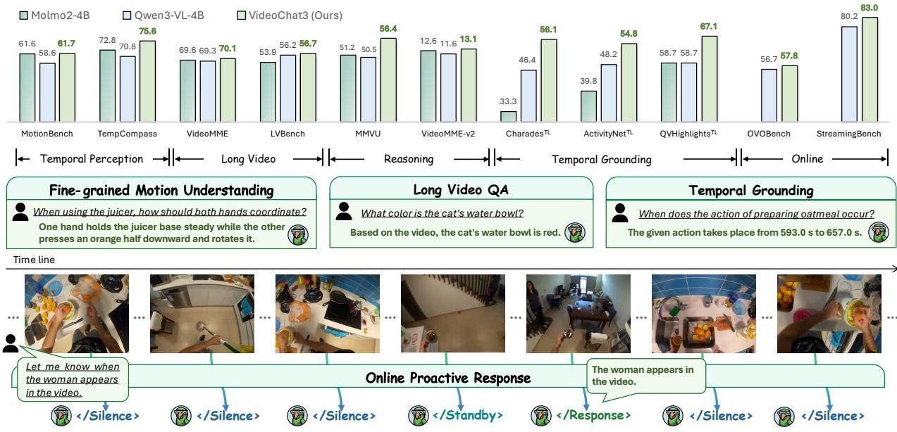  
Figure 1 VideoChat3 achieves strong performance across diverse evaluation benchmarks, including temporal perception, long video understanding, and temporal grounding, while also supporting online proactive responses.

Recent progress [1, 2, 3, 4, 5] in Video Multimodal Large Language Models (Video MLLMs) has significantly advanced this goal. Built upon large language models [6, 7], Video MLLMs have demonstrated promising capabilities across fine-grained video perception [4, 8], long-video understanding [3, 9, 10], egocentric perception [11], temporal grounding [12, 13, 14], and streaming video understanding [15, 16, 17, 18, 19, 20, 21]. At the same time, commercial multimodal systems such as Gemini [22], Kimi [23], and Seed [24] have shown increasingly strong video understanding performance, revealing the potential of large-scale video-language modeling.

However, despite these advances, we identify three key limitations in existing Video MLLMs. First, many models remain specialized for particular video settings or benchmark categories. A model optimized for short videos may not transfer well to long-form understanding, while methods designed for ofline video understanding often lack the ability to handle streaming interaction. This limited generalization prevent video MLLMs from being reliably deployed in real-world scenarios, where video inputs vary widely in duration, frame rate, viewpoint, temporal structure, and interaction mode. Second, video understanding is inherently computationally demanding. Naively extending image-based MLLMs to videos leads to a rapid increase in visual tokens, making long-video and real-time streaming understanding prohibitively expensive. Without eficient visual encoding, video MLLMs are dificult to scale, train, and deploy. Third, reproducibility remains a major bottleneck. Several high-performing models are either closed-source or only partially open, with undisclosed training data, incomplete training recipes, or unavailable data construction pipelines. This opacity makes it dificult for the community to understand what drives performance, compare methods fairly, or build upon prior work. All these limitations indicate that the field still lacks an eficient, generalist, and fully reproducible video MLLM that can serve as a strong foundation for open research.

To address these challenges, we introduce VideoChat3, a systematic framework that advances video understanding along three dimensions: eficient model architecture, scalable data construction, and full-stack open-sourcing for reproducible research.

• Model Architecture: Starting from the core problem of video encoding, we propose the Inflated 3D Vision Transformer (I3D-ViT) architecture together with an Adaptive Frame Resolution for streaming video perception. This design significantly reduces the number of visual tokens in high-frame-rate, long-form, and real-time streaming video scenarios, thereby substantially improving video processing eficiency while maintaining strong understanding accuracy. It efectively alleviates the computational bottleneck faced by existing Video MLLMs in long-video and real-time settings.

• : We develop a large-scale multimodal data synthesis and curation pipeline spanning both ofline and online streaming video understanding tasks, yielding three dedicated datasets: VideoChat3-Academic2M, VideoChat3-LV116K, and VideoChat3-OL617K, which collectively comprise 3 million high-quality multimodal instruction samples. Meanwhile, we adopt a multi-stage curriculum learning strategy for progressive model training, enabling the model to systematically acquire video understanding capabilities across diferent task types and dificulty levels, ultimately leading to strong generalist video understanding performance.

• Training, Evaluation, and Fully Open-source: Building upon the synergy between the proposed architec ture and data pipeline, VideoChat3 achieves dual breakthroughs in both efectiveness and eficiency. Extensive evaluations on mainstream video understanding benchmarks demonstrate that VideoChat3 surpasses open-source state-of-the-art models of comparable parameter scale, such as Qwen3-VL [1] and Molmo2 [5], while also showing significant advantages in training throughput and inference speed. More importantly, we fully release the model weights, training code, training strategy, complete training datasets, and dataset construction pipeline, providing a high-performance, eficient, and reproducible open-source foundation for future research in real-world video understanding.

Overall, VideoChat3 serves not only as a strong video MLLM, but also as a fully reproducible foundation that lowers the barriers to data, training, and eficient video modeling for the open-source community.

## 2 Model Architecture

## 2.1 Overview

Video MLLMs face a fundamental tension between visual perception quality and computational eficiency. As video duration, frame rate, and spatial resolution increase, the number of visual tokens quickly exceeds the context and compute budgets of practical LLM deployments. Most existing systems inherit an image tokenizer and adopt sparse sampling to encode videos into tokens: each sampled frame is encoded largely as an independent image, while temporal modeling is deferred until the resulting visual tokens reach the LLM. This paradigm sufers from two prominent drawbacks. First, sparse frame sampling leads to the direct loss of abundant video details, such as short-term motion and subtle temporal variations. Second, temporally adjacent frames contain considerable overlapping and redundant content, yet the image tokenizer fails to leverage such repetitions to derive more compact video representations.

To this end, VideoChat3 is built on a diferent principle: modeled and their redundant information reduced as early as possible before the video tokens are passed to the . We introduce two complementary designs that compress video representations along the temporal and spatial dimensions.

1. For temporal dimension, we introduce Inflated 3D Vision Transformer (I3D-ViT), a visual tokenizer inflated from a pretrained image tokenizer by extending its 2D spatial self-attention into 3D spatiotemporal self-attention. Rather than treating frames as isolated images, I3D-ViT groups consecutive frames into short chunks, applies spatiotemporal self-attention within each chunk for local spatiotemporal modeling, and finally performs temporal pooling to produce compact, motion-aware visual tokens.

2. For spatial dimension, we further introduce Adaptive Frame Resolution for streaming video perception. Humans allocate visual attention adaptively: routine moments are perceived coarsely, whereas important or uncertain events prompt finer-grained perception. Inspired by this behavior, our method enables the model to adjust the spatial resolution of incoming frames based on their perceived impor tance. Thus, uninformative intervals can be processed eficiently at low resolution, while potentially critical moments are examined with richer visual detail.

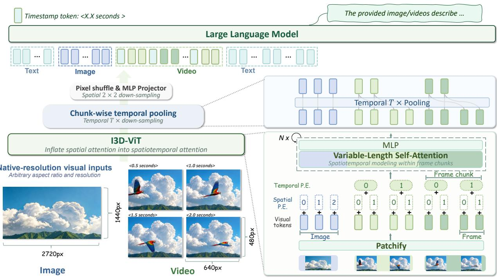  
Figure 2 VideoChat3 architecture with I3D-ViT. VideoChat3 follows the classical ViT–MLP Projector–LLM architecture, with I3D-ViT enabling eficient video encoding before visual tokens are passed to the LLM. Specifically, spatial 2 2 merging and temporal T -frame pooling reduce the visual sequence length by approximately a factor of 4T . Under the default setting of T = 4, this yields a 16 spatiotemporal compression ratio; for clarity, the figure illustrates the mechanism with $T = 2$

Together, these designs form a unified video-oriented perception architecture for VideoChat3, enabling eficient and detail-preserving video understanding across diverse deployment scenarios.

## 2.2 Eficient Video Tokenization with Spatiotemporal Modeling

Video is inherently information-rich: both fine-grained short-term motion and long-range video understand ing require a large number of visual tokens. However, practical LLMs can only accommodate a limited visual token budget. Existing systems typically address this tension by discarding information before it ever reaches the model, for example by sparsely sampling frames and encoding each sampled frame at a modest resolution. While this keeps the context length manageable, it fundamentally removes substantial video details at the input stage. Our key observation is that local temporal dynamics and inter-frame redundancy can be modeled more eficiently within the visual tokenizer. As illustrated in Figure 2, we start from a pretrained image tokenizer and inflate its original 2D spatial self-attention into a chunk-wise spatiotemporal attention mechanism. This gives rise to the visual tokenizer of VideoChat3, termed Inflated 3D Vision Transformer (I3D-ViT). Specifically, I3D-ViT introduces the following designs:

• Chunked Frame Grouping. Instead of encoding sampled frames independently, we partition each video into contiguous frame chunks of up to T frames. Each frame chunk is treated as a local spatiotemporal unit, allowing neighboring frames to interact before the resulting visual tokens are passed to the LLM.

• Temporal Positional Encoding. Within each frame chunk, we preserve the pretrained spatial positional embeddings from the image tokenizer and introduce learned absolute temporal embeddings for frame indices 0 through $T - 1$ , allowing the tokenizer to distinguish the temporal order of frames while retaining the pretrained spatial structure.

• Native-Resolution Spatiotemporal Modeling. Tokens from all frames within a frame chunk are flattened into a single sequence, enabling the I3D-ViT blocks to perform joint attention over space and time at the native input resolution. This allows I3D-ViT to produce more compact video tokens after local temporal redundancy has been implicitly modeled by spatiotemporal self-attention.

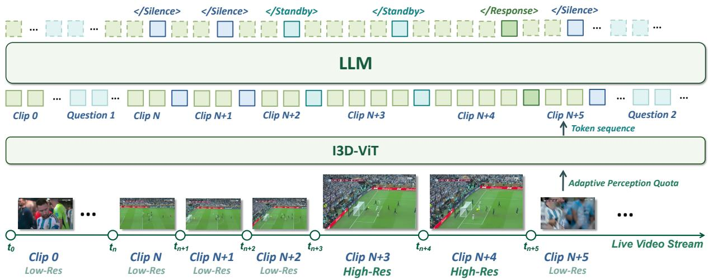  
Figure 3 Illustration of the Adaptive Frame Resolution. State tokens control whether the next streaming window is encoded at a low or high pixel quota. In the soccer example, routine play is monitored at low cost; when players rush toward the goal, the Standby state enlarges the next window so the model can inspect whether the ball goes in before triggering Response.

• Chunk-Wise Temporal Pooling. After spatiotemporal contextualization, we aggregate features along the temporal dimension within each frame chunk. This reduces the token count by a factor of T , allowing the subsequent module to operate on features that already encode local temporal redundancy, rather than on frame-wise independent representations.

Unless otherwise specified, we set T = 4, which, combined with the 2 × 2 spatial downsampling induced by pixel shufling [25], yields an overall 16 spatiotemporal compression ratio. Beyond improving context eficiency, I3D-ViT also provides a flexible interface for variable-length videos. Since tokenization adapts to the available visual budget, inputs can be rescaled according to their estimated load: shorter clips can be represented with higher spatial and temporal fidelity, while long-running streams or hours-long videos can be processed at lower resolution and frame rate. This makes the visual bottleneck adaptive rather than fixed, enabling denser video evidence to be preserved under the same LLM context budget.

## 2.3 Adaptive Frame Resolution for Streaming Video Perception

Ofline video understanding usually assumes that all frames are observed before the model starts decoding. This assumption is unsuitable for streaming scenarios, where visual inputs arrive continuously and the model must decide not only what to answer, but also when to answer and how much visual detail to consume before answering. In this process, the model may need to process visual information at every moment, leading to substantial computational overhead. Therefore, a more eficient streaming video perception scheme is needed.

Our design is motivated by how humans watch live video streams. Viewers rarely inspect every moment with the same level of attention: routine intervals are monitored in a relaxed mode, while potential highlights immediately trigger focused observation. For example, during a soccer broadcast, midfield passing can be followed with coarse attention, but once an attacker breaks through the defense and approaches the goal, the viewer naturally concentrates on the fine visual details needed to judge whether the ball goes in. This suggests that a streaming video model should also maintain low-cost monitoring by default, allocate higher visual fidelity only when a possible response-worthy cue appears, and generate an answer after suficient evidence has been observed. We therefore formulate streaming inference as a state-conditioned closed loop between the language model and the visual tokenizer, as illustrated in Figure 3. At each streaming step, the model first emits a response-state token. The token belongs to one of three states:

• Silence. The current window does not contain task-relevant evidence. The model suppresses naturallanguage generation and continues monitoring the stream.

• The current window contains potential evidence, but the information is not yet suficient fo a reliable answer. The model keeps silent while preparing to observe subsequent windows at higher fidelity.

• Response. The accumulated evidence is suficient. The model switches from state prediction to autore gressive answer generation, and then returns to low-cost monitoring unless a new cue is detected.

The key distinction from prior response-state formulations is that the state token is also used as a control signal for the next visual input. Let $s _ { t }$ denote the state predicted after processing the current video window, and let $b _ { t + 1 }$ denote the per-frame pixel quota used for the next window. We use a simple deterministic controller:

$$
b _ {t + 1} = \left\{ \begin{array}{l l} B _ {\text {low}} & \text {if s_{t} = Silence,} \\ B _ {\text {high}} & \text {if s_{t} = Standby,} \\ B _ {\text {low}} & \text {if s_{t} = Response,} \end{array} \right. \quad B _ {\text {low}} = 2 2 4 ^ {2} \text {pixels}, \quad B _ {\text {high}} = 4 4 8 ^ {2} \text {pixels}.
$$

Thus, most background frames and post-response monitoring frames are processed with a compact low-quota perception window under a $2 2 4 ^ { 2 } .$ -pixel per-frame quota, while windows following Standby cues are enlarged under a $4 4 8 ^ { 2 } .$ -pixel quota to recover fine-grained details such as small objects, subtle motion, or text. Each frame is isotropically resized according to its original aspect ratio, producing a flexible resolution whose total pixels fit within the selected quota, $\mathrm { e . g . }$ , a 5:3 frame can be encoded as $2 8 0 \times 1 6 8$ under the low quota. Since I3D-ViT naturally supports variable spatial input sizes, this policy does not require a separate high-resolution encoder; it only changes the pixel quota of the next streaming chunk while allowing flexible input resolutions within the corresponding quota. The result is an adaptive dynamic perception window that allocates visual tokens along the time axis according to the model’s own uncertainty and evidence state.

## 3 Dataset Construction

## 3.1 Overview

The central challenge in building video instruction data is that no single data source provides both trustworthy supervision and suficiently rich temporal structure. Existing academic datasets ofer broad task coverage and clear source provenance that are often human verified. However, many of these datasets were originally designed for short-clip or closed-form prediction, where the desired output is a class label, an option letter, or a short phrase. This creates a supervision mismatch: the model observes a long multimodal context, but receives only a small number of target tokens, with little explicit evidence guidance.

We therefore treat academic datasets as reliable semantic anchors rather than definitive supervision targets. Starting from their original annotations, we rewrite and validate the labels to yield denser supervisory signals paired with evidence-grounded responses. Our goal is not to alter the task definition or inject unconstrained external knowledge, but to make explicit the visual evidence and reasoning logic implicit in the original labels. This annotation enhancement preserves the reliability of curated academic resources while improving their eficacy for training models in natural-language response generation, visual grounding, and evidence-aware reasoning.

The second challenge is long video understanding. Academic resources are often dominated by short videos and benchmark-style tasks, whereas long-video understanding requires a diferent kind of supervision. Relevant evidence may appear sparsely across minutes or hours, events may only become meaningful after earlier context, and correct answers often require linking entities, actions, and scene transitions across multiple temporal segments. To cover this regime, we further collect long videos from external sources and build a dedicated synthesis pipeline. The pipeline decomposes each video into coherent temporal units, annotates and filters each unit, and then composes the validated evidence into training annotations.

Finally, we convert high-quality video QA pairs into online streaming samples, so the model learns not only how to answer properly, but also how to identify the correct response timing and proactively respond to user

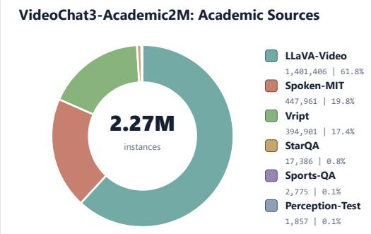

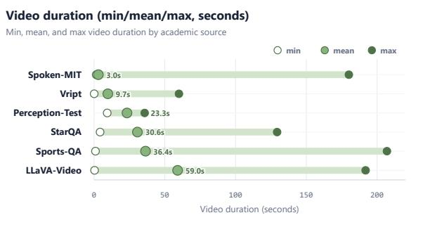  
VideoChat3-LV116k: Long-Video Source Video duration (min/mean/max, seconds, log scale)Figure 4 Source Distribution of VideoChat3-Academic2M. VideoChat3-Academic2M contains 2.27M caption/QA instances from six academic sources, dominated by LLaVA-Video [26], Spoken-MIT [27], and Vript [28].

24,018 | 20.7%needs once suficient visual evidence has emerged.

## Long Video Summarization & QA3.2 VideoChat3-Academic2M: Re-Annotating Academic Video Data

Movie Summarization & QA 1 10 100 1K 10K 50KAcademic Source Aggregation. As shown in Figure 4, we first aggregate publicly available academic datasets covering video captioning, video question answering, and fine-grained motion perception. These datasets provide complementary supervision signals: captioning data describes visible entities and actions, QA data encourages query-conditioned perception, and motion-centric data stresses fine-grained temporal understand ing. More importantly, they are curated under explicit task definitions and often contain human-verified labels, making them reliable sources of visual semantics. Nevertheless, their original annotation formats are not always suitable for instruction tuning. A large portion of samples only provide a multiple-choice option, a single noun phrase, or a short factual answer. Directly training on such annotations gives the model little generative supervision relative to the number of video and prompt tokens. The model may learn the final label, but it receives limited signal about how the answer should be expressed, what visual evidence should be mentioned, or how the response should be grounded in the video.

Evidence-Grounded Annotation Enhancement. To better exploit these reliable but sparse academic anno tations, we enhance them into richer instruction-following responses. The key principle is to densify the supervision while keeping the original answer as a semantic constraint. For each sample, we first normalize the query by removing evaluation-specific formatting requirements, such as prompts that force the model to output only an option letter. When the original response is option based, we recover the natural-language content of the selected option and use it as the target semantics. We then use Qwen3-VL-235B-A22B to rewrite short-text or option-only responses into comprehensive answers with explicit visual evidence and reasoning. The model is instructed to preserve the original answer, avoid adding unsupported facts, and ground the response in observable video content. In this way, an answer that originally provides only the final decision is transformed into supervision that also describes the relevant objects, actions, scenes, and temporal cues. As shown in Figure 5, the rewritten annotations contain substantially more video-specific information than the original annotations, providing denser targets for learning video-language alignment and evidence-aware generation.

Consistency Verification and Error Filtering. Annotation enhancement also introduces a new risk: a powerful generator may produce fluent but unsupported details. We therefore add a verification stage to preserve the fidelity of the original academic labels. Specifically, we use Qwen3-VL-235B-A22B as a judge model to compare each rewritten response with the original annotation. The judge checks whether the rewritten response is semantically consistent with the original label and whether the added explanation changes, contradicts, or over-specifies the answer. Only annotations that pass this consistency check are retained. This filtering step lets us increase the density and readability of supervision without sacrificing the reliability that makes academic datasets valuable in the first place. In efect, the original annotation defines the semantic boundary of the answer, while the rewritten response supplies a richer and more trainable expression of that answer.

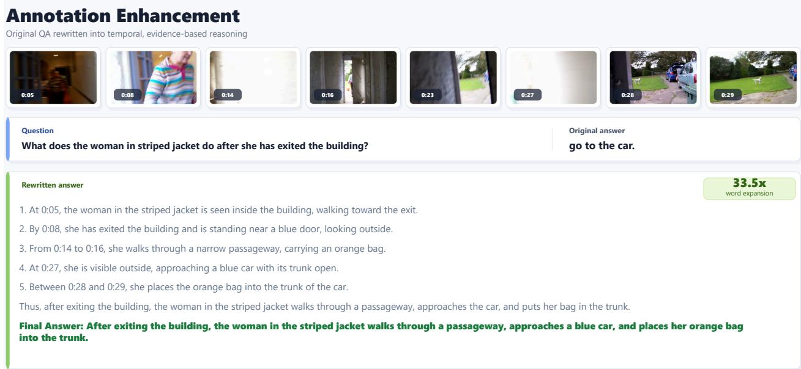  
Figure 5 Example of Annotation Enhancement from Concise Answers to Evidence-Grounded Responses. A short phrase answer is rewritten into a temporally grounded, evidence-rich response that explains the observed actions and supports the final answer with video-specific cues. This illustrates how annotation enhancement increases supervision density while preserving the original semantic label.

## 3.3 VideoChat3-LV116K: Long-Video Data Synthesis

Although enhanced academic data improves the quality of short-video and benchmark-style supervision, it does not fully address long-video understanding. Long videos are not simply longer versions of short clips: their dificulty comes from sparse evidence, delayed dependencies, event transitions, and information that must be aggregated over extended temporal contexts. A model trained only on short clips may recognize local actions, but still fail to connect events that are separated in time or to localize evidence precisely within a long sequence. To address this gap, we construct VideoChat3-LV116K by collecting additional long videos and synthesizing structured annotations through a multi-stage pipeline. As illustrated in Figure 7, the pipeline filters candidate long videos, segments them into coherent temporal units, annotates each segment with quality control, and assembles the validated segment descriptions into dense full-video captions.

Long-Video Collection and Filtering. We collect candidate long videos from multiple sources, prioritizing those with clear visual content, coherent temporal structures, and suficient durations for long-context reasoning. The dataset encompasses a broad range of domains, including entertainment, education, sports, news, science, and gaming. Videos exhibiting severe corruption, low visual quality, excessive duplication, or limited semantic content are discarded. This newly collected data is intended to complement existing academic datasets by supplying extended temporal scales and richer event structures, while established academic resources maintain reliable task diversity.

Boundary-Aware Temporal Segmentation. Directly annotating an entire long video is costly, noisy, and constrained by the context limits of current video-language models. We therefore decompose each video into manageable temporal segments before annotation. This segmentation serves as an intermediate representa tion: each segment is short enough to be described accurately, while the ordered list of segments preserves the global temporal structure needed for long-video reasoning. Segment boundaries are determined by com bining visual scene detection with heuristic temporal windows. Specifically, we use PySceneDetect to identify shot transitions and enforce minimum and maximum duration constraints to avoid both overly fragmented clips and segments that are too long for reliable annotation. This produces visually coherent units with controllable temporal granularity.

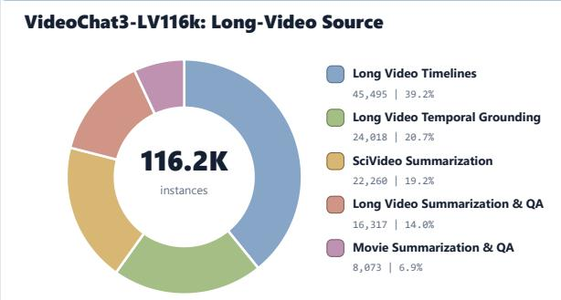

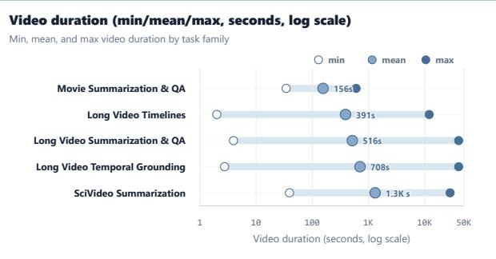

Figure 6 Source Distribution of VideoChat3-LV116K. The panels summarize the collected long-video repository used to construct VideoChat3-LV116K, with 116.2K rows. The duration statistics reveal a clear temporal-scale gap: academic sources are mostly short clips, with mean durations from 3.0s to 59.0s, whereas our collected long-video shards average 156s to 1.3K seconds and extend to much longer maxima. This complementarity provides both reliable short-clip semantic anchors and long-range supervision for sparse evidence, cross-segment aggregation, and event-level reasoning.

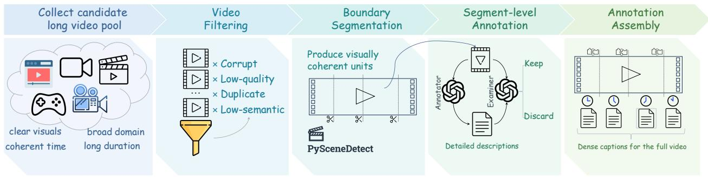  
Figure 7 Long-Video Data Synthesis Pipeline for VideoChat3-LV116k. The pipeline converts raw long videos into structured supervision through candidate filtering, temporal boundary segmentation, segment-level annotation, quality examination, and full-video annotation assembly. Instead of annotating an entire long video directly, it builds a validated segment-level evidence ledger, making sparse long-range events easier to capture and reason over.

Segment-Level Annotation and Quality Control. Each segment is annotated independently before being inte grated into long-video supervision. Using Qwen3-VL-235B-A22B [1], we generate structured descriptions that capture visible entities, actions, scenes, event transitions, salient temporal details, and OCR or subtitle cues when available. These timestamped descriptions form an evidence ledger for the full video: instead of asking a model to reason over raw long video at once, we first build a validated textual representation of what happens and when it happens. To reduce hallucination and annotation noise, an auxiliary MLLM evaluates the generated segment descriptions. We discard annotations that are repetitive, overly generic, internally inconsistent, or unsupported by the visual evidence. The remaining descriptions are then aggregated with their corresponding temporal boundaries to form dense, timestamped captions for the full video.

Long-Video Training Annotation Synthesis. After obtaining validated segment-level descriptions, we synthesize long-video training labels that require reasoning beyond isolated clips. We query a frontier LLM with an interleaved sequence of timestamps and segment descriptions, prompting it to reason over the entire video context and explicitly cite supporting temporal evidence. This turns the segment evidence ledger into diverse instruction data for the following task families:

1. Long Video Temporal Grounding. The model must localize the time intervals corresponding to a given text query. Unlike existing temporal grounding data that only focuses on single-interval localization, we also synthesize queries for multi-interval grounding. We prompt the LLM to generate queries at multiple levels of specificity, including keywords, phrases, and complete sentences, together with candidate temporal regions that may contain the relevant evidence. An expert grounding model is then applied within each candidate region to produce precise temporal spans. We merge spans across the full video, discard empty predictions, and filter samples with low semantic similarity between the query and the grounded video content.

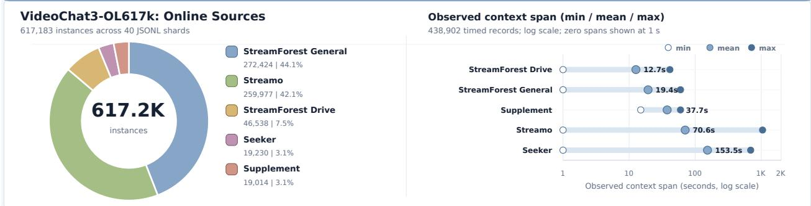  
Figure 8 Source composition and temporal coverage of VideoChat3-OL617K. Left: Distribution of 617,183 instances across 40 JSONL shards. StreamForest General and Streamo contribute 272,424 (44.1%) and 259,977 (42.1%) in stances, respectively, while StreamForest Drive, Seeker, and Supplement provide the remaining data. Right: Minimum, mean, and maximum observed context spans for 438,902 records with timing information, shown on a logarithmic scale with zero-length spans placed at 1 second for visualization. Mean spans range from 12.7 seconds for StreamForest Drive to 153.5 seconds for Seeker, providing supervision across both short- and long-horizon causal streaming con texts. This diversity supports the evidence accumulation and response-timing behaviors used to construct proactive streaming QA supervision.

2. Long Video Timelines. The model is required to describe salient events together with their temporal boundaries. We use the validated segment descriptions to identify event-level units, merge adjacent segments when they describe the same continuous event, and generate concise captions that summarize what happens in each time interval. Samples are filtered when the caption is too generic, temporally ambiguous, or insuficiently supported by the segment evidence.

3. Long-Video QA. The QA tasks are designed so that the answer depends on evidence distributed across multiple temporal segments. We prompt the LLM to generate questions, answers, and supporting timestamps from the full sequence of segment descriptions. To avoid trivial examples, we filter out questions that can be answered from a single frame, a single isolated segment, or language priors alone. The retained samples encourage the model to aggregate information over long contexts and to provide answers grounded in specific video moments.

Finally, we apply an additional filtering mechanism to remove samples that can be solved without meaningful video understanding, such as questions answerable from a single static frame or from common language priors. This ensures that the synthesized annotations emphasize the capabilities that long videos uniquely require: temporal localization, cross-segment aggregation, and event-level reasoning.

The resulting VideoChat3-LV116K data contains 116.2K JSONL rows from six long-video shards, as shown in Figure 6. While the academic sources have mean durations ranging from 3.0s to 59.0s, the final long-video shards have mean durations from 156s to about 1.3K seconds. VideoChat3-LV116K complements VideoChat3- Academic2M not merely by adding more samples, but by providing supervision over much longer temporal contexts, where evidence is sparse, events are distributed across segments, and answers require cross-event aggregation.

## 3.4 VideoChat3-OL617K

To train VideoChat3 as a proactive streaming assistant, we convert high-quality video–question–answer triples into online response supervision. Each original sample consists of a video, a user query, and a ground-truth answer. Instead of asking the model to answer after observing the full video, we annotate when the necessary visual evidence becomes available and construct a causal training sequence with explicit response-state tokens.

Visual Clue Localization. We first feed the original video–QA triple into a vision language model (VLM) to identify temporal intervals that contain key evidence for answering the query. For each localized interval, the

Table 1 Detailed configuration for each training stage of VideoChat3. Dataset items denote the total number of samples used across all sub-stages within each stage. The corresponding training curricula are described in the subsections below.

<table><tr><td>Stages</td><td>Stage 0</td><td>Stage 1</td><td>Stage 2</td><td>Stage 3</td></tr><tr><td>Purpose</td><td>Visual tokenizer pre-training</td><td>Video-language alignment</td><td>Video instruction tuning</td><td>Long &amp; streaming instruction tuning</td></tr><tr><td>Batch size</td><td>512</td><td>256</td><td>256</td><td>256</td></tr><tr><td>Learning rate</td><td> $1 \times 10^{-3}$ </td><td> $4 \times 10^{-5}$ </td><td> $5 \times 10^{-5}$ </td><td> $3 \times 10^{-5} \rightarrow 5 \times 10^{-6}$ </td></tr><tr><td>Dataset items</td><td>7.59M</td><td>3.47M</td><td>10.33M</td><td>3.41M</td></tr><tr><td>Packed seq. length</td><td>8192</td><td>16384</td><td>32768</td><td>98304</td></tr><tr><td>Training epochs</td><td>1</td><td>1</td><td>1</td><td>1</td></tr><tr><td>Trainable modules</td><td>Proj. → All</td><td>Proj. → All</td><td>All</td><td>Proj. &amp; LLM</td></tr></table>

Note. The arrow indicates the transition from projector warm-up to joint training. The temporary LLM used in Stage 0 is discarded after visual-tokenizer pre-training.

VLM also generates a detailed description of the relevant visual clue, such as the object state, action, text, or event transition that supports the answer.

Clue Verification. To reduce noisy or weak localizations, we crop the candidate clue intervals from the original video and ask the VLM to re-evaluate them against the original query. We retain only the samples for which the ground-truth answer can be correctly inferred from the cropped segment alone. This filtering step ensures that the retained intervals provide suficient visual evidence, rather than merely co-occurring with the answer in the full video context.

Streaming QA Construction. After verification, we transform each sample into an interleaved streaming sequence of video windows and target tokens. Verified clue intervals are treated as moments when the model should collect visual evidence, and their corresponding windows are labeled with </Standby>. Once the clue interval ends, the model is required to immediately emit </Response> followed by the answer text. All other irrelevant windows are labeled with </Silence>, encouraging the model to suppress premature responses while continuously monitoring the stream. This process turns ofline video QA supervision into proactive online QA data with explicit evidence acquisition and response timing signals.

## 4 Training

The overall training recipe proceeds through four stages, gradually moving from visual tokenizer pre-training to video-language alignment, general video instruction tuning, and finally long-form streaming adaptation. This staged design allows the model to first acquire robust visual representations, then align them with the language space, and eventually specialize in instruction-following scenarios with increasingly complex temporal requirements. Table 1 summarizes the scheduling and optimization settings for all stages.

## 4.1 Stage-0: Video Tokenizer Pre-training

Training Strategy. Before training the full MLLM, we first pre-train the visual tokenizer in a languagegrounded manner. The goal of this stage is not to endow the model with high-level instruction-following ability, but to make the visual encoder produce representations that can be readily consumed by an autoregressive language model. To this end, we initialize I3D-ViT from the image-pretrained MoonViT [29], attach a lightweight projector, and use Qwen3-4B as a temporary text decoder. The model is trained on image-text and video-text pairs with the standard next-token prediction objective, so that visual tokens are optimized directly under a language modeling supervision signal. This pre-training stage consists of two steps:

1. Projector Warm-up. We freeze both the ViT and the LLM, and update only the projector. This isolates the initial modality alignment problem from representation drift: the image-pretrained ViT preserves its spatial perception ability, while the projector learns to map visual features into the language embedding space.

2. Full-parameter Fine-tuning. We then unfreeze the ViT, projector, and LLM, and train them jointly on a larger and more diverse mixture. This allows the ViT to adapt from image-centric representations to spatiotemporal video representations, while still being anchored by abundant image-text data

After Stage-0, we discard the temporary language decoder and retain only the trained ViT weights to initialize the visual component of the subsequent MLLM training stages.

Data Mixture. Our data mixture is designed to align with the two-stage training strategy:

1. Projector Warm-up. We use a compact but balanced set of 1.04M single-turn samples, including 558K image-text pairs from LLaVA-Pretrain [30] and 481K video-text caption pairs from S-MiT [27]. This mixture provides enough visual diversity for establishing the initial visual-language mapping, while keeping the optimization focused on the projector.

2. Full-parameter Fine-tuning. We scale the mixture to 6.55M samples, consisting of 4.9M image-text samples and 1.65M video-text samples. The image portion remains dominant, serving as a strong spatial-semantic anchor when the ViT parameters are unfrozen. It includes image caption samples from CapRL-2M [31] whose source images come from ShareGPT4V [32] and DenseFusion [33], as well as 2.9M CC3M [34] samples that we recaptioned with CapRL-3B [31]. The video portion introduces temporal and motion-centric supervision from both curated in-house recaptioned data and public video-text resources. It includes 323K VideoChat3-LV samples from ShareGemini WebVid [35] and K400 [36] videos, 448K VideoChat3-Academic samples from Qwen3-VL-rewritten S-MiT [27] captions, 395K Vript [28] samples, 104K PE-Video [37] samples, and 380K Tarsier-recaptioned [38] public video samples from sources such as WebVid [35], LSMDC [39], VATEX [40], ActivityNet [41], Charades [42], Something-Something V2 [43], and Ego4D [44].

Overall, Stage-0 uses 7.59M single-turn image/video-text samples.

## 4.2 Stage-1: Video-Language Alignment

Training Strategy. After Stage-0, the I3D-ViT tokenizer has already been trained under language-modeling supervision and can produce language-grounded visual representations. Stage-1 therefore focuses on integrating this tokenizer into the final MLLM, rather than re-learning visual semantics from scratch. In this stage, we replace the temporary decoder used in Stage-0 with the target language model and align the com plete video-language pathway. The supervision remains caption-centric: image captions continue to provide dense signals for objects, attributes, OCR, and spatial relations, while video captions strengthen the model’s sensitivity to motion, temporal transitions, and event-level semantics.

We follow a lightweight-to-joint alignment schedule:

1. Projector warm-up. We first freeze both the Stage-0 initialized ViT and the LLM, and update only the projector. Since the visual tokenizer has already acquired language-grounded representations, this step mainly adapts the interface between the tokenizer and the target LLM, preventing the newly initialized projector from destabilizing either side.

2. Joint video-language alignment. We then unfreeze the visual tokenizer together with the LLM and continue training with caption-style supervision. This step allows the visual front-end and the lan guage model to co-adapt under the final MLLM architecture, while still avoiding benchmark-specific instruction formats at this early stage.

After Stage-1, images and videos are represented as compact visual tokens that the LLM can reliably narrate, providing a stable foundation for the later reasoning and instruction-following stages.

Data Mixture. The Stage-1 data mixture follows the same caption-oriented principle as Stage-0, but is used for interface alignment within the final MLLM. All samples are single-turn visual prompt–caption response pairs.

1. Projector warm-up. We use 1.04M caption pairs, consisting of 558K image-caption samples from LLaVA-Pretrain [30] and 481K video-caption samples from S-MiT [27]. This compact mixture preserves the same image-video balance used for the initial tokenizer warm-up, allowing the projector to learn a stable mapping without shifting the pretrained visual or language representations.

2. Joint video-language alignment. We further train on 2.43M caption pairs. The image portion is dominated by CapRL-2M [31], including samples whose source images come from ShareGPT4V [32] and DenseFusion [33]. The video portion includes 323K ShareGemini [45] VideoChat3-LV samples from WebVid [35] and Kinetics-400 [36], together with 104K PE-Video [37] samples and 2K ShareGPT-4o [46] video-caption samples.

Overall, Stage-1 uses 3.47M single-turn caption samples, including 2.56M image-caption samples and 0.91M video-caption samples.

## 4.3 Stage-2: Video Instruction Tuning

Training Strategy. Stage-2 converts the aligned MLLM into a general-purpose video instruction-following model. We unfreeze all model parameters and train with a larger packed sequence length on a balanced mixture of image and video QA/caption samples, corresponding to around 50 billion training tokens. Unlike Stage-1, which mainly teaches the model to describe visual content, this stage exposes the model to questionconditioned evidence selection, open-ended answering, multiple-choice reasoning, and caption generation across both image and video inputs.

The image–video mixture is important for stability. Many video failures originate from weak frame-level perception, such as missing small objects, text, spatial relations, or subtle attributes; retaining high-quality image supervision therefore acts as an anchor for fine-grained spatial understanding. Video supervision then builds on this anchor to strengthen temporal reasoning, event ordering, state-change recognition, and multi-segment evidence aggregation. Captioning and QA also play complementary roles: captioning supplies dense token-level supervision and discourages terse answer-only behavior, while QA forces the model to select task-relevant visual evidence and express it in the form requested by the user. In particular, the rewritten academic annotations provide richer rationales than option-only labels, increasing the amount of useful language supervision per visual context. By postponing full instruction tuning until after caption-based alignment, Stage-2 can spend most of its capacity on higher-level video reasoning and response generation, rather than on repairing raw modality mismatch.

Data Mixture. Stage-2 training data contains 10.33M samples and 23.62M QAs. The mixture is intentionally anchored by a large image instruction corpus, Honey-Data [47], which contributes 5.65M efective image samples and 12.85M efective QA turns. It covers captioning, general VQA, STEM diagrams, charts/tables, document/OCR understanding, and grounding/counting, helping preserve strong still-image perception while the model is adapted to video. We additionally include 1.81M text-only Dolci-Instruct-SFT [48] samples to maintain general instruction following, mathematical reasoning, multilingual behavior, and science-oriented responses.

Video supervision is dominated by VideoChat3-Academic, with 1.54M efective video samples and 5.57M efective QA turns. This source includes academic/youtube-style video captions and QA, Qwen3-VL-rewritten or corrected subsets, and duration-bucketed open-ended and multiple-choice examples; its high QA density provides the main signal for video captioning, temporal comprehension, and answer-style alignment. We also include VideoChat3-LV Gemini-generated long-video data (46.7K samples), which complements the academic mixture with long-form, scientific, and cinematic grounding-style supervision.

The remaining video data are smaller but targeted open-source sources. TimeLens-100K [14], Molmo2 [5], TVQA [49], FineVideo [50], CinePile-v2 [51], and VCG-plus [52] provide dense multi-turn temporal and subtitle-aware QA. Vript [28], PE-Video [37], TGIF [53], CLEVRER [54], Something-Something-v2 [43], EgoIT [55], MotionBench [56], ActivityNet [41], LaSOT/GOT-10k [57, 58], and related tracking/localization datasets broaden coverage over generic video captioning, action recognition, procedural/egocentric understanding, object tracking, physical/causal reasoning, and fine motion discrimination. This composition balances scale with diversity: image/text data stabilize general multimodal instruction following, while videospecific subsets concentrate supervision on temporal grounding, long-video understanding, and fine-grained motion reasoning.

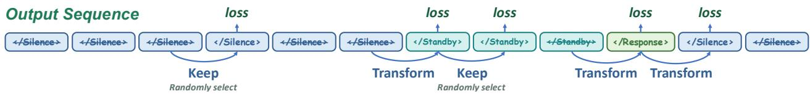  
Figure 9 State-transition supervision mask for streaming training. The output sequence consists of </Silence>, </Standby>, and </Response>. Blue arrows indicate the state-token positions whose losses are retained. We keep all Transform positions, where the target state changes between adjacent windows, because they define the temporal decision boundaries. From the remaining continuation positions, we randomly select an equal number of Keep positions to provide supervision for maintaining the current state.

## 4.4 Stage-3: Long & Streaming Video Instruction Tuning

Training Strategy. In this stage, we further adapt the model to long-form and streaming video understanding, where the model is expected to reason over substantially longer temporal contexts and produce responses under incremental visual inputs. We adopt a smaller learning rate together with an extended context window to stabilize optimization over long sequences, processing approximately 10 billion tokens in total. To avoid biasing the model toward either ofline holistic perception or online temporal reasoning, we construct a mixed training curriculum that jointly covers conventional ofline videos and streaming-style samples.

For streaming videos, we introduce a dedicated training strategy that exposes the model to progressively available video segments and requires it to answer based only on the information observed so far. This design encourages the model to maintain temporal memory, update its understanding as new frames arrive, and preserve strong performance on standard ofline video tasks. As a result, the final stage bridges the gap between long-context video instruction following and practical streaming video interaction.

Supervision Mask for State Transition Learning. We train the streaming behavior with teacher-forced state supervision. Each training sample is represented as an interleaved sequence of video windows and target tokens. For non-answer moments, the target token is one of </Silence> or </Standby>; when suficient evidence has appeared, the target token becomes </Response> and is followed by the answer text. The answer text uses the standard next-token prediction loss. The special treatment is applied only to the response-state tokens.

A direct causal-language-modeling loss over all state tokens is poorly balanced: long streams contain many more repeated </Silence> tokens than state changes, causing the model to learn a conservative policy that rarely enters Standby or Response. Conversely, keeping losses only on state transitions creates a shortcut: the model can predict the next state from the previous state pattern without using visual evidence. We address both issues with state transition masking, as shown in Figure 9.

Let $s _ { t }$ be the target state at streaming step t. We always keep the loss for transition positions $\mathcal { T } = \{ t \mid $ $s _ { t } \neq s _ { t - 1 } \}$ , since these positions define the temporal decision boundaries. From the remaining continuation positions ${ \mathcal { C } } = \{ t \mid s _ { t } = s _ { t - 1 } \}$ , we uniformly sample a subset $\widetilde { \mathcal { C } }$ with $| \widetilde { \mathcal { C } } | = | \mathcal { T } |$ . The masked state loss is

$$
\mathcal {L} _ {\text {state}} = - \frac {1}{\sum_ {t} m _ {t}} \sum_ {t} m _ {t} \log p _ {\theta} (s _ {t} \mid V _ {\leq t}, y _ {<   t}), \qquad m _ {t} = \mathbb {1} [ t \in \mathcal {T} \cup \widetilde {\mathcal {C}} ].
$$

This objective keeps every state switch while preserving an equal number of “stay” decisions, forcing the model to compare the previous state with the current visual evidence before deciding whether to maintain or change its behavior. In a typical streaming cycle, the efective supervision over state tokens follows the expected ratio

$$
<   / \text { Silence } >: <   / \text { Standby } >: <   / \text { Response } > = 2: 2: 1,
$$

because Silence and Standby each contain both transition and continuation supervision, whereas Response immediately hands control to answer generation. During training, the perception-window pixel budget is also teacher-forced from the previous target state; at inference time, the same controller is driven by the model’s predicted state. This matches the training and deployment loops and lets the model learn both the temporal response policy and the active visual-budget policy in a single streaming instruction-tuning stage.

Data Mixture. Stage-3 focuses on streaming video interaction and long-video temporal reasoning. The training mixture contains 3.41M efective samples and 10.39M QAs, with key supervision coming from high-turn video data that requires incremental perception, response timing, temporal retrieval, and evidence-grounded reasoning over long contexts.

The streaming component is mainly provided by VideoChat3-OL, which contributes 191K video records but 4.69M trainable QA turns through action/event captioning, narration, QA, and explicit silence/standby turns. This teaches the model to accumulate evidence from incoming frames, decide when to respond, and avoid pre mature answers under incomplete visual context. The long-video component is centered on VideoChat3-LV, emphasizing event retrieval, timeline construction, temporal localization, subtitle- or narration-conditioned reasoning, and multi-event aggregation over extended videos. VideoChat3-Academic further provides Qwen3- VL-rewritten captions and QA across multiple duration buckets, improving the quality and coverage of both open-ended and multiple-choice video supervision.

Other sources serve as auxiliary supervision. Honey-Data [47] is sampled at a low ratio to preserve broad image-language skills, while Dolci [48] stabilizes language quality. Additional video datasets, including TimeLens-100K [14], Molmo2 [5], Vript [28], LLaVA-Video [26], CinePile [51], MotionBench [56], TGIF/TVQA style QA [49, 53], AVA/EgoQA [59, 60], and StreamForest [19], provide complementary coverage of subtitle QA, dense captioning, motion understanding, tracking, spatial grounding, and driving-scene reasoning. In ad dition, following prior work on synthetic temporal primitives [61], we synthesize a small set of atomic-motion questions, covering counting, rotation, and other basic motion skills in both single-choice and multiple-choice formats. Overall, Stage-3 prioritizes streaming behavior and long-context video reasoning while retaining general multimodal competence through carefully sampled auxiliary data.

## 5 Evaluation

## 5.1 General Video Understanding

We evaluate VideoChat3 across four complementary dimensions of general video understanding: temporal perception, long-video understanding, complex video reasoning, and temporal grounding. Temporal perception is assessed on TOMATO [62], MotionBench [56], TVBench [63], and TempCompass [64], while long-video understanding is evaluated on Video-MME [65], LVBench [66], and VideoEval-Pro [67]. For reasoning-intensive understanding, we use Video-MMMU [68], MMVU [69], Minerva [70], and Video-MME-v2 [71]. We further evaluate temporal grounding on the TimeLens suite [14], covering Charades-STA [72], ActivityNet Cap tions [73], and QVHighlights [74], as well as VUE-TR v1 [75], VUE-TR v2 [76], and the text-query subset of MomentSeeker [77].

As shown in Table 2, VideoChat3-4B achieves strong and balanced performance among fully open video MLLMs. It obtains the best fully open results on MotionBench and TempCompass, scoring 61.7 and 75.6, respectively, demonstrating its ability to capture fine-grained motion and temporal dynamics. Compared with the open-weight Qwen3-VL-4B, VideoChat3 improves on 18 of the 19 directly comparable metrics, with the only decrease occurring on the open-ended split of VideoEval-Pro. Particularly large gains are observed on MMVU (+5.9), the three TimeLens splits (+9.7/+6.4/+8.3), VUE-TR v1/v2 (+15.0/+20.6), and Mo mentSeeker (+12.1).

Compared with similarly sized fully open models, VideoChat3 matches or outperforms Molmo2-4B on most benchmarks, including MotionBench, TempCompass, Video-MME, LVBench, VideoEval-Pro MCQ, Video-MMMU, MMVU, Minerva, Video-MME-v2, all three TimeLens splits, both VUE-TR versions, and MomentSeeker. Its gains over VideoChat-Flash-7B are especially pronounced on temporal grounding, reaching +16.4/+29.8/+34.3 on TimeLens, +30.6/+30.1 on VUE-TR v1/v2, and +18.7 on MomentSeeker. VideoChat3 also surpasses GPT-5 and Gemini 2.5 Flash on all three TimeLens splits, while remaining competitive with Gemini 2.5 Pro. Overall, these results highlight its ability to aggregate temporally ordered evidence and

Table 2 Video benchmark results across temporal perception, long-video understanding, reasoning, and temporal grounding tasks. We compare VideoChat3-4B with proprietary, open-weight-only, and fully open baselines under the oficial metric of each benchmark, where higher scores indicate better performance. Temporal-grounding columns marked with ‘TL’ share the TimeLens suite [14]. Bold and underlined numbers denote the best and second-best results among non-proprietary models, respectively.

<table><tr><td rowspan="2">Model</td><td colspan="4">Temporal Perception</td><td colspan="4">Long Video</td><td colspan="5">Reasoning</td><td colspan="6">Temporal Grounding</td></tr><tr><td>TOMATO test [62]</td><td>MotionBench val [56]</td><td>TVBench test [63]</td><td>TempCompass test MCQ [64]</td><td>Video-MME wo sub [65]</td><td>LVBench test [66]</td><td>VideoEval-Pro MCQ [67]</td><td>VideoEval-Pro Open [67]</td><td>Video-MMMU test [68]</td><td>MMVU overall [69]</td><td>Minerva test [70]</td><td>Video-MME-v2 Non-Lin [71]</td><td>Video-MME-v2 Avg [71]</td><td>Charades $^{TL}$  mIoU [14]</td><td>ActivityNet $^{TL}$  mIoU [14]</td><td>QVHighlights $^{TL}$  mIoU [14]</td><td>VUE-TR V1 mIOU [75]</td><td>VUE-TR V2 mIOU [76]</td><td>MomentSeeker mIoU [77]</td></tr><tr><td colspan="20">Proprietary Models</td></tr><tr><td>GPT-5 [78]</td><td>53.0</td><td>65.4</td><td>—</td><td>80.4</td><td>83.3</td><td>65.2</td><td>68.8</td><td>—</td><td>84.6</td><td>—</td><td>—</td><td>26.4</td><td>44.7</td><td>40.5</td><td>42.9</td><td>52.1</td><td>—</td><td>20.0</td><td>—</td></tr><tr><td>GPT-5 mini [78]</td><td>44.1</td><td>59.9</td><td>—</td><td>74.9</td><td>77.3</td><td>54.7</td><td>60.1</td><td>—</td><td>82.5</td><td>—</td><td>—</td><td>—</td><td>—</td><td>—</td><td>—</td><td>—</td><td>—</td><td>—</td><td>—</td></tr><tr><td>Gemini 3 Pro [22]</td><td>48.3</td><td>62.6</td><td>—</td><td>82.8</td><td>88.6</td><td>77.0</td><td>78.0</td><td>—</td><td>87.6</td><td>—</td><td>—</td><td>38.2</td><td>56.8</td><td>—</td><td>—</td><td>—</td><td>—</td><td>39.7</td><td>—</td></tr><tr><td>Gemini 2.5 Pro [79]</td><td>48.6</td><td>62.0</td><td>62.6</td><td>81.9</td><td>87.8</td><td>75.7</td><td>78.4</td><td>44.2</td><td>83.6</td><td>—</td><td>—</td><td>—</td><td>—</td><td>52.8</td><td>58.1</td><td>70.4</td><td>21.9</td><td>—</td><td>—</td></tr><tr><td>Gemini 2.5 Flash [79]</td><td>39.1</td><td>59.3</td><td>—</td><td>80.2</td><td>84.2</td><td>64.9</td><td>69.6</td><td>36.3</td><td>—</td><td>—</td><td>—</td><td>—</td><td>—</td><td>48.6</td><td>52.5</td><td>64.3</td><td>—</td><td>—</td><td>—</td></tr><tr><td>Claude Sonnet 4.5 [80]</td><td>39.6</td><td>58.5</td><td>—</td><td>72.8</td><td>74.2</td><td>50.5</td><td>50.5</td><td>—</td><td>—</td><td>—</td><td>—</td><td>—</td><td>—</td><td>—</td><td>—</td><td>—</td><td>—</td><td>—</td><td>—</td></tr><tr><td colspan="20">Open weights only</td></tr><tr><td>MiniCPM-V-4.5-8B [81]</td><td>29.8</td><td>59.7</td><td>53.0</td><td>72.7</td><td>67.9</td><td>50.4</td><td>55.3</td><td>34.2</td><td>57.1</td><td>58.9</td><td>36.0</td><td>11.8</td><td>27.1</td><td>31.9</td><td>32.3</td><td>46.1</td><td>25.9</td><td>16.3</td><td>9.3</td></tr><tr><td>Eagle2.5-8B [82]</td><td>31.0</td><td>55.7</td><td>62.0</td><td>74.4</td><td>72.4</td><td>50.9</td><td>60.4</td><td>38.0</td><td>48.3</td><td>54.3</td><td>37.6</td><td>13.0</td><td>29.6</td><td>53.6</td><td>53.7</td><td>64.0</td><td>30.2</td><td>8.7</td><td>5.3</td></tr><tr><td>InternVideo2.5-8B [2]</td><td>32.9</td><td>60.8</td><td>58.1</td><td>70.1</td><td>65.1</td><td>46.4</td><td>53.2</td><td>27.2</td><td>44.0</td><td>48.0</td><td>37.7</td><td>11.2</td><td>26.3</td><td>30.7</td><td>22.2</td><td>32.9</td><td>17.7</td><td>11.1</td><td>6.4</td></tr><tr><td>VideoLLaMA3-7B [83]</td><td>26.8</td><td>48.7</td><td>49.5</td><td>68.1</td><td>66.2</td><td>45.3</td><td>43.8</td><td>25.7</td><td>34.6</td><td>39.9</td><td>29.5</td><td>10.9</td><td>25.7</td><td>39.8</td><td>29.8</td><td>36.9</td><td>15.7</td><td>9.5</td><td>4.6</td></tr><tr><td>Video-XL2-8B [9]</td><td>28.4</td><td>54.3</td><td>47.5</td><td>58.5</td><td>66.6</td><td>48.4</td><td>47.2</td><td>25.1</td><td>39.9</td><td>50.0</td><td>35.3</td><td>7.3</td><td>20.0</td><td>38.9</td><td>30.0</td><td>46.2</td><td>28.0</td><td>19.2</td><td>11.3</td></tr><tr><td>InternVL3.5-4B [84]</td><td>26.8</td><td>56.5</td><td>57.1</td><td>68.8</td><td>65.4</td><td>43.2</td><td>48.3</td><td>25.7</td><td>57.6</td><td>47.6</td><td>31.3</td><td>9.9</td><td>24.6</td><td>16.0</td><td>14.9</td><td>17.7</td><td>16.5</td><td>8.6</td><td>3.2</td></tr><tr><td>Qwen3-VL-4B [1]</td><td>31.8</td><td>58.6</td><td>53.7</td><td>70.8</td><td>69.3</td><td>56.2</td><td>58.4</td><td>39.6</td><td>56.2</td><td>50.5</td><td>36.6</td><td>11.6</td><td>26.2</td><td>46.4</td><td>48.2</td><td>58.7</td><td>32.9</td><td>19.6</td><td>13.8</td></tr><tr><td colspan="20">Fully open models</td></tr><tr><td>PLM-8B [4]</td><td>33.2</td><td>61.4</td><td>57.6</td><td>72.7</td><td>58.3</td><td>44.5</td><td>47.2</td><td>24.3</td><td>34.4</td><td>43.2</td><td>32.6</td><td>9.9</td><td>25.0</td><td>34.5</td><td>7.6</td><td>4.2</td><td>5.9</td><td>3.0</td><td>2.5</td></tr><tr><td>LLaVA-Video-7B [26]</td><td>24.9</td><td>54.2</td><td>51.1</td><td>66.6</td><td>63.3</td><td>44.2</td><td>47.8</td><td>24.2</td><td>36.1</td><td>47.1</td><td>35.3</td><td>7.2</td><td>19.9</td><td>15.2</td><td>14.6</td><td>10.4</td><td>12.2</td><td>7.3</td><td>5.9</td></tr><tr><td>VideoChat-Flash-7B [3]</td><td>32.5</td><td>60.6</td><td>54.4</td><td>69.4</td><td>65.3</td><td>48.2</td><td>51.2</td><td>27.0</td><td>40.0</td><td>47.5</td><td>40.1</td><td>9.9</td><td>25.0</td><td>39.7</td><td>24.8</td><td>32.7</td><td>17.3</td><td>10.1</td><td>7.2</td></tr><tr><td>Molmo2-4B [5]</td><td>39.8</td><td>61.6</td><td>65.2</td><td>72.8</td><td>69.6</td><td>53.9</td><td>59.9</td><td>38.1</td><td>50.7</td><td>51.2</td><td>36.5</td><td>12.6</td><td>29.0</td><td>33.3</td><td>39.8</td><td>58.7</td><td>46.0</td><td>32.7</td><td>19.9</td></tr><tr><td>VideoChat3-4B</td><td>37.9</td><td>61.7</td><td>55.4</td><td>75.6</td><td>70.1</td><td>56.7</td><td>60.7</td><td>37.8</td><td>57.4</td><td>56.4</td><td>36.7</td><td>13.1</td><td>28.7</td><td>56.1</td><td>54.6</td><td>67.0</td><td>47.9</td><td>40.2</td><td>25.9</td></tr></table>

localize precise temporal boundaries.

## 5.2 Streaming Video Understanding

To further assess VideoChat3 in real-world streaming scenarios, we evaluate its online video understanding capability, where models must process visual inputs causally and continually update their internal state as new frames arrive. Unlike ofline evaluation, which assumes access to the complete video, online evaluation emphasizes two complementary capabilities: maintaining an accurate memory of previously observed content and responding proactively at appropriate moments. We evaluate online perception and long-term memory on ODVBench [19], OVBench [17], OVOBench [85], StreamingBench [86], and River [87], which collectively cover object-centric perception, event tracking, temporal state updates, and question answering over partially observed videos. We further evaluate proactive response ability on OVO-Timing [88] and Proactive-VideoQA [89], which require models to identify response-worthy moments and generate timely, contextually appropriate answers during video streaming. As summarized in Table 3, we compare VideoChat3 with repre sentative streaming and proactive video models, including VideoLLM-Online [15], Flash-VStream [16], Dispi der [18], VideoChat-Online [17], LiveCC [90], TimeChat-Online [91], StreamForest [19], StreamingVLM [92], Streamo [20], MMDuet-2 [93], and Em-Garde [88], as well as the general-purpose Qwen3-VL-4B baseline [1].

As shown in Table 3, VideoChat3-4B demonstrates that its strong ofline video understanding capabilities can be efectively extended to online streaming scenarios. It achieves the best results on four of the six aggregate perception-and-memory metrics, including ODVBench, the task-average metric of OVOBench, StreamingBench, and River. In particular, VideoChat3 reaches 72.3 on ODVBench, surpassing StreamForest by 12.4 points, and exceeds the strongest competing results by 0.9 points on the OVOBench task average,

Table 3 Online streaming video benchmark results. Perception&Memory benchmarks evaluate online video perception and memory, while proactive-response benchmarks evaluate timely and active response ability in streaming scenarios. The gray sufixes (e.g., +1.5B) denote the size of auxiliary modules.

<table><tr><td rowspan="3">Model</td><td rowspan="3">Size</td><td colspan="6">Perception&amp;Memory</td><td colspan="5">Proactive Response</td></tr><tr><td rowspan="2">OVBench Avg. [17]</td><td rowspan="2">ODVBench Overall [19]</td><td rowspan="2">OVObench Overall [85]</td><td rowspan="2">OVObench task Avg. [85]</td><td rowspan="2">Streamingbench Real-Time [86]</td><td rowspan="2">River Avg. [87]</td><td rowspan="2">OVO-Timing Avg. F1 [88]</td><td colspan="4">ProactiveVQA (89)</td></tr><tr><td>WEB</td><td>EGO</td><td>TV</td><td>VAD</td></tr><tr><td colspan="13">Online video methods</td></tr><tr><td>VideoLLM-Online [15]</td><td>7B</td><td>9.6</td><td>—</td><td>12.8</td><td>14.8</td><td>36.0</td><td>—</td><td>6.9</td><td>25.9</td><td>25.0</td><td>18.3</td><td>25.0</td></tr><tr><td>Flash-VStream [16]</td><td>7B</td><td>31.2</td><td>35.7</td><td>33.2</td><td>32.3</td><td>23.2</td><td>—</td><td>4.8</td><td>—</td><td>—</td><td>—</td><td>—</td></tr><tr><td>Dispider [18]</td><td>7B+1.5B</td><td>—</td><td>45.2</td><td>41.8</td><td>45.0</td><td>67.6</td><td>—</td><td>—</td><td>—</td><td>—</td><td>—</td><td>—</td></tr><tr><td>VideoChat-Online [17]</td><td>4B</td><td>54.9</td><td>54.5</td><td>—</td><td>—</td><td>—</td><td>—</td><td>—</td><td>—</td><td>—</td><td>—</td><td>—</td></tr><tr><td>LiveCC [90]</td><td>7B</td><td>46.7</td><td>44.8</td><td>59.8</td><td>—</td><td>71.4</td><td>33.9</td><td>—</td><td>—</td><td>—</td><td>—</td><td>—</td></tr><tr><td>TimeChat-Online [91]</td><td>7B</td><td>—</td><td>—</td><td>47.6</td><td>51.0</td><td>75.4</td><td>—</td><td>—</td><td>—</td><td>—</td><td>—</td><td>—</td></tr><tr><td>StreamForest [19]</td><td>7B</td><td>60.5</td><td>59.9</td><td>55.6</td><td>57.0</td><td>77.3</td><td>—</td><td>14.0</td><td>—</td><td>—</td><td>—</td><td>—</td></tr><tr><td>StreamingVLM [92]</td><td>7B</td><td>47.8</td><td>52.5</td><td>—</td><td>—</td><td>73.2</td><td>39.9</td><td>—</td><td>—</td><td>—</td><td>—</td><td>—</td></tr><tr><td>Streamo [20]</td><td>7B</td><td>—</td><td>—</td><td>57.9</td><td>60.3</td><td>—</td><td>—</td><td>—</td><td>—</td><td>—</td><td>—</td><td>—</td></tr><tr><td>MMDuet-2 [93]</td><td>3B</td><td>47.1</td><td>50.0</td><td>48.8</td><td>52.3</td><td>71.5</td><td>33.6</td><td>20.5</td><td>53.3</td><td>33.6</td><td>43.4</td><td>28.9</td></tr><tr><td>Em-Garde [88]</td><td>7B+2B</td><td>47.2</td><td>47.7</td><td>50.3</td><td>—</td><td>76.7</td><td>33.4</td><td>31.0</td><td>—</td><td>—</td><td>—</td><td>—</td></tr><tr><td>Qwen3-VL-4B [1]</td><td>4B</td><td>54.5</td><td>57.4</td><td>56.7</td><td>61.6</td><td>80.2</td><td>37.8</td><td>8.1</td><td>23.5</td><td>34.8</td><td>18.4</td><td>24.2</td></tr><tr><td>VideoChat3-4B</td><td>4B</td><td>60.0</td><td>72.3</td><td>57.8</td><td>62.5</td><td>83.0</td><td>42.8</td><td>35.5</td><td>28.4</td><td>28.1</td><td>34.7</td><td>25.1</td></tr></table>

2.8 points on StreamingBench, and 2.9 points on River. These results show that VideoChat3 is capable not only of understanding complete videos ofline, but also of continuously perceiving, retaining, and reasoning over evidence as a video unfolds online.

For proactive response, VideoChat3-4B further demonstrates the ability to determine when suficient information has been accumulated and actively respond during streaming video interaction. It achieves an average F1 score of 35.5 on OVO-Timing, outperforming the specialized Em-Garde model by 4.5 points despite using no auxiliary 2B module. Compared with Qwen3-VL-4B under the same evaluation settings, VideoChat3 improves on 10 of the 11 directly comparable metrics, including substantial gains on OVO-Timing (+27.4) and the TV subset of ProactiveVQA (+16.3). On ProactiveVQA, VideoChat3 surpasses Qwen3-VL-4B on three of the four subsets, although it remains behind the specialized MMDuet-2 model. Overall, these results indicate that VideoChat3 extends ofline video understanding beyond passive recognition: it can continuously interpret online video content, preserve relevant context over time, and proactively decide when and how to respond.

## 5.3 Eficiency Analysis

As shown in Table 4, VideoChat3 introduces explicit spatio-temporal modeling in the vision encoder, which leads to a higher encoder latency than Qwen3-VL. However, this design substantially reduces the number of visual tokens passed to the LLM. Under the controlled setting where both models use the same number of ViT patches per frame, VideoChat3 consistently produces only half as many visual tokens as Qwen3-VL. Thi token reduction is particularly important because the computational cost of the LLM grows quadratically with sequence length, whereas the additional cost in the vision encoder increases approximately linearly with the number of input frames.

This trade-of becomes increasingly beneficial for long-video inference. For 512 input frames, VideoChat3 reduces FLOPs from 1.341 to 0.864 ×1015, lowers GPU memory from 32.92 GB to 26.68 GB, and achieves a lower total latency than Qwen3-VL. The advantage becomes more pronounced as the video length increases: at 1024 frames, VideoChat3 reduces total latency from 12.251s to 8.099s, and at 2048 frames, it reduces latency from 44.449s to 20.412s, while also cutting FLOPs by more than 60% and reducing memory usage by 26.14 GB. These results demonstrate that VideoChat3’s early spatio-temporal compression efectively shifts computation from the quadratic LLM stage to the linear vision-encoding stage, making it substantially more

Table 4 Inference cost comparison on NVIDIA H200 using the HuggingFace Pipeline with FlashAttention-2.

<table><tr><td rowspan="2">Model</td><td rowspan="2">Input Frames</td><td rowspan="2">Visual Tokens</td><td rowspan="2">FLOPs (× $10^{15}$ )</td><td rowspan="2">GPU Mem. (GB)</td><td colspan="3">Latency (s)</td></tr><tr><td>Vision Encoder</td><td>LLM</td><td>Total</td></tr><tr><td>Qwen3-VL</td><td>256</td><td>25,088</td><td>0.466</td><td>20.583</td><td>0.288</td><td>1.074</td><td>1.363</td></tr><tr><td>VideoChat3</td><td>256</td><td>12,544</td><td>0.385</td><td>17.663</td><td>1.272</td><td>0.380</td><td>1.652</td></tr><tr><td>Qwen3-VL</td><td>512</td><td>50,176</td><td>1.341</td><td>32.915</td><td>0.578</td><td>3.260</td><td>3.838</td></tr><tr><td>VideoChat3</td><td>512</td><td>25,088</td><td>0.864</td><td>26.676</td><td>2.595</td><td>1.001</td><td>3.596</td></tr><tr><td>Qwen3-VL</td><td>1024</td><td>100,352</td><td>4.313</td><td>57.581</td><td>1.152</td><td>11.098</td><td>12.251</td></tr><tr><td>VideoChat3</td><td>1024</td><td>50,176</td><td>2.108</td><td>44.709</td><td>5.158</td><td>2.941</td><td>8.099</td></tr><tr><td>Qwen3-VL</td><td>2048</td><td>200,704</td><td>15.150</td><td>106.913</td><td>2.313</td><td>42.135</td><td>44.449</td></tr><tr><td>VideoChat3</td><td>2048</td><td>100,352</td><td>5.738</td><td>80.775</td><td>10.297</td><td>10.115</td><td>20.412</td></tr></table>

eficient and scalable for long-video understanding.

## 5.4 Ablation Studies

I3D-ViT As presented in Table 5, we benchmark MoonViT [29] — whose weights serve as the initialization parameters for our model — against our fully trained I3D-ViT across a variety of downstream Video MLLM tasks. As shown in Table 5a, compared with MoonViT, which has been thoroughly pre-trained on large-scale image-text corpora, I3D-ViT achieves comparable or even marginally superior performance. As observed from Table 5b, I3D-ViT consistently and significantly outperforms MoonViT across all categories of video tasks. We attribute this performance gain entirely to the frame sampling advantage of I3D-ViT: enabled by its 4× temporal compression capability, I3D-ViT supports nearly four times the number of sampled video frames relative to MoonViT in both training and inference phases.

Table 5 Comparison of MoonViT and I3D-ViT on diferent VLM Benchmarks.

(a) Comparison on Image Benchmarks. Image Avg. normalizes OCRBench to a 100-point scale.

<table><tr><td rowspan="2">Visual Tokenizer</td><td colspan="4">Image Perception</td><td colspan="4">OCR &amp; Chart</td><td colspan="3">Image STEM</td><td>Avg.</td></tr><tr><td>MMBench</td><td>DEV EN V1.1</td><td>RealWorldQA test</td><td>AI2D test w. M.</td><td>MMStar test</td><td>OCRBench score</td><td>ChartQA test</td><td>DocVQA val</td><td>InfoVQA val</td><td>MMU dev val</td><td>MathVista mini</td><td>MathVision mini</td></tr><tr><td>MoonViT [29]</td><td>74.5</td><td>68.9</td><td>74.8</td><td>57.7</td><td>709</td><td>75.2</td><td>90.8</td><td>66.5</td><td>53.1</td><td>65.8</td><td>20.1</td><td>65.30</td></tr><tr><td>I3D-ViT (ours)</td><td>74.9</td><td>67.7</td><td>75.5</td><td>60.6</td><td>743</td><td>74.3</td><td>90.8</td><td>69.1</td><td>52.0</td><td>66.8</td><td>21.1</td><td>66.10</td></tr></table>

(b) Comparison on Video Benchmarks. Temporal-grounding columns TL share the TimeLens suite and difer by split.

<table><tr><td rowspan="2">Visual Tokenizer</td><td colspan="4">Video Perception</td><td colspan="3">Long Video</td><td colspan="3">Reasoning</td><td colspan="3">Temporal Grounding</td><td>Avg.</td></tr><tr><td>TOMATO test</td><td>MotionBench val</td><td>TVBench test</td><td>TempCompass test MCQ</td><td>Video-MME overall</td><td>LongVideoBench test</td><td>LVBench test</td><td>Video-MMMU test</td><td>MMVU overall</td><td>Minerva test</td><td>Charades $^{TL}$  mIoU</td><td>ActivityNet $^{TL}$  mIoU</td><td>QVHighlights $^{TL}$  mIoU</td><td>Video Avg.</td></tr><tr><td>MoonViT [29]</td><td>24.5</td><td>53.3</td><td>47.7</td><td>70.2</td><td>59.9</td><td>55.5</td><td>39.4</td><td>46.9</td><td>51.0</td><td>30.9</td><td>30.7</td><td>27.1</td><td>33.9</td><td>43.9</td></tr><tr><td>I3D-ViT (ours)</td><td>25.3</td><td>55.6</td><td>54.6</td><td>74.1</td><td>65.4</td><td>60.7</td><td>45.0</td><td>53.4</td><td>51.8</td><td>34.8</td><td>45.0</td><td>43.7</td><td>58.4</td><td>51.4</td></tr></table>

Dynamic Stream and Training Mask We isolate the two streaming-specific components on OVO-Timing [88], whose average F1 directly measures whether a model responds around the correct moment. First, we fix the proposed state-transition mask and compare three perception-window policies: always-low budget, alwayshigh budget, and the state-conditioned dynamic budget used by VideoChat3. This separates the benefit of actively enlarging the next window after Standby from simply spending more visual tokens everywhere. Second, we fix the dynamic window policy and vary only the state-token supervision: loss on all state tokens, loss only on state transitions, and our balanced state-transition mask. This ablation tests whether the mask improves timing decisions by preserving transition supervision while preventing the model from being dominated by repeated Silence labels.

Table 6 Ablation design for dynamic streaming perception and state-transition masking. We evaluate all variants on OVO-Timing [88]. The left table fixes the state-transition mask and compares perception-window policies; the right table fixes the dynamic perception window and compares state-token supervision strategies. The budget ratio is reported only for window-policy variants and is normalized by the always-high 448 448 policy.

<table><tr><td>Window Policy</td><td>F1↑</td><td>P↑</td><td>R↑</td><td>Budget↓</td></tr><tr><td>Fixed low ( $224^{2}$ )</td><td>33.5</td><td>31.9</td><td>37.0</td><td>25%</td></tr><tr><td>Fixed high ( $448^{2}$ )</td><td>30.5</td><td>22.3</td><td>58.8</td><td>100%</td></tr><tr><td>Dynamic ( $224^{2}$ &amp; $448^{2}$ )</td><td>35.5</td><td>33.1</td><td>44.9</td><td>30.2%</td></tr></table>

(a) Perception-window policy.

<table><tr><td>State Supervision</td><td>F1↑</td><td>P↑</td><td>R↑</td></tr><tr><td>All state tokens</td><td>5.8</td><td>7.5</td><td>5.1</td></tr><tr><td>Transitions only</td><td>20.1</td><td>11.8</td><td>97.9</td></tr><tr><td>State-transition mask</td><td>35.5</td><td>33.1</td><td>44.9</td></tr></table>

(b) State-token supervision.

VideoChat3-Academic2M Pipeline As shown in Table 7, we benchmark model performance when trained with raw annotations against that when trained with annotations enhanced via our VideoChat3-Academic2M pipeline. Equipped with our integrated enhancement and error filtering pipeline, the model yields consistent improvements across nearly all video understanding capabilities, most notably temporal perception and tem poral grounding. This finding validates the efectiveness of our Evidence-Grounded Annotation Enhancement method for boosting temporal modeling performance.

Table 7 Ablation study on VideoChat3-Academic2M pipeline.

<table><tr><td rowspan="2">Data for Stage2</td><td colspan="4">Temporal Perception</td><td colspan="3">Long Video</td><td colspan="3">Reasoning</td><td colspan="3">Temporal Grounding</td><td>Avg.</td></tr><tr><td>TOMATO test</td><td>MotionBench val</td><td>TVBench test</td><td>TempCompass test MCQ</td><td>Video-MME wo sub</td><td>LongVideoBench test</td><td>LVBench test</td><td>Video-MMMU test</td><td>MMVU overall</td><td>Minerva test</td><td>Charades $^{TL}$  mIoU</td><td>ActivityNet $^{TL}$  mIoU</td><td>QVHighlights $^{TL}$  mIoU</td><td>Overall</td></tr><tr><td>Original Annotation</td><td>24.7</td><td>54.4</td><td>44.0</td><td>67.8</td><td>64.4</td><td>59.7</td><td>48.7</td><td>50.9</td><td>53.0</td><td>34.7</td><td>38.1</td><td>24.6</td><td>29.5</td><td>45.7</td></tr><tr><td>+ VideoChat3-Academic2M</td><td>25.3</td><td>55.6</td><td>54.6</td><td>74.1</td><td>65.4</td><td>60.7</td><td>45.0</td><td>53.4</td><td>51.8</td><td>34.8</td><td>45.0</td><td>43.7</td><td>58.4</td><td>51.4</td></tr></table>

VideoChat3-LV116K As shown in Table 8, VideoChat3-LV116K significantly boosts the performance on longvideo benchmarks including Video-MME, LongVideoBench [94], and LVBench, which validates the efectiveness of our data construction pipeline. Meanwhile, it also yields substantial improvements on temporal grounding tasks for longer videos, such as ActivityNet and QVHighlights.

VideoChat3-OL617K As shown in Table 9, the online streaming data mainly improves the capabilities that require causal perception and response timing. Compared with training on the original annotations, adding VideoChat3-OL supervision increases OVO-Timing Avg. F1 from 4.0 to 35.5, showing that explicit </Silence>, </Standby>, and </Response> targets are crucial for learning when to stay silent, when to gather evidence, and when to answer. The gains also extend to streaming perception and memory benchmarks, including OVBench, ODVBench, OVOBench, StreamingBench, and River, while ofline video QA metrics remain largely stable. These results indicate that the proposed clue localization, clue verification, and streaming

Table 8 Ablation study on VideoChat3-LV116K pipeline.

<table><tr><td rowspan="2">Data for Stage3</td><td colspan="4">Temporal Perception</td><td colspan="3">Long Video</td><td colspan="3">Reasoning</td><td colspan="3">Temporal Grounding</td><td>Avg.</td></tr><tr><td>TOMATO test</td><td>MotionBench val</td><td>TVBench test</td><td>TempCompass test MCQ</td><td>Video-MME wo sub</td><td>LongVideoBench test</td><td>LVBench test</td><td>Video-MMMU test</td><td>MMVU overall</td><td>Minerva test</td><td>Charades $^{TL}$  mIoU</td><td>ActivityNet $^{TL}$  mIoU</td><td>QVHighlights $^{TL}$  mIoU</td><td>Overall</td></tr><tr><td>Baseline</td><td>38.8</td><td>61.8</td><td>57.7</td><td>74.6</td><td>68.4</td><td>63.6</td><td>54.3</td><td>53.3</td><td>55.6</td><td>38.1</td><td>55.8</td><td>50.5</td><td>60.3</td><td>56.4</td></tr><tr><td>+ VideoChat3-LV116K</td><td>38.8</td><td>62.4</td><td>57.6</td><td>74.9</td><td>70.2</td><td>64.2</td><td>56.7</td><td>55.8</td><td>56.4</td><td>37.8</td><td>55.8</td><td>54.8</td><td>67.7</td><td>57.9</td></tr></table>

QA construction pipeline turns ordinary video-QA annotations into efective supervision for proactive online video understanding without sacrificing general video competence.

Table 9 Ablation study on VideoChat3-OL617K pipeline.

<table><tr><td rowspan="3">Data for Stage3</td><td colspan="6">Perception&amp;Memory</td><td colspan="4">Proactive Response</td><td colspan="4">Offline Video QA</td></tr><tr><td rowspan="2">OVBench Avg.</td><td rowspan="2">ODVBench Overall</td><td rowspan="2">OVOBench Overall</td><td rowspan="2">OVOBench task Avg.</td><td rowspan="2">StreamingBench Real-Time</td><td rowspan="2">River Avg.</td><td rowspan="2">OVO-Timing Avg. F1</td><td colspan="3">ProactiveVQA</td><td>TOMATO test</td><td rowspan="2">Video-MME wo sub</td><td rowspan="2">Video-MMMU test</td><td rowspan="2">Charades TL mIoU</td></tr><tr><td>WEB</td><td>EGO</td><td>TV</td><td>VAD</td></tr><tr><td rowspan="2">Original Annotation + VideoChat3-OL617K</td><td>57.6</td><td>58.2</td><td>55.7</td><td>60.5</td><td>81.9</td><td>38.3</td><td>4.0</td><td>39.0</td><td>24.9</td><td>28.9</td><td>25.3</td><td>38.8</td><td>70.2</td><td>55.8</td></tr><tr><td>60.0</td><td>72.3</td><td>57.8</td><td>62.5</td><td>83.0</td><td>42.8</td><td>35.5</td><td>28.4</td><td>28.1</td><td>34.7</td><td>25.1</td><td>37.8</td><td>70.0</td><td>56.7</td></tr></table>

## 6 Related Work

Video Multimodal Large Language Models. Recent video multimodal large language models (Video MLLMs) extend the image-MLLM paradigm to dynamic visual inputs by coupling a visual encoder, a projection module, and a large language model. Early systems such as VideoChat [95], Video-ChatGPT [96], and Video-LLaVA [97] demonstrated that video-centric instruction tuning can enable open-ended video dialogue and temporal reasoning. Subsequent work further improved the data and training recipes: LLaVA-Video [26] introduced large-scale synthetic video instruction data, LLaVA-OneVision [98] showed strong transfer across image, multi-image, and video scenarios, and VideoLLaMA3 [83] emphasized vision-centric training for unified image and video understanding. More recent models, including InternVideo2.5 [2], Qwen3-VL [1], Molmo2 [5], and LLaVA-OneVision-2 [99], have pushed open-weight video understanding toward stronger long-context reasoning, grounding, and broad multimodal capability, with adjacent VLM adaptation and retrieval studies exploring related transfer settings [100, 101, 102]. Despite this progress, many models still inherit a framesampling interface from image MLLMs, where videos are represented as a sparse set of independently encoded frames. This design is simple and efective for short clips, but it can discard fine-grained motion cues [103], scale poorly to long videos, and ofer limited support for causal streaming interaction. VideoChat3 instead treats video as a spatiotemporal signal from the visual tokenizer onward, aiming for a fully open, eficient, and generalist Video MLLM that covers short, long, grounded, and streaming video understanding.

Eficient Video Tokenization and Long-Video Modeling. The token explosion caused by dense video inputs ha motivated a large body of work on eficient video representation. A common direction is to compress visual tokens after per-frame encoding, for example through hierarchical clip-to-video compression in VideoChat-Flash [3], adaptive spatiotemporal compression in LongVU [104], and task-aware KV sparsification in Video-XL-2 [9]. Another recent direction exploits input-side saliency signals: LLaVA-OneVision-2 [99] uses codecstream tokenization to allocate visual capacity according to bit-cost dynamics and motion residuals. These approaches show that redundancy reduction is essential for practical long-video MLLMs, but they typically rely on frame-level selection, downstream token routing, task-conditioned sparsification, or codec-specific preprocessing. VideoChat3 explores a complementary route: it inflates a pretrained image ViT into an I3D-ViT that performs chunk-wise spatiotemporal self-attention and temporal pooling before the visual tokens enter the LLM. By compressing local temporal redundancy early while preserving motion-aware evidence, VideoChat3 shifts computation away from the quadratic LLM context and improves scalability for highframe-count video inputs.

Data-Centric and Open Video-Language Training. High-quality video-language data has become a central driver of Video MLLM performance. Video-ChatGPT [96], VideoChat [95], ShareGPT4Video [105], and LLaVA-Video [26] established scalable pipelines for video instruction data, often by converting captions, QA pairs, or model-generated annotations into conversational supervision. LLaVA-OneVision-2 [99] further scales open supervision with large re-captioned video and spatial corpora, while Molmo2 [5] highlights the importance of open data and introduces fully open video datasets for dense captioning, QA, pointing, and tracking without relying on closed VLM distillation. Qwen3-VL [1] demonstrates the value of broad multi modal pretraining, long-context training, explicit timestamp alignment, and large-scale post-training, echoing a broader move toward large-scale video representation pretraining [106]. However, strong models are often either proprietary, open-weight only, or released without complete training data and construction pipelines. VideoChat3 follows the data-centric view but focuses specifically on reproducible video understanding: it combines re-annotated academic video data, synthesized long-video supervision, and online streaming QA data, and releases the model weights, code, training recipe, datasets, and data construction pipeline to make the full training stack inspectable and reusable.

Temporal Grounding and Streaming Video Understanding. Beyond holistic video QA, recent work has increasingly studied whether Video MLLMs can localize evidence in time and interact with videos as they unfold. TimeChat [12], VTimeLLM [107], LITA [108], VTG-LLM [109], and Grounded-VideoLLM [110] introduce timestamp tokens, boundary-aware objectives, or temporal streams for fine-grained temporal grounding, alongside broader temporal localization and action detection work [111]. Reinforcement-based methods such as VideoChat-R1 [112] and Video-R1 [113] further improve spatiotemporal perception and video reasoning with verifiable reward signals. In parallel, online video understanding has emerged as a realistic setting in which models must process partial observations, maintain memory, and respond at the right moment. Benchmarks and systems such as OVBench [17], ODVBench [19], OVOBench [85], StreamingBench [86], VideoLLM-Online [15], VideoChat-Online [17], Flash-VStream [16], StreamBridge [21], StreamingVLM [92], and Stream-Forest [19] expose the gap between ofline video QA and real-time streaming interaction. VideoChat3 con nects these two directions by training on long-form temporal grounding, dense captioning, long-video QA, and proactive streaming QA. Its adaptive frame resolution further lets the model spend more visual budget on response-critical moments and less on routine intervals, providing a unified framework for ofline and online video understanding.

## 7 Conclusion

In this work, we have introduced VideoChat3, a fully open, eficient, and generalist Video MLLM that ad dresses three core limitations of existing open-source video models: limited cross-domain generalization, high computational overhead, and incomplete openness of training assets. Benefiting from two complementary de signs targeting eficiency and efectiveness, VideoChat3 strikes a strong balance between broad generalization and computational eficiency: the proposed Inflated 3D Vision Transformer and Adaptive Frame Resolution for Streaming Video Perception enable eficient spatiotemporal modeling and reduce video processing costs in both training and inference, while a scalable data synthesis pipeline curates three high-quality datasets covering general, long-form, and streaming scenarios to enhance cross-domain generalization. Experiments show that with only 4B parameters, VideoChat3 outperforms prior open-source models of equal or even larger scales across general, long-form, and streaming benchmarks with higher running eficiency. By fully releasing all model and training resources, we provide a fully reproducible research foundation for the open-source community, paving the way for broader advances in practical real-world video understanding systems.

## References

[1] Shuai Bai, Yuxuan Cai, Ruizhe Chen, Keqin Chen, Xionghui Chen, Zesen Cheng, et al. Qwen3-vl technical report. arXiv preprint arXiv:2511.21631, 2025.

[2] Yi Wang, Xinhao Li, Ziang Yan, Yinan He, Jiashuo Yu, Xiangyu Zeng, Chenting Wang, Changlian Ma, Haian Huang, Jianfei Gao, et al. Internvideo2.5: Empowering video mllms with long and rich context modeling. arXiv preprint arXiv:2501.12386, 2025.

[3] Xinhao Li, Yi Wang, Jiashuo Yu, Xiangyu Zeng, Yuhan Zhu, Haian Huang, Jianfei Gao, Kunchang Li, Yinan He, Chenting Wang, et al. Videochat-flash: Hierarchical compression for long-context video modeling. arXiv preprint arXiv:2501.00574, 2024.

[4] Jang Hyun Cho, Andrea Madotto, Efrosyni Mavroudi, Triantafyllos Afouras, Tushar Nagarajan, Muhammad Maaz, Yale Song, Tengyu Ma, Shuming Hu, Suyog Jain, et al. Perceptionlm: Open-access data and models for detailed visual understanding. arXiv preprint arXiv:2504.13180, 2025.

[5] Christopher Clark, Jieyu Zhang, Zixian Ma, Jae Sung Park, Mohammadreza Salehi, Rohun Tripathi, Sangho Lee, Zhongzheng Ren, Chris Dongjoo Kim, Yinuo Yang, et al. Molmo2: Open weights and data for vision-language models with video understanding and grounding. arXiv preprint arXiv:2601.10611, 2026.

[6] An Yang, Baosong Yang, Binyuan Hui, Bo Zheng, Bowen Yu, Chang Zhou, Chengpeng Li, Chengyuan Li, Dayiheng Liu, Fei Huang, Guanting Dong, Haoran Wei, Huan Lin, Jialong Tang, Jialin Wang, Jian Yang, Jianhong Tu, Jianwei Zhang, Jianxin Ma, Jin Xu, Jingren Zhou, Jinze Bai, Jinzheng He, Junyang Lin, Kai Dang, Keming Lu, Ke-Yang Chen, Kexin Yang, Mei Li, Min Xue, Na Ni, Pei Zhang, Peng Wang, Ru Peng, Rui Men, Ruize Gao, Runji Lin, Shijie Wang, Shuai Bai, Sinan Tan, Tianhang Zhu, Tianhao Li, Tianyu Liu, Wenbin Ge, Xiaodong Deng, Xiaohuan Zhou, Xingzhang Ren, Xinyu Zhang, Xipin Wei, Xuancheng Ren, Yang Fan, Yang Yao, Yichang Zhang, Yunyang Wan, Yunfei Chu, Zeyu Cui, Zhenru Zhang, and Zhi-Wei Fan. Qwen2 technical report. CoRR, abs/2407.10671, 2024.

[7] An Yang, Anfeng Li, Baosong Yang, Beichen Zhang, Binyuan Hui, Bo Zheng, Bowen Yu, Chang Gao, Chengen Huang, Chenxu Lv, Chujie Zheng, Dayiheng Liu, Fan Zhou, Fei Huang, Feng Hu, Hao Ge, Haoran Wei, Huan Lin, Jialong Tang, Jian Yang, Jianhong Tu, Jianwei Zhang, Jianxin Yang, Jiaxi Yang, Jing Zhou, Jingren Zhou, Junyang Lin, Kai Dang, Keqin Bao, Kexin Yang, Le Yu, Lianghao Deng, Mei Li, Mingfeng Xue, Mingze Li, Pei Zhang, Peng Wang, Qin Zhu, Rui Men, Ruize Gao, Shixuan Liu, Shuang Luo, Tianhao Li, Tianyi Tang, Wenbiao Yin, Xingzhang Ren, Xinyu Wang, Xinyu Zhang, Xuancheng Ren, Yang Fan, Yang Su, Yichang Zhang, Yinger Zhang, Yu Wan, Yuqiong Liu, Zekun Wang, Zeyu Cui, Zhenru Zhang, Zhipeng Zhou, and Zihan Qiu. Qwen3 technical report, 2025. URL https://arxiv.org/abs/2505.09388.

[8] Ziang Yan, Yinan He, Xinhao Li, Zhengrong Yue, Xiangyu Zeng, Yali Wang, Yu Qiao, Limin Wang, and Yi Wang. Videochat-r1. 5: Visual test-time scaling to reinforce multimodal reasoning by iterative perception. Advances in Neural Information Processing Systems, 38:119152–119184, 2026.

[9] Minghao Qin, Xiangrui Liu, Zhengyang Liang, Yan Shu, Huaying Yuan, Juenjie Zhou, Shitao Xiao, Bo Zhao, and Zheng Liu. Video-xl-2: Towards very long-video understanding through task-aware kv sparsification. arXiv preprint arXiv:2506.19225, 2025.

[10] Xiangyu Zeng, Zhiqiu Zhang, Yuhan Zhu, Xinhao Li, Zikang Wang, Changlian Ma, Qingyu Zhang, Zizheng Huang, Kun Ouyang, Tianxiang Jiang, et al. Video-o3: Native interleaved clue seeking for long video multi-hop reasoning. arXiv preprint arXiv:2601.23224, 2026.

[11] Kun Ouyang, Yuanxin Liu, Haoning Wu, Yi Liu, Hao Zhou, Jie Zhou, Fandong Meng, and Xu Sun. Spacer: Reinforcing mllms in video spatial reasoning. arXiv preprint arXiv:2504.01805, 2025.

[12] Shuhuai Ren, Linli Yao, Shicheng Li, Xu Sun, and Lu Hou. Timechat: A time-sensitive multimodal large language model for long video understanding. In Proceedings of the IEEE/CVF Conference on Computer Vision and Pattern Recognition, pages 14313–14323, 2024.

[13] Xiangyu Zeng, Kunchang Li, Chenting Wang, Xinhao Li, Tianxiang Jiang, Ziang Yan, Songze Li, Yansong Shi, Zhengrong Yue, Yi Wang, et al. Timesuite: Improving mllms for long video understanding via grounded tuning. In International Conference on Learning Representations, volume 2025, pages 38057–38081, 2025.

[14] Jun Zhang, Teng Wang, Yuying Ge, Yixiao Ge, Xinhao Li, Ying Shan, and Limin Wang. Timelens: Rethinking video temporal grounding with multimodal llms. arXiv preprint arXiv:2512.14698, 2025.

[15] Joya Chen, Zhaoyang Lv, Shiwei Wu, Kevin Qinghong Lin, Chenan Song, Difei Gao, Jia-Wei Liu, Ziteng Gao, Dongxing Mao, and Mike Zheng Shou. Videollm-online: Online video large language model for streaming video. In Proceedings of the IEEE/CVF Conference on Computer Vision and Pattern Recognition, pages 18407–18418, 2024.

[16] Haoji Zhang, Yiqin Wang, Yansong Tang, Yong Liu, Jiashi Feng, Jifeng Dai, and Xiaojie Jin. Flash-vstream: Memory-based real-time understanding for long video streams. arXiv preprint arXiv:2406.08085, 2024.

[17] Zhenpeng Huang, Xinhao Li, Jiaqi Li, Jing Wang, Xiangyu Zeng, Cheng Liang, Tao Wu, Xi Chen, Liang Li, and Limin Wang. Online video understanding: Ovbench and videochat-online. In Proceedings of the Computer Vision and Pattern Recognition Conference, pages 3328–3338, 2025.

[18] Rui Qian, Shuangrui Ding, Xiaoyi Dong, Pan Zhang, Yuhang Zang, Yuhang Cao, Dahua Lin, and Jiaqi Wang. Dispider: Enabling video llms with active real-time interaction via disentangled perception, decision, and reac tion. In Proceedings of the Computer Vision and Pattern Recognition Conference, pages 24045–24055, 2025.

[19] Xiangyu Zeng, Kefan Qiu, Qingyu Zhang, Xinhao Li, Jing Wang, Jiaxin Li, Ziang Yan, Kun Tian, Meng Tian, Xinhai Zhao, et al. Streamforest: Eficient online video understanding with persistent event memory. Advances in Neural Information Processing Systems, 38:75804–75835, 2026.

[20] Jiaer Xia, Peixian Chen, Mengdan Zhang, Xing Sun, and Kaiyang Zhou. Streaming video instruction tuning. arXiv preprint arXiv:2512.21334, 2025.

[21] Haibo Wang, Bo Feng, Zhengfeng Lai, Mingze Xu, Shiyu Li, Weifeng Ge, Afshin Dehghan, Meng Cao, and Ping Huang. Streambridge: Turning your ofline video large language model into a proactive streaming assistant. Advances in Neural Information Processing Systems, 38:132332–132359, 2026.

[22] Google. Gemini 3: News and announcements. https://blog.google/products-and-platforms/products/ gemini/gemini-3-collection/, 2025.

[23] Kimi Team, Tongtong Bai, Yifan Bai, Yiping Bao, SH Cai, Yuan Cao, Y Charles, HS Che, Cheng Chen, Guanduo Chen, et al. Kimi k2. 5: Visual agentic intelligence. arXiv preprint arXiv:2602.02276, 2026.

[24] Bytedance Seed. Seed1. 8 model card: Towards generalized real-world agency. arXiv preprint arXiv:2603.20633, 2026.

[25] Zhe Chen, Weiyun Wang, Hao Tian, Shenglong Ye, Zhangwei Gao, Erfei Cui, Wenwen Tong, Kongzhi Hu, Jiapeng Luo, Zheng Ma, Ji Ma, Jiaqi Wang, Xiaoyi Dong, Hang Yan, Hewei Guo, Conghui He, Botian Shi, Zhenjiang Jin, Chao Xu, Bin Wang, Xingjian Wei, Wei Li, Wenjian Zhang, Bo Zhang, Pinlong Cai, Licheng Wen, Xiangchao Yan, Min Dou, Lewei Lu, Xizhou Zhu, Tong Lu, Dahua Lin, Yu Qiao, Jifeng Dai, and Wenhai Wang. How far are we to gpt-4v? closing the gap to commercial multimodal models with open-source suites, 2024. URL https://arxiv.org/abs/2404.16821.

[26] Yuanhan Zhang, Jinming Wu, Wei Li, Bo Li, Zejun Ma, Ziwei Liu, and Chunyuan Li. Llava-video: Video instruction tuning with synthetic data. Transactions on Machine Learning Research, 2025.

[27] Mathew Monfort, SouYoung Jin, Alexander Liu, David Harwath, Rogerio Feris, James Glass, and Aude Oliva. Spoken moments: Learning joint audio-visual representations from video descriptions. In Proceedings of the IEEE/CVF Conference on Computer Vision and Pattern Recognition, pages 14871–14881, 2021.

[28] Dongjie Yang, Suyuan Huang, Chengqiang Lu, Xiaodong Han, Haoxin Zhang, Yan Gao, Yao Hu, and Hai Zhao. Vript: A video is worth thousands of words, 2024. URL https://arxiv.org/abs/2406.06040.

[29] Kimi Team, Angang Du, Bohong Yin, Bowei Xing, Bowen Qu, Bowen Wang, Cheng Chen, Chenlin Zhang, Chenzhuang Du, Chu Wei, Congcong Wang, Dehao Zhang, Dikang Du, Dongliang Wang, Enming Yuan, Enzhe Lu, Fang Li, Flood Sung, Guangda Wei, Guokun Lai, Han Zhu, Hao Ding, Hao Hu, Hao Yang, Hao Zhang, Haoning Wu, Haotian Yao, Haoyu Lu, Heng Wang, Hongcheng Gao, Huabin Zheng, Jiaming Li, Jianlin Su, Jianzhou Wang, Jiaqi Deng, Jiezhong Qiu, Jin Xie, Jinhong Wang, Jingyuan Liu, Junjie Yan, Kun Ouyang, Liang Chen, Lin Sui, Longhui Yu, Mengfan Dong, Mengnan Dong, Nuo Xu, Pengyu Cheng, Qizheng Gu, Runjie Zhou, Shaowei Liu, Sihan Cao, Tao Yu, Tianhui Song, Tongtong Bai, Wei Song, Weiran He, Weixiao Huang, Weixin Xu, Xiaokun Yuan, Xingcheng Yao, Xingzhe Wu, Xinhao Li, Xinxing Zu, Xinyu Zhou, Xinyuan Wang, Y. Charles, Yan Zhong, Yang Li, Yangyang Hu, Yanru Chen, Yejie Wang, Yibo Liu, Yibo Miao, Yidao Qin, Yimin Chen, Yiping Bao, Yiqin Wang, Yongsheng Kang, Yuanxin Liu, Yuhao Dong, Yulun Du, Yuxin Wu, Yuzhi Wang, Yuzi Yan, Zaida Zhou, Zhaowei Li, Zhejun Jiang, Zheng Zhang, Zhilin Yang, Zhiqi Huang, Zihao Huang, Zijia Zhao, Ziwei Chen, and Zongyu Lin. Kimi-vl technical report, 2025. URL https://arxiv.org/ abs/2504.07491.

[30] Haotian Liu, Chunyuan Li, Qingyang Wu, and Yong Jae Lee. Visual instruction tuning. In NeurIPS, 2023.

[31] Long Xing, Xiaoyi Dong, Yuhang Zang, Yuhang Cao, Jianze Liang, Qidong Huang, Jiaqi Wang, Feng Wu, and Dahua Lin. Caprl: Stimulating dense image caption capabilities via reinforcement learning. arXiv preprint arXiv:2509.22647, 2025.

[32] Lin Chen, Jinsong Li, Xiaoyi Dong, Pan Zhang, Conghui He, Jiaqi Wang, Feng Zhao, and Dahua Lin. Sharegpt4v: Improving large multi-modal models with better captions, 2023. URL https://arxiv.org/abs/2311.12793.

[33] Xiaotong Li, Fan Zhang, Haiwen Diao, Yueze Wang, Xinlong Wang, and Ling-Yu Duan. Densefusion-1m: Merging vision experts for comprehensive multimodal perception, 2024. URL https://arxiv.org/abs/2407. 08303.

[34] Piyush Sharma, Nan Ding, Sebastian Goodman, and Radu Soricut. Conceptual captions: A cleaned, hyper nymed, image alt-text dataset for automatic image captioning. In Iryna Gurevych and Yusuke Miyao, editors, Proceedings of the 56th Annual Meeting of the Association for Computational Linguistics (Volume 1: Long Papers), pages 2556–2565, Melbourne, Australia, July 2018. Association for Computational Linguistics. doi: 10.18653/v1/P18-1238. URL https://aclanthology.org/P18-1238/.

[35] Max Bain, Arsha Nagrani, Gül Varol, and Andrew Zisserman. Frozen in time: A joint video and image encoder for end-to-end retrieval. In IEEE International Conference on Computer Vision, 2021.

[36] Will Kay, Joao Carreira, Karen Simonyan, Brian Zhang, Chloe Hillier, Sudheendra Vijayanarasimhan, Fabio Viola, Tim Green, Trevor Back, Paul Natsev, Mustafa Suleyman, and Andrew Zisserman. The kinetics human action video dataset, 2017. URL https://arxiv.org/abs/1705.06950.

[37] Daniel Bolya, Po-Yao Huang, Peize Sun, Jang Hyun Cho, Andrea Madotto, Chen Wei, Tengyu Ma, Jiale Zhi, Jathushan Rajasegaran, Hanoona Rasheed, Junke Wang, Marco Monteiro, Hu Xu, Shiyu Dong, Nikhila Ravi, Daniel Li, Piotr Dollár, and Christoph Feichtenhofer. Perception encoder: The best visual embeddings are not at the output of the network, 2025. URL https://arxiv.org/abs/2504.13181.

[38] Liping Yuan, Jiawei Wang, Haomiao Sun, Yuchen Zhang, and Yuan Lin. Tarsier2: Advancing large vision language models from detailed video description to comprehensive video understanding, 2025. URL https: //arxiv.org/abs/2501.07888.

[39] Anna Rohrbach, Atousa Torabi, Marcus Rohrbach, Niket Tandon, Christopher Pal, Hugo Larochelle, Aaron Courville, and Bernt Schiele. Movie description, 2016. URL https://arxiv.org/abs/1605.03705.

[40] Xin Wang, Jiawei Wu, Junkun Chen, Lei Li, Yuan-Fang Wang, and William Yang Wang. Vatex: A large-scale, high-quality multilingual dataset for video-and-language research, 2020. URL https://arxiv.org/abs/1904. 03493.

[41] Fabian Caba Heilbron, Victor Escorcia, Bernard Ghanem, and Juan Carlos Niebles. Activitynet: A large-scale video benchmark for human activity understanding. In Proceedings of the ieee conference on computer vision and pattern recognition, pages 961–970, 2015.

[42] Gunnar A Sigurdsson, Gül Varol, Xiaolong Wang, Ali Farhadi, Ivan Laptev, and Abhinav Gupta. Hollywood in homes: Crowdsourcing data collection for activity understanding. In European conference on computer vision, pages 510–526. Springer, 2016.

[43] Raghav Goyal, Samira Ebrahimi Kahou, Vincent Michalski, Joanna Materzynska, Susanne Westphal, Heuna Kim, Valentin Haenel, Ingo Fruend, Peter Yianilos, Moritz Mueller-Freitag, et al. The” something something” video database for learning and evaluating visual common sense. In Proceedings of the IEEE international conference on computer vision, pages 5842–5850, 2017.

[44] Kristen Grauman, Andrew Westbury, Eugene Byrne, Zachary Chavis, Antonino Furnari, Rohit Girdhar, Jackson Hamburger, Hao Jiang, Miao Liu, Xingyu Liu, et al. Ego4d: Around the world in 3,000 hours of egocentric video. In Proceedings of the IEEE/CVF conference on computer vision and pattern recognition, pages 18995–19012, 2022.

[45] Share. Sharegemini: Scaling up video caption data for multimodal large language models, June 2024. URL https://github.com/Share14/ShareGemini.

[46] Erfei Cui, Yinan He, Zheng Ma, Zhe Chen, Hao Tian, Weiyun Wang, Kunchang Li, Yi Wang, Wenhai Wang, Xizhou Zhu, Lewei Lu, Tong Lu, Yali Wang, Limin Wang, Yu Qiao, and Jifeng Dai. Sharegpt-4o: Comprehensive multimodal annotations with gpt-4o, 2024. URL https://sharegpt4o.github.io/.

[47] Yi Zhang, Bolin Ni, Xin-Sheng Chen, Heng-Rui Zhang, Yongming Rao, Houwen Peng, Qinglin Lu, Han Hu, Meng-Hao Guo, and Shi-Min Hu. Bee: A high-quality corpus and full-stack suite to unlock advanced fully open mllms, 2026. URL https://arxiv.org/abs/2510.13795.

[48] Team Olmo, Allyson Ettinger, Amanda Bertsch, Bailey Kuehl, David Graham, David Heineman, Dirk Groeneveld, Faeze Brahman, Finbarr Timbers, Hamish Ivison, Jacob Morrison, Jake Poznanski, Kyle Lo, Luca Sol daini, Matt Jordan, Mayee Chen, Michael Noukhovitch, Nathan Lambert, Pete Walsh, Pradeep Dasigi, Robert Berry, Saumya Malik, Saurabh Shah, Scott Geng, Shane Arora, Shashank Gupta, Taira Anderson, Teng Xiao, Tyler Murray, Tyler Romero, Victoria Graf, Akari Asai, Akshita Bhagia, Alexander Wettig, Alisa Liu, Aman Rangapur, Chloe Anastasiades, Costa Huang, Dustin Schwenk, Harsh Trivedi, Ian Magnusson, Jaron Lochner, Jiacheng Liu, Lester James V. Miranda, Maarten Sap, Malia Morgan, Michael Schmitz, Michal Guerquin, Michael Wilson, Regan Huf, Ronan Le Bras, Rui Xin, Rulin Shao, Sam Skjonsberg, Shannon Zejiang Shen, Shuyue Stella Li, Tucker Wilde, Valentina Pyatkin, Will Merrill, Yapei Chang, Yuling Gu, Zhiyuan Zeng, Ashish Sabharwal, Luke Zettlemoyer, Pang Wei Koh, Ali Farhadi, Noah A. Smith, and Hannaneh Hajishirzi. Olmo 3, 2025. URL https://arxiv.org/abs/2512.13961.

[49] Jie Lei, Licheng Yu, Mohit Bansal, and Tamara L. Berg. Tvqa: Localized, compositional video question answering, 2019. URL https://arxiv.org/abs/1809.01696.

[50] Miquel Farré, Andi Marafioti, Lewis Tunstall, Leandro Von Werra, and Thomas Wolf. Finevideo. https: //huggingface.co/datasets/HuggingFaceFV/finevideo, 2024.

[51] Ruchit Rawal, Khalid Saifullah, Miquel Farré, Ronen Basri, David Jacobs, Gowthami Somepalli, and Tom Goldstein. Cinepile: A long video question answering dataset and benchmark. arXiv preprint arXiv:2405.08813, 2024.

[52] Muhammad Maaz, Hanoona Rasheed, Salman Khan, and Fahad Khan. Videogpt+: Integrating image and video encoders for enhanced video understanding, 2024. URL https://arxiv.org/abs/2406.09418.

[53] Yunseok Jang, Yale Song, Youngjae Yu, Youngjin Kim, and Gunhee Kim. Tgif-qa: Toward spatio-temporal reasoning in visual question answering, 2017. URL https://arxiv.org/abs/1704.04497.

[54] Kexin Yi, Chuang Gan, Yunzhu Li, Pushmeet Kohli, Jiajun Wu, Antonio Torralba, and Joshua B. Tenenbaum. Clevrer: Collision events for video representation and reasoning, 2020. URL https://arxiv.org/abs/1910. 01442.

[55] Haoyu Zhang, Qiaohui Chu, Meng Liu, Haoxiang Shi, Yaowei Wang, and Liqiang Nie. Exo2ego: Exocentric knowledge guided mllm for egocentric video understanding, 2025. URL https://arxiv.org/abs/2503.09143.

[56] Wenyi Hong, Yean Cheng, Zhuoyi Yang, Weihan Wang, Lefan Wang, Xiaotao Gu, Shiyu Huang, Yuxiao Dong, and Jie Tang. Motionbench: Benchmarking and improving fine-grained video motion understanding for vision language models. In Proceedings of the IEEE/CVF Conference on Computer Vision and Pattern Recognition, pages 8450–8460, 2025.

[57] Heng Fan, Liting Lin, Fan Yang, Peng Chu, Ge Deng, Sijia Yu, Hexin Bai, Yong Xu, Chunyuan Liao, and Haibin Ling. Lasot: A high-quality benchmark for large-scale single object tracking. In Proceedings of the IEEE/CVF conference on computer vision and pattern recognition, pages 5374–5383, 2019.

[58] Lianghua Huang, Xin Zhao, and Kaiqi Huang. Got-10k: A large high-diversity benchmark for generic object tracking in the wild. IEEE Transactions on Pattern Analysis and Machine Intelligence, 43(5):1562–1577, May 2021. ISSN 1939-3539. doi: 10.1109/tpami.2019.2957464. URL http://dx.doi.org/10.1109/TPAMI.2019. 2957464.

[59] Chunhui Gu, Chen Sun, David A. Ross, Carl Vondrick, Caroline Pantofaru, Yeqing Li, Sudheendra Vijaya narasimhan, George Toderici, Susanna Ricco, Rahul Sukthankar, Cordelia Schmid, and Jitendra Malik. Ava: A video dataset of spatio-temporally localized atomic visual actions, 2018. URL https://arxiv.org/abs/1705. 08421.

[60] Chenyou Fan. Egovqa-an egocentric video question answering benchmark dataset. In Proceedings of the IEEE/CVF International Conference on Computer Vision Workshops, pages 0–0, 2019.

[61] Songtao Jiang, Sibo Song, Chenyi Zhou, Yuan Wang, Ruizhe Chen, Tongkun Guan, Ruilin Luo, Yan Zhang, Zhihang Tang, Yuchong Sun, Hang Zhang, Zhibo Yang, Shuai Bai, Junyang Lin, and Zuozhu Liu. Learning transferable temporal primitives for video reasoning via synthetic videos, 2026. URL https://arxiv.org/abs/ 2603.17693.

[62] Ziyao Shangguan, Chuhan Li, Yuxuan Ding, Yanan Zheng, Yilun Zhao, Tesca Fitzgerald, and Arman Cohan. Tomato: Assessing visual temporal reasoning capabilities in multimodal foundation models. In The Thirteenth International Conference on Learning Representations, 2025.

[63] Daniel Cores, Michael Dorkenwald, Manuel Mucientes, Cees GM Snoek, and Yuki M Asano. Tvbench: Redesigning video-language evaluation. arXiv preprint arXiv:2410.07752, 2024.

[64] Yuanxin Liu, Shicheng Li, Yi Liu, Yuxiang Wang, Shuhuai Ren, Lei Li, Sishuo Chen, Xu Sun, and Lu Hou. Tempcompass: Do video llms really understand videos? In Findings of the Association for Computational Linguistics: ACL 2024, pages 8731–8772. Association for Computational Linguistics, 2024.

[65] Chaoyou Fu, Yuhan Dai, Yongdong Luo, Lei Li, Shuhuai Ren, Renrui Zhang, Zihan Wang, Chenyu Zhou, Yunhang Shen, Mengdan Zhang, Peixian Chen, Yanwei Li, Shaohui Lin, Sirui Zhao, Ke Li, Tong Xu, Xiawu Zheng, Enhong Chen, Caifeng Shan, Ran He, and Xing Sun. Video-mme: The first-ever comprehensive evaluation benchmark of multi-modal llms in video analysis. In Proceedings of the IEEE/CVF Conference on Computer Vision and Pattern Recognition, pages 24108–24118, 2025.

[66] Weihan Wang, Zehai He, Wenyi Hong, Yean Cheng, Xiaohan Zhang, Ji Qi, Xiaotao Gu, Shiyu Huang, Bin Xu, Yuxiao Dong, Ming Ding, and Jie Tang. Lvbench: An extreme long video understanding benchmark. arXiv preprint arXiv:2406.08035, 2024.

[67] Wentao Ma, Weiming Ren, Yiming Jia, Zhuofeng Li, Ping Nie, Ge Zhang, and Wenhu Chen. Videoeval-pro: Robust and realistic long video understanding evaluation. arXiv preprint arXiv:2505.14640, 2025.

[68] Kairui Hu, Penghao Wu, Fanyi Pu, Wang Xiao, Yuanhan Zhang, Xiang Yue, Bo Li, and Ziwei Liu. Video-mmmu: Evaluating knowledge acquisition from multi-discipline professional videos. arXiv preprint arXiv:2501.13826, 2025.

[69] Yilun Zhao, Haowei Zhang, Lujing Xie, Tongyan Hu, Guo Gan, Yitao Long, Zhiyuan Hu, Weiyuan Chen, Chuhan Li, Zhijian Xu, et al. Mmvu: Measuring expert-level multi-discipline video understanding. In Proceedings of the Computer Vision and Pattern Recognition Conference, pages 8475–8489, 2025.

[70] Arsha Nagrani, Sachit Menon, Ahmet Iscen, Shyamal Buch, Ramin Mehran, Nilpa Jha, Anja Hauth, Yukun Zhu, Carl Vondrick, Mikhail Sirotenko, et al. Minerva: Evaluating complex video reasoning. In Proceedings of the IEEE/CVF International Conference on Computer Vision, pages 23968–23978, 2025.

[71] Chaoyou Fu, Haozhi Yuan, Yuhao Dong, Yi-Fan Zhang, Yunhang Shen, Xiaoxing Hu, Xueying Li, Jinsen Su, Chengwu Long, Xiaoyao Xie, et al. Video-mme-v2: Towards the next stage in benchmarks for comprehensive video understanding. arXiv preprint arXiv:2604.05015, 2026.

[72] Jiyang Gao, Chen Sun, Zhenheng Yang, and Ram Nevatia. Tall: Temporal activity localization via language query. In Proceedings of the IEEE international conference on computer vision, pages 5267–5275, 2017.

[73] Ranjay Krishna, Kenji Hata, Frederic Ren, Li Fei-Fei, and Juan Carlos Niebles. Dense-captioning events in videos. In Proceedings of the IEEE international conference on computer vision, pages 706–715, 2017.

[74] Jie Lei, Tamara L Berg, and Mohit Bansal. Detecting moments and highlights in videos via natural language queries. Advances in Neural Information Processing Systems, 34:11846–11858, 2021.

[75] Vidi Team, Celong Liu, Chia-Wen Kuo, Dawei Du, Fan Chen, Guang Chen, Jiamin Yuan, Lingxi Zhang, Lu Guo, Lusha Li, et al. Vidi: Large multimodal models for video understanding and editing. arXiv preprint arXiv:2504.15681, 2025.

[76] Vidi Team, Celong Liu, Chia-Wen Kuo, Chuang Huang, Dawei Du, Fan Chen, Guang Chen, Haoji Zhang, Haojun Zhao, Lingxi Zhang, et al. Vidi2: Large multimodal models for video understanding and creation. arXiv preprint arXiv:2511.19529, 2025.

[77] Huaying Yuan, Jian Ni, Zheng Liu, Yueze Wang, Junjie Zhou, Zhengyang Liang, Bo Zhao, Zhao Cao, Ji-Rong Wen, and Zhicheng Dou. Momentseeker: A task-oriented benchmark for long-video moment retrieval. Advances in Neural Information Processing Systems, 38, 2026.

[78] OpenAI. GPT-5 system card. https://openai.com/index/gpt-5-system-card/, 2025.

[79] Gheorghe Comanici, Eric Bieber, Mike Schaekermann, Ice Pasupat, Noveen Sachdeva, Inderjit Dhillon, Marcel Blistein, Ori Ram, Dan Zhang, Evan Rosen, et al. Gemini 2.5: Pushing the frontier with advanced reasoning, multimodality, long context, and next generation agentic capabilities. arXiv preprint arXiv:2507.06261, 2025.

[80] Anthropic. Introducing claude sonnet 4.5. https://www.anthropic.com/news/claude-sonnet-4-5, 2025.

[81] Tianyu Yu, Zefan Wang, Chongyi Wang, Fuwei Huang, Wenshuo Ma, Zhihui He, Tianchi Cai, Weize Chen, Yuxiang Huang, Yuanqian Zhao, et al. Minicpm-v 4.5: Cooking eficient mllms via architecture, data, and training recipe. arXiv preprint arXiv:2509.18154, 2025.

[82] Guo Chen, Zhiqi Li, Shihao Wang, Jindong Jiang, Yicheng Liu, Lidong Lu, De-An Huang, Wonmin Byeon, Matthieu Le, Max Ehrlich, et al. Eagle 2.5: Boosting long-context post-training for frontier vision-language models. Advances in Neural Information Processing Systems, 38:91077–91100, 2026.

[83] Boqiang Zhang, Kehan Li, Zesen Cheng, Zhiqiang Hu, Yuqian Yuan, Guanzheng Chen, Sicong Leng, Yuming Jiang, Hang Zhang, Xin Li, et al. Videollama 3: Frontier multimodal foundation models for image and video understanding. arXiv preprint arXiv:2501.13106, 2025.

[84] Weiyun Wang, Zhangwei Gao, Lixin Gu, Hengjun Pu, Long Cui, Xingguang Wei, et al. Internvl3.5: Advancing open-source multimodal models in versatility, reasoning, and eficiency. arXiv preprint arXiv:2508.18265, 2025.

[85] Junbo Niu, Yifei Li, Ziyang Miao, Chunjiang Ge, Yuanhang Zhou, Qihao He, Xiaoyi Dong, Haodong Duan, Shuangrui Ding, Rui Qian, et al. Ovo-bench: How far is your video-llms from real-world online video under standing? In Proceedings of the Computer Vision and Pattern Recognition Conference, pages 18902–18913, 2025.

[86] Junming Lin, Zheng Fang, Chi Chen, Haoxuan Cheng, Zihao Wan, Fuwen Luo, Ziyue Wang, Peng Li, Yang Liu, and Maosong Sun. Streamingbench: Assessing the gap for mllms to achieve streaming video understanding. In ICASSP 2026-2026 IEEE International Conference on Acoustics, Speech and Signal Processing (ICASSP), pages 12147–12151. IEEE, 2026.

[87] Yansong Shi, Qingsong Zhao, Tianxiang Jiang, Xiangyu Zeng, Yi Wang, and Limin Wang. River: A real-time interaction benchmark for video llms. arXiv preprint arXiv:2603.03985, 2026.

[88] Yikai Zheng, Xin Ding, Yifan Yang, Shiqi Jiang, Hao Wu, Qianxi Zhang, Weijun Wang, Ting Cao, and Yunxin Liu. Em-garde: A propose-match framework for proactive streaming video understanding. arXiv preprint arXiv:2603.19054, 2026.

[89] Yueqian Wang, Xiaojun Meng, Yifan Wang, Huishuai Zhang, and Dongyan Zhao. Proactivevideoqa: A comprehensive benchmark evaluating proactive interactions in video large language models. arXiv preprint arXiv:2507.09313, 2025.

[90] Joya Chen, Ziyun Zeng, Yiqi Lin, Wei Li, Zejun Ma, and Mike Zheng Shou. Livecc: Learning video llm with streaming speech transcription at scale. In Proceedings of the Computer Vision and Pattern Recognition Conference, pages 29083–29095, 2025.

[91] Linli Yao, Yicheng Li, Yuancheng Wei, Lei Li, Shuhuai Ren, Yuanxin Liu, Kun Ouyang, Lean Wang, Shicheng Li, Sida Li, et al. Timechat-online: 80% visual tokens are naturally redundant in streaming videos. In Proceedings of the 33rd ACM International Conference on Multimedia, pages 10807–10816, 2025.

[92] Ruyi Xu, Guangxuan Xiao, Yukang Chen, Liuning He, Kelly Peng, Yao Lu, and Song Han. Streamingvlm: Real-time understanding for infinite video streams. arXiv preprint arXiv:2510.09608, 2025.

[93] Yueqian Wang, Songxiang Liu, Disong Wang, Nuo Xu, Guanglu Wan, Huishuai Zhang, and Dongyan Zhao. Mmduet2: Enhancing proactive interaction of video mllms with multi-turn reinforcement learning. arXiv preprint arXiv:2512.06810, 2025.

[94] Haoning Wu, Dongxu Li, Bei Chen, and Junnan Li. Longvideobench: A benchmark for long-context interleaved video-language understanding, 2024. URL https://arxiv.org/abs/2407.15754.

[95] KunChang Li, Yinan He, Yi Wang, Yizhuo Li, Wenhai Wang, Ping Luo, Yali Wang, Limin Wang, and Yu Qiao. Videochat: Chat-centric video understanding, 2024. URL https://arxiv.org/abs/2305.06355.

[96] Muhammad Maaz, Hanoona Rasheed, Salman Khan, and Fahad Shahbaz Khan. Video-chatgpt: Towards detailed video understanding via large vision and language models. In Proceedings of the 62nd Annual Meeting of the Association for Computational Linguistics (ACL 2024), 2024.

[97] Bin Lin, Bin Zhu, Yang Ye, Munan Ning, Peng Jin, and Li Yuan. Video-llava: Learning united visual represen tation by alignment before projection. arXiv preprint arXiv:2311.10122, 2023.

[98] Bo Li, Yuanhan Zhang, Dong Guo, Renrui Zhang, Feng Li, Hao Zhang, Kaichen Zhang, Peiyuan Zhang, Yanwei Li, Ziwei Liu, and Chunyuan Li. Llava-onevision: Easy visual task transfer, 2024. URL https://arxiv.org/ abs/2408.03326.

[99] Xiang An, Yin Xie, Feilong Tang, Yunyao Yan, Huajie Tan, Didi Zhu, Changrui Chen, Xiuwei Zhao, Bin Qin, Kaicheng Yang, Yifei Shen, Yuanhan Zhang, Kaichen Zhang, Wenkang Zhang, Zheng Cheng, Nansen Zhang, Chunsheng Wu, Chunjiang Ge, Zimin Ran, Dehua Song, Chunyuan Li, Shikun Feng, Ming Hu, Zhangquan Chen, Junbo Niu, Bo Li, Ziyong Feng, Ziwei Liu, Zongyuan Ge, and Jiankang Deng. Llava-onevision-2: Towards next generation perceptual intelligence, 2026. URL https://arxiv.org/abs/2605.25979.

[100] Yuhan Zhu, Yuyang Ji, Zhiyu Zhao, Gangshan Wu, and Limin Wang. Awt: Transferring vision-language models via augmentation, weighting, and transportation, 2024. URL https://arxiv.org/abs/2407.04603.

[101] Yuhan Zhu, Guozhen Zhang, Chen Xu, Haocheng Shen, Xiaoxin Chen, Gangshan Wu, and Limin Wang. Eficient test-time prompt tuning for vision-language models, 2024. URL https://arxiv.org/abs/2408.05775.

[102] Yuhan Zhu, Xiangyu Zeng, Chenting Wang, Xinhao Li, Chunxu Liu, Yicheng Xu, Ziang Yan, Yi Wang, and Limin Wang. Freeret: Mllms as training-free retrievers, 2026. URL https://arxiv.org/abs/2509.24621.

[103] Guozhen Zhang, Yuhan Zhu, Yutao Cui, Xiaotong Zhao, Kai Ma, and Limin Wang. Motion-aware generative frame interpolation, 2025. URL https://arxiv.org/abs/2501.03699.

[104] Xiaoqian Shen, Yunyang Xiong, Changsheng Zhao, Lemeng Wu, Jun Chen, Chenchen Zhu, Zechun Liu, Fanyi Xiao, Balakrishnan Varadarajan, Florian Bordes, Zhuang Liu, Hu Xu, Hyunwoo J. Kim, Bilge Soran, Raghura man Krishnamoorthi, Mohamed Elhoseiny, and Vikas Chandra. Longvu: Spatiotemporal adaptive compression for long video-language understanding, 2024. URL https://arxiv.org/abs/2410.17434.

[105] Lin Chen, Xilin Wei, Jinsong Li, Xiaoyi Dong, Pan Zhang, Yuhang Zang, Zehui Chen, Haodong Duan, Bin Lin, Zhenyu Tang, Li Yuan, Yu Qiao, Dahua Lin, Feng Zhao, and Jiaqi Wang. Sharegpt4video: Improving video understanding and generation with better captions, 2024. URL https://arxiv.org/abs/2406.04325.

[106] Chenting Wang, Yuhan Zhu, Yicheng Xu, Jiange Yang, Lang Lin, Ziang Yan, Yali Wang, Yi Wang, and Limin Wang. Internvideo-next: Towards general video foundation models without video-text supervision, 2026. URL https://arxiv.org/abs/2512.01342.

[107] Bin Huang, Xin Wang, Hong Chen, Zihan Song, and Wenwu Zhu. Vtimellm: Empower llm to grasp video moments, 2023. URL https://arxiv.org/abs/2311.18445.

[108] De-An Huang, Shijia Liao, Subhashree Radhakrishnan, Hongxu Yin, Pavlo Molchanov, Zhiding Yu, and Jan Kautz. Lita: Language instructed temporal-localization assistant, 2024. URL https://arxiv.org/abs/2403. 19046.

[109] Yongxin Guo, Jingyu Liu, Mingda Li, Dingxin Cheng, Xiaoying Tang, Dianbo Sui, Qingbin Liu, Xi Chen, and Kevin Zhao. Vtg-llm: Integrating timestamp knowledge into video llms for enhanced video temporal grounding, 2025. URL https://arxiv.org/abs/2405.13382.

[110] Haibo Wang, Zhiyang Xu, Yu Cheng, Shizhe Diao, Yufan Zhou, Yixin Cao, Qifan Wang, Weifeng Ge, and Lifu Huang. Grounded-videollm: Sharpening fine-grained temporal grounding in video large language models, 2025. URL https://arxiv.org/abs/2410.03290.

[111] Yuhan Zhu, Guozhen Zhang, Jing Tan, Gangshan Wu, and Limin Wang. Dual detrs for multi-label temporal action detection, 2024. URL https://arxiv.org/abs/2404.00653.

[112] Xinhao Li, Ziang Yan, Desen Meng, Lu Dong, Xiangyu Zeng, Yinan He, Yali Wang, Yu Qiao, Yi Wang, and Limin Wang. Videochat-r1: Enhancing spatio-temporal perception via reinforcement fine-tuning. arXiv preprint arXiv:2504.06958, 2025.

[113] Kaituo Feng, Kaixiong Gong, Bohao Li, Zonghao Guo, Yibing Wang, Tianshuo Peng, Junfei Wu, Xiaoying Zhang, Benyou Wang, and Xiangyu Yue. Video-r1: Reinforcing video reasoning in mllms, 2025. URL https: //arxiv.org/abs/2503.21776.

## A Appendix

## A.1 Implementation Details

Ofline video understanding. We evaluate VideoChat3-4B on the ofline video understanding benchmarks using the benchmark-specific configurations summarized in Table 10. These configurations specify the video sampling rate, maximum number of sampled frames, maximum per-frame pixel budget, and total visual-token budget. For a consistent comparison, we apply the same configurations to the baseline models whenever they are supported. If a model cannot accommodate a particular configuration due to limitations on the number of frames, spatial resolution, or visual-token budget, we follow the default evaluation setting recommended by its oficial implementation.

Table 10 Evaluation configurations for ofline video understanding benchmarks. “Sampling Rate” denotes the video sampling frequency, “Max. Frames” denotes the maximum number of sampled frames, “Pixel Budget / Frame” denotes the maximum number of input pixels allocated to each frame, and “Visual Token Budget” denotes the maximum total number of visual tokens.

<table><tr><td rowspan="2">Benchmark</td><td colspan="2">Temporal Sampling</td><td colspan="2">Visual Budget</td></tr><tr><td>Sampling Rate</td><td>Max. Frames</td><td>Pixel Budget / Frame</td><td>Visual Token Budget</td></tr><tr><td colspan="5">Temporal Perception</td></tr><tr><td>TOMATO [62]</td><td>8 FPS</td><td>2,048</td><td> $448^2$ </td><td>80K</td></tr><tr><td>MotionBench [56]</td><td>8 FPS</td><td>2,048</td><td> $448^2$ </td><td>80K</td></tr><tr><td>TVBench [63]</td><td>8 FPS</td><td>2,048</td><td> $448^2$ </td><td>80K</td></tr><tr><td>TempCompass [64]</td><td>8 FPS</td><td>2,048</td><td> $448^2$ </td><td>80K</td></tr><tr><td colspan="5">Long-Video Understanding</td></tr><tr><td>Video-MME [65]</td><td>2 FPS</td><td>1,024</td><td> $448^2$ </td><td>80K</td></tr><tr><td>LVBench [66]</td><td>2 FPS</td><td>2,048</td><td> $448^2$ </td><td>80K</td></tr><tr><td>VideoEval-Pro [67]</td><td>2 FPS</td><td>2,048</td><td> $448^2$ </td><td>80K</td></tr><tr><td colspan="5">Video Reasoning</td></tr><tr><td>Video-MME-v2 [71]</td><td>1 FPS</td><td>512</td><td> $448^2$ </td><td>80K</td></tr><tr><td>Video-MMMU [68]</td><td>2 FPS</td><td>512</td><td> $768^2$ </td><td>80K</td></tr><tr><td>MMVU [69]</td><td>2 FPS</td><td>2,048</td><td> $768^2$ </td><td>80K</td></tr><tr><td>Minerva [70]</td><td>2 FPS</td><td>2,048</td><td> $448^2$ </td><td>80K</td></tr><tr><td colspan="5">Temporal Grounding</td></tr><tr><td>TimeLens [14]</td><td>4 FPS</td><td>2,048</td><td> $640^2$ </td><td>128K</td></tr><tr><td>VUE-TR V1 [75]</td><td>1 FPS</td><td>2,048</td><td> $480^2$ </td><td>128K</td></tr><tr><td>VUE-TR V2 [76]</td><td>1 FPS</td><td>2,048</td><td> $480^2$ </td><td>128K</td></tr><tr><td>MomentSeeker [77]</td><td>2 FPS</td><td>2,048</td><td> $480^2$ </td><td>128K</td></tr></table>

Online video understanding. The evaluation configurations for the online video benchmarks are summarized in Table 11 and Table 12. We evaluate VideoChat3-4B and Qwen3-VL-4B using the configurations reported in these tables. For the remaining online video models, most results are taken from their original papers. When an oficially reported result is unavailable, we evaluate the model using a sampling rate of no more than 2 FPS, taking into account its supported video processing capacity.

Table 11 reports the configurations for the perception-and-memory benchmarks, including the video sampling rate, maximum number of retained frames, maximum per-frame pixel budget, and total visual-token budget. In particular, OVOBench processes the video using a 32-frame sliding window rather than retaining all sampled frames simultaneously. For ODVBench and OVBench, during evaluation, we modify the required bounding-box output range from [0, 1] to [0, 1000]. Table 12 reports the configurations for the proactiveresponse benchmarks. In addition to the sampling rate and maximum number of frames, it specifies the per-frame visual token budgets under the low- and high-resolution perception states. It also reports the highresolution window size, defined as the number of consecutive frames processed at high resolution after the model predicts the Standby state. For OVOBench, we report both the overall score and the task-average score, where “Task Avg.” denotes the average performance over all subtasks within each benchmark component. For ProactiveVQA, we report the Proactive Area Under Curve (PAUC) score with the default setting ω = 0.5.

Table 11 Evaluation configurations for online perception-and-memory benchmarks. “Max. Frames” denotes the maximum number of frames processed for each video sample. For OVOBench, 32∗ denotes the size of the sliding window rather than the maximum number of frames sampled from the entire video. “Pixel Budget / Frame” denotes the maximum number of input pixels allocated to each frame, and “Visual Token Budget” denotes the maximum total number of visual tokens. A dash indicates that no explicit constraint is applied to the corresponding setting.

<table><tr><td rowspan="2">Benchmark</td><td colspan="2">Temporal Sampling</td><td colspan="2">Visual Budget</td></tr><tr><td>Sampling Rate</td><td>Max. Frames</td><td>Pixel Budget / Frame</td><td>Visual Token Budget</td></tr><tr><td>OVBench [17]</td><td>2 FPS</td><td>4,096</td><td> $448^2$ </td><td>80K</td></tr><tr><td>ODVBench [19]</td><td>4 FPS</td><td>4,096</td><td> $448^2$ </td><td>80K</td></tr><tr><td>OVOBench [85]</td><td>2 FPS</td><td> $32^*$ </td><td> $448^2$ </td><td>80K</td></tr><tr><td>StreamingBench [86]</td><td>4 FPS</td><td>4,096</td><td> $448^2$ </td><td>80K</td></tr><tr><td>River [87]</td><td>2 FPS</td><td>512</td><td>—</td><td>—</td></tr></table>

Table 12 Evaluation configurations for online proactive-response benchmarks. “Low Tokens / Frame” and “High Tokens / Frame” denote the maximum per-frame visual-token budgets under low- and high-resolution perception, respectively. “High-Budget Frames after Standby” denotes the number of subsequent frames processed with the high token budget after a Standby prediction.

<table><tr><td rowspan="2">Benchmark</td><td colspan="2">Temporal Sampling</td><td colspan="3">Adaptive Visual Allocation</td></tr><tr><td>Sampling Rate</td><td>Max. Frames</td><td>Low Tokens / Frame</td><td>High Tokens / Frame</td><td>High-Budget Frames after Standby</td></tr><tr><td>OVO-Timing [88]</td><td>4 FPS</td><td>128</td><td>64</td><td>256</td><td>3</td></tr><tr><td>ProactiveVQA [89]</td><td>1 FPS</td><td>32</td><td>128</td><td>512</td><td>1</td></tr></table>

## A.2 Demo

We provide additional qualitative demonstrations of the broad video understanding capabilities of VideoChat3 in Figures 10 to 15. These examples cover fine-grained motion captioning, dense video captioning, long video question answering, temporal reasoning, temporal video grounding, and online proactive response. In the fine-grained motion example, VideoChat3 captures subtle action transitions and describes the complete progression of a complex movement. For dense video captioning, the model recognizes multiple events distributed throughout the video and produces temporally coherent descriptions of the evolving content. The long-video example demonstrates its ability to retrieve a specific visual detail from an extended temporal context, while the reasoning example shows that it can identify and chronologically organize events occurring at diferent timestamps. At a finer temporal granularity, VideoChat3 accurately localizes a language-described event along the video timeline. Finally, in the streaming setting, the model selectively remains silent when relevant visual evidence is absent and proactively responds once informative content becomes available.

Fine-grained motion understanding  
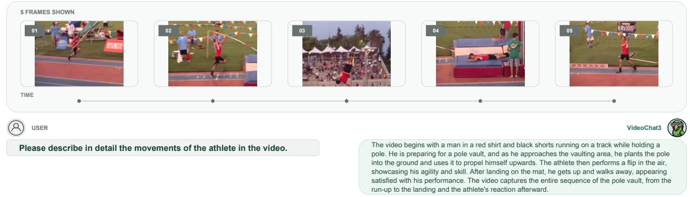  
Figure 10 Qualitative example of fine-grained video captioning. VideoChat3 describes the complete pole-vault sequence, covering the run-up, pole planting, takeof, bar clearance, and landing.

Long-video understanding  
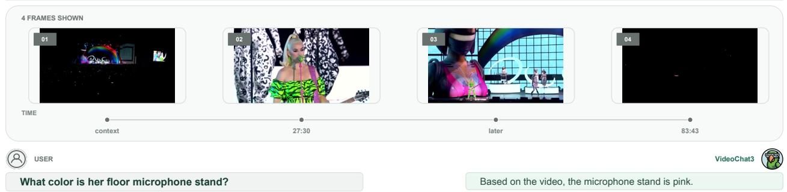

Figure 11 Qualitative example of long-video question answering. VideoChat3 retrieves a specific visual detail from an extended video and correctly identifies the color of the floor microphone stand.  
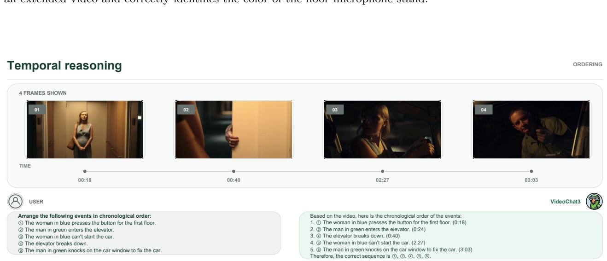  
Figure 12 Qualitative example of temporal video reasoning. VideoChat3 recognizes events distributed across the video and arranges them in chronological order.

Time-grounded dense caption  
Temporal video grounding  
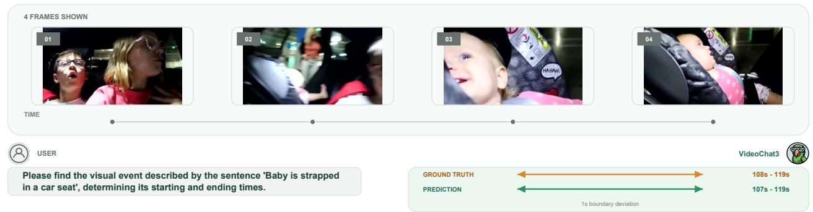  
Figure 13 Qualitative example of temporal video grounding. Given a language description, VideoChat3 accurately localizes the corresponding event, with only a minor boundary deviation from the ground-truth interval.

Streaming video understanding  
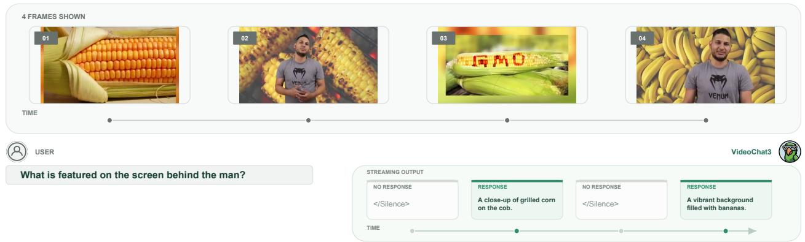  
Figure 14 Qualitative example of online proactive response. During streaming perception, VideoChat3 remains silent when relevant evidence is absent and produces timely responses once informative visual content appears.

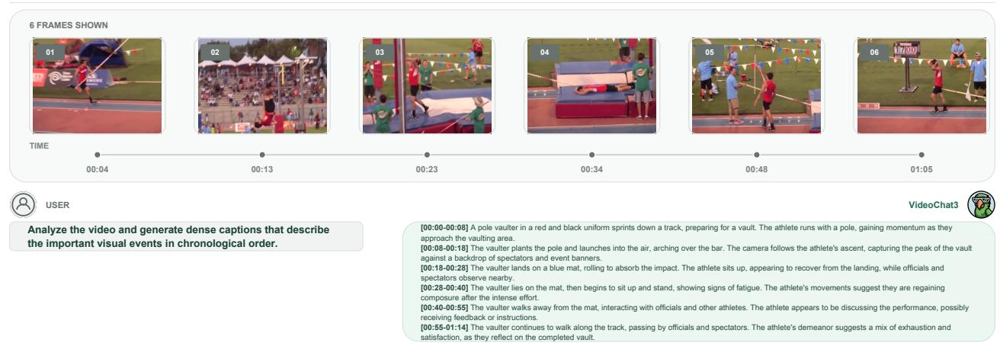  
Figure 15 Qualitative example of dense video captioning. VideoChat3 identifies multiple events throughout the video and generates temporally coherent descriptions that capture its evolving content.