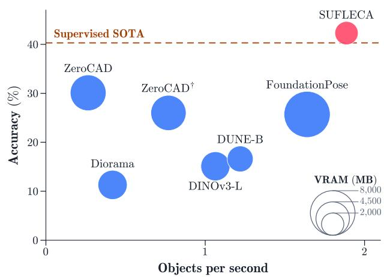
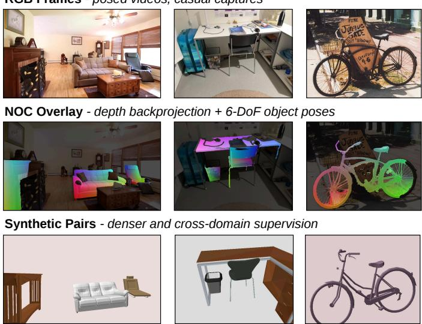
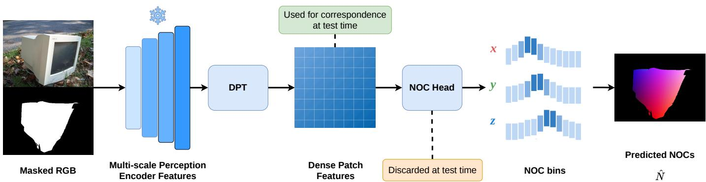
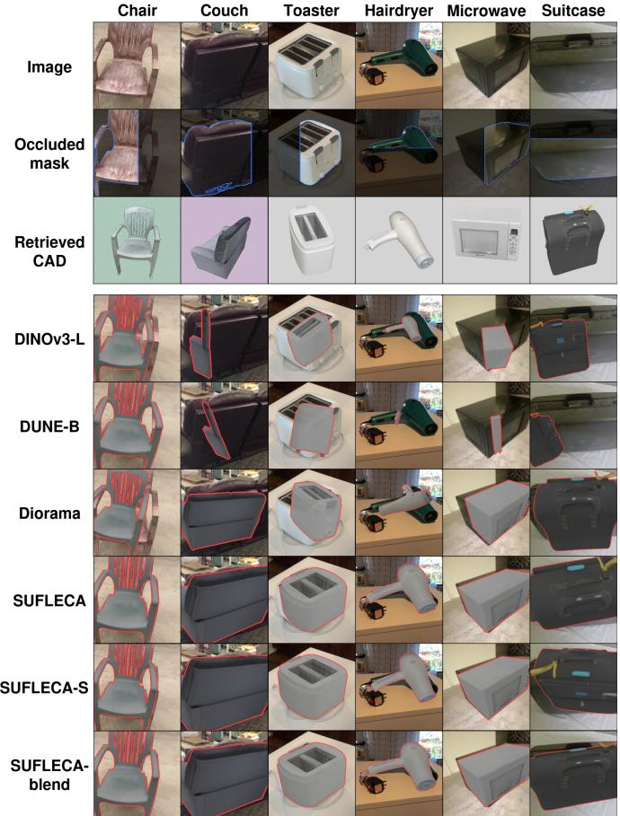

# SUFLECA: Scaling Up Feature Learning for CAD-to-image Alignment

Saad Ejaz1, Miguel Fernandez-Cortizas1, Javier Civera2, Holger Voos1, and Jose Luis Sanchez-Lopez1

Abstract—CAD-to-image alignment aims to estimate an object’s 9D pose (rotation, translation, and anisotropic scale) from a single RGB image, enabling applications in robotics and augmented reality. Recent zero-shot methods use visual foundation models to match image regions to CAD models, yet typically their correspondences are appearance-driven and degrade under occlusion or sim-to-real domain shift. To address these limitations, we introduce SUFLECA (Scaling Up Feature LEarning for CAD Alignment), a weakly-supervised framework for zero-shot CAD alignment with two key contributions. First, SUFLECA scales up geometry-grounded feature learning from pretrained visual representations through Normalized Object Coordinates (NOCs) supervision on 674K images spanning 12 real and synthetic datasets, learning compact geometry-aware features that generalize across domains. Second, we propose a geometrically consistent matching algorithm that establishes reliable one-to-one CAD-to-image correspondences. Together, these contributions enable accurate, sub-second alignment per object instance without iterative pose refinement. On ScanNet25k, SUFLECA achieves 33.4%/42.3% category/instance accuracy, outperforming, with a smaller computational footprint, the strongest zero-shot baseline by 10.3/12.2 percentage points and, for the first time on this benchmark, even surpassing fully supervised methods. Code is available at: https://github.com/snt-arg/SUFLECA

## I. INTRODUCTION

Recovering the 3D pose and shape of objects from images is a fundamental challenge in computer vision, with relevant applications in robotic perception [3] and manipulation [4]. A practical pipeline typically first retrieves a CAD model that approximately matches the target object, and then estimates a 9D alignment (rotation, translation, and anisotropic scale) to register it to the image observation [1], [2]. The alignment step is typically solved by establishing correspondences between the CAD model and the observed image, followed by robust pose estimation from the resulting matches.

Early works cast this as a supervised learning problem, using end-to-end [1], [5] or render-and-compare [6], [7] training setups, which lack generalization to out-of-distribution images and require costly pose-annotated data. Advances in foundation models for visual perception have enabled zero-shot

  
Fig. 1: Accuracy, runtime, and GPU memory comparison of zero-shot CAD-to-image alignment methods on the Scan-Net25k validation split [1]. ZeroCAD† denotes ZeroCAD [2] without iterative pose refinement. SUFLECA achieves the highest accuracy, surpassing even supervised methods, while attaining the lowest runtime and smallest GPU memory footprint among zero-shot methods.

CAD alignment through pretrained backbones that produce high-dimensional features for correspondence estimation, improving generalization across categories and distributions [8], [9]. However, features from visual foundation models are primarily appearance-based and lack grounding in the 3D object geometries. This results in a domain gap, leading to suboptimal alignment accuracy.

Weak supervision via synthetic renders of CAD models has been used to align this feature space with the geometryfocused Normalized Object Coordinates (NOCs) [2], [10], yet models trained on synthetic and isolated data struggle to generalize to the clutter, occlusion, and appearance variation present in real scenes. Beyond training data, nearest-neighbor matching in high-dimensional semantic feature spaces, as used in existing works, is costly in both memory and computation and fails to exploit the rigid geometric structure of the problem. This produces noisy matches that often require expensive iterative refinement to recover accuracy.

In this paper we propose SUFLECA (Scaling Up Feature LEarning for CAD-to-image Alignment), which addresses these limitations through two key contributions. First, it scales NOC-supervised feature learning to a large mixture of real and synthetic datasets, substantially improving generalization. The resulting low-dimensional feature space reduces both matching cost and memory footprint, making it well suited for

Synthetic Pairs - denser and cross-domain supervision robotic applications. Second, we introduce a correspondence estimation algorithm that replaces conventional semantic-only nearest-neighbor matching with a method that enforces mutuality and geometric consistency. Together, these contributions enable zero-shot alignment accuracy that surpasses supervised methods while maintaining sub-second runtime, as shown in Figure 1.

## II. RELATED WORK

## A. Normalized Object Coordinates (NOCs)

NOCs [10] represent each object point in a category-level canonical coordinate frame, allowing pose estimation to be formulated as dense coordinate prediction followed by 3D registration. OmniNOCS [11] introduced large-scale NOC supervision for pose estimation, although it draws heavily from single-object datasets such as Objectron [12]. Vision backbones implicitly encode 3D-awareness [13], motivating the use of NOC supervision as an auxiliary signal on top of frozen features to shape a high-dimensional feature space for correspondence estimation [2]. However, this remains limited in coverage of occlusions and real-synthetic pairings, which are particularly important in CAD alignment, where a synthetic CAD model is aligned to a real object observation that may be affected from partial occlusion.

## B. Supervised CAD-to-image alignment

Supervised approaches to single-image CAD alignment span three paradigms. Direct regression methods predict 9D pose in a single feed-forward pass. Total3DUnderstanding [14] jointly regresses layout, boxes, and meshes; and Mask2CAD [5] couples detection with imageshape embeddings. Render-and-compare methods refine an initial CAD pose by minimising the difference between the rendered hypothesis and the input image. 3D-RCNN [15] pioneered this idea with differentiable rendering and CAD priors, while SPARC [6] and MultiObj-SPARC [7] achieve strong results through sparse transformer-based 9D pose updates. In contrast, indirect methods first estimate correspondences and then recover pose through registration. ROCA [1] regresses NOCs from images to establish such correspondences and is trained end-to-end. More recently, CosCAD [16] combines cross-modal CAD retrieval with pose alignment by integrating image, CAD, and text features in a shared representation space, improving retrieval and alignment under occlusion. However, all of these methods rely on direct pose supervision, which limits their scalability.

## C. Zero-shot CAD-to-image alignment

A parallel line of work aims to remove the dependence on pose-annotated training data. DiffCAD [17] trains cascaded diffusion models on synthetic data for scale, pose, and shape estimation, while SDFit [9] fits a morphable SDF through iterative render-and-compare optimization. However, both methods require per-category priors and are computationally expensive. Related category-level approaches [3], [18] aim to estimate optimal object pose and shape by progressively pruning outliers to recover the largest set of compatible measurements. Our correspondence filtering is inspired by this line of work, but these methods still rely on active shape models and keypoint detectors, which are difficult to obtain for most categories. Among other works, Diorama [8] uses an additional off-the-shelf model for scale inference and targets open-world scene-level layout, but its accuracy degrades in real-world scenes with occlusions. Recently, ZeroCAD [2] trains a NOCsupervised adapter over a frozen visual backbone for zeroshot 9D alignment. However, training exclusively on synthetic single-object scenes across nine categories leaves a substantial domain gap, and its simple nearest-neighbor matching admits many-to-one geometrically inconsistent correspondences.

RGB Frames - posed videos, casual captures  
  
Fig. 2: Example frames from the multi-dataset validation set. Top row: RGB images. Middle row: ground-truth NOC maps (provided or derived) overlaid on the RGB. Bottom row: synthetic counterparts generated from CAD annotations.

## III. SUFLECA

## A. Problem Definition

Given an RGB image, camera intrinsics, and a candidate CAD model retrieved from off-the-shelf methods, the goal is to estimate a 9D transformation from the CAD coordinate frame $\mathcal { X } _ { \mathrm { c a d } }$ to the camera coordinate frame ${ \mathcal { X } } _ { \mathrm { c a m } }$ , as follows:

$$
\mathcal {X} _ {\mathrm{cam}} = R S \mathcal {X} _ {\mathrm{cad}} + t,\tag{1}
$$

where $R \in S O ( 3 ) , S = \mathrm { d i a g } ( s _ { x } , s _ { y } , s _ { z } )$ is an axis-aligned anisotropic scale matrix, and $t \in \mathbb { R } ^ { 3 }$ . We extend this standard formulation and also output a score, $S _ { \mathrm { f i t } } \in \mathbb { R }$ , that measures the quality of the estimated alignment, which is useful for ranking alignments or multi-view aggregation.

## B. Overall CAD Fitting Pipeline

SUFLECA follows the standard indirect CAD alignment pipeline used in prior work [1], [2], [8], [9]. Given the input image, the pipeline first extracts an object mask and computes per-pixel descriptors. The same descriptors are also extracted for the candidate CAD model. Image-to-CAD correspondences are then established in feature space, lifted to 3D using monocular depth estimates, and passed to a RANSAC-based Procrustes solver to estimate the alignment in Equation (1). SUFLECA improves two key modules of this pipeline: the feature model, which is learned at scale and unified across real and synthetic data as described in Section III-C, and the correspondence estimation module, which adds geometric consistency as described in Section III-D. Throughout this paper, zero-shot refers specifically to the alignment stage: object detection and segmentation, depth estimation, and CAD retrieval are treated as upstream components inherited from prior work.

  
Fig. 3: Overview of the feature model architecture. Multi-scale features from a frozen perception encoder are fused and upsampled via a Dense Prediction Transformer (DPT), then decoded by a lightweight binned NOC head. This aligns the high dimensional DPT features to the NOC space while preserving their discriminative capacity for correspondence estimation.

<table><tr><td>RGB frames source</td><td>Annotation source</td><td>Number of frames</td><td>Avg. objects/frame</td></tr><tr><td>Pascal3D+ [19]</td><td>Included</td><td>6,108</td><td>1.00</td></tr><tr><td>Objectron [12]</td><td>OmniNOCS [11]</td><td>7,357</td><td>1.20</td></tr><tr><td>ARKitScenes [20]</td><td>OmniNOCS [11]</td><td>52,146</td><td>3.55</td></tr><tr><td>REAL275 [10]</td><td>Included</td><td>7,072</td><td>5.00</td></tr><tr><td>RealEstate10K [21]</td><td>CAD-Estate [22]</td><td>127,214</td><td>2.16</td></tr><tr><td>ScanNet [23]</td><td>Scannotate [24]</td><td>117,284</td><td>2.58</td></tr><tr><td>ScanNet++ [25]</td><td>Scannotate++ [24]</td><td>88,198</td><td>2.96</td></tr><tr><td>Pix3D [26]</td><td>Included</td><td>11,622</td><td>1.00</td></tr><tr><td>ObjectNet3D [27]</td><td>Included</td><td>20,520</td><td>1.00</td></tr><tr><td>3D-Front [28]</td><td>Rendering</td><td>69,578</td><td>6.43</td></tr><tr><td>Hypersim [29]</td><td>OmniNOCS [11]</td><td>44,545</td><td>13.55</td></tr><tr><td>ShapeNet [30]</td><td>Rendering</td><td>123,207</td><td>1.00</td></tr><tr><td colspan="2">Overall</td><td>674,851</td><td>3.38</td></tr></table>

TABLE I: Datasets used for training the feature model. Datasets above the horizontal line are real-world; those below are synthetic. Notably, the ScanNet [23] dataset is omitted from training when evaluating on ScanNet25K [1] to have a strict zero-shot setting, leading to a reduced count of 557, 567 frames at 3.55 annotated objects per frame.

## C. Scaling Unified NOC-aligned Feature Learning

Multi-Dataset Setup We adopt a scaling paradigm similar to [11], focused primarily on the indoor domain and augmented with synthetic data. Since correspondence for CAD alignment occurs between a real image and a synthetic CAD render, we augment, wherever CAD annotations are available, each real image with a synthetic counterpart in which the CAD objects are rendered at approximately the same pose. The synthetic counterparts are rendered with randomized backgrounds and object textures, with some objects occasionally replaced by visually similar ones. This yields a larger and more balanced training set with comparable numbers of real and synthetic samples, sharing similar occlusion patterns and scene context, which encourages the model to learn domaininvariant features. Compared with [2], which trains on 300K synthetic images of single objects across 9 categories, our dataset comprises 674K images from 12 datasets (see Table I) with an average of 3.38 annotated objects per frame across a broader range of categories, providing denser and more diverse supervision. Furthermore, while most datasets we train on originate from SLAM-focused camera trajectories, the inclusion of casual imagery [19], [26], [27] further broadens the data distribution.

NOC Derivation and Verification Most datasets do not provide NOC maps directly, but instead supply object poses in 3D from which NOCs must be derived. To this end, we render the ground-truth object onto the image to obtain an approximate bounding box, from which a mask is extracted using SAM2 [31]. The masked region is then backprojected into 3D using available depth maps or a monocular metric depth estimator [32], after which NOCs are computed following [11] (see the middle row in Figure 2). To ensure annotation quality, we verify the computed NOCs against the overlaid CAD NOCs and reject object instances whose mean error exceeds a threshold. Frames for which the total number of valid NOC pixels falls below a threshold are discarded entirely. For datasets derived from high frame-rate cameras [21], [23], [25], we subsample frames at regular intervals and additionally enforce a minimum camera pose displacement to ensure sufficient viewpoint diversity.

Model Architecture As shown in Figure 3, our model builds upon a pretrained perception encoder, kept frozen during training, that provides rich patch-level features from images. These patch features are upsampled using a Dense Prediction Transformer (DPT) [33], which fuses multi-scale outputs from different layers of the encoder to produce denser feature maps of dimension dim. The DPT features are decoded by a lightweight NOC head: a binned classifier [10], [11] that partitions each coordinate axis $( x , \ y , \ z )$ of the NOC space into m uniform bins, estimating value as the expectation over the bin probabilities. This supervision encourages the DPT features to be spatially smooth and geometrically meaningful. The training loss comprises a categorical cross-entropy term between the predicted bin probabilities and the ground-truth bin, and an $\ell _ { 1 }$ regression term on the expected NOC,

$$
\mathcal {L} _ {\mathrm{NOC}} = \mathcal {L} _ {\mathrm{CE}} + \lambda \| \hat {\mathcal {N}} - \mathcal {N} \| _ {1},\tag{2}
$$

where $\mathcal { L } _ { \mathrm { C E } }$ is the cross-entropy loss, $\hat { \mathcal { N } }$ is the predicted NOC value, $\mathcal { N }$ is the ground-truth NOC value, and λ is a weighting coefficient. The NOC head is discarded at test time, and the ℓ2-normalized DPT features are used as descriptors for correspondence estimation in SUFLECA. Optionally, these features can be concatenated with the output layer features of the vision backbone, following [2], to mitigate forgetting caused by weak supervision over a limited set of categories. We refer to this variant as SUFLECA-blend.

## D. Geometrically-consistent Correspondence Estimation

To align a CAD model $C$ to a masked image I, we start by featurizing the image using the aforementioned feature model $\mathcal { M } ,$ , yielding per-patch features interpolated to pixel level, $\mathcal { F } _ { I } ~ = ~ \mathcal { M } ( I )$ Unlike prior works that aggregate 2D features across multiple renders of $C$ to obtain 3D features over a mesh [2], [9], a process that is both arbitrary and lossy, we keep the matching task entirely within the 2D domain. To this end, we maintain a small set of $n$ pre-rendered views of $C$ with precomputed features and point maps. Perception encoders have been shown to encode global pose information in an image [8], which we exploit to select the closest render to the query image prior to estimating correspondences. For that, we start by using a monocular metric depth estimator [32] to lift the masked image pixels into a 3D point cloud $\mathcal { Q } _ { i } ,$ and apply Farthest Point Sampling (FPS) to obtain a representative subset $\hat { \mathcal { Q } } _ { i } \subset \mathcal { Q } _ { i }$ of $N$ points for correspondence estimation. Then, given the set of pre-rendered views $\nu _ { C }$ from distinct fixed viewpoints, we select the view $V ^ { * }$ that maximises the mean nearest-neighbor cosine similarity over $\hat { \mathcal { Q } } _ { i }$

$$
V ^ {*} = \underset {V \in \mathcal {V} _ {C}} {\mathrm{argmax}} \frac {1}{| \hat {\mathcal {Q}} _ {i} |} \sum_ {q \in \hat {\mathcal {Q}} _ {i}} \underset {p \in V} {\mathrm{max}} \mathcal {F} _ {I} (q) ^ {\top} \mathcal {F} _ {V} (p),\tag{3}
$$

where $\mathcal { F } _ { V } ( p )$ is the precomputed feature at pixel p of view $V$ and $\mathcal { F } _ { I } ( q )$ is the feature at pixel $q$ in $I .$

Using the selected render feature map ${ \mathcal { F } } _ { V ^ { * } }$ ∗ and image feature map $\mathcal { F } _ { I }$ , we need to estimate correspondences between the lifted render and observed object pixels. While nearestneighbor matching suffices for the aforementioned coarse view selection, it is unreliable for correspondence estimation, as it produces geometrically inconsistent and many-to-one matches. Mutual nearest-neighbor matching reduces these ambiguities but is overly conservative. We therefore adopt mutual knearest-neighbors matching, retaining a correspondence only when the render and image descriptors lie within each other’s top-k neighbors, with duplicates resolved by greedy assignment to the highest-scoring source match. However, this only considers the semantic feature space and does not enforce geometric consistency; and since the transformation includes anisotropic scaling, pairwise distance preservation is not directly applicable. Therefore, we first estimate an approximate scale to normalize the correspondence set before applying pairwise distance preservation. Concretely, let $\{ ( \mathbf { p } _ { i } , \mathbf { q } _ { i } ) \} _ { i = 1 } ^ { M }$ be a set of putative correspondences, where $\mathbf { p } _ { i } ~ \in ~ \mathbb { R } ^ { 3 }$ are source points from $V ^ { * }$ and $\mathbf { q } _ { i } \in \mathbb { R } ^ { 3 }$ are target points from I. We seek a boolean inlier mask $\mathbf { m } \in \{ 0 , 1 \} ^ { \bar { M } }$ that retains correspondences geometrically consistent with the unknown 9D transformation. Denoting by $\mathbf { s } ^ { 2 } = ( s _ { x } ^ { 2 } , s _ { y } ^ { 2 } , s _ { z } ^ { 2 } ) ^ { \top }$ the squared anisotropic scale vector, we obtain the following from pairwise differences,

$$
\begin{array}{r} \| \mathbf {q} _ {i} - \mathbf {q} _ {j} \| ^ {2} = \pmb {\Delta} _ {i j} ^ {\top} \mathrm{diag} (\mathbf {s} ^ {2}) \pmb {\Delta} _ {i j} = (\mathbf {s} ^ {2}) ^ {\top} (\pmb {\Delta} _ {i j} \odot \pmb {\Delta} _ {i j}) \\ \pmb {\Delta} _ {i j} = \mathbf {p} _ {i} - \mathbf {p} _ {j}, \end{array}\tag{4}
$$

which yields a linear system in $\mathbf { s } ^ { 2 }$ ,

$$
\phi_ {i j} = \mathbf {f} _ {i j} ^ {\top} \mathbf {s} ^ {2}, \mathbf {f} _ {i j} = \frac {\pmb {\Delta} _ {i j} \odot \pmb {\Delta} _ {i j}}{\| \pmb {\Delta} _ {i j} \| ^ {2}}, \phi_ {i j} = \frac {\| \mathbf {q} _ {i} - \mathbf {q} _ {j} \| ^ {2}}{\| \pmb {\Delta} _ {i j} \| ^ {2}}.\tag{5}
$$

Solving this system in the presence of outliers requires robust initialisation. To this end, we obtain an isotropic scale estimate by computing the per-pair isotropic log-scale $\psi _ { i j } = { \textstyle { \frac { 1 } { 2 } } } \log { \phi _ { i j } }$ over all $\binom { M } { 2 }$ pairs and taking the histogram mode, assuming that inlier pairs coarsely concentrate in a common bin. This gives the isotropic log-scale $\hat { \ell } _ { \mathrm { i s o } } = \mathrm { m o d e } \{ \psi _ { i j } \}$ , from which we initialise $\hat { \textbf { s } } ^ { 2 } = \exp ( 2 \hat { \ell } _ { \mathrm { i s o } } ) \cdot \textbf { 1 }$ . From this, we refine the anisotropic log-scales $\hat { \ell }$ via Iteratively Reweighted Least Squares (IRLS). Since this estimate degrades when correspondences do not cover all axes sufficiently, we shrink towards the more robust isotropic estimate, leading to

$$
\tilde {\boldsymbol {\ell}} = \alpha \hat {\boldsymbol {\ell}} + (1 - \alpha) \hat {\ell} _ {\mathrm{iso}} \mathbf {1}, \quad \tilde {\mathbf {s}} ^ {2} = \exp (2 \tilde {\boldsymbol {\ell}}),\tag{6}
$$

where $\alpha \in [ 0 , 1 ]$ controls the trust placed in the anisotropic estimate. We then build a consensus matrix $\mathbf { G } \in \{ 0 , 1 \} ^ { M \times M }$ whose entries compare the observed squared distance against the value predicted by $\tilde { \mathbf { s } } ^ { 2 }$

$$
\begin{array}{l} G _ {i j} = \mathbf {1} \left[ \left| \frac {\| \mathbf {q} _ {i} - \mathbf {q} _ {j} \| ^ {2} - \tilde {d} _ {i j} ^ {2}}{\tilde {d} _ {i j} ^ {2}} \right| <   \beta \right], G _ {i i} = 0, \\ \tilde {d} _ {i j} ^ {2} = (\tilde {\mathbf {s}} ^ {2}) ^ {\top} (\boldsymbol {\Delta} _ {i j} \odot \boldsymbol {\Delta} _ {i j}), \end{array}\tag{7}
$$

where $\beta > 0$ is the relative inlier threshold. The principal eigenvector e of G scores each correspondence by its consistency with the inlier group, following which correspondences are retained by,

$$
\mathbf {m} = \mathbf {1} [ \mathbf {e} \geq \delta \cdot \max (\mathbf {e}) ],\tag{8}
$$

where $\delta \in ( 0 , 1 ]$ is the relative gating threshold. The m-masked set with cardinality Mˆ is passed to a spacepartitioning RANSAC [34] that uses Procrustes registration under anisotropic scaling to recover the final alignment.

Alignment quality Unlike prior works [1], [2], which use the CAD retrieval score as a proxy for alignment quality, SUFLECA estimates $S _ { \mathrm { { f i t } } }$ from the registration residuals, providing a more principled measure of alignment quality. The information matrix $\pmb { \Lambda } \in \mathbb { R } ^ { 9 \times 9 }$ is computed analytically from the Jacobians of the registration residuals with respect to the parameter vector $\mathbf { x } ~ = ~ \left[ \delta \pmb { \theta } , \delta \mathbf { t } , \delta \mathbf { s } \right]$ , where δθ is a left rotation perturbation, δt is an additive translation, and $\delta \mathbf { s }$ is an additive perturbation on the diagonal scale. The residual for each correspondence i is $\mathbf { r } _ { i } = \mathbf { q } _ { i } - R S \mathbf { p } _ { i } - t .$ , with percorrespondence Jacobian,

$$
\mathbf {J} _ {i} = \left[ \begin{array}{c c c} [ \mathbf {u} _ {i} ] _ {\times} & - \mathbf {I} _ {3} & - R \operatorname{diag} (\mathbf {p} _ {i}) \end{array} \right] \in \mathbb {R} ^ {3 \times 9},\tag{9}
$$

where $\mathbf { u } _ { i } = R S \mathbf { p } _ { i }$ is the rotated and scaled source point and $[ \cdot ] _ { \times }$ denotes the skew-symmetric cross-product matrix. The information matrix is then

$$
\mathbf {\Lambda} = \frac {1}{\sigma^ {2}} \sum_ {i} \mathbf {J} _ {i} ^ {\top} \mathbf {J} _ {i}, \quad \sigma^ {2} = \frac {\sum_ {i} \| \mathbf {r} _ {i} \| ^ {2}}{3 \hat {M} - 9},\tag{10}
$$

from which the alignment quality score is $S _ { \mathrm { f i t } } = \log \operatorname* { d e t } ( \pmb { \Lambda } )$

## IV. EVALUATION

## A. Implementation Details

Our feature model uses DUNE-B [13] as the frozen perception encoder and produces DPT patch features with dim = 384. These are fed to the NOC head, which consists of two shallow convolutional layers and classifies each coordinate into m = 64 bins. We train for 50 epochs using AdamW with $\lambda = 0 . 3 3$ and a learning rate of $1 . 1 \times 1 0 ^ { - 4 }$ . We also train a smaller variant, SUFLECA-S, which uses DUNE-S [13] as the encoder with dim = 256 and m = 50. For alignment, we maintain n = 6 pre-rendered fixed views per CAD model, and set $N = 5 1 2 , k = 1 3 , M = 2 5 6 , \alpha = 0 . 5 , \beta = 0 . 0 1$ and δ = 0.05. All hyperparameters are empirically determined and remain consistent across all experiments, conducted on a workstation with an NVIDIA RTX 5090 GPU.

## B. Methodology

We evaluate SUFLECA across complementary settings. ScanNet25k [1] serves as the main benchmark for alignment accuracy, while CO3D [38] is adapted to assess generalization to categories not observed during weak supervision (Section IV-D). We further include ablation studies to isolate the contributions of our design choices (Section IV-E), analyze robustness to inexactly retrieved CAD models (Section IV-F), and perform an efficiency analysis (Section IV-G). While our comparisons primarily focus on zero-shot methods, we also include results from supervised methods on ScanNet25k for reference. We also report results with the smaller SUFLECA-S variant (from Section IV-A) and the SUFLECA-blend variant (from Section III-C) of our method.

## C. Datasets

ScanNet25k [1] are a dataset of images derived from the ScanNet [23] dataset with Scan2CAD annotations [39]. An alignment on this dataset is considered correct when translation, rotation, and scale errors are below 20 cm, 20◦, and 20%, respectively. We report both category- and instanceaveraged accuracy over the nine categories on the validation split. We follow the NMS-based evaluation protocol [35], ranking detections by the product of the ROCA semantic retrieval score [1] and $S _ { \mathrm { { f i t } } }$ defined in Equation (10). To ensure zero-shot evaluation, we exclude all ScanNet-derived images during weak supervision for this dataset. Following [2], all methods use ROCA bounding boxes and CAD retrievals [1], SAM2 masks [31], and depth from a monocular metric depth estimator [32] fine-tuned on the ScanNet25k training split.

The DiffCAD split [17] covers six of the ScanNet25k object categories, evaluated without NMS and using non-fine-tuned depth. This split was introduced by DiffCAD [17], whose priors are available only for six categories.

CO3D [38] is an object-centric dataset that we adapt for the inexact CAD fitting setting. We convert its COLMAP point clouds to metric scale by selecting the depth scale with the lowest error against monocular depth estimates. We also simulate occlusions by placing a rectangular occluder within the GroundedSAM [40] bounding box. For CAD retrieval, we use SAM3D [41] to generate category-level CAD pools and retrieve candidates with OSCAR [42]. We restrict the categories to two domains: seen categories (chair, couch), which appear during weak supervision of SUFLECA, and unseen categories (toaster, hairdryer, microwave, suitcase), which are used to evaluate generalization performance. We sample 100 frames per category across 208 objects. Since CO3D lacks ground-truth poses and SAM3D meshes have inconsistent canonical orientations, we report 3D-IoU, ICP-Rot, ADD-S, and ADD-S@0.1 [41] for comparison.

## D. Results

Table II reports alignment accuracy on ScanNet25k and the respective DiffCAD split. Among zero-shot methods, SUFLECA achieves 33.4% category-averaged and 42.3% instance-averaged accuracy using the NMS protocol, surpassing ZeroCAD [2] by 10.3 and 12.2 percentage points respectively, and outperforming FoundationPose [37] by a larger margin. This can be attributed to two factors: broader and more diverse NOC-supervised training data, which reduces the domain gap to real images, and our correspondence estimation, which produces geometrically consistent matches. Notably, SUFLECA also surpasses fully supervised methods, achieving the best or second-best accuracy across seven of the nine categories and outperforming MultiObj-SPARC [7] despite the latter being trained with 9D pose supervision on ScanNet. On the DiffCAD split, competing zero-shot methods perform poorly because alignment errors are not suppressed through NMS. In contrast, SUFLECA more than doubles the performance of ZeroCAD [2], achieving gains of 20.2 and 23.9 percentage points in category- and instance-averaged accuracy, respectively. Moreover, SUFLECA even outperforms the oracle variant of DiffCAD [17], which uses groundtruth pose to select the best result from eight hypotheses. Notably, the other SUFLECA variants also achieve competitive performance, outperforming competing zero-shot methods by a large margin and remaining comparable to supervised methods. SUFLECA-S attains lower overall accuracy than the base model, but still substantially outperforms other zeroshot methods, highlighting the effectiveness of its compact feature space. SUFLECA-blend performs on par with, or slightly below, SUFLECA, since the added DUNE-B features primarily improve generalization, which is less critical for the common object categories in ScanNet25k.

<table><tr><td rowspan="2">Method</td><td rowspan="2">Sup.</td><td colspan="9">Category-specific accuracy (%)</td><td colspan="2">Average (%)</td></tr><tr><td>bathtub</td><td>bed</td><td>bin</td><td>bkshlf</td><td>cabinet</td><td>chair</td><td>display</td><td>sofa</td><td>table</td><td>cat.</td><td>inst.</td></tr><tr><td colspan="13">ScanNet25k [23] - Vid2CAD [35] NMS Protocol</td></tr><tr><td>ROCA [1]</td><td>✓</td><td>20.8</td><td>8.6</td><td>26.3</td><td>9.0</td><td>13.1</td><td>39.9</td><td>24.6</td><td>10.6</td><td>12.7</td><td>18.4</td><td>25.0</td></tr><tr><td>SPARC [6]</td><td>✓</td><td>25.8</td><td>25.7</td><td>24.6</td><td>14.2</td><td>20.8</td><td>51.5</td><td>17.8</td><td>28.3</td><td>15.4</td><td>24.9</td><td>31.8</td></tr><tr><td>MultiObj-SPARC [7]</td><td>✓</td><td>25.8</td><td>34.3</td><td>44.8</td><td>17.0</td><td>19.2</td><td>64.8</td><td>5.8</td><td>35.4</td><td>25.5</td><td>30.3</td><td>40.3</td></tr><tr><td>CosCAD [16]</td><td>✓</td><td>24.9</td><td>18.9</td><td>31.1</td><td>20.8</td><td>33.1</td><td>45.4</td><td>27.5</td><td>19.9</td><td>24.6</td><td>27.4</td><td>33.2</td></tr><tr><td>DINOv3-L [36]</td><td>-</td><td>7.5</td><td>7.1</td><td>6.5</td><td>4.7</td><td>6.5</td><td>24.7</td><td>11.0</td><td>29.2</td><td>8.7</td><td>11.8</td><td>15.1</td></tr><tr><td>DUNE-B [13]</td><td>-</td><td>6.7</td><td>2.9</td><td>8.6</td><td>2.4</td><td>6.9</td><td>28.6</td><td>12.6</td><td>23.9</td><td>10.1</td><td>11.4</td><td>16.6</td></tr><tr><td>Diorama [8]</td><td>-</td><td>6.7</td><td>1.4</td><td>19.8</td><td>3.8</td><td>4.2</td><td>16.7</td><td>11.5</td><td>9.0</td><td>6.0</td><td>8.7</td><td>11.3</td></tr><tr><td>FoundationPose (9D) [2], [37]</td><td>*</td><td>20.0</td><td>22.9</td><td>27.6</td><td>0.9</td><td>3.1</td><td>41.8</td><td>23.6</td><td>15.0</td><td>17.5</td><td>19.2</td><td>25.7</td></tr><tr><td>ZeroCAD (w/o refine) [2]</td><td>*</td><td>16.7</td><td>10.0</td><td>10.8</td><td>15.1</td><td>7.3</td><td>46.8</td><td>16.2</td><td>31.0</td><td>10.7</td><td>18.3</td><td>26.0</td></tr><tr><td>ZeroCAD [2]</td><td>*</td><td>16.7</td><td>18.6</td><td>22.8</td><td>12.7</td><td>9.2</td><td>49.3</td><td>24.1</td><td>38.1</td><td>16.5</td><td>23.1</td><td>30.1</td></tr><tr><td>SUFLECA (Ours)</td><td>*</td><td>23.3</td><td>38.6</td><td>27.6</td><td>18.9</td><td>24.6</td><td>64.4</td><td>31.4</td><td>40.7</td><td>30.7</td><td>33.4</td><td>42.3</td></tr><tr><td>SUFLECA-S (Ours)</td><td>*</td><td>21.7</td><td>28.6</td><td>30.2</td><td>20.3</td><td>22.7</td><td>60.5</td><td>22.0</td><td>41.6</td><td>28.1</td><td>30.6</td><td>39.5</td></tr><tr><td>SUFLECA-blend (Ours)</td><td>*</td><td>22.5</td><td>24.3</td><td>28.5</td><td>18.9</td><td>22.7</td><td>59.4</td><td>24.1</td><td>44.3</td><td>25.5</td><td>30.0</td><td>38.5</td></tr><tr><td colspan="13">DiffCAD [17] Split</td></tr><tr><td>DiffCAD (GT) [17]</td><td>*</td><td>-</td><td>27.1</td><td>-</td><td>24.4</td><td>33.0</td><td>65.9</td><td>-</td><td>46.3</td><td>18.3</td><td>35.8</td><td>41.9</td></tr><tr><td>DINOv3-L [36]</td><td>-</td><td>-</td><td>5.2</td><td>-</td><td>9.2</td><td>12.5</td><td>25.1</td><td>-</td><td>23.8</td><td>5.9</td><td>13.6</td><td>16.0</td></tr><tr><td>DUNE-B [13]</td><td>-</td><td>-</td><td>3.2</td><td>-</td><td>9.2</td><td>13.1</td><td>26.0</td><td>-</td><td>23.4</td><td>8.7</td><td>14.0</td><td>17.0</td></tr><tr><td>Diorama [8]</td><td>-</td><td>-</td><td>0.7</td><td>-</td><td>5.4</td><td>13.1</td><td>33.5</td><td>-</td><td>6.5</td><td>12.2</td><td>11.9</td><td>18.4</td></tr><tr><td>DiffCAD [17]</td><td>*</td><td>-</td><td>7.7</td><td>-</td><td>7.6</td><td>10.4</td><td>31.1</td><td>-</td><td>15.3</td><td>4.3</td><td>12.7</td><td>16.7</td></tr><tr><td>ZeroCAD [2]</td><td>*</td><td>-</td><td>2.8</td><td>-</td><td>8.2</td><td>12.0</td><td>41.3</td><td>-</td><td>21.4</td><td>9.8</td><td>15.9</td><td>20.9</td></tr><tr><td>SUFLECA (Ours)</td><td>*</td><td>-</td><td>23.2</td><td>-</td><td>21.7</td><td>34.3</td><td>71.1</td><td>-</td><td>41.4</td><td>24.9</td><td>36.1</td><td>44.8</td></tr><tr><td>SUFLECA-S (Ours)</td><td>*</td><td>-</td><td>20.0</td><td>-</td><td>23.9</td><td>29.6</td><td>67.6</td><td>-</td><td>38.7</td><td>21.8</td><td>33.6</td><td>41.7</td></tr><tr><td>SUFLECA-blend (Ours)</td><td>*</td><td>-</td><td>23.9</td><td>-</td><td>22.8</td><td>35.4</td><td>71.1</td><td>-</td><td>42.2</td><td>24.1</td><td>36.6</td><td>44.9</td></tr></table>

TABLE II: Evaluation on ScanNet25k NMS and DiffCAD split. We report per-category and per-instance average accuracies for 20 cm/20◦/20% thresholds. ✓ denotes full supervision; \* denotes weak supervision; and – stands for unsupervised methods. Both \* and – operate in the zero-shot setting. Bold and shaded indicate best and second-best results respectively.

<table><tr><td rowspan="2">Method</td><td colspan="4">Seen categories (CAD retrieval accuracy: 77.5%)</td><td colspan="4">Unseen categories (CAD retrieval accuracy: 52.5%)</td></tr><tr><td>3D-IoU ↑</td><td>ICP-Rot ↓</td><td>ADD-S ↓</td><td>ADD-S@0.1↑</td><td>3D-IoU ↑</td><td>ICP-Rot ↓</td><td>ADD-S ↓</td><td>ADD-S@0.1↑</td></tr><tr><td>DINOv3-L [36]</td><td>36.21</td><td>27.32</td><td>6.54</td><td>71.50</td><td>8.77</td><td>40.44</td><td>10.31</td><td>46.50</td></tr><tr><td>DUNE-B [13]</td><td>23.40</td><td>35.81</td><td>8.48</td><td>63.50</td><td>4.46</td><td>44.44</td><td>11.84</td><td>34.50</td></tr><tr><td>Diorama [8]</td><td>39.41</td><td>21.06</td><td>5.79</td><td>82.00</td><td>39.12</td><td>14.54</td><td>6.33</td><td>81.50</td></tr><tr><td>SUFLECA (Ours)</td><td>62.63</td><td>10.24</td><td>3.80</td><td>84.00</td><td>48.89</td><td>16.64</td><td>5.86</td><td>78.75</td></tr><tr><td>SUFLECA-S (Ours)</td><td>62.50</td><td>10.31</td><td>3.71</td><td>85.50</td><td>46.42</td><td>16.44</td><td>6.49</td><td>74.00</td></tr><tr><td>SUFLECA-blend (Ours)</td><td>62.71</td><td>10.86</td><td>3.77</td><td>86.00</td><td>49.50</td><td>12.93</td><td>5.56</td><td>81.25</td></tr></table>

TABLE III: Evaluation on selected CO3D [38] sequences (600 images). For each category, we first compute the median metric across all instances and then report the mean of these per-category medians. Seen categories include chair and couch, while unseen categories include toaster, hairdryer, microwave, and suitcase. 3D-IoU is in percentage, ICP-Rot is reported in degrees, ADD-S is unitless and scaled by 100, and ADD-S@0.1 is in percentage.

On CO3D, results are obtained under occluded masks and inexact retrieved CADs, posing significant front–back and left– right geometric ambiguities, as shown in Figure 4. SUFLECA grounds objects in 3D substantially better than competing methods in this challenging setting, with its features more effectively able to disambiguate such cases. In seen categories, all variants of SUFLECA perform comparably and outperform competing methods, highlighting the effectiveness of our weak supervision. For unseen categories, SUFLECA-blend generally outperforms other methods, as it compensates for the limited supervision coverage for uncommon objects at the cost of a larger feature representation.

## E. Ablation Study

We ablate the main design choices, and report alignment accuracy on ScanNet25k (NMS protocol) in Table IV.

Training data This ablation evaluates the impact of including in-distribution training data. Training on the complete collected dataset, including ScanNet-derived images, improves performance from 33.4/42.3 to 34.4/42.8. This modest gain of only 1.0/0.5 percentage points suggests that SUFLECA benefits from additional data, but it already learns strong features without in-distribution images.

Correspondence estimation We also ablate the correspondence estimation strategy. Using nearest-neighbor matching alone yields the largest drop, reducing accuracy to 26.3/34.2. Adding mutual consistency improves over nearest-neighbor matching to 30.7/39.4, but still remains below the full model. Using mutual k-nearest-neighbors matching further improves performance to 32.0/41.0, but still underperforms the full pipeline that applies geometric consistency. These results show that both mutual matching and geometric consensus are important for accurate alignment.

  
Fig. 4: Qualitative comparison of zero-shot methods in aligning an inexact retrieved CAD on masked images from CO3D. The top grid is the input to all methods.

NMS scoring We further evaluate the score used to rank alignments during NMS. Replacing our combined score based on $S _ { \mathrm { { f i t } } }$ with the ROCA retrieval score reduces accuracy from 33.4/42.3 to 30.4/39.3. This drop of 3.0/3.0 percentage points shows that semantic retrieval confidence alone is not a reliable proxy for alignment quality. We also note that the render-selection score from Equation (3) performs even worse, reducing accuracy to 29.2/38.8, since it is coarse and hence sensitive to the choice of render viewpoints.

## F. Robustness to Inexact CADs

We further analyze how alignment accuracy depends on the quality of the retrieved CAD model. As shown in Table V, replacing ground-truth Scan2CAD annotations [39] with zeroshot retrieval using GroundedSAM [40] w/ OSCAR [42] leads to a gap of more than 20 percentage points in both categoryand instance-averaged alignment accuracy. This is primarily due to the low instance retrieval accuracy of 3.8% (most retrieved CADs are inexact), resulting from heavy occlusion, appearance differences, and annotation bias. This indicates that zero-shot CAD retrieval from real-world observations remains an open problem and a key bottleneck for a fully zero-shot CAD fitting pipeline. Nevertheless, as we move from the ground-truth oracle to supervised ROCA [1] and then to fully zero-shot retrieval, the drop in instance retrieval accuracy is much steeper than the corresponding drop in alignment accuracy, suggesting that SUFLECA is moderately robust to CAD inexactness.

<table><tr><td>Variant</td><td>cat.</td><td>inst.</td></tr><tr><td>SUFLECA (Ours)</td><td>33.4</td><td>42.3</td></tr><tr><td colspan="3">Training data</td></tr><tr><td>ScanNet included during training</td><td>34.4↑</td><td>42.8↑</td></tr><tr><td colspan="3">Correspondence estimation</td></tr><tr><td>Nearest neighbor [1], [2]</td><td>26.3↓</td><td>34.2↓</td></tr><tr><td>Mutual nearest-neighbor</td><td>30.7↓</td><td>39.4↓</td></tr><tr><td>Mutual k-nearest-neighbors w/o filtering</td><td>32.0↓</td><td>41.0↓</td></tr><tr><td colspan="3">NMS scoring</td></tr><tr><td>ROCA retrieval score [1]</td><td>30.4↓</td><td>39.3↓</td></tr><tr><td>Render selection score – Equation (3)</td><td>29.2↓</td><td>38.8↓</td></tr></table>

TABLE IV: Ablation study on ScanNet25k, isolating one component per group while keeping the rest fixed.

<table><tr><td rowspan="2">Detection and retrieval</td><td rowspan="2">Retrieval acc.</td><td colspan="2">Alignment acc.</td></tr><tr><td>cat.</td><td>inst.</td></tr><tr><td>Scan2CAD annotations (GT) [39]</td><td>100.0</td><td>43.0</td><td>54.2</td></tr><tr><td>ROCA [1]</td><td>34.3</td><td>33.4</td><td>42.3</td></tr><tr><td>GroundedSAM [40] w/ OSCAR [42]</td><td>3.8</td><td>22.5</td><td>33.1</td></tr></table>

TABLE V: Effect of CAD retrieval accuracy on alignment on ScanNet25k. ROCA is supervised on the dataset, and GroundedSAM w/ OSCAR is the zero-shot retrieval mode.

## G. Efficiency Analysis

Setup We compare the CAD alignment runtime and peak VRAM usage of different zero-shot methods, with the results reported in Table VI. We exclude detection, segmentation, depth estimation, and retrieval, as these stages are consistent across all methods. Moreover, since ZeroCAD [2] is not open-source, we implement a runtime-only proxy, termed as ZeroCAD\*, to estimate a lower bound on its true runtime.

Discussion SUFLECA achieves lower runtime and VRAM usage than competing methods owing to its compact feature representation (2.0× to 5.3× smaller than those of competing methods), and the absence of iterative pose refinement stages used in [2], [37]. The smaller SUFLECA-S further improves runtime and VRAM usage without a significant sacrifice in performance, while SUFLECA-blend improves generalization at the cost of increased runtime and VRAM usage. Notably, the majority of the runtime in SUFLECA is spent in RANSAC, enabling a straightforward accuracy-speed trade-off by adjusting the maximum iteration count.

## V. CONCLUSION

We introduced SUFLECA, a weakly-supervised zero-shot method for 9D CAD alignment from images. Its two core contributions, scaled NOC-supervised feature learning across diverse real and synthetic data and a mutual k-nearest-neighbors matching algorithm with geometric consensus filtering, jointly address the domain gap and spatial inconsistencies that limit prior approaches. SUFLECA uses compact, geometrically discriminative features to enable sub-second CAD alignment without pose-annotated training data or iterative refinement, achieving state-of-the-art performance on ScanNet25K and, for the first time, surpassing supervised methods on this benchmark. Despite these advances, important limitations remain. First, alignment quality is still limited by CAD retrieval accuracy, making robust open-set retrieval from occluded realworld observations an important direction for future work. Second, SUFLECA is currently restricted to indoor scenes and common object categories, motivating the inclusion of outdoor scenes and less common categories to improve scalability and generalization.

<table><tr><td>Method</td><td>dim</td><td>VRAM (MB) ↓</td><td>Per-inst. (s) ↓</td></tr><tr><td>DINOv3-L [36]</td><td>1024</td><td>3394</td><td>0.94</td></tr><tr><td>DUNE-B [13]</td><td>768</td><td>2696</td><td>0.82</td></tr><tr><td>Diorama [8]</td><td>1024</td><td>3426</td><td>2.39</td></tr><tr><td>DiffCAD [17]</td><td>-</td><td>3146</td><td>13.1</td></tr><tr><td>FoundationPose [37]</td><td>-</td><td>8544</td><td>0.61</td></tr><tr><td>ZeroCAD* (w/o refine) [2]</td><td>2048</td><td>4988</td><td>1.30</td></tr><tr><td>ZeroCAD* [2]</td><td>2048</td><td>5158</td><td>3.77</td></tr><tr><td>SUFLECA (Ours)</td><td>384</td><td>2178</td><td>0.53</td></tr><tr><td>SUFLECA-S (Ours)</td><td>256</td><td>1556</td><td>0.49</td></tr><tr><td>SUFLECA-blend (Ours)</td><td>1152</td><td>3972</td><td>0.76</td></tr></table>

<table><tr><td colspan="2">SUFLECA – CAD alignment timing by component (ms)</td></tr><tr><td>Featurizer (once per image)</td><td>86.6</td></tr><tr><td>Target render selection</td><td>43.1</td></tr><tr><td>Correspondence estimation and filtering</td><td>68.7</td></tr><tr><td>3D registration w/ RANSAC (300k iterations)</td><td>332.0</td></tr></table>

TABLE VI: Peak GPU memory and runtime for singleinstance CAD alignment across zero-shot methods, evaluated on ScanNet25k frames. ZeroCAD∗ denotes a runtime-only proxy implementation of [2].

## REFERENCES

[1] C. Gumeli, A. Dai, and M. Nießner, “Roca: Robust cad model retrieval¨ and alignment from a single image,” in Proc. IEEE/CVF conference on Computer Vision and Pattern Recognition, 2022.

[2] P. Arsomngern, S. Khwanmuang, M. Nießner, and S. Suwajanakorn, “Zero-shot inexact cad model alignment from a single image,” in Proc. IEEE International Conference on Computer Vision, 2025.

[3] J. Shi, H. Yang, and L. Carlone, “Optimal and robust category-level perception: Object pose and shape estimation from 2-d and 3-d semantic keypoints,” IEEE Transactions on Robotics, 2023.

[4] A. Collet, D. Berenson, S. S. Srinivasa, and D. Ferguson, “Object recognition and full pose registration from a single image for robotic manipulation,” in IEEE international conference on robotics and automation, 2009.

[5] W. Kuo, A. Angelova, T.-Y. Lin, and A. Dai, “Mask2cad: 3d shape prediction by learning to segment and retrieve,” in Proc. European Conference on Computer Vision, 2020.

[6] F. Langer, G. Bae, I. Budvytis, and R. Cipolla, “Sparc: Sparse renderand-compare for cad model alignment in a single rgb image,” in Proc. British Machine Vision Conference, 2022.

[7] F. Langer, R. Cipolla, and I. Budvytis, “Sparse multi-object render-andcompare,” in Proc. British Machine Vision Conference, 2023.

[8] Q. Wu, D. Iliash, D. Ritchie, M. Savva, and A. X. Chang, “Diorama: Unleashing zero-shot single-view 3d indoor scene modeling,” in Proc. IEEE/CVF International Conference on Computer Vision, 2025.

[9] D. Antic, G. Paschalidis, S. Tripathi, T. Gevers, S. K. Dwivedi, and´ D. Tzionas, “SDFit: 3D object pose and shape by fitting a morphable SDF to a single image,” in Proc. IEEE/CVF International Conference on Computer Vision, 2025.

[10] H. Wang, S. Sridhar, J. Huang, J. Valentin, S. Song, and L. J. Guibas, “Normalized object coordinate space for category-level 6d object pose and size estimation,” in Proc. IEEE Conference on Computer Vision and Pattern Recognition (CVPR), 2019.

[11] A. Krishnan, A. Kundu, K.-K. Maninis, J. Hays, and M. Brown, “Omninocs: A unified nocs dataset and model for 3d lifting of 2d objects,” in Proc. European Conference on Computer Vision, 2024.

[12] A. Ahmadyan, L. Zhang, A. Ablavatski, J. Wei, and M. Grundmann, “Objectron: A large scale dataset of object-centric videos in the wild with pose annotations,” Proc. IEEE Conference on Computer Vision and Pattern Recognition, 2021.

[13] M. B. Sarıyıldız, P. Weinzaepfel, T. Lucas, P. De Jorge, D. Larlus, and Y. Kalantidis, “Dune: Distilling a universal encoder from heterogeneous 2d and 3d teachers,” in Proc. IEEE/CVF Conference on Computer Vision and Pattern Recognition, 2025.

[14] Y. Nie, X. Han, S. Guo, Y. Zheng, J. Chang, and J. J. Zhang, “Total3dunderstanding: Joint layout, object pose and mesh reconstruction for indoor scenes from a single image,” in Proc. IEEE/CVF Conference on Computer Vision and Pattern Recognition, 2020.

[15] A. Kundu, Y. Li, and J. M. Rehg, “3d-rcnn: Instance-level 3d object reconstruction via render-and-compare,” in Proc. IEEE conference on computer vision and pattern recognition, 2018.

[16] Z. Wen, H. Chen, Z. Zhu, Z. Wei, L. Nan, and M. Wei, “Coscad: Crossmodal cad model retrieval and pose alignment from a single image,” in International Conf. on Computational Visual Media, 2025.

[17] D. Gao, D. Rozenberszki, S. Leutenegger, and A. Dai, “Diffcad: Weaklysupervised probabilistic cad model retrieval and alignment from an rgb image,” ACM Trans. Graph., 2024.

[18] L. Shaikewitz, T. Nguyen, and L. Carlone, “Category-level object shape and pose estimation in less than a millisecond,” IEEE International Conference on Robotics and Automation, 2026.

[19] M. Everingham, L. Van Gool, C. K. Williams, J. Winn, and A. Zisserman, “The pascal visual object classes (voc) challenge,” International journal of computer vision, 2010.

[20] G. Baruch, Z. Chen et al., “ARKitscenes - a diverse real-world dataset for 3d indoor scene understanding using mobile RGB-d data,” in Conference on Neural Information Processing Systems, 2021.

[21] T. Zhou, R. Tucker, J. Flynn, G. Fyffe, and N. Snavely, “Stereo magnification: Learning view synthesis using multiplane images,” in SIGGRAPH, 2018.

[22] K.-K. Maninis, S. Popov, M. Nießner, and V. Ferrari, “Cad-estate: Large-scale cad model annotation in rgb videos,” in Proc. IEEE/CVF International Conference on Computer Vision, 2023.

[23] A. Dai, A. X. Chang, M. Savva, M. Halber, T. Funkhouser, and M. Nießner, “Scannet: Richly-annotated 3d reconstructions of indoor scenes,” in IEEE Computer Vision and Pattern Recognition, 2017.

[24] Y. Rao, S. Ainetter, S. Stekovic, V. Lepetit, and F. Fraundorfer, “Leveraging automatic cad annotations for supervised learning in 3d scene understanding,” arXiv preprint arXiv:2504.13580, 2025.

[25] C. Yeshwanth, Y.-C. Liu, M. Nießner, and A. Dai, “Scannet++: A highfidelity dataset of 3d indoor scenes,” in Proc. IEEE/CVF International Conference on Computer Vision, 2023.

[26] X. Sun, J. Wu, X. Zhang, Z. Zhang, C. Zhang, T. Xue, J. B. Tenenbaum, and W. T. Freeman, “Pix3d: Dataset and methods for single-image 3d shape modeling,” in Proc. IEEE Conference on Computer Vision and Pattern Recognition (CVPR), 2018

[27] Y. Xiang, W. Kim, W. Chen, J. Ji, C. Choy, H. Su, R. Mottaghi, L. Guibas, and S. Savarese, “Objectnet3d: A large scale database for 3d object recognition,” in European Conference Computer Vision, 2016.

[28] H. Fu et al., “3d-front: 3d furnished rooms with layouts and semantics,” in Proc. International Conference on Computer Vision, 2021.

[29] M. Roberts, J. Ramapuram, A. Ranjan, A. Kumar, M. A. Bautista, N. Paczan, R. Webb, and J. M. Susskind, “Hypersim: A photorealistic synthetic dataset for holistic indoor scene understanding,” in International Conference on Computer Vision, 2021.

[30] A. X. Chang, T. Funkhouser et al., “Shapenet: An information-rich 3d model repository,” arXiv preprint arXiv:1512.03012, 2015.

[31] N. Ravi, V. Gabeur et al., “Sam 2: Segment anything in images and videos,” arXiv preprint arXiv:2408.00714, 2024.

[32] B. Ma, J. Yang, D. Di, X. Zhang, J. Cui, H. Li, Y. Xie, and W. Chen, “Metricanything: Scaling metric depth pretraining with noisy heterogeneous sources,” arXiv preprint arXiv:2601.22054, 2026.

[33] R. Ranftl, A. Bochkovskiy, and V. Koltun, “Vision transformers for dense prediction,” in Proc. IEEE/CVF international conference on computer vision, 2021.

[34] D. Barath, “Superansac: One ransac to rule them all,” arXiv preprint arXiv:2506.04803, 2025.

[35] K.-K. Maninis, S. Popov, M. Niesner, and V. Ferrari, “ Vid2CAD: CAD Model Alignment Using Multi-View Constraints From Videos ,” IEEE Transactions on Pattern Analysis & Machine Intelligence, 2023.

[36] O. Simeoni, H. V. Vo´ et al., “Dinov3,” arXiv preprint arXiv:2508.10104 2025.

[37] B. Wen, W. Yang, J. Kautz, and S. Birchfield, “Foundationpose: Unified 6d pose estimation and tracking of novel objects,” in Proc. IEEE conference on Computer Vision and Pattern Recognition, 2024.

[38] J. Reizenstein, R. Shapovalov, P. Henzler, L. Sbordone, P. Labatut, and D. Novotny, “Common objects in 3d: Large-scale learning and evaluation of real-life 3d category reconstruction,” in International Conference on Computer Vision, 2021.

[39] A. Avetisyan, M. Dahnert, A. Dai, M. Savva, A. X. Chang, and M. Nießner, “Scan2cad: Learning cad model alignment in rgb-d scans,” in Proc. Conference on computer vision and pattern recognition, 2019.

[40] T. Ren, S. Liu, A. Zeng, J. Lin, K. Li, H. Cao, J. Chen, X. Huang, Y. Chen, F. Yan et al., “Grounded sam: Assembling open-world models for diverse visual tasks,” arXiv preprint arXiv:2401.14159, 2024.

[41] X. Chen et al., “Sam 3d: 3dfy anything in images,” in Proc. IEEE/CVF Conference on Computer Vision and Pattern Recognition, 2026.

[42] T. Pulli, J.-B. Weibel, P. Honig, M. Hirschmanner, M. Vincze, and¨ A. Holzinger, “Oscar: Open-set cad retrieval from a language prompt and a single image,” arXiv preprint arXiv:2601.07333, 2026.