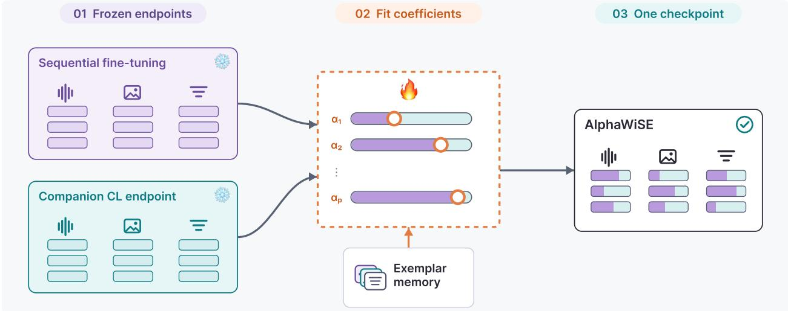
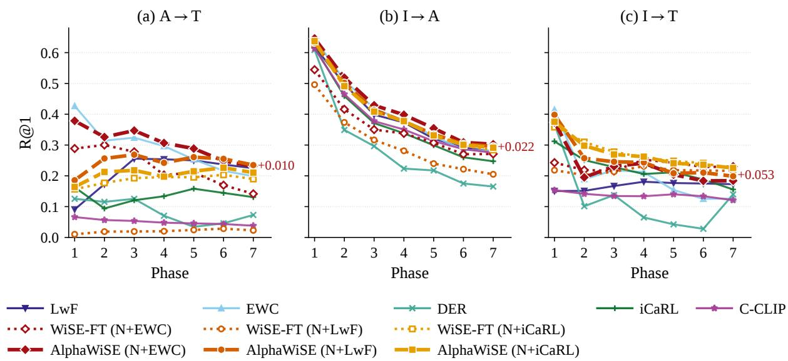
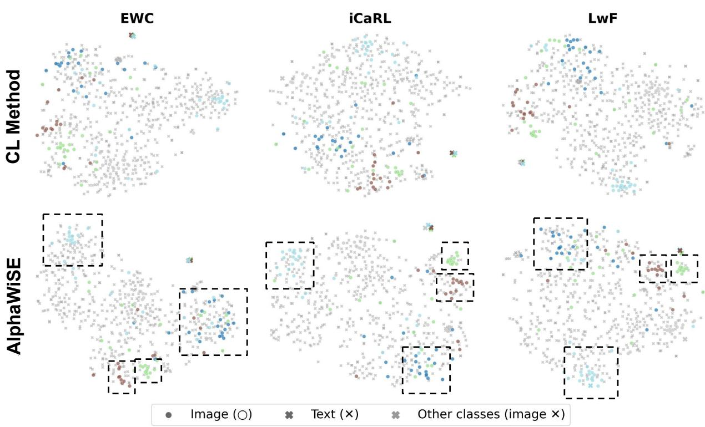
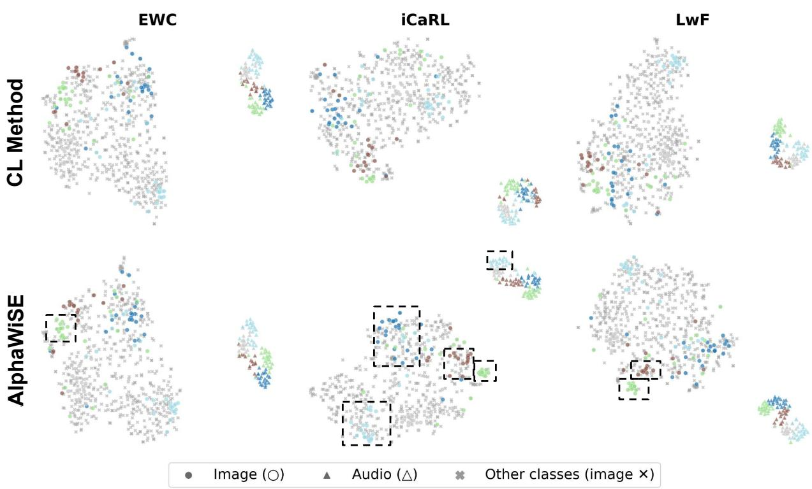
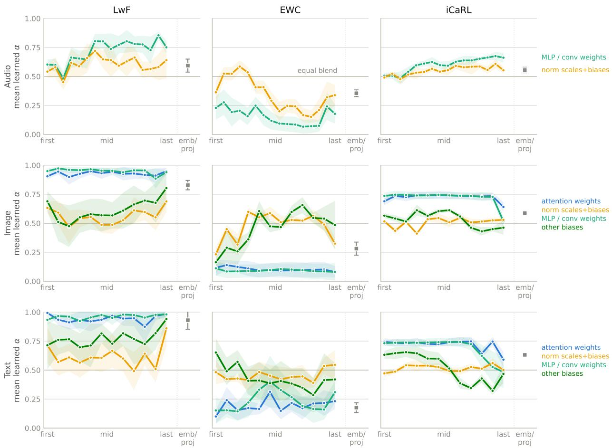

# AlphaWiSE: Adaptive Weight Interpolation for Continual Multimodal Representation Learning

Sarthak Jain1 Qiran Hu1 Zhen Zhu1,2,† Yaoyao Liu1

1University of Illinois Urbana-Champaign 2Google DeepMind

sj84@illinois.edu qiranhu2@illinois.edu zhenzhucv@google.com lyy@illinois.edu

## Abstract

Multimodal models such as CLIP learn a shared embedding space for cross-modal retrieval, but continual adaptation to sequentially arriving data can disrupt the cross-modal alignment acquired from earlier phases. Conventional continual-learning methods return a single checkpoint, which commits every retrieval direction to the same stability-plasticity trade-of. We propose AlphaWiSE, a post-hoc weight-space interpolation method that composes two frozen source checkpoints. For each aligned parameter tensor identified by its checkpoint key, AlphaWiSE fits one scalar interpolation coeficient shared by all tensor entries. The coeficients are fitted on a smaller exemplar memory and used to materialize one interpolated checkpoint. The deployed model has the same architecture and parameter count as either source checkpoint, which does not require additional inference time. Extensive experiments on audio-image-text retrieval show consistent improvements over strong continual-learning baselines across multiple retrieval directions and evaluation metrics.

## 1 Introduction

Multimodal representation models have become the foundation of modern retrieval systems by learning a shared embedding space across modalities such as images, text, and audio. Models such as CLIP (42) and AudioCLIP (17) enable cross-modal retrieval and transfer learning by aligning heterogeneous inputs into a common representation. While these models are typically trained on large static datasets, many real-world applications require continual adaptation as new concepts, domains, or data distributions emerge over time. A practical multimodal retrieval system should therefore be able to incorporate new information without destroying the cross-modal relationships learned from previous data.

Continual adaptation is particularly challenging for multimodal representation learning because forgetting afects not only individual modality encoders but also the geometry of the shared embedding space (38; 16). Small changes introduced while learning new tasks can alter the relative positions of representations across multiple modalities, degrading retrieval performance in diferent and often asymmetric ways. For example, adapting to improve audio–text retrieval may simultaneously weaken image–text or image–audio alignment. As a result, continual multimodal retrieval requires preserving a globally consistent embedding space while remaining suficiently flexible to learn from new data.

Existing continual learning methods address catastrophic forgetting through mechanisms such as regularization, knowledge distillation, or replay (8; 10; 43). Although these approaches improve the balance between stability and plasticity, they still produce one final checkpoint. Since these approaches impose diferent constraints, their final checkpoints can preserve diferent parts of the multimodal embedding geometry. Selecting a single checkpoint therefore forces all retrieval directions to inherit one stability–plasticity trade-of. This motivates the central question of whether checkpoints obtained from diferent continual-learning strategies can be composed after training so that the resulting model learns a tensor-specific balance between retention and adaptation.

To address this question, we propose AlphaWiSE, a post-hoc cweight-space interpolation designed to compose two frozen continual-learning checkpoints into a single retrieval model through learned tensor-level interpolation. The normal sequential checkpoint is produced by sequential fine-tuning, and the companion continual-learning endpoint is produced by EWC, LwF, or iCaRL. For each aligned parameter tensor identified by its checkpoint key, AlphaWiSE fits one scalar interpolation coeficient shared by all tensor entries. This tensor-wise parameterization is more expressive than a fixed global interpolation coeficient while keeping coeficient fitting low-dimensional. In our AudioCLIP ViT-B/32 backbone, AlphaWiSE optimizes 499 coeficient logits: 152 for image-encoder tensors, 149 for text-encoder tensors, 195 for audio-encoder tensors, and three learned scalar logit-scale parameters, one for each modality pair. The two source checkpoints, each with approximately 182M parameters, remain frozen throughout coeficient fitting.

We evaluate AlphaWiSE in an AudioCLIP-based continual retrieval setting using the AudioSet dataset under a constrained-memory regime with 840 exemplars (14). This setting tests whether post-hoc weight-space fusion can improve multimodal continual learning when only an exemplar set is available across sequential phases (29; 30; 6). Performance is measured on audio–image–text retrieval across continual-learning phases, with retrieval quality reported using R@1 and mAP (17).

Our contributions are threefold:

• We formulate continual multimodal checkpoint selection as post-hoc weight-space interpolation between a sequential fine-tuning checkpoint and a companion continual-learning endpoint.

• We introduce tensor-wise interpolation, which fits one scalar coeficient per aligned parameter tensor on a smaller exemplar memory while the two source checkpoints remain frozen.

• We demonstrate that the materialized interpolated checkpoint consistently outperforms both individual continual-learning baselines and standard weight-interpolation methods on continual multimodal retrieval, while preserving the architecture, parameter count, and inference cost of a single backbone.

## 2 Related Work

Continual learning. Continual learning studies how to adapt models to sequentially arriving data while mitigating catastrophic forgetting (30; 31; 32; 33; 36; 34; 61; 35; 12; 11; 65; 27; 26; 28). Existing methods can be broadly categorized into regularization-based and replay-based approaches. Regularization-based methods (47; 49; 45; 23; 60; 10), including Elastic Weight Consolidation (EWC) (24) and Learning with out Forgetting (LwF) (29), preserve previously acquired knowledge by constraining parameter updates or distilling predictions from earlier models. Replay-based methods (43; 44; 30; 41; 36; 54; 57; 3; 7), includ ing iCaRL (43) and experience replay, retain or revisit samples from previous tasks to stabilize sequential optimization. Despite their diferent optimization strategies, each method returns a single checkpoint, com mitting the deployed model to one particular stability–plasticity trade-of.

Continual multimodal representation learning. Recent advances in multimodal representation learning have led to shared-embedding models such as CLIP and AudioCLIP (17), which align heterogeneous modalities within a common embedding space for cross-modal retrieval. Continual adaptation is particularly challenging in these models because forgetting afects not only unimodal representations but also the geometry of cross-modal alignment. Unlike classification, where forgetting primarily changes decision boundaries, retrieval depends on preserving globally consistent embedding neighborhoods across multiple modalities. Consequently, small representation shifts can significantly alter nearest-neighbor rankings and degrade retrieval performance.

Recent methods, therefore, extend continual learning directly to multimodal or vision-language representation models. C-CLIP combines parameter-eficient adaptation with contrastive knowledge consolidation for continual vision-language learning (48; 19), while Dynamic Adapter Routing (DAR) introduces prototypeguided adapter routing for continual multimodal retrieval (9; 1). Other approaches similarly employ adapters, prompts, low-rank modules, or task-specific projections to reduce interference during continual adaptation (59; 40; 51; 62; 64; 63). Despite their architectural diferences, these methods improve continual learning by introducing additional trainable components or modifying the optimization process.

Our work takes a complementary perspective. Instead of proposing another continual-learning algorithm, we assume multiple continual-learning solutions have already been obtained and investigate how to compose them into a stronger representation. AlphaWiSE performs post-hoc fusion of frozen continual-learning checkpoints, producing a single deployable model without adapters, routing mechanisms, or additional inferencetime computation.

Weight-space interpolation and model merging. Weight-space interpolation has recently emerged as an efective approach for combining neural networks without increasing inference cost. Stochastic Weight Averaging (SWA) demonstrated that averaging checkpoints along an optimization trajectory improves generalization by converging to wider optima (22; 25; 46). Building on this idea, Model Soups, Fisher-weighted averaging, and task arithmetic showed that independently fine-tuned models can often be merged directly in parameter space while maintaining or improving downstream performance (52; 37; 20). WiSE-FT further demonstrated that interpolating a pretrained model with its fine-tuned counterpart improves robustness while preserving zero-shot capability (53).

Existing interpolation methods primarily target transfer learning or robustness by combining a pretrained model with a fine-tuned model using one or a few global interpolation coeficients. In contrast, Alpha-WiSE addresses continual multimodal retrieval by learning a tensor-level interpolation rule between frozen continual-learning checkpoints using a small exemplar memory. The coeficient vector follows an ordered set of checkpoint keys, and the scalar associated with each key is applied to every entry of the corresponding aligned parameter tensor. This granularity keeps the post-hoc optimization compact while allowing different layers and modality-specific components to draw diferent proportions from the source checkpoints, producing a single fused model with unchanged inference cost.

## 3 Methods

Continual multimodal retrieval. We consider a sequence of K training phases, where the data available at phase k consist of aligned audio–image–text samples

$$
\mathcal {D} _ {k} = \{(a _ {i}, x _ {i}, t _ {i}) \} _ {i = 1} ^ {N _ {k}}.
$$

The model consists of modality-specific audio, image, and text encoders which project each modality into a shared embedding space. The image and text encoders are initialized from CLIP, while the audio encoder is a dedicated ResNeXt-based network trained jointly to project audio into the same embedding space (17). The model is evaluated over a set of directed retrieval tasks ${ \mathcal { P } } ,$ such as audio-to-text, image-to-audio, and image-to-text retrieval (17). For each direction $( m , n ) \in \mathcal P$ , an observation from modality m is used as the query, and candidates from modality n are ranked according to their embedding similarity (50; 58). This setting difers from static multimodal retrieval in three respects: (i) the training data arrive sequentially across phases rather than being available jointly; (ii) after each phase, the model must incorporate the newly observed data while retaining cross-modal alignment acquired during earlier phases (50; 38); and (iii) access to previous-phase data is restricted to a bounded exemplar memory M, preventing full replay of the training history (43; 30; 6).

Our method builds on the weight-space interpolation principle used in WiSE-FT (53). AlphaWiSE is a post-hoc weight-space fusion procedure for two compatible checkpoints from the same architecture. During coeficient fitting, the checkpoint weights are fixed and only the interpolation coeficients are updated. Our starting observation is that no single continual learning method is uniformly best in multimodal retrieval: one strategy may better preserve certain modality relationships, while another may provide stronger adaptation to new phases. This suggests that useful information is distributed across distinct continual solutions rather than concentrated in a single final checkpoint. We denote the less constrained endpoint by $\theta ^ { \mathrm { u n } }$ , such as a standard sequential fine-tuning checkpoint, and the more stability-preserving endpoint by $\theta ^ { \mathrm { r e g } }$ , such as an EWC, LwF, or iCaRL checkpoint.

  
Figure 1: AlphaWiSE performs post-hoc, per-tensor fusion of two compatible continual-learning checkpoints. Both source checkpoints remain frozen. The exemplar memory is used only to optimize the coeficients $\beta ,$ with $\alpha _ { p } = \sigma ( \beta _ { p } )$ and $\tilde { \theta } _ { p } = \alpha _ { p } \theta _ { p } ^ { \mathrm { u n } } + ( 1 - \alpha _ { p } ) \theta _ { p } ^ { \mathrm { r e g } }$ . After optimization, the fused tensors are materialized into one checkpoint. The final model has the same architecture and inference-time computation as either source checkpoint.

Let $\left( \kappa _ { 1 } , \ldots , \kappa _ { P } \right)$ denote the ordered checkpoint keys selected for interpolation. For each key $\kappa _ { p } ,$ let $\theta _ { p } ^ { \mathrm { u n } }$ and $\theta _ { p } ^ { \mathrm { r e g } }$ denote the corresponding endpoint tensors. The tensors under the same key must have identical shapes and represent the same model component. AlphaWiSE learns one scalar interpolation coeficient shared by all entries of each aligned parameter tensor.

$$
\tilde {\theta} _ {p} (\boldsymbol {\beta}) = \alpha_ {p} \theta_ {p} ^ {\mathrm{un}} + (1 - \alpha_ {p}) \theta_ {p} ^ {\mathrm{reg}}, \quad \alpha_ {p} = \sigma (\beta_ {p}),\tag{1}
$$

where $\beta _ { p } \in \mathbb { R }$ is unconstrained and the sigmoid keeps $\alpha _ { p } \in ( 0 , 1 )$ . We initialize $\beta _ { p } = 0$ for all tensors, so every coeficient starts from $\alpha _ { p } = 0 . 5$

The coeficients are fitted on the exemplar memory M. For a minibatch $\boldsymbol { B } = \{ ( a _ { i } , x _ { i } , t _ { i } ) \} _ { i = 1 } ^ { B }$ , the fused model produces audio, image, and text embeddings in the shared retrieval space. For a directed modality pair $( m , n )$ , let $s _ { i j } ^ { m , n } ( \beta )$ denote the temperature-scaled similarity between the m-embedding of example i and the n-embedding of example j under the fused checkpoint $\tilde { \theta } ( \beta )$ . The directed InfoNCE loss is

$$
\mathcal {L} _ {m \rightarrow n} (\mathcal {B}; \boldsymbol {\beta}) = - \frac {1}{B} \sum_ {i = 1} ^ {B} \log \frac {\exp (s _ {i i} ^ {m , n} (\boldsymbol {\beta}))}{\sum_ {j = 1} ^ {B} \exp (s _ {i j} ^ {m , n} (\boldsymbol {\beta}))}.\tag{2}
$$

Given a set $\mathcal { P }$ of retrieval directions used for coeficient fitting, AlphaWiSE minimizes the empirical retrieval loss

$$
\min _ {\boldsymbol {\beta} \in \mathbb {R} ^ {P}} \mathbb {E} _ {\mathcal {B} \sim \mathcal {M}} \left[ \mathcal {L} _ {\mathrm{ret}} (\mathcal {B}; \boldsymbol {\beta}) \right], \qquad \mathcal {L} _ {\mathrm{ret}} (\mathcal {B}; \boldsymbol {\beta}) = \frac {1}{| \mathcal {P} |} \sum_ {(m, n) \in \mathcal {P}} \mathcal {L} _ {m \to n} (\mathcal {B}; \boldsymbol {\beta}).\tag{3}
$$

Algorithm 1 AlphaWiSE: per-tensor fusion of two frozen continual-learning checkpoints.

Require: Compatible frozen checkpoints $\theta^{\mathrm{un}} = \{\theta_p^{\mathrm{un}}\}_{p=1}^P$ and $\theta^{\mathrm{reg}} = \{\theta_p^{\mathrm{reg}}\}_{p=1}^P$; exemplar memory $\mathcal{M}$; retrieval-direction set $\mathcal{P}$; batch size $B$; optimizer Opt; steps $T$.

Ensure: Materialized fused checkpoint $\tilde{\theta}^{\star}$.

1: $\beta_p \leftarrow 0$ for all $p \in \{1, \ldots, P\}$ ▷ initializes $\alpha_p = 0.5$

2: for $s = 1$ to $T$ do

3: Sample $\mathcal{B} = \{(a_i, x_i, t_i)\}_{i=1}^B$ from $\mathcal{M}$

4: for $p = 1$ to $P$ do

5: $\alpha_p \leftarrow \sigma(\beta_p)$

6: $\tilde{\theta}_p \leftarrow \alpha_p \theta_p^{\mathrm{un}} + (1 - \alpha_p) \theta_p^{\mathrm{reg}}$

7: end for

8: Compute $\mathcal{L}_{\mathrm{ret}}(\mathcal{B}; \beta)$ using Eq. 3

9: $\beta \leftarrow \mathrm{OptStep}(\mathrm{Opt}, \beta, \nabla_{\beta} \mathcal{L}_{\mathrm{ret}})$

10: end for

11: $\alpha^{\star} \leftarrow \sigma(\beta)$

12: $\tilde{\theta}^{\star} \leftarrow \{\alpha_p^{\star} \theta_p^{\mathrm{un}} + (1 - \alpha_p^{\star}) \theta_p^{\mathrm{reg}}\}_{p=1}^P$

13: return $\tilde{\theta}^{\star}$

The set $\mathcal { P }$ can contain one direction for a pair-specific objective or multiple directions for the joint objective studied in Section 4.3. Gradients are computed through the fused model where $\beta$ is updated while $\theta ^ { \mathrm { u n } }$ and $\theta ^ { \mathrm { r e g } }$ stay fixed. The coeficient-gradient interpretation is given in Appendix A.4.

## 4 Experiments

We evaluate AlphaWiSE in the main AudioCLIP-based continual retrieval setting using the AudioSet dataset under a constrained-memory regime with 840 exemplars (14). This setting is designed to test whether post hoc weight-space fusion can improve multimodal continual learning when only an exemplar set is available over a course of phases (29; 30; 6). Performance is measured on audio-image-text retrieval across the continual learning phases, with retrieval quality reported using R@1 and mAP (17).

Our evaluation focuses on whether AlphaWiSE can improve retention and transfer relative to individual continual-learning trajectories, including standard fine-tuning, EWC, iCaRL, and LwF (24; 29; 43). In this setting, each baseline represents a diferent stability–plasticity tradeof: standard fine-tuning provides stronger adaptation to new data, while regularization- and distillation-based methods are designed to preserve prior behavior. AlphaWiSE uses the 840-exemplar memory to learn per-tensor interpolation coeficients between frozen checkpoints produced by these strategies, enabling the fused model to reuse complementary properties of diferent training trajectories without increasing inference-time model capacity.

This evaluation is intended to answer whether AlphaWiSE improves continual multimodal retrieval in the low-memory regime, and whether learned checkpoint fusion can provide a better balance between preserving prior cross-modal alignment and adapting to later phases than selecting any single continual-learning trajectory.

## 4.1 Implementation Details

Dataset We conduct our experiments on AudioSet, a large-scale dataset of human-annotated audio events collected from YouTube videos. AudioSet contains 10-second clips annotated with 527 sound-event labels drawn from a hierarchical ontology. The classes cover a broad range of acoustic concepts, including human sounds, musical instruments, animals, vehicles, natural environments, and mechanical sounds. Individual clips may contain multiple labels, and the dataset is highly imbalanced, with substantially diferent numbers of examples across classes (14). To construct the continual-learning benchmark, we partition the classes used in our experiments into eight disjoint phases. The model is trained sequentially on these phases, introducing a new subset of sound-event classes at each phase without revisiting the complete training data from earlier phases. This class-incremental organization allows us to evaluate both adaptation to newly introduced concepts and retention of previously learned audio-image-text alignment.

Backbone architecture. For our implementation, we utilize the AudioCLIP backbone with some minor changes. The image and text branches are inherited from CLIP ViT-B/32 (42), with embedding dimension 512, patch size 32, transformer width 768, and 12 transformer layers, while the audio branch uses an ESResNeXt-FBSP convolutional encoder (17; 18). The model is trained and evaluated using three pairwise retrieval objectives: audio–image, audio–text, and image–text. Additionally, because only the ESResNeXt-FBSP audio encoder contains BatchNorm layers, we replace each BatchNorm module in this branch with GroupNorm, while preserving its learned afine weight and bias parameters; the CLIP image and text encoders already use LayerNorm and are unafected. This replacement removes running mean and vari ance bufers, making normalization independent of batch composition and avoiding inconsistencies that can arise when interpolated afine parameters are paired with BatchNorm statistics estimated under diferent continual-learning checkpoints (21; 56; 2; 39; 5).

Source checkpoints. At each phase, AlphaWiSE merges two checkpoints with identical architectures and parameter structures. The less constrained checkpoint, denoted by $\theta ^ { \mathrm { u n } }$ , is obtained through standard sequential fine-tuning and serves as the more plastic endpoint. It is optimized using SGD with learning rate $5 \times 1 0 ^ { - 5 }$ , momentum 0.9, weight decay $5 \times 1 0 ^ { - 4 }$ , and Nesterov momentum. The learning rate follows an exponential decay schedule with $\gamma = 0 . 9 6$ per epoch. AlphaWiSE uses the epoch-30 checkpoint as the unconstrained endpoint (17).

The stability-preserving checkpoint, denoted by $\theta ^ { \mathrm { r e g } }$ , is obtained using a continual-learning method such as EWC, LwF, or iCaRL. These methods preserve previous knowledge through parameter regularization, knowledge distillation, or exemplar replay, respectively, and therefore provide a more constrained endpoint than standard sequential fine-tuning. For the EWC instantiation, the model is optimized using AdamW, with a separately tuned learning rate for the logit-scale parameters. The diagonal Fisher information is estimated from 64 minibatches of the preceding phase, lower-bounded by $\epsilon = 1 0 ^ { - 3 }$ , and upper-bounded by $1 0 ^ { 4 }$ . The corresponding objective is

$$
\mathcal {L} _ {\mathrm{EWC}} (\theta) = \mathcal {L} _ {\mathrm{CLIP}} (\theta) + \frac {\lambda_ {\mathrm{ewc}}}{2} \sum_ {n} F _ {n} \left(\theta_ {n} - \theta_ {n} ^ {(k - 1)}\right) ^ {2},
$$

where $F _ { n }$ is the estimated diagonal Fisher importance of parameter $n , \theta ^ { ( k - 1 ) }$ denotes the parameters retained from the preceding phase, and $\lambda _ { \mathrm { e w c } } = 0 . 8 ~ ( 2 4 )$

For LwF, a frozen copy of the preceding-phase checkpoint provides temperature-softened targets for the audio–image, audio–text, and image–text objectives. Let $\mathcal { R } _ { \mathrm { d i s t } }$ denote the distillation directions used during training. The loss is

$$
\mathcal {L} _ {\mathrm{LwF}} = \mathcal {L} _ {\mathrm{CLIP}} + \lambda_ {\mathrm{LwF}} T ^ {2} \frac {1}{| \mathcal {R} _ {\mathrm{dist}} |} \sum_ {r \in \mathcal {R} _ {\mathrm{dist}}} \mathrm{CE} \big (q _ {r} ^ {\mathrm{old}} (T), q _ {r} (T) \big),
$$

where $T = 2 , \lambda _ { \mathrm { L w F } } = 0 . 1$ , and $\mathcal { R } _ { \mathrm { d i s t } }$ is matched to the directed retrieval losses used for coeficient fitting (29). For iCaRL, we use the same optimizer and combine distillation with replay from a fixed memory of 840 herding-selected exemplars (43). Its objective is

$$
\mathcal {L} _ {\mathrm{iCaRL}} = \mathcal {L} _ {\mathrm{CLIP}} + \lambda_ {\mathrm{iCaRL}} \operatorname{BCE} \bigl (\sigma (z ^ {\mathrm{old}}), z \bigr),
$$

with $\lambda _ { \mathrm { i C a R L } } = 1 . 0$ . Both $\theta ^ { \mathrm { u n } }$ and $\theta ^ { \mathrm { r e g } }$ remain frozen during coeficient optimization, and AlphaWiSE updates only the interpolation variables.

## 4.2 Continual-retrieval results

Table 1 reports the main 840-exemplar continual retrieval results across audio-to-text, image-to-audio, and image-to-text retrieval. Overall, AlphaWiSE improves over individual continual-learning baselines on most average retrieval metrics, indicating that post-hoc interpolation can recover a stronger multimodal representation than selecting a single continual-learning trajectory.

  
Figure 2: Phase-wise R@1 for the listed continual-learning and AlphaWiSE configurations. Results are shown over phases 1–7 for audio-to-text (A→T), image-to-audio (I→A), and image-to-text (I→T) retrieval on the 79-class candidate pool. Thin solid lines denote the listed non-fusion baselines, and thick dashed lines denote the three AlphaWiSE pairings. At phase 7, the best AlphaWiSE pairing is numerically higher than the strongest listed non-fusion baseline by 0.0101 R@1 for A→T, 0.0216 for I→A, and 0.0526 for I→T.

Table 1: Performance comparison on A→T, I→A, and I→T tasks with 840 exemplars. The best result in each column is shown in bold.

<table><tr><td rowspan="3">Method</td><td colspan="4">A→T</td><td colspan="4">I→A</td><td colspan="4">I→T</td></tr><tr><td colspan="2">Average</td><td colspan="2">Last Phase</td><td colspan="2">Average</td><td colspan="2">Last Phase</td><td colspan="2">Average</td><td colspan="2">Last Phase</td></tr><tr><td>R@1</td><td>mAP</td><td>R@1</td><td>mAP</td><td>R@1</td><td>mAP</td><td>R@1</td><td>mAP</td><td>R@1</td><td>mAP</td><td>R@1</td><td>mAP</td></tr><tr><td>LwF</td><td>0.2121</td><td>0.3309</td><td>0.2248</td><td>0.3374</td><td>0.3972</td><td>0.3461</td><td>0.2791</td><td>0.2302</td><td>0.1678</td><td>0.2491</td><td>0.1729</td><td>0.2535</td></tr><tr><td>EWC</td><td>0.2900</td><td>0.3792</td><td>0.1988</td><td>0.2901</td><td>0.4068</td><td>0.3408</td><td>0.2810</td><td>0.2233</td><td>0.2056</td><td>0.2784</td><td>0.1260</td><td>0.1973</td></tr><tr><td>DER</td><td>0.0842</td><td>0.1793</td><td>0.0729</td><td>0.1625</td><td>0.2908</td><td>0.3001</td><td>0.1652</td><td>0.1784</td><td>0.1258</td><td>0.2012</td><td>0.1397</td><td>0.1943</td></tr><tr><td>iCaRL</td><td>0.1350</td><td>0.2587</td><td>0.1308</td><td>0.2333</td><td>0.3703</td><td>0.3363</td><td>0.2473</td><td>0.2163</td><td>0.2218</td><td>0.3214</td><td>0.1557</td><td>0.2455</td></tr><tr><td>C-CLIP</td><td>0.0502</td><td>0.1304</td><td>0.0380</td><td>0.1126</td><td>0.3830</td><td>0.3390</td><td>0.2751</td><td>0.2235</td><td>0.1368</td><td>0.2393</td><td>0.1210</td><td>0.2138</td></tr><tr><td>WiSE-FT (N+EWC)</td><td>0.2273</td><td>0.3119</td><td>0.2298</td><td>0.3128</td><td>0.3566</td><td>0.3261</td><td>0.2709</td><td>0.2199</td><td>0.2330</td><td>0.3253</td><td>0.2298</td><td>0.3128</td></tr><tr><td>WiSE-FT (N + iCaRL)</td><td>0.1871</td><td>0.3151</td><td>0.1895</td><td>0.3002</td><td>0.4052</td><td>0.3464</td><td>0.2844</td><td>0.2294</td><td>0.2737</td><td>0.3790</td><td>0.2209</td><td>0.3223</td></tr><tr><td>WiSE-FT (N + LwF)</td><td>0.0206</td><td>0.0871</td><td>0.0229</td><td>0.0933</td><td>0.3049</td><td>0.3104</td><td>0.2051</td><td>0.1968</td><td>0.2167</td><td>0.3095</td><td>0.2161</td><td>0.3049</td></tr><tr><td>AlphaWiSE (N+EWC)</td><td>0.3037</td><td>0.3946</td><td>0.2309</td><td>0.3216</td><td>0.4225</td><td>0.3485</td><td>0.3026</td><td>0.2342</td><td>0.2304</td><td>0.3135</td><td>0.1842</td><td>0.2576</td></tr><tr><td>AlphaWiSE (N+LwF)</td><td>0.2434</td><td>0.3663</td><td>0.2349</td><td>0.3458</td><td>0.4085</td><td>0.3494</td><td>0.2958</td><td>0.2357</td><td>0.2517</td><td>0.3481</td><td>0.1987</td><td>0.2889</td></tr><tr><td>AlphaWiSE (N+iCaRL)</td><td>0.2062</td><td>0.3347</td><td>0.2105</td><td>0.3273</td><td>0.4055</td><td>0.3486</td><td>0.2914</td><td>0.2340</td><td>0.2725</td><td>0.3763</td><td>0.2255</td><td>0.3244</td></tr></table>

The strongest gains appear when AlphaWiSE combines the normal sequential checkpoint with a stabilitypreserving checkpoint. For audio-to-text retrieval, AlphaWiSE (N+EWC) achieves the best average performance, improving over EWC from 0.2900 to 0.3037 R@1 and from 0.3792 to 0.3946 mAP. AlphaWiSE (N+LwF), however, obtains the best last-phase audio-to-text R@1 and mAP. For image-to-audio retrieval, AlphaWiSE (N+EWC) obtains the strongest average and last-phase R@1, while AlphaWiSE (N+LwF) ob tains the strongest average and last-phase mAP. These results indicate that the strongest source pairing depends on both the retrieval metric and the reporting stage.

For image-to-text retrieval, the best average performance is obtained by WiseFT(N + iCARL) and Alpha-WiSE (N+iCaRL), followed by AlphaWiSE (N+LwF). This indicates that the most efective checkpoint pairing can depend on the retrieval direction. While EWC provides strong audio-related retention, other trajectories can better preserve or recover image-text alignment. This supports the central motivation of AlphaWiSE: diferent continual-learning methods encode diferent stability–plasticity tradeofs, and these tradeofs are not uniformly optimal across modality pairs. Rather than treating each baseline checkpoint as a final solution, AlphaWiSE uses them as reusable components for learned weight-space composition.

## 4.3 Cross-objective efects across retrieval directions

Table 2: Cross-objective analysis for AlphaWiSE. We optimize interpolation coeficients using either one modality-pair objective or the joint objective and evaluate the resulting fused model on all retrieval directions. The best result in each column is shown in bold.

<table><tr><td rowspan="2">Coefficient objective</td><td colspan="2">A→T</td><td colspan="2">I→A</td><td colspan="2">I→T</td></tr><tr><td>R@1</td><td>mAP</td><td>R@1</td><td>mAP</td><td>R@1</td><td>mAP</td></tr><tr><td>AlphaWiSE, optimize on A→T</td><td>0.3026</td><td>0.3928</td><td>0.3043</td><td>0.2337</td><td>0.2386</td><td>0.3223</td></tr><tr><td>AlphaWiSE, optimize on I→A</td><td>0.2878</td><td>0.3848</td><td>0.4195</td><td>0.3476</td><td>0.2258</td><td>0.3115</td></tr><tr><td>AlphaWiSE, optimize on I→T</td><td>0.2217</td><td>0.3044</td><td>0.3587</td><td>0.3262</td><td>0.2336</td><td>0.3135</td></tr><tr><td>AlphaWiSE, optimize jointly</td><td>0.3037</td><td>0.3946</td><td>0.4225</td><td>0.3485</td><td>0.2304</td><td>0.3135</td></tr></table>

Table 2 studies whether the interpolation coeficients learned from one modality-pair objective afect other retrieval directions. In this ablation, AlphaWiSE is trained using one retrieval objective at a time, such as A→T, I→A, or I→T, and the resulting fused model is evaluated on all retrieval tasks.

Joint optimization gives the best A→T and I→A results. In contrast, optimizing only A→T gives the best I→T result, reaching 0.2386 R@1 and 0.3223 mAP. Thus, the coeficient objective afects both the directly optimized direction and of-diagonal directions.

The results show that optimizing the coeficients on a single objective afects both the directly optimized direction and the of-objective directions. Training on A→T gives the best I→T result in this ablation but does not improve I→A. Training on I→A gives strong I→A performance and remains competitive on A→T. Overall, joint optimization gives the strongest audio-related performance, achieving the best A→T and I→A results in Table 2.

This pattern suggests that objectives involving the image modality may provide broader cross-modal benefits in this setting. Optimizing I→A directly improves image–audio retrieval and remains competitive on A→T, whereas optimizing A→T primarily benefits audio–text and image–text retrieval. This behavior is consistent with prior work showing that audio can be aligned with pretrained image–text representation spaces and subsequently support retrieval across all three modalities (17; 55). More directly, ImageBind demonstrates that aligning multiple modalities through images can induce emergent alignment between modality pairs that are not observed together during training (15). Although AlphaWiSE difers substantially from ImageBind in both training regime and scale, our ablation suggests a related phenomenon: when the image modality is included in the interpolation objective, the learned interpolation can improve retrieval directions beyond the modality pair directly optimized.

## 4.4 Qualitative embedding analysis

Figures 3 and 4 provide qualitative t-SNE visualizations of the learned embedding space.

In the image-to-text visualization, AlphaWiSE produces tighter or more separated neighborhoods for several selected classes than the corresponding baseline, suggesting improved organization of the shared representation space for those examples. In the image-to-audio visualization, AlphaWiSE similarly shows more coherent cross-modal clustering for several selected neighborhoods, consistent with the strong I→A results in Table 1. These qualitative results support the interpretation that AlphaWiSE improves retrieval by shifting the fused model toward a region of weight space that better preserves class-level cross-modal alignment.

CL Method vs AlphaWiSE — Image → Text Cross-Modal Alignment (AudioSet) Color = class label | Image  Text ×  
  
Figure 3: Qualitative image-to-text (I→T) t-SNE projections. Rows compare the continual-learning checkpoint and the corresponding AlphaWiSE fusion, while columns correspond to EWC, iCaRL, and LwF. Colors denote five selected classes (25 image samples per class), circles denote image embeddings, crosses denote text embeddings, and gray crosses denote the text embeddings of all remaining background classes not highlighted in the visualization (one embedding per class). Dashed boxes mark selected neighborhoods. Compared with the original continual-learning checkpoints, AlphaWiSE produces more compact intra-class clusters, improved separation between classes, and tighter alignment between image and text embeddings, indicating better preservation of the shared multimodal embedding space after continual learning.

## 4.5 Analysis of learned interpolation

Since AlphaWiSE learns one interpolation coeficient per parameter group, the converged α values reveal where in the network the merge draws on the fine-tuned model and where it preserves the stable continual model. Figure 5 disaggregates the learned coeficients along two axes: relative block depth within each encoder, and parameter type (attention weights, MLP/convolutional weights, normalization scales and biases, and remaining bias vectors).

Two observations emerge. First, parameter type, not depth, is the dominant axis of variation: within every panel, the separation between types (up to $\Delta \alpha \approx 0 . 8 )$ far exceeds any trend across blocks, supporting the choice of per-named model parameter rather than per-layer or per-model coeficients. Second, normalization and bias parameters absorb a disproportionate share of adaptation whenever the weights remain conservative. For example as exemplified in Figure 5, when the stable model is trained with EWC, the image- and texttower attention and MLP weights converge to $\alpha \approx 0 . 1$ , i.e. they are taken almost entirely from the stable model, while LayerNorm scales and biases vary with a range of $\Delta \alpha \approx 0 . 3$

CL Method vs AlphaWiSE — Image → Audio Cross-Modal Alignment (AudioSet) Color = class label |Image  Audio △  
  
Figure 4: Qualitative image-to-audio (I→A) t-SNE projections. Rows compare the continual-learning checkpoint and the corresponding AlphaWiSE fusion, while columns correspond to EWC, iCaRL, and LwF. Colors denote five selected classes (25 image samples per class), circles denote image embeddings, triangles denote audio embeddings, and gray markers denote the embeddings of all remaining background classes not highlighted in the visualization (one embedding per class). Dashed boxes highlight representative local neighborhoods. Relative to the original continual-learning checkpoints, AlphaWiSE exhibits slightly more compact image-audio clusters, improved separation between semantic classes, and closer correspondence between image and audio embeddings, suggesting improved cross-modal consistency while preserving the overall structure of the shared embedding space.

This pattern is also seen with the AlphaWiSE models with iCARL and Lwf. This mirrors prior evidence that norms and biases constitute a cheap, high-leverage channel for domain adaptation (4; 13). Additionally, the results in Table 1 support a view of AlphaWiSE as a mechanism for post-hoc trajectory composition. Standard fine-tuning, EWC, LwF, and replay-based methods each produce checkpoints with diferent retrieval strengths. EWC is particularly useful for audio-related retrieval, while other pairings are more efective for image-text retrieval. AlphaWiSE exploits this complementarity by learning per-tensor interpolation coeficients on a small exemplar memory.

The cross-objective ablation further suggests that the interpolation coeficients are sensitive to the optimization objective. Joint optimization gives the best A→T and I→A results, whereas A→T-only optimization gives the best I→T result. This indicates that diferent modality-pair objectives favor diferent per-tensor mixtures, and it motivates future work on retrieval-conditioned or objective-aware interpolation strategies.

Overall, the results indicate that AlphaWiSE is most useful when the fused checkpoints provide complementary solutions. The method does not require a single continual-learning baseline to dominate across all

Learned by depth and parameter type Per-block mean of learned (1 = fine-tuned, 0 = stable continual model), averaged over phases 1 7; band / error bar: ±1 std across phases

attention weights MLP / conv weights norm scales+biases other biases emb/proj (no depth)

  
block position (relative depth; Audio 16 blocks, Image/Text 12 blocks) | emb/proj: params outside blocks

Figure 5: Learned interpolation coeficients by depth and parameter type. Per-block mean of the learned coeficient α (α=1: audio–visual fine-tuned model; α=0: stable continual model), averaged over incremental phases 1–7; bands and error bars denote ±1 std across phases. Rows correspond to encoder branch (audio, image, text) and columns to the stable continual learner (LwF, EWC, iCaRL). Parameter type, rather than depth, dominates the variation, and normalization scales/biases absorb most of the finetuned update wherever the weight matrices stay near the stable model.

retrieval directions. Instead, it benefits from the fact that diferent baselines preserve diferent parts of the multimodal embedding geometry.

## 5 Conclusion

We presented AlphaWiSE, a parameter-eficient framework for continual multimodal representation learning that adaptively fuses frozen continual-learning checkpoints through per-tensor weight interpolation. Rather than committing to a single continual-learning trajectory, AlphaWiSE treats multiple continual-learning so lutions as complementary building blocks and learns how to combine them using a small exemplar memory, producing a single fused model with the same architecture and inference cost as the original backbone. Exper iments on continual audio–image–text retrieval demonstrate consistent improvements over strong continual learning baselines, showing that adaptive checkpoint composition provides a better balance between adaptation and retention than individual continual-learning strategies alone. More broadly, our results suggest that continual-learning trajectories should not be viewed as competing alternatives from which a single model must be selected, but rather as complementary sources of knowledge that can be composed to obtain stronger multimodal representations. We hope this perspective motivates future work on scalable checkpoint composition, interpolation across multiple continual-learning trajectories, and more general model fusion techniques for continually adapting multimodal foundation models.

## Acknowledgements

This research is supported by the National Artificial Intelligence Research Resource Pilot Awards NAIRR250199, NAIRR260019, and NAIRR260077, the AMD University Program’s AI & HPC Cluster, NVIDIA Academic Grant Program, and Lambda’s Research Grant. Computational resources are also provided by Delta and DeltaAI at the National Center for Supercomputing Applications through ACCESS allocations CIS250012, CIS250816, and CIS251188.

## References

[1] Vladimir Araujo, Marie-Francine Moens, and Tinne Tuytelaars. Learning to route for dynamic adapter composition in continual learning with language models. arXiv preprint arXiv:2408.09053, 2024.

[2] Jimmy Lei Ba, Jamie Ryan Kiros, and Geofrey E. Hinton. Layer normalization. arXiv preprint arXiv:1607.06450, 2016.

[3] Jihwan Bang, Heesu Kim, Youngjoon Yoo, Jung-Woo Ha, and Jonghyun Choi. Rainbow memory: Continual learning with a memory of diverse samples. In CVPR, 2021.

[4] Elad Ben-Zaken, Shauli Ravfogel, and Yoav Goldberg. Bitfit: Simple parameter-eficient fine-tuning for transformer-based masked language-models. arXiv preprint arXiv:2106.10199, 2022.

[5] Sungmin Cha, Sungjun Cho, Dasol Hwang, Sunwon Hong, Moontae Lee, and Taesup Moon. Rebalancing batch normalization for exemplar-based class-incremental learning. arXiv preprint arXiv:2201.12559, 2023.

[6] Arslan Chaudhry, Marcus Rohrbach, Mohamed Elhoseiny, Thalaiyasingam Ajanthan, Puneet K. Dokania, Philip H. S. Torr, and Marc’Aurelio Ranzato. On tiny episodic memories in continual learning. arXiv preprint arXiv:1902.10486, 2019.

[7] Yoojin Choi, Mostafa El-Khamy, and Jungwon Lee. Dual-teacher class-incremental learning with datafree generative replay. In CVPR, 2021.

[8] Matthias De Lange, Rahaf Aljundi, Marc Masana, Sarah Parisot, Xu Jia, Aleš Leonardis, Gregory Slabaugh, and Tinne Tuytelaars. A continual learning survey: Defying forgetting in classification tasks. arXiv preprint arXiv:1909.08383, 2019.

[9] Alicja Dobrzeniecka, Filip Szatkowski, Sebastian Cygert, Szymon Lukasik, and Bartlomiej Twardowski. Beyond classification: Dynamic adapter routing for continual multimodal retrieval. arXiv preprint arXiv:2605.31229, 2026.

[10] Arthur Douillard, Matthieu Cord, Charles Ollion, Thomas Robert, and Eduardo Valle. Podnet: Pooled outputs distillation for small-tasks incremental learning. In ECCV, 2020.

[11] Ruxiao Duan, Jieneng Chen, Adam Kortylewski, Alan Yuille, and Yaoyao Liu. Prompt-based exemplar super-compression and regeneration for class-incremental learning. In BMVC, 2025.

[12] Tom Fischer, Yaoyao Liu, Artur Jesslen, Noor Ahmed, Prakhar Kaushik, Angtian Wang, Alan L Yuille, Adam Kortylewski, and Eddy Ilg. inemo: Incremental neural mesh models for robust class-incremental learning. In ECCV, 2024.

[13] Jonathan Frankle, David J. Schwab, and Ari S. Morcos. Training batchnorm and only batchnorm: On the expressive power of random features in cnns. arXiv preprint arXiv:2003.00152, 2021.

[14] Jort F. Gemmeke, Daniel P. W. Ellis, Dylan Freedman, Aren Jansen, Wade Lawrence, R. Channing Moore, Manoj Plakal, and Marvin Ritter. Audio set: An ontology and human-labeled dataset for audio events. In ICASSP, 2017.

[15] Rohit Girdhar, Alaaeldin El-Nouby, Zhuang Liu, Mannat Singh, Kalyan Vasudev Alwala, Armand Joulin, and Ishan Misra. Imagebind: One embedding space to bind them all. arXiv preprint arXiv:2305.05665, 2023.

[16] Ian J. Goodfellow, Mehdi Mirza, Da Xiao, Aaron Courville, and Yoshua Bengio. An empirical investigation of catastrophic forgetting in gradient-based neural networks. arXiv preprint arXiv:1312.6211, 2015.

[17] Andrey Guzhov, Federico Raue, Jörn Hees, and Andreas Dengel. Audioclip: Extending clip to image, text and audio. arXiv preprint arXiv:2106.13043, 2021.

[18] Andrey Guzhov, Federico Raue, Jörn Hees, and Andreas Dengel. Esresne(x)t-fbsp: Learning robust time-frequency transformation of audio. arXiv preprint arXiv:2104.11587, 2021.

[19] Edward J. Hu, Yelong Shen, Phillip Wallis, Zeyuan Allen-Zhu, Yuanzhi Li, Shean Wang, Lu Wang, and Weizhu Chen. Lora: Low-rank adaptation of large language models. arXiv preprint arXiv:2106.09685, 2021.

[20] Gabriel Ilharco, Marco Tulio Ribeiro, Mitchell Wortsman, Suchin Gururangan, Ludwig Schmidt, Hannaneh Hajishirzi, and Ali Farhadi. Editing models with task arithmetic. arXiv preprint arXiv:2212.04089, 2023.

[21] Sergey Iofe and Christian Szegedy. Batch normalization: Accelerating deep network training by reducing internal covariate shift. arXiv preprint arXiv:1502.03167, 2015.

[22] Pavel Izmailov, Dmitrii Podoprikhin, Timur Garipov, Dmitry Vetrov, and Andrew Gordon Wilson. Averaging weights leads to wider optima and better generalization. arXiv preprint arXiv:1803.05407, 2019.

[23] KJ Joseph, Salman Khan, Fahad Shahbaz Khan, Rao Muhammad Anwer, and Vineeth N Balasubramanian. Energy-based latent aligner for incremental learning. In CVPR, 2022.

[24] James Kirkpatrick, Razvan Pascanu, Neil Rabinowitz, Joel Veness, Guillaume Desjardins, Andrei A Rusu, Kieran Milan, John Quan, Tiago Ramalho, Agnieszka Grabska-Barwinska, et al. Overcoming catastrophic forgetting in neural networks. PNAS, 2017.

[25] Jędrzej Kozal, Jan Wasilewski, Bartosz Krawczyk, and Michał Woźniak. Continual learning with weight interpolation. arXiv preprint arXiv:2404.04002, 2024.

[26] Yingying Li, Xin Chen, and Na Li. Online optimal control with linear dynamics and predictions: Algorithms and regret analysis. NeurIPS, 2019.

[27] Yingying Li, Guannan Qu, and Na Li. Online optimization with predictions and switching costs: Fast algorithms and the fundamental limit. IEEE TAC, 2020.

[28] Yingying Li, Subhro Das, and Na Li. Online optimal control with afine constraints. In AAAI, 2021.

[29] Zhizhong Li and Derek Hoiem. Learning without forgetting. arXiv preprint arXiv:1606.09282, 2017.

[30] Yaoyao Liu, Yuting Su, An-An Liu, Bernt Schiele, and Qianru Sun. Mnemonics training: Multi-class incremental learning without forgetting. In CVPR, 2020.

[31] Yaoyao Liu, Bernt Schiele, and Qianru Sun. Adaptive aggregation networks for class-incremental learning. In CVPR, 2021.

[32] Yaoyao Liu, Bernt Schiele, and Qianru Sun. Rmm: Reinforced memory management for classincremental learning. NeurIPS, 34:3478–3490, 2021.

[33] Yaoyao Liu, Yingying Li, Bernt Schiele, and Qianru Sun. Online hyperparameter optimization for class-incremental learning. In AAAI, 2023.

[34] Yaoyao Liu, Bernt Schiele, Andrea Vedaldi, and Christian Rupprecht. Continual detection transformer for incremental object detection. In CVPR, pp. 23799–23808, 2023.

[35] Yaoyao Liu, Yingying Li, Bernt Schiele, and Qianru Sun. Wakening past concepts without past data: Class-incremental learning from online placebos. In WACV, 2024.

[36] Zilin Luo, Yaoyao Liu, Bernt Schiele, and Qianru Sun. Class-incremental exemplar compression for class-incremental learning. In CVPR, pp. 11371–11380, 2023.

[37] Michael Matena and Colin Rafel. Merging models with fisher-weighted averaging. arXiv preprint arXiv:2111.09832, 2022.

[38] Zixuan Ni, Longhui Wei, Siliang Tang, Yueting Zhuang, and Qi Tian. Continual vision-language representation learning with of-diagonal information. arXiv preprint arXiv:2305.07437, 2023.

[39] Quang Pham, Chenghao Liu, and Steven Hoi. Continual normalization: Rethinking batch normalization for online continual learning. arXiv preprint arXiv:2203.16102, 2022.

[40] Clifton Poth, Hannah Sterz, Indraneil Paul, Sukannya Purkayastha, Leon Engländer, Timo Imhof, Ivan Vulić, Sebastian Ruder, Iryna Gurevych, and Jonas Pfeifer. Adapters: A unified library for parametereficient and modular transfer learning. arXiv preprint arXiv:2311.11077, 2023.

[41] Ameya Prabhu, Philip HS Torr, and Puneet K Dokania. Gdumb: A simple approach that questions our progress in continual learning. In ECCV, 2020.

[42] Alec Radford, Jong Wook Kim, Chris Hallacy, Aditya Ramesh, Gabriel Goh, Sandhini Agarwal, Girish Sastry, Amanda Askell, Pamela Mishkin, Jack Clark, Gretchen Krueger, and Ilya Sutskever. Learning transferable visual models from natural language supervision. arXiv preprint arXiv:2103.00020, 2021.

[43] Sylvestre-Alvise Rebufi, Alexander Kolesnikov, Georg Sperl, and Christoph H Lampert. iCaRL: Incremental classifier and representation learning. In CVPR, 2017.

[44] Hanul Shin, Jung Kwon Lee, Jaehong Kim, and Jiwon Kim. Continual learning with deep generative replay. In NeurIPS, 2017.

[45] Christian Simon, Piotr Koniusz, and Mehrtash Harandi. On learning the geodesic path for incremental learning. In CVPR, 2021.

[46] Zafir Stojanovski, Karsten Roth, and Zeynep Akata. Momentum-based weight interpolation of strong zero-shot models for continual learning. arXiv preprint arXiv:2211.03186, 2022.

[47] Xiaoyu Tao, Xinyuan Chang, Xiaopeng Hong, Xing Wei, and Yihong Gong. Topology-preserving classincremental learning. In ECCV, 2020.

[48] William Theisen and Walter Scheirer. C-clip: Contrastive image-text encoders to close the descriptivecommentative gap. arXiv preprint arXiv:2309.03921, 2023.

[49] Fu-Yun Wang, Da-Wei Zhou, Han-Jia Ye, and De-Chuan Zhan. Foster: Feature boosting and compression for class-incremental learning. In ECCV, 2022.

[50] Kai Wang, Luis Herranz, and Joost van de Weijer. Continual learning in cross-modal retrieval. arXiv preprint arXiv:2104.06806, 2021.

[51] Zifeng Wang, Zizhao Zhang, Sayna Ebrahimi, Ruoxi Sun, Han Zhang, Chen-Yu Lee, Xiaoqi Ren, Guolong Su, Vincent Perot, Jennifer Dy, and Tomas Pfister. Dualprompt: Complementary prompting for rehearsal-free continual learning. arXiv preprint arXiv:2204.04799, 2022.

[52] Mitchell Wortsman, Gabriel Ilharco, Samir Yitzhak Gadre, Rebecca Roelofs, Raphael Gontijo-Lopes, Ari S. Morcos, Hongseok Namkoong, Ali Farhadi, Yair Carmon, Simon Kornblith, and Ludwig Schmidt. Model soups: averaging weights of multiple fine-tuned models improves accuracy without increasing inference time. arXiv preprint arXiv:2203.05482, 2022.

[53] Mitchell Wortsman, Gabriel Ilharco, Jong Wook Kim, Mike Li, Simon Kornblith, Rebecca Roelofs, Raphael Gontijo-Lopes, Hannaneh Hajishirzi, Ali Farhadi, Hongseok Namkoong, and Ludwig Schmidt. Robust fine-tuning of zero-shot models. arXiv preprint arXiv:2109.01903, 2022.

[54] Chenshen Wu, Luis Herranz, Xialei Liu, Joost Van De Weijer, Bogdan Raducanu, et al. Memory replay gans: Learning to generate new categories without forgetting. NeurIPS, 2018.

[55] Ho-Hsiang Wu, Prem Seetharaman, Kundan Kumar, and Juan Pablo Bello. Wav2clip: Learning robust audio representations from clip. arXiv preprint arXiv:2110.11499, 2022.

[56] Yuxin Wu and Kaiming He. Group normalization. arXiv preprint arXiv:1803.08494, 2018.

[57] Shipeng Yan, Lanqing Hong, Hang Xu, Jianhua Han, Tinne Tuytelaars, Zhenguo Li, and Xuming He. Generative negative text replay for continual vision-language pretraining. In ECCV, 2022.

[58] Weicai Yan, Ye Wang, Wang Lin, Zirun Guo, Zhou Zhao, and Tao Jin. Low-rank prompt interaction for continual vision-language retrieval. arXiv preprint arXiv:2501.14369, 2025.

[59] Jiazuo Yu, Yunzhi Zhuge, Lu Zhang, Ping Hu, Dong Wang, Huchuan Lu, and You He. Boosting continual learning of vision-language models via mixture-of-experts adapters. arXiv preprint arXiv:2403.11549, 2024.

[60] Lu Yu, Bartlomiej Twardowski, Xialei Liu, Luis Herranz, Kai Wang, Yongmei Cheng, Shangling Jui, and Joost van de Weijer. Semantic drift compensation for class-incremental learning. In CVPR, 2020.

[61] Yixiao Zhang, Xinyi Li, Huimiao Chen, Alan L Yuille, Yaoyao Liu, and Zongwei Zhou. Continual learning for abdominal multi-organ and tumor segmentation. In MICCAI, 2023.

[62] Da-Wei Zhou, Yuanhan Zhang, Yan Wang, Jingyi Ning, Han-Jia Ye, De-Chuan Zhan, and Ziwei Liu. Learning without forgetting for vision-language models. TPAMI, 2025.

[63] Zhen Zhu, Yiming Gong, and Derek Hoiem. Anytime continual learning for open vocabulary classification. arXiv preprint arXiv:2409.08518, 2024.

[64] Zhen Zhu, Weijie Lyu, Yao Xiao, and Derek Hoiem. Continual learning in open-vocabulary classification with complementary memory systems. arXiv preprint arXiv:2307.01430, 2024.

[65] Zhen Zhu, Yiming Gong, Yao Xiao, Yaoyao Liu, and Derek Hoiem. How to teach large multimodal models new skills? In ECCV, 2026.

## A Pair-Specific Interpretations

## A.1 Normal + EWC

Let $\theta ^ { N }$ denote the checkpoint obtained by normal sequential training, and let $\theta ^ { E }$ denote the checkpoint obtained by EWC. At a given phase, normal training approximately optimizes the current-phase objective

$$
J _ {N} (\theta) = \mathcal {L} _ {\mathrm{new}} (\theta),
$$

whereas EWC approximately optimizes

$$
J _ {E} (\theta) = \mathcal {L} _ {\mathrm{new}} (\theta) + \lambda_ {E} \Omega_ {E} (\theta),
$$

where $\Omega _ { E }$ penalizes movement in parameters that are important for previous phases. In this pairing, $\theta ^ { E }$ is the more regularized checkpoint, while $\theta ^ { N }$ is the less constrained checkpoint.

AlphaWiSE performs interpolation at the level of named parameter tensors. Let p index a named parameter tensor. For Normal+EWC, AlphaWiSE defines the fused tensor as

$$
\tilde {\theta} _ {p} = \alpha_ {p} \theta_ {p} ^ {N} + (1 - \alpha_ {p}) \theta_ {p} ^ {E}.
$$

Equivalently,

$$
\tilde {\theta} _ {p} = \theta_ {p} ^ {E} + \alpha_ {p} (\theta_ {p} ^ {N} - \theta_ {p} ^ {E}).
$$

Since $\alpha _ { p } = \sigma ( \beta _ { p } ) \in ( 0 , 1 )$ for every finite $\beta _ { p } ,$ , the implemented parameterization does not attain either endpoint exactly at a finite coeficient logit. Instead,

$$
\lim _ {\beta_ {p} \to - \infty} \tilde {\theta} _ {p} = \theta_ {p} ^ {E}, \quad \lim _ {\beta_ {p} \to + \infty} \tilde {\theta} _ {p} = \theta_ {p} ^ {N}.
$$

Algebraically extending $\alpha _ { p }$ to the closed interval [0, 1] would recover the two endpoints at $\alpha _ { p } = 0$ and $\alpha _ { p } = 1$ Thus, $\alpha _ { p }$ controls movement from the regularized EWC solution toward the more plastic normal sequential solution.

For the exemplar retrieval loss, the coeficient gradient is

$$
\frac {\partial \mathcal {L} _ {\mathrm{ret}}}{\partial \alpha_ {p}} = \left\langle \nabla_ {\tilde {\theta} _ {p}} \mathcal {L} _ {\mathrm{ret}}, \theta_ {p} ^ {N} - \theta_ {p} ^ {E} \right\rangle_ {F}, \qquad \langle A, B \rangle_ {F} = \sum_ {\mathbf {i}} A _ {\mathbf {i}} B _ {\mathbf {i}}.
$$

Under gradient descent, $\alpha _ { p }$ increases when the inner product above is negative, meaning that movement from the EWC checkpoint toward the normal checkpoint is a local descent direction. It decreases when the inner product is positive. In this sense, AlphaWiSE learns a per-tensor efective EWC preference after continual training where smaller values of $\alpha _ { p }$ retain more of the EWC-stabilized solution, while larger values move toward the more plastic normal checkpoint.

A per-tensor EWC bound requires the quadratic penalty to decompose across the same tensor partition. Vectorizing each parameter tensor, suppose

$$
\Omega_ {E} (\theta) = \sum_ {p = 1} ^ {P} \Omega_ {E, p} (\theta_ {p}), \qquad \Omega_ {E, p} (\theta_ {p}) = \frac {1}{2} (\theta_ {p} - \theta_ {\mathrm{old}, p}) ^ {\top} F _ {p} (\theta_ {p} - \theta_ {\mathrm{old}, p}), \quad F _ {p} \succeq 0.
$$

Then each $\Omega _ { E , p }$ is convex. For the per-tensor interpolation above,

$$
\Omega_ {E} \big (\tilde {\theta} (\pmb {\alpha}) \big) \leq \sum_ {p = 1} ^ {P} \left[ \alpha_ {p} \Omega_ {E, p} (\theta_ {p} ^ {N}) + (1 - \alpha_ {p}) \Omega_ {E, p} (\theta_ {p} ^ {E}) \right].
$$

This inequality applies when the EWC matrix has no cross-tensor blocks with respect to the chosen tensor partition. If cross-tensor couplings are present, the bound does not follow from convexity because the pertensor mixture is not a single convex combination of the two complete checkpoints.

## A.2 Normal + LwF

Let $\theta ^ { N }$ denote the normal sequential checkpoint, and let $\theta ^ { \mathrm { L w F } }$ denote the checkpoint obtained by Learning without Forgetting (LwF). Normal training approximately optimizes

$$
J _ {N} (\theta) = \mathcal {L} _ {\mathrm{new}} (\theta),
$$

whereas LwF approximately optimizes

$$
J _ {\mathrm{LwF}} (\theta) = \mathcal {L} _ {\mathrm{new}} (\theta) + \lambda_ {\mathrm{LwF}} D _ {\mathrm{old}} (\theta),
$$

where $D _ { \mathrm { o l d } }$ is a distillation loss that encourages the current model to preserve the predictions or similarities of an earlier model on inputs available during the current phase. In this pairing, $\theta ^ { \mathrm { L } \mathrm { \bar { w } F } }$ is the more regularized checkpoint, while $\theta ^ { N }$ is the less constrained checkpoint.

For Normal+LwF, AlphaWiSE defines the fused parameter tensor as

$$
\tilde {\theta} _ {p} = \alpha_ {p} \theta_ {p} ^ {N} + (1 - \alpha_ {p}) \theta_ {p} ^ {\mathrm{LwF}}.
$$

Equivalently,

$$
\tilde {\theta} _ {p} = \theta_ {p} ^ {\mathrm{LwF}} + \alpha_ {p} \left(\theta_ {p} ^ {N} - \theta_ {p} ^ {\mathrm{LwF}}\right).
$$

Under this convention, $\alpha _ { p } = 0$ recovers the LwF checkpoint for parameter tensor p, while $\alpha _ { p } = 1$ recovers the normal checkpoint.

The coeficient gradient is

$$
\frac {\partial \mathcal {L} _ {\mathrm{ex}}}{\partial \alpha_ {p}} = \left(\nabla_ {\tilde {\theta} _ {p}} \mathcal {L} _ {\mathrm{ex}} (\tilde {\theta})\right) ^ {\top} \left(\theta_ {p} ^ {N} - \theta_ {p} ^ {\mathrm{LwF}}\right).
$$

Under gradient descent, $\alpha _ { p }$ increases when the inner product above is negative, meaning that movement from the LwF checkpoint toward the normal checkpoint is a local descent direction. It decreases when the inner product is positive.

This gives a direct interpretation of Normal+LwF AlphaWiSE: rather than choosing between pure plasticity and distillation-based preservation, the method learns how much of the distillation-biased checkpoint to retain for each named parameter tensor. Smaller values of $\alpha _ { p }$ preserve more of the LwF solution, while larger values move toward the normal sequential checkpoint.

## A.3 Cross-objective transfer in AlphaWiSE

Cross-objective transfer in coeficient-optimization space. Table 2 studies whether optimizing the coeficients for one retrieval objective can afect another retrieval direction. Since AlphaWiSE updates $\beta$ rather than α directly, define

$$
L _ {i} (\boldsymbol {\beta}) = \mathcal {L} _ {i} \bigl (\tilde {\theta} (\boldsymbol {\beta}) \bigr), \qquad \tilde {\theta} _ {p} (\boldsymbol {\beta}) = \theta_ {p} ^ {\mathrm{reg}} + \sigma (\beta_ {p}) \left(\theta_ {p} ^ {\mathrm{un}} - \theta_ {p} ^ {\mathrm{reg}}\right).
$$

for retrieval objective i. A gradient-descent step on objective i is

$$
\boldsymbol {\beta} ^ {\prime} = \boldsymbol {\beta} - \eta \nabla_ {\boldsymbol {\beta}} L _ {i} (\boldsymbol {\beta}).
$$

A first-order Taylor expansion of objective j gives

$$
L _ {j} (\beta^ {\prime}) \approx L _ {j} (\beta) - \eta \left\langle \nabla_ {\beta} L _ {j} (\beta), \nabla_ {\beta} L _ {i} (\beta) \right\rangle .
$$

For a suficiently small step size, objective j decreases locally when the two gradients have a positive inner product. This is a local first-order interpretation, which means that Table 2 does not directly measure gradient alignment or establish a causal transfer mechanism.

## A.4 Coeficient-gradient interpretation

The coeficient gradient provides a local interpretation of the AlphaWiSE update. For tensor $p ,$

$$
\frac {\partial \mathcal {L} _ {\mathrm{ret}}}{\partial \beta_ {p}} = \alpha_ {p} (1 - \alpha_ {p}) \left<   \nabla_ {\tilde {\theta} _ {p}} \mathcal {L} _ {\mathrm{ret}}, \theta_ {p} ^ {\mathrm{un}} - \theta_ {p} ^ {\mathrm{reg}} \right > ,\tag{4}
$$

where the inner product is over all entries of tensor $p .$ Thus, each coeficient is updated according to the local directional derivative of the exemplar retrieval loss along the diference between the two endpoint tensors.