# Symbal: Detecting Systematic Misalignments in Model-Generated Captions

Maya Varma <sup>1</sup> Jean-Benoit Delbrouck <sup>1</sup> <sup>2</sup> Sophie Ostmeier <sup>1</sup> Akshay Chaudhari <sup>\*</sup> <sup>1</sup> Curtis Langlotz <sup>\*</sup> <sup>1</sup>

## Abstract

Multimodal large language models (MLLMs) often introduce errors when generating image captions, resulting in misaligned image-text pairs. Our work focuses on a class of captioning errors that we refer to as systematic misalignments, where a recurring error in MLLM-generated captions is closely associated with the presence of a specific visual feature in the paired image. Given a vision-language dataset with MLLM-generated captions, our aim in this work is to detect such errors, a task we refer to as systematic misalignment detection. As our first key contribution, we present SYMBAL, which utilizes a structured, dual-stage setup with off-the-shelf foundation models to identify systematic misalignments and summarize results in natural language. As our second key contribution, we introduce SYMBAL-BENCH, a benchmark designed to evaluate automated methods on our proposed task. SYMBAL-BENCH consists of 1.7 million image-text pairs from two domains (natural and medical images), organized into 420 vision-language datasets with annotated systematic misalignments. SYMBAL exhibits strong performance on this benchmark, correctly identifying systematic misalignments in 63.8% of datasets, a nearly 4x improvement over the closest baseline. We supplement our evaluations on SYMBALBENCH with real-world evaluations, showing that (1) SYMBAL can accurately surface systematic misalignments in captions generated by four MLLMs and (2) SYMBAL is a powerful tool for auditing off-the-shelf image-caption datasets. Ultimately, our novel task, method, and benchmark can aid users with auditing MLLMgenerated captions and identifying critical errors, without requiring access to the underlying MLLM. Code is available at https://github.com/ Stanford-AIMI/Symbal.

## 1. Introduction

Multimodal large language models (MLLMs) possess strong image captioning capabilities yet often introduce errors into generated captions (Sarto et al., 2025; Zhou et al., 2024; Liu et al., 2025). As a result, images and paired MLLMgenerated captions may be misaligned, meaning that the generated text erroneously refers to features that are not visible in the image. For example, consider an MLLM that is tasked with generating a radiology report for an input medical image; in this setting, a misalignment may exist if the MLLM-generated report indicates the presence of cardiomegaly (a condition characterized by an enlarged heart) despite the image showing no evidence of this diagnosis. Misalignments can have severe consequences, particularly in safety-critical domains like medicine (Hardy et al., 2025; Nakaura et al., 2023).

Our work focuses on a critical yet previously-underexplored subclass of captioning errors that we refer to as systematic misalignments. We term a misalignment as systematic when a recurring error in MLLM-generated captions is closely associated with the presence of a specific visual feature in the paired image. For example, in the medical domain, incorrect diagnoses of cardiomegaly in the MLLM-generated reports may be strongly associated with the presence of pacemakers (an implanted medical device that regulates the heartbeat) in the corresponding image (Sourget et al., 2025; Kumar et al., 2025). Systematic misalignments are a particularly egregious class of errors because they often arise due to spurious correlations or biases learned by MLLMs during training. As a result, systematic misalignments typically involve features that frequently co-occur in the real-world yet are not deterministically linked; for instance, while cardiomegaly and pacemakers do co-occur frequently, the presence of a pacemaker in a medical image does not necessarily imply that the patient has cardiomegaly. Thus, errors associated with systematic misalignments may seem highly plausible and are consequently challenging to detect.

In this work, we introduce the systematic misalignment detection task with the goal of leveraging automated approaches to identify this challenging class of captioning errors. A method that aims to solve the systematic misalignment detection task will accept as input a vision-language dataset, which consists of images paired with free-form

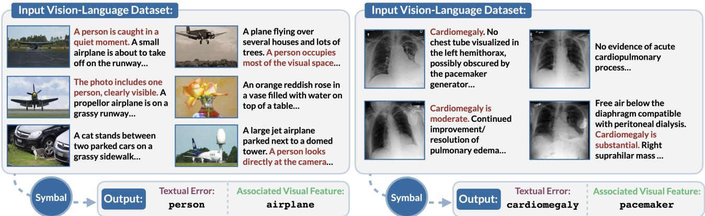  
Figure 1. Given an input dataset with thousands of images and paired MLLM-generated captions, the systematic misalignment detection task involves identifying recurring textual errors and associated visual features. Here, we provide example image-caption pairs from two datasets in SYMBALBENCH with expected outputs.

MLLM-generated captions. Then, as output, the method must identify textual errors (e.g. “cardiomegaly” in the previous example) that are systematically associated with visual features (e.g. “pacemaker” in the previous example).

Addressing the systematic misalignment detection task with automated methods is challenging for the following two reasons. First, vision-language datasets provided as input to automated methods are often large in size with thousands of image-caption pairs; identifying global error patterns from such datasets is nontrivial, especially since the size of such datasets exceeds the reasoning capabilities of even state-ofthe-art models. Second, there are no existing benchmarks for comprehensively evaluating methods on their ability to discover systematic misalignments. In order to address these challenges, we present the following contributions:

• We propose SYMBAL, an automated approach for detecting systematic misalignments in MLLM-generated captions.<sup>1</sup> Our key insight is to structure the systematic misalignment detection task into two stages, with each stage comprised of individual subtasks. The first stage of SYMBAL focuses solely on identifying recurring textual errors in captions; to this end, SYMBAL clusters textual facts based on semantic similarity, scores each cluster by degree of misalignment with paired images, and summarizes the top-ranked cluster into a single unifying concept. The second stage of SYMBAL then leverages this information to identify and describe the associated visual feature.

• We introduce SYMBALBENCH, the first benchmark designed to evaluate automated methods for systematic misalignment detection. SYMBALBENCH consists of 420 image-caption datasets, each paired with a ground-truth label for a systematic misalignment. Methods are then quantitatively evaluated on the extent to which their predictions align with the ground truth.

We evaluate SYMBAL using SYMBALBENCH, analyzing a range of approaches for each subtask. The best configuration of SYMBAL correctly identifies the systematic misalignment in 63.8% of SYMBALBENCH datasets. SYMBAL exhibits a nearly 4x improvement over the closest baseline, demonstrating the utility of our dual-stage, structured approach for addressing the systematic misalignment detection task. Finally, we supplement our evaluations on SYMBALBENCH with real-world evaluations, demonstrating quantitatively and qualitatively that (1) SYMBAL can accurately surface systematic misalignments in captions generated by four MLLMs and (2) SYMBAL is a powerful tool for auditing off-the-shelf datasets with MLLM-generated captions.

Ultimately, we envision our novel task, benchmark, and method aiding in the following real-world contexts. First, our approach reveals insights into failure modes of trained MLLMs, which can (1) provide developers with critical information for building more robust models as well as (2) assist end-users with understanding limitations prior to realworld deployment. For instance, returning to our previous example, physicians using an MLLM in the clinic can be forewarned that generated reports tend to incorrectly diagnose “cardiomegaly” when X-rays have visible “pacemakers”; knowledge of this failure mode can allow for further manual review of model outputs on those cases. Second, our approach can help users identify systematic captioning errors in off-the-shelf datasets, even in black-box settings where access to the underlying MLLM is unavailable. This is a particularly important use-case, especially as publiclyavailable image datasets with MLLM-generated captions become widely used for training the next generation of multimodal foundation models.

Conflict of Interest Disclosure. None. Funding sources are listed in the Acknowledgments at the end of this paper.

## 2. Related Work

Our work builds on three prior lines of study: (1) local misalignment detection methods that identify captioning errors at the per-sample level; (2) global error detection methods that summarize systematic trends in prediction errors; and (3) methods for describing patterns in large datasets with natural language.

Local Misalignment Detection: Given a single image and its paired model-generated caption, one line of recent work has focused on developing metrics that measure image-caption alignment using numeric scores. Examples include reference-free metrics like CLIPScore (Hessel et al., 2021) and PAC-S (Sarto et al., 2023), which do not require the existence of ground-truth captions; on the other hand, reference-based metrics such as BLEU (Papineni et al., 2002), ROUGE (Lin, 2004), CIDEr (Vedantam et al., 2015), METEOR (Banerjee & Lavie, 2005), and Ref-CLIPScore (Hessel et al., 2021) make use of ground-truth captions. The utility of such metrics is typically evaluated using image-caption benchmarks with human-annotated quality judgments (e.g. FLICKR8K-Expert (Hodosh et al., 2013), Pascal-50S (Vedantam et al., 2015), ReXVal (Yu et al., 2023)) or known model-injected errors (e.g. FOIL (Shekhar et al., 2017), ReXErr (Rao et al., 2025)).

Several recent works have extended numeric scoring strategies by proposing interpretable metrics, which are capable of identifying the specific features in model-generated captions that are incorrect with respect to the image. Examples include reference-based metrics like CHAIR (Rohrbach et al., 2018), ALOHa (Petryk et al., 2024), and GREEN (Ostmeier et al., 2024) as well as reference-free metrics like FLEUR (Lee et al., 2024). Our work draws inspiration from these studies by also prioritizing interpretability; our method SYMBAL not only detects whether captioning errors are present but also provides users with a natural language output indicating the erroneous textual facts and associated visual cues. However, our study exhibits a key distinction from this line of work: whereas these metrics evaluate a single image and its paired model-generated caption, our work instead focuses on detecting global, systematic trends in captioning errors.

Global Error Detection: Due to visual biases or spurious correlations learned during training, machine learning models often make systematic prediction errors at test time. Selected examples in the classification setting noted by prior works include (1) an object recognition model that can correctly classify cows in pastoral settings yet demonstrates high error rates when cows are in beach settings (Beery et al., 2018) and (2) a pneumothorax detection model that achieves radiologist-level overall accuracy yet demonstrates high error rates when chest tubes, a medical device used for treatment, are absent (Oakden-Rayner et al., 2020). Detecting such failures is challenging due to the fact that relevant subgroups are typically not annotated in data.

A recent line of work has explored the development of automated methods for identifying global, systematic error patterns in classification settings. Given a validation dataset with images, model predictions, and ground-truth labels, these methods identify specific visual features (e.g. the beach background or the absence of tubes in the above examples) that are associated with higher error rates (Eyuboglu et al., 2022; Jain et al., 2023; Sohoni et al., 2020; Varma et al., 2024). Our work shares a similar goal in identifying systematic error patterns; however, we extend beyond the classification setting to the image captioning setting, where input datasets consist of images and paired model-generated captions. The inclusion of free-form text in input datasets presents an added level of complexity in comparison to labels. Additionally, we explicitly consider settings where ground-truth captions are unavailable.

Describing Datasets with Natural Language: Several works have presented approaches for describing patterns in large datasets using natural language (Burgess et al., 2025). In particular, recent studies have generated natural language descriptions (i) summarizing differences given two input datasets (Dunlap et al., 2024; Zhong et al., 2022) and (ii) summarizing model prediction errors given classification datasets with labels (Eyuboglu et al., 2022; Menon & Srivastava, 2024; Kim et al., 2024). Our work also involves summarizing dataset-level patterns with natural language; however, in our setting, datasets consist of images and paired captions, and descriptions must specifically identify systematic misalignments.

## 3. Task Definition

In this section, we formally introduce the systematic misalignment detection task. Consider a vision-language dataset $\mathcal { D } = \{ ( V _ { i } , T _ { i } ) \} _ { i = 1 } ^ { N }$ consisting of images V paired with free-form, model-generated text $T .$ For example, dataset D may consist of chest X-rays V paired with MLLM-generated radiology reports $T .$ . We will express each text sample $T _ { i }$ as a collection of textual facts $T _ { i } =$ $\{ t _ { 1 } ^ { i } , t _ { 2 } ^ { i } , . . . , t _ { n _ { i } } ^ { i } \}$ and each image $V _ { i }$ as a collection of visual features $V _ { i } = \{ v _ { 1 } ^ { i } , v _ { 2 } ^ { i } , . . . , v _ { m _ { i } } ^ { i } \}$

Dataset D may include misaligned samples, where text $T _ { i }$ does not accurately describe the content of the paired image $V _ { i }$ . We consider a pair $( V _ { i } , T _ { i } )$ to be misaligned if there exists at least one erroneous textual fact $t _ { k } ^ { i } \in T _ { i }$ that does not accurately describe any visual feature $v _ { j } ^ { i } \in V _ { i }$ . Misalignments are particularly egregious when they occur in a systematic fashion, meaning that an erroneous textual fact t is repeatedly associated with the presence of a visual feature v throughout a dataset. For instance, in the medical imaging example discussed earlier, incorrect diagnoses of cardiomegaly in MLLM-generated reports are strongly associated with the presence of a pacemaker in the corresponding chest X-rays; this suggests the existence of a systematic misalignment between reports containing t = cardiomegaly and images containing v = pacemaker.

Thus, given D, the goal of the systematic misalignment detection task is to discover textual errors t that are systematically associated with visual cues v. A method M : $\mathcal { D }  ( \hat { t } , \hat { v } )$ that aims to solve the systematic misalignment detection task will accept dataset $\mathcal { D }$ as input; we note here that datasets may be large in size, consisting of thousands of image-text pairs. Then, method M will predict $( \hat { t } , \hat { v } )$ as output, indicating the discovered textual error t<sup>ˆ</sup>and associated visual feature vˆ; here, both t<sup>ˆ</sup>and vˆ will be expressed in text.

We consider two variants of input dataset D: (1) referencefree, where each sample in dataset $\mathcal { D } ~ = ~ \{ ( V _ { i } , T _ { i } ) \} _ { i = 1 } ^ { N }$ consists of image $V _ { i }$ and model-generated text $T _ { i }$ , and (2) reference-based, where each sample in dataset $\mathcal { D } =$ $\{ ( V _ { i } , T _ { i } , R _ { i } ) \} _ { i = 1 } ^ { N }$ consists of an image $V _ { i } ,$ model-generated text $T _ { i }$ , and a ground-truth reference caption $R _ { i }$

## 4. Our Approach: SYMBAL

The systematic misalignment detection task is made challenging by the fact that vision-language datasets may be complex and large in size; identifying global error patterns from such datasets is nontrivial. In this section, we address this challenge with our approach SYMBAL, which structures the systematic misalignment detection task into two stages. Each stage is comprised of three individual subtasks: grouping, scoring, and summarizing. Sections 4.1 and 4.2 discuss the two stages in detail.

## 4.1. Stage 1: Detecting Erroneous Textual Facts

The first stage of SYMBAL predicts the erroneous textual fact by (1) grouping semantically-similar facts that occur consistently throughout the dataset, (2) scoring each group of facts by degree of misalignment with paired images, (3) and summarizing the top-ranked group of facts into a single unifying concept t<sup>ˆ</sup>. The three subtasks associated with Stage 1 are detailed below:

• Grouping semantically-similar facts: As defined in Section 3, we first express each text sample $T _ { i }$ as a collection of textual facts $T _ { i } ~ = ~ \{ t _ { 1 } ^ { i } , t _ { 2 } ^ { i } , . . . , t _ { n _ { i } } ^ { i } \}$ by splitting captions at the sentence level. We then identify clusters of semantically-similar facts that occur in $\mathcal { D } ;$ for example, in the medical imaging example discussed earlier, perhaps one such cluster will contain sentences from radiology reports that discuss the presence of cardiomegaly. To this end, we aggregate all textual facts in ${ \mathcal { D } } ,$ , forming the set $\textstyle \bigcup _ { i = 1 } ^ { N } T _ { i } = \{ t _ { k } ^ { i } : i = 1 , . . . , N ; k = 1 , . . . , n _ { i } \}$ . Each textual fact in this set is encoded using a text embedding model; then, embeddings are clustered using spherical K-Means, where the number of clusters is selected automatically using Silhouette distance.

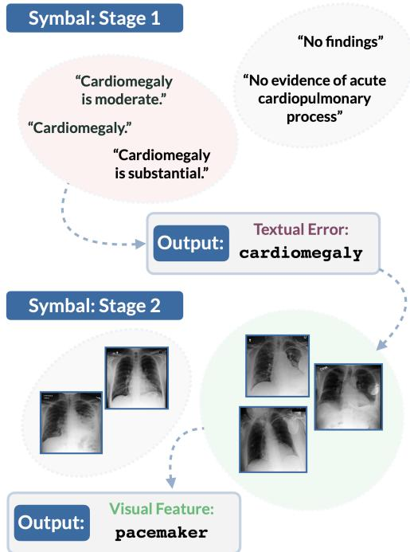  
Figure 2. SYMBAL detects systematic misalignments with a twostage procedure. The first stage involves detecting erroneous textual facts, and the second stage involves detecting associated visual features.

• Scoring groups by degree of misalignment: Next, we score each cluster by computing the mean degree of alignment between constituent textual facts and paired images. Based on methods from prior work (Hessel et al., 2021; Dunlap et al., 2024; Chen et al., 2024a), we consider three options for measuring alignment between a given textual fact and its paired image: (1) embedding scorer, which computes embeddings for the text and image modalities and measures alignment as the cosine similarity, (2) textonly scorer, which generates a caption for the image and tasks an LLM with determining if the textual fact is accurate with respect to the caption, and (3) vision-language scorer, where a MLLM is provided both the image and the textual fact as input and tasked with determining if the textual fact is accurate. Low scores suggest that a large proportion of textual facts in the cluster are misaligned with respect to their paired images.

• Summarizing the top-ranked group: Given the alignment scores computed in the previous step, we identify the cluster exhibiting the highest degree of misalignment, which we refer to as $C _ { t e x t }$ . Then, we apply a text-only summarizer, where an LLM is provided a list of textual facts in $C _ { t e x t }$ and tasked with identifying the unifying concept.

The final output of the summarizer is the predicted erroneous textual fact t<sup>ˆ</sup>; for example, in the medical example discussed earlier, the predicted textual fact may be t<sup>ˆ</sup> = cardiomegaly. In Section 6.1, we evaluate the role of various text embedding models and alignment scorers.

## 4.2. Stage 2: Detecting Associated Visual Features

We now proceed to the second stage of SYMBAL, which predicts the associated visual feature by (1) grouping semantically-similar images paired with text containing fact t<sup>ˆ</sup>, (2) scoring each group of images by degree of misalignment with t<sup>ˆ</sup>, and (3) summarizing the top-ranked group of images into a single unifying concept vˆ. The three subtasks associated with Stage 2 are detailed below:

• Grouping semantically-similar images: We begin by identifying all images $V _ { i } ~ \in ~ { \mathcal { D } }$ containing at least one paired textual fact in cluster $C _ { t e x t }$ (i.e. where $t _ { k } ^ { i } \in C _ { t e x t }$ for some k). Each image in this set is encoded using an image embedding model; then, embeddings are clustered using spherical K-Means, where the number of clusters is selected automatically using Silhouette distance.

• Scoring groups by degree of misalignment: Next, we score each cluster by computing the mean degree of misalignment between images and paired textual facts in $C _ { t e x t }$ . We consider the same scoring mechanisms as in Stage 1. Low scores suggest that a large proportion of images in the cluster are misaligned with fact t<sup>ˆ</sup>.

• Summarizing the top-ranked group: Given the alignment scores computed in the previous step, we identify the cluster exhibiting the highest degree of misalignment, which we will refer to as $C _ { i m a g e }$ . Then, we consider two summarization mechanisms for identifying the unifying concept shared by images in $C _ { i m a g e }$ : (1) text-only summarizer, where a caption is generated for each image in $C _ { i m a g e }$ and an LLM is tasked with identifying the unifying concept, and (2) vision-language summarizer, where an MLLM is provided with images in $C _ { i m a g e }$ and tasked with identifying the unifying concept.

The final output of the summarizer is the predicted visual feature vˆ; for example, in the medical example discussed earlier, the predicted visual feature may be vˆ = pacemaker.

In Section 6.2, we evaluate the role of various image embedding models, alignment scorers, and summarizers.

We note here that some datasets may contain multiple systematic misalignments; SYMBAL can be trivially extended to such settings, as we show in Appendix A and E.

## 5. Benchmark: SYMBALBENCH

The key challenge behind evaluating methods like SYMBAL on real-world vision-language datasets is that ground-truth systematic misalignments are typically unknown. Moreover, collecting human annotations for a task at this scale, where datasets include thousands of images paired with information-dense captions, is simply intractable. Thus, without access to ground-truth annotations, it becomes difficult (1) to determine whether misalignments identified by a method like SYMBAL are accurate and (2) to quantitatively compare results across multiple methods.

In this section, we introduce SYMBALBENCH, which is designed to address this challenge. Specifically, SYMBAL-BENCH utilizes an automated method to inject a pre-defined systematic misalignment into a base vision-language dataset, yielding an evaluation setting where a ground-truth annotation (t, v) is available. The automated nature of our approach provides several key advantages, including (1) the ability to generate hundreds of evaluation settings simply by injecting varied systematic misalignments, (2) the presence of ground-truth labels that are guaranteed to be accurate, and (3) the ability to extend to specialized domains like medical imaging. In Section 6.4, we augment our evaluations on SYMBALBENCH with real-world analyses.

Benchmark Design: SYMBALBENCH consists of 420 evaluation settings, where each setting is comprised of a visionlanguage dataset D and an associated ground-truth label (t,v) representing the systematic misalignment. In order to create each evaluation setting, we (1) obtain a high-quality base dataset with images and paired text, (2) predefine a systematic misalignment (t, v), and (3) inject the erroneous textual fact t into the base dataset such that a strong association exists with visual feature v. Below, we discuss these three steps in detail:

1. Obtaining a base dataset. We begin by obtaining an off-the-shelf vision-language dataset with high-quality samples. We consider two options for the base dataset: COCO (2017 val split) (Lin et al., 2014) and MIMIC-CXR (test split) (Johnson et al., 2019a). COCO consists of natural images depicting common objects from 80 categories. After preprocessing, the base dataset includes a total of 4349 images with associated captions. MIMIC-CXR consists of chest X-rays and associated radiology reports obtained from the Beth Israel Deaconess Medical Center. After preprocessing, the base dataset includes

2233 images, each paired with the “Impressions” section of the corresponding report.

2. Predefining a systematic misalignment. Given a base dataset, we predefine a systematic misalignment consisting of a textual fact t and associated visual feature v. Predefined misalignments are meant to emulate those that are likely to emerge when using real-world, off-the-shelf MLLMs to generate captions. For COCO, we sample t and v from the set of 80 object categories present in the dataset. For MIMIC-CXR, we sample t from a set of five disease categories (cardiomegaly, pneumothorax, atelectasis, pleural effusion, and edema) and v from a set of five medical devices (pacemaker, chest tube, endotracheal tube, surgical clips, sternotomy wires).<sup>2</sup>

3. Injecting the predefined systematic misalignment. We insert the erroneous textual fact t into text samples in the base vision-language dataset such that a strong association exists between text containing t and images containing visual feature v. The strength of the association is controlled using Cramer’s V scores. Each inserted fact t is formatted as a sentence using diverse templates.

We repeat this procedure across the two possible options for the base dataset and a range of possible options for t and $v ,$ yielding 420 evaluation settings encompassing a total of 1.7 million image-text pairs. Additional details are in Appendix B and C.

Benchmark Evaluation: We will use the notation $\{ ( \mathcal { D } _ { s } , ( t _ { s } , v _ { s } ) ) \} _ { s = 1 } ^ { 4 2 0 }$ to represent SYMBALBENCH, where the evaluation setting with index s has an associated dataset $\mathcal { D } _ { s }$ and ground-truth label $( { t _ { s } , v _ { s } } )$ We construct both reference-based and reference-free variants of SYMBAL-BENCH, which differ only with respect to whether $\mathcal { D } _ { s }$ includes reference captions. At evaluation time, dataset $\mathcal { D } _ { s }$ will be provided to method M, which will output a prediction $( \hat { t } _ { s } , \hat { v } _ { s } )$ . We count the prediction as accurate if the top-K predictions for $\hat { t } _ { s }$ include $t _ { s }$ and the top-K predictions for $\hat { v } _ { s }$ include $v _ { s }$ . Here, we evaluate equivalence using LLM-as-a-Judge with Llama3.3-70B (Grattafiori et al., 2024). Overall performance on SYMBALBENCH is measured with Accuracy@K, computed as the percentage of the 420 settings in SYMBALBENCH where the prediction is accurate.

## 6. Results

We now evaluate SYMBAL on the systematic misalignment detection task. In Sections 6.1 and 6.2, we use SYMBAL-

BENCH to analyze the choice of embedding models, alignment scorers, and summarizers. In Section 6.3, we perform end-to-end evaluations of the best configuration of SYM-BAL, comparing with baselines and performing fine-grained analyses. Finally, in Section 6.4, we extend beyond SYM-BALBENCH to real-world settings.

## 6.1. SYMBAL Detects Erroneous Textual Facts

We first evaluate the role of various text embedding models, alignment scorers, and summarizers on the performance of Stage 1 of SYMBAL, which aims to predict the erroneous textual fact $\hat { t } _ { s }$ given an input dataset $\mathcal { D } _ { s }$ in SYMBALBENCH. We compute Accuracy@1 and Accuracy@5 by comparing $\hat { t } _ { s }$ with $t _ { s }$ across all 420 settings in SYMBALBENCH. Results are summarized in Table 1.

For the natural image datasets in SYMBALBENCH, Table 1 Upper demonstrates the performance of the top-four compositions, ranked by Accuracy@5 scores on the reference-free setting. Our results show that the best-performing variant of SYMBAL (shown in Row 1 of Table 1 Upper) achieves strong performance, correctly identifying the erroneous textual fact in 94.2% (Acc@5) of SYMBALBENCH datasets in the reference-free configuration and 82.8% (Acc@5) of SYMBALBENCH datasets in the reference-based configuration. Interestingly, we find that performance in referencefree settings is often substantially higher than performance in the reference-based setting, which is likely a result of the sparse information content often present in COCO reference captions. When considering the composition of SYMBAL, we note that the choice of the alignment scorer appears to be most important; the vision-language scorer substantially outperforms the text-only scorer with the same underlying model (Qwen2.5-72B).

Given these results, we select the Qwen3-Embedding-8B text embedding model (Zhang et al., 2025), the visionlanguage alignment scorer with Qwen2.5-72B (Qwen et al., 2025), and the text-only summarizer with Qwen2.5-72B (Qwen et al., 2025) for all future SYMBAL evaluations on natural images.

For the medical image datasets in SYMBALBENCH, Table 1 Lower demonstrates the performance of the top-four compositions. Our results show that the best-performing variant of SYMBAL (shown in Row 1 of Table 1 Lower) correctly identifies the erroneous textual feature in 75.0% (Acc@5) of datasets in the reference-free configuration and 95.0% (Acc@5) of datasets in the reference-based configuration. In contrast to the natural image datasets, we find that the reference-free configuration is harder than the referencebased configuration, likely due to the complexity of medical image data; alignment scoring in this domain is challenging without access to reference text. We also note that a key advantage of SYMBAL is its ability to extend to specialized domains simply by interchanging constituent models with domain-specific versions.

Table 1. We evaluate various text embedding models, alignment scorers, and summarizers on the performance of SYMBAL Stage 1.

<table><tr><td rowspan="2"></td><td rowspan="2">Text Embedding</td><td rowspan="2">Alignment Scorer</td><td rowspan="2">Summarizer</td><td colspan="2">Reference-Free</td><td colspan="2">Reference-Based</td></tr><tr><td>Acc@1</td><td>Acc@5</td><td>Acc@1</td><td>Acc@5</td></tr><tr><td rowspan="4">Natural</td><td>Qwen3-8B</td><td>Vision-Language (Qwen-72B)</td><td>Text-Only (Qwen-72B)</td><td>92.8</td><td>94.2</td><td>80.8</td><td>82.8</td></tr><tr><td>OpenCLIP</td><td>Vision-Language (Qwen-72B)</td><td>Text-Only (Qwen-72B)</td><td>92.8</td><td>93.9</td><td>86.1</td><td>87.8</td></tr><tr><td>Qwen3-8B</td><td>Text-Only (Qwen-72B)</td><td>Text-Only (Qwen-72B)</td><td>82.8</td><td>85.0</td><td>81.9</td><td>83.9</td></tr><tr><td>OpenCLIP</td><td>Text-Only (Qwen-72B)</td><td>Text-Only (Qwen-72B)</td><td>64.2</td><td>67.2</td><td>67.5</td><td>71.4</td></tr><tr><td rowspan="4">Medical</td><td>XRayCLIP</td><td>Text-Only (MedGemma-27B)</td><td>Text-Only (MedGemma-27B)</td><td>51.7</td><td>75.0</td><td>88.3</td><td>95.0</td></tr><tr><td>XRayCLIP</td><td>Text-Only (MedGemma-27B)</td><td>Text-Only (Qwen-72B)</td><td>51.7</td><td>73.3</td><td>100.0</td><td>100.0</td></tr><tr><td>XRayCLIP</td><td>Text-Only (Qwen-72B)</td><td>Text-Only (MedGemma-27B)</td><td>26.7</td><td>58.3</td><td>90.0</td><td>93.3</td></tr><tr><td>MedSigLIP</td><td>Text-Only (MedGemma-27B)</td><td>Text-Only (MedGemma-27B)</td><td>30.0</td><td>53.3</td><td>83.3</td><td>100.0</td></tr></table>

Table 2. We evaluate various image embedding models, alignment scorers, and summarizers on the performance of SYMBAL Stage 2.

<table><tr><td rowspan="2"></td><td rowspan="2">Image Embedding</td><td rowspan="2">Alignment Scorer</td><td rowspan="2">Summarizer</td><td colspan="2">Reference-Free</td><td colspan="2">Reference-Based</td></tr><tr><td>Acc@1</td><td>Acc@5</td><td>Acc@1</td><td>Acc@5</td></tr><tr><td rowspan="4">Natural</td><td>OpenCLIP</td><td>Vision-Language (Qwen-72B)</td><td>Text-Only (Qwen-72B)</td><td>49.7</td><td>69.7</td><td>41.9</td><td>52.2</td></tr><tr><td>OpenCLIP</td><td>Embedding (OpenCLIP)</td><td>Vision-Language (Qwen-72B)</td><td>48.1</td><td>63.9</td><td>42.5</td><td>55.6</td></tr><tr><td>OpenCLIP</td><td>Embedding (OpenCLIP)</td><td>Text-Only (Qwen-72B)</td><td>47.8</td><td>62.8</td><td>43.9</td><td>55.8</td></tr><tr><td>OpenCLIP</td><td>Vision-Language (Qwen-72B)</td><td>Vision-Language (Qwen-72B)</td><td>45.8</td><td>62.5</td><td>38.9</td><td>52.2</td></tr><tr><td rowspan="4">Medical</td><td>XRayCLIP</td><td>Embedding (MedSigLIP)</td><td>Vision-Language (MedGemma-27B)</td><td>11.7</td><td>36.7</td><td>28.3</td><td>53.3</td></tr><tr><td>MedSigLIP</td><td>Embedding (MedSigLIP)</td><td>Vision-Language (MedGemma-27B)</td><td>11.7</td><td>31.7</td><td>25.0</td><td>46.7</td></tr><tr><td>OpenCLIP</td><td>Embedding (MedSigLIP)</td><td>Vision-Language (MedGemma-27B)</td><td>13.3</td><td>28.3</td><td>20.0</td><td>46.7</td></tr><tr><td>MedSigLIP</td><td>Embedding (XRayCLIP)</td><td>Vision-Language (MedGemma-27B)</td><td>10.0</td><td>28.3</td><td>33.3</td><td>60.0</td></tr></table>

Given these results, we select the XRayCLIP-ViT-L text embedding model (Chen et al., 2024c), the text-only alignment scorer with MedGemma-27B (Sellergren et al., 2025), and the text-only summarizer with MedGemma-27B (Sellergren et al., 2025) for all future SYMBAL evaluations on medica images.

## 6.2. SYMBAL Detects Associated Visual Features

We next evaluate the role of various image embedding models, alignment scorers, and summarizers on the performance of Stage 2 of SYMBAL. We hold the composition of Stage 1 constant using results from Section 6.1. We compute Accuracy@1 and Accuracy@5 by comparing $\hat { v } _ { s }$ with $v _ { s }$ across all 420 settings in SYMBALBENCH. Results are summarized in Table 2.

For the natural image datasets in SYMBALBENCH, Table 2 Upper demonstrates the performance of the top-four compositions, ranked by Accuracy@5 scores on the reference-free setting. Our results show that the best-performing variant of SYMBAL (shown in Row 1 of Table 2 Upper) correctly identifies the visual feature in 69.7% (Acc@5) of datasets in the reference-free configuration and 52.2% (Acc@5) of datasets in the reference-based configuration. We observe that performance values in Table 2 are lower than Table 1, suggesting that identifying visual features that systematically occur with textual errors is substantially more challenging than identifying the textual error itself. We also observe that the best-performing variant of SYMBAL utilizes the same alignment scorer and summarizer as in Stage 1.

Given these results, we select the OpenCLIP-ViT-H image embedding model (Ilharco et al., 2021), vision-language alignment scorer with Qwen2.5-72B (Qwen et al., 2025), and text-only summarizer with Qwen2.5-72B (Qwen et al., 2025) for all future SYMBAL evaluations on natural images.

For the medical image datasets in SYMBALBENCH, Table 2 Lower demonstrates the performance of the top-four compositions, ranked by Accuracy@5 scores on the reference-free setting. Our results show that the best-performing variant of SYMBAL (shown in Row 1 of Table 2 Lower) correctly identifies the visual feature in 36.7% (Acc@5) of datasets in the reference-free configuration and 53.3% (Acc@5) of datasets in the reference-based configuration. Our results suggest that identifying visual features in the medical domain is a particularly challenging task in both reference-free and reference-based settings, and consequently, the optimal composition of alignment scorers and summarizers differs markedly from those identified in Stage 1.

Given these results, we select the XRayCLIP-ViT-L image embedding model (Chen et al., 2024c), embedding alignment scorer with MedSigLIP (Sellergren et al., 2025), and vision-language summarizer with MedGemma-27B (Sellergren et al., 2025) for future evaluations on medical images.

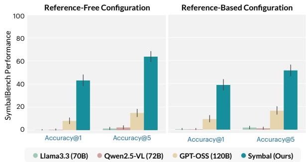

Figure 3. SYMBAL demonstrates strong end-to-end performance on SYMBALBENCH, substantially outperforming baselines.  
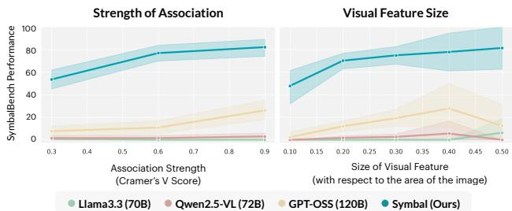  
Figure 4. We report performance on SYMBALBENCH (referencefree) stratified across association strengths and visual feature sizes. This analysis focuses on natural image settings in SYMBALBENCH.

## 6.3. SYMBAL Shows Strong End-to-End Performance

Given an optimal composition of SYMBAL, we now perform end-to-end analyses across SYMBALBENCH. Since our study proposes a novel task, there are no existing baselines for comparison. As a result, we compare the structured, dual-stage approach of SYMBAL to a single-stage, directprompting method where each dataset $\mathcal { D } _ { s }$ is directly provided to an off-the-shelf LLM in the form of a text prompt; the LLM is then instructed to output the erroneous textual fact and the associated visual feature. Three state-of-the-art LLMs are considered (i.e. Llama3.3 70B, Qwen2.5-VL 72B, and GPT-OSS 120B), selected to ensure a fair comparison with SYMBAL due to comparable parameter counts. As the token length of the direct prompts far surpasses the context window of these LLMs, we use only a sample of each dataset, ensuring that the final inference procedure requires no more compute resources than SYMBAL.

In Figure 3, we measure the extent to which SYMBAL can accurately predict both the textual fact $\hat { t } _ { s }$ and the visual feature $\hat { v } _ { s }$ across both the reference-free and reference-based variants of SYMBALBENCH. Results show that the systematic misalignment detection task is highly challenging in both experimental settings, with several baselines generating few correct predictions. SYMBAL successfully identifies the systematic misalignment in up to 63.8% of datasets in SYMBALBENCH, with the highest performance observed in the reference-free setting (Accuracy@5). SYMBAL outperforms the closest baseline (GPT-OSS 120B) across all experimental settings, with GPT-OSS 120B correctly identifying the misalignment in only 17.1% of SYMBALBENCH datasets in the best case. These results demonstrate that the structured, dual-stage approach utilized by SYMBAL provides substantial performance benefits over single-stage, direct prompting baselines.

In Figure 4, we provide a stratified breakdown of SYM-BAL performance. SYMBAL outperforms baselines across highly-challenging subsets of SYMBALBENCH where (1) the strength of the systematic misalignment is weak (i.e. weak association between the textual error and visual feature as measured by Cramer’s V scores) and (2) visual features are small in size.

Extended results and ablations are provided in Appendix Section D.

## 6.4. SYMBAL Extends to Real-World Settings

In this section, we further demonstrate the utility of SYM-BAL by supplementing our evaluations on SYMBALBENCH with additional quantitative and qualitative analyses in realworld settings. Our results show that (1) SYMBAL can accurately surface systematic misalignments in captions generated by off-the-shelf MLLMs and (2) SYMBAL is a powerful tool for auditing vision-language datasets.

SYMBAL can accurately surface systematic misalignments in captions generated by off-the-shelf MLLMs. First, we use SYMBAL to analyze captions generated by four real-world off-the-shelf MLLMs: Llava1.5-7B (Liu et al., 2024), Llava1.5-13B (Liu et al., 2024), AyaVision-8B (Dash et al., 2025), and LlavaOneVision-7B (Li et al., 2025). We utilize each model to generate captions for the COCO dataset (2017 val split); we then apply SYMBAL (reference-free) to predict systematic misalignments (t<sup>ˆ</sup>, vˆ).

As discussed in Section 5, evaluating predictions in realworld settings is highly challenging since ground-truth systematic misalignments are unknown. Here, in order to address this issue, we validate identified systematic misalignments in two ways. First, we qualitatively validate the existence of SYMBAL-identified systematic misalignments with visual analysis. Second, we quantitatively validate whether a link between erroneous fact t<sup>ˆ</sup> and visual feature vˆ truly exists; to this end, we measure whether model-generated captions are indeed more likely to include erroneous references to t<sup>ˆ</sup>when vˆ is present compared to when vˆ is absent. In order to perform this evaluation, we use a state-of-the-art open-set object detector (Minderer et al., 2023) to annotate the presence of vˆ in each image, and we use our topperforming alignment scorer (vision-language scorer with Qwen-72B) to annotate erroneous references to t<sup>ˆ</sup> in each caption. In Appendix E, we demonstrate that automated annotations align closely with human judgments.

  
In the heart of a cozy kitchen, a woman and a ShareGPT4V Captions man are sharing a moment of celebration. The woman, dressed in a vibrant blue shirt, is seated on the left side of the table. She's holding a rectangular cake, its surface adorned with lit candles that flicker in the soft light, Her smile is infectious, reflecting the joy of the occasion. On the right side o the table, a man in a gray shirt is seated. Hi gaze is directed towards the woman, perhaps sharing in her happiness or waiting for his turn to blow out the candles. The table they're sitting at is draped with a pristine white tablecloth, adding to the festive atmosphere…

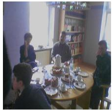  
In the heart of a cozy room, a group of people are gathered around a table, engrossed in conversation. The table, draped in a pristine white tablecloth, is adorned with plates, cups, and utensils, ready for a meal. A cake, the centerpiece of the gathering, sits in the middle of the table, inviting the guests to partake in its sweet delight.The room itself exudes a warm and inviting atmosphere. A bookshelf stands in the background, filled with various books that hint at the intellectual pursuits of the inhabitants. A window punctuates the wall, allowing natural light to filter into the room and illuminate the scene…

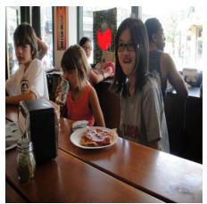  
In the heart of a bustling restaurant, a group of children are gathered around a table, their faces alight with anticipation. The table, draped in a pristine white tablecloth, serves as the centerpiece of their gathering. On it, a plate of food awaits to be savored, while a jar of condiments stands by, ready to enhance the flavors of their meal. The children, dressed in casual attire, are engrossed in their own world, their attention focused on the plate of food. Their expressions are hidden from view, adding an air of mystery to the scene. In the background, the restaurant continues its lively rhythm…

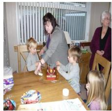  
In the heart of a cozy living room, a family of five is gathered around a wooden table, engrossed in the simple joy of a birthday celebration. The table, draped in a pristine white tablecloth, serves as the centerpiece of their gathering. On the table, a vibrant birthday cake steals the show. It's a feast for the eyes with its red, white, and blue colors. The cake is adorned with candles, their flames flickering in the soft light, casting a warm glow on the faces of the family. A woman, presumably the birthday celebrant, is in the midst of cutting the cake. Her hands are steady, her focus unwavering as she prepares to serve the first slice…

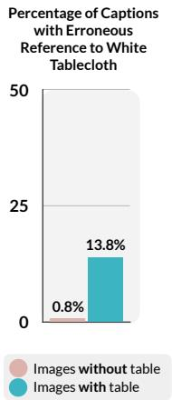  
Percentage of Captions Figure 5. SYMBAL discovers systematic misalignments in ShareGPT4V, an off-the-shelf dataset with model-generated captions.

SYMBAL identifies several systematic misalignments. In g<sup>e</sup> captions generated by Llava1.5-7B, SYMBAL detects that I<sup>m</sup>erroneous references to a handbag or a handbag on the ground (t<sup>ˆ</sup>) in captions are often systematically associated with the presence of a bus (vˆ) in a scene, as shown The image captures a scene of a busy The in Figure 9 [Row 2]. Quantitatively, our analysis finds that n<sup>s</sup> Dominating the scene is a wooden desk, its setup. Dominating the scene is a wooden deserroneous references to a handbag in model-generated a<sup>p computer</sup> <sup>monitors</sup> <sup>stand</sup> <sup>side</sup> <sup>by</sup> <sup>side,</sup> <sup>their</sup> <sub>screens</sub> <sub>glowing</sub> <sub>with</sub> <sub>unseen</sub> <sub>data.</sub> <sub>A</sub> <sup>positioned</sup> <sup>on</sup> <sup>the</sup> <sup>left</sup> <sup>side.</sup> <sup>The</sup> <sup>desk</sup> <sup>is</sup> <sup>a</sup> <sup>hub</sup> <sub>of</sub> <sub>activity,</sub> <sub>hosting</sub> <sub>a</sub> <sub>variety</sub> <sub>of</sub> <sub>objects.</sub> <sub>A</sub> <sup>obje</sup><sub>lapt</sub>captions are indeed 3.1 times more likely when a bus is <sub>4</sub><sup>V</sup> of the trade for the digital age. To the left of its screen alive with the vibrant hues of a tall, ipresent in the image compared to when a bus is absent, G<sup>P but</sup> <sup>ready</sup> <sup>to</sup> <sup>connect</sup> <sup>at</sup> <sup>a</sup> <sup>moment's</sup> <sup>notice.</sup> <sup>the</sup> <sup>monitor,</sup> <sup>a</sup> <sup>phone</sup> <sup>lies</sup> <sup>idle,</sup> <sup>its</sup> <sup>cord</sup> <sup>trailing</sup> <sup>tho</sup>validating the SYMBAL prediction. In captions generated <sub>h</sub>a the desk are various office supplies pens, spring into action at a moment's notice. prinby LlavaOneVision-7B, SYMBAL detects that erroneous <sup>role</sup> <sup>in</sup> <sup>the</sup> <sup>symphony</sup> <sup>of</sup> <sup>work.</sup> <sup>Above</sup> <sup>the</sup> <sup>task,</sup> <sup>while</sup> <sup>a</sup> <sup>stack</sup> <sup>of</sup> <sup>books</sup> <sup>suggests</sup> <sup>a</sup> <sup>thirst</sup> <sup>eve</sup>references to text (t<sup>ˆ</sup>) in captions are often systematically <sup>binders,</sup> <sup>a</sup> <sup>testament</sup> <sup>to</sup> <sup>knowledge… wor</sup>associated with the presence of a sign (vˆ) in a scene, as shown in Figure 10 [Row 2]. This finding suggests that LlavaOneVision-7B struggles with OCR capabilities, where s the presence of text-based signage in an image is likely to <sup>a</sup>result in errors in the generated caption. Quantitatively, our analysis finds that erroneous references to text in modelgenerated captions are indeed 4.6 times more likely when a sign is present in the image compared to when a sign s bathed in the soft glow of a desk lamp. setup. Dominating the scene is a wooden <sub>The</sub> is absent, validating the SYMBAL prediction. Additional pti <sup>grainy</sup> <sup>texture</sup> <sup>adding</sup> <sup>a</sup> <sup>touch</sup> <sup>of</sup> <sup>warmth</sup> <sup>to</sup> <sub>the</sub> <sub>setting.</sub> <sub>On</sub> <sub>the</sub> <sub>left</sub> <sub>side</sub> <sub>of</sub> <sub>the</sub> <sub>desk,</sub> <sub>a</sub> <sup>is</sup> <sup>a</sup> <sup>hub</sup> <sup>of</sup><sub>objects.</sub> <sub>O</sub>examples can be found in Appendix E.

4<sup>V</sup> white keyboard waits patiently for the next tall, its screen blank. A black keyboard lies in <sup>the</sup> <sup>l</sup><sub>open</sub>SYMBAL is a powerful tool for auditing open-source <sub>e</sub>G <sup>black</sup> <sup>phone</sup> <sup>lies</sup> <sup>dormant,</sup> <sup>its</sup> <sup>screen</sup> <sup>dark.</sup><sub>It's</sub> <sub>as</sub> <sub>if</sub> <sub>it's</sub> <sub>patiently</sub> <sub>waiting</sub> <sub>for</sub> <sub>a</sub> <sub>call</sub> <sub>or</sub> <sup>thoughts</sup> <sup>into</sup> <sup>words.</sup> <sup>A</sup> <sup>black</sup> <sup>mouse</sup> <sup>sits</sup> <sup>next</sup> <sub>to</sub> <sub>the</sub> <sub>keyboard,</sub> <sub>poised</sub> <sub>to</sub> <sub>navigate</sub> <sub>the</sub> <sub>digital</sub> for tvision-language datasets. Second, we use SYMBAL to h the phone, a black mouse sits idle, its cord printer waits patiently for its next task. A <sup>disp</sup>analyze ShareGPT4V, an open-source image dataset with <sup>side</sup> <sup>of</sup> <sup>the</sup> <sup>desk,</sup> <sup>a</sup> <sup>plant</sup> <sup>adds</sup> <sup>a</sup> <sup>touch</sup> <sup>of</sup> <sup>everconnected.</sup> <sup>A</sup> <sup>black</sup> <sup>lamp</sup> <sup>stands</sup> <sup>guard</sup> for nMLLM-generated captions commonly used as a pretraining dataset for vision-language models (Chen et al., 2024b). We sample a subset of 10k image-caption pairs from the ShareGPT4V dataset, and we then apply SYMBAL (reference-free) to predict systematic misalignments (t<sup>ˆ</sup>, vˆ). Here, SYMBAL detects that erroneous references to a white tablecloth (t<sup>ˆ</sup>) in captions are often systematically associated with the presence of a table, cake, and/or people (vˆ) in the scene, as shown in Figure 5. Quantitatively, our analysis finds that erroneous references to a white tablecloth in model-generated captions are indeed 17.2 times more likely when a table is present <sup>Reference</sup> <sup>to</sup> <sup>Printer</sup>in the image compared to when a table is absent, vali-<sup>50</sup>dating the SYMBAL prediction. Additional examples are provided in Appendix E.

As large-scale datasets like ShareGPT4V become increas-<sub>25</sub>ingly prevalent, it becomes critical for users to be aware ting the scene is a wooden workspace, bathed in the soft glow of of potential systematic misalignments, as these errors can <sup>ivity,</sup> <sup>hosting</sup> <sup>a</sup> <sup>variety</sup> <sup>of</sup> <sub>e</sub> <sub>left</sub> <sub>side</sub> <sub>of</sub> <sub>the</sub> <sub>desk,</sub> <sub>an</sub> <sub>open</sub> <sup>desk,</sup> <sup>its</sup> <sup>surface</sup> <sup>a</sup> <sup>tableau</sup> <sup>of</sup> <sup>productivity.</sup> <sub>Two</sub> <sub>computer</sub> <sub>monitors</sub> <sub>stand</sub> <sub>side</sub> <sub>by</sub> <sub>side,</sub> propagate to trained models. Specifically, if a dataset cont to it, a black monitor stands A keyboard and mouse lie in front of them, tains a systematic misalignment between erroneous textual onitor, ready to translate right of the monitors, a printer sits quietly, 0fact t<sup>ˆ</sup> and visual feature vˆ, models trained on the dataset <sup>rd,</sup> <sup>poised</sup> <sup>to</sup> <sup>navigate</sup> <sup>the</sup> <sup>digital</sup> <sub>right</sub> <sub>of</sub> <sub>the</sub> <sub>monitor,</sub> <sub>a</sub> <sub>black</sub> <sup>physical</sup> <sup>copies.</sup> <sup>Nearby,</sup> <sup>a</sup> <sup>phone</sup> <sup>rests,</sup> <sup>silent</sup> <sub>for</sub> <sub>now</sub> <sub>but</sub> <sub>capable</sub> <sub>of</sub> <sub>connecting</sub> <sub>this</sub> Images withoutare likely to learn spurious correlations between t<sup>ˆ</sup> and vˆ, ests next to it, silent but stands guard in the background, its shelves <sub>Images</sub> <sub>with</sub>leading to prediction errors at test-time (Varma et al., 2024). <sup>one,</sup> <sup>ready</sup> <sup>to</sup> <sup>bathe</sup> <sup>the</sup> <sub>light</sub> <sub>when</sub> <sub>night</sub> <sub>falls…</sub> <sup>of</sup> <sup>the</sup> <sup>desk,</sup> <sup>a</sup> <sup>chair</sup> <sup>waits</sup> <sup>patiently</sup> <sup>for</sup> <sup>its</sup> <sub>occupant.</sub>SYMBAL can aid users with understanding limitations of datasets with MLLM-generated captions as well as assist with Erroneous model developers with improving performance of MLLMs.

## 7. Discussion

In this work, we introduce the systematic misalignment detection task, which aims to identify textual errors in MLLMgenerated captions that are systematically associated with thed in the soft glow of natural is a wooden desk, its surface adorned with visual features. We hope that our novel task, method SYM-Dominating the scene is a white <sup>laptop</sup> <sup>sits</sup> <sup>open,</sup> <sup>its</sup> <sup>screen</sup> <sup>glowing</sup> <sup>with</sup> <sup>unseen</sup> <sub>data.</sub> <sub>Adjacent</sub> <sub>to</sub> <sub>the</sub> <sub>laptop,</sub> <sub>a</sub> <sub>black</sub> <sub>phone</sub> <sub>5.5%</sub>BAL, and benchmark SYMBALBENCH can help users au-<sup>f</sup> <sup>the</sup> <sup>desk,</sup> <sup>a</sup> <sup>black</sup> <sup>laptop</sup> <sup>sits</sup> <sub>en</sub> <sub>glowing</sub> <sub>with</sub> <sub>unseen</sub> <sub>data.</sub> a curved neck stands sentinel on the right side of 0.1%dit MLLM-generated captions and identify critical failure right side of the desk is a hub of <sup>immediate</sup> <sup>surroundings.</sup> <sup>The</sup> <sup>desk</sup> <sup>itself</sup> <sup>is</sup> <sup>a</sup> tableau of organized chaos, with papers modes, even without access to the underlying MLLM.

## <sup>ver</sup> <sup>ready</sup> <sup>for</sup> <sup>communication… The</sup> <sup>image</sup> <sup>is</sup> <sup>tak</sup>sense of depth aImpact Statement

The goal of our work is to improve transparency into a critical class of captioning errors in image-text datasets. As datasets with model-generated captions gain in popularity and become widely adopted into training datasets for the next generation of multimodal foundation models, it becomes critical to audit data and understand potential quality issues before use. We hope that our novel task, benchmark, and method can help make progress towards this goal, particularly in safety-critical domains like medicine.

## Acknowledgments

MV is supported by graduate fellowship awards from the Knight-Hennessy Scholars program at Stanford University, the Quad program, and the United States Department of Defense (NDSEG). AC is supported by NIH grants R01 HL167974, R01HL169345, R01 AR077604, R01 EB002524, R01 AR079431, P41 EB027060, AY2 AX000045, and 1AYS AX0000024-01; ARPA-H grants AY2AX000045 and 1AYSAX0000024-01; and NIH contracts 75N92020C00008 and 75N92020C00021. AC has provided consulting services to Patient Square Capital, Chondrometrics GmbH, and Elucid Bioimaging; is cofounder of Cognita; has equity interest in Cognita, Subtle Medical, LVIS Corp, Brain Key. CL is supported by NIH grants R01 HL155410, R01 HL157235, by AHRQ grant R18HS026886, and by the Gordon and Betty Moore Foundation. CL is also supported by the Medical Imaging and Data Resource Center (MIDRC), which is funded by the National Institute of Biomedical Imaging and Bioengineering (NIBIB) under contract 75N92020C00021 and through the Advanced Research Projects Agency for Health (ARPA-H).

This research was funded, in part, by the Advanced Research Projects Agency for Health (ARPA-H). The views and conclusions contained in this document are those of the authors and should not be interpreted as representing the official policies, either expressed or implied, of the U.S. Government.

## References

Banerjee, S. and Lavie, A. METEOR: An automatic metric for MT evaluation with improved correlation with human judgments. In Goldstein, J., Lavie, A., Lin, C.-Y., and Voss, C. (eds.), Proceedings of the ACL Workshop on Intrinsic and Extrinsic Evaluation Measures for Machine Translation and/or Summarization, pp. 65–72, Ann Arbor, Michigan, June 2005. Association for Computational Linguistics. URL https://aclanthology.org/ W05-0909/.

Bannur, S., Bouzid, K., Castro, D. C., Schwaighofer, A., Thieme, A., Bond-Taylor, S., Ilse, M., Perez-Garc´ ´ıa, F., Salvatelli, V., Sharma, H., Meissen, F., Ranjit, M., Srivastav, S., Gong, J., Codella, N. C. F., Falck, F., Oktay, O., Lungren, M. P., Wetscherek, M. T., Alvarez-Valle, J., and Hyland, S. L. Maira-2: Grounded radiology report generation, 2024. URL https://arxiv.org/abs/ 2406.04449.

Beery, S., Van Horn, G., and Perona, P. Recognition in terra incognita. In Proceedings of the European Conference on Computer Vision (ECCV), September 2018.

Burgess, J., Wang, X., Zhang, Y., Rau, A., Lozano, A.,

Dunlap, L., Darrell, T., and Yeung-Levy, S. Video action differencing. In The Thirteenth International Conference on Learning Representations, 2025. URL https:// openreview.net/forum?id=3bcN6xlO6f.

Chen, D., Chen, R., Zhang, S., Wang, Y., Liu, Y., Zhou, H., Zhang, Q., Wan, Y., Zhou, P., and Sun, L. MLLMas-a-judge: Assessing multimodal LLM-as-a-judge with vision-language benchmark. In Forty-first International Conference on Machine Learning, 2024a. URL https: //openreview.net/forum?id=dbFEFHAD79.

Chen, L., Li, J., Dong, X., Zhang, P., He, C., Wang, J., Zhao, F., and Lin, D. Sharegpt4v: Improving large multi-modal models with better captions. In European Conference on Computer Vision, pp. 370–387. Springer, 2024b.

Chen, Z., Varma, M., Xu, J., Paschali, M., Veen, D. V., Johnston, A., Youssef, A., Blankemeier, L., Bluethgen, C., Altmayer, S., Valanarasu, J. M. J., Muneer, M. S. E., Reis, E. P., Cohen, J. P., Olsen, C., Abraham, T. M., Tsai, E. B., Beaulieu, C. F., Jitsev, J., Gatidis, S., Delbrouck, J.-B., Chaudhari, A. S., and Langlotz, C. P. A visionlanguage foundation model to enhance efficiency of chest x-ray interpretation, 2024c. URL https://arxiv. org/abs/2401.12208.

Dash, S., Nan, Y., Dang, J., Ahmadian, A., Singh, S., Smith, M., Venkitesh, B., Shmyhlo, V., Aryabumi, V., Beller-Morales, W., Pekmez, J., Ozuzu, J., Richemond, P., Locatelli, A., Frosst, N., Blunsom, P., Gomez, A., Zhang, I., Fadaee, M., Govindassamy, M., Roy, S., Galle, M., Ermis,´ B., Ust<sup>¨</sup> un, A., and Hooker, S. Aya vision: Advancing¨ the frontier of multilingual multimodality, 2025. URL https://arxiv.org/abs/2505.08751.

Delbrouck, J.-B., Chambon, P., Chen, Z., Varma, M., Johnston, A., Blankemeier, L., Van Veen, D., Bui, T., Truong, S., and Langlotz, C. RadGraph-XL: A largescale expert-annotated dataset for entity and relation extraction from radiology reports. In Ku, L.-W., Martins, A., and Srikumar, V. (eds.), Findings of the Association for Computational Linguistics: ACL 2024, pp. 12902– 12915, Bangkok, Thailand, August 2024. Association for Computational Linguistics. doi: 10.18653/v1/2024. findings-acl.765. URL https://aclanthology. org/2024.findings-acl.765/.

Dunlap, L., Zhang, Y., Wang, X., Zhong, R., Darrell, T., Steinhardt, J., Gonzalez, J. E., and Yeung-Levy, S. Describing differences in image sets with natural language. In Conference on Computer Vision and Pattern Recognition (CVPR), 2024.

Eyuboglu, S., Varma, M., Saab, K., Delbrouck, J.-B., Lee-Messer, C., Dunnmon, J., Zou, J., and Re, C. Domino:´

Discovering systematic errors with cross-modal embeddings. International Conference on Learning Representations (ICLR), 2022. doi: 10.48550/ARXIV.2203.14960. URL https://arxiv.org/abs/2203.14960.

Grattafiori, A., Dubey, A., Jauhri, A., Pandey, A., Kadian, A., Al-Dahle, A., Letman, A., Mathur, A., et al. The llama 3 herd of models, 2024. URL https://arxiv. org/abs/2407.21783.

Hardy, R., Kim, S. E., Ro, D. H., and Rajpurkar, P. Rextrust: A model for fine-grained hallucination detection in ai-generated radiology reports. In Wu, J., Zhu, J., Xu, M., and Jin, Y. (eds.), Proceedings of The First AAAI Bridge Program on AI for Medicine and Healthcare, volume 281 of Proceedings of Machine Learning Research, pp. 173–182. PMLR, 25 Feb 2025. URL https://proceedings.mlr.press/ v281/hardy25a.html.

Hessel, J., Holtzman, A., Forbes, M., Le Bras, R., and Choi, Y. CLIPScore: A reference-free evaluation metric for image captioning. In Moens, M.-F., Huang, X., Specia, L., and Yih, S. W.-t. (eds.), Proceedings of the 2021 Conference on Empirical Methods in Natural Language Processing, pp. 7514–7528, Online and Punta Cana, Dominican Republic, November 2021. Association for Computational Linguistics. doi: 10.18653/v1/2021.emnlp-main. 595. URL https://aclanthology.org/2021. emnlp-main.595/.

Hodosh, M., Young, P., and Hockenmaier, J. Framing image description as a ranking task: Data, models and evaluation metrics. Journal of Artificial Intelligence Research, 47: 853–899, August 2013. ISSN 1076-9757. doi: 10.1613/ jair.3994. URL http://dx.doi.org/10.1613/ jair.3994.

Ilharco, G., Wortsman, M., Wightman, R., Gordon, C., Carlini, N., Taori, R., Dave, A., Shankar, V., Namkoong, H., Miller, J., Hajishirzi, H., Farhadi, A., and Schmidt, L. Openclip, July 2021. URL https://doi.org/10. 5281/zenodo.5143773.

Irvin, J., Rajpurkar, P., Ko, M., Yu, Y., Ciurea-Ilcus, S., Chute, C., Marklund, H., Haghgoo, B., Ball, R., Shpanskaya, K., Seekins, J., Mong, D. A., Halabi, S. S., Sandberg, J. K., Jones, R., Larson, D. B., Langlotz, C. P., Patel, B. N., Lungren, M. P., and Ng, A. Y. Chexpert: a large chest radiograph dataset with uncertainty labels and expert comparison. In Proceedings of the Thirty-Third AAAI Conference on Artificial Intelligence and Thirty-First Innovative Applications of Artificial Intelligence Conference and Ninth AAAI Symposium on Educational Advances in Artificial Intelligence, AAAI’19/IAAI’19/EAAI’19. AAAI

Press, 2019. ISBN 978-1-57735-809-1. doi: 10.1609/ aaai.v33i01.3301590. URL https://doi.org/10. 1609/aaai.v33i01.3301590.

Jain, S., Lawrence, H., Moitra, A., and Madry, A. Distilling model failures as directions in latent space. In The Eleventh International Conference on Learning Representations, 2023. URL https://openreview.net/ forum?id=99RpBVpLiX.

Johnson, A. E. W., Pollard, T. J., Greenbaum, N. R., Lungren, M. P., ying Deng, C., Peng, Y., Lu, Z., Mark, R. G., Berkowitz, S. J., and Horng, S. Mimic-cxr-jpg, a large publicly available database of labeled chest radiographs, 2019a. URL https://arxiv.org/abs/ 1901.07042.

Johnson, J., Douze, M., and Jegou, H. Billion-scale similar-´ ity search with GPUs. IEEE Transactions on Big Data, 7 (3):535–547, 2019b.

Kim, Y., Mo, S., Kim, M., Lee, K., Lee, J., and Shin, J. Discovering and mitigating visual biases through keyword explanation. In Proceedings of the IEEE/CVF Conference on Computer Vision and Pattern Recognition (CVPR), pp. 11082–11092, June 2024.

Kumar, A., Kriz, A., Havaei, M., and Arbel, T. PRISM: High-resolution & precise counterfactual medical image generation using language-guided stable diffusion. In Medical Imaging with Deep Learning, 2025. URL https://openreview.net/forum? id=UpJMAlZNuo.

Lee, Y., Park, I., and Kang, M. FLEUR: An explainable reference-free evaluation metric for image captioning using a large multimodal model. In Ku, L.-W., Martins, A., and Srikumar, V. (eds.), Proceedings of the 62nd Annual Meeting of the Association for Computational Linguistics (Volume 1: Long Papers), pp. 3732–3746, Bangkok, Thailand, August 2024. Association for Computational Linguistics. doi: 10.18653/v1/2024.acl-long. 205. URL https://aclanthology.org/2024. acl-long.205/.

Li, B., Zhang, Y., Guo, D., Zhang, R., Li, F., Zhang, H., Zhang, K., Zhang, P., Li, Y., Liu, Z., and Li, C. LLaVA-onevision: Easy visual task transfer. Transactions on Machine Learning Research, 2025. ISSN 2835- 8856. URL https://openreview.net/forum? id=zKv8qULV6n.

Li, Y., Du, Y., Zhou, K., Wang, J., Zhao, X., and Wen, J.-R. Evaluating object hallucination in large vision-language models. In The 2023 Conference on Empirical Methods in Natural Language Processing, 2023. URL https: //openreview.net/forum?id=xozJw0kZXF.

Lin, C.-Y. ROUGE: A package for automatic evaluation of summaries. In Text Summarization Branches Out, pp. 74–81, Barcelona, Spain, July 2004. Association for Computational Linguistics. URL https: //aclanthology.org/W04-1013/.

Lin, T.-Y., Maire, M., Belongie, S., Hays, J., Perona, P., Ramanan, D., Dollar, P., and Zitnick, C. L. Microsoft´ coco: Common objects in context. In Fleet, D., Pajdla, T., Schiele, B., and Tuytelaars, T. (eds.), Computer Vision – ECCV 2014, pp. 740–755, Cham, 2014. Springer International Publishing. ISBN 978-3-319-10602-1.

Liu, H., Li, C., Li, Y., and Lee, Y. J. Improved baselines with visual instruction tuning. In 2024 IEEE/CVF Conference on Computer Vision and Pattern Recognition (CVPR), pp. 26286–26296, 2024. doi: 10.1109/CVPR52733.2024. 02484.

Liu, Y., Liang, Z., Wang, Y., Wu, X., Tang, F., He, M., Li, J., Liu, Z., Yang, H., Lim, S., and Zhao, B. Unveiling the ignorance of mllms: Seeing clearly, answering incorrectly. In Proceedings of the IEEE/CVF Conference on Computer Vision and Pattern Recognition (CVPR), pp. 9087–9097, June 2025.

Menon, R. and Srivastava, S. DISCERN: Decoding systematic errors in natural language for text classifiers. In Al-Onaizan, Y., Bansal, M., and Chen, Y.-N. (eds.), Proceedings of the 2024 Conference on Empirical Methods in Natural Language Processing, pp. 19565–19583, Miami, Florida, USA, November 2024. Association for Computational Linguistics. doi: 10.18653/v1/2024.emnlp-main. 1091. URL https://aclanthology.org/2024. emnlp-main.1091/.

Minderer, M., Gritsenko, A. A., and Houlsby, N. Scaling open-vocabulary object detection. In Thirty-seventh Conference on Neural Information Processing Systems, 2023. URL https://openreview.net/forum? id=mQPNcBWjGc.

Nakaura, T., Yoshida, N., Kobayashi, N., Shiraishi, K., Nagayama, Y., Uetani, H., Kidoh, M., Hokamura, M., Funama, Y., and Hirai, T. Preliminary assessment of automated radiology report generation with generative pre-trained transformers: comparing results to radiologistgenerated reports. Japanese Journal of Radiology, 42 (2):190–200, September 2023. ISSN 1867-108X. doi: 10.1007/s11604-023-01487-y. URL http://dx.doi. org/10.1007/s11604-023-01487-y.

Oakden-Rayner, L., Dunnmon, J., Carneiro, G., and Re, C. Hidden stratification causes clinically meaningful failures in machine learning for medical imaging. In Proceedings of the ACM Conference on Health, Inference, and Learning, CHIL ’20, pp. 151–159, New

York, NY, USA, 2020. Association for Computing Machinery. ISBN 9781450370462. doi: 10.1145/ 3368555.3384468. URL https://doi.org/10. 1145/3368555.3384468.

OpenAI, Achiam, J., Adler, S., Agarwal, S., Ahmad, L., Akkaya, I., Aleman, F. L., Almeida, D., Altenschmidt, J., Altman, S., Anadkat, S., et al. Gpt-4 technical report, 2024. URL https://arxiv.org/abs/2303. 08774.

Oquab, M., Darcet, T., Moutakanni, T., Vo, H. V., Szafraniec, M., Khalidov, V., Fernandez, P., HAZIZA, D., Massa, F., El-Nouby, A., Assran, M., Ballas, N., Galuba, W., Howes, R., Huang, P.-Y., Li, S.-W., Misra, I., Rabbat, M., Sharma, V., Synnaeve, G., Xu, H., Jegou, H., Mairal, J., Labatut, P., Joulin, A., and Bojanowski, P. DINOv2: Learning robust visual features without supervision. Transactions on Machine Learning Research, 2024. ISSN 2835-8856. URL https:// openreview.net/forum?id=a68SUt6zFt. Featured Certification.

Ostmeier, S., Xu, J., Chen, Z., Varma, M., Blankemeier, L., Bluethgen, C., Md, A. E. M., Moseley, M., Langlotz, C., Chaudhari, A. S., and Delbrouck, J.-B. GREEN: Generative radiology report evaluation and error notation. In Al-Onaizan, Y., Bansal, M., and Chen, Y.-N. (eds.), Findings of the Association for Computational Linguistics: EMNLP 2024, pp. 374–390, Miami, Florida, USA, November 2024. Association for Computational Linguistics. doi: 10.18653/v1/2024.findings-emnlp. 21. URL https://aclanthology.org/2024. findings-emnlp.21/.

Papineni, K., Roukos, S., Ward, T., and Zhu, W.-J. Bleu: a method for automatic evaluation of machine translation. In Isabelle, P., Charniak, E., and Lin, D. (eds.), Proceedings of the 40th Annual Meeting of the Association for Computational Linguistics, pp. 311–318, Philadelphia, Pennsylvania, USA, July 2002. Association for Computational Linguistics. doi: 10.3115/1073083.1073135. URL https://aclanthology.org/P02-1040/.

Petryk, S., Chan, D. M., Kachinthaya, A., Zou, H., Canny, J., Gonzalez, J. E., and Darrell, T. ALOHa: A new measure for hallucination in captioning models. In Duh, K., Gomez, H., and Bethard, S. (eds.), Proceedings of the 2024 Conference of the North American Chapter of the Association for Computational Linguistics: Human Language Technologies (Volume 2: Short Papers), pp. 342–357, Mexico City, Mexico, June 2024. Association for Computational Linguistics. doi: 10.18653/v1/2024. naacl-short.30. URL https://aclanthology. org/2024.naacl-short.30/.

Qwen, :, Yang, A., Yang, B., Zhang, B., Hui, B., Zheng, B., Yu, B., Li, C., Liu, D., Huang, F., Wei, H., et al. Qwen2.5 technical report, 2025. URL https://arxiv.org/ abs/2412.15115.

Rao, V. M., Zhang, S., Acosta, J. N., Adithan, S., and Rajpurkar, P. Rexerr: Synthesizing clinically meaningful errors in diagnostic radiology reports. In Biocomputing 2025, pp. 70–81, 2025. doi: 10.1142/9789819807024 0006. URL https://www.worldscientific.com/doi/ abs/10.1142/9789819807024\_0006.

Rohrbach, A., Hendricks, L. A., Burns, K., Darrell, T., and Saenko, K. Object hallucination in image captioning. In Riloff, E., Chiang, D., Hockenmaier, J., and Tsujii, J. (eds.), Proceedings of the 2018 Conference on Empirical Methods in Natural Language Processing, pp. 4035–4045, Brussels, Belgium, October-November 2018. Association for Computational Linguistics. doi: 10.18653/v1/D18-1437. URL https: //aclanthology.org/D18-1437/.

Sarto, S., Barraco, M., Cornia, M., Baraldi, L., and Cucchiara, R. Positive-augmented contrastive learning for image and video captioning evaluation. In Proceedings of the IEEE/CVF Conference on Computer Vision and Pattern Recognition (CVPR), pp. 6914–6924, June 2023.

Sarto, S., Cornia, M., and Cucchiara, R. Image captioning evaluation in the age of multimodal llms: challenges and future perspectives. In Proceedings of the Thirty-Fourth International Joint Conference on Artificial Intelligence, IJCAI ’25, 2025. ISBN 978-1-956792-06-5. doi: 10. 24963/ijcai.2025/1180. URL https://doi.org/10. 24963/ijcai.2025/1180.

Sellergren, A., Kazemzadeh, S., Jaroensri, T., Kiraly, A., Traverse, M., Kohlberger, T., Xu, S., Jamil, F., et al. Medgemma technical report, 2025. URL https:// arxiv.org/abs/2507.05201.

Shekhar, R., Pezzelle, S., Klimovich, Y., Herbelot, A., Nabi, M., Sangineto, E., and Bernardi, R. FOIL it! find one mismatch between image and language caption. In Barzilay, R. and Kan, M.-Y. (eds.), Proceedings of the 55th Annual Meeting of the Association for Computational Linguistics (Volume 1: Long Papers), pp. 255–265, Vancouver, Canada, July 2017. Association for Computational Linguistics. doi: 10.18653/v1/P17-1024. URL https://aclanthology.org/P17-1024/.

Sohoni, N., Dunnmon, J., Angus, G., Gu, A., and Re, C.´ No subclass left behind: Fine-grained robustness in coarse-grained classification problems. In Larochelle, H., Ranzato, M., Hadsell, R., Balcan, M. F., and Lin, H. (eds.), Advances in Neural Information Processing

Systems, volume 33, pp. 19339–19352. Curran Associates, Inc., 2020. URL https://proceedings. neurips.cc/paper/2020/file/ e0688d13958a19e087e123148555e4b4-Paper. pdf.

Sourget, T., Hestbek-Møller, M., Jimenez-S ´ anchez, A.,´ Junchi Xu, J., and Cheplygina, V. Mask of truth: Model sensitivity to unexpected regions of medical images. Journal of Imaging Informatics in Medicine, 2025. ISSN 2948-2933. doi: 10.1007/ s10278-025-01531-5. URL http://dx.doi.org/ 10.1007/s10278-025-01531-5.

Varma, M., Delbrouck, J.-B., Chen, Z., Chaudhari, A., and Langlotz, C. RaVL: Discovering and mitigating spurious correlations in fine-tuned vision-language models. In Globerson, A., Mackey, L., Belgrave, D., Fan, A., Paquet, U., Tomczak, J., and Zhang, C. (eds.), Advances in Neural Information Processing Systems, volume 37, pp. 82235– 82264. Curran Associates, Inc., 2024. doi: 10.52202/ 079017-2614.

Varma, M., Delbrouck, J.-B., Ostmeier, S., Chaudhari, A., and Langlotz, C. TRoVe: Discovering error-inducing static feature biases in temporal vision-language models. In Belgrave, D., Zhang, C., Lin, H., Pascanu, R., Koniusz, P., Ghassemi, M., and Chen, N. (eds.), Advances in Neural Information Processing Systems, volume 38, pp. 9934–9967. Curran Associates, Inc., 2025.

Vedantam, R., Lawrence Zitnick, C., and Parikh, D. Cider: Consensus-based image description evaluation. In Proceedings of the IEEE Conference on Computer Vision and Pattern Recognition (CVPR), June 2015.

Yu, F., Endo, M., Krishnan, R., Pan, I., Tsai, A., Reis, E. P., Fonseca, E. K. U. N., Lee, H. M. H., Abad, Z. S. H., Ng, A. Y., Langlotz, C. P., Venugopal, V. K., and Rajpurkar, P. Evaluating progress in automatic chest x-ray radiology report generation. Patterns, 4(9):100802, 2023. ISSN 2666-3899. doi: https://doi.org/10.1016/j.patter.2023.100802. URL https://www.sciencedirect.com/ science/article/pii/S2666389923001575.

Zhang, Y., Jiang, H., Miura, Y., Manning, C. D., and Langlotz, C. P. Contrastive learning of medical visual representations from paired images and text. Machine Learning for Healthcare, abs/2010.00747, 2022. URL https://arxiv.org/abs/2010.00747.

Zhang, Y., Li, M., Long, D., Zhang, X., Lin, H., Yang, B., Xie, P., Yang, A., Liu, D., Lin, J., Huang, F., and Zhou, J. Qwen3 embedding: Advancing text embedding and reranking through foundation models. arXiv preprint arXiv:2506.05176, 2025.

Zhong, R., Snell, C., Klein, D., and Steinhardt, J. Describing differences between text distributions with natural language. In Chaudhuri, K., Jegelka, S., Song, L., Szepesvari, C., Niu, G., and Sabato, S. (eds.), Proceedings of the 39th International Conference on Machine Learning, volume 162 of Proceedings of Machine Learning Research, pp. 27099–27116. PMLR, 17–23 Jul 2022. URL https://proceedings.mlr.press/ v162/zhong22a.html.

Zhou, Y., Cui, C., Yoon, J., Zhang, L., Deng, Z., Finn, C., Bansal, M., and Yao, H. Analyzing and mitigating object hallucination in large vision-language models. In The Twelfth International Conference on Learning Representations, 2024. URL https://openreview.net/ forum?id=oZDJKTlOUe.

## Appendix

## Contents

\- A. Implementation Details for SYMBOL ...... 15
- B. Implementation Details for SYMBOLBENCH ...... 18
- C. SYMBOLBENCH Descriptive Statistics ...... 19
- D. Extended Results ...... 22
- E. Evaluating SYMBOL in the Wild ...... 24

## A. Implementation Details for SYMBAL

SYMBAL decomposes the systematic misalignment detection task into two stages; here, we provide extended implementation details for each of these stages.

## A.1. Implementation Details for SYMBAL Stage 1

Subtask 1: Grouping semantically-similar facts. We express each text sample T<sub>i</sub> as a collection of textual facts $T _ { i } = \{ t _ { 1 } ^ { i } , t _ { 2 } ^ { i } , . . . , t _ { n _ { i } } ^ { i } \}$ by splitting captions at the sentence-level. We opt to use sentence-level splitting in this work because each sentence in a long-form caption typically captures a semantically-meaningful, self-contained fact. Sentence-level splitting has been utilized in prior literature (e.g. (Zhang et al., 2022)). We note here that there may be settings where this strategy is sub-optimal, such as when a sentence does not represent a self-contained fact and instead relies on previous context. In such cases, users of SYMBAL can easily adjust this design choice by modifying the definition of “textual fact” to cover relevant context.

After aggregating all textual facts in D forming the set $\textstyle \bigcup _ { i = 1 } ^ { N } T _ { i } ,$ we encode each fact using a text embedding model. For natural image datasets in SYMBALBENCH derived from COCO, we consider two options for text embedding models: OpenCLIP-ViT-H-14-quickgelu (Ilharco et al., 2021) and Qwen3-Embedding-8B (Zhang et al., 2025). For medical image datasets in SYMBALBENCH derived from MIMIC-CXR, we consider three options for text embedding models: OpenCLIP-ViT-H-14-quickgelu (Ilharco et al., 2021), XRayCLIP-ViT-L (Chen et al., 2024c), and MedSigLIP (Sellergren et al., 2025). Of these, XrayCLIP-ViT-L and MedSigLIP are trained on radiology datasets. Embeddings are then clustered using spherical K-Means (implemented in Faiss (Johnson et al., 2019b)), where we sweep across a range of potential cluster numbers and select the optimal number of clusters using Silhouette distance; this approach is motivated by prior work (Sohoni et al., 2020; Varma et al., 2025).

Subtask 2: Scoring groups by degree of misalignment. We score each cluster by computing the average degree of alignment between constituent textual facts and paired images. We consider three possible scoring mechanisms, explained in detail below:

• Embedding scorer: Given a textual fact and its paired image, the embedding scorer utilizes an off-the-shelf vision-language model to compute embeddings for the text and image modalities. Alignment is measured by computing cosine similarity. This method is motivated by metrics like CLIPScore (Hessel et al., 2021), which have shown strong correlation with human judgments when measuring caption quality. For natural image datasets in SYMBALBENCH derived from COCO, we implement the embedding scorer with OpenCLIP-ViT-H-14-quickgelu (Ilharco et al., 2021) as the vision-language model. For medical image datasets in SYMBALBENCH derived from MIMIC-CXR, we consider three options for the embedding scorer: OpenCLIP-ViT-H-14-quickgelu (Ilharco et al., 2021), XRayCLIP-ViT-L (Chen et al., 2024c), and MedSigLIP (Sellergren et al., 2025). We note here that we do not alter the embedding scorer for reference-based settings; reference captions $R _ { i }$ in our benchmark often have substantially more information than the single textual fact $t _ { k } ^ { i } \in T _ { i }$ , and this information imbalance is challenging to capture with embedding scorers.

• Text-only scorer: Given a textual fact and its paired image, the text-only scorer first generates a caption for the image and then prompts an LLM to determine if the textual fact is accurate with respect to the caption. For natural image datasets in SYMBALBENCH derived from COCO, we implement the text-only scorer using Llama-3.2-11B-Vision-Instruct • Text-only summarizer: The text-only summarizer provides an LLM with textual facts in $C _ { t e x t }$ ; the LLM is then tasked with identifying the unifying concept. For natural image datasets in SYMBALBENCH derived from COCO, we use Qwen2.5-VL-72B-Instruct (Qwen et al., 2025) as the LLM. For medical image datasets in SYMBALBENCH derived from MIMIC-CXR, we consider both Qwen2.5-VL-72B-Instruct (Qwen et al., 2025) and MedGemma-27B (Sellergren et al., 2025) as the LLM.

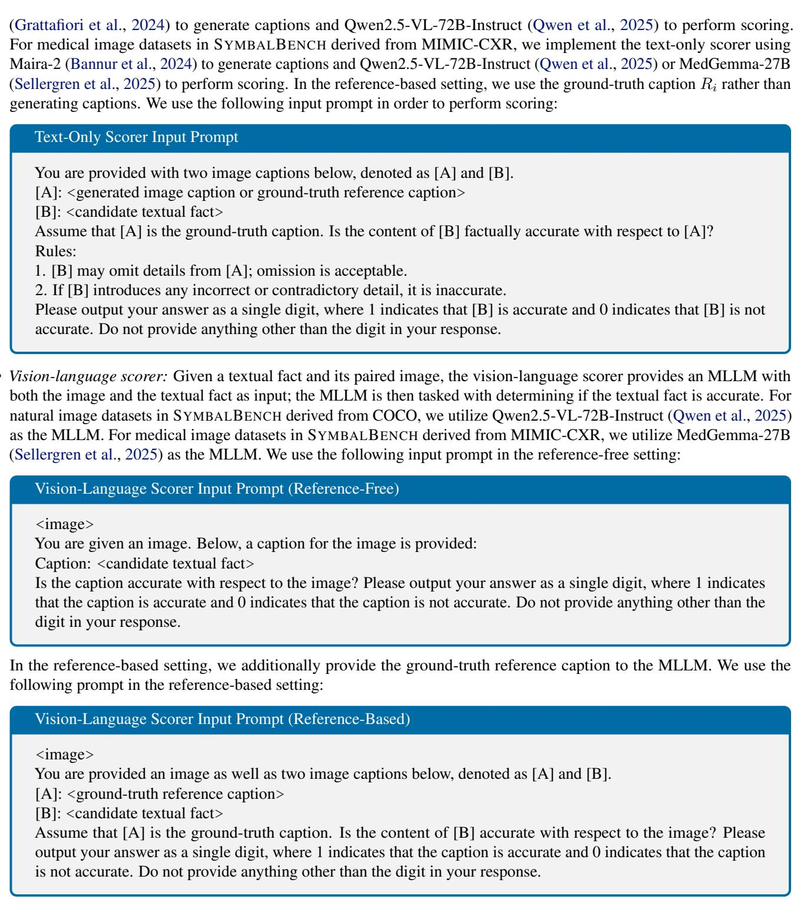  
Subtask 3: Summarizing the top-ranked group. We consider the following summarization mechanism for identifying the unifying concept shared by textual facts in $C _ { t e x t }$

We use the following input prompt. Then, given the output, we prompt the same LLM to select the most frequently identified feature (or the top-k most frequently identified features) as output.

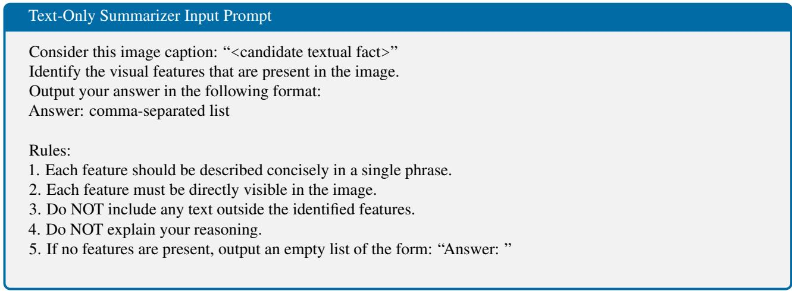

## A.2. Implementation Details for SYMBAL Stage 2

Subtask 1: Grouping semantically-similar images. For natural image datasets in SYMBALBENCH derived from COCO, we consider two options for image embedding models: OpenCLIP-ViT-H-14-quickgelu (Ilharco et al., 2021) and DINOv2- ViT-L-14 (Oquab et al., 2024). For medical image datasets in SYMBALBENCH derived from MIMIC-CXR, we consider three options for image embedding models: OpenCLIP-ViT-H-14-quickgelu (Ilharco et al., 2021), XRayCLIP-ViT-L (Chen et al., 2024c), and MedSigLIP (Sellergren et al., 2025). Similar to Stage 1, embeddings are clustered using spherical K-Means, where we sweep across a range of cluster numbers and select the optimal number using Silhouette distance.

Subtask 2: Scoring groups by degree of misalignment. We score each cluster by computing the mean degree of misalignment between images and paired textual facts in $C _ { t e x t }$ . We consider the same scoring mechanisms as in Stage 1.

Subtask 3: Summarizing the top-ranked group. We consider two summarization mechanisms for identifying the unifying concept shared by images in C<sub>image</sub>, described in detail below.

• Text-only summarizer: The text-only summarizer generates a caption for each image in $C _ { i m a g e } ;$ then, an LLM is tasked with identifying the unifying concept. For natural image datasets in SYMBALBENCH derived from COCO, captions are generated using Llama-3.2-11B-Vision-Instruct (Grattafiori et al., 2024). For medical image datasets in SYMBALBENCH, captions are generated using MAIRA-2 (Bannur et al., 2024). In reference-based settings, we use the ground-truth reference captions rather than generating captions. We use the same prompts and models as Stage 1, Subtask 3.

• Vision-language summarizer: The vision-language summarizer provides an MLLM with images in C<sub>image</sub>; then, the MLLM is prompted to identify the unifying concept. For natural image datasets in SYMBALBENCH derived from COCO, we use Qwen2.5-VL-72B-Instruct (Qwen et al., 2025) as the MLLM. For medical image datasets in SYMBALBENCH derived from MIMIC-CXR, we use MedGemma-27B (Sellergren et al., 2025) as the MLLM. For reference-based settings, we also provide the ground-truth reference caption to the MLLM.

We use the following input prompt. Then, given the outputs, we prompt the same MLLM to select the most frequently identified feature (or the top-k most frequently identified features) as output.

```txt
Vision-Language Summarizer Input Prompt
<image>
Consider this image.
Identify the visual features that are present in the image.
Output your answer in the following format:
```

## Answer: comma-separated list

Rules:

1. Each feature should be described concisely in a single phrase.

2. Each feature must be directly visible in the image.

3. Do NOT include any text outside the identified features.

4. Do NOT explain your reasoning.

5. If no features are present, output an empty list of the form: “Answer: ”

6. Include a maximum of ten features.

## A.3. Extension to Multiple Systematic Misalignments

Real-world datasets are likely to include multiple systematic misalignments, and SYMBAL can be trivially extended to such settings as follows. Stage 1 of SYMBAL involves predicting the erroneous textual fact t<sup>ˆ</sup>; here, rather than summarizing the single top ranked group of facts into a unifying concept, we can simply consider the top-k ranked groups instead. This will result in multiple predicted textual facts $\hat { t } ^ { ( 1 ) } , \breve { { \hat { t } } } ^ { ( 2 ) } , . . . \hat { t } ^ { ( k ) }$ , each representing a distinct recurring textual error in the dataset. Stage 2 of SYMBAL can then be implemented as described in Section 4.2, taking into account each predicted textual fact; this will result in associated visual features $\hat { v } ^ { ( 1 ) } , \hat { v } ^ { ( 2 ) } , . . . \hat { v } ^ { ( k ) }$ . Ultimately, at the conclusion of this procedure, SYMBAL will predict multiple systematic misalignments $( \hat { t } ^ { ( i ) } , \hat { v } ^ { ( i ) } )$ where i ranges from 1 to k. In Figure 9, we empirically show that Symbal can accurately detect multiple real-world systematic misalignments in captions generated by Llava1.5-7B.

## B. Implementation Details for SYMBALBENCH

SYMBALBENCH is comprised of 420 evaluation settings, where 360 settings include natural image datasets derived from COCO and 60 settings include medical image datasets derived from MIMIC-CXR. Below, we provide extended implementation details for the natural image settings:

1. Obtaining a base dataset. The base vision-language datasets in the natural image domain are derived from COCO (2017 val split), which consists of photographs depicting common objects (e.g. animals, food, furniture, etc.) in natural settings. Images are paired with object-level annotations as well as five human-written captions, with each caption typically consisting of a single sentence or phrase describing salient features in the image. In order to ensure that objects are clearly visible in the image, we exclude annotations for all tiny objects, defined as objects that take up less than 5% of the area of the image. After filtering out images with no remaining object-level annotations, we are left with a base dataset consisting of 4349 images and associated captions. We then compose a new two-sentence caption for each image by randomly sampling two captions from the provided list of five captions.

2. Predefining a systematic misalignment. We then predefine a systematic misalignment consisting of a textual fact t and the associated visual feature v. We sample v from the set of 80 object categories present in the dataset. Then, we sample t from the set of 80 object categories (such that $t \neq v )$ utilizing three possible sampling strategies: (1) random, where t is sampled randomly, (2) popular, where t is sampled from the list of the top-ten most popular objects in the COCO training set, and (3) adversarial, where t is the object that most commonly co-occurs with v in the COCO training set. These sampling strategies are motivated by prior work (Li et al., 2023) and are meant to capture a range of possible error patterns that may emerge in real-world MLLM-generated captions.

3. Injecting the predefined systematic misalignment. We insert the erroneous textual fact t into captions in the base dataset, ensuring that an association exists between text containing t and images containing visual feature v; this procedure ensures that the misalignment is systematic. Importantly, we ensure that feature t is not already in the image-caption pair prior to injection. We consider three levels of association, as measured by Cramer’s V: low association (Cramer’s ${ \bf V } =$ 0.3), moderate association (Cramer’s V = 0.6), and high association (Cramer’s V = 0.9). In order to format textual fact t into a sentence, we generate 50 templates using GPT-4o (OpenAI et al., 2024), select a template at random, and insert t.

We repeat this injection procedure for all possible choices of t and v in order to obtain 360 evaluation settings, each consisting of an image-caption dataset and paired annotation (t,v).

Below, we provide extended implementation details for the medical image settings:

1. Obtaining a base dataset. The base vision-language datasets in the medical image domain are derived from MIMIC CXR (test split), which consists of chest X-rays and associated radiologist reports collected at Beth Israel Deaconess Medical Center. We preprocess the dataset by (1) removing all images with non-frontal imaging views, (2) removing all images with missing “Impressions” sections in the paired report, and (3) removing all sentences in reports without “present” disease or anatomy entities, as identified by an off-the-shelf medical entity annotation tool (Delbrouck et al., 2024). After preprocessing, we are left with a base dataset consisting of 2233 images, each paired with the “Impressions” section of the corresponding report.

2. Predefining a systematic misalignment. We sample t from a set of five disease categories selected from the commonlyused CheXpert annotation list (Irvin et al., 2019): cardiomegaly, pneumothorax, atelectasis, pleural effusion, and edema. We sample v from a set of five medical devices: pacemaker, chest tube, endotracheal tube, surgical clips, sternotomy wires. We select these options for t and v since medical devices often co-occur with diseases, yet there is no deterministic, universal link. Models often learn spurious associations between devices and diseases as documented in prior work (Oakden-Rayner et al., 2020), meaning that such errors are highly plausible in MLLM-generated reports.

3. Injecting the predefined systematic misalignment. We insert the erroneous textual fact t into reports in the base dataset, using Cramer’s V to control the level of association with visual feature v. We use a combination of physician annotations, automated annotations from the CheXpert labeler (Irvin et al., 2019), and automated annotations from RadGraph-XL (Delbrouck et al., 2024) in order to identify whether or not t and v are present in the image-report pair prior to injection. In order to format textual fact t into a sentence, we identify the 50 most frequently occurring sentences in the MIMIC-CXR training set that discuss the presence of t and select a sentence from this list at random.

We repeat this injection procedure for all possible choices of t and v in order to obtain 60 evaluation settings, each consisting of an image-caption dataset and paired annotation (t,v).

In reference-based settings, we also include a ground-truth caption $R _ { i }$ along with each image-text pair $( V _ { i } , T _ { i } ) \in \mathcal { D }$ . For natural image datasets derived from COCO, $R _ { i }$ takes the form of a three-sentence caption combining the three human-written captions not originally selected as part of $T _ { i } .$ For medical image datasets derived from MIMIC-CXR, $R _ { i }$ takes the form of the “Findings” and “Impressions” sections of the original physician-written radiology report. We emphasize that $T _ { i }$ may contain errors as a result of the error-injection procedure detailed above; however, $R _ { i }$ is always accurate.

We determine if predictions are equivalent to the ground-truth by leveraging LLM-as-a-Judge. We use Llama3.3-70B in all experiments as the LLM, leveraging the ollama implementation with default parameters. The input prompt is:

## LLM-as-a-Judge Evaluation Prompt

You are given two short text phrases.

Model response: <predicted textual error or predicted visual feature>

Ground truth: <ground-truth textual error or ground-truth visual feature>

Your task is to determine if both phrases refer to the same visual feature. Please output 1 if both the model response and the correct answer refer to the same feature or 0 if the model response and the correct answer do not refer to the same feature. Do not provide anything other than the number in your response.

## C. SYMBALBENCH Descriptive Statistics

In this section, we provide descriptive statistics summarizing the composition of SYMBALBENCH. SYMBALBENCH includes 420 settings covering two domains (with 360 natural image settings and 60 medical image settings). In Table 3, we provide a list of all ground-truth systematic misalignments (t, v) included in SYMBALBENCH.

In Figure 6, we summarize SYMBALBENCH with histograms detailing (1) the size of each dataset, (2) the strength of the injected systematic misalignment in each dataset as measured with Cramer’s V, (3) the proportion of image-text pairs in each dataset containing the injected textual error t, and (4) the proportion of image-text pairs in each dataset containing the visual feature v. In Figure 7, we provide additional descriptive statistics on the natural image subset of SYMBALBENCH consisting of datasets derived from COCO; here, we provide histograms detailing (1) the mean size of the visual feature in each dataset (measured as the proportion of the total image area) and (2) the category of systematic misalignment (random popular, or adversarial) as discussed in Appendix Section B.

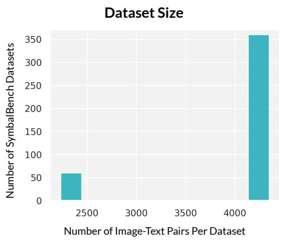

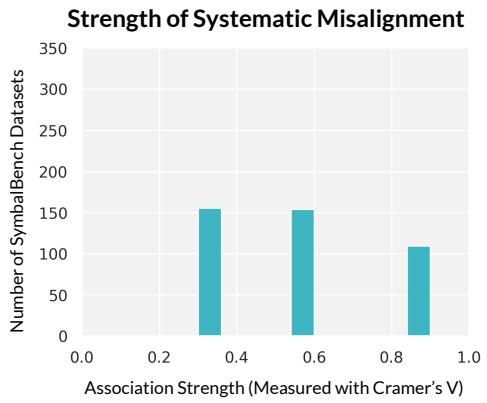

Frequency of Injected Textual Error (t)  
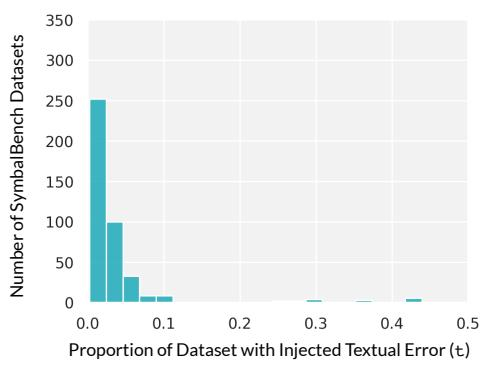

Frequency of Visual Feature (v)  
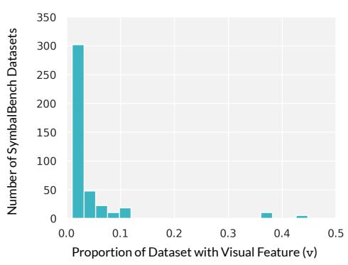  
Figure 6. Here, we provide histograms summarizing the composition of datasets included in SYMBALBENCH.

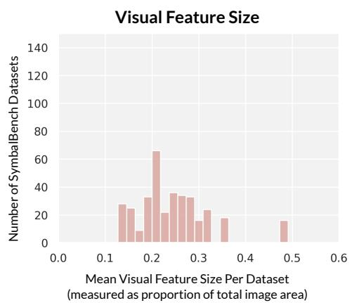

Systematic Misalignment Category  
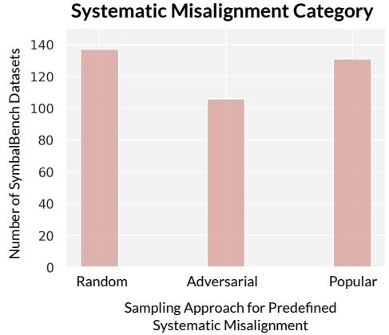  
Figure 7. We provide additional descriptive statistics summarizing the composition of the 360 natural image datasets in SYMBALBENCH. We note here that if multiple sampling strategies yield the same predefined systematic misalignment, more than one category will be assigned to the same dataset; thus, the total count for the systematic misalignment category histogram may exceed 360.

Table 3. Here, we provide a list of all ground-truth systematic misalignments (t, v) included in SYMBALBENCH.

<table><tr><td>Erroneous Textual Fact t</td><td>Visual Feature v</td><td>Erroneous Textual Fact t</td><td>Visual Feature v</td><td>Erroneous Textual Fact t</td><td>Visual Feature v</td></tr><tr><td>surfboard</td><td>airplane</td><td>person</td><td>airplane</td><td>bottle</td><td>airplane</td></tr><tr><td>person</td><td>banana</td><td>chair</td><td>banana</td><td>car</td><td>banana</td></tr><tr><td>kite</td><td>bed</td><td>person</td><td>bed</td><td>chair</td><td>bed</td></tr><tr><td>person</td><td>bench</td><td>handbag</td><td>bench</td><td>oven</td><td>bench</td></tr><tr><td>hot dog</td><td>bicycle</td><td>person</td><td>bicycle</td><td>truck</td><td>bicycle</td></tr><tr><td>person</td><td>bird</td><td>wine glass</td><td>bird</td><td>book</td><td>bird</td></tr><tr><td>truck</td><td>boat</td><td>person</td><td>boat</td><td>bicycle</td><td>boat</td></tr><tr><td>toilet</td><td>book</td><td>cup</td><td>book</td><td>person</td><td>book</td></tr><tr><td>pizza</td><td>bottle</td><td>person</td><td>bottle</td><td>elephant</td><td>bowl</td></tr><tr><td>car</td><td>bowl</td><td>dining table</td><td>bowl</td><td>cat</td><td>broccoli</td></tr><tr><td>dining table</td><td>broccoli</td><td>car</td><td>broccoli</td><td>handbag</td><td>bus</td></tr><tr><td>frisbee</td><td>bus</td><td>person</td><td>bus</td><td>bicycle</td><td>cake</td></tr><tr><td>dining table</td><td>cake</td><td>chair</td><td>cake</td><td>fork</td><td>car</td></tr><tr><td>person</td><td>car</td><td>car</td><td>cat</td><td>umbrella</td><td>cat</td></tr><tr><td>person</td><td>cat</td><td>airplane</td><td>chair</td><td>person</td><td>chair</td></tr><tr><td>car</td><td>chair</td><td>bottle</td><td>couch</td><td>baseball glove</td><td>couch</td></tr><tr><td>person</td><td>couch</td><td>person</td><td>cow</td><td>cake</td><td>cow</td></tr><tr><td>bowl</td><td>cow</td><td>person</td><td>cup</td><td>bottle</td><td>cup</td></tr><tr><td>microwave</td><td>cup</td><td>book</td><td>dining table</td><td>apple</td><td>dining table</td></tr><tr><td>person</td><td>dining table</td><td>chair</td><td>dog</td><td>person</td><td>dog</td></tr><tr><td>laptop</td><td>dog</td><td>boat</td><td>elephant</td><td>person</td><td>elephant</td></tr><tr><td>bowl</td><td>elephant</td><td>dining table</td><td>fire hydrant</td><td>car</td><td>fire hydrant</td></tr><tr><td>airplane</td><td>fire hydrant</td><td>sandwich</td><td>fork</td><td>dining table</td><td>fork</td></tr><tr><td>car</td><td>fork</td><td>cup</td><td>giraffe</td><td>umbrella</td><td>giraffe</td></tr><tr><td>person</td><td>giraffe</td><td>cup</td><td>horse</td><td>person</td><td>horse</td></tr><tr><td>banana</td><td>horse</td><td>zebra</td><td>keyboard</td><td>truck</td><td>keyboard</td></tr><tr><td>mouse</td><td>keyboard</td><td>person</td><td>laptop</td><td>bottle</td><td>laptop</td></tr><tr><td>hair drier</td><td>motorcycle</td><td>book</td><td>motorcycle</td><td>person</td><td>motorcycle</td></tr><tr><td>giraffe</td><td>oven</td><td>sink</td><td>oven</td><td>cup</td><td>oven</td></tr><tr><td>laptop</td><td>person</td><td>car</td><td>person</td><td>dining table</td><td>pizza</td></tr><tr><td>person</td><td>pizza</td><td>cell phone</td><td>pizza</td><td>airplane</td><td>potted plant</td></tr><tr><td>person</td><td>potted plant</td><td>book</td><td>potted plant</td><td>dining table</td><td>refrigerator</td></tr><tr><td>microwave</td><td>refrigerator</td><td>oven</td><td>refrigerator</td><td>stop sign</td><td>sandwich</td></tr><tr><td>dining table</td><td>sandwich</td><td>dining table</td><td>sheep</td><td>person</td><td>sheep</td></tr><tr><td>orange</td><td>sheep</td><td>cat</td><td>sink</td><td>car</td><td>sink</td></tr><tr><td>bottle</td><td>sink</td><td>fork</td><td>suitcase</td><td>person</td><td>suitcase</td></tr><tr><td>bowl</td><td>surfboard</td><td>airplane</td><td>surfboard</td><td>person</td><td>surfboard</td></tr><tr><td>carrot</td><td>teddy bear</td><td>bowl</td><td>teddy bear</td><td>person</td><td>teddy bear</td></tr><tr><td>bottle</td><td>toilet</td><td>car</td><td>toilet</td><td>sink</td><td>toilet</td></tr><tr><td>cup</td><td>train</td><td>person</td><td>train</td><td>truck</td><td>train</td></tr><tr><td>dining table</td><td>truck</td><td>refrigerator</td><td>truck</td><td>person</td><td>truck</td></tr><tr><td>spoon</td><td>tv</td><td>chair</td><td>tv</td><td>car</td><td>tv</td></tr><tr><td>baseball bat</td><td>umbrella</td><td>person</td><td>umbrella</td><td>tv</td><td>zebra</td></tr><tr><td>giraffe</td><td>zebra</td><td>book</td><td>zebra</td><td>cardiomegaly</td><td>surgical clips</td></tr><tr><td>edema</td><td>chest tube</td><td>pleural effusion</td><td>chest tube</td><td>pneumothorax</td><td>chest tube</td></tr><tr><td>atelectasis</td><td>chest tube</td><td>cardiomegaly</td><td>chest tube</td><td>edema</td><td>endotracheal tube</td></tr><tr><td>pleural effusion</td><td>endotracheal tube</td><td>atelectasis</td><td>endotracheal tube</td><td>pneumothorax</td><td>endotracheal tube</td></tr><tr><td>cardiomegaly</td><td>endotracheal tube</td><td>edema</td><td>pacemaker</td><td>pleural effusion</td><td>pacemaker</td></tr><tr><td>pneumothorax</td><td>pacemaker</td><td>atelectasis</td><td>pacemaker</td><td>cardiomegaly</td><td>pacemaker</td></tr><tr><td>atelectasis</td><td>sternotomy wires</td><td>pneumothorax</td><td>sternotomy wires</td><td>cardiomegaly</td><td>sternotomy wires</td></tr><tr><td>edema</td><td>sternotomy wires</td><td>pleural effusion</td><td>sternotomy wires</td><td>edema</td><td>surgical clips</td></tr><tr><td>pleural effusion</td><td>surgical clips</td><td>atelectasis</td><td>surgical clips</td><td>pneumothorax</td><td>surgical clips</td></tr></table>

<table><tr><td>Direct-Prompting Baseline Input Prompt</td></tr><tr><td>You are provided with a dataset, where each sample consists of the following two components:</td></tr><tr><td>Reference caption: A ground-truth caption describing the content of an imageModel-generated caption: A caption generated by an AI model</td></tr><tr><td>The model-generated captions may have systematic errors, where a recurring textual error is closely associated with the presence of a specific visual feature in the paired image. Your task is to identify the recurring textual error and the associated visual feature.</td></tr><tr><td>Output your answer in the following format, where each comma-separated list consists of your top-five predictions in order:Textual Error: comma-separated listVisual Feature: comma-separated list</td></tr><tr><td>Rules:1. Each visual feature must be directly visible in the image.2. Do NOT include any text outside of the answer.3. Do NOT explain your reasoning.</td></tr><tr><td>Dataset:</td></tr></table>

## D. Extended Results

In Table 4, we provide an extended version of Table 1, extending to the top-ten compositions. Note that Table 4 excludes compositions consisting of an embedding-based alignment scorer and text-only summarizer, as this combination does not make use of reference captions in the reference-based setting.

In Table 5, we provide an extended version of Table 2, extending to the top-ten compositions. Again, Table 5 only includes compositions that can support both SYMBALBENCH variants.

In Table 6, we provide a tabular version of Figure 3 stratified by domain.

In Figure 8, we extend Figure 4 by providing a breakdown of SYMBAL performance across various categories of systematic misalignments in the natural image subset of SYMBALBENCH.

Systematic Misalignment Category  
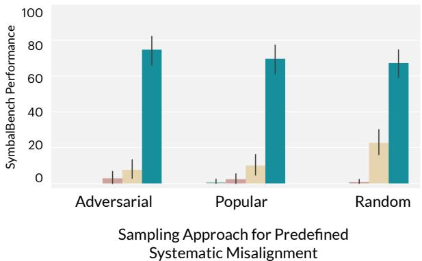

Figure 8. We provide a breakdown of SYMBAL performance across various categories of systematic misalignments in the natural image subset of SYMBALBENCH.

We use the following input prompt for our direct-prompting baselines:

Table 4. We evaluate various text embedding models, alignment scorers, and summarizers on the performance of Stage 1 of SYMBAL.

<table><tr><td rowspan="2"></td><td rowspan="2">Text Embedding</td><td rowspan="2">Alignment Scorer</td><td rowspan="2">Summarizer</td><td colspan="2">Reference-Free</td><td colspan="2">Reference-Based</td></tr><tr><td>Acc@1</td><td>Acc@5</td><td>Acc@1</td><td>Acc@5</td></tr><tr><td rowspan="4">Natural</td><td>Qwen3-8B</td><td>Vision-Language (Qwen-72B)</td><td>Text-Only (Qwen-72B)</td><td>92.8</td><td>94.2</td><td>80.8</td><td>82.8</td></tr><tr><td>OpenCLIP</td><td>Vision-Language (Qwen-72B)</td><td>Text-Only (Qwen-72B)</td><td>92.8</td><td>93.9</td><td>86.1</td><td>87.8</td></tr><tr><td>Qwen3-8B</td><td>Text-Only (Qwen-72B)</td><td>Text-Only (Qwen-72B)</td><td>82.8</td><td>85.0</td><td>81.9</td><td>83.9</td></tr><tr><td>OpenCLIP</td><td>Text-Only (Qwen-72B)</td><td>Text-Only (Qwen-72B)</td><td>64.2</td><td>67.2</td><td>67.5</td><td>71.4</td></tr><tr><td rowspan="10">Medical</td><td>XRayCLIP</td><td>Text-Only (MedGemma-27B)</td><td>Text-Only (MedGemma-27B)</td><td>51.7</td><td>75.0</td><td>88.3</td><td>95.0</td></tr><tr><td>XRayCLIP</td><td>Text-Only (MedGemma-27B)</td><td>Text-Only (Qwen-72B)</td><td>51.7</td><td>73.3</td><td>100.0</td><td>100.0</td></tr><tr><td>XRayCLIP</td><td>Text-Only (Qwen-72B)</td><td>Text-Only (MedGemma-27B)</td><td>26.7</td><td>58.3</td><td>90.0</td><td>93.3</td></tr><tr><td>MedSigLIP</td><td>Text-Only (MedGemma-27B)</td><td>Text-Only (MedGemma-27B)</td><td>30.0</td><td>53.3</td><td>83.3</td><td>100.0</td></tr><tr><td>XRayCLIP</td><td>Vision-Language (MedGemma-27B)</td><td>Text-Only (MedGemma-27B)</td><td>26.7</td><td>48.3</td><td>85.0</td><td>90.0</td></tr><tr><td>XRayCLIP</td><td>Text-Only (Qwen-72B)</td><td>Text-Only (Qwen-72B)</td><td>28.3</td><td>46.7</td><td>98.3</td><td>98.3</td></tr><tr><td>OpenCLIP</td><td>Text-Only (MedGemma-27B)</td><td>Text-Only (MedGemma-27B)</td><td>28.3</td><td>46.7</td><td>88.3</td><td>98.3</td></tr><tr><td>OpenCLIP</td><td>Text-Only (MedGemma-27B)</td><td>Text-Only (Qwen-72B)</td><td>36.7</td><td>45.0</td><td>98.3</td><td>100.0</td></tr><tr><td>MedSigLIP</td><td>Text-Only (MedGemma-27B)</td><td>Text-Only (Qwen-72B)</td><td>36.7</td><td>43.3</td><td>98.3</td><td>100.0</td></tr><tr><td>MedSigLIP</td><td>Text-Only (Qwen-72B)</td><td>Text-Only (MedGemma-27B)</td><td>16.7</td><td>35.0</td><td>86.7</td><td>98.3</td></tr></table>

Table 5. We evaluate various image embedding models, alignment scorers, and summarizers on the performance of Stage 2 of SYMBAL.

<table><tr><td rowspan="2"></td><td rowspan="2">Img Embedding</td><td rowspan="2">Alignment Scorer</td><td rowspan="2">Summarizer</td><td colspan="2">Reference-Free</td><td colspan="2">Reference-Based</td></tr><tr><td>Acc@1</td><td>Acc@5</td><td>Acc@1</td><td>Acc@5</td></tr><tr><td rowspan="10">Natural</td><td>OpenCLIP</td><td>Vision-Language (Qwen-72B)</td><td>Text-Only (Qwen-72B)</td><td>49.7</td><td>69.7</td><td>41.9</td><td>52.2</td></tr><tr><td>OpenCLIP</td><td>Embedding (OpenCLIP)</td><td>Vision-Language (Qwen-72B)</td><td>48.1</td><td>63.9</td><td>42.5</td><td>55.6</td></tr><tr><td>OpenCLIP</td><td>Embedding (OpenCLIP)</td><td>Text-Only (Qwen-72B)</td><td>47.8</td><td>62.8</td><td>43.9</td><td>55.8</td></tr><tr><td>OpenCLIP</td><td>Vision-Language (Qwen-72B)</td><td>Vision-Language (Qwen-72B)</td><td>45.8</td><td>62.5</td><td>38.9</td><td>52.2</td></tr><tr><td>DINOv2</td><td>Vision-Language (Qwen-72B)</td><td>Text-Only (Qwen-72B)</td><td>45.3</td><td>61.4</td><td>38.6</td><td>54.7</td></tr><tr><td>DINOv2</td><td>Text-Only (Qwen-72B)</td><td>Text-Only (Qwen-72B)</td><td>43.1</td><td>60.8</td><td>41.1</td><td>56.4</td></tr><tr><td>OpenCLIP</td><td>Text-Only (Qwen-72B)</td><td>Text-Only (Qwen-72B)</td><td>48.1</td><td>60.6</td><td>45.6</td><td>58.1</td></tr><tr><td>OpenCLIP</td><td>Text-Only (Qwen-72B)</td><td>Vision-Language (Qwen-72B)</td><td>44.2</td><td>60.3</td><td>43.9</td><td>56.7</td></tr><tr><td>DINOv2</td><td>Text-Only (Qwen-72B)</td><td>Vision-Language (Qwen-72B)</td><td>43.6</td><td>59.7</td><td>39.7</td><td>54.2</td></tr><tr><td>DINOv2</td><td>Embedding (OpenCLIP)</td><td>Vision-Language (Qwen-72B)</td><td>43.6</td><td>59.4</td><td>39.7</td><td>53.3</td></tr><tr><td rowspan="10">Medical</td><td>XRayCLIP</td><td>Embedding (MedSigLIP)</td><td>Vision-Language (MedGemma-27B)</td><td>11.7</td><td>36.7</td><td>28.3</td><td>53.3</td></tr><tr><td>MedSigLIP</td><td>Embedding (MedSigLIP)</td><td>Vision-Language (MedGemma-27B)</td><td>11.7</td><td>31.7</td><td>25.0</td><td>46.7</td></tr><tr><td>OpenCLIP</td><td>Embedding (MedSigLIP)</td><td>Vision-Language (MedGemma-27B)</td><td>13.3</td><td>28.3</td><td>20.0</td><td>46.7</td></tr><tr><td>MedSigLIP</td><td>Embedding (XRayCLIP)</td><td>Vision-Language (MedGemma-27B)</td><td>10.0</td><td>28.3</td><td>33.3</td><td>60.0</td></tr><tr><td>XRayCLIP</td><td>Vision-Language (MedGemma-27B)</td><td>Vision-Language (MedGemma-27B)</td><td>6.7</td><td>28.3</td><td>43.3</td><td>65.0</td></tr><tr><td>MedSigLIP</td><td>Text-Only (MedGemma-27B)</td><td>Vision-Language (MedGemma-27B)</td><td>8.3</td><td>26.7</td><td>43.3</td><td>65.0</td></tr><tr><td>OpenCLIP</td><td>Text-Only (MedGemma-27B)</td><td>Vision-Language (MedGemma-27B)</td><td>10.0</td><td>25.0</td><td>23.3</td><td>63.3</td></tr><tr><td>OpenCLIP</td><td>Text-Only (Qwen-72B)</td><td>Vision-Language (MedGemma-27B)</td><td>3.3</td><td>25.0</td><td>30.0</td><td>61.7</td></tr><tr><td>MedSigLIP</td><td>Embedding (MedSigLIP)</td><td>Text-Only (Qwen-72B)</td><td>15.0</td><td>25.0</td><td>15.0</td><td>40.0</td></tr><tr><td>OpenCLIP</td><td>Embedding (MedSigLIP)</td><td>Text-Only (Qwen-72B)</td><td>13.3</td><td>23.3</td><td>16.7</td><td>48.3</td></tr></table>

Ablation study. We now ablate the role of the grouping step across the subset of 360 natural image datasets in our benchmark. We compare SYMBAL to a version that omits grouping: we use the best performing scorer (vision-language scorer with Qwen-72B) in order to flag each individual sentence as valid (1) or misaligned (0), and we then use our best performing summarizer (text-only summarizer with Qwen-72B) in order to identify the unifying concept across the sentences marked as misaligned. All other settings (e.g. prompts, compute budget, model configurations, etc.) are kept identical to those used for SYMBAL. For Stage 1, in the reference-free setting, we observe an Acc@1 of 41.9 and an Acc@5 of 65.3; these metrics represent a substantial decrease from the results obtained with SYMBAL (Acc@1 = 92.8 and Acc@5 = 94.2) in Table 1. We then use the best performing summarizer to identify image features associated with the misaligned sentences. For Stage 2, in the reference-free setting, we observe an Acc@1 of just 3.6 and an Acc@5 of 16.9; again, these are a substantial decrease from the results obtained with SYMBAL (Acc@1 = 49.7 and Acc@5 = 69.7) in Table 2. These results demonstrate the importance of our multi-step, structured approach for addressing the systematic misalignment detection task.

Table 6. End-to-end performance across SYMBALBENCH, stratified by domain.

<table><tr><td rowspan="2"></td><td rowspan="2">Method</td><td colspan="2">Reference-Free</td><td colspan="2">Reference-Based</td></tr><tr><td>Acc@1</td><td>Acc@5</td><td>Acc@1</td><td>Acc@5</td></tr><tr><td rowspan="4">Natural</td><td>Llama3.3 70B</td><td>0.3</td><td>0.3</td><td>0.6</td><td>1.4</td></tr><tr><td>Qwen2.5-VL 72B</td><td>0.0</td><td>1.9</td><td>0.6</td><td>1.1</td></tr><tr><td>GPT-OSS 120B</td><td>9.2</td><td>13.9</td><td>10.8</td><td>17.2</td></tr><tr><td>SYMBAL (Ours)</td><td>49.2</td><td>69.7</td><td>41.1</td><td>51.9</td></tr><tr><td rowspan="5">Medical</td><td>Llama3.3 70B</td><td>0.0</td><td>8.3</td><td>0.0</td><td>5.0</td></tr><tr><td>MedGemma 27B</td><td>0.0</td><td>1.7</td><td>0.0</td><td>0.0</td></tr><tr><td>Qwen2.5-VL 72B</td><td>3.3</td><td>5.0</td><td>0.0</td><td>1.7</td></tr><tr><td>GPT-OSS 120B</td><td>1.7</td><td>21.7</td><td>0.0</td><td>11.7</td></tr><tr><td>SYMBAL (Ours)</td><td>6.7</td><td>28.3</td><td>25.0</td><td>48.3</td></tr></table>

## E. Evaluating SYMBAL in the Wild

In this section, we further demonstrate the utility of SYMBAL by supplementing our evaluations on SYMBALBENCH with additional quantitative and qualitative analyses in real-world settings.

SYMBAL can accurately surface systematic misalignments in captions generated by off-the-shelf MLLMs. Below, we list several examples of systematic misalignments identified by SYMBAL, and we also provide associated validation:

• Example 1: In captions generated by Llava1.5-7B, SYMBAL detects that erroneous references to a TV (t<sup>ˆ</sup>) in captions are often systematically associated with the presence of a desk, computer monitor, and/or keyboard (vˆ) in the scene. We provide visual examples of image-caption pairs with the SYMBAL-identified systematic misalignment in Figure 9 (Row 1). Quantitatively, our analysis finds that erroneous references to a TV in model-generated captions are indeed 13.5 times more likely when a desk is present in the image compared to when a desk is absent, validating the SYMBAL prediction.

• Example 2: In captions generated by Llava1.5-7B, SYMBAL detects that erroneous references to a handbag or a handbag on the ground (t<sup>ˆ</sup>) in captions are often systematically associated with the presence of a bus (vˆ) in a scene. We provide visual examples of image-caption pairs with the SYMBAL-identified systematic misalignment in Figure 9 (Row 2). Quantitatively, our analysis finds that erroneous references to a handbag in model-generated captions are indeed 3.1 times more likely when a bus is present in the image compared to when a bus is absent, validating the SYMBAL prediction.

• Example 3: In captions generated by Llava1.5-7B, SYMBAL detects that erroneous references to a chair (t<sup>ˆ</sup>) in captions are often systematically associated with the presence of a television (vˆ) in a scene. We provide visual examples of image-caption pairs with the SYMBAL-identified systematic misalignment in Figure 9 (Row 3). Quantitatively, our analysis finds that erroneous references to a chair in model-generated captions are indeed 3.1 times more likely when a television is present in the image compared to when a television is absent, validating the SYMBAL prediction.

• Example 4: In captions generated by Llava1.5-13B, SYMBAL detects that erroneous references to a TV (t<sup>ˆ</sup>) in captions are often systematically associated with the presence of a computer monitor, keyboard, and/or mouse (vˆ) in a scene. Interestingly, this systematic misalignment is nearly identical to one that exists in Llava1.5-7B-generated captions (see Example 1), suggesting that solely increasing the scale of the underlying MLLM is insufficient for resolving systematic misalignments. We provide visual examples of image-caption pairs with the SYMBAL-identified systematic misalignment in Figure 10 (Row 1). Quantitatively, our analysis finds that erroneous references to a TV in model-generated captions are indeed 22.2 times more likely when a computer monitor is present in the image compared to when a computer monitor is absent, validating the SYMBAL prediction.

• Example 5: In captions generated by LlavaOneVision-7B, SYMBAL detects that erroneous references to text (t<sup>ˆ</sup>) in captions are often systematically associated with the presence of a sign (vˆ) in a scene. This systematic misalignment suggests that LlavaOneVision-7B struggles with OCR capabilities, where the presence of text-based signage in an image is likely to result in errors in the generated caption. We provide visual examples of image-caption pairs with the

SYMBAL-identified systematic misalignment in Figure 10 (Row 2). Quantitatively, our analysis finds that erroneous references to text in model-generated captions are indeed 4.6 times more likely when a sign is present in the image compared to when a sign is absent, validating the SYMBAL prediction.

• Example 6: In captions generated by AyaVision-8B, SYMBAL detects that erroneous references to a vase (t<sup>ˆ</sup>) in captions are often systematically associated with the presence of a couch (vˆ) in a scene. We provide visual examples of imagecaption pairs with the SYMBAL-identified systematic misalignment in Figure 10 (Row 3). Quantitatively, our analysis finds that erroneous references to a vase in model-generated captions are indeed 17.7 times more likely when a couch is present in the image compared to when a couch is absent, validating the SYMBAL prediction.

Across all six examples of SYMBAL-identified systematic misalignments provided above, we find that erroneous references to t<sup>ˆ</sup>are substantially more likely when vˆ is present in the image compared to when vˆ is absent. This analysis validates discovered misalignments by demonstrating that links between SYMBAL-identified erroneous textual fact t<sup>ˆ</sup>and SYMBAL-identified visual feature vˆ do indeed exist.

Our quantitative validation procedure relies on automated annotation methods in order to enable evaluation at scale; in particular, we leverage Qwen-72B in order to annotate erroneous references to t<sup>ˆ</sup>in each caption. We find that these generated annotations align closely with human judgments. Given the set of 215 images in the dataset containing a “bus”, we tasked a human reader with identifying whether each Llava1.5-7B-generated caption contained an erroneous reference to a “handbag” and/or “handbag on the ground” (Example 2). Human judgments aligned perfectly with Qwen-72B predictions in 96.3% of cases (Cohen’s kappa = 0.86).

SYMBAL is a powerful tool for auditing open-source vision-language datasets. Below, we list several examples of systematic misalignments identified by SYMBAL on the ShareGPT4V dataset, and we also provide associated validation:

• Example 7: SYMBAL detects that erroneous references to a white tablecloth (t<sup>ˆ</sup>) in captions are often systematically associated with the presence of a table, cake, and/or people (vˆ) in the scene. We provide visual examples of imagecaption pairs with the SYMBAL-identified systematic misalignment in Figure 11 (Row 1). Quantitatively, our analysis finds that erroneous references to a white tablecloth in model-generated captions are indeed 17.2 times more likely when a table is present in the image compared to when a table is absent, validating the SYMBAL prediction.

• Example 8: SYMBAL detects that erroneous references to a printer (t<sup>ˆ</sup>) in captions are often systematically associated with the presence of a computer monitor (vˆ) in a scene. We provide visual examples of image-caption pairs with the SYMBAL-identified systematic misalignment in Figure 11 (Row 2). Quantitatively, our analysis finds that erroneous references to a printer in model-generated captions are indeed 121 times more likely when a computer monitor is present in the image compared to when a computer monitor is absent, validating the SYMBAL prediction.

• Example 9: SYMBAL detects that erroneous references to a black phone (t<sup>ˆ</sup>) in captions are often systematically associated with the presence of a laptop (vˆ) in a scene. We provide visual examples of image-caption pairs with the SYMBAL-identified systematic misalignment in Figure 11 (Row 3). Quantitatively, our analysis finds that erroneous references to a black phone in model-generated captions are indeed 48.5 times more likely when a laptop is present in the image compared to when a laptop is absent, validating the SYMBAL prediction.

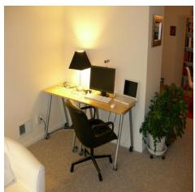

The image features a well-organized home office with a desk and a computer setup. On the desk, there is a laptop computer, a keyboard, and a mouse. The desk i accompanied by a chair, which is positioned in front of the desk. In the room, there are several books scattered around, with some on the floor and others on the desk. A potted plant is placed in the corner of the room, adding a touch of greenery to the space. Additionally, a TV is mounted on the wall, providing entertainment options for the home office.


The image features a pink bus parked on the side of a street, likely at a bus stop. The bus is adorned with a large advertisement on its side, possibly promoting a shopping center. Several people can be seen around the bus, with some standing closer to the bus stop and others further away. There are two handbags visible in the scene, one near the center o the image and the other closer to the right side. The presence of these handbags suggests that the people might be waiting for the bus or have just disembarked from it.

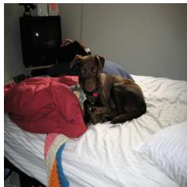

The image features a brown dog sitting on a messy bed, surrounded by blankets and pillows. The dog appears to be looking at the camera, possibly posing for a picture. The bed is covered with various pillows and blankets, creating a cozy and comfortable environment for the dog. In the room, there is a television on the left side, and a remote control can be seen nearby. A chair is also present in the scene, positioned close to the bed

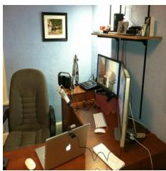

The image displays a small, cluttered office space with a wooden desk. On the desk, there is a laptop computer, a keyboard, and a mouse. A monitor is also present, positioned above the laptop. A chair is placed in front of the desk, ready for someone to sit and work. The office is filled with various items, including a TV mounted on the wall, a cell phone, and a couple of books. There are also two remote controls placed on the desk. In addition to the electronics, there are two bottles and a cup, likely containing beverage for the person working in the office

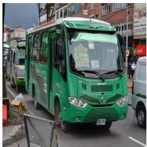

The image features a busy street with a green bus driving down the road, surrounded by various vehicles. There are two other buses in the scene, one on the left side and another on the right side of the street. A truck can also be seen on the right side of the street. Several people are present in the scene, with some standing near the buses and others walking along the street. There are two traffic light visible in the image, one on the left side and another on the right side of the street, ensuring the smooth flow of traffic Additionally, there are two handbags in the scene, one near the left side of the street and the other closer to the center.

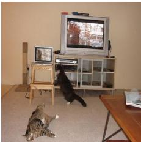

The image features a living room with a television set placed on a wooden stand. A ca is lying on the floor, appearing to be watching the TV. Another cat is sitting on the floor, seemingly engaged with the television as well. In the room, there are two chairs, one located near the left side of the television and the other closer to the right side. A remote control can be seen on the floor, possibly used to operate the television Additionally, there is a book placed on the right side of the room, and a vase is located near the center of the scene.

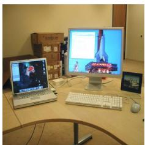

The image features a wooden desk with a laptop and a desktop computer sitting on it The laptop is placed on the left side of the desk, while the desktop computer is situated towards the right. Both computers are connected to the same keyboard, which is located in the middle of the desk. Additionally, there is a mouse on the right side of the desk, and a cell phone can be seen on the left side. A TV is mounted on the wall above the desk, providing a source of entertainment or information for the user


The image features a group of people standing in front of a bus, likely waiting to board or disembark. There are at least nine people visible in the scene, with some standing closer to the bus and others further away. The bus is parked on the left side of the image, occupying a significant portion of the scene. In addition to the bus, there are several cars visible in the background, with one car on the left side of the image and tw cars on the right side. A handbag can be seen placed on the ground near the center of the scene, possibly belonging to one of the passengers.

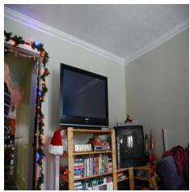

The image features a living room with a television set placed on a wooden stand. The TV is positioned in the center of the room, surrounded by various books on a bookshelf The bookshelf is filled with numerous books, creating a cozy atmosphere. In addition to the television and bookshelf, there are two chairs in the room, one located on the lef side and the other on the right side. A person can be seen in the room, standing near the left side of the television. The room also has a Christmas tree, adding a festive touch to th space.

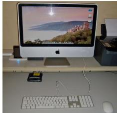

The image features a large computer monitor sitting on a desk, with a keyboard and mouse placed in front of it. The monitor is turned on displaying a beautiful landscape image. The keyboard and mouse are positioned close to the monitor, indicating that they are ready for use. In addition to the main computer setup, there are several other items on the desk, A cell pbone can be seen on the left side of the desk, while a book is placed towards the right side. A remote control is also present, located near the center of the desk. A TV is mounted on the wall above the desk, providing a more comprehensive entertainment setup


The image features a white and blue city bus parked on the side of a street. The bus is stopped at a bus stop, and the driver is visible through the windshield. The bus stop has a bench nearby, providing a place for passengers to wait. There are several people in the scene, with one person standing close to the bus, another person further away, and two more individuals closer to the edge of the image. A handbag can be seen placed on the ground near the first person, possibly belonging to a passenger waiting for the bus

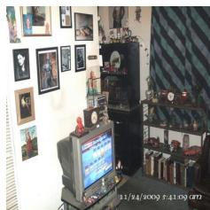

The image features a cluttered living room with a television set placed on a stand in the center. The room is filled with various items, including a large collection of books scattered throughout the space. Some books are placed on the floor, while others are stacked on shelves or placed on surfaces. In addition to the books there are several figurines and knick-knacks, such as a clock, a vase, and a cup, adding to the cluttered appearance of the room. A chair can be seen in the background, and a potted plant is placed near the right side of the room. The overal atmosphere of the living room is busy and filled with various items, creating a cozy yet disorganized space

Percentage of Captions with Erroneous Reference to TV  
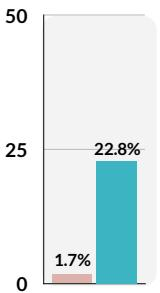

Images without desk Images with desk

Percentage of Captions with Erroneous Reference to Handbag  
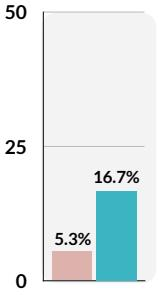  
Images without bus Images with bus

Percentage of Captions with Erroneous Reference to Chair  
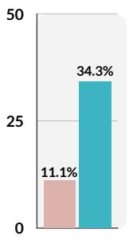  
Images without TV Images with TV

Figure 9. Examples of image-caption pairs with SYMBAL-identified systematic misalignments are shown here, with the identified erroneous textual fact in each caption highlighted in red. We also quantitatively validate each identified systematic misalignment. [Row 1] SYMBAL detects that erroneous references to a TV (t<sup>ˆ</sup>) in captions are often systematically associated with the presence of a desk, computer monitor, and/or keyboard (vˆ) in the scene. [Row 2] SYMBAL detects that erroneous references to a handbag or handbag on the ground (t<sup>ˆ</sup>) in captions are often systematically associated with the presence of a bus (vˆ) in a scene. [Row 3] SYMBAL detects that erroneous references to a chair (t<sup>ˆ</sup>) in captions are often systematically associated with the presence of a television (vˆ) in a scene.

Images

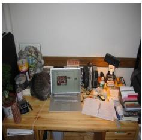

The image features a wooden desk with a laptop computer sitting on top of it. A cat is comfortably resting on the desk, close to the laptop. The desk is surrounded by various items, including several books scattered around the area. In addition to the books, there are two bottles on the desk, one near the left side and the other near the right side. A potted plant is located on the left side of the desk, adding a touch of greenery to the scene. A TV can be seen in the background, mounted on the wall above the desk

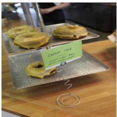

The image depicts a display of doughnuts on a metal tray, placed on a wooden surface. The doughnuts are frosted with a yellow glaze and appear to be of a similar size and shape. In the foreground, there is a green sign with white text that reads "Carrot Cake" and lists additional ingredients: "Carrot, cinnamon, nutmeg, ginger, and cream cheese." The sign is attached to a metal stand with a coiled wire design. The background is slightly blurred but shows what appears to be a kitchen or bakery setting with stainless steel surfaces and a person partially visible. The lighting in the image is bright, highlighting the doughnuts and sign.

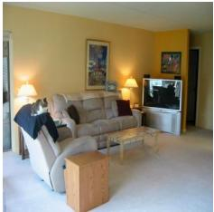

The image depicts a cozy living room with warm, inviting decor. The walls are painted a soft vellow comnlementing the beige carpet that covers the floor. A plush, light-colored sofa is positioned against one wall, adorned with a few throw pillows, including a red accent pillow. A recliner sits nearby, offering a comfortable spot to relax, with a black cat perched on its armrest. In front of the sofa, a small wooden coffee table holds a decorative vase and a few items. Across from the sofa, a television is mounted on the wall above a wooden entertainment console. Two floor lamps with warm-toned shades flank the television, providing additional lighting…

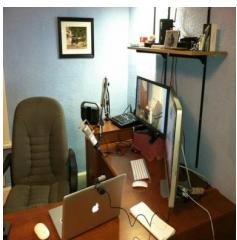

The image depicts a home office setup with a desk featuring a laptop and a desktop computer. The laptop is placed on the left side of the desk, while the desktop computer is positioned on the right side. A keyboard is situated in front of the laptop, and a mouse can be found on the left side of the desk. A chair is situated in front of the desk, ready for someone to sit and work. A TV is mounted on the wall above the desk, providing additiona entertainment or information during work hours. In the room, there are also a few books scattered around, possibly for reference or leisure reading. A person can be seen in the background, possibly working or observing the office setup.

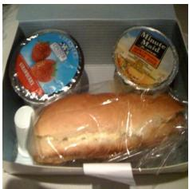

The image depicts a meal consisting of a sandwich, two containers of yogurt, and a small packet of salt. The sandwich is placed in the center of the image, wrapped in plastic wrap, and appears to be a sub-style sandwich with a light brown crust. To the left of the sandwich, there is a container of yogurt with a blue lid, featuring an image of strawberries and the text "STRAWBERRY" in white and red letters. To the right of the sandwich, there is another container of yogurt with a yellow lid, labeled "Minute Maid" and "SWEET TARTS" in black and red letters. The yogurt container also has an image of a grape. In the bottom left corner of the image, there is a small white packet of salt…


This cozy living room is bathed in warm, ambient lighting, creating a welcoming atmosphere. A plush, light-colored sofa sits centrally, adorned with soft throw pillows and cushions, inviting relaxation. Across from the sofa, a wooden coffee table with a circular glass top holds a few items, including a salt shaker and a small vase with dried flowers. To the left, a side table supports a lamp with a warm-toned shade, casting a gentle glow. A potted plant adds a touch of greenery to the room, while a rug with a bold geometric pattern covers part of the hardwood floor. In the background, a window with shee curtains allows natural light to filter in…

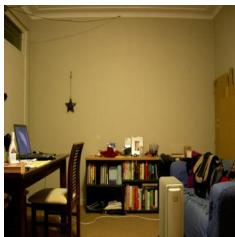

The image depicts a small, cluttered living room with various pieces of furniture and items. There is a couch situated in the background, and a chair placed in the middle of the room. A dining table is located near the left side of the room, with a laptop and a mouse placed on it. A bookshelf filled with numerous books is also present in the room, adding to the cluttered appearance. In addition to the books, there are several othe items scattered throughout the room, such a a backpack, a handbag, a bottle, and a cup. A TV can be seen mounted on the wall, and a clock is hanging nearby. The room also features a window, providing natural light to the space.

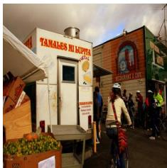

The image depicts a lively street scene with a food truck prominently featured. The truck is white with red and yellow lettering that reads "TAMALELES MI LUPITA. " Below the main text, there is a smaller sign that says "TAMALEES," and additional text that appears to be a menu or description of the food offered. The truck has a window for service, and there is a logo or emblem above the window, which includes a depiction of a tamale and a corn husk. In front of the truck there is a wooden crate filled with green limes, and a person is seen riding a bicycle past the truck. The cyclist is wearing a helmet and a backpack, and the bicycle has a basket on the front…

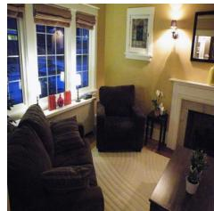

This cozy living room features warm, inviting decor with a touch of elegance. The space is illuminated by soft lighting, creating a relaxing atmosphere. A dark brown sofa with striped cushions sits against the far wall, accompanied by a matching armchair positioned near a small side table. A coffee table sits in the center, adorned with a vase of red roses. The room is decorated with a mix of traditional and modern elements, including a fireplace with a mantelpiece and a wall-mounted lamp. Large windows frame the room, allowing natural light to filter in during the day and soft glow from outside lights at night…

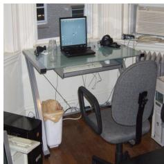

The image features a small office space with desk and a computer setup. On the desk, there is a laptop computer, a keyboard, and a mouse. A chair is positioned in front of the desk, ready for someone to sit and work. In addition to the computer setup, there are two bottles placed on the desk, one near the laptop and the other closer to the edge of the desk. A TV is mounted on the wall above the desk, and a book can be seen on the desk as well. A remote control is also present in the scene, likely for the TV.

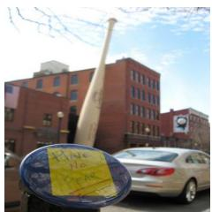

The image depicts a tall, white baseball ba leaning against a brick building. In the foreground, there is a round object with a yellow sticky note attached to it. The note has handwritten text that reads "HATE NO FEAR." The sky is partly cloudy, and there are trees with bare branches visible in the upper left corner of the image. In the background, there are parked cars and a street lamp. The overall scene appears to be set in an urban environment, possibly a street or a public area near a sports facility or a baseball themed attraction.

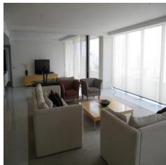

This image showcases a modern and minimalist living room designed with a clean, white aesthetic. The space features a large window with sheer white curtains, allowing natural light to flood the room. In the center, there is a light-colored sectional sofa accompanied by a cream-colored loveseat and a red armchair, creating a cozy yet stylish seating area. A low, rectangular coffee table sits in front of the sofa, adorned with a vase of flowers. Across from the seating area, a flat-screen television is mounted on the wall, positioned to face the seating arrangement. The room has a sleek, open layout with a hardwood floor and white walls, enhancing the sense of spaciousness…

Percentage of Captions with Erroneous Reference to TV  
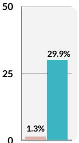

Images without computer monitor Images with computer monitor

Percentage of Captions with Erroneous Reference to Tex  
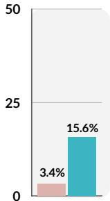  
Images without signs Images with signs

Percentage of Captions with Erroneous Reference to Vase  
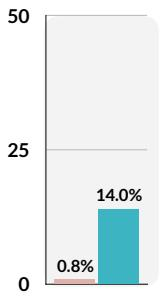  
Images without couch Images with couch

Figure 10. Examples of image-caption pairs with SYMBAL-identified systematic misalignments are shown here, with the identified erroneous textual fact in each caption highlighted in red. We also quantitatively validate each identified systematic misalignment. [Row 1] SYMBAL detects that erroneous references to a TV (t<sup>ˆ</sup>) in Llava1.5-13B-generated captions are often systematically associated with the presence of a computer monitor, keyboard, and/or mouse (vˆ) in the scene. [Row 2] SYMBAL detects that erroneous references to text (t<sup>ˆ</sup>) in LlavaOneVision-7B-generated captions are often systematically associated with the presence of a sign (vˆ) in a scene. [Row 3] SYMBAL detects that erroneous references to a vase (t<sup>ˆ</sup>) in AyaVision-8B-generated captions are often systematically associated with the presence of a couch (vˆ) in a scene.

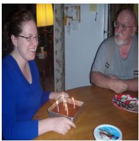

In the heart of a cozy kitchen, a woman and a man are sharing a moment of celebration. The woman, dressed in a vibrant blue shirt, is seated on the left side of the table. She's holding a rectangular cake, its surface adorned with lit candles that flicker in the soft light. Her smile is infectious, reflecting the joy of the occasion. On the right side of the table, a man in a gray shirt is seated. His gaze is directed towards the woman, perhaps sharing in her happiness or waiting for his turn to blow out the candles. The table they're sitting at is draped with a pristine white tablecloth, adding to the festive atmosphere…

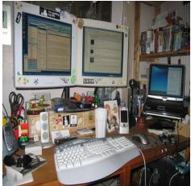

The image captures a scene of a busy workspace, brimming with various objects. Dominating the scene is a wooden desk, its surface a testament to a mind at work. Two computer monitors stand side by side, their screens glowing with unseen data. A keyboard and mouse lie in front of them, tools of the trade for the digital age. To the left of the monitors, a phone rests, silent for now but ready to connect at a moment's notice. On the right side of the desk, a printer waits patiently for its next task. Scattered around the desk are various office supplies pens, pencils, and paper clips each with their own role in the symphony of work. Above the desk, a shelf holds an array of books and binders, a testament to knowledge…

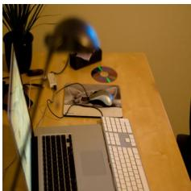

The image captures a scene of a workspace, bathed in the soft glow of a desk lamp. Dominating the scene is a wooden desk, its grainy texture adding a touch of warmth to the setting. On the left side of the desk, a laptop sits open, its screen glowing with unseen data. To the right of the laptop, a white keyboard waits patiently for the nex burst of typing. In the center of the desk, a black phone lies dormant, its screen dark. It's as if it's patiently waiting for a call or message to break its silence. To the right of the phone, a black mouse sits idle, its cord trailing off the edge of the desk. On the left side of the desk, a plant adds a touch of greenery to the scene. Its leaves are lush and full, suggesting it's well cared for…

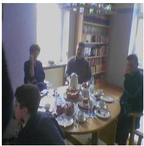

In the heart of a cozy room, a group of people are gathered around a table, engrossed in conversation. The table, draped in a pristine white tablecloth, is adorned with plates, cups, and utensils, ready for a meal. A cake, the centerpiece of the gathering, sits in the middle of the table, inviting the guests to partake in its sweet delight.The room itself exudes a warm and inviting atmosnbere.A bookshelf stands in the background, filled with various books that hint at th intellectual pursuits of the inhabitants. A window punctuates the wall, allowing natura light to filter into the room and illuminate the scene…

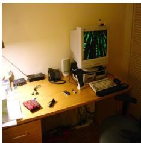

The image captures a scene of a home office setup. Dominating the scene is a wooden desk, bathed in the soft glow of a lamp positioned on the left side. The desk is a hub of activity, hosting a variety of objects. A computer monitor stands as the centerpiece, its screen alive with the vibrant hues of a green and black screensaver. To the right of the monitor, a phone lies idle, its cord trailing off the edge of the desk. A keyboard and mouse sit in front of the monitor, ready t spring into action at a moment's notice. Nearby, a printer waits patiently for its next task, while a stack of books suggests a thirs for knowledge or perhaps a love for reading…

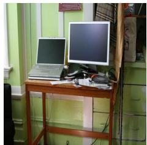

The image captures a scene of a home office setup. Dominating the scene is a wooden desk, standing against a green wall. The desk is a hub of activity, hosting a variety of objects. On the left side of the desk, an open laptop sits, its screen glowing with unseen data. Adjacent to it, a black monitor stands tall, its screen blank. A black keyboard lies i front of the monitor, ready to translate thoughts into words. A black mouse sits next to the keyboard, poised to navigate the digita world. To the right of the monitor, a black printer waits patiently for its next task. A black phone rests next to it, silent but everconnected. A black lamp stands guard next to the phone, ready to bathe the workspace in light when night falls…

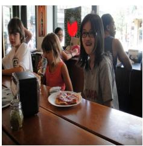

In the heart of a bustling restaurant, a group of children are gathered around a table, their faces alight with anticipation. The table, draped in a pristine white tablecloth, serves as the centerpiece of their gathering. On it, a plate of food awaits to be savored, while a jar of condiments stands by, ready to enhance the flavors of their meal. The children, dressed in casual attire, are engrossed in their own world, their attention focused on the plate of food. Their expressions are hidden from view, adding an air of mystery to the scene. In the background, the restaurant continues its lively rhythm…


The image captures a scene of a home office setup. Dominating the scene is a wooden desk, standing against a green wall. The desk is a hub of activity, hosting a variety of objects. On the left side of the desk, an open laptop sits, its screen glowing with unseen data. Adjacent to it, a black monitor stands tall, its screen blank. A black keyboard lies in front of the monitor, ready to translate thoughts into words. A black mouse sits next to the keyboard, poised to navigate the digita world. To the right of the monitor, a black printer waits patiently for its next task. A black phone rests next to it, silent but everconnected. A black lamp stands guard next to the phone, ready to bathe the workspace in light when night falls…


The image captures a wellorganized workspace, bathed in the soft glow of natural light streaming in from a window in the background. Dominating the scene is a white desk, its surface a tableau of productivity. On the left side of the desk, a black laptop sits open, its screen glowing with unseen data. Adjacent to it, a white printer stands ready for tasks. The right side of the desk is a hub o activity with a white computer monitor displaying a webpage, accompanied by a white keyboard and mouse, tools of the digital age…A black phone lies nearby, silent for now but ever ready for communication…


In the heart of a cozy living room, a family of five is gathered around a wooden table, engrossed in the simple joy of a birthday celebration. The table, draped in a pristine white tablecloth, serves as the centerpiece of their gathering. On the table, a vibrant birthday cake steals the show, It's a feast for the eyes with its red, white, and blue colors. The cake is adorned with candles, thei flames flickering in the soft light, casting a warm glow on the faces of the family. A woman, presumably the birthday celebrant, is in the midst of cutting the cake. Her hands ar steady, her focus unwavering as she prepares to serve the first slice…


The image captures a wellorganized workspace, bathed in the soft glow of ambient light. Dominating the scene is a black desk, its surface a tableau of productivity. Two computer monitors stand side by side their screens alive with data and information. A keyboard and mouse lie in front of them, tools of the trade for the digital age. To the right of the monitors, a printer sits quietly ready to transform digital documents into physical copies. Nearby, a phone rests, silent for now but capable of connecting this workspace to the outside world. A bookshelf stands guard in the background, its shelves filled with knowledge and resources. In front of the desk, a chair waits patiently for its occupant.

  
Percentage of Captions with Erroneous Reference to White Tablecloth

The image captures a scene of a workspace set against a vibrant red wall. Dominating the scene is a wooden desk, its surface adorned with various objects. On the left side of the desk, a laptop sits open, its screen glowing with unseen data. Adjacent to the laptop, a black phone rests, silent and unobtrusive. A white lamp with a curved neck stands sentinel on the right side of the desk, casting a soft glow that illuminates the immediate surroundings. The desk itself is a tableau of organized chaos, with papers scattered haphazardly, each one a testament to the work that has been done or is yet to be done In the background, a window punctuates the red wall, offering a glimpse into the world outside. The image is taken from a low angle, adding a sense of depth and perspective to the scene…


Images without table Images with table

Percentage of Captions with Erroneous Reference to Printer


Images without computer monitor Images with computer monitor

Percentage of Captions with Erroneous Reference to Black Phone

  
Figure 11. Examples of image-caption pairs with SYMBAL-identified systematic misalignments are shown here, with the identified erroneous textual fact in each caption highlighted in red. We also quantitatively validate each identified systematic misalignment. [Row 1] SYMBAL detects that erroneous references to a white tablecloth (t<sup>ˆ</sup>) in ShareGPT4V captions are often systematically associated with the presence of a table, cake, and/or people (vˆ) in the scene. [Row 2] SYMBAL detects that erroneous references to a printer (t<sup>ˆ</sup>) in ShareGPT4V captions are often systematically associated with the presence of a computer monitor (vˆ) in a scene. [Row 3] SYMBAL detects that erroneous references to a black phone (t<sup>ˆ</sup>) in ShareGPT4V captions are often systematically associated with the presence of a laptop (vˆ) in a scene.