# AV-JEPA: Extending LeJEPA to Audio-Visual Self-Supervised Learning

Benjamin Robson $^{1}$ Santeri Mentu $^{1}$ Wenshuai Zhao $^{1}$ Arno Solin $^{1}$

## Abstract

We present AV-JEPA, an elegant multimodal extension of LeJEPA to audio-visual self-supervised learning. Using an early-fusion Vision Transformer and modality dropout as masking, the model is trained to align the embeddings of global and per-modality local views, while the SIGReg objective encourages a theoretically optimal distribution. This achieves cross-modal alignment in the latent space, resulting in a remarkably clean architecture with no decoder, EMA teacher, complex multi-term losses, or contrastive negatives. The proposed AV-JEPA backbone delivers competitive classification performance on VGGSound (57.1% top-1) and AudioSet (32.7 mAP) and supports zero-shot audio-video retrieval out of the box.

## 1. Introduction

Self-supervised learning (SSL) has become the dominant paradigm for learning high-quality representations from unlabelled data. In the audio-visual domain, the prevailing approach is masked autoencoding: models such as AV-MAE (Georgescu et al., 2023), CAV-MAE (Gong et al., 2023), MAViL (Huang et al., 2023), and CAV-MAE Sync (Araujo et al., 2025) reconstruct masked audio spectrograms and video patches through dedicated decoder networks. While effective, these methods lack formal guarantees on embedding quality and require architectural overhead such as separate decoders, carefully tuned masking ratios, or contrastive negative-pair losses.

An alternative paradigm, the Joint-Embedding Predictive Architecture (JEPA, LeCun, 2022), avoids reconstruction entirely by operating in the latent space: the model learns to predict the embedding of one view from another. Recently, LeJEPA (Balestriero & LeCun, 2025) established a rigorous theoretical foundation for JEPAs by proving that the isotropic Gaussian is the uniquely optimal embedding distribution for minimizing downstream prediction risk, and enforces it via Sketched Isotropic Gaussian Regularization (SIGReg). However, LeJEPA has only been validated on single-modality vision tasks.

Concretely, we ask: 'Can a JEPA achieve cross-modal audio-visual alignment, and in particular yield strong audio representations, without a decoder, contrastive negatives, EMA teachers, stop-gradients, or per-modality pretraining?' We extend LeJEPA to the audio-visual setting with AV-JEPA. Our key contributions are: (i) an extension of JEPA-based self-supervised learning to audio-visual representation learning; (ii) cross-modal view generation, where local views alternate between audio-only and video-only inputs (the other modality zeroed), creating an implicit cross-modal prediction task entirely in latent space; (iii) an early-fusion ViT architecture that processes both modalities jointly through a single shared transformer; and (iv) empirical results from our main experiment, AudioSet-2M pretraining followed by fine-tuning, showing that the resulting backbone reaches 57.1% top-1 on VGGSound and 32.7 mAP on AudioSet, with a single-modality breakdown confirming a strongly audio-driven representation, and supports cross-modal retrieval out of the box. Qualitatively, meaningful cross-modal attention to the sound source emerges purely from the JEPA objective, without any localization supervision.

## 2. Methods

AV-JEPA adapts LeJEPA to cross-modal audio-visual learning through $(i)$ an early-fusion architecture that embeds both modalities into a single token sequence, and $(ii)$ a view-generation strategy that uses modality dropout as the partial-view mechanism. The full pipeline is shown in Fig. 1.

LeJEPA loss LeJEPA (Balestriero & LeCun, 2025) shows that the isotropic Gaussian $\mathcal{N}(\mathbf{0},\mathbf{I})$ is the optimal embedding distribution for both linear and nonlinear downstream probes, and enforces it through SIGReg: a sliced characteristic-function test that projects embeddings onto M random unit-norm directions and matches each univariate projection to the Gaussian target via Epps–Pulley. Given G global and K local views with embeddings $z_{i} = \text{Proj}(f_{\theta}(\boldsymbol{x}_{i}))$ and the joint-view center $\bar{z} = \frac{1}{G} \sum_{g=1}^{G} z_{g}$ , the LeJEPA loss is

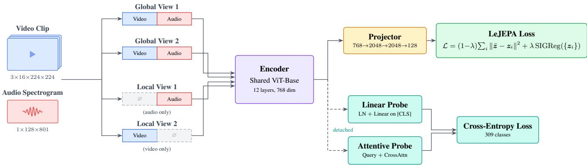  
Figure 1. AV-JEPA training pipeline. Each clip is split into G=2 global views (both modalities) and K=2 local views (alternating audio-only / video-only, the absent modality zeroed). All views go through a shared ViT-Base early-fusion encoder over video tubelets and audio mel-spectrogram patches. The LeJEPA loss pulls every view embedding toward the joint-modality center $\bar{z}$ while SIGReg enforces an isotropic Gaussian embedding distribution. During VGGSound pretraining we additionally attach detached linear and attentive classification probes.

$$
\mathcal {L} = (1 - \lambda) \underbrace {\frac {1}{G + K} \sum_ {i = 1} ^ {G + K} \| \bar {z} - z _ {i} \| ^ {2}} _ {\text { invariance }} + \lambda \underbrace {\operatorname{SIGReg} (\{z _ {i} \})} _ {\text { regularization }},\tag{1}
$$

with a single trade-off scalar $\lambda$ .

Audio-video early-fusion encoder Raw audio is resampled to 16 kHz and converted to a $1 \times 128 \times 801$ mel spectrogram (128 mel bins, 801 time frames from an 8 s clip); a $16 \times 16$ Conv2D patch embedding yields $8 \times 50 = 400$ audio tokens with factorized (frequency, time) positional embeddings. Video frames of shape $3 \times T \times 224 \times 224$ (T = 16) are tokenized by a $2 \times 16 \times 16$ Conv3D tubelet, giving 1568 video tokens with factorized (spatial, temporal) positional embeddings. A learnable [CLS] token is prepended:

$$
[ \mathrm{CLS}; \pmb {v} _ {1}, \dots , \pmb {v} _ {1 5 6 8}; \pmb {a} _ {1}, \dots , \pmb {a} _ {4 0 0} ],\tag{2}
$$

with learned modality-type embeddings (ID 0 = video, ID 1 = audio) added to distinguish modalities. The full 1969-token sequence is processed by a ViT-Base (Dosovitskiy et al., 2021) encoder (12L, d=768, 12 heads). The [CLS] output is projected by a 3-layer MLP (768→2048→2048→128, BatchNorm, GELU) before the LeJEPA loss is applied. See Fig. 5 for the full encoder schematic.

Modality dropout as partial-view mechanism Standard LeJEPA generates view diversity through spatial augmentations. We add an audio-visual axis: each 10 s clip is split into two temporally offset 8 s crops, used to form two global views (both modalities present, light augmentation) and two local views, one audio-only (video tokens zeroed) and one video-only (audio tokens zeroed, video with standard augmentations). The invariance term in Equation (1) then pushes each single-modality embedding toward the joint-modality center $\bar{z}$ , so the model must learn, from audio alone, an embedding predictive of the joint audio-video representation (and vice versa). Cross-modal alignment happens entirely in latent space, with no decoder or reconstruction target. SIGReg simultaneously prevents collapse of these dropout-induced embeddings.

Online probing On the labelled VGGSound dataset, we additionally train two classification heads on detached backbone features: a linear probe (LayerNorm + linear on [CLS]) and an attentive probe (one learnable query, 12-head cross-attention over patch tokens), both with cross-entropy and label smoothing 0.1 at learning rate $10^{-3}$ .

## 3. Experiments

Our main experiment pretrains AV-JEPA on AudioSet-2M (Gemmeke et al., 2017) and fine-tunes the resulting backbone on VGGSound (Chen et al., 2020) for audio-visual classification (Sec. 3.1). We additionally fine-tune the same AudioSet-pretrained backbone on AudioSet itself (Sec. 3.2) as a sanity check that pretraining transfers to its source distribution, and probe cross-modal retrieval (Sec. 3.3) as a complementary check that the learned embedding space is genuinely shared across modalities. As a controlled secondary study, we also pretrain (and fine-tune) on VGGSound alone, isolating the contribution of the JEPA objective from data scale. All runs share the same ViT-Base early-fusion encoder and LeJEPA recipe, differing only in pretraining dataset, batch size, and training budget.

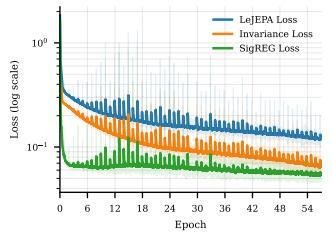

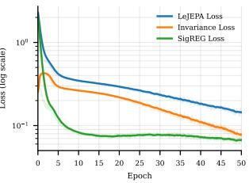  
(a) AudioSet-2M (57 ep.)  
(b) VGGSound (50 ep.)  
Figure 2. LeJEPA pretraining loss on (a) AudioSet-2M and (b) VGGSound, decomposed into weighted invariance and SIGReg terms. Both decrease steadily without signs of collapse.

Datasets AudioSet (Gemmeke et al., 2017): \~2M YouTube clips, multi-label across 527 sound classes (unbalanced split for pretraining and downstream fine-tuning; 20k balanced subset for AS-20k). VGGSound (Chen et al., 2020): \~184k train / 15k test 10 s clips spanning 309 audiovisual event classes.

Pretraining We train AV-JEPA on 8× NVIDIA H200 GPUs (DDP, bf16) with AdamW (Loshchilov & Hutter, 2019) at learning rate $5 \times 10^{-4}$ , weight decay 0.05, linear warmup over 15% of training followed by cosine decay to $10^{-6}$ , gradient clipping 5.0, G=2 global and K=2 cross-modal local views, and $\lambda=0.05$ . The AudioSet-2M pretraining runs for 57 epochs at batch size 40/GPU (effective 320); a smaller VGGSound-only run uses 50 epochs at batch size 50/GPU (effective 400). The pretraining loss decreases monotonically in both regimes (Fig. 2), and the per-dimension embedding standard deviation rises from $\sim0.8$ to $\sim1.01$ on AudioSet ( $\sim0.8$ to $\sim1.01$ on VGGSound), confirming that SIGReg converges to the isotropic Gaussian target at both scales.

Fine-tuning We attach a LayerNorm + linear classifier (with an auxiliary attentive head) on top of [CLS] and unfreeze the full backbone. AdamW with head LR $2 \times 10^{-4}$ and a low-LR backbone ( $0.05 \times$ head for the AS-2M→VGGSound headline, $0.1 \times$ for the controlled and AudioSet runs), weight decay 0.05, label smoothing 0.1, gradient clipping 1.0, warmup 5% then cosine to $10^{-7}$ , bf16. We fine-tune VGGSound on $4 \times$ NVIDIA H200 for 13 epochs (6 epochs for the controlled VGGS-only study) and AudioSet on $8 \times$ (AS-2M, \~29 epochs) and $2 \times$ (AS-20k, \~46 epochs) H200, reporting best top-1 (resp. mAP) along the trajectory with multi-clip aggregation.

## 3.1. Audio-Visual Classification on VGGSound

Table 1 compares AV-JEPA against state-of-the-art audiovisual SSL methods on VGGSound. After 57 epochs of AudioSet pretraining and 13 epochs of fine-tuning, AV-JEPA reaches $57.1\%$ top-1 with the attentive head and $56.6\%$ with the linear head. To our knowledge, this is the first JEPA-based result at this level of classification accuracy.

Table 1. Audio-visual classification on VGGSound. AV-JEPA is the only JEPA-based method. The headline (top) fine-tunes the AS-2M-pretrained backbone on VGGSound; the middle reports a VGGSound-only controlled study; the bottom lists published MAE-based baselines.

<table><tr><td>Method</td><td>Type</td><td>Pre-train</td><td>Epochs</td><td>Eval</td><td>Top-1</td></tr><tr><td colspan="6">AS-2M → VGGS fine-tune (ours, headline)</td></tr><tr><td>AV-JEPA (ours)</td><td>JEPA</td><td>AS-2M</td><td>57+13</td><td>FT (Att.)</td><td>57.1</td></tr><tr><td>AV-JEPA (ours)</td><td>JEPA</td><td>AS-2M</td><td>57+13</td><td>FT (Lin.)</td><td>56.6</td></tr><tr><td colspan="6">Controlled VGGS-only (ours)</td></tr><tr><td>AV-JEPA (ours)</td><td>JEPA</td><td>VGGS</td><td>50+6</td><td>FT</td><td>49.8</td></tr><tr><td>AV-JEPA (ours)</td><td>JEPA</td><td>VGGS</td><td>50</td><td>Att. (frozen)</td><td>48.6</td></tr><tr><td>AV-JEPA (ours)</td><td>JEPA</td><td>VGGS</td><td>50</td><td>Lin. (frozen)</td><td>46.0</td></tr><tr><td colspan="6">Literature</td></tr><tr><td>MAViL</td><td>MAE</td><td>AS-2M+IN</td><td>80+60</td><td>FT</td><td>67.1</td></tr><tr><td>CAV-MAE</td><td>MAE</td><td>AS-2M</td><td>25+10</td><td>FT</td><td>65.4</td></tr><tr><td>AV-MAE</td><td>MAE</td><td>VGGS</td><td>800+50</td><td>FT</td><td>63.5</td></tr><tr><td>CAV-MAE Sync</td><td>MAE</td><td>AS-2M</td><td>25</td><td>Lin. (frozen)</td><td>52.7</td></tr></table>

Table 2. Audio-visual mAP on the AudioSet eval split. AV-JEPA fine-tunes the 57-epoch AS-2M-pretrained backbone end-to-end on the full AS-2M set ( $\sim$ 29 epochs) and on the balanced AS-20k subset ( $\sim$ 46 epochs), and reports per-modality (audio-only, video-only) eval at inference time. The Epochs column lists AudioSet-2M pretraining epochs. Baselines report joint A+V mAP. $\dagger$ linear probe.

<table><tr><td>Method</td><td>Type</td><td>Pre-train</td><td>Epochs</td><td>Eval</td><td>AS-2M</td><td>AS-20k</td></tr><tr><td colspan="7">End-to-end fine-tuning (ours)</td></tr><tr><td>AV-JEPA</td><td>JEPA</td><td>AS-2M</td><td>57</td><td>A+V</td><td>32.7</td><td>29.6</td></tr><tr><td>AV-JEPA</td><td>JEPA</td><td>AS-2M</td><td>57</td><td>A-only</td><td>26.0</td><td>23.7</td></tr><tr><td>AV-JEPA</td><td>JEPA</td><td>AS-2M</td><td>57</td><td>V-only</td><td>12.8</td><td>10.3</td></tr><tr><td colspan="7">Baselines (end-to-end fine-tuning)</td></tr><tr><td>AV-MAE</td><td>MAE</td><td>AS-2M</td><td>100</td><td>A+V</td><td>47.3</td><td>-</td></tr><tr><td>CAV-MAE</td><td>MAE</td><td>AS-2M</td><td>25</td><td>A+V</td><td>51.2</td><td>42.0</td></tr><tr><td>MAViL</td><td>MAE</td><td>AS-2M+IN</td><td>80</td><td>A+V</td><td>53.3</td><td>44.9</td></tr><tr><td>CAV-MAE Sync</td><td>MAE</td><td>AS-2M</td><td>-</td><td>A+V</td><td>-</td><td> $30.5^{\dagger}$ </td></tr></table>

The end-to-end fine-tuned results of AV-MAE (Georgescu et al., 2023), CAV-MAE (Gong et al., 2023), and MAViL (Huang et al., 2023) (63–67%) sit higher, but those methods rely on reconstruction decoders and contrastive objectives, AV-MAE in particular pretrains for up to 800 epochs, and MAViL adds an ImageNet-pretrained visual encoder. The remaining gap is consistent with these architectural advantages, the absence of a video-specific pretraining stage, and this being the first JEPA recipe in the audio-visual setting.

## 3.2. Audio Classification on AudioSet

Table 2 reports AudioSet mAP after end-to-end fine-tuning of the AS-2M-pretrained AV-JEPA backbone on AS-2M. The model reaches 32.7 mAP on the AudioSet eval split. The per-modality breakdown (26.0 audio-only vs. 12.8 video-only) shows a clear audio dominance: the JEPA objective produces a backbone whose decisions are mostly carried by audio, consistent with the dominant role of audio in many AudioSet classes. The MAE-based baselines reach 42–53 mAP through dedicated reconstruction decoders and contrastive objectives (and, for MAViL, an ImageNet-pretrained encoder); closing this gap is left to future work. The same audio-driven behaviour is visible during VGGSound training (Fig. 3): audio-only and audio+video accuracy track each other closely while video-only lags substantially.

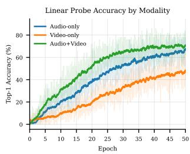  
(a) VGGSound pretraining

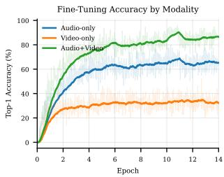  
(b) VGGSound fine-tuning  
Figure 3. Top-1 by input modality during (a) VGGSound-only pretraining (frozen-feature linear probe) and (b) end-to-end fine-tuning of the AS-2M backbone on VGGSound.

Table 3. Cross-modal retrieval on the VGGSound and AudioSet eval splits (balanced 5-per-class subsets). Recall@k (%) and median rank in both directions, on projected [CLS] embeddings.

<table><tr><td>Dataset</td><td>Dir.</td><td>R@1</td><td>R@5</td><td>R@10</td><td>Med.</td></tr><tr><td rowspan="2">VGGSound (N=1545)</td><td>A→V</td><td>10.61</td><td>26.34</td><td>35.40</td><td>25</td></tr><tr><td>V→A</td><td>10.16</td><td>27.38</td><td>36.89</td><td>24</td></tr><tr><td rowspan="2">AudioSet (N=2015)</td><td>A→V</td><td>10.62</td><td>26.34</td><td>35.47</td><td>25</td></tr><tr><td>V→A</td><td>11.16</td><td>26.14</td><td>35.91</td><td>25</td></tr></table>

## 3.3. Cross-Modal Retrieval and Attention

Audio↔video retrieval We probe whether the embedding space is genuinely shared via audio↔video retrieval on the projected [CLS] features. For each dataset we build a balanced 5-per-class evaluation subset of the official test split. Each clip is encoded twice through the backbone, once with the video zeroed (audio-only embedding) and once with the audio zeroed (video-only embedding), and we rank candidates by cosine similarity in both A→V (audio query, video gallery) and V→A directions. Table 3 reports Recall@k and median rank. On both datasets retrieval is well above the 1/N chance level (0.06% and 0.05% R@1 respectively), with R@10 reaching \~36% on both VGGSound and AudioSet, and the two directions broadly symmetric. These rankings are obtained from the same backbone with no contrastive training and no paired-retrieval supervision.

Cross-modal attention Fig. 4 qualitatively visualizes audio↔video attention from the last transformer layer on three VGGSound test clips. We extract audio-to-video and video-to-audio attention weights, average across heads, and overlay them on the original RGB frame (audio→video) and on the mel spectrogram (video→audio). Across all clips the attention concentrates on the sound-producing region in the video (the guitar and player's hands, the flute and player's mouth, the body of the flying bird) and on the harmonic / temporal structure in the audio (fundamentals and overtones for the guitar and flute, the wing-beat envelope for the bird). This emerges from the JEPA objective alone, with no localization supervision and no contrastive negatives.

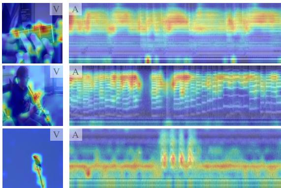  
Figure 4. Cross-modal attention on three VGGSound test clips (guitar, flute, bird). Last-layer audio→video attention overlaid on RGB frames (V); video→audio attention overlaid on mel spectrograms (A). The model attends to the visually salient sound source and to the harmonic / temporal structure of the sound, with no localization supervision.

## 4. Discussion and Conclusion

We presented AV-JEPA, the first extension of LeJEPA to cross-modal audio-visual self-supervised learning. Replacing spatial masking with modality dropout, AV-JEPA turns alignment between audio-only and video-only views into an implicit cross-modal prediction task in latent space, without decoders, reconstruction targets, stop-gradient, or EMA teachers. The recipe is clean, a single shared ViT-Base encoder, the LeJEPA loss, and one trade-off scalar $\lambda$ , yet reaches 57.1% top-1 on VGGSound and 32.7 mAP on AudioSet after fine-tuning, and supports zero-shot audio↔video retrieval. This positions theoretically grounded JEPAs as a viable alternative to masked-autoencoding pipelines for multimodal representation learning.

Limitations and future work Modality-probe and per-modality mAP results show that AV-JEPA's predictions are largely carried by audio on both VGGSound and AudioSet, making the backbone most useful as an audio representation with a visual side-channel from pretraining. The gap with end-to-end fine-tuned MAE-based methods (63–67% on VGGSound, 42–53 mAP on AudioSet) likely reflects their reconstruction and contrastive objectives, the absence of a video-specific pretraining stage, and (for MAViL) ImageNet initialisation. Next steps include longer AudioSet pretraining, larger ViTs, initialising the visual stream from a video-only stage, evaluating against single-modality SSL backbones (Gong et al., 2021; Huang et al., 2022), and extending the modality-dropout recipe to text or optical flow.

## Impact Statement

This paper presents work whose goal is to advance the field of Machine Learning. There are many potential societal consequences of our work, none which we feel must be specifically highlighted here.

## References

Araujo, E., Rouditchenko, A., Gong, Y., Bhati, S., Thomas, S., Kingsbury, B., Karlinsky, L., Feris, R., Glass, J. R., and Kuehne, H. CAV-MAE Sync: Improving contrastive audio-visual mask autoencoders via fine-grained alignment. In Proceedings of the IEEE/CVF Conference on Computer Vision and Pattern Recognition (CVPR), 2025.

Assran, M., Duval, Q., Misra, I., Bojanowski, P., Vincent, P., Rabbat, M., LeCun, Y., and Ballas, N. Self-supervised learning from images with a joint-embedding predictive architecture. In Proceedings of the IEEE/CVF Conference on Computer Vision and Pattern Recognition (CVPR), 2023.

Balestriero, R. and LeCun, Y. LeJEPA: Provable and scalable self-supervised learning without the heuristics. arXiv preprint arXiv:2511.08544, 2025.

Bardes, A., Garrido, Q., Ponce, J., Chen, X., Rabbat, M., LeCun, Y., Assran, M., and Ballas, N. Revisiting feature prediction for learning visual representations from video. arXiv preprint arXiv:2404.08471, 2024.

Chen, H., Xie, W., Vedaldi, A., and Zisserman, A. VGGSound: A large-scale audio-visual dataset. In International Conference on Acoustics, Speech and Signal Processing (ICASSP), 2020.

Dosovitskiy, A., Beyer, L., Kolesnikov, A., Weissenborn, D., Zhai, X., Unterthiner, T., Dehghani, M., Minderer, M., Heigold, G., Gelly, S., Uszkoreit, J., and Houlsby, N. An image is worth 16x16 words: Transformers for image recognition at scale. In International Conference on Learning Representations (ICLR), 2021.

Gemmeke, J. F., Ellis, D. P. W., Freedman, D., Jansen, A., Lawrence, W., Moore, R. C., Plakal, M., and Ritter, M. Audio set: An ontology and human-labeled dataset for audio events. In International Conference on Acoustics, Speech and Signal Processing (ICASSP), 2017.

Georgescu, M.-I., Fonseca, E., Ionescu, R. T., Lucic, M., Schmid, C., and Arnab, A. Audiovisual masked autoencoders. In Proceedings of the IEEE/CVF International Conference on Computer Vision (ICCV), 2023.

Girdhar, R., El-Nouby, A., Liu, Z., Singh, M., Alwala, K. V., Joulin, A., and Misra, I. ImageBind: One embedding

space to bind them all. In Proceedings of the IEEE/CVF Conference on Computer Vision and Pattern Recognition (CVPR), 2023.

Gong, Y., Chung, Y.-A., and Glass, J. AST: Audio spectrogram transformer. In Interspeech, 2021.

Gong, Y., Rouditchenko, A., Liu, A. H., Harwath, D., Karlinsky, L., Kuehne, H., and Glass, J. Contrastive audiovisual masked autoencoder. In International Conference on Learning Representations (ICLR), 2023.

Guzhov, A., Raue, F., Hees, J., and Dengel, A. AudioCLIP: Extending CLIP to image, text and audio. In International Conference on Acoustics, Speech and Signal Processing (ICASSP), 2022.

Huang, P.-Y., Xu, H., Li, J., Baevski, A., Auli, M., Galuba, W., Metze, F., and Feichtenhofer, C. Masked autoencoders that listen. In Advances in Neural Information Processing Systems (NeurIPS), 2022.

Huang, P.-Y., Sharma, V., Xu, H., Ryali, C., Fan, H., Li, Y., Li, S.-W., Ghosh, G., Malik, J., and Feichtenhofer, C. MAViL: Masked audio-video learners. In Advances in Neural Information Processing Systems (NeurIPS), 2023.

LeCun, Y. A path towards autonomous machine intelligence. Technical report, OpenReview, 2022.

Loshchilov, I. and Hutter, F. Decoupled weight decay regularization. In International Conference on Learning Representations (ICLR), 2019.

Nagrani, A., Yang, S., Arnab, A., Jansen, A., Schmid, C., and Sun, C. Attention bottlenecks for multimodal fusion. In Advances in Neural Information Processing Systems (NeurIPS), 2021.

## Appendices

## A. LLM/Agent Usage

The authors made use of LLMs and agents throughout this work. In writing, they assisted with drafting, editing, and producing plots. They were also used during model development. LLMs/agents were not used for ideation.

## B. Related Work

Audio-visual SSL The dominant approach uses masked autoencoding: AV-MAE (Georgescu et al., 2023) jointly reconstructs masked audio and video; CAV-MAE (Gong et al., 2023) combines contrastive learning with masked reconstruction; MAViL (Huang et al., 2023) adds self-training; and CAV-MAE Sync (Araujo et al., 2025) introduces fine-grained temporal alignment. All require decoder networks for pixel/spectrogram reconstruction or contrastive negatives. AV-JEPA keeps neither.

Audio-only SSL backbones On the audio side, AST (Gong et al., 2021) introduces a transformer backbone for spectrograms and AudioMAE (Huang et al., 2022) adapts MAE-style masked spectrogram modelling to audio. AV-JEPA bypasses per-modality pretraining and trains a single shared backbone from scratch with a cross-modal JEPA objective.

JEPAs I-JEPA (Assran et al., 2023) applies JEPA to images using spatial masking, and V-JEPA (Bardes et al., 2024) extends it to video. LeJEPA (Balestriero & LeCun, 2025) provides the theoretical grounding via SIGReg. All prior JEPA work operates on a single modality; AV-JEPA is, to our knowledge, the first to extend JEPA to cross-modal audio-visual learning, with modality dropout as the partial-view mechanism rather than spatial masking.

Cross-modal alignment AudioCLIP (Guzhov et al., 2022) and ImageBind (Girdhar et al., 2023) learn shared embedding spaces across modalities via large-scale contrastive pretraining. AV-JEPA achieves cross-modal alignment as a by-product of the LeJEPA invariance loss on modality-dropout views, with no contrastive negatives.

Multimodal fusion Early fusion concatenates modality tokens before processing (Nagrani et al., 2021); late fusion uses separate encoders. AV-JEPA uses early fusion with modality-type embeddings, enabling the shared transformer to learn cross-modal interactions from the first layer.

## C. Encoder Architecture

Fig. 5 shows the full AV-JEPA encoder used for every view (global and local) during pretraining. Video frames of shape $3 \times 16 \times 224 \times 224$ are tokenized by a $2 \times 16 \times 16$ Conv3D tubelet into 1568 video tokens; the mel spectrogram of shape $1 \times 128 \times 801$ is tokenized by a $16 \times 16$ Conv2D into 400 audio tokens. Both streams receive factorized positional embeddings (spatial + temporal for video; frequency + time for audio) and a learnable modality-type embedding (ID 0 for video, ID 1 for audio). A learnable [CLS] token is prepended and the resulting 1969-token sequence is passed through a 12-layer ViT-Base (d=768, 12 heads, FlashAttention-2). On local views, the tokens of the dropped modality are zeroed before patch embedding, so the same encoder handles joint, audio-only, and video-only inputs without architectural changes. The [CLS] output is taken as the clip embedding and fed to the projection MLP for the LeJEPA loss (Fig. 1).

## D. Training Configurations

We summarise all training configurations used in the paper in two consolidated tables. Table 4 lists the fine-tuning recipe applied on top of either backbone for VGGSound classification. Table 5 lists the pretraining recipes for the AudioSet-2M run (the backbone used in our main experiment) and the VGGSound-only run (the controlled secondary study).

## E. Additional Embedding-Quality Curves

Fig. 6 tracks the per-dimension standard deviation of the projected embeddings over training for both pretraining runs. In each case the value rises rapidly toward $\sim1.01$ (from $\sim0.8$ on VGGSound and $\sim0.8$ on AudioSet), confirming that SIGReg drives the embedding distribution toward the target isotropic Gaussian $\mathcal{N}(\mathbf{0},\mathbf{I})$ at both VGGSound and AudioSet scales.

## F. Additional Pretraining Curves

Pretraining loss components Fig. 7 decomposes the LeJEPA objective into its two unweighted terms. The invariance term decreases steadily, indicating that view embeddings converge toward the global center $\bar{z}$ and that cross-modal alignment is successful. The SIGReg term drops sharply during the first epoch and then plateaus near zero, confirming that the embedding distribution matches the target isotropic Gaussian early in training and remains there for the rest of the run.

Online probe curves Fig. 8 reports the online linear and attentive probes on frozen backbone features during pretraining: attentive probe top-1 accuracy, top-5 accuracy for both probes, and the combined cross-entropy loss. The attentive probe consistently outperforms the linear probe by $\sim$ 2–3 points across both top-1 and top-5.

## G. AudioSet Pretraining Curves

We complement the AudioSet pretraining loss in the main text with the per-component invariance and SIGReg curves (Fig. 9). The qualitative behaviour mirrors the VGGSound-only run: the invariance term decreases steadily and the SIGReg term drops sharply during the first epoch and then plateaus near zero, confirming that SIGReg behaves as expected at AudioSet scale.

## H. Fine-Tuning Training Curves

Fig. 10 shows the end-to-end fine-tuning curves (top-1/top-5 accuracy and cross-entropy loss) when the pretrained AV-JEPA backbone is fine-tuned with a linear classifier on the [CLS] token.

## I. Joint Embedding t-SNE by Modality

Fig. 11 shows two-dimensional t-SNE projections of the projected [CLS] embeddings on the same balanced 5-per-class evaluation subsets used for retrieval (AudioSet N=2015, VGGSound N=1545 clips). Each clip contributes two points: one obtained by encoding the clip with the video tokens zeroed (audio-only, orange) and one with the audio tokens zeroed (video-only, blue), so an unshared embedding space would manifest as two well-separated colour clusters. Instead, on both datasets the two modalities are interleaved across the same regions of the projected space, with no visible modality-conditioned partition, indicating that AV-JEPA has learned a genuinely shared cross-modal embedding space rather than two parallel single-modality manifolds. This is consistent with the cross-modal retrieval results in Table 3: a shared embedding space is exactly what makes cosine ranking of audio against video, and vice versa, meaningful in the first place.

## J. Semantic Structure of the Embedding Space

Where Sec. I asks whether the two modalities share a space, Fig. 12 asks whether that space is organised by semantic content. We encode N=11,143 VGGSound training clips spanning 60 classes, grouped into six coarse semantic families (instruments, animals, vehicles, water/weather, human voice, and sports), take the [CLS] embedding of each clip from the fine-tuned AV-JEPA ViT-B backbone (the same backbone behind Table 1), and project the L2-normalised embeddings to two dimensions with t-SNE; points are coloured by family. Clips organise into compact, well-separated clusters that respect the family grouping: each family occupies coherent regions of the projected space, and the finer per-class structure within a family (for example the individual instruments) is visible as distinct same-colour sub-clusters. The residual overlap is concentrated between families that are acoustically and visually related, most notably animal vocalisations and human voice, which is consistent with the cross-modal attention behaviour of Fig. 4 and indicates that the learned space is structured by semantics rather than by low-level modality cues.

## K. Feature PCA of Video Patch Tokens

Fig. 20 visualises the video patch-token features of the fine-tuned AV-JEPA ViT-B encoder (the same backbone behind the VGGSound classification results in Table 1) in the style of DINO/DINOv2 feature PCA. For each instrument class we fit a single PCA jointly over the pooled last-layer video patch tokens of four VGGSound clips, map the top three principal components to RGB, and overlay the result on the video frames (rows are clips, columns are frames; audio tokens are left uncoloured); because the basis is shared across the four clips, a given colour denotes the same direction in feature space. The sounding object (the piano keyboard, the body and neck of the bass guitar, the violin) then takes a consistent colour across clips and frames, clearly separated from the player and the background, indicating that the encoder represents the visually salient sound source as a coherent, instance-corresponding region of feature space, even though it is trained only with clip-level objectives and never receives pixel- or region-level supervision, echoing in the video stream the localization behaviour seen in the cross-modal attention maps of Fig. 4.

## L. Ablations and LeJEPA Hyperparameter Tuning

We complement the main results with one architectural ablation and two hyperparameter sensitivity studies, all run as VGGSound-only pretraining with the same ViT-B early-fusion recipe as the controlled run reported in the main text. The dual-encoder ablation is run on $8 \times$ NVIDIA H200 to match the controlled main-text run; the SIGReg-weight $\lambda$ and local-view K sweeps are run on $1 \times$ NVIDIA H200 (batch size 32 per GPU) under a tighter compute budget. All curves are clipped to the shortest variant's final epoch, ensuring a common training budget.

Shared vs. dual encoder (ablation). Fig. 13 compares the shared early-fusion encoder used in AV-JEPA against a dual-encoder variant that processes audio and video through separate ViT-B encoders and averages the two [CLS] tokens. The shared encoder matches the dual-encoder variant on both linear- and attentive-probe accuracy throughout training; we adopt early fusion for its simpler, single-encoder design.

SIGReg weight $\lambda$ (LeJEPA hyperparameter). Fig. 14 sweeps the SIGReg weight $\lambda$ in the LeJEPA loss $\mathcal{L} = (1 - \lambda)\mathcal{L}_{\mathrm{inv}} + \lambda \mathcal{L}_{\mathrm{SIGReg}}$ across $\{0.03, 0.05, 0.10\}$ . The probeaccuracy curves are tightly clustered, indicating that AV-JEPA is robust to moderate variation in $\lambda$ on VGGSound. The SIGReg loss itself naturally rises with $\lambda$ (since the optimiser tolerates more residual SIGReg in exchange for a stronger invariance gradient), but the resulting embedding standard deviation remains close across settings.

Number of local views K (LeJEPA hyperparameter). Fig. 15 sweeps the number of local (modality-dropout) views K across $\{2, 4, 6, 8\}$ while keeping the two global views fixed. The linear and attentive probes are largely insensitive to K, suggesting that the default of two local views already provides sufficient cross-modal regularisation; we did not see a clear benefit from increasing K.

## L.1. Loss-component and pipeline ablations

We additionally run four hyperparameter ablations of the VGGSound recipe, each with one change from the 1-GPU ablation baseline (ViT-B, batch size 32, $\lambda=0.05$ , modality dropout and video tubelet/frequency-time masking, attentive probe). All runs share the same wall-clock budget and reach $\sim6-7$ epochs of VGGSound pretraining; figures are clipped to the common range. We deliberately plot only the LeJEPA loss components and the embedding standard deviation, not probe top-1: with $\lambda=0$ the embedding collapses to a point and with $\lambda=1$ views never align, so probe accuracy is not a meaningful basis for comparison across these runs. The losses and the embedding distribution remain directly comparable.

Removing the SIGReg term ( $\lambda=0$ ). Fig. 16 sets $\lambda=0$ , training only on the invariance loss without the SIGReg regulariser. The invariance loss drops to $\sim10^{-7}$ almost immediately and the embedding standard deviation collapses from the baseline trajectory towards $\sim10^{-4}$ , both consistent with the trivial constant-output solution. The SIGReg loss itself, although not optimised, rises far above the baseline range, confirming that the resulting embedding distribution is arbitrarily far from the target isotropic Gaussian. This isolates SIGReg as the component that prevents representation collapse in the audio-visual setting, mirroring the role it plays in LeJEPA on images.

Removing the invariance term ( $\lambda=1$ ). Fig. 17 sets $\lambda=1$ , training only on SIGReg. The embedding standard deviation reaches the target $\sim1$ , confirming that SIGReg alone can shape the distribution, but the invariance loss stays roughly an order of magnitude above the baseline throughout training: there is no signal pulling different views of the same clip together. This isolates the invariance loss as the component responsible for cross-modal alignment.

Removing modality dropout and masking. Fig. 18 disables modality dropout, tube masking, and frequency/time masking ( $p_{drop}=0$ , $r_{vid}=0$ , $r_{aud}=0$ ). Local views then differ from the global views only through random resized crops and horizontal flips, while always retaining both modalities. The invariance loss drops one to two orders of magnitude below the baseline trajectory because the alignment task is trivialised: there is no partial-view perturbation forcing the model to predict the missing modality from the surviving one. SIGReg behaves similarly to the baseline, so the embedding distribution is still well shaped, but the LeJEPA loss as a whole loses its information bottleneck. This confirms that modality dropout (rather than just spatial cropping) is what makes the JEPA target non-trivial in the audio-visual setting.

Backbone capacity: ViT-Small vs. ViT-Base. Fig. 19 replaces the ViT-B backbone ( $d_{z}=768$ , \~86M parameters) with ViT-S ( $d_{z}=384$ , \~22M parameters), keeping every other hyperparameter fixed. ViT-S follows the same overall loss trajectory as the baseline: the LeJEPA, invariance, and SIGReg losses track the ViT-B curves within a small constant offset, and the embedding standard deviation converges toward the same regime. The smaller backbone reaches a slightly lower invariance loss within the 6–7-epoch budget, plausibly because there is less representational capacity to spread across, but the qualitative dynamics are unchanged. This indicates that the LeJEPA recipe is not specific to ViT-B and transfers to a smaller backbone without retuning $\lambda$ or the view schedule.

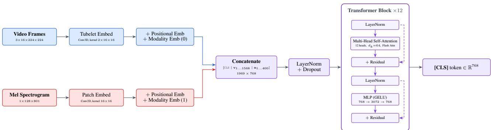  
Figure 5. AV-JEPA early-fusion encoder. Video tubelets and mel-spectrogram patches are embedded, summed with factorized positional and modality-type embeddings, concatenated with a [CLS] token, and processed by a 12-layer ViT-Base. The same encoder is used for every view, including the modality-dropout local views, where the absent modality's input tensor is zeroed before patch embedding.

Table 4. Fine-tuning configuration (VGGSound classification, main experiment fine-tuning the AudioSet-pretrained backbone for the headline 57.1% top-1 result). The controlled VGGSound-only secondary study uses the same recipe but with 6 epochs.

<table><tr><td>Setting</td><td>Value</td></tr><tr><td colspan="2">Heads on top of pretrained backbone</td></tr><tr><td>Linear classifier</td><td>LayerNorm + linear on [CLS] (309 classes)</td></tr><tr><td>Attentive classifier</td><td>1 query, 12-head cross-attention + linear (309 classes)</td></tr><tr><td colspan="2">Optimization</td></tr><tr><td>Optimizer</td><td>AdamW</td></tr><tr><td>Head learning rate</td><td> $2 \times 10^{-4}$ </td></tr><tr><td>Backbone learning rate</td><td> $1 \times 10^{-5}$  ( $0.05 \times$  head LR)</td></tr><tr><td>Weight decay</td><td>0.05</td></tr><tr><td>LR schedule</td><td>Linear warmup ( $5\%$ ) + cosine to  $10^{-7}$ </td></tr><tr><td>Gradient clipping</td><td>1.0</td></tr><tr><td>Label smoothing</td><td>0.1</td></tr><tr><td>Mixed precision</td><td>bf16</td></tr><tr><td>Batch size (per GPU)</td><td>80</td></tr><tr><td>Effective batch size</td><td>320</td></tr><tr><td>Epochs</td><td>13</td></tr><tr><td colspan="2">Data and views</td></tr><tr><td>SSL augmentations</td><td>none (single global view, no modality dropout)</td></tr><tr><td>Train-time eval</td><td>best top-1 along trajectory</td></tr><tr><td>Test-time aggregation</td><td>6 clips, averaged logits</td></tr><tr><td colspan="2">Compute</td></tr><tr><td>GPUs</td><td>4× NVIDIA H200</td></tr><tr><td>Parallelism</td><td>DDP</td></tr><tr><td>Wall-clock time</td><td>~29 h</td></tr></table>

Table 5. Pretraining configurations. Both runs share the same backbone (ViT-Base early-fusion), optimizer, and LeJEPA recipe, and differ only in dataset, batch size, and number of epochs. The online linear and attentive classification probes are attached only to the VGGSound-only run.

<table><tr><td>Setting</td><td>AudioSet-2M (main)</td><td>VGGSound (controlled)</td></tr><tr><td colspan="3">Data</td></tr><tr><td>Dataset</td><td>AudioSet-2M (unbalanced)</td><td>VGGSound (train)</td></tr><tr><td>Training samples</td><td>~2M</td><td>~184k</td></tr><tr><td>Clip length</td><td>8 s (from 10 s clip, random offset)</td><td>8 s (from 10 s clip, random offset)</td></tr><tr><td colspan="3">Architecture</td></tr><tr><td>Encoder</td><td>ViT-Base (12L, 768d, 12h)</td><td>ViT-Base (12L, 768d, 12h)</td></tr><tr><td>Audio embed</td><td>Conv2D, kernel/stride 16×16</td><td>Conv2D, kernel/stride 16×16</td></tr><tr><td>Video embed</td><td>Conv3D, kernel/stride 2×16×16</td><td>Conv3D, kernel/stride 2×16×16</td></tr><tr><td>Sequence length</td><td>1969 (1 CLS + 1568 V + 400 A)</td><td>1969 (1 CLS + 1568 V + 400 A)</td></tr><tr><td>Projector</td><td>3-layer MLP, 768→2048→2048→128</td><td>3-layer MLP, 768→2048→2048→128</td></tr><tr><td colspan="3">LeJEPA recipe</td></tr><tr><td>Global views G</td><td>2</td><td>2</td></tr><tr><td>Local views K</td><td>2 (cross-modal: 1 audio-only, 1 video-only)</td><td>2 (cross-modal: 1 audio-only, 1 video-only)</td></tr><tr><td>Modality dropout</td><td>yes</td><td>yes</td></tr><tr><td>λ (SIGReg weight)</td><td>0.05</td><td>0.05</td></tr><tr><td>SIGReg directions</td><td>resampled per step</td><td>resampled per step</td></tr><tr><td colspan="3">Optimization</td></tr><tr><td>Optimizer</td><td>AdamW</td><td>AdamW</td></tr><tr><td>Learning rate</td><td> $5 \times 10^{-4}$ </td><td> $5 \times 10^{-4}$ </td></tr><tr><td>Weight decay</td><td>0.05</td><td>0.05</td></tr><tr><td>LR schedule</td><td>Linear warmup (15%) + cosine to  $10^{-6}$ </td><td>Linear warmup (15%) + cosine to  $10^{-6}$ </td></tr><tr><td>Gradient clipping</td><td>5.0</td><td>5.0</td></tr><tr><td>Mixed precision</td><td>bf16</td><td>bf16</td></tr><tr><td>Batch size (per GPU)</td><td>40</td><td>50</td></tr><tr><td>Effective batch size</td><td>320</td><td>400</td></tr><tr><td>Epochs</td><td>57</td><td>50</td></tr><tr><td>Optimizer steps</td><td>~341k</td><td>~23k</td></tr><tr><td colspan="3">Online probes (frozen backbone, gradients detached)</td></tr><tr><td>Linear probe</td><td>-</td><td>LayerNorm + linear on [CLS]</td></tr><tr><td>Attentive probe</td><td>-</td><td>1 query, 12-head cross-attention</td></tr><tr><td>Probe LR</td><td>-</td><td> $10^{-3}$ </td></tr><tr><td>Probe weight decay</td><td>-</td><td>0</td></tr><tr><td>Probe label smoothing</td><td>-</td><td>0.1</td></tr><tr><td colspan="3">Compute</td></tr><tr><td>GPUs</td><td>8× NVIDIA H200</td><td>8× NVIDIA H200</td></tr><tr><td>Parallelism</td><td>DDP</td><td>DDP</td></tr><tr><td>Wall-clock time</td><td>~192 h</td><td>~10 h</td></tr></table>

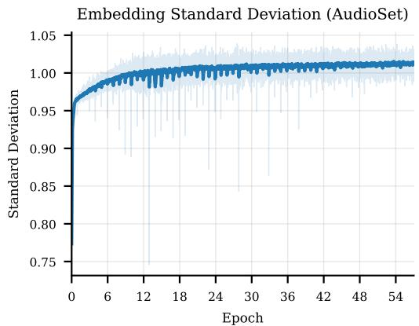  
(a) AudioSet-2M (57 ep.)

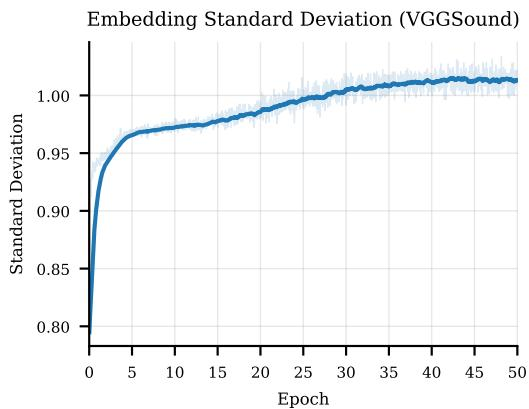  
(b) VGGSound (50 ep.)  
Figure 6. Embedding standard deviation over training. SIGReg drives the per-dimension std toward 1.0 (the isotropic Gaussian target).

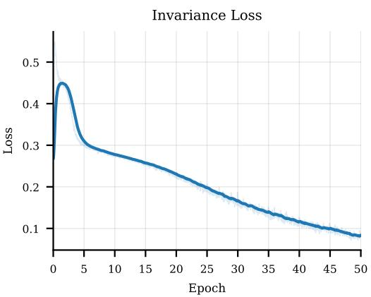  
(a) Invariance loss

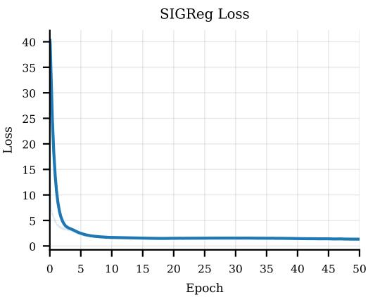  
(b) SIGReg loss  
Figure 7. Pretraining loss components (VGGSound-only run, 50 epochs).

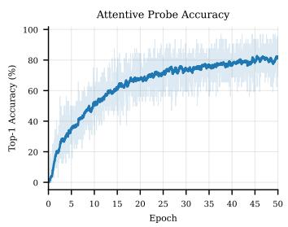  
(a) Attentive probe top-1

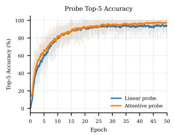  
(b) Probe top-5 (linear vs. attentive)

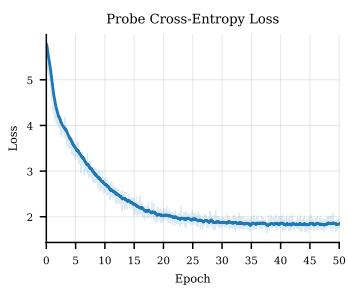  
(c) Probe cross-entropy loss  
Figure 8. Online probing curves on frozen backbone features during pretraining.

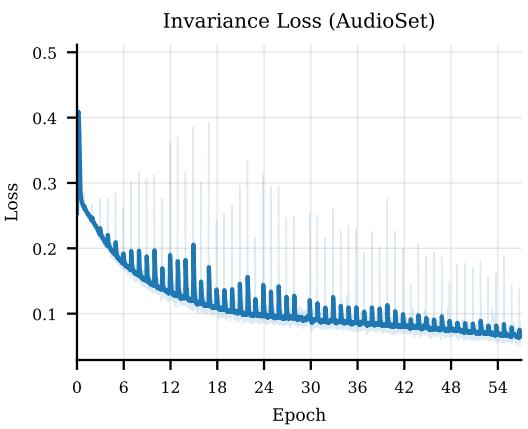  
(a) Invariance loss

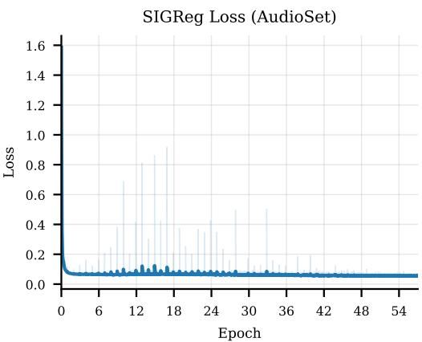  
(b) SIGReg loss  
Figure 9. AudioSet pretraining loss components over 57 epochs of AudioSet-2M.

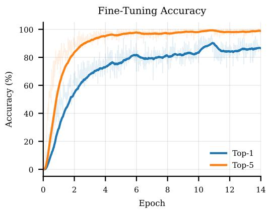  
(a) Top-1 / Top-5 accuracy

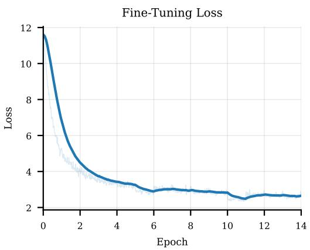  
(b) Cross-entropy loss  
Figure 10. Fine-tuning curves for end-to-end fine-tuning of the pretrained AV-JEPA backbone.

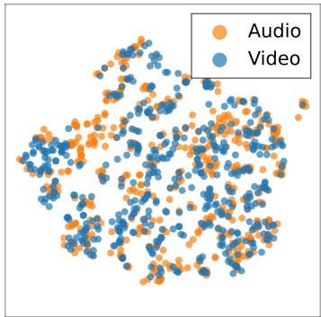  
(a) AudioSet

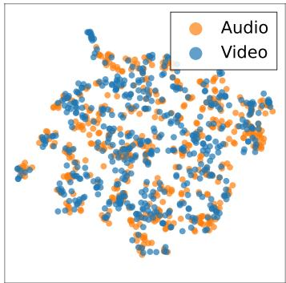  
(b) VGGSound  
Figure 11. Joint embedding t-SNE by modality. Projected [CLS] embeddings on the 5-per-class retrieval subsets, with each clip contributing an audio-only (orange) and a video-only (blue) point. The two modalities are mixed rather than separated, indicating a shared cross-modal embedding space.

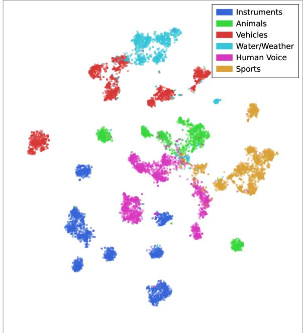  
Figure 12. Semantic structure of the embedding space. t-SNE of the [CLS] embeddings of the fine-tuned AV-JEPA ViT-B backbone for N=11,143 VGGSound training clips drawn from 60 classes grouped into six semantic families (colours). Clips cluster by family with finer per-class sub-structure of the same colour; the residual overlap falls mainly between acoustically related families (animal calls vs. human voice).

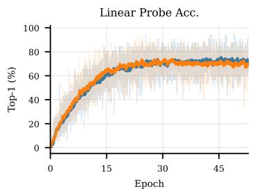

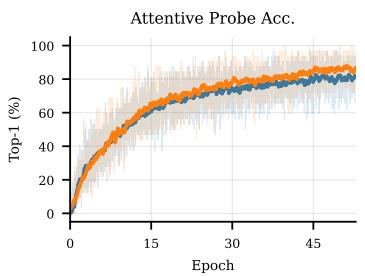

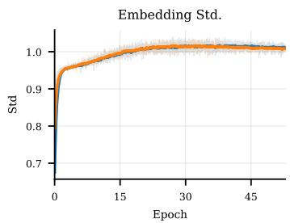

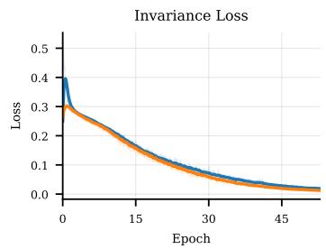

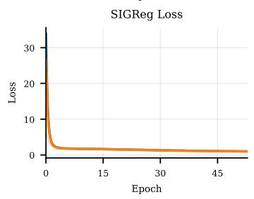  
Shared encoder (baseline) Dual encoder

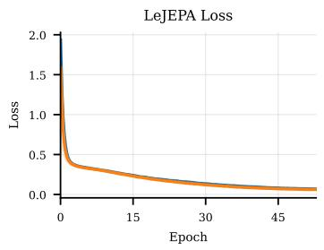  
Figure 13. Architectural ablation: shared vs. dual encoder on VGGSound pretraining. Linear-/attentive-probe top-1 accuracy, embedding standard deviation, invariance loss, SIGReg loss, and total LeJEPA loss are plotted against pretraining epoch. Curves are clipped to the shorter of the two runs ( $\sim$ 53 epochs).

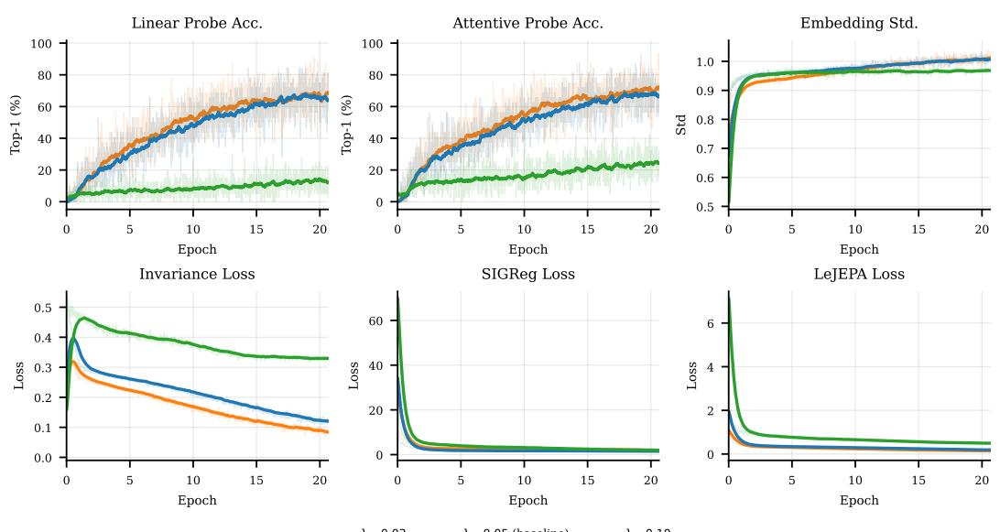  
Figure 14. LeJEPA hyperparameter sensitivity: SIGReg weight $\lambda$ on VGGSound pretraining, sweeping $\lambda \in \{0.03, 0.05, 0.10\}$ with $\lambda = 0.05$ as the baseline used elsewhere in the paper. Curves are clipped to the shortest run ( $\lambda = 0.10$ , $\sim 21$ epochs).

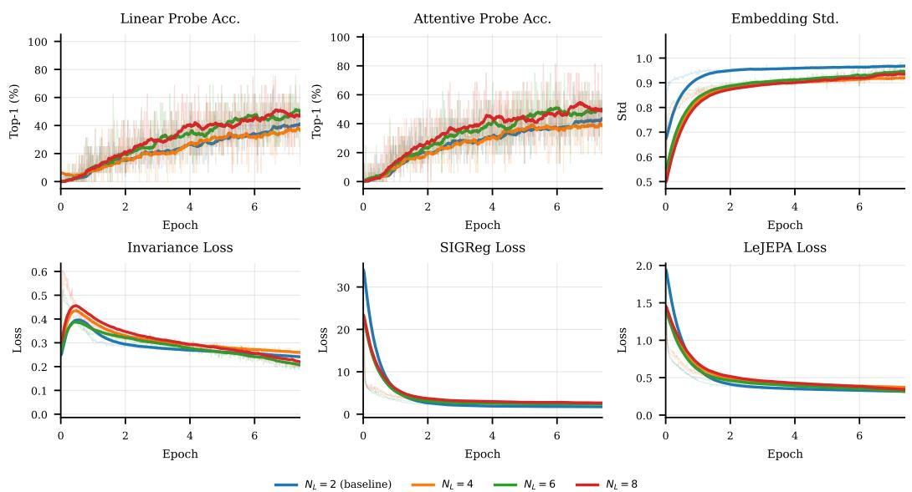  
Figure 15. LeJEPA hyperparameter sensitivity: number of local views $K$ on VGGSound pretraining, sweeping $K \in \{2, 4, 6, 8\}$ with $K = 2$ as the paper's default. Curves are clipped to the shortest run ( $K = 8$ , $\sim 7$ epochs).

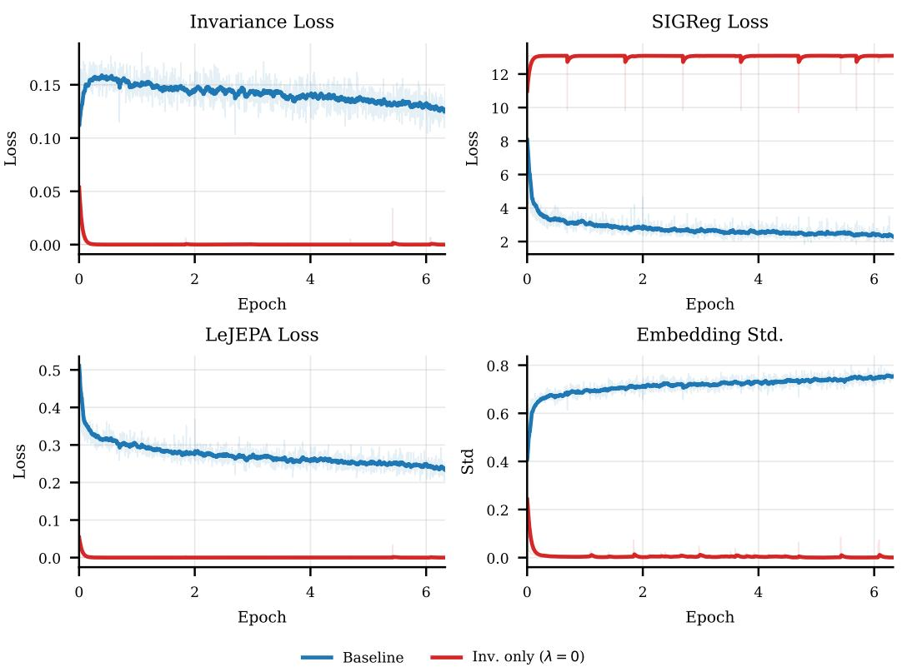  
Figure 16. Removing SIGReg ( $\lambda=0$ ) vs. the baseline ( $\lambda=0.05$ ) on VGGSound pretraining. Without the SIGReg term, the invariance loss collapses to zero and the embedding standard deviation drops several orders of magnitude below the baseline, indicating representation collapse.

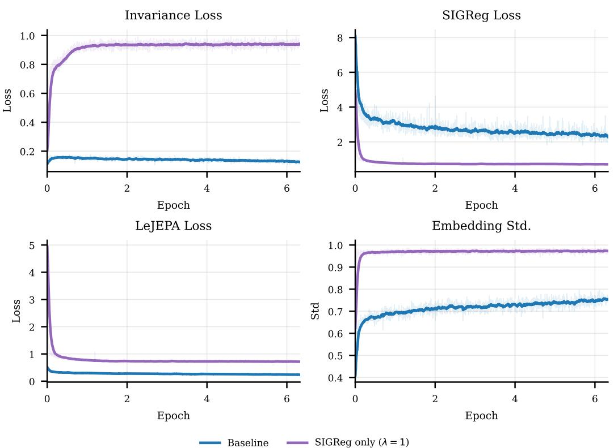  
Figure 17. Removing the invariance loss ( $\lambda=1$ ) vs. the baseline ( $\lambda=0.05$ ) on VGGSound pretraining. SIGReg alone drives the embedding standard deviation to its target, but the invariance loss never decreases, indicating that the model never learns to align global and local views without the invariance term.

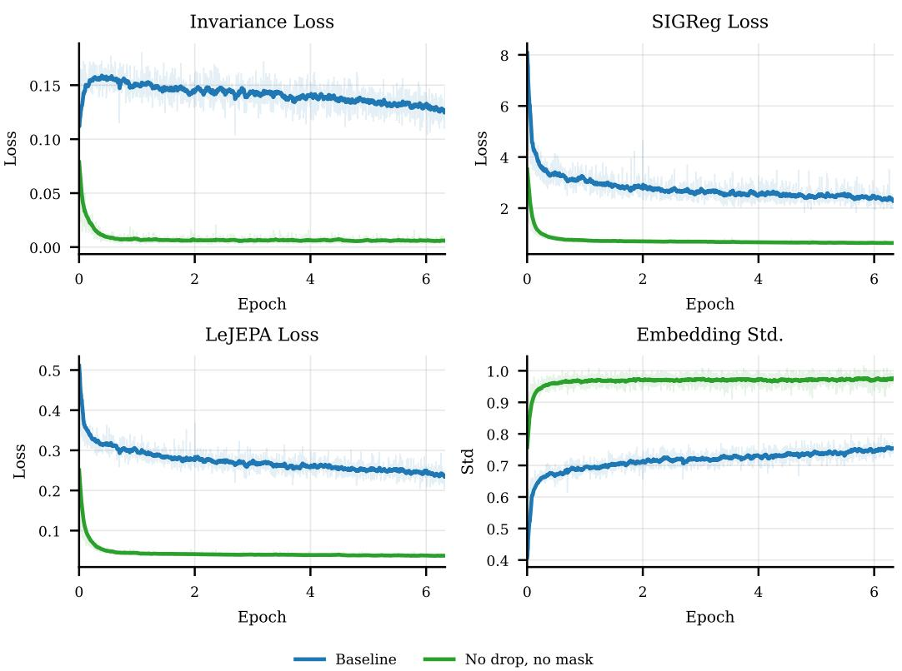  
Figure 18. Removing modality dropout and tube/freq-time masking vs. the baseline on VGGSound pretraining. Without partial-view perturbations the invariance loss collapses to near zero, indicating that alignment between global and local views becomes trivial when both modalities are always present and unmasked.

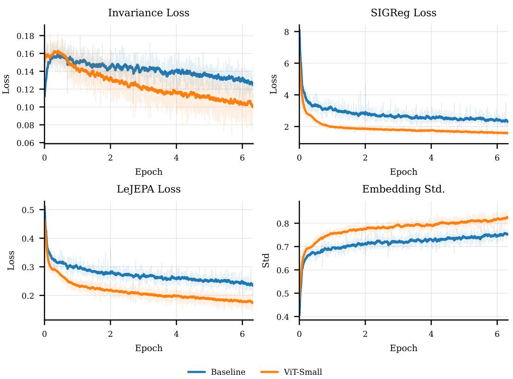  
Figure 19. ViT-Small backbone vs. the ViT-Base baseline on VGGSound pretraining. All three loss components and the embedding standard deviation track the baseline curves within a small offset, indicating that the LeJEPA recipe transfers to a smaller backbone without retuning.

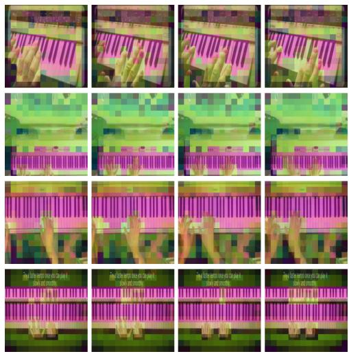

(a) Playing piano  
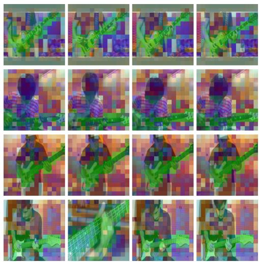

(b) Playing bass guitar  
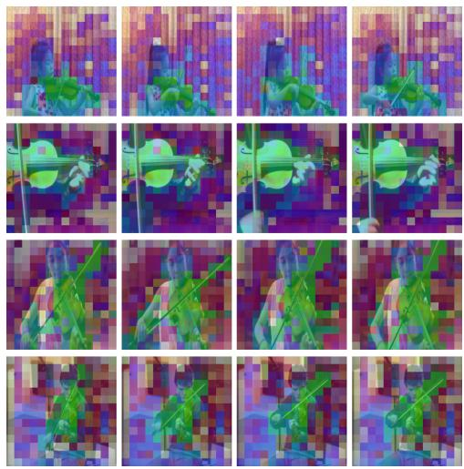  
(c) Playing violin  
Figure 20. Feature PCA of video patch tokens for three VGGSound instrument classes. A single PCA is fit jointly over the last-layer video patch tokens of four clips per class (rows); its top three components are mapped to RGB and overlaid on four frames per clip (columns). The instrument takes a consistent colour across clips and frames, distinct from the player and the background.