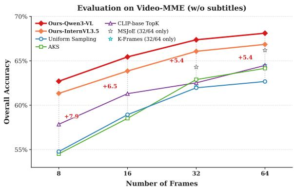
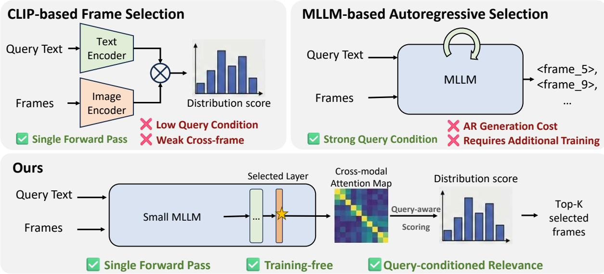
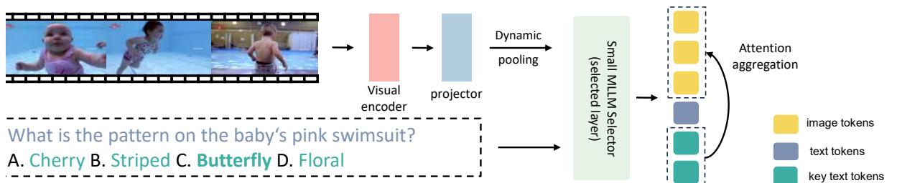
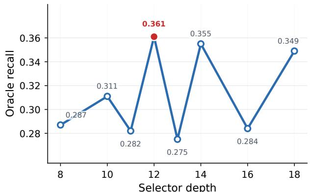
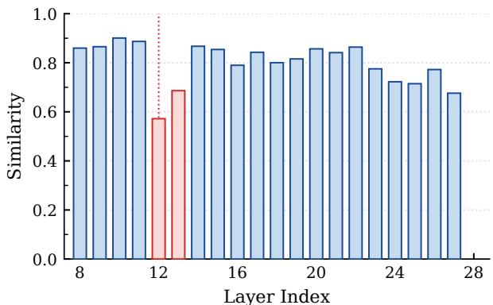
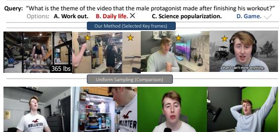
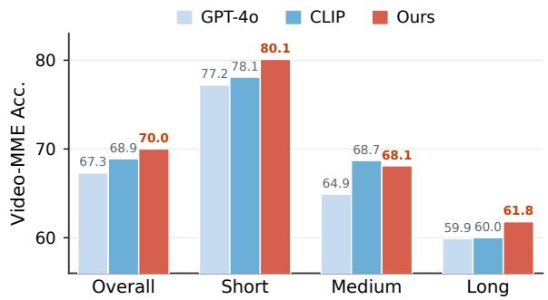

# Efficient Frame Selection for Long Videos at Test Time with Attention-Based MLLM Selectors

Yilin Wang1\* Xiangxi Zheng2\* Dongxing Mao3 Linjie Li4 Zhengyuan Yang4 Ping Yu2 Rui Yan5 Yuan Yao2 Alex Jinpeng Wang3 1ZJU 2NJU 3CSU 4Microsoft 5NJUST

## Abstract

Understanding long videos with multimodal large language models (MLLMs) requires selecting a compact set of frames from thousands of candidates, yet identifying the right frames seemingly requires understanding the video first. We resolve this circular dependency with a simple observation: cross-modal attention at validation-selected extraction layers in MLLMs already provides query-relevant frame evidence without requiring autoregressive generation. We exploit this property to build DAFS (Dynamic Attention-based Budgetaware Frame Selection), a training-free frame selector. A lightweight MLLM selector, even with only 2B parameters, can extract framelevel evidence by converting selected-layer attention into relevance scores through queryconditioned aggregation. This enables crossframe comparison without autoregressive decoding. To handle the selector’s own context constraint, we formulate the joint allocation of candidate pool size and per-frame token budget as a discrete optimization problem solved by dynamic programming. Under a 32-frame budget, our selector improves over uniform sampling by up to 6.4 points on Video-MME and outperforms prior training-based selectors under matched frame budgets, while generalizing across selector and answerer backbones, and across tasks, without retraining.

## 1 Introduction

Multimodal large language models (MLLMs) have recently achieved impressive progress in video understanding (Bai et al., 2025; Wang et al., 2025). However, this capability comes with a practical bottleneck: long videos contain far more frames than current models can process (Wang et al., 2024b; Shen et al., 2024). Encoding every frame quickly exceeds the limited context and visual-token budgets of current architectures, making dense video processing computationally infeasible. Therefore, long video understanding largely reduces to a problem: selecting a small set of informative frames that retrieves query-relevant visual evidence.

  
Figure 1: Performance–efficiency overview. Our selector improves long-video understanding while keeping the selection stage lightweight, illustrating the accuracy–cost trade-off targeted by this work.

Existing approaches navigate a trade-off between semantic depth and computational cost (Figure 2). Uniform sampling (Wang et al., 2024a; Bai et al., 2025; Lin et al., 2024; Maaz et al., 2024) is cheap but content-blind: it treats all temporal regions as equally important and often misses sparse, decisive events in long videos. CLIP-based methods (Tang et al., 2025; Zhang et al., 2025; Liu et al., 2025) score frames by query–frame similarity, but do so independently, without cross-frame context or strong query conditioning. More generally, this setting is not standard image-text retrieval. Rather than retrieving visually similar frames in isolation, it requires selecting a compact set of complementary evidence frames that best supports long-video QA under a fixed answerer budget. MLLM-based selectors (Yao et al., 2025b; Xu et al., 2025) offer deeper semantic reasoning. However, feeding multiple frames into an MLLM produces a large number of visual tokens, which are constrained by the model’s limited context window and thus restrict the number of frames that can be processed jointly. In addition, the autoregressive inference paradigm introduces non-trivial latency, further increasing computational cost and limiting scalability to long video sequences.

  
Figure 2: Comparison of text-guided frame selection paradigms for long video understanding. CLIP-based methods score frames independently with weak query conditioning. MLLM-based autoregressive selectors achieve strong query conditioning but require additional training. Our method extracts cross-modal attention from a small MLLM in a single forward pass for training-free, query-conditioned selection.

We observe that MLLMs already expose a useful retrieval signal before answer generation. At validation-selected extraction layers, cross-modal attention concentrates on a small set of queryrelevant visual tokens and preserves frame-level evidence (Figure 4). Rather than asking an MLLM to autoregressively select frames, we introduce DAFS (Dynamic Attention-based Budget-aware Frame Selection), which reuses this attention as a lightweight evidence score: text-to-vision attention is converted to frame-level scores through queryconditioned aggregation, enabling even a small selector to rank frames for a stronger answerer without autoregressive decoding.

The selector, however, is constrained by a finite context window, limiting both the number of candidate frames and the visual-token budget it can process. We formulate this selector-side allocation as a budgeted discrete optimization problem that jointly determines (i) the candidate frame pool size and (ii) the per-frame visual token allocation under a fixed context constraint, solved efficiently via dynamic programming; the final answerer still receives the selected frames in original resolution.

In summary, our contributions are threefold: (1) a lightweight sparse frame selection framework featuring a small MLLM selector with cross-modal attention for query-guided frame comparison in long videos; (2) a budgeted dynamic programming formulation that jointly optimizes the candidate frame pool size and per-frame visual token allocation under context constraints; and (3) extensive experiments showing that our approach consistently outperforms uniform sampling, heuristic keyframe extraction, CLIP-based, and MLLM-based selection while remaining computationally efficient (Figure 1).

## 2 Related Work

## 2.1 MLLMs for Long-form Video

Recent MLLMs have enabled cross-modal video reasoning (Bai et al., 2025; Lin et al., 2024). For long-form inputs, prior work mainly improves architectures, training pipelines, visual encoders, and temporal modeling, including video-specialized MLLMs (Li et al., 2025; Jin et al., 2024; Cheng et al., 2024), multi-scale visual modeling (Li et al., 2024; Xu et al., 2024), and long-context or temporally compressed designs (Chen et al., 2024; Shu et al., 2025; Fei et al., 2024; Shen et al., 2024; Cheng et al., 2025; Team et al., 2025). Our work is orthogonal to these efforts: we focus on test-time input construction for existing MLLMs.

## 2.2 CLIP-based Frame Selection

CLIP-based frame selection uses pretrained visionlanguage encoders (e.g., CLIP/SigLIP) to score query–frame similarity, often with diversity or coverage heuristics. BOLT (Liu et al., 2025) uses inverse transform sampling, AKS (Tang et al., 2025)

balances prompt relevance and coverage under a token budget, and Q-Frame (Zhang et al., 2025) ranks frames into multiple compute tiers. These methods are efficient but per-frame and similarity-driven, which underuse cross-frame temporal context.

## 2.3 MLLM-based Frame Selection

MLLM-based selectors can use richer query-video semantics but often incur training or inference overhead. FFS (Buch et al., 2025) trains selectors with downstream losses; Frame-Voyager (Yu et al., 2024) ranks candidates by task contribution; and ViaRL (Xu et al., 2025), ReFoCUS (Lee et al., 2025), and SeViLA (Yu et al., 2023) use reinforcement or self-learning. GenS (Yao et al., 2025a) and Chain-of-Frames (Ghazanfari et al., 2025) rely on keyframe supervision, while A.I.R. (Zou et al., 2025), GIFT (Ma et al., 2026), and MSJoE (Tan et al., 2026) use iterative reasoning, global frame utility, or coupled sampler optimization. In contrast, we use attention from an off-the-shelf small MLLM as a lightweight selector signal while keeping the answerer fixed.

## 3 Method

As shown in Figure 3, we propose a lightweight and budget-aware framework for retrieving queryrelevant frames from long videos under a strict visual token budget. Our approach is motivated by an empirical observation: cross-modal attention in MLLMs tends to concentrate on query-relevant visual regions. We exploit this signal as a lightweight proxy for frame relevance, enabling efficient selection without processing the entire video with the backbone MLLM. However, long videos typically contain far more visual tokens than the selector’s input window can hold. To ensure scalability, we introduce budget-aware frame sampling and spatial token compression to build a compact candidate representation under a controlled visual-token budget. Finally, we formulate a dynamic programming strategy that learns an optimal duration-aware allocation policy, balancing temporal coverage and spatial detail under a fixed token budget.

Pipeline Overview. Our pipeline operates in four steps. First, we build a candidate pool by extracting frames at a base rate of 1 FPS (adaptively increased for short videos) and uniformly subsample $F ( d )$ frames by video duration d. Second, we compress each sampled frame into $P ( d )$ visual tokens so the total strictly fits the global budget B. Third, the selector computes a query-conditioned relevance score for each candidate using text-to-vision attention over semantically important query tokens. Finally, we rank candidates by these scores, select the top-K frames for the answerer budget $( K \leq F ( d ) )$ ), and feed them to the backbone MLLM.

Table 1: Layer-wise grounding evidence of the Qwen3.5-2B selector per scoring depth (metrics defined in text; higher is better).

<table><tr><td rowspan="2">Layer</td><td rowspan="2">Video -MME</td><td colspan="2">Charades-STA</td><td colspan="3">NExT-GQA</td></tr><tr><td>Cov@32</td><td>Attn</td><td>Hit@32</td><td>Cov@32</td><td>Attn</td></tr><tr><td>L3</td><td>63.6</td><td>0.682</td><td>0.352</td><td>0.853</td><td>0.252</td><td>0.234</td></tr><tr><td>L7</td><td>66.7</td><td>0.742</td><td>0.426</td><td>0.923</td><td>0.291</td><td>0.274</td></tr><tr><td>L11</td><td>67.2</td><td>0.768</td><td>0.447</td><td>0.933</td><td>0.311</td><td>0.289</td></tr><tr><td>L15</td><td>67.4</td><td>0.771</td><td>0.443</td><td>0.943</td><td>0.303</td><td>0.279</td></tr><tr><td>L19</td><td>66.9</td><td>0.745</td><td>0.413</td><td>0.900</td><td>0.278</td><td>0.264</td></tr><tr><td>L23</td><td>66.3</td><td>0.733</td><td>0.395</td><td>0.847</td><td>0.260</td><td>0.250</td></tr></table>

## 3.1 Attention Pattern Analysis

To motivate our selector, we analyze the layer-wise cross-modal attention behavior of InternVL3.5- 2B (Wang et al., 2025). We summarize text-tovision attention into frame-level relevance by aggregating attention weights over the visual tokens belonging to each frame (details in Sec. 3.2), ensuring a consistent notion of relevance between analysis and selection. Concretely, we extract textto-vision attention from a validation-selected layer ℓ⋆ and obtain per-frame relevance scores via this aggregation.

Figure 4 shows the corresponding layer-wise statistics. We find that the most effective backbonespecific layers tend to concentrate attention on a small set of query-relevant visual tokens. This pattern resembles evidence retrieval and occurs before deeper cross-modal fusion. The NExT-GQA oracle-recall sweep in Figure 4 (left) shows that depth 12 preserves the strongest temporal evidence signal for InternVL3.5-2B, which we adopt as its extraction layer. The right plot measures cosine similarity between the frame-level attention-score distributions of adjacent layers. Together, these views indicate whether a layer is both useful for selecting answer-relevant frames and distinct from neighboring layers in its attention pattern. We observe that validation-selected layers provide the most informative relevance cues, while the similarity curve follows a decrease-then-increase trend, suggesting progressive cross-modal fusion in later layers, which obscures frame-level visual details.

To quantify this, Table 1 sweeps the framescoring depth of the Qwen3.5-2B selector on

  
Figure 3: Overview of DAFS. Candidate frames are compressed via dynamic pooling and scored by a small MLLM using validation-selected cross-modal attention. The top-K query-relevant frames are then fed to the backbone model for prediction.

Charades-STA and NExT-GQA. Over the top-32 scored frames, Hit@32 is the fraction of queries hitting a ground-truth frame, Cov@32 the covered fraction of the ground-truth segment, and Attn the attention mass on ground-truth frames (higher is better). Intermediate layers (L11–L15) score highest on all three and also reach the best Video-MME accuracy, showing that mid-depth cross-modal attention carries the strongest frame-level localization signal before deeper fusion. Our selector reuses this signal and scores frames directly from selected-layer attention, without any training. We fix the extraction layer $\ell ^ { \star }$ using this Charades-STA/NExT-GQA sweep. Both benchmarks are disjoint from our evaluation sets (Video-MME, LVB, MLVU), so no evaluation data leaks into layer selection (Sec. 4.1).

## 3.2 Query-aware Frame Scoring Using Selected-layer Attention

We estimate frame relevance in a query-aware manner by converting selected-layer text-to-vision attention into frame-level scores, emphasizing informative query content during aggregation. For brevity, we write $F = F ( d )$ and $P = P ( d )$ for a video of duration d.

Selected-layer Attention Scores. We extract attention weights from a validation-selected layer $\ell ^ { \star }$ . This attention matrix represents the correlation from T text tokens to all visual tokens across the sampled frames. For multi-head attention, we average attention over heads and normalize each text-token distribution over visual tokens. Let $A ^ { ( \ell ^ { \star } ) } \in \mathbb { R } ^ { T \times ( F \cdot P ) }$ denote the resulting textto-vision attention matrix after mapping modelspecific visual-token indices to their corresponding frames. We compute the raw per-token relevance score for each frame by summing the attention over all visual tokens within that frame:

$$
S _ {t, j} = \sum_ {p = 1} ^ {P} A _ {t, (j, p)} ^ {(\ell^ {\star})}, \quad t \in [ 1, T ],   j \in [ 1, F ],\tag{1}
$$

where $( j , p )$ indexes the p-th visual token in the j-th frame.

Important-token Aggregation. To focus the evaluation on the core intent of the prompt, we define an important-token set $\mathcal { T } _ { \mathrm { i m p } }$ containing the most semantically salient tokens. We then apply max pooling over the attention scores $S _ { t , j }$ associated with these important tokens to obtain the unnormalized frame saliency $\phi _ { j }$ :

$$
\phi_ {j} = \max _ {t \in \mathcal {T} _ {\mathrm{imp}}} S _ {t, j}, \qquad \phi \in \mathbb {R} ^ {F}.\tag{2}
$$

We specifically choose max pooling to capture the strongest relevance signal from any single key query token to the frame. The composition of $\mathcal { T } _ { \mathrm { i m p } }$ is task-dependent: for multiple-choice tasks it includes the answer-option tokens; for open-ended QA we use an LLM to extract entity-centric tokens from the question. This important-token aggregation substantially reduces positional attention bias: frequent non-informative tokens such as “the” often contribute noisy attention mass weakly tied to visual evidence, over-emphasizing particular temporal positions. By scoring frames only through query-critical tokens, high-scoring frames depend more on semantic evidence than on generic attention mass. The selector uses this attention signal in a single forward pass without autoregressive decoding or model updates. We then rank the F frames by $\phi _ { j }$ and select the top-K frames as key frames for the backbone MLLM.

## 3.3 Budget-Aware Frame Sampling and Token Compression

To operate under a strict context budget, we introduce two synergistic mechanisms: sparse temporal sampling and spatial token compression. The parameters for both are jointly determined by the video duration d to satisfy a predefined visual token budget $B \ ( \mathrm { i . e . }$ ., the maximum context window minus the text token length).

  
Figure 4: Layer-wise attention behavior. Left: temporal-evidence recall on NExT-GQA when using each selector depth as the frame-scoring layer; depth 12 gives the strongest recall. Right: cosine similarity between the frame-level attention-score distributions of each layer and the next layer, showing how the attention pattern changes with depth.

Candidate Frame Pool. For a given video of duration $d ,$ we initially extract candidate frames at a base rate of 1 FPS. For short videos, we proportionally increase this rate to guarantee a comprehensive pool of at least $F ( d )$ frames. Rather than processing the entire pool, we sparsely sample $F ( d )$ frames uniformly across time. The number of sampled frames $F ( d )$ generally increases with d to maintain adequate temporal coverage for longer videos, but must be balanced against the per-frame visual token allocation.

Token Compression. To fit $F ( d )$ frames into the global budget B, each sampled frame is compressed to $P$ visual tokens $a f t e r$ it is encoded by the vision encoder and projected into the LLM token space. We apply a non-overlapping $s \times s$ average pooling operation to the per-frame token grid produced by the vision encoder and projector, obtaining a reduced set of $P$ visual tokens per frame. For efficient allocation, we select P from a discrete set of perfect squares:

$$
\mathcal {P} = \{1 6, 2 5, 3 6, 4 9, 6 4, 1 0 0, 1 4 4 \}.\tag{3}
$$

## 3.4 Dynamic Programming for Policy Calibration

Because the selector operates under a hard visual token budget B, allocating the optimal number of frames $F ( d )$ and per-frame tokens $P ( d )$ is a critical trade-off. We formulate this allocation as a discrete sequence optimization problem.

Monotonic Sequence Formulation. We discretize video durations into a set of ordered bins $d _ { 1 } < d _ { 2 } < \dots < d _ { N }$ . Intuitively, as video duration increases, the required number of sampled frames should not decrease (to maintain temporal coverage), and consequently, the number of tokens allocated per frame should not increase (to satisfy the budget). We enforce these as monotonicity constraints. Our objective is to find a sequence of configurations $\{ ( F _ { i } , P _ { i } ) \} _ { i = } ^ { N }$ that maximizes the sum of $\mathrm { Q A }$ accuracy on a calibration development set, where $\operatorname { A c c } _ { i }$ is computed by running the fixed answerer on frames selected from duration bin i:

$$
\max _ {\{(F _ {i}, P _ {i}) \}} \sum_ {i = 1} ^ {N} \mathrm{Acc} _ {i} (F _ {i}, P _ {i})\tag{4}
$$

subject to the constraints for all i:

$$
F _ {i} \cdot P _ {i} \leq B,\tag{5}
$$

$$
F _ {i} \leq F _ {i + 1},\tag{6}
$$

$$
P _ {i} \geq P _ {i + 1}.\tag{7}
$$

The three constraints enforce the context budget, non-decreasing temporal resolution, and nonincreasing spatial resolution, respectively.

Because the valid choices for $( F _ { i + 1 } , P _ { i + 1 } )$ depend on the state at step i, the problem exhibits optimal substructure and overlapping subproblems, so we solve for the optimal global policy with Dynamic Programming (DP) rather than exhaustive search.

Using the Calibrated Policy. During inference, an unseen video of duration d is mapped to its bin i and the optimal $( F _ { i } , P _ { i } )$ is retrieved from the DP lookup table in $O ( 1 )$ time. We then decode $F _ { i }$ candidate frames, compress them to $P _ { i }$ tokens, compute the frame saliency $\tilde { \phi } .$ , and select the top-K frames.

Notably, the $P _ { i }$ token compression is used only by the selector; the selected top-K frames are fed to the backbone MLLM in their original uncompressed form, avoiding any degradation of the answerer input while keeping selector computation within the context limit.

## 4 Experiments

## 4.1 Setup

Benchmarks. We evaluate on three long-video benchmarks: Video-MME (Fu et al., 2025) without subtitle assistance, MLVU (Zhou et al., 2025) with 3-minute to 2-hour videos, and LongVideoBench (LVB) (Wu et al., 2024) for long-range reasoning over tens of minutes to hours. For openended VideoQA in Sec. 4.3, we use MMBench-Video (Fang et al., 2024), which contains ∼600 YouTube videos and ∼2,000 QA pairs judged by GPT-4 (Achiam et al., 2023).

Implementation Details. We decouple frame selection and answering: a lightweight Selector scores query-frame relevance from selected-layer cross-modal attention, while a fixed Qwen2.5-VL 7B Answerer generates outputs from the selected frames. Table 2 applies the same scoring pipeline to InternVL3.5 (Wang et al., 2025), Qwen2.5-VL (Bai et al., 2025), Qwen3-VL (Qwen Team, 2025), and Qwen3.5 (Qwen Team, 2026) selectors; the selected extraction layer for each selector is reported in the tables. We compare with representative selection strategies, including uniform sampling, Top-K SigLIP2 (Tschannen et al., 2025) image-text scoring, BOLT (Liu et al., 2025), AKS (Tang et al., 2025), and Q-Frame (Zhang et al., 2025). Controlled frame-selection comparisons use the same global frame budget (e.g., 32 frames), original aspect ratio, preprocessing, and sampling rules. All evaluations are conducted with lmms-eval (Li\* et al., 2024) on NVIDIA A100 GPUs.

Validation Protocol. Our selector is training-free: it performs only inference-time calibration and never updates any model weights. No selector parameter is tuned on the evaluation benchmarks; calibration only fixes two inference-time operating points, the extraction layer ℓ⋆ and the DP frame-count/token-compression allocation. The extraction layer ℓ⋆ is selected by the layer-wise temporal-grounding sweep on Charades-STA and NExT-GQA (Table 1 and Table 7), which have no overlap with Video-MME, LVB, or MLVU; the resulting layers are frozen for all evaluations. For the DP allocation, we use a separate held-out set of 1,000 out-of-domain videos from CG-Bench, NExT-QA, LongVideo-Reason, and LLaVA-Video (also disjoint from the evaluation benchmarks): we set the selector visual-token budget to $\scriptstyle B = 3 2 , 0 0 0$ and choose $( F ( d ) , P ( d ) )$ under $F ( d ) \cdot P ( d ) \leq B$ using held-out QA accuracy averaged over $K \in$ {16, 32, 64}.

## 4.2 General Video Benchmarks

Quantitative Analysis. Table 2 first evaluates frame selection under a fixed answerer, with controlled conclusions drawn only from rows sharing the same Qwen2.5-VL-7B answerer and matched frame budget. In this setting, attention-based MLLM selectors improve over CLIP/SigLIP scoring and prior heuristic selectors across all three benchmarks.

With the representative InternVL3.5 selector, DAFS reaches 66.2 on Video-MME, 60.3 on LongVideoBench, and 70.5 on MLVU, outperforming BOLT and Top-K CLIP scoring on Video-MME and MLVU. Replacing only the selector backbone further improves performance: Qwen3-VL-2B reaches 67.5 on Video-MME, while Qwen3.5-2B obtains the best LongVideoBench and MLVU scores (63.1 and 74.1). These results show that the pipeline is not tied to one selector: stronger lightweight selectors can be substituted while keeping the answerer unchanged.

Qualitative Analysis. Figure 5 visualizes the selected frames and corresponding answers for a representative example. Compared with uniform sampling, our method focuses on frames that are more semantically aligned with the query, capturing both the target event and its surrounding temporal context. This leads to more faithful evidence for the answer and, in turn, more accurate predictions.

  
Figure 5: A Video-MME qualitative case where our selected frames provide more query-relevant evidence than uniform sampling.

Inference Cost. Table 3 reports the full per-query wall-clock cost on Video-MME (Short), decomposed into candidate-frame decoding, selection, and answerer generation, with the answerer and frame budget fixed so that differences reflect the selection stage. Our selection step is far cheaper than the training-based ViaRL selector (0.47 s vs. 8.00 s) and more memory-efficient; even including decoding, our end-to-end latency (6.81 s) stays well below ViaRL (12.49 s) while reaching the best accuracy (77.8), showing that the accuracy gains do not come at the price of inference cost.

Table 2: Main comparison of long-video frame selection methods. Context rows are for reference; controlled rows share the same Qwen2.5-VL-7B answerer and a 32-frame budget. ‡ denotes our reproduction. Parentheses denote selected attention layers; “–” means no decoupled selector or N/A. Video-MME is w/o subtitles; red superscripts show gains over uniform.

<table><tr><td>Method</td><td>Input</td><td>Selector</td><td>Video-MME</td><td>LVB</td><td>MLVU</td></tr><tr><td colspan="6">Closed-source MLLMs (uniform sampling; reported from original papers)</td></tr><tr><td>GPT-4V (OpenAI, 2023)</td><td>-</td><td>-</td><td>59.9</td><td>-</td><td>-</td></tr><tr><td>GPT-4o (Hurst et al., 2024)</td><td>-</td><td>-</td><td>71.9</td><td>66.7</td><td>-</td></tr><tr><td>Gemini-1.5-Pro (Team et al., 2024)</td><td>-</td><td>-</td><td>75.0</td><td>64.0</td><td>-</td></tr><tr><td>Gemini-2.5-Pro (Comanici et al., 2025)</td><td>32 fr.</td><td>-</td><td>77.2</td><td>64.2</td><td>-</td></tr><tr><td colspan="6">Open-source MLLMs (uniform sampling or native video input)</td></tr><tr><td>LongVILA (Chen et al., 2024)</td><td>128 fr.</td><td>-</td><td>49.2</td><td>-</td><td>-</td></tr><tr><td>Video-XL (Shu et al., 2025)</td><td>128 fr.</td><td>-</td><td>55.5</td><td>-</td><td>64.9</td></tr><tr><td>LLaVA-OneVision (Li et al., 2024)</td><td>-</td><td>-</td><td>58.2</td><td>56.3</td><td>64.7</td></tr><tr><td>LongVU (Shen et al., 2024)</td><td>1 FPS</td><td>-</td><td>60.9</td><td>-</td><td>65.4</td></tr><tr><td>Keye-VL-1.5 (Team et al., 2025)</td><td>64 fr.</td><td>-</td><td>73.0</td><td>66.0</td><td>-</td></tr><tr><td colspan="6">Qwen2.5-VL-7B based frame-selection methods (32 selected frames)</td></tr><tr><td>Uniform</td><td>32 fr.</td><td>-</td><td>61.1</td><td>57.6</td><td>62.6</td></tr><tr><td>Top-K CLIP Scoring</td><td>32 fr.</td><td>CLIP-ViT-B/32</td><td>62.0</td><td>60.1</td><td>66.6</td></tr><tr><td>Top-K SigLIP2 Scoring</td><td>32 fr.</td><td>SigLIP2-2B</td><td>57.0</td><td>60.4</td><td>63.5</td></tr><tr><td>Top-K Qwen3 Embedding</td><td>32 fr.</td><td>Qwen3-VL-Emb-2B</td><td>63.3</td><td>62.0</td><td>73.3</td></tr><tr><td>BOLT (Liu et al., 2025) $^{\ddagger}$ </td><td>32 fr.</td><td>-</td><td>64.1</td><td>58.6</td><td>66.3</td></tr><tr><td>Q-Frame (Zhang et al., 2025) $^{\ddagger}$ </td><td>32 fr.</td><td>CLIP-ViT-B/32</td><td>63.9</td><td>62.0</td><td>67.3</td></tr><tr><td>AKS (Tang et al., 2025) $^{\ddagger}$ </td><td>32 fr.</td><td>CLIP-ViT-B/32</td><td>62.8</td><td>58.8</td><td>69.1</td></tr><tr><td>K-Frames (Yao et al., 2025b)</td><td>32 fr.</td><td>Qwen2.5-VL-3B</td><td>62.1</td><td>60.5</td><td>65.9</td></tr><tr><td>A.I.R. (Zou et al., 2025)</td><td>21 fr.</td><td>-</td><td>65.0</td><td>61.4</td><td>67.5</td></tr><tr><td>GIFT (Ma et al., 2026)</td><td>32 fr.</td><td>-</td><td>64.4</td><td>61.3</td><td>68.2</td></tr><tr><td>MSJoE (Tan et al., 2026)</td><td>32 fr.</td><td>-</td><td>64.3</td><td>60.1</td><td>69.3</td></tr><tr><td>DAFS-InternVL3.5</td><td>32 fr.</td><td>InternVL3.5-2B (L12)</td><td>66.2  $\uparrow$ 5.1</td><td>60.3  $\uparrow$ 2.7</td><td>70.5  $\uparrow$ 7.9</td></tr><tr><td>DAFS-Qwen2.5-VL</td><td>32 fr.</td><td>Qwen2.5-VL-3B (L23)</td><td>66.0  $\uparrow$ 4.9</td><td>60.5  $\uparrow$ 2.9</td><td>71.2  $\uparrow$ 8.6</td></tr><tr><td>DAFS-Qwen3-VL</td><td>32 fr.</td><td>Qwen3-VL-2B (L14)</td><td>67.5  $\uparrow$ 6.4</td><td>62.1  $\uparrow$ 4.5</td><td>74.0  $\uparrow$ 11.4</td></tr><tr><td>DAFS-Qwen3.5</td><td>32 fr.</td><td>Qwen3.5-2B (L15)</td><td>67.4  $\uparrow$ 6.3</td><td>63.1  $\uparrow$ 5.5</td><td>74.1  $\uparrow$ 11.5</td></tr></table>

Table 3: End-to-end wall-clock cost. Per-query latency (s) on Video-MME (Short) with a fixed Qwen2.5-VL-7B answerer and 128→32 selection on a single A100.

<table><tr><td>Method</td><td>Decode</td><td>Select</td><td>Answer</td><td>Total</td><td>Mem</td><td>Acc</td></tr><tr><td>Uniform (32)</td><td>-</td><td>0.00</td><td>1.44</td><td>1.44</td><td>-</td><td>72.6</td></tr><tr><td>CLIP-ViT-B/32</td><td>-</td><td>0.02</td><td>1.44</td><td>-</td><td>0.5</td><td>74.0</td></tr><tr><td>ViaRL (Qwen2.5-VL-3B)</td><td>3.05</td><td>8.00</td><td>1.44</td><td>12.49</td><td>7.4</td><td>69.7</td></tr><tr><td>DAFS (InternVL3.5-2B)</td><td>4.90</td><td>0.47</td><td>1.44</td><td>6.81</td><td>3.5</td><td>77.8</td></tr></table>

Temporal Grounding. We further evaluate temporal grounding on MLVU Needle-QA (N-QA), where each answer depends on a short, localized evidence segment hidden in a long video, directly testing whether the selector retrieves temporally precise evidence rather than merely covering the video uniformly.

Table 4: Temporal grounding on MLVU. All rows use Qwen2.5-VL-7B; ViaRL/K-frames use a Qwen2.5-VL-3B selector. Superscripts show gains over uniform.

<table><tr><td rowspan="2">Method</td><td rowspan="2">Selector</td><td colspan="2">8F</td><td colspan="2">16F</td><td colspan="2">32F</td></tr><tr><td>M-Avg</td><td>N-QA</td><td>M-Avg</td><td>N-QA</td><td>M-Avg</td><td>N-QA</td></tr><tr><td>Uniform</td><td>-</td><td>57.5</td><td>66.7</td><td>61.0</td><td>74.5</td><td>62.6</td><td>74.9</td></tr><tr><td>ViaRL</td><td>Qwen2.5-VL-3B</td><td>58.2</td><td>73.5</td><td>61.1</td><td>76.1</td><td>-</td><td>-</td></tr><tr><td>K-frames</td><td>Qwen2.5-VL-3B</td><td>60.4</td><td>77.5</td><td>-</td><td>-</td><td>65.9</td><td>79.4</td></tr><tr><td>DAFS</td><td>InternVL3.5-2B</td><td> $67.4^{\uparrow 9.9}$ </td><td> $81.1^{\uparrow 14.4}$ </td><td> $70.1^{\uparrow 9.1}$ </td><td> $81.3^{\uparrow 6.8}$ </td><td> $70.5^{\uparrow 7.9}$ </td><td> $82.5^{\uparrow 7.6}$ </td></tr></table>

Table 4 uses the same Qwen2.5-VL-7B answerer and matched frame budgets. Across 8, 16, and 32 frames, our method achieves the best M-Avg and N-QA performance, consistently outperforming uniform sampling and prior training-based selectors. The gains are largest under tighter budgets; at 8 frames, we improve over uniform sampling by +9.9 on M-Avg and +14.4 on N-QA.

## 4.3 Generalization

We test whether the selector transfers beyond the fixed-answerer setting in Table 2, covering both new answerers and new task formats.

Generalization to other models. Table 5 keeps the selector fixed and plugs the selected frames into frozen LLaVA-Video (Zhang et al., 2024), InternVL3.5-8B (Wang et al., 2025), and Qwen2.5- VL (Bai et al., 2025) answerers. Under a strict

Table 5: Cross-model generalization. The same selector is plugged into different answerers. Red superscripts show gains over uniform under a 32-frame budget.

<table><tr><td rowspan="2">Answerer</td><td rowspan="2">Method</td><td rowspan="2">V-MME</td><td rowspan="2">LVB</td><td colspan="2">MLVU</td></tr><tr><td>M-Avg</td><td>N-QA</td></tr><tr><td rowspan="2">InternVL3.58B</td><td>uniform</td><td>64.0</td><td>62.9</td><td>68.6</td><td>80.0</td></tr><tr><td>+selector</td><td> $67.0 \uparrow^{3.0}$ </td><td> $65.8 \uparrow^{2.9}$ </td><td> $71.3 \uparrow^{2.7}$ </td><td> $82.0 \uparrow^{2.0}$ </td></tr><tr><td rowspan="2">LLaVA-Video7B</td><td>uniform</td><td>62.1</td><td>57.4</td><td>65.8</td><td>80.8</td></tr><tr><td>+selector</td><td> $65.2 \uparrow^{3.1}$ </td><td> $60.1 \uparrow^{2.7}$ </td><td> $68.5 \uparrow^{2.7}$ </td><td> $85.1 \uparrow^{4.3}$ </td></tr><tr><td rowspan="2">LLaVA-Video72B</td><td>uniform</td><td>69.1</td><td>62.0</td><td>68.9</td><td>82.5</td></tr><tr><td>+selector</td><td> $71.4 \uparrow^{2.3}$ </td><td> $66.6 \uparrow^{4.6}$ </td><td> $73.6 \uparrow^{4.7}$ </td><td> $85.6 \uparrow^{3.1}$ </td></tr><tr><td rowspan="2">Qwen2.5-VL72B</td><td>uniform</td><td>68.0</td><td>61.2</td><td>66.0</td><td>73.8</td></tr><tr><td>+selector</td><td> $71.5 \uparrow^{3.5}$ </td><td> $65.7 \uparrow^{4.5}$ </td><td> $72.8 \uparrow^{6.8}$ </td><td> $86.2 \uparrow^{12.4}$ </td></tr></table>

  
Figure 6: Tool-use generalization. Video-MME accuracy under the preview → retrieve → answer workflow with GPT 4o.

32-frame budget, the same selector consistently improves each answerer, with gains up to +3.5 points on Video-MME, +4.6 on LVB, +6.8 on MLVU M-Avg, and +12.4 on MLVU N-QA, so the selected frames transfer beyond a particular answering backbone.

Generalization to other tasks. On MMBench-Video, we follow the official open-ended protocol with a GPT-4o-based judge. Table 6 shows that our selector achieves the best Overall score (1.710), with consistent gains on most reasoning and perception categories over uniform and CLIP-based selection.

Table 6: MMBench-Video results. Best results are in bold.

<table><tr><td rowspan="2">Method</td><td colspan="4">Perception</td><td colspan="5">Reasoning</td><td rowspan="2">Overall</td></tr><tr><td>CP</td><td>FP-S</td><td>FP-C</td><td>HL</td><td>LR</td><td>AR</td><td>RR</td><td>CSR</td><td>TR</td></tr><tr><td>Uniform</td><td>1.743</td><td>1.582</td><td>1.446</td><td>1.194</td><td>1.274</td><td>1.733</td><td>1.689</td><td>1.568</td><td>1.442</td><td>1.562</td></tr><tr><td>CLIP</td><td>1.772</td><td>1.721</td><td>1.498</td><td>1.226</td><td>1.540</td><td>1.808</td><td>1.682</td><td>1.543</td><td>1.475</td><td>1.657</td></tr><tr><td>DAFS</td><td>1.852</td><td>1.796</td><td>1.465</td><td>1.161</td><td>1.611</td><td>1.745</td><td>1.818</td><td>1.679</td><td>1.512</td><td>1.710</td></tr></table>

Finally, in a fixed preview → retrieve → answer workflow (Figure 6), GPT-4o inspects 16 preview frames to form a query context, then uses the retrieval module to select 16 evidence frames for answering. Replacing CLIP retrieval with our selector improves Video-MME accuracy from 68.9% to 70.0%, compared with 67.3% for GPT-4o alone, so attention-based selection also serves as an exter-

Table 7: InternVL selector scale/layer ablation. Qwen2.5- VL-7B is fixed. The adopted setting is highlighted.

<table><tr><td rowspan="2">Base selector</td><td rowspan="2">Total Layers</td><td rowspan="2">Layer ( $\ell^{*}$ )</td><td colspan="4">Video-MME</td></tr><tr><td>Short</td><td>Medium</td><td>Long</td><td>Average</td></tr><tr><td>None (Uniform)</td><td>-</td><td>-</td><td>72.6</td><td>59.0</td><td>51.8</td><td>61.1</td></tr><tr><td rowspan="3">InternVL3.5-2B</td><td rowspan="3">28</td><td>L10</td><td>76.0</td><td>60.4</td><td>52.1</td><td>62.9</td></tr><tr><td>L12</td><td>77.8</td><td>65.2</td><td>55.7</td><td>66.2</td></tr><tr><td>L14</td><td>76.2</td><td>63.4</td><td>54.2</td><td>64.6</td></tr><tr><td rowspan="3">InternVL3.5-4B</td><td rowspan="3">32</td><td>L12</td><td>73.0</td><td>61.9</td><td>51.9</td><td>62.2</td></tr><tr><td>L14</td><td>76.4</td><td>65.6</td><td>55.3</td><td>65.8</td></tr><tr><td>L16</td><td>76.4</td><td>66.3</td><td>52.7</td><td>65.2</td></tr><tr><td rowspan="3">InternVL3.5-8B</td><td rowspan="3">32</td><td>L12</td><td>73.8</td><td>61.2</td><td>52.3</td><td>62.4</td></tr><tr><td>L14</td><td>76.8</td><td>65.3</td><td>55.8</td><td>66.0</td></tr><tr><td>L16</td><td>77.9</td><td>64.4</td><td>55.4</td><td>65.9</td></tr></table>

Table 8: DP allocation ablation. Best results are in bold; second-best results are underlined.

<table><tr><td rowspan="2">Strategy</td><td rowspan="2">#Frames</td><td rowspan="2">#Tokens</td><td colspan="4">Video-MME</td></tr><tr><td>Short</td><td>Medium</td><td>Long</td><td>Average</td></tr><tr><td rowspan="4">Static</td><td>64</td><td>144</td><td>76.9</td><td>63.0</td><td>53.0</td><td>64.3</td></tr><tr><td>192</td><td>100</td><td>76.4</td><td>64.2</td><td>53.3</td><td>64.7</td></tr><tr><td>384</td><td>64</td><td>76.4</td><td>65.2</td><td>55.3</td><td>65.7</td></tr><tr><td>1024</td><td>25</td><td>73.4</td><td>62.6</td><td>55.6</td><td>63.9</td></tr><tr><td>DAFS</td><td colspan="2">Dynamic</td><td>77.8</td><td>65.2</td><td>55.7</td><td>66.2</td></tr></table>

nal evidence-retrieval tool for a stronger model.

## 4.4 Ablation Study

Impact of Selector Size and Extraction Layer. Table 7 studies InternVL3.5 selector scale and extraction layer. The best layer shifts with selector scale, and larger selectors bring little gain after layer calibration, showing that the selected attention layer is the main factor.

In the important-token ablation, mean pooling over $\mathcal { T } _ { \mathrm { i m p } }$ lowers Video-MME from 66.2 to 65.9, supporting max pooling for sparse evidence tokens.

Effect of Dynamic Programming Allocation. We fix the selector and answerer and replace the duration-aware configuration (F (d), P (d)) with static frame/token allocations.

Table 8 shows the temporal/spatial trade-off: sparse high-token sampling helps short videos, dense low-token sampling favors long videos, and DP balances coverage with token detail to achieve the best (66.2%).

## 5 Conclusion

We present DAFS, a training-free frame selector that scores query-relevant frames from selectedlayer cross-modal attention of a small MLLM. With budget-aware DP allocation, it improves reasoning across benchmarks, answerers, and tasks, and after calibration transfers to stronger answerers.

## References

Josh Achiam, Steven Adler, Sandhini Agarwal, Lama Ahmad, Ilge Akkaya, Florencia Leoni Aleman, Diogo Almeida, Janko Altenschmidt, Sam Altman, Shyamal Anadkat, and 1 others. 2023. Gpt-4 technical report. arXiv preprint arXiv:2303.08774.

Shuai Bai, Keqin Chen, Xuejing Liu, Jialin Wang, Wenbin Ge, Sibo Song, Kai Dang, Peng Wang, Shijie Wang, Jun Tang, Humen Zhong, Yuanzhi Zhu, Mingkun Yang, Zhaohai Li, Jianqiang Wan, Pengfei Wang, Wei Ding, Zheren Fu, Yiheng Xu, and 8 others. 2025. Qwen2.5-vl technical report. Preprint, arXiv:2502.13923.

Shyamal Buch, Arsha Nagrani, Anurag Arnab, and Cordelia Schmid. 2025. Flexible frame selection for efficient video reasoning. In Proceedings of the Computer Vision and Pattern Recognition Conference, pages 29071–29082.

Yukang Chen, Fuzhao Xue, Dacheng Li, Qinghao Hu, Ligeng Zhu, Xiuyu Li, Yunhao Fang, Haotian Tang, Shang Yang, Zhijian Liu, and 1 others. 2024. Longvila: Scaling long-context visual language models for long videos. arXiv preprint arXiv:2408.10188.

Chuanqi Cheng, Jian Guan, Wei Wu, and Rui Yan. 2025. Scaling video-language models to 10k frames via hierarchical differential distillation. arXiv preprint arXiv:2504.02438.

Zesen Cheng, Sicong Leng, Hang Zhang, Yifei Xin, Xin Li, Guanzheng Chen, Yongxin Zhu, Wenqi Zhang, Ziyang Luo, Deli Zhao, and 1 others. 2024. Videollama 2: Advancing spatial-temporal modeling and audio understanding in video-llms. arXiv preprint arXiv:2406.07476.

Gheorghe Comanici, Eric Bieber, Mike Schaekermann, Ice Pasupat, Noveen Sachdeva, Inderjit Dhillon, Mar cel Blistein, Ori Ram, Dan Zhang, Evan Rosen, and 1 others. 2025. Gemini 2.5: Pushing the frontier with advanced reasoning, multimodality, long context, and next generation agentic capabilities. arXiv preprint arXiv:2507.06261.

Xinyu Fang, Kangrui Mao, Haodong Duan, Xiangyu Zhao, Yining Li, Dahua Lin, and Kai Chen. 2024. Mmbench-video: A long-form multi-shot benchmark for holistic video understanding. arXiv preprint arXiv:2406.14515.

Jiajun Fei, Dian Li, Zhidong Deng, Zekun Wang, Gang Liu, and Hui Wang. 2024. Video-ccam: Enhancing video-language understanding with causal crossattention masks for short and long videos. arXiv preprint arXiv:2408.14023.

Chaoyou Fu, Yuhan Dai, Yongdong Luo, Lei Li, Shuhuai Ren, Renrui Zhang, Zihan Wang, Chenyu Zhou, Yunhang Shen, Mengdan Zhang, and 1 oth ers. 2025. Video-mme: The first-ever comprehensive evaluation benchmark of multi-modal llms in video

analysis. In Proceedings of the IEEE/CVF conference on computer vision and pattern recognition, pages 24108–24118.

Sara Ghazanfari, Francesco Croce, Nicolas Flammarion, Prashanth Krishnamurthy, Farshad Khorrami, and Siddharth Garg. 2025. Chain-of-frames: Advancing video understanding in multimodal llms via frameaware reasoning. arXiv preprint arXiv:2506.00318.

Aaron Hurst, Adam Lerer, Adam P Goucher, Adam Perelman, Aditya Ramesh, Aidan Clark, AJ Ostrow, Akila Welihinda, Alan Hayes, Alec Radford, and 1 others. 2024. Gpt-4o system card. arXiv preprint arXiv:2410.21276.

Peng Jin, Ryuichi Takanobu, Wancai Zhang, Xiaochun Cao, and Li Yuan. 2024. Chat-univi: Unified visual representation empowers large language models with image and video understanding. In Proceedings of the IEEE/CVF Conference on Computer Vision and Pattern Recognition, pages 13700–13710.

Hosu Lee, Junho Kim, Hyunjun Kim, and Yong Man Ro. 2025. Refocus: Reinforcement-guided frame optimization for contextual understanding. Preprint, arXiv:2506.01274.

Bo Li\*, Peiyuan Zhang\*, Kaichen Zhang\*, Fanyi Pu\*, Xinrun Du, Yuhao Dong, Haotian Liu, Yuanhan Zhang, Ge Zhang, Chunyuan Li, and Ziwei Liu. 2024. Lmms-eval: Accelerating the development of large multimodal models.

Bo Li, Yuanhan Zhang, Dong Guo, Renrui Zhang, Feng Li, Hao Zhang, Kaichen Zhang, Peiyuan Zhang, Yanwei Li, Ziwei Liu, and 1 others. 2024. Llavaonevision: Easy visual task transfer. arXiv preprint arXiv:2408.03326.

KunChang Li, Yinan He, Yi Wang, Yizhuo Li, Wenhai Wang, Ping Luo, Yali Wang, Limin Wang, and Yu Qiao. 2025. Videochat: Chat-centric video understanding. Science China Information Sciences, 68(10):200102.

Bin Lin, Yang Ye, Bin Zhu, Jiaxi Cui, Munan Ning, Peng Jin, and Li Yuan. 2024. Video-llava: Learning united visual representation by alignment before pro jection. In Proceedings of the 2024 conference on empirical methods in natural language processing, pages 5971–5984.

Shuming Liu, Chen Zhao, Tianqi Xu, and Bernard Ghanem. 2025. Bolt: Boost large vision-language model without training for long-form video understanding. In Proceedings of the Computer Vision and Pattern Recognition Conference, pages 3318–3327.

Junpeng Ma, Sashuai Zhou, Guanghao Li, Xin Gao, Yue Cao, Hengyu Zeng, Yuxiang Yan, Zhibin Wang, Jun Song, Bo Zheng, Shanghang Zhang, and Jian Pu. 2026. GIFT: Global irreplaceability frame targeting for efficient video understanding. Preprint, arXiv:2603.25072.

Muhammad Maaz, Hanoona Rasheed, Salman Khan, and Fahad Khan. 2024. Video-chatgpt: Towards detailed video understanding via large vision and language models. In Proceedings of the 62nd Annual Meeting of the Association for Computational Linguistics (Volume 1: Long Papers), pages 12585– 12602.

OpenAI. 2023. Gpt-4v(ision) system card.

Qwen Team. 2025. Qwen3-vl technical report. Preprint, arXiv:2511.21631.

Qwen Team. 2026. Qwen3.5: Towards native multimodal agents.

Xiaoqian Shen, Yunyang Xiong, Changsheng Zhao, Lemeng Wu, Jun Chen, Chenchen Zhu, Zechun Liu, Fanyi Xiao, Balakrishnan Varadarajan, Florian Bordes, and 1 others. 2024. Longvu: Spatiotemporal adaptive compression for long video-language understanding. arXiv preprint arXiv:2410.17434.

Yan Shu, Zheng Liu, Peitian Zhang, Minghao Qin, Junjie Zhou, Zhengyang Liang, Tiejun Huang, and Bo Zhao. 2025. Video-xl: Extra-long vision language model for hour-scale video understanding. In Proceedings of the Computer Vision and Pattern Recognition Conference, pages 26160–26169.

Wenhui Tan, Xiaoyi Yu, Jiaze Li, Yijing Chen, Jianzhong Ju, Zhenbo Luo, Ruihua Song, and Jian Luan. 2026. MSJoE: Jointly evolving MLLM and sampler for efficient long-form video understanding. Preprint, arXiv:2602.22932.

Xi Tang, Jihao Qiu, Lingxi Xie, Yunjie Tian, Jianbin Jiao, and Qixiang Ye. 2025. Adaptive keyframe sampling for long video understanding. In Proceedings of the Computer Vision and Pattern Recognition Conference, pages 29118–29128.

Gemini Team, Petko Georgiev, Ving Ian Lei, Ryan Burnell, Libin Bai, Anmol Gulati, Garrett Tanzer, Damien Vincent, Zhufeng Pan, Shibo Wang, and 1 others. 2024. Gemini 1.5: Unlocking multimodal understanding across millions of tokens of context. arXiv preprint arXiv:2403.05530.

Kwai Keye Team, Biao Yang, Bin Wen, Changyi Liu, Chenglong Chu, Chengru Song, Chongling Rao, Chuan Yi, Da Li, Dunju Zang, and 1 others. 2025. Kwai keye-vl technical report. arXiv preprint arXiv:2507.01949.

Michael Tschannen, Alexey Gritsenko, Xiao Wang, Muhammad Ferjad Naeem, Ibrahim Alabdulmohsin, Nikhil Parthasarathy, Talfan Evans, Lucas Beyer, Ye Xia, Basil Mustafa, and 1 others. 2025. Siglip 2: Multilingual vision-language encoders with improved semantic understanding, localization, and dense features. arXiv preprint arXiv:2502.14786.

Peng Wang, Shuai Bai, Sinan Tan, Shijie Wang, Zhi hao Fan, Jinze Bai, Keqin Chen, Xuejing Liu, Jialin

Wang, Wenbin Ge, and 1 others. 2024a. Qwen2- vl: Enhancing vision-language model’s perception of the world at any resolution. arXiv preprint arXiv:2409.12191.

Weiyun Wang, Zhangwei Gao, Lixin Gu, Hengjun Pu, Long Cui, Xingguang Wei, Zhaoyang Liu, Linglin Jing, Shenglong Ye, Jie Shao, and 1 others. 2025. Internvl3. 5: Advancing open-source multimodal models in versatility, reasoning, and efficiency. arXiv preprint arXiv:2508.18265.

Yi Wang, Kunchang Li, Xinhao Li, Jiashuo Yu, Yinan He, Guo Chen, Baoqi Pei, Rongkun Zheng, Zun Wang, Yansong Shi, and 1 others. 2024b. Internvideo2: Scaling foundation models for multimodal video understanding. In European conference on computer vision, pages 396–416. Springer.

Haoning Wu, Dongxu Li, Bei Chen, and Junnan Li. 2024. Longvideobench: A benchmark for longcontext interleaved video-language understanding. Advances in Neural Information Processing Systems, 37:28828–28857.

Mingze Xu, Mingfei Gao, Zhe Gan, Hong-You Chen, Zhengfeng Lai, Haiming Gang, Kai Kang, and Afshin Dehghan. 2024. Slowfast-llava: A strong training-free baseline for video large language models. arXiv preprint arXiv:2407.15841.

Ziqiang Xu, Qi Dai, Tian Xie, Yifan Yang, Kai Qiu, DongDong Chen, Zuxuan Wu, and Chong Luo. 2025. Viarl: Adaptive temporal grounding via visual iterated amplification reinforcement learning. arXiv preprint arXiv:2505.15447.

Linli Yao, Haoning Wu, Kun Ouyang, Yuanxing Zhang, Caiming Xiong, Bei Chen, Xu Sun, and Junnan Li. 2025a. Generative frame sampler for long video understanding. In Findings of the Association for Computational Linguistics: ACL 2025, pages 17900– 17917.

Yifeng Yao, Yike Yun, Jing Wang, Huishuai Zhang, Dongyan Zhao, Ke Tian, Zhihao Wang, Minghui Qiu, and Tao Wang. 2025b. K-frames: Scene-driven anyk keyframe selection for long video understanding. Preprint, arXiv:2510.13891.

Shoubin Yu, Jaemin Cho, Prateek Yadav, and Mohit Bansal. 2023. Self-chained image-language model for video localization and question answering. Advances in Neural Information Processing Systems, 36:76749–76771.

Sicheng Yu, Chengkai Jin, Huanyu Wang, Zhenghao Chen, Sheng Jin, Zhongrong Zuo, Xiaolei Xu, Zhenbang Sun, Bingni Zhang, Jiawei Wu, and 1 others. 2024. Frame-voyager: Learning to query frames for video large language models. arXiv preprint arXiv:2410.03226.

Shaojie Zhang, Jiahui Yang, Jianqin Yin, Zhenbo Luo, and Jian Luan. 2025. Q-frame: Query-aware frame

selection and multi-resolution adaptation for videollms. In Proceedings of the IEEE/CVF International Conference on Computer Vision, pages 22056– 22065.

Yuanhan Zhang, Jinming Wu, Wei Li, Bo Li, Zejun Ma, Ziwei Liu, and Chunyuan Li. 2024. Video instruction tuning with synthetic data. Preprint, arXiv:2410.02713.

Junjie Zhou, Yan Shu, Bo Zhao, Boya Wu, Zhengyang Liang, Shitao Xiao, Minghao Qin, Xi Yang, Yongping Xiong, Bo Zhang, and 1 others. 2025. Mlvu: Benchmarking multi-task long video understanding. In Proceedings of the IEEE/CVF Conference on Computer Vision and Pattern Recognition, pages 13691– 13701.

Yuanhao Zou, Shengji Jin, Andong Deng, Youpeng Zhao, Jun Wang, and Chen Chen. 2025. A.I.R.: En abling adaptive, iterative, and reasoning-based frame selection for video question answering. Preprint, arXiv:2510.04428.