# IOU-PD: IoU-Aware Privileged Distillation for Visual Grounding with Multimodal Large Language Models

Xiuyuan Zhu1,2, Ke Lu1,3, Hao Wu1,2, Zijin Du1, Dongming Zhang2, Jian Xue1,\*

1University of Chinese Academy of Sciences, Beijing, China 2State Key Laboratory of Communication Content Cognition, Beijing, China 3Peng Cheng Laboratory, Shenzhen, Guangdong, China \*Correspondence: xuejian@ucas.ac.cn

## Abstract

Visual grounding with multimodal large language models is commonly formulated as autoregressive coordinate generation, where a model outputs bounding-box coordinates as text given an image and a referring-expression prompt. While this interface is simple and compatible with instruction following, it introduces a mismatch between training and evaluation: training optimizes token-level likelihood over coordinate strings, whereas grounding quality is measured by geometric overlap. We propose IOU-PD, an IoU-aware privileged distillation method for coordinate-generating multimodal large language models. IOU-PD uses groundtruth boxes not only as coordinate targets, but also as privileged training-time guidance. During training, the student receives the original image and prompt, while a frozen teacher receives a box-marked image and an augmented prompt that indicates the marked region. The student is trained with a supervised fine-tuning anchor and a privileged distillation loss whose token weights reflect both geometric importance and teacher reliability. At inference time, IOU-PD requires no box overlay, privileged hint, teacher branch, or additional prediction module. Experiments on standard referring expression grounding benchmarks show consistent region-level improvements over strong coordinate-generating baselines, demonstrating that ground-truth boxes can provide useful privileged guidance beyond serving as coordinate labels.

## 1 Introduction

Visual grounding is a fundamental task in visionand-language understanding. Given an image and a natural language expression, a model is required to localize the corresponding image region. This ability is essential for multimodal reasoning, visual question answering, embodied agents, and humancomputer interaction, where language outputs must be connected to concrete visual evidence.

Recent multimodal large language models provide a simple and general interface for visual grounding by formulating it as coordinate generation. Instead of relying on a task-specific local ization head, the model receives an image and a referring-expression prompt, and then generates a structured textual response containing boundingbox coordinates. This formulation keeps grounding within the same autoregressive framework used for instruction following and other multimodal tasks.

However, coordinate generation introduces a mismatch between training and evaluation. During training, the model is usually optimized with tokenlevel supervision over coordinate strings. During evaluation, grounding quality is measured by geometric overlap between the predicted box and the ground-truth box. These two signals are not equivalent: a small token change may lead to a large IoU difference, while geometrically similar boxes may correspond to different token sequences. As a result, standard supervised fine-tuning teaches the model to imitate coordinate strings, but does not explicitly align the training signal with the geometric structure of visual grounding.

This mismatch suggests that ground-truth boxes can provide more supervision than coordinate labels alone. In standard grounding datasets, the ground-truth box is typically used only as the target answer. During training, however, the same box also identifies the visual region referred to by the expression. Although this information is unavailable at inference time, it can serve as privileged training-time guidance.

We propose IOU-PD, an IoU-aware privileged distillation method for coordinate-generating multimodal large language models. During training, the student receives the original image and original referring-expression prompt, while a frozen teacher receives a box-marked image and an augmented prompt that indicates the marked region. The teacher therefore conditions on a privileged input that makes the referred region explicit, whereas the student preserves the standard inference-time input format. At inference time, IOU-PD requires no box overlay, privileged hint, teacher branch, or additional prediction module.

Privileged teacher guidance alone is not sufficient, because the teacher and student condition on different inputs. The teacher distribution is informative, but it is not identical to the distribution required by the student at inference time. We therefore retain supervised fine-tuning as an anchor. The SFT loss keeps the student tied to the ground-truth coordinate answer, while privileged distillation provides an additional region-aware training signal.

We further adapt the distillation objective to the structure of coordinate outputs. A bounding-box response is not ordinary text: its tokens encode box boundaries, and different coordinates or digit positions can have different effects on the final IoU. IOU-PD therefore weights token-level distillation using geometry and reliability cues, making the distillation signal better aligned with region-level grounding quality.

Experiments on standard referring-expression grounding benchmarks show that IOU-PD consistently improves region-level grounding over strong coordinate-generating baselines. The results support the central claim that ground-truth boxes can provide useful privileged guidance beyond serving as coordinate labels, while preserving the standard inference-time interface of multimodal large language models.

The contributions of this paper are as follows.

• We introduce a training formulation that uses ground-truth boxes both as coordinate targets and as privileged training-time guidance for coordinate-generating multimodal large language models.

• We propose IOU-PD, a supervised fine-tuning anchored privileged distillation method that keeps the student input unchanged at inference time.

• We design an IoU-aware token weighting strategy that adapts token-level distillation to the geometric structure of coordinate outputs.

• We conduct experiments and ablations on standard visual grounding benchmarks, showing consistent region-level improvements and clarifying the roles of SFT, privileged teacher input, and IoU-aware weighting.

## 2 Related Work

## 2.1 Visual Grounding

Visual grounding, also known as referring expression comprehension, aims to localize the image region described by a natural language expression. RefCOCO, RefCOCO+, and RefCOCOg are widely used benchmarks for this task (Kazemzadeh et al., 2014; Yu et al., 2016; Mao et al., 2016; Schneider et al., 2025). Existing grounding methods can be broadly divided into regression-based and generation-based paradigms. Regression-based methods, such as DETR (Carion et al., 2020), Grounding DINO (Liu et al., 2024b), OWLv2 (Minderer et al., 2023), and YOLO-World (Cheng et al., 2024), predict boxes with task-specific localization heads. They often provide strong localization performance, but are less flexible than general-purpose multimodal large language models for open-ended multimodal interaction. In this work, we focus on generation-based visual grounding, where bounding boxes are represented as structured coordinate sequences.

## 2.2 Multimodal Large Language Models for Grounding

Recent multimodal large language models formulate visual grounding as autoregressive coordinate generation. Representative general-purpose VLMs (Chen et al., 2023; Peng et al., 2023; Bai et al., 2023, 2025b,a; Liu et al., 2023b,a, 2024a; Wu et al., 2024; Zeng et al., 2025; Hong et al., 2025, 2026; OpenAI, 2025; Comanici et al., 2025; Guo et al., 2025; Seed, 2026a,b; Wang et al., 2024; Chen et al., 2024b,c,a) unify localization with instruction following through the same text-generation interface.

This formulation enables a simple and flexible grounding interface, but it also introduces a mismatch between training and evaluation: coordinate responses are optimized as token sequences, whereas grounding quality is measured by geometric overlap. To improve localization ability, recent specialist VLMs further post-train opensource base models for visual grounding, such as Visual-RFT (Liu et al., 2025), VLM-R1 (Shen et al., 2025), Rex-Omni (Jiang et al., 2025), Smooth Operator (Jiao et al., 2026) and DeepGrounder (Zhang et al., 2026a).

Different from these works, IOU-PD does not introduce a task-specific localization head or change the inference-time input format. Instead, it uses training-time privileged teacher guidance and IoUaware token weighting to better align token-level learning with region-level grounding quality.

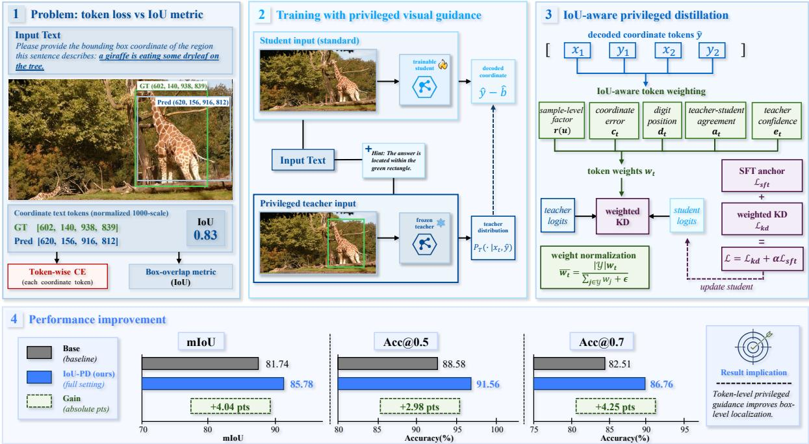  
Figure 1: Overview of IOU-PD. Ground-truth boxes are used not only as coordinate targets, but also to construct privileged teacher inputs during training. The student receives the original image and original referring-expression prompt, while the teacher receives a box-marked image and an augmented prompt that indicates the marked region. The training objective combines an SFT anchor with IoU-aware privileged distillation, while keeping the inference-time input format unchanged.

## 2.3 Knowledge Distillation and Privileged Information

Knowledge distillation transfers information from a teacher distribution to a student distribution (Hinton et al., 2015). Learning using privileged information studies a related setting in which extra information is available during training but not during inference (Vapnik and Vashist, 2009; Ye et al., 2026). Recent on-policy self-distillation applies this idea to autoregressive models by letting the teacher and student condition on different contexts while scoring the student’s own trajectories (Zhao et al., 2026). In our setting, the privileged information is multimodal: the teacher receives a box-marked image and an augmented text prompt, while the deployed student receives only the original image and original referring-expression prompt.

## 2.4 Structured Supervision for Coordinate Outputs

Coordinate strings are structured outputs rather than ordinary text. The four values represent box boundaries, and different digit positions have different effects on the final overlap. Prior selfdistillation work for GUI grounding used visually enriched teacher guidance and token-level weighting for coordinate generation (Zhang et al., 2026b). IOU-PD follows the same broad direction but targets referring-expression visual grounding and weights the distillation loss with explicit IoU, coordinate-error, digit-position, polarity, and entropy factors.

## 3 Method

## 3.1 Overview

The goal is to improve coordinate-generating multimodal large language models for visual grounding without changing the inference-time input format. Standard supervised fine-tuning uses the groundtruth box only as the target coordinate answer. IOU-PD uses the same box in an additional way: it is drawn on the image to construct a privileged visual input for a teacher model during training.

The student receives the original image and original referring-expression prompt. The teacher receives the box-marked image and an augmented text prompt, where the original prompt is followed by a privileged hint: “The answer is located within the green rectangle.” This privileged hint is used only during training and is never provided to the student or used at inference time. The teacher has the same architecture as the student and is initialized from the same base checkpoint, but it is kept frozen during training. Its output distribution is detached and used as a stop-gradient target. No EMA teacher is used. Training combines supervised finetuning on the ground-truth coordinate string with privileged teacher distillation on student-generated response tokens. The distillation loss is further weighted by geometry and reliability cues.

Algorithm 1 Training step of IOU-PD
Require: Minibatch  $\{(I_{i}, q_{i}, b_{i}^{*})\}_{i=1}^{B}$ , student  $p_{\theta}$ , frozen teacher  $p_{T}$ , SFT weight  $\alpha$ 
Ensure: Updated student  $p_{\theta}$ 
1: for i = 1 to B do
2:  $x_{s,i} \leftarrow (I_{i}, q_{i})$ 
3:  $x_{t,i} \leftarrow (\text{DrawBox}(I_{i}, b_{i}^{*}), q_{i} \oplus h)$ 
4:  $y_{i}^{*} \leftarrow \text{Format}(b_{i}^{*})$ 
5:  $\hat{y}_{i} \leftarrow \text{Decode}(p_{\theta}(\cdot \mid x_{s,i}))$ 
6: Treat  $\hat{y}_{i}$  as a fixed sequence for distillation
7: Score  $y_{i}^{*}$  under  $x_{s,i}$  for supervised fine-tuning
8: Score  $\hat{y}_{i}$  under  $x_{s,i}$  and  $x_{t,i}$  for distillation
9: Parse  $\hat{y}_{i}$  into  $\hat{b}_{i}$  and compute token weights  $\bar{w}_{i,t}$ 
10: Compute weighted privileged distillation loss  $\mathcal{L}_{kd}^{(i)}$ 
11: end for
12: Compute  $L_{sft}$  and aggregate  $L_{kd}$ 
13:  $L \leftarrow L_{kd} + \alpha L_{sft}$ 
14: Update  $p_{\theta}$  with L

## 3.2 Task Formulation and Privileged Teacher

Each training example is denoted as

$$
(I, q, b ^ {*}),
$$

where I is the image, $q$ is the referring expression, and

$$
b ^ {*} = (x _ {1} ^ {*}, y _ {1} ^ {*}, x _ {2} ^ {*}, y _ {2} ^ {*})
$$

is the ground-truth box. The target coordinate response is

$$
y ^ {*} = \operatorname{Format} (b ^ {*}).
$$

The student input is

$$
x _ {s} = (I, q),
$$

where $q$ is the original referring-expression prompt. During training, we construct a privileged teacher

input

$$
x _ {t} = (I ^ {b o x}, q ^ {+}),
$$

where $I ^ { b o x }$ is the original image with the groundtruth box marked in green, and

$$
q ^ {+} = q \oplus h.
$$

Here, h is a short teacher-side hint appended to the original prompt:

## Hint: The answer is located within the green rectangle.

The image content outside the box is preserved, so the teacher still sees the full scene context. The hint does not reveal the coordinate values, but it aligns the teacher’s attention with the marked region. Both $I ^ { b o x }$ and h are used only for the frozen teacher during training.

The teacher is frozen throughout training. Its distribution is computed under $x _ { t } ,$ , detached from the computation graph, and used only as a trainingtime target. Gradients are propagated only through the student model.

## 3.3 Training Objective

The SFT loss is computed on the ground-truth response:

$$
\mathcal {L} _ {s f t} = - \sum_ {t \in \mathcal {Y} ^ {*}} \log p _ {\theta} (y _ {t} ^ {*} \mid x _ {s}, y _ {<   t} ^ {*}),
$$

where ${ \mathcal { V } } ^ { * }$ denotes response positions in $y ^ { * }$ .

The distillation loss is computed on a response sequence decoded from the current student:

$$
\hat {y} \sim p _ {\theta} (\cdot | x _ {s}).
$$

The decoded sequence is treated as fixed, so gradients are not back-propagated through the discrete decoding step. Let $\mathcal { V }$ denote response positions in $\hat { y } .$ . The privileged distillation loss is

$$
\begin{array}{c} \mathcal {L} _ {k d} = \sum_ {t \in \mathcal {Y}} \bar {w} _ {t}   D _ {\mathrm{KL}} \Big (\operatorname{sg} [ p _ {T} (\cdot \mid x _ {t}, \hat {y} _ {<   t}) ] \\ \|   p _ {\theta} (\cdot \mid x _ {s}, \hat {y} _ {<   t}) \Big). \end{array}
$$

where $\mathrm { s g } [ \cdot ]$ denotes stop-gradient and $\bar { w } _ { t }$ is the normalized token weight. The total objective is

$$
\mathcal {L} = \mathcal {L} _ {k d} + \alpha \mathcal {L} _ {s f t}.
$$

## 3.4 IoU-Aware Token Weighting

The decoded response $\hat { y }$ is parsed into a predicted box

$$
\hat {b} = (\hat {x} _ {1}, \hat {y} _ {1}, \hat {x} _ {2}, \hat {y} _ {2})
$$

when possible. The localization quality is

$$
u = \mathrm{IoU} (\hat {b}, b ^ {*}).
$$

The parser also maps coordinate digit tokens to their coordinate identity

$$
m (t) \in \{1, 2, 3, 4 \}
$$

and digit position $\rho ( t )$ . The digit position is defined by decimal significance, with larger $\rho ( t )$ assigned to more significant digits. Non-coordinate tokens, including brackets, commas, spaces, separators, and punctuation, are assigned neutral geometry weights.

For coordinate $k ,$ the coordinate error is

$$
\delta_ {k} = | \hat {b} _ {k} - b _ {k} ^ {*} |.
$$

The unnormalized token weight is

$$
w _ {t} = r (u) \cdot c _ {t} \cdot d _ {t} \cdot a _ {t} \cdot e _ {t}.
$$

The sample-level factor is

$$
r (u) = \exp \left(\frac {1 - u}{\tau_ {r}}\right).
$$

For a token t belonging to coordinate $m ( t )$

$$
c _ {t} = \frac {\exp (\delta_ {m (t)} / \tau_ {c})}{\frac {1}{4} \sum_ {k = 1} ^ {4} \exp (\delta_ {k} / \tau_ {c})}, \qquad d _ {t} = 1 + \lambda_ {d} \rho (t).
$$

For non-coordinate tokens, $c _ { t } = d _ { t } = 1$

The agreement and confidence factors are

$$
\begin{array}{c} a _ {t} = \sigma \Big (\beta \big [ \log p _ {T} (\hat {y} _ {t} \mid x _ {t}, \hat {y} _ {<   t}) \\ - \log p _ {\theta} (\hat {y} _ {t} \mid x _ {s}, \hat {y} _ {<   t}) \big ] \Big). \end{array}
$$

and

$$
e _ {t} = \exp \left(- \frac {H (p _ {T} (\cdot | x _ {t} , \hat {y} _ {<   t}))}{\tau_ {e}}\right).
$$

The final weights are normalized as

$$
\bar {w} _ {t} = \frac {| \mathcal {Y} | w _ {t}}{\sum_ {j \in \mathcal {Y}} w _ {j} + \epsilon}.
$$

Figure 2 illustrates the effect of the proposed weighting strategy. Rather than treating all response tokens uniformly, IOU-PD emphasizes coordinate tokens associated with larger geometric errors, more significant digit positions, and more reliable teacher guidance.

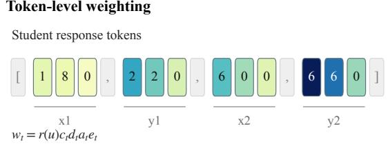

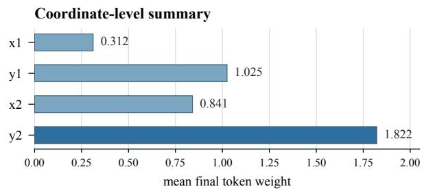  
Figure 2: Visualization of IoU-aware token weighting.tokens. IOU-PD assigns larger distillation weights to coordinate tokens that are more geometrically influential or supported by more reliable teacher guidance.

If parsing fails, the geometry-dependent factors fall back to neutral values:

$$
r (u) = 1, \qquad c _ {t} = 1, \qquad d _ {t} = 1.
$$

This keeps the distillation loss well defined for malformed responses.

## 3.5 Training and Inference

During training, the ground-truth box serves both as the coordinate target and as the source of the privileged teacher input. During inference, the teacher is removed and the student follows the standard input-output format:

$$
(I, q) \to \hat {y}.
$$

Thus, IOU-PD requires no ground-truth box, box overlay, EMA teacher, or additional prediction module at deployment time.

## 4 Experiments

## 4.1 Experimental Setup

Datasets Training uses RefCOCO-style grounding examples with an image, a referring expression, and a normalized ground-truth box. Evaluation is conducted on five held-out splits: Ref-COCO testA, RefCOCO testB, RefCOCOg test, RefCOCO+ testA, and RefCOCO+ testB.

(a) Components

Main Setting Unless otherwise specified, the main IOU-PD setting uses a Qwen3-VL-4B backbone, 300k training examples, and 3 training epochs. The student receives the original image and referring expression, while the frozen teacher receives the same expression and a box-marked image. The model is trained with supervised finetuning, privileged teacher distillation, and IoUaware token weighting. Reduced model and data settings are used only for ablation studies.

Evaluation Protocol All comparison models in Table 1 are evaluated under the same prompt, coordinate parser, coordinate normalization, box canonicalization, and metric computation script. This unified protocol avoids comparing results produced by different prompting or parsing rules. The main metrics are mIoU, Acc@0.5, and Acc@0.7.

## 4.2 Main Results

Table 1 compares IOU-PD with open-set detection models, open-source VLMs, and specialist VLMs under the same evaluation protocol. The comparison focuses on mIoU and Acc@0.5, which measure region-level localization quality. Under the main setting, IOU-PD achieves the best results on all reported datasets and metrics.

The comparison with general open-source VLMs shows that stronger base multimodal models can already provide competitive coordinategeneration grounding performance. However, IOU-PD further improves this behavior by using the ground-truth box as training-time privileged visual information. Compared with specialist VLMs, IOU-PD also remains competitive or stronger under the same evaluation protocol. These results indicate that ground-truth boxes can serve a broader training role than coordinate supervision alone by providing visual guidance to the teacher.

## 4.3 Ablation Studies

Component Ablations Table 2 summarizes the main component ablations, and Figure 3 provides the corresponding component matrix and Acc@.7 gains over the base model. SFT gives the largest single improvement, increasing mIoU from 0.8174 to 0.8470 and Acc@.7 from 82.51 to 85.32. This confirms that direct coordinate supervision is the main anchor for learning the output format and the grounding distribution.

The original-teacher variant separates selfdistillation from privileged visual guidance. In this setting, the teacher receives the same original image as the student. It improves Acc@.7 from 85.32 to 85.63 over SFT, but the gain is smaller than using a box-marked teacher. Replacing the original teacher with the privileged box teacher improves mIoU to 0.8543 and Acc@.7 to 86.28. This comparison shows that the improvement is not only due to distillation itself; the box-marked teacher input provides additional useful visual guidance.

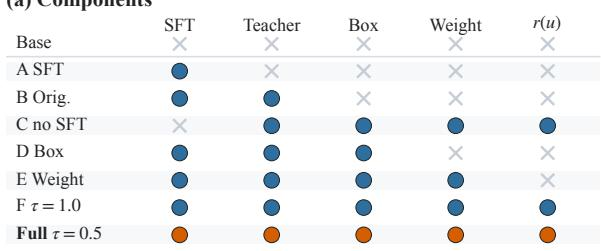

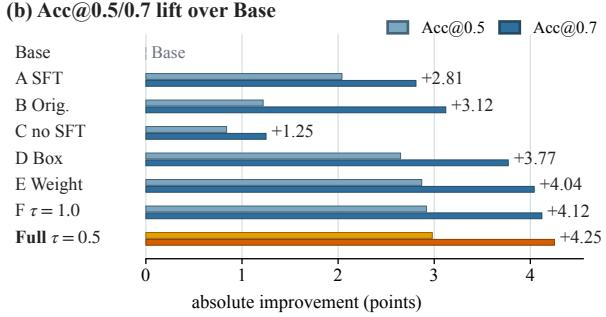  
Figure 3: Component ablations of IOU-PD. The upper panel shows the enabled training components, and the lower panel reports Acc@0.5 and Acc@0.7 gains over the base model under the main setting.

IoU-aware token weighting further improves the privileged teacher setting. Adding token weighting raises mIoU from 0.8543 to 0.8565 and Acc@.7 from 86.28 to 86.55. The full objective obtains the best result, with 0.8578 mIoU and 86.76 Acc@.7. The full matrix in Figure 3 also shows that removing the SFT anchor leads to a much smaller gain, while changing the sample-level IoU factor temperature remains close to the full model. Overall, the ablations support the main design: SFT provides the anchor, the privileged box teacher supplies training-time visual guidance, and IoU-aware weighting refines the token-level distillation signal.

Scaling Ablations Table 3 and Figure 4 summarize how IOU-PD behaves under different backbone sizes, data scales, and optimization budgets. The reduced settings show that the method remains effective with a smaller 2B backbone and with limited training data. Figure 4(a) shows that, under the 4B backbone and a fixed one-epoch budget, in-

<table><tr><td rowspan="2">Method</td><td colspan="2">RefCOCO</td><td colspan="2">RefCOCO+</td><td colspan="2">RefCOCOg</td></tr><tr><td>mIoU</td><td>Acc@0.5</td><td>mIoU</td><td>Acc@0.5</td><td>mIoU</td><td>Acc@0.5</td></tr><tr><td colspan="7">Open-set detection models</td></tr><tr><td>OWLv2</td><td>41.5</td><td>40.2</td><td>37.3</td><td>35.1</td><td>30.2</td><td>29.2</td></tr><tr><td>Grounding DINO</td><td>56.2</td><td>57.5</td><td>56.7</td><td>57.2</td><td>58.8</td><td>59.8</td></tr><tr><td colspan="7">Open-source VLMs</td></tr><tr><td>Qwen2.5-VL-3B</td><td>55.6</td><td>60.2</td><td>52.6</td><td>62.3</td><td>49.8</td><td>44.1</td></tr><tr><td>Qwen2.5-VL-7B</td><td>60.7</td><td>67.7</td><td>58.2</td><td>64.8</td><td>50.6</td><td>53.4</td></tr><tr><td>Qwen2.5-VL-72B</td><td>62.5</td><td>70.4</td><td>58.9</td><td>66.1</td><td>55.1</td><td>59.7</td></tr><tr><td>DeepSeek-VL2</td><td>51.1</td><td>56.2</td><td>44.6</td><td>46.6</td><td>38.8</td><td>34.2</td></tr><tr><td>GLM-4.1V-9B</td><td>83.5</td><td>91.6</td><td>80.2</td><td>87.6</td><td>80.1</td><td>83.6</td></tr><tr><td>GLM-4.6V-106B</td><td>82.0</td><td>88.5</td><td>75.6</td><td>80.9</td><td>80.2</td><td>86.2</td></tr><tr><td>Qwen3-VL-8B</td><td>86.6</td><td>89.5</td><td>80.3</td><td>86.8</td><td>82.6</td><td>89.5</td></tr><tr><td colspan="7">Specialist VLMs</td></tr><tr><td>VLM-R1</td><td>63.1</td><td>69.8</td><td>64.4</td><td>71.5</td><td>66.7</td><td>73.4</td></tr><tr><td>Rex-Omni</td><td>81.9</td><td>88.2</td><td>77.5</td><td>83.4</td><td>77.3</td><td>86.1</td></tr><tr><td>IoU-PD (Ours)</td><td>88.45</td><td>95.19</td><td>87.14</td><td>93.59</td><td>87.23</td><td>91.45</td></tr></table>

Table 1: Comparison with existing models on RefCOCO, RefCOCO+, and RefCOCOg. All baselines are re evaluated under the same prompt, parser, coordinate normalization, and metric computation protocol. All values are reported as percentages. The best result in each column is shown in bold.

(a) Data scale  
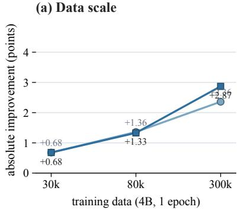

(b) Epoch budget  
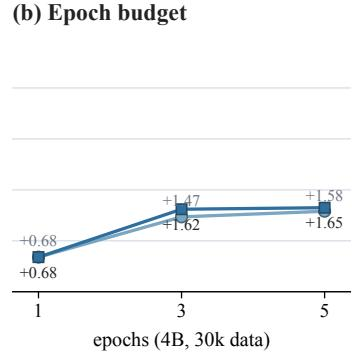

(c) Final setting  
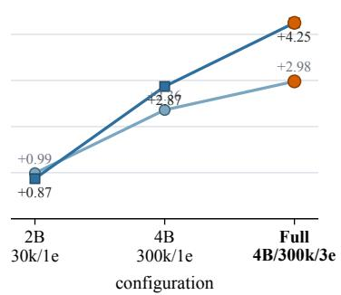  
Figure 4: Scaling ablations under different data sizes, epoch budgets, and final model settings. The curves show absolute Acc@0.5 and Acc@0.7 improvements over the corresponding same-size base model.

creasing the training data from 30k to 80k and then to 300k leads to progressively larger gains, with the 300k setting giving the largest improvement. Figure 4(b) shows that, under the 4B backbone and 30k training data, increasing the training budget from 1 to 3 epochs improves both Acc@0.5 and Acc@0.7, while the gain from 3 to 5 epochs is marginal. Figure 4(c) compares representative reduced settings with the final configuration and shows that the final configuration achieves the largest gain overall. These results indicate that privileged visual teacher guidance remains useful across scales and benefits from both larger grounding data and sufficient optimization budget.

## 4.4 Object-Size Analysis

Figure 5 compares the base model and the main IOU-PD under different ground-truth object sizes. IOU-PD improves both P@0.5 and P@0.7 in all three size groups. The gains are especially clear for small and medium objects, where coordinate errors occupy a larger fraction of the target region and stricter overlap thresholds are harder to satisfy. This suggests that privileged box guidance is not only improving easy large-object cases, but also helps the model localize more size-sensitive targets.

<table><tr><td>Added component</td><td>mIoU</td><td>A@0.5</td><td>A@0.7</td></tr><tr><td>Base</td><td>0.8174</td><td>88.58</td><td>82.51</td></tr><tr><td>SFT</td><td>0.8470</td><td>90.62</td><td>85.32</td></tr><tr><td>Original teacher</td><td>0.8492</td><td>89.80</td><td>85.63</td></tr><tr><td>Box teacher</td><td>0.8543</td><td>91.23</td><td>86.28</td></tr><tr><td>Token weighting</td><td>0.8565</td><td>91.45</td><td>86.55</td></tr><tr><td>Full IoU-PD</td><td>0.8578</td><td>91.56</td><td>86.76</td></tr></table>

Table 2: Component ablations under the main setting. The rows show the effect of progressively adding supervised fine-tuning, teacher distillation, privileged box input, and IoU-aware token weighting.

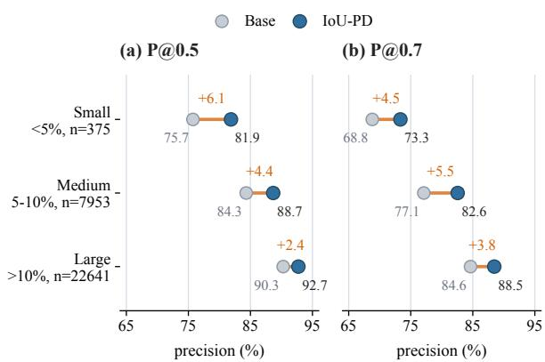  
Figure 5: IOU-PD improves grounding across object sizes. Examples are grouped by the ground-truth bounding-box area in the normalized coordinate space: small (< 5%), medium (5%−10%), and large (> 10%). Points report P@0.5 and P@0.7 for the base model and the IOU-PD model, with orange segments and labels indicating absolute gains.

## 4.5 Threshold-Sensitivity Analysis

Figure 6 further examines how the improvement changes across IoU thresholds. Compared with the 4B base model, IOU-PD improves P@0.5 by 2.98 points, P@0.7 by 4.25 points, P@0.9 by 7.75 points, and P@0.95 by 12.84 points. The IoU distribution shows the same trend: predictions below 0.5 IoU decrease from 11.4% to 8.4%, while predictions above 0.95 IoU increase from 35.7% to 48.5%. These results suggest that the privileged box-marked teacher and IoU-aware token weighting improve the overall overlap distribution, moving more predictions from low- and mediumoverlap regions into high-overlap regions.

<table><tr><td>Model</td><td>Data</td><td>Ep.</td><td>mIoU</td><td>A@.5</td><td>A@.7</td><td> $\Delta$ </td></tr><tr><td>Base 2B</td><td>-</td><td>-</td><td>0.793</td><td>85.64</td><td>79.76</td><td>-</td></tr><tr><td>2B</td><td>30k</td><td>1</td><td>0.799</td><td>86.64</td><td>80.63</td><td>+0.87</td></tr><tr><td>Base 4B</td><td>-</td><td>-</td><td>0.817</td><td>88.58</td><td>82.51</td><td>-</td></tr><tr><td>4B</td><td>30k</td><td>1</td><td>0.823</td><td>89.26</td><td>83.20</td><td>+0.68</td></tr><tr><td>4B</td><td>30k</td><td>3</td><td>0.830</td><td>90.05</td><td>84.13</td><td>+1.62</td></tr><tr><td>4B</td><td>30k</td><td>5</td><td>0.831</td><td>90.16</td><td>84.16</td><td>+1.65</td></tr><tr><td>4B</td><td>80k</td><td>1</td><td>0.828</td><td>89.94</td><td>83.84</td><td>+1.33</td></tr><tr><td>4B</td><td>300k</td><td>1</td><td>0.839</td><td>90.94</td><td>85.38</td><td>+2.87</td></tr><tr><td>IoU-PD</td><td>300k</td><td>3</td><td>0.857</td><td>91.56</td><td>86.76</td><td>+4.25</td></tr></table>

Table 3: Scaling ablations under different model sizes, data sizes, and training budgets. A@.5 and A@.7 denote Acc@0.5 and Acc@0.7, and ∆ denotes the Acc@0.7 improvement over the same-size base model.

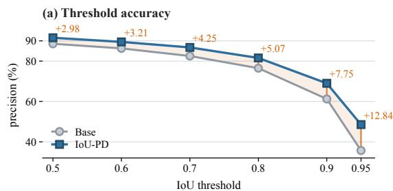

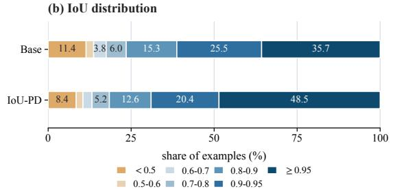  
Figure 6: Threshold-sensitivity analysis. IOU-PD improves precision under stricter IoU thresholds and shifts more predictions into the high-overlap region.

## 5 Conclusion

This paper presents IOU-PD, an IoU-aware privileged distillation method for coordinate-generating multimodal large language models. IOU-PD uses ground-truth boxes both as coordinate targets and as training-time privileged visual guidance from a frozen box-marked teacher. The student is trained with an SFT anchor and a geometry-aware distillation loss, while inference keeps the standard imagetext input without any teacher or additional module. Experiments show consistent improvements in region-level grounding, suggesting that groundtruth boxes can provide useful supervision beyond coordinate labels.

## Limitations

• The method uses ground-truth boxes as privileged information during training, so it requires grounding annotations.

• The gains are moderate and should be interpreted as improvements to a strong base model.

• The current teacher hint is a simple box overlay. More carefully designed privileged inputs may further improve the tradeoff between region recognition and coordinate precision.

## Ethical Considerations

This work studies visual grounding on standard referring-expression benchmarks. Accurate grounding can support assistive perception, humancomputer interaction, and fine-grained visual understanding. However, localization methods may also be misused in surveillance, tracking, or privacysensitive monitoring scenarios. We do not intend the method to be used for identifying, tracking, or profiling individuals without consent. Any deployment should follow applicable privacy regulations, obtain appropriate consent, and include safeguards against harmful or unauthorized use.

## References

Jinze Bai, Shuai Bai, Shusheng Yang, Shijie Wang, Sinan Tan, Peng Wang, Junyang Lin, Chang Zhou, and Jingren Zhou. 2023. Qwen-vl: A versatile vision-language model for understanding, localiza tion, text reading, and beyond. arXiv preprint arXiv:2308.12966.

Shuai Bai, Yuxuan Cai, Ruizhe Chen, Keqin Chen, Xionghui Chen, Zesen Cheng, Lianghao Deng, Wei Ding, Chang Gao, Chunjiang Ge, Wenbin Ge, Zhifang Guo, Qidong Huang, Jie Huang, Fei Huang, Binyuan Hui, Shutong Jiang, Zhaohai Li, Mingsheng Li, and 45 others. 2025a. Qwen3-vl technical report. Preprint, arXiv:2511.21631.

Shuai Bai, Keqin Chen, Xuejing Liu, Jialin Wang, Wen bin Ge, Sibo Song, Kai Dang, Peng Wang, Shijie Wang, Jun Tang, Humen Zhong, Yuanzhi Zhu, Mingkun Yang, Zhaohai Li, Jianqiang Wan, Pengfei Wang, Wei Ding, Zheren Fu, Yiheng Xu, and 8 others. 2025b. Qwen2.5-vl technical report. arXiv preprint arXiv:2502.13923.

Nicolas Carion, Francisco Massa, Gabriel Synnaeve, Nicolas Usunier, Alexander Kirillov, and Sergey Zagoruyko. 2020. End-to-end object detection with transformers. In European conference on computer vision, pages 213–229. Springer.

Keqin Chen, Zhao Zhang, Weili Zeng, Richong Zhang, Feng Zhu, and Rui Zhao. 2023. Shikra: Unleashing multimodal llm’s referential dialogue magic. arXiv preprint arXiv:2306.15195.

Zhe Chen, Weiyun Wang, Yue Cao, Yangzhou Liu, Zhangwei Gao, Erfei Cui, Jinguo Zhu, Shenglong Ye, Hao Tian, Zhaoyang Liu, and 1 others. 2024a. Expanding performance boundaries of open-source multimodal models with model, data, and test-time scaling. arXiv preprint arXiv:2412.05271.

Zhe Chen, Weiyun Wang, Hao Tian, Shenglong Ye, Zhangwei Gao, Erfei Cui, Wenwen Tong, Kongzhi Hu, Jiapeng Luo, Zheng Ma, and 1 others. 2024b. How far are we to gpt-4v? closing the gap to commercial multimodal models with open-source suites. arXiv preprint arXiv:2404.16821.

Zhe Chen, Jiannan Wu, Wenhai Wang, Weijie Su, Guo Chen, Sen Xing, Muyan Zhong, Qinglong Zhang, Xizhou Zhu, Lewei Lu, and 1 others. 2024c. Internvl: Scaling up vision foundation models and aligning for generic visual-linguistic tasks. In Proceedings of the IEEE/CVF Conference on Computer Vision and Pattern Recognition, pages 24185–24198.

Tianheng Cheng, Lin Song, Yixiao Ge, Wenyu Liu, Xinggang Wang, and Ying Shan. 2024. Yolo-world: Real-time open-vocabulary object detection. In Proceedings of the IEEE/CVF conference on computer vision and pattern recognition, pages 16901–16911.

Gheorghe Comanici, Eric Bieber, Mike Schaekermann, Ice Pasupat, Noveen Sachdeva, Inderjit Dhillon, Marcel Blistein, Ori Ram, Dan Zhang, Evan Rosen, and 1 others. 2025. Gemini 2.5: Pushing the frontier with advanced reasoning, multimodality, long context, and next generation agentic capabilities. arXiv preprint arXiv:2507.06261.

Dong Guo, Faming Wu, Feida Zhu, Fuxing Leng, Guang Shi, Haobin Chen, Haoqi Fan, Jian Wang, Jianyu Jiang, Jiawei Wang, and 1 others. 2025. Seed1. 5-vl technical report. arXiv preprint arXiv:2505.07062.

Geoffrey Hinton, Oriol Vinyals, and Jeff Dean. 2015. Distilling the knowledge in a neural network. arXiv preprint arXiv:1503.02531.

Wenyi Hong, Xiaotao Gu, Ziyang Pan, Zhen Yang, Yuting Wang, Yue Wang, Yuanchang Yue, Yu Wang, Yanling Wang, Yan Wang, and 1 others. 2026. Glm-5v-turbo: Toward a native foundation model for multimodal agents. arXiv preprint arXiv:2604.26752.

Wenyi Hong, Wenmeng Yu, Xiaotao Gu, Guo Wang, Guobing Gan, Haomiao Tang, Jiale Cheng, Ji Qi, Junhui Ji, Lihang Pan, and 1 others. 2025. Glm-4.1 v-thinking: Towards versatile multimodal reasoning with scalable reinforcement learning. arXiv preprint arXiv:2507.01006.

Qing Jiang, Junan Huo, Xingyu Chen, Yuda Xiong, Zhaoyang Zeng, Yihao Chen, Tianhe Ren, Junzhi Yu,

and Lei Zhang. 2025. Detect anything via next point prediction. Preprint, arXiv:2510.12798.

Siwen Jiao, Tianxiong Lv, Kangan Qian, Chenxu Zhao, Xiuyuan Zhu, Tianlun Li, Xiaolong Cheng, Jinyu Li, Zhihao Liao, and Yang Cai. 2026. Smooth operator: Smooth verifiable reward activates spatial reasoning ability of vision-language model. Preprint, arXiv:2601.07695.

Sahar Kazemzadeh, Vicente Ordonez, Mark Matten, and Tamara Berg. 2014. Referitgame: Referring to objects in photographs of natural scenes. In Proceedings of the 2014 conference on empirical methods in natural language processing (EMNLP), pages 787– 798.

Haotian Liu, Chunyuan Li, Yuheng Li, and Yong Jae Lee. 2023a. Improved baselines with visual instruction tuning.

Haotian Liu, Chunyuan Li, Yuheng Li, Bo Li, Yuanhan Zhang, Sheng Shen, and Yong Jae Lee. 2024a. Llavanext: Improved reasoning, ocr, and world knowledge.

Haotian Liu, Chunyuan Li, Qingyang Wu, and Yong Jae Lee. 2023b. Visual instruction tuning.

Shilong Liu, Zhaoyang Zeng, Tianhe Ren, Feng Li, Hao Zhang, Jie Yang, Qing Jiang, Chunyuan Li, Jianwei Yang, Hang Su, and 1 others. 2024b. Grounding dino: Marrying dino with grounded pre-training for open-set object detection. In European conference on computer vision, pages 38–55. Springer.

Ziyu Liu, Zeyi Sun, Yuhang Zang, Xiaoyi Dong, Yuhang Cao, Haodong Duan, Dahua Lin, and Jiaqi Wang. 2025. Visual-rft: Visual reinforcement fine-tuning. arXiv preprint arXiv:2503.01785.

Junhua Mao, Jonathan Huang, Alexander Toshev, Oana Camburu, Alan L. Yuille, and Kevin Murphy. 2016. Generation and comprehension of unambiguous object descriptions. In Proceedings of the IEEE Conference on Computer Vision and Pattern Recognition (CVPR).

Matthias Minderer, Alexey Gritsenko, and Neil Houlsby. 2023. Scaling open-vocabulary object detection. Advances in Neural Information Processing Systems, 36:72983–73007.

OpenAI. 2025. Gpt-5 technical overview. https:// openai.com/index/introducing-gpt-5/.

Zhiliang Peng, Wenhui Wang, Li Dong, Yaru Hao, Shaohan Huang, Shuming Ma, and Furu Wei. 2023. Kosmos-2: Grounding multimodal large language models to the world. arXiv preprint arXiv:2306.14824.

Benjamin Schneider, Florian Kerschbaum, and Wenhu Chen. 2025. ABC: Achieving better control of visual embeddings using VLLMs. Transactions on Machine Learning Research.

Bytedance Seed. 2026a. Seed1. 8 model card: Towards generalized real-world agency. arXiv preprint arXiv:2603.20633.

Bytedance Seed. 2026b. Seed2. 0 model card: Towards intelligence frontier for real-world complexity. arXiv preprint arXiv:2607.00248.

Haozhan Shen, Peng Liu, Jingcheng Li, Chunxin Fang, Yibo Ma, Jiajia Liao, Qiaoli Shen, Zilun Zhang, Kangjia Zhao, Qianqian Zhang, and 1 others. 2025. Vlm-r1: A stable and generalizable r1- style large vision-language model. arXiv preprint arXiv:2504.07615.

Vladimir Vapnik and Akshay Vashist. 2009. A new learning paradigm: Learning using privileged information. Neural networks, 22(5-6):544–557.

Weiyun Wang, Zhe Chen, Wenhai Wang, Yue Cao, Yangzhou Liu, Zhangwei Gao, Jinguo Zhu, Xizhou Zhu, Lewei Lu, Yu Qiao, and Jifeng Dai. 2024. Enhancing the reasoning ability of multimodal large language models via mixed preference optimization. arXiv preprint arXiv:2411.10442.

Zhiyu Wu, Xiaokang Chen, Zizheng Pan, Xingchao Liu, Wen Liu, Damai Dai, Huazuo Gao, Yiyang Ma, Chengyue Wu, Bingxuan Wang, and 1 others. 2024. Deepseek-vl2: Mixture-of-experts visionlanguage models for advanced multimodal understanding. arXiv preprint arXiv:2412.10302.

Tianzhu Ye, Li Dong, Xun Wu, Shaohan Huang, and Furu Wei. 2026. On-policy context distillation for language models. Preprint, arXiv:2602.12275.

Licheng Yu, Patrick Poirson, Shan Yang, Alexander C Berg, and Tamara L Berg. 2016. Modeling context in referring expressions. In European conference on computer vision, pages 69–85. Springer.

Aohan Zeng, Xin Lv, Qinkai Zheng, Zhenyu Hou, Bin Chen, Chengxing Xie, Cunxiang Wang, Da Yin, Hao Zeng, Jiajie Zhang, and 1 others. 2025. Glm-4.5: Agentic, reasoning, and coding (arc) foundation models. arXiv preprint arXiv:2508.06471.

Jiafan Zhang, Keyan Chen, Chenyang Liu, Baihong Lin, Zhengxia Zou, and Zhenwei Shi. 2026a. Deepgrounder: Generalized reasoning for mllm-based remote sensing visual grounding. IEEE Transactions on Geoscience and Remote Sensing.

Yan Zhang, Daiqing Wu, Huawen Shen, Can Ma, and Yu Zhou. 2026b. Learn where to click from yourself: On-policy self-distillation for gui grounding. arXiv preprint arXiv:2605.00642.

Siyan Zhao, Zhihui Xie, Mengchen Liu, Jing Huang, Guan Pang, Feiyu Chen, and Aditya Grover. 2026. Self-distilled reasoner: On-policy selfdistillation for large language models. arXiv preprint arXiv:2601.18734.

Yuze Zhao, Jintao Huang, Jinghan Hu, Xingjun Wang, Yunlin Mao, Daoze Zhang, Zeyinzi Jiang, Zhikai Wu, Baole Ai, Ang Wang, Wenmeng Zhou, and Yingda Chen. 2024. Swift:a scalable lightweight infrastructure for fine-tuning. Preprint, arXiv:2408.05517.

## A Implementation Details

## A.1 Training Configuration

The main IOU-PD setting uses Qwen3-VL-4B (Bai et al., 2025a) as the backbone, 300k grounding examples, and 3 training epochs. Training is implemented with ms-swift (Zhao et al., 2024). The –model and –teacher\_model arguments are initialized from the same base checkpoint. The student receives the original image and the original referring-expression prompt. The teacher receives the box-marked image and the privileged text hint.

We use full-parameter tuning, bfloat16 precision, learning rate $2 \times 1 0 ^ { - 6 }$ , SFT coefficient $\alpha = 1 . 0$ , distillation temperature 1.0, maximum sequence length 20,000, maximum completion length 128, warmup ratio 0.05, and FlashAttention. The Qwen3-VL-2B backbone and reduced-data settings are used only for scaling ablations.

## A.2 Frozen Privileged Teacher

The teacher has the same architecture as the student and is initialized from the same base checkpoint. During training, the teacher parameters are kept frozen. The teacher distribution is computed under the privileged input, detached from the computation graph, and used as a stop-gradient target in the distillation loss. Gradients are propagated only through the student distribution. No exponential moving average teacher is used. The teacher is used only during training and is removed at inference time.

This implementation separates the source of privileged information from the trainable student. The only difference between the student and teacher inputs is that the teacher receives a box-marked image and a short privileged hint, while the student receives the original image and the original prompt. At inference time, only the student-side input format is used.

## A.3 IOU-PD Hyperparameters

The main IOU-PD run enables IoU-aware token weighting and uses normalized 1000-scale coordinates. The sample-level factor uses the exponential IoU form with $\tau _ { r } = 0 . 5$ . The coordinate-level factor uses softmax weighting with $\tau _ { c } = 1 . 0$ . The digit-position factor uses $\lambda _ { d } = 0 . 5$ . The teacherstudent agreement factor uses a sigmoid gate with $\beta = 3 . 0$ . The teacher-confidence factor uses the entropy-based exponential form with $\tau _ { e } = 1 . 0$ . Token weights are normalized over response positions to keep the scale of the distillation loss stable.

## A.4 Prompt and Output Format

The same prompt format is used across training variants and evaluation. Given a referring expression <expr>, the student input text is formatted as:

Please provide the bounding box coordinate of the region this sentence describes: <expr>.

The placeholder <expr> is replaced by the referring expression from the dataset. The target response is a four-coordinate box in the normalized coordinate system used by the dataset solution field.

For the teacher branch during training, the privileged hint is appended to the original prompt:

The answer is located within the green rectangle.

The student and all inference-time evaluations use only the original prompt.

## B Evaluation Protocol and Parsing Rules

## B.1 Unified Evaluation Protocol

All comparison models are evaluated under the same prompt, coordinate parser, normalization rule, box canonicalization rule, and metric computation script. For models that directly output boxes, their predictions are converted into the same normalized coordinate space before metric computation. This avoids comparing results produced by different prompting, parsing, or coordinate-normalization rules.

We report mean IoU, Acc@0.5, and Acc@0.7 in the main evaluation. The paper focuses on regionlevel grounding rather than using high-precision boundary metrics as the central success criterion.

## B.2 Coordinate Parsing

All predicted boxes are parsed into the normalized coordinate space before evaluation. The parser first extracts four coordinate fields from the model response. The reconstructed coordinates are canonicalized into valid box corners, clipped to the normalized coordinate range, and compared with the ground-truth box using IoU.

<table><tr><td>Size</td><td>n</td><td>Base P@0.5</td><td>IoU-PD P@0.5</td><td> $\Delta_{.5}$ </td><td>Base P@0.7</td><td>IoU-PD P@0.7</td><td> $\Delta_{.7}$ </td></tr><tr><td>Small (&lt; 5%)</td><td>375</td><td>75.73</td><td>81.87</td><td>+6.13</td><td>68.80</td><td>73.33</td><td>+4.53</td></tr><tr><td>Medium (5% – 10%)</td><td>7,953</td><td>84.32</td><td>88.67</td><td>+4.35</td><td>77.10</td><td>82.56</td><td>+5.46</td></tr><tr><td>Large (&gt; 10%)</td><td>22,641</td><td>90.28</td><td>92.73</td><td>+2.45</td><td>84.64</td><td>88.46</td><td>+3.82</td></tr></table>

Table 4: Source values for the object-size performance figure. Base P@0.5 and IOU-PD P@0.5 denote P@0.5 for the base model and IOU-PD, respectively; Base P@0.7 and IOU-PD P@0.7 denote P@0.7. ∆ values are absolute improvements in percentage points.

For malformed or incomplete responses, the parser applies the same fallback rule for all models. If four valid coordinates cannot be recovered, the prediction is treated as invalid for metric computation under the same evaluation script.

## B.3 Token-to-Coordinate Mapping

The IoU-aware token weighting requires mapping response tokens to the geometric structure of the coordinate output. For a valid parsed response, each coordinate digit token is assigned a coordinate identity

$$
m (t) \in \{1, 2, 3, 4 \},
$$

corresponding to x1, y1, x2, and $y _ { 2 }$ . Each coordinate digit token is also assigned a digit position $\rho ( t )$ , defined by decimal significance. More significant digits receive larger $\rho ( t )$ . For example, in a normalized integer coordinate, the hundreds digit has a larger $\rho ( t )$ than the tens digit, and the tens digit has a larger $\rho ( t )$ than the ones digit.

Tokens that do not represent coordinate digits, including brackets, commas, spaces, separators, and punctuation tokens, are treated as noncoordinate tokens. They are assigned neutral geometry weights for the coordinate-level and digitposition factors. If the response is malformed, incomplete, or cannot be converted into four valid coordinates, the geometry-dependent factors fall back to neutral values. This keeps the distillation loss well defined for invalid responses.

## C Additional Analysis of Privileged Hints

Figure 7 explains why IOU-PD uses a boundingbox overlay as the privileged visual hint. The hint should identify the target region while preserving the visual context needed by the referring expression. For example, the query “the glass in the upper left” depends on surrounding objects and relative spatial layout. Gaussian blur, reverse-shadow masking, or grayscale background may make the target easier to isolate, but they also change the semantic and spatial structure of the image. The teacher may then rely on evidence that is not available to the student at inference time, increasing the conditional mismatch between teacher and student. A box overlay is therefore a conservative privileged hint: it provides explicit localization guidance while keeping the teacher input close to the original image.

Query: "the glass in the upper left'  

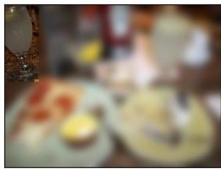

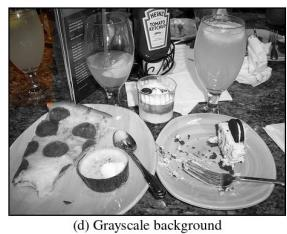  
Figure 7: Comparison of different privileged visual hints. The query is “the glass in the upper left.” A bounding-box hint marks the target while preserving the original scene context. Other hints, such as Gaussian blur, reverse-shadow masking, or grayscale background, change the visual distribution and may remove semantic or spatial cues needed for grounding.

## D Detailed Main Results

Table 6 reports the detailed split-level comparison between the Qwen3-VL-4B base model and the main IOU-PD setting. The overall results are computed by pooling all examples from the five evaluation splits rather than averaging split-level scores. All values are reported as percentages.

The main IOU-PD setting consistently improves over the Qwen3-VL-4B base model across all five evaluation splits. The overall gains are +4.03 mIoU, +2.98 Acc@0.5, and +4.25 Acc@0.7. The improvements are especially clear on RefCOCOg test and RefCOCO+ testB, suggesting that privileged teacher guidance is beneficial for more descriptive expressions and object- or attribute-focused grounding cases.

<table><tr><td>Model</td><td>&lt; 0.5</td><td>0.5–0.6</td><td>0.6–0.7</td><td>0.7–0.8</td><td>0.8–0.9</td><td>0.9–0.95</td><td>≥ 0.95</td></tr><tr><td>Base</td><td>11.42</td><td>2.28</td><td>3.78</td><td>6.03</td><td>15.25</td><td>25.54</td><td>35.70</td></tr><tr><td>IoU-PD</td><td>8.44</td><td>2.05</td><td>2.74</td><td>5.21</td><td>12.57</td><td>20.45</td><td>48.54</td></tr></table>

Table 5: Predicted-IoU distribution used in Figure 6. Bins are defined by the same IoU thresholds used in Table 9.

<table><tr><td rowspan="2">Split</td><td colspan="3">mIoU</td><td colspan="3">Acc@0.5</td><td colspan="3">Acc@0.7</td></tr><tr><td>Base</td><td>IoU-PD</td><td>Δ</td><td>Base</td><td>IoU-PD</td><td>Δ</td><td>Base</td><td>IoU-PD</td><td>Δ</td></tr><tr><td>Overall</td><td>81.74</td><td>85.78</td><td>+4.03</td><td>88.58</td><td>91.56</td><td>+2.98</td><td>82.51</td><td>86.76</td><td>+4.25</td></tr><tr><td>RefCOCO testA</td><td>85.90</td><td>88.45</td><td>+2.55</td><td>93.25</td><td>95.19</td><td>+1.94</td><td>88.56</td><td>91.44</td><td>+2.88</td></tr><tr><td>RefCOCO testB</td><td>81.45</td><td>84.20</td><td>+2.75</td><td>88.85</td><td>90.95</td><td>+2.10</td><td>81.33</td><td>84.14</td><td>+2.81</td></tr><tr><td>RefCOCOg test</td><td>81.85</td><td>87.23</td><td>+5.38</td><td>88.31</td><td>91.45</td><td>+3.13</td><td>82.18</td><td>87.34</td><td>+5.16</td></tr><tr><td>RefCOCO+ testA</td><td>83.79</td><td>87.14</td><td>+3.34</td><td>90.85</td><td>93.59</td><td>+2.74</td><td>85.98</td><td>89.91</td><td>+3.93</td></tr><tr><td>RefCOCO+ testB</td><td>74.64</td><td>79.88</td><td>+5.24</td><td>80.73</td><td>85.80</td><td>+5.07</td><td>73.33</td><td>79.28</td><td>+5.95</td></tr></table>

Table 6: Detailed comparison between the Qwen3-VL-4B base model and the main IOU-PD setting. Overall results are computed on the pooled five-split evaluation set. ∆ denotes the absolute improvement over the base model in percentage points.

## E Ablation Configurations

The ablations in Table 2 use the same main 4B, 300k, 3-epoch setting unless otherwise specified. The variants differ only in training switches.

Variant A uses SFT only. It disables the teacher branch and disables IoU-aware token weighting. Variant B is the non-privileged self-distillation baseline. It keeps the teacher branch but feeds the original image to both teacher and student, so the teacher does not receive a box-marked image. Variant C removes the SFT anchor by setting α = 0, while keeping the privileged teacher and IoU-aware weighting. Variant D keeps SFT and the privileged teacher but disables IoU-aware token weighting. Variant E keeps IoU-aware token weighting but disables the sample-level IoU factor r(u). Variant F keeps all components but uses a weaker samplelevel temperature $\tau _ { r } = 1 . 0 $ . The full model uses SFT, the frozen privileged teacher, IoU-aware token weighting, the sample-level IoU factor, and τr = 0.5.

These configurations are designed to separate the effects of direct coordinate supervision, nonprivileged self-distillation, privileged box-marked teacher input, IoU-aware token weighting, and sample-level IoU weighting.

## F Additional Quantitative Analyses

This section provides the numerical values behind the analysis figures in the main paper and gives additional interpretation of these results. The goal is not only to document the plotted values, but also to clarify what each analysis measures and how it supports the design choices of IOU-PD.

## F.1 Component Ablation Analysis

Table 7 reports the full component ablation results used to generate Figure 3. All rows use the main 4B, 300k, 3-epoch setting unless otherwise specified. The variants are designed to isolate five factors: supervised fine-tuning, teacher distillation, privileged box-marked teacher input, IoU-aware token weighting, and the sample-level IoU factor r(u).

The ablation results show that SFT is the strongest single component. Variant A improves Acc@0.7 from 82.51 to 85.32, giving a +2.81 point gain over the base model. This indicates that direct coordinate supervision is important for adapting the model to the output format and grounding distribution.

The comparison between variants B and D isolates the effect of privileged visual input. Variant B uses a teacher branch without a box-marked image, while variant D adds the box-marked teacher input. Moving from B to D improves mIoU from 0.8492 to 0.8543 and Acc@0.7 from 85.63 to 86.28. This suggests that the gain is not merely from adding a teacher branch; the teacher-side box mark provides additional training-time visual guidance.

<table><tr><td>Variant</td><td>Setting</td><td>SFT</td><td>Teacher</td><td>Box</td><td>Weight</td><td> $r(u)$ </td><td> $\tau_r$ </td><td>mIoU</td><td>Acc@0.5</td><td> $\Delta_{.5}$ </td><td>Acc@0.7</td><td> $\Delta_{.7}$ </td></tr><tr><td>Base</td><td>Base model</td><td>×</td><td>×</td><td>×</td><td>×</td><td>×</td><td>-</td><td>0.8174</td><td>88.58</td><td>-</td><td>82.51</td><td>-</td></tr><tr><td>A</td><td>SFT only</td><td>√</td><td>×</td><td>×</td><td>×</td><td>×</td><td>-</td><td>0.8470</td><td>90.62</td><td>+2.04</td><td>85.32</td><td>+2.81</td></tr><tr><td>B</td><td>Original teacher</td><td>√</td><td>√</td><td>×</td><td>×</td><td>×</td><td>-</td><td>0.8492</td><td>89.80</td><td>+1.22</td><td>85.63</td><td>+3.12</td></tr><tr><td>C</td><td>No SFT anchor</td><td>×</td><td>√</td><td>√</td><td>√</td><td>√</td><td>0.5</td><td>0.8335</td><td>89.42</td><td>+0.84</td><td>83.76</td><td>+1.25</td></tr><tr><td>D</td><td>Box teacher</td><td>√</td><td>√</td><td>√</td><td>×</td><td>×</td><td>-</td><td>0.8543</td><td>91.23</td><td>+2.65</td><td>86.28</td><td>+3.77</td></tr><tr><td>E</td><td>Token weighting</td><td>√</td><td>√</td><td>√</td><td>√</td><td>×</td><td>-</td><td>0.8565</td><td>91.45</td><td>+2.87</td><td>86.55</td><td>+4.04</td></tr><tr><td>F</td><td>Sample-level factor</td><td>√</td><td>√</td><td>√</td><td>√</td><td>√</td><td>1.0</td><td>0.8570</td><td>91.50</td><td>+2.92</td><td>86.63</td><td>+4.12</td></tr><tr><td>Full</td><td>Full IoU-PD</td><td>√</td><td>√</td><td>√</td><td>√</td><td>√</td><td>0.5</td><td>0.8578</td><td>91.56</td><td>+2.98</td><td>86.76</td><td>+4.25</td></tr></table>

Table 7: Full component ablation results. SFT denotes supervised fine-tuning, Teacher denotes distillation from a teacher branch, Box denotes privileged box-marked teacher input, Weight denotes IoU-aware token weighting, and $r ( u )$ denotes the sample-level IoU factor. $\Delta _ { . 5 }$ and $\Delta . 7$ are absolute Acc@0.5 and Acc@0.7 improvements over the 4B base model.

Variant C removes the SFT anchor while keeping the privileged teacher and IoU-aware weighting. It still improves over the base model, but it is clearly weaker than SFT-only training and the full model. This supports the choice of using privileged distillation as a complement to direct coordinate supervision rather than as a replacement for it.

The remaining rows show the effect of the weighting design. Adding token weighting improves variant D from 86.28 to 86.55 Acc@0.7. Adding the sample-level IoU factor further improves performance, and the full setting with $\tau _ { r } =$ 0.5 gives the best result. The gains from the last weighting components are smaller than the gain from SFT or privileged box input, but they are consistent across mIoU, Acc@0.5, and Acc@0.7.

## F.2 Scaling Ablation Analysis

Table 8 reports the metrics used in Figure 4. Deltas are computed against the corresponding same-size base model. These results analyze whether the improvement depends on a particular training scale or remains visible under reduced settings.

The reduced 2B setting improves over the 2B base model by +0.87 Acc@0.7, showing that the training strategy is still beneficial with a smaller backbone. For the 4B backbone, increasing the data size under a fixed one-epoch budget gives larger gains: +0.68 Acc@0.7 with 30k examples, +1.33 with 80k examples, and +2.87 with 300k examples. This indicates that the method benefits from more grounding data.

The epoch-budget comparison shows a different trend. With 30k examples, increasing training from 1 to 3 epochs improves Acc@0.7 from 83.20 to

84.13, but increasing further to 5 epochs gives only a marginal improvement to 84.16. This suggests that, under limited data, additional epochs quickly saturate. The strongest setting is therefore obtained by combining larger data scale with sufficient optimization budget: the full 4B, 300k, 3-epoch setting reaches 86.76 Acc@0.7, corresponding to a +4.25 point gain over the 4B base model.

## F.3 Object-Size Analysis

Table 4 reports the object-size breakdown used in Figure 5. Objects are grouped by the ground-truth box area in the normalized coordinate space. This analysis examines whether the method only improves easy large-object cases or also helps smaller targets.

The method improves all object-size groups. The gains are not limited to large objects: small objects improve by +6.13 points at P@0.5 and +4.53 points at P@0.7, while medium objects improve by +4.35 and +5.46 points. Large objects also improve, although the gain is smaller at P@0.5 because the base model is already stronger on this group. The small-object group contains fewer examples than the medium and large groups, so the exact magnitude should be interpreted with this sample size in mind. Still, the consistent gains across all three groups suggest that the method improves grounding beyond only the easiest large-object cases.

## F.4 IoU Threshold Accuracy Analysis

Table 9 reports thresholded grounding accuracy from P@0.5 to P@0.95. The evaluation aggregates the five held-out splits, with n = 30,969 examples per model. This analysis measures how the improvement changes as the IoU threshold becomes stricter.

The gain becomes larger under stricter thresholds. The improvement is +2.98 points at P@0.5, +4.25 points at P@0.7, +7.75 points at P@0.9, and +12.84 points at P@0.95. This does not change the main focus of the paper, which is region-level grounding, but it shows that the improvement is also reflected in the higher-overlap part of the IoU spectrum. In other words, the method does not merely convert very poor predictions into loosely correct ones; it also shifts many already-correct predictions toward higher overlap.

<table><tr><td>Setting</td><td>Data</td><td>Epochs</td><td>mIoU</td><td>Acc@0.5</td><td> $\Delta_{.5}$ </td><td>Acc@0.7</td><td> $\Delta_{.7}$ </td></tr><tr><td>Base 2B</td><td>-</td><td>-</td><td>0.7931</td><td>85.64</td><td>-</td><td>79.76</td><td>-</td></tr><tr><td>2B</td><td>30k</td><td>1</td><td>0.7993</td><td>86.64</td><td>+0.99</td><td>80.63</td><td>+0.87</td></tr><tr><td>Base 4B</td><td>-</td><td>-</td><td>0.8174</td><td>88.58</td><td>-</td><td>82.51</td><td>-</td></tr><tr><td>4B</td><td>30k</td><td>1</td><td>0.8234</td><td>89.26</td><td>+0.68</td><td>83.20</td><td>+0.68</td></tr><tr><td>4B</td><td>30k</td><td>3</td><td>0.8304</td><td>90.05</td><td>+1.47</td><td>84.13</td><td>+1.62</td></tr><tr><td>4B</td><td>30k</td><td>5</td><td>0.8310</td><td>90.16</td><td>+1.58</td><td>84.16</td><td>+1.65</td></tr><tr><td>4B</td><td>80k</td><td>1</td><td>0.8288</td><td>89.94</td><td>+1.36</td><td>83.84</td><td>+1.33</td></tr><tr><td>4B</td><td>300k</td><td>1</td><td>0.8393</td><td>90.94</td><td>+2.36</td><td>85.38</td><td>+2.87</td></tr><tr><td>Full IoU-PD 4B</td><td>300k</td><td>3</td><td>0.8578</td><td>91.56</td><td>+2.98</td><td>86.76</td><td>+4.25</td></tr></table>

Table 8: Scaling ablation results. The table reports the metrics behind the data-scale, epoch-budget, and finalconfiguration panels in Figure 4. $\Delta _ { . 5 }$ and $\Delta . 7$ denote absolute Acc@0.5 and Acc@0.7 improvements over the same-size base model.

<table><tr><td>Model</td><td>P@0.5</td><td>P@0.6</td><td>P@0.7</td><td>P@0.8</td><td>P@0.9</td><td>P@0.95</td></tr><tr><td>Base</td><td>88.58</td><td>86.29</td><td>82.51</td><td>76.49</td><td>61.24</td><td>35.70</td></tr><tr><td>IoU-PD</td><td>91.56</td><td>89.51</td><td>86.76</td><td>81.56</td><td>68.99</td><td>48.54</td></tr><tr><td> $\Delta$ </td><td>+2.98</td><td>+3.21</td><td>+4.25</td><td>+5.07</td><td>+7.75</td><td>+12.84</td></tr></table>

Table 9: Thresholded grounding accuracy. P@t is the percentage of examples whose predicted box reaches IoU threshold t.

## F.5 IoU Distribution Analysis

Table 5 reports the binned IoU distribution used in Figure 6. Each row sums to 100%, up to rounding. This distribution provides a complementary view to the thresholded accuracy table.

The fraction of predictions below 0.5 IoU decreases from 11.42% to 8.44%, indicating fewer clear localization failures. The most notable change is in the highest-overlap bin: predictions with IoU at least 0.95 increase from 35.70% to 48.54%. Several intermediate bins become smaller, but this should not be interpreted as degradation. Since the highest bin increases substantially, the reduced mass in intermediate bins is consistent with examples moving into the high-overlap region.

## F.6 Token-Weighting Analysis

Table 10 reports the final token weights and coordinate-level means used in Figure 2. The example response is [180, 220, 600, 660], and each coordinate is decomposed into hundreds, tens, and ones digits. This example illustrates how the fi-

nal weights vary across both coordinates and digit positions.

<table><tr><td>Coordinate</td><td>Digits</td><td>H</td><td>T</td><td>O</td><td>Mean</td></tr><tr><td> $x_{1}$ </td><td>180</td><td>0.412</td><td>0.328</td><td>0.195</td><td>0.312</td></tr><tr><td> $y_{1}$ </td><td>220</td><td>1.480</td><td>1.078</td><td>0.517</td><td>1.025</td></tr><tr><td> $x_{2}$ </td><td>600</td><td>1.223</td><td>0.848</td><td>0.452</td><td>0.841</td></tr><tr><td> $y_{2}$ </td><td>660</td><td>2.687</td><td>1.891</td><td>0.889</td><td>1.822</td></tr></table>

Table 10: Token-weighting example. H, T, and O denote the hundreds, tens, and ones digit positions. The mean column is the coordinate-level average final token weight shown in Figure 2.

The weights are not uniform across the coordinate string. Within each coordinate, the hundreds digit receives a larger weight than the tens digit, and the tens digit receives a larger weight than the ones digit. This follows the digit-position design, where more significant digits have a larger effect on the decoded coordinate. Across coordinates, the mean weights also differ. In this example, y receives the largest coordinate-level mean weight, while $x _ { 1 }$ receives the smallest. This reflects the combined effect of coordinate-level error, digit position, teacher-student agreement, and teacher confidence. The example therefore illustrates that the distillation loss is adapted to the geometric structure of the coordinate output rather than applied uniformly to all response tokens.

## G Artifact Use and Documentation

## G.1 Artifact Use and Licenses

This work uses publicly available research artifacts, including Qwen3-VL models, RefCOCO grounding benchmarks, and open-source training or inference software. These artifacts are used for research on visual grounding, which is consistent with their intended research use.

The original datasets are not redistributed. Any released code, trained checkpoints, or derived artifacts will be intended for research use and should follow the licenses and terms of the underlying datasets, models, and software frameworks.

## G.2 Artifact Documentation

This work uses existing research artifacts for visual grounding. The evaluated datasets are standard referring-expression grounding benchmarks built on natural images and English referring expressions. They cover object localization from language descriptions in general visual scenes. No new dataset or human annotation is introduced in this work.

The main model artifact used in the experiments is Qwen3-VL-4B (Bai et al., 2025a). Additional scaling ablations use Qwen3-VL-2B (Bai et al., 2025a). The software artifacts include ms-swift (Zhao et al., 2024) for training and vLLM for rollout or inference support. These artifacts are used for research on coordinate-generating visual grounding. The original creators of the datasets, models, and software tools are cited in the main paper.

## G.3 AI Assistants in Research and Writing

During the preparation of this paper, AI assistants were used to support language polishing, LaTeX editing, and code debugging. All experiments, analyses, and interpretations were conducted, checked, and approved by the authors. The authors are fully responsible for the accuracy and integrity of the paper.