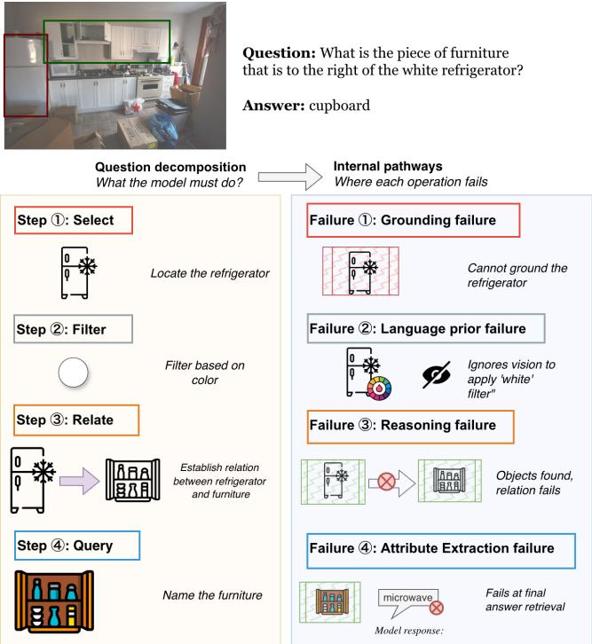
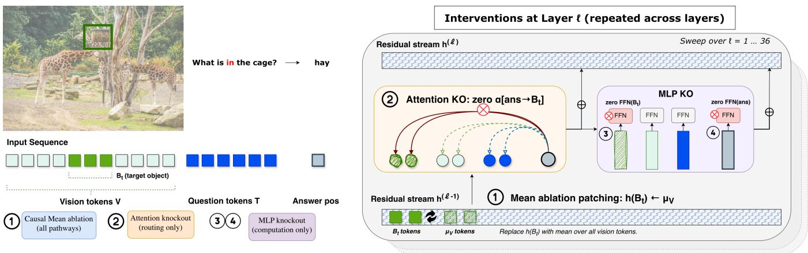
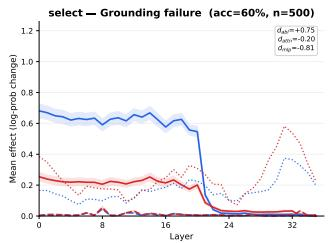
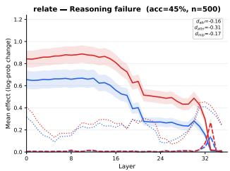
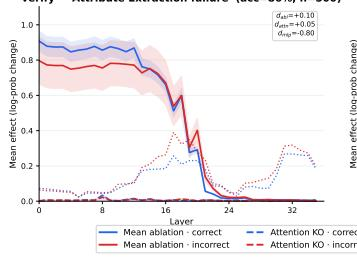
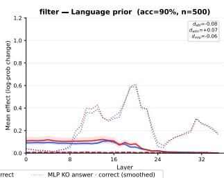
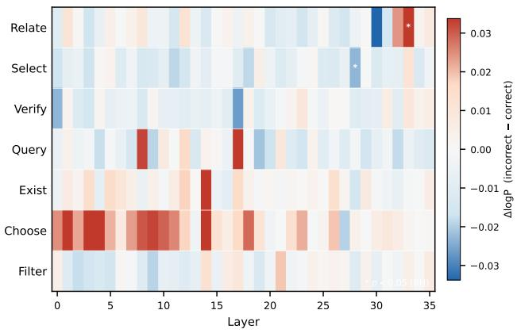

# How Do VLMs Fail? Vision-Operation Misalignment in Compositional VQA

Navya Gupta 2570043@sit.singaporetech.edu.sg Singapore Institute of Technology Singapore

Bingjie Xu bingjie.xu@singaporetech.edu.sg Singapore Institute of Technology Singapore

Timothy Liu timothyl@nvidia.com NVIDIA Singapore

## Abstract

Compositional visual question answering requires Vision-Language Models (VLMs) to execute multiple reasoning operations like object selection, spatial relation resolution, and attribute verification. De spite strong aggregate performance, the mechanistic basis of VLM failures on this task remains underexplored. To address this gap, we analyze vision–operation misalignment in VLMs by examining how failures relate to specific reasoning operations and the internal computational pathways through which they arise and propagate. We introduce an Operation-centric mechanistic framework that de composes VLM failures by both the reasoning operation where they originate and the internal computational pathway through which they propagate. Our analysis reveals four mechanistically distinct failure modes: grounding failure, reasoning failure, attribute extrac tion failure, and language prior dominance failure. Each character ized by a unique relationship between visual grounding strength and answer correctness. Through three complementary causal in terventions applied across all transformer layers, we further demon strate a pathway dissociation: grounding failures route exclusively through the feedforward network, reasoning failures route through late-layer attention, and attribute extraction failures localize to the answer-position feedforward computation. This dissociation demonstrates that diferent failure types require fundamentally dif ferent corrective strategies, providing a principled foundation for targeted improvements to VLM reliability in multimedia reasoning.

## CCS Concepts

• Computing methodologies → Hierarchical representations; Causal reasoning and diagnostics; Spatial and physical reasoning; Machine learning.

Avinash Anand avinash.anand@singaporetech.edu.sg Singapore Institute of Technology Singapore

Zhengchen Zhang zhengchen.zhang@singaporetech.edu.sg Singapore Institute of Technology Singapore

Keywords Vision-language models, multimodal reasoning, failure analysis, mechanistic interpretability, visual grounding, attention knockout

ACM Reference Format: Navya Gupta, Bingjie Xu, Avinash Anand, Timothy Liu, and Zhengchen Zhang. 2018. How Do VLMs Fail? Vision-Operation Misalignment in Compositional VQA . In Proceedings of Make sure to enter the correct conference title from your rights confirmation email (Conference acronym ’XX). ACM, New York, NY, USA, 10 pages. https://doi.org/XXXXXXX.XXXXXXX

## 1 Introduction

Compositional visual question answering requires chaining multiple reasoning steps over grounded visual evidence like localizing objects, evaluating attributes, check for existence, and computing spatial relations. On benchmarks designed to test this capability, such as GQA [12], modern Vision-language models(VLMs) [3] report strong aggregate accuracy. Yet aggregate performance conceals systematic failure patterns: models succeed through linguistic shortcuts on easy operations while failing on those that genuinely require visual grounding and multi-step inference. Understanding these failures requires moving beyond what the model outputs to examining how visual and linguistic computation interact at each reasoning step.

Consider the question “What is the piece of furniture that is to the right of the white refrigerator?” Answering correctly requires four operations: selecting the refrigerator, filter based on the color, resolving the spatial relation to identify the adjacent object, and answer the query regarding name of the furniture(See Figure 1). Each operation demands a diferent kind of vision-language integration, and a model can fail at any of them. Critically, the failure mechanism difers by operation type and failing to locate an object is a fundamentally diferent computational problem from locating it correctly but misjudging a spatial relation. No existing analysis framework distinguishes these failure types at the mechanistic level.

In transformer-based VLMs, visual information reaches the answer through two pathways: cross-token attention routing, where the answer token reads from object positions via the attention mechanism, and within-token feedforward transformation, where the MLP network processes and transforms representations at each position independently. Which pathway carries the visual signal for which operation, and where that signal is lost when the model fails, are open questions that behavioral evaluation cannot answer.

Mechanistic interpretability ofers the tools to answer them. In tervention techniques such as causal ablation [22, 24] and attention knockout [9] have been applied to language models to identify which attention heads and layers carry specific computations. Lin ear probing [5, 8] provides complementary representational evi dence. However, existing VLM interpretability work [6, 25] has largely focused on broad failure types, typically object hallucination [15] and cross-modal information flow [4, 34]. The question of whether diferent compositional operations fail through diferent internal mechanisms and determining the failures routes depending on operation type has not been addressed.

We address this question through an Operation-centric mechanistic framework that decomposes VLM failures by the typed reasoning operation where they occur and the internal computational path way through which route or transform the information to produce the final answer. Leveraging GQA’s functional program annotations and scene graph bounding boxes, we identify the specific object visual tokens causally relevant to answer the question, not ablating all vision tokens uniformly. Each question is decomposed into operations (select, relate, verify, query, exist, choose, filter).

We identify four mechanistically distinct failure modes that difer both in the stage of the forward pass where they arise and in the internal pathway through which they operate: Grounding failure, Reasoning failure, Attribute extraction failure, and Language prior dominance

The key mechanistic insight is a pathway dissociation: grounding and attribute extraction failures are MLP-mediated, while reasoning failures are attention-mediated at late layers. This means that interventions targeting feedforward processing and those targeting attention routing address fundamentally diferent fail ure modes. This has direct implications for designing targeted, operation-aware corrections to VLM reliability for VQA and multimedia reasoning.

Our contributions are:

(1) An operation-aware failure taxonomy for compositional VQA. We decompose VLM failures into four mecha nistically distinct modes: grounding failure, reasoning fail ure, attribute extraction failure, and language prior domi nance failure. Each defined by a unique relationship between visual grounding strength and answer correctness across seven GQA operation types. Cross-architecture analysis on LLaVA-1.5-7B [19] reveals a two-tier structure: attribute ex traction and language dominant modes are architectureindependent, while grounding and reasoning modes are encoder-dependent.

(2) Operation-specific causal targeting via scene-graph grounding. Rather than intervening on all visual tokens uniformly, we identify the specific vision tokens causally relevant to each reasoning operation using GQA’s functional programs and scene graphs. This operation-aware targeting reveals that grounding strength predicts correctness diferently across operations — positively for object selection, inversely for spatial reasoning, and not at all for language-prior operations.

  
Figure 1: Four failure modes in compositional VQA, each breaking at a diferent internal stage. A chained question (select → filter → relate → query) can fail at perception, reasoning, or answer retrieval. Fourth failure mode is language prior dominance which bypasses visual computation entirely.

(3) Pathway dissociation across failure modes. By independently blocking the attention pathway and the feedforward pathway, we demonstrate that grounding and attribute extraction failures route through the feedforward network, while reasoning failures route through late-layer attention. Validation on VSR confirms that spatial reasoning errors are MLP-mediated at the object encoding stage across both compositional and single-step benchmarks.

## 2 Related Work

Mechanistic interpretability in language and vision-language models. In language models, this line of work has established a set of causal and representational tools for analysing internal computation. Attention heads have been characterised as structured circuits with distinct query-key (QK) and output-value (OV) roles [7], while targeted interventions enable localisation of task-relevant information within specific layers and pathways [9, 22, 32]. Complementary methods including residual stream decomposition and linear probing provide additional insight into how representations are formed, transformed, and propagated across depth [2, 5, 8]. Recent work extends these techniques to VLMs, adapting causal tracing and perturbation-based analysis to study cross-modal computa tion [11, 17, 20, 25]. These studies show that visual information is progressively integrated into linguistic representations, with object-level signals emerging and refining across layers [24, 30], and cross-modal interaction occurring through structured routing mechanisms such as specialised attention heads and staged inte gration pipelines [14, 34]. Further work demonstrates that object representations can be causally localised and linked to model pre dictions, particularly in the context of hallucination and grounding errors [15].

Attention and MLP pathway analysis. In language models, attention mechanisms primarily route information across tokens while MLP layers act as key-value memories storing factual associ ations [7, 10, 22]. Recent work extends this to multimodal models, revealing that visual constraints are encoded in early MLP and self-attention blocks while mid-layer attention routes this infor mation to the output [4], and certain attention heads specialise in reasoning-related functions [13]. Other studies trace how visual capabilities emerge across layers during fine-tuning [23].However, the relationship between these pathways and specific failure modes in compositional VQA remains unexplored.

Failure analysis in VLMs. Understanding why VLMs fail on visual question answering has been approached from behavioral and representational perspectives. Object hallucination has been exten sively studied as a language-prior failure, where answers are driven by statistical co-occurrence rather than visual evidence [16, 21, 27]. Attribute binding failures, where models ground the correct object but retrieve the wrong property, are documented through com positional benchmarks such as Winoground [28] and VALSE [26]. Spatial and relational failures are characterised in VSR [18, 29], showing that models systematically fail at positional resolution even when objects are correctly localised. At a higher level, VLMs have been shown to underperform their own vision encoders on basic image classification [33], and critic-based frameworks that decouple reasoning from verification can partially mitigate such errors through iterative refinement [31].

## 3 Methodology

## 3.1 Preliminaries

We study Qwen2.5-VL-3B-Instruct [3], a vision-language model consisting of a native-resolution vision encoder and a 36-layer transformer language backbone. The input sequence

$$
\mathbf {x} = \left[ v _ {1}, \dots , v _ {N _ {V}}, t _ {1}, \dots , t _ {N _ {T}} \right]
$$

concatenates $N _ { V }$ vision tokens from the image encoder with $N _ { T }$ text tokens from the tokenized question, followed by a single answer position from which the model generates its response.

Each transformer layer ℓ updates the hidden state at position ?? in two sequential steps:

$$
\hat {H} _ {i} ^ {(\ell)} = H _ {i} ^ {(\ell - 1)} + \operatorname{Attn} \left(\operatorname{LN} \left(H _ {i} ^ {(\ell - 1)}\right)\right)\tag{1}
$$

$$
H _ {i} ^ {(\ell)} = \hat {H} _ {i} ^ {(\ell)} + \mathrm{MLP} \Big (\mathrm{LN} \Big (\hat {H} _ {i} ^ {(\ell)} \Big) \Big)\tag{2}
$$

where LN denotes layer normalisation. The attention output decomposes over heads ℎ as $\begin{array} { r } { a _ { i } ^ { ( \ell ) } = \sum _ { h } \sum _ { j } \alpha _ { i j } ^ { ( \ell , h ) } W _ { O } ^ { ( \ell , h ) } W _ { V } ^ { ( \ell , h ) } \mathbf { \widetilde { H } } _ { j } ^ { ( \ell - 1 ) } } \end{array}$ where $\alpha _ { i j } ^ { ( \ell , h ) }$ are post-softmax attention weights, and $W _ { V } ^ { ( \ell , h ) } , W _ { O } ^ { ( \ell , h ) }$ are the value and output projection matrices for head $h .$

Table 1: Qualitative examples by operation and failure mode. Correct (✓) and incorrect (×) predictions drawn from GQA

<table><tr><td>Op.</td><td>Question</td><td>GT</td><td>Pred.</td></tr><tr><td colspan="4">Grounding failure</td></tr><tr><td>select×</td><td>Does the helmet have a different color than the seat?</td><td>no</td><td>yes</td></tr><tr><td>select√</td><td>Is the bench made of the same material as the scaffolding?</td><td>yes</td><td>yes</td></tr><tr><td colspan="4">Reasoning failure</td></tr><tr><td>relate×</td><td>Where is the girl?</td><td>beach</td><td>water</td></tr><tr><td>relate√</td><td>Which kind of furniture is the man on?</td><td>bed</td><td>bed</td></tr><tr><td colspan="4">Attribute extraction failure</td></tr><tr><td>verify×</td><td>Is the boy holding the stick?</td><td>yes</td><td>no</td></tr><tr><td>query×</td><td>What color is the cart?</td><td>golden</td><td>silver</td></tr><tr><td>exist√</td><td>Are there both plates and spoons in the picture?</td><td>yes</td><td>yes</td></tr><tr><td colspan="4">Language prior</td></tr><tr><td>filter√</td><td>Is the bottle that is made of glass open or closed?</td><td>open</td><td>open</td></tr><tr><td>choose√</td><td>Is the chain black or yellow?</td><td>black</td><td>black</td></tr></table>

We denote the set of vision token positions as V, the subset corresponding to a target object’s bounding box as $\mathcal { B } _ { t } .$ , text positions as $\mathcal { T }$ , and the answer position as ans. All interventions measure degradation in the log-probability of the correct answer: positive degradation indicates the intervened component was causally supporting the correct prediction.

## 3.2 Operation-Aware Decomposition of Queries and Failure Taxonomy

GQA annotates each question with a functional program $\mathcal { P } ( q ) =$ $( o _ { 1 } , \ldots , o _ { T } )$ that decomposes it into typed reasoning steps, and a scene graph that grounds each step’s arguments to bounding box regions in the image. The operation vocabulary includes select (locate an object), relate (resolve a spatial relation), verify (check a property or relation), query (retrieve an attribute), exist (test presence), filter (subset by attribute), and choose (select between alternatives).

For example, the question “Is the object to the left of the red chair made of wood?” decomposes into three operations: select(red chair) → relate(to the left of) → verify(made of wood). Each operation is grounded to a specific image region through the scene graph, and the model must integrate the correct visual evidence at each step to answer correctly. Our analysis asks whether failure at each step has a distinct mechanistic signature.

Operation-aware grounding. Each operation $o _ { t }$ is associated with bounding box regions $\mathcal { B } _ { t }$ resolved from the scene graph. We define grounding sets based on causal relevance to the operation rather than naively patching all mentioned objects:

  
Figure 2: Layer-wise causal interventions for object-specific reasoning. At layer ℓ, we intervene on target object tokens $B _ { t }$ using three methods: Causal Mean ablation (ℎ(???? ) ← ???? ), attention knockout $( \alpha _ { \mathbf { a n s }  B _ { t } } = 0 )$ , and MLP knockout (zeroing FFN outputs at object and answer positions).

• select, query, filter: the selected or filtered object

• exist: each branch object independently

• veri $\mathsf { f y , }$ choose: primary object and relational argument jointly, since the relation requires both reference points

• relate: the terminal relate-step object only which deter mines the answer

This reflects causal structure for verify, patching either refer ence object alone yields incomplete signal. For relate, intermedi ate objects are not answer-determining and introduce noise. These grounding sets $\mathcal { B } _ { t }$ are shared across all subsequent experiments.

Four failure modes. By comparing grounding strength between correct and incorrect answers for each operation type, we identify four mechanistically distinct failure modes. Each is defined by a characteristic relationship between visual grounding and answer correctness, reflecting a diferent stage at which vision–operation alignment breaks down. Table 1 shows qualitative examples to shows failure modes of each operation.

Grounding failure arises when correct answers exhibit sub stantially higher grounding strength than incorrect ones. Model succeeds precisely when it develops causal reliance on the target object’s visual region and fails when it does not. This pattern is expected for operations that require precise object identification as a prerequisite, such as locating a specific entity in the scene. The bottleneck is perceptual as the model cannot locate or encode the relevant object.

Reasoning failure arises when the relationship reverses, incorrect answers exhibit higher grounding strength than correct ones. The model locates the target object but persists in retrieving its visual representation at processing stages where higher-order infer ence should dominate. This over-grounding pattern is expected for operations that require computing relations or spatial judgments between two or more objects. This failure happens when the model fixates on the visual content of the entity rather than reasoning about its context.

Attribute Extraction failure arises when grounding strength is high regardless of correctness as the model consistently grounds the relevant object but sometimes produces the wrong answer. The visual evidence reaches the model’s representations, yet the final computation that converts a grounded representation into an answer fails. This pattern is expected for operations where object identity is straightforward, but the required attribute judgement (checking a property, retrieving the color/shape, confirming existence) demands additional context beyond grounding.

Language Prior dominance failure arises when grounding strength is low for both correct and incorrect answers. The model produces its answer from linguistic patterns without substantively engaging the visual pathway. This is expected for operations where strong language priors exist. For instance, questions ofering two alternatives where world knowledge sufices to select the plausible option without examining the image.

## 3.3 Measuring Visual Criticality via Causal Mean Ablation

To determine whether visual grounding is causally necessary for each operation, we ablate the operation’s grounding tokens $\mathcal { B } _ { t }$ at each layer ℓ by replacing their hidden states with a neutral baseline, and measure the resulting degradation in the log-probability of the ground-truth answer ?? given image ?? and question ??:

$$
\Delta_ {t} ^ {(\ell)} = \log p (a \mid I, q) - \log p (a \mid I, q; \text { ablate } (\mathcal {B} _ {t}, \ell))\tag{3}
$$

The baseline is the mean activation over all vision token positions at layer ℓ from the clean forward pass:

$$
\mu^ {(\ell)} = \frac {1}{| \mathcal {V} |} \sum_ {j \in \mathcal {V}} H _ {j} ^ {(\ell)}\tag{4}
$$

We use the per-sample mean over vision tokens as the replacement baseline because it is in-distribution and denotes a valid point in the activation space the model has processed. It also preserves the aggregate visual context while removing only object-specific information, ensuring that degradation reflects the loss of the target object rather than the removal of all visual signal.

Crucially, only the tokens in $\mathcal { B } _ { t }$ are replaced, the remaining vision tokens and all text tokens are untouched. This removes object-specific information required by the model to answer the question while keeping activations in-distribution, and ensures that the measured degradation reflects the causal role of the specific grounded object, not of global visual input. Our intervention tests necessity, whether the model requires the object’s representation at layer ℓ to produce the correct answer.

The degradation curve $\{ \Delta _ { t } ^ { ( \ell ) } \} _ { \ell = 1 } ^ { L }$ characterises how causal reliance on the object evolves across network depth. We represent it with the grounding strength $\mathrm { G S } ( o _ { t } ) = \operatorname* { m a x } _ { \ell } \bar { \Delta _ { t } ^ { ( \ell ) } }$ , capturing how much the operation depends on visual grounding.

## 3.4 Isolating Computational Pathways via Targeted Knockout

Causal mean ablation removes the object’s hidden state entirely, afecting both the attention pathway (other tokens reading from the object position) and the feedforward pathway (MLP transforma tions of the object and answer representations). To test the pathway hypotheses, we apply two complementary interventions that isolate each pathway independently(See Figure 2).

Attention knockout. To isolate the attention pathway, we prevent the answer token from attending to the object’s visual tokens while preserving the remaining attention structure. At layer ℓ, attention weights from the answer position to grounding tokens $\mathcal { B } _ { t }$ are set to zero and the remaining weights renormalized:

$$
\tilde {\alpha} _ {\mathrm{ans}, j} ^ {(\ell , h)} = \left\{ \begin{array}{l l} 0 & j \in \mathcal {B} _ {t} \\ \frac {\alpha_ {\mathrm{ans} , j} ^ {(\ell , h)}}{1 - \sum_ {k \in \mathcal {B} _ {t}} \alpha_ {\mathrm{ans} , k} ^ {(\ell , h)}} & j \notin \mathcal {B} _ {t} \end{array} \right.\tag{5}
$$

Renormalization ensures the intervention changes only where each head reads, not how much — the value-weighted output retains its original scale. The knockout degradation $\mathrm { K O } _ { \mathrm { a t t n } } ^ { ( \ell ) } = \log p ( a \mid$ ${ \cal I } , q ) { - } \log p ( a \mid { \cal I } , q ; \tilde { \alpha } ^ { ( \ell ) } )$ measures causal dependence on attention mediated object access at each layer.

This intervention blocks only the direct attention path from the answer token to object positions at layer ℓ. Indirect paths are not blocked. This is an intentional design choice as blocking all indirect paths would require intervening across all layers simultaneously, confounding the layer-wise localisation that is the primary goal of the experiment. The layer-wise degradation curve therefore mea sures the marginal causal contribution of direct attention routing at each depth, not total information flow from object tokens.

MLP knockout. To isolate the feedforward pathway, we zero out the MLP output at specific token positions. We consider two variants targeting diferent computational roles:

$$
\tilde {f} _ {i} ^ {(\ell)} = \left\{ \begin{array}{l l} \mathbf {0} & i \in \mathcal {S} \\ f _ {i} ^ {(\ell)} & i \notin \mathcal {S} \end{array} \right.\tag{6}
$$

where $s$ is the set of target positions and $f _ { i } ^ { ( \ell ) }$ is the MLP output at position ??, layer ℓ. In object-position knockout $( S = \mathcal { B } _ { t } )$ , the MLP cannot transform the object’s representation, disrupting withintoken visual processing while leaving attention routing intact. In answer-position knockout $( S = \{ \mathrm { a n s } \} )$ , the MLP cannot transform the answer token’s representation, disrupting the computation that converts attended information into the final prediction.

Pathway comparison. The three degradation curves: Causal Mean ablation $\Delta ^ { ( \ell ) }$ , Attention knockout $\mathrm { K O } _ { \mathrm { a t t n } } ^ { \overline { { ( \ell ) } } }$ , and MLP knockout $\mathrm { K O } _ { \mathrm { m l p } } ^ { ( \ell ) }$ are computed on the same samples with the same correctness labels, enabling direct comparison. Stratifying each degradation metric by model correctness and computing the grounding specificity shift (Cohen’s ??) reveals which pathway carries the correctnessdiscriminating signal for each operation. The joint signature across all three metrics assigns each operation to its failure mode (Table 3).

## 4 Experimental Setup

Data and sampling. We use GQA [12], which provides compositional questions paired with functional programs and scene graphs over real images. Scene graphs supply bounding boxes for all grounded objects, enabling operation-aware identification of the vision tokens $\mathcal { B } _ { t }$ relevant to each reasoning step. We sample 500 questions per operation type (select, relate, verify, exist, query, choose, filter) from the balanced training split for 3,500 total samples. Generalisation experiments on VSR [18] for relate operation are reported in $\ S 5 .$

Model and inference. All experiments use Qwen2.5-VL-3B-Instruct [3] in fp16 precision. Model correctness is determined by greedy generation with matching against the ground truth. Answer log-probabilities are computed by teacher-forcing the ground truth tokens. All interventions are applied one layer at a time across all 36 layers, producing a degradation curve per sample. Each experiment requires 37 forward passes per sample (1 clean + 36 intervened).

Metrics and statistics. We report three quantities per operation, each split by model correctness:

• Grounding strength (GS): peak degradation under mean ablation across layers, measuring total causal dependence on the object’s visual representation.

• Attention knockout degradation $\mathrm { ( K O _ { a t t n } ) } \mathrm { : }$ peak degradation when attention from the answer position to $\mathcal { B } _ { t }$ is blocked, isolating the attention pathway.

• MLP knockout degradation $( \mathrm { K O } _ { \mathrm { m l p } } ) { \mathrm { : } }$ : peak degradation when the MLP output at the answer position is zeroed, isolating the feedforward pathway.

• Grounding specificity shift (GSS): Cohen’s ?? between correct and incorrect samples on each degradation metric, serving as the primary statistic for failure mode classification: Positive GSS indicates correct predictions show higher degradation (grounding aids success); negative GSS indicates incorrect predictions show higher degradation (overgrounding).

Each failure mode is identified by its joint signature across all three metrics (Table 3).

Representational validation. To support that causal findings reflect visual computation rather than surface text features, we construct contrastive question pairs $( q _ { \mathrm { c l e a n } } , q _ { \mathrm { c o r r u p t } } )$ from GQA that share the same image but difer in a semantically relevant word (e.g. replacing an object name or attribute). We extract hidden states at each layer for both members of the pair and train a linear regression probe to classify each state as clean or corrupted. Pairs are parti tioned by behavioural vision sensitivity: a pair is vision-sensitive (VS) if the model’s generated answer changes between the clean and corrupted input, and vision-insensitive (NV) otherwise (Eq. 7).

$$
\operatorname{VS} (q) = \mathbf {1} \left[ f (I, q _ {\text { clean }}) \neq f (I, q _ {\text { corrupt }}) \right]\tag{7}
$$

The probe accuracy gap ??VS = accVS − accNV serves as a validity criterion. We require $\delta _ { \mathrm { V S } } ~ > ~ 0 . 0 5$ to treat an operation’s causal results as reflecting vision-grounded representations rather than text artifacts.

Spatial relation generalization. The GQA analysis decomposes failures across seven operation types, but each question involves multiple chained operations, making it dificult to isolate the spatial reasoning component from upstream grounding steps. To disentan gle this, we replicate all three interventions on VSR [18], a binary spatial reasoning benchmark where each question requires a single spatial judgment between two objects (e.g. “The cat is behind the laptop” ; answer yes/no). We use the test split (2,195 samples, 66 relation types across 7 meta-categories), applying the same protocol as GQA and intervening on the subject, object, and both jointly.

## 5 Results

Table 3 presents the complete mechanistic profile across three interventions. Each intervention is applied independently at every layer, and we report the peak degradation in answer log-probability, split by model correctness, with Cohen’s ?? quantifying the correctness– degradation association. The joint pattern across all three interventions assigns each operation to one of four failure modes. We first validate these assignments representationally, then analyze each failure mode in turn, and close with generalizing the ’relate’ operation using VSR benchmark and applying our method to LLaVA-1.5-7B model [19].

## 5.1 Representational Validation

The failure taxonomy rests on causal interventions that target specific visual tokens. A potential confound is that interventions might detect surface linguistic diferences between clean and corrupted questions rather than genuine changes in visual computation. Table 2 reports the vision-sensitivity gap $\delta _ { \mathrm { V S } }$ for each operation.

The three operations central to the taxonomy’s visiondependent failure modes all pass the validation threshold(??VS > 0.05) with substantial margins. In each case, probes trained on pairs where the model demonstrably changed its answer achieve near-perfect accuracy, while probes on pairs where the answer was unchanged perform markedly worse. This confirms that the causal signals underlying the reasoning failure, grounding failure, and attribute extraction failure modes reflect changes in visual representation, not lexical cues.

filter fails the threshold $( \delta _ { \mathrm { V S } } = + 0 . 0 3 )$ , providing indepen dent representational evidence for its classification as visiondisconnected. query and select are marginal $( \delta _ { \mathrm { V S } } = + 0 . 0 6 )$ . Their high NV baselines (∼0.94) indicate that these operations produce suficiently distinctive question structures for probes to detect the counterfactual from text alone, the positive gap nonetheless con firms a residual vision contribution. We exclude choose from the probing analysis because constructing valid counterfactual pairs for binary-choice questions is not feasible (e.g. changing “Is the chain black or yellow?” to “Is the chain yellow or black?”) This would alter only the order of options without introducing a genuine semantic contrast.

  
Figure 3: Four mechanistically distinct failure modes. Layerwise degradation under mean ablation (solid), attention knockout (dashed), and MLP knockout (dotted), split by correctness (blue = correct, red = incorrect).

Table 2: Counterfactual probing validation. Vision-sensitive (VS) and vision-insensitive (NV) probe accuracy at best layer. The VS–NV gap validates whether probes read visual computation or surface text.

<table><tr><td>Op.</td><td>VS</td><td>NV</td><td> $\delta_{VS}$ </td><td>Verdict</td></tr><tr><td>verify</td><td>1.00</td><td>0.66</td><td>+0.34</td><td>Vision</td></tr><tr><td>relate</td><td>0.93</td><td>0.68</td><td>+0.24</td><td>Vision</td></tr><tr><td>exist</td><td>0.98</td><td>0.75</td><td>+0.23</td><td>Vision</td></tr><tr><td>query</td><td>1.00</td><td>0.94</td><td>+0.06</td><td>Marginal</td></tr><tr><td>select</td><td>1.00</td><td>0.94</td><td>+0.06</td><td>Marginal</td></tr><tr><td>filter</td><td>0.82</td><td>0.78</td><td>+0.03</td><td>Artifact</td></tr></table>

## 5.2 Grounding Failure: select

Select produces the cleanest mechanistic signal in the study. Mean ablation reveals a strong positive association between grounding strength and correctness $( d = + 0 . 7 5 )$ . Correct answers depend heavily on the target object’s visual representation while incorrect answers show minimal dependence. The model fails because it never develops causal reliance on the target object and the bottleneck is perceptual.

The pathway analysis localises this failure to the feedforward network. Attention knockout produces no significant correctness discrimination showing that blocking the answer token’s attention to the object barely afects the output regardless of correctness. In contrast, MLP knockout at the answer position yields the

Table 3: Complete mechanistic profile across all interventions. For each operation: model accuracy, mean ablation grounding strength (GS), attention knockout (Attn KO) peak degradation, and MLP knockout at the answer position (MLP KO) split by correctness with Cohen’s ??. Significance: $^ { \star \star \star } p < 0 . 0 0 1 , ^ { \star \star } p < 0 . 0 1 , ^ { \star } p < 0 . 0 5$ . Failure mode is assigned based on the joint pattern across all three interventions.

<table><tr><td rowspan="2">Operation</td><td rowspan="2">Acc.</td><td colspan="3">Mean Ablation</td><td colspan="3">Attn KO</td><td colspan="3">MLP KO (answer)</td><td rowspan="2">Failure mode</td></tr><tr><td> $GS_{\checkmark}$ </td><td> $GS_{\times}$ </td><td>d</td><td> $KO_{\checkmark}$ </td><td> $KO_{\times}$ </td><td>d</td><td> $KO_{\checkmark}$ </td><td> $KO_{\times}$ </td><td>d</td></tr><tr><td>select</td><td>60.4%</td><td>0.975</td><td>0.489</td><td>+0.75***</td><td>0.074</td><td>0.104</td><td>-0.19</td><td>1.104</td><td>1.439</td><td>-0.80***</td><td>Grounding</td></tr><tr><td>relate</td><td>44.8%</td><td>0.894</td><td>1.116</td><td>-0.17**</td><td>0.164</td><td>0.298</td><td>-0.32***</td><td>1.438</td><td>1.543</td><td>-0.17*</td><td>Reasoning</td></tr><tr><td>verify</td><td>86.4%</td><td>1.134</td><td>0.995</td><td>+0.12</td><td>0.050</td><td>0.045</td><td>0.05</td><td>0.956</td><td>1.197</td><td>-0.71***</td><td>Attr. extraction</td></tr><tr><td>query</td><td>67.4%</td><td>0.918</td><td>0.759</td><td>+0.15</td><td>0.224</td><td>0.234</td><td>-0.02</td><td>1.965</td><td>1.739</td><td>+0.33***</td><td>Attr. extraction</td></tr><tr><td>exist</td><td>82.5%</td><td>1.147</td><td>0.775</td><td>+0.30</td><td>0.043</td><td>0.060</td><td>-0.15**</td><td>0.822</td><td>0.906</td><td>-0.27*</td><td>Attr. extraction</td></tr><tr><td>choose</td><td>89.4%</td><td>0.310</td><td>0.281</td><td>+0.08</td><td>0.190</td><td>0.176</td><td>+0.10</td><td>1.744</td><td>1.830</td><td>-0.13</td><td>Language prior</td></tr><tr><td>filter</td><td>90.0%</td><td>0.214</td><td>0.217</td><td>-0.01</td><td>0.1393</td><td>0.1453</td><td>+0.0659</td><td>1.438</td><td>1.464</td><td>-0.06</td><td>Language prior</td></tr></table>

The pathway analysis localises this failure to the attention mechanism. Attention knockout amplifies the reversed signal, nearly doubling the mean ablation efect, with degradation concentrated at layers 28–35 (Figure 3, top right; Figure 4). The answer-position MLP contributes a secondary efect of similar magnitude to the ablation but substantially weaker than the attention pathway, indicating that the MLP partially compensates for attention’s over-routing of visual content rather than driving the er ror. The Per-head knockout statistics (More details in Appendix) show that no single head dominates and that the over-grounding is distributed across heads at late layers rather than localized to an isolated circuit.

largest negative efect among all operations $( d = - 0 . 8 0 )$ , with incorrect answers substantially more sensitive to MLP disruption. The dissociation is visible in Figure 3 (top left), where the fullpathway ablation gap is entirely absent from the attention pathway and fully accounted for by the feedforward pathway.

## 5.4 Attribute Extraction Failure: verify, query, exist

Three operations share a common profile under mean ablation: high absolute grounding strength with no significant correctness discrimination. The model consistently grounds the relevant object regardless of whether it answers correctly. Attention

With the lowest accuracy of all operations (45%), relate is the only failure mode where the model’s access to the correct visual information actively harms performance.

## 5.3 Reasoning Failure: relate

This indicates that object recognition in select operates through within-token MLP computation rather than cross token attention routing. The model processes object identity through feedforward transformations at the answer position, and when this computation fails, the object is never efectively grounded.

Relate exhibits the opposite grounding profile. Mean ablation shows a reversed grounding–correctness relationship. Incor rect answers are more causally dependent on the target object than correct ones. The model locates the object but persists in retrieving its visual representation at processing stages where abstract relational inference should dominate.

  
Figure 4: Layer-wise attention knockout diference (ΔKO = incorrect − correct) across operations. Red indicates incorrect predictions depend more on bbox attention at that layer; blue indicates correct predictions do. relate shows a concentrated positive signal at L33, confirming attention-mediated overgrounding at late layers.

knockout confirms this pattern as they don’t show a meaningful correctness split through the attention pathway(Figure 3, bottom left).

MLP knockout at the answer position reveals the failure locus. For verify, incorrect answers are substantially more sensitive to MLP disruption, the second-largest efect after select. The feedforward network at the answer position fails to extract the correct verification judgment from a well-grounded representation even when the model grounds both objects in a relation correctly but cannot compute whether the relation holds. Object-position MLP knockout corroborates this and shows significant sensitivity at the bbox positions as well $( d = - 0 . 4 9 )$ , indicating that the MLP’s processing of the object representation itself also contributes to the failure.

Query displays a distinct variant: the MLP efect reverses direction $( d = + 0 . 3 3 )$ , with correct answers more dependent on answerposition MLP computation. When the MLP successfully processes the grounded representation, the attribute is retrieved correctly;

although when the MLP does not engage productively, the answer defaults to an incorrect response. The failure is not that the MLP breaks but that it was never supplied with a representation from which the correct attribute could be extracted.

Exist shows significant efects in both the object-position MLP $( d = - 0 . 6 6 )$ and the attention pathway, with a moderate answerposition MLP efect. Unlike verify and query, exist failures are distributed across pathways with no single dominant mechanism, consistent with existence checking being a simpler operation that can fail at multiple stages.

## 5.5 Language Prior Dominance: choose, filter

The choose and filter operations show uniformly null results across all three interventions. Causal mean ablation produces the lowest grounding strength of any operations with no correct ness discrimination. Neither attention knockout nor MLP knock out reveals a significant pathway-specific efect. These operations achieve high accuracy (89–90%) through linguistic patterns rather than visual computation (Figure 3, bottom right).

Choose exploits world knowledge encoded in the language model’s parameters, and selects the plausible answer without examining the image, consistent with the well-documented tendency of VLMs to rely on language priors when the question structure permits [1]. Filter applies attribute-based subsetting that the model resolves from question semantics alone. Independent evidence detected by linear probing presented in Section 5.1 corroborates this classifica tion: filter shows the lowest vision-sensitive pair rate (27%) and a negligible probe validation gap.

## 5.6 Spatial Relation Validation on VSR

The GQA analysis identifies relate as a reasoning failure where the model over-grounds the terminal object through late-layer at tention. VSR isolates this relational component as every question requires a single spatial judgment between two objects, removing the confound of multi-step composition. Table 4 reports the dissoci ation pattern across all three interventions for each meta-category.

Spatial errors are MLP-mediated at the object encoding stage. Four of seven categories show significant bbox MLP knock out dissociation with incorrect predictions consistently more sen sitive. The strongest efects appear in Topological and Proximity relations, these categories require precise encoding of containment and distance between objects, where the MLP’s transformation of bounding-box tokens is most critical.

Attention routing does not carry the error signal for most spatial categories. The only significant attention efects appear in Adjacency and Directional, and in the positive direction. These are categories where spatial judgment is anchored on one object’s position relative to an immediate neighbour, making attentionmediated access to the anchor object genuinely load-bearing for correct answers.

The failure locus is encoding, not decoding. Answer-position MLP knockout is null across all categories. In GQA, attribute ex traction operations fail at the answer position where the MLP must convert a grounded representation into output. VSR’s null answerposition result shows that spatial judgments break at the stage of encoding object positions through the bbox MLP, not at the stage of assembling the answer — reinforcing that the encoding–decoding distinction tracks the boundary between spatial reasoning and attribute extraction failures across benchmarks.

Table 4: VSR cross-experiment summary. Cohen’s ?? (correct vs. incorrect) under each intervention. Example relations illustrate each category.

<table><tr><td>Category</td><td>Example relations</td><td>Abl.</td><td>Attn</td><td>MLP(object)</td></tr><tr><td>Projective</td><td>behind, left of, above, in front of</td><td>-.35***</td><td>-.13ns</td><td>-.60***</td></tr><tr><td>Topological</td><td>inside, part of, contains, touching</td><td>-.08*</td><td>+.01ns</td><td>-.81***</td></tr><tr><td>Directional</td><td>toward, past, away from</td><td>+.14ns</td><td>+.45*</td><td>-.61**</td></tr><tr><td>Adjacency</td><td>alongside, at the side of, attached to</td><td>-.23*</td><td>+.10*</td><td>-.30ns</td></tr><tr><td>Proximity</td><td>near, close to, far from</td><td>-.07ns</td><td>+.04ns</td><td>-.72*</td></tr><tr><td>Orientation</td><td>facing, parallel to, perpendicular to</td><td>-.33ns</td><td>-.01ns</td><td>-.03ns</td></tr><tr><td>Unallocated</td><td>next to, opposite to, among</td><td>+.83*</td><td>+.49*</td><td>-.31ns</td></tr></table>

## 5.7 Cross-Architecture Analysis

The taxonomy identifies four failure modes on Qwen2.5-VL, which has a native-resolution vision encoder that preserves spatial detail in the token representation. To test which modes reflect task-level computational requirements versus architecturespecific circuits, we apply the same interventions to LLaVA-1.5-7B, which uses a frozen CLIP-ViT encoder and a lightweight 2-layer MLP adapter.

Attribute extraction failure for query (d=+0.48, p<0.001) in addition to exist (d=−0.60, p<0.001) at the answer-position MLP, and fourth failure Language Prior for choose and filter (all null) remain consistent. These modes reflect task structure relevant for output decoding and requires specific MLP computation at the answer position regardless of how vision tokens are encoded. Languagedependent operations bypass vision in both models.

Vision dependent failure like Grounding of select and the Reasoning failure of relate produce no significant dissociation in LLaVA (all $\vert \mathbf { d } \vert < 0 . 0 5 )$ . This is expected as LLaVA’s frozen CLIP encoder produces vision tokens that are compressed semantic summaries with large receptive fields therefore, ablating a specific object’s tokens removes less unique information because neighboring tokens encode similar content. These failures identified in Qwen2.5-VL depend on the vision encoder preserving spatially precise, object-specific information that the language model’s MLP must then process. When the encoder has already abstracted away this spatial detail, these failure modes cannot manifest in the language backbone.

This analysis suggests a two-tier taxonomy: task-level failure modes (output decoding) that are architecture-independent, and encoder-dependent failure modes that emerge only when the vision encoder preserves suficient spatial granularity for the language model to fail at processing it.

## 6 Conclusion

We presented an operation-centric mechanistic framework that decomposes VLM failures on compositional reasoning by both op eration type and internal computational pathway on GQA dataset. Through three complementary causal interventions applied across all transformer layers of Qwen2.5-VL, we established four failure modes: grounding, reasoning, attribute extraction, and language prior dominance. Each with a distinct causal signature. The central finding is a pathway dissociation: grounding and attribute extraction failures route through the feedforward network, while reason ing failures route through late-layer attention. Cross-benchmark validation on VSR benchmark and cross-architecture analysis on LLaVA-1.5 reveal that attribute extraction and language dominant modes are architecture-independent, while grounding and reason ing modes emerge only when the vision encoder preserves suficient spatial granularity.

Limitations. Our primary analysis uses a single 3B-parameter model on GQA. The mean ablation intervention tests necessity but not suficiency. Operations with high accuracy have limited incorrect samples, constraining statistical power. Our contribution is diagnostic rather than demonstrating a corrective intervention.

## References

[1] Aishwarya Agrawal, Dhruv Batra, Devi Parikh, and Aniruddha Kembhavi. 2018. Don’t just assume; look and answer: Overcoming priors for visual question answering. In Proceedings of the IEEE conference on computer vision and pattern recognition. 4971–4980.

[2] Guillaume Alain and Yoshua Bengio. 2016. Understanding intermediate layers using linear classifier probes. arXiv preprint arXiv:1610.01644 (2016)

[3] Shuai Bai, Yuxuan Cai, Ruizhe Chen, Keqin Chen, Xionghui Chen, Zesen Cheng, Lianghao Deng, Wei Ding, Chang Gao, Chunjiang Ge, et al. 2025. Qwen3-v technical report. arXiv preprint arXiv:2511.21631 (2025).

[4] Samyadeep Basu, Martin Grayson, Cecily Morrison, Besmira Nushi, Soheil Feizi, and Daniela Massiceti. 2024. Understanding information storage and transfer in multi-modal large language models. Advances in Neural Information Processing Systems 37 (2024), 7400–7426.

[5] Yonatan Belinkov. 2022. Probing Classifiers: Promises, Shortcomings, and Ad vances. Computational Linguistics 48, 1 (March 2022), 207–219. doi:10.1162/coli\_ a\_00422

[6] Gabriela Ben Melech Stan, Estelle Aflalo, Raanan Yehezkel Rohekar, Anahita Bhiwandiwalla, Shao-Yen Tseng, Matthew Lyle Olson, Yaniv Gurwicz, Chenfe Wu, Nan Duan, and Vasudev Lal. 2024. Lvlm-intrepret: An interpretability tool for large vision-language models. In Proceedings of the IEEE/CVF Conference on Computer Vision and Pattern Recognition. 8182–8187.

[7] Nelson Elhage, Neel Nanda, Catherine Olsson, Tom Henighan, Nicholas Joseph, Ben Mann, Amanda Askell, Yuntao Bai, Anna Chen, Tom Conerly, Nova Das Sarma, Dawn Drain, Deep Ganguli, Zac Hatfield-Dodds, Danny Hernandez, Andy Jones, Jackson Kernion, Liane Lovitt, Kamal Ndousse, Dario Amodei, Tom Brown, Jack Clark, Jared Kaplan, Sam McCandlish, and Chris Olah. 2021. A Mathemat ical Framework for Transformer Circuits. Transformer Circuits Thread (2021). https://transformer-circuits.pub/2021/framework/index.html

[8] Javier Ferrando and Elena Voita. 2024. Information Flow Routes: Automatically Interpreting Language Models at Scale. In Proceedings of the 2024 Conference on Empirical Methods in Natural Language Processing, Yaser Al-Onaizan, Mohit Bansal, and Yun-Nung Chen (Eds.). Association for Computational Linguistics, Miami, Florida, USA, 17432–17445. doi:10.18653/v1/2024.emnlp-main.965

[9] Mor Geva, Jasmijn Bastings, Katja Filippova, and Amir Globerson. 2023. Dissect ing Recall of Factual Associations in Auto-Regressive Language Models. In Proceedings of the 2023 Conference on Empirical Methods in Natural Language Processing, Houda Bouamor, Juan Pino, and Kalika Bali (Eds.). Association for Computa tional Linguistics, Singapore, 12216–12235. doi:10.18653/v1/2023.emnlp-main.751

[10] Mor Geva, Roei Schuster, Jonathan Berant, and Omer Levy. 2021. Transformer Feed-Forward Layers Are Key-Value Memories. In Proceedings of the 2021 Conference on Empirical Methods in Natural Language Processing, Marie-Francine Moens, Xuanjing Huang, Lucia Specia, and Scott Wen-tau Yih (Eds.). Association for Computational Linguistics, Online and Punta Cana, Dominican Republic, 5484–5495. doi:10.18653/v1/2021.emnlp-main.446

[11] Michal Golovanevsky, William Rudman, Vedant Palit, Ritambhara Singh, and Carsten Eickhof. 2024. What do vlms notice? a mechanistic interpretability pipeline for gaussian-noise-free text-image corruption and evaluation. arXiv preprint arXiv:2406.16320 (2024).

[12] Drew A Hudson and Christopher D Manning. 2019. Gqa: A new dataset for realworld visual reasoning and compositional question answering. In Proceedings of the IEEE/CVF conference on computer vision and pattern recognition. 6700–6709.

[13] Yanbei Jiang, Xueqi Ma, Shu Liu, Sarah Monazam Erfani, Tongliang Liu, James Bailey, Jey Han Lau, and Krista A Ehinger. 2025. Investigating The Functional Roles of Attention Heads in Vision Language Models: Evidence for Reasoning Modules. arXiv preprint arXiv:2512.10300 (2025).

[14] Jinyeong Kim, Seil Kang, Jiwoo Park, Junhyeok Kim, and Seong Jae Hwang. 2025. Interpreting Attention Heads for Image-to-Text Information Flow in Large Vision-Language Models. arXiv preprint arXiv:2509.17588 (2025).

[15] Qiming Li, Zekai Ye, Xiaocheng Feng, Weihong Zhong, Weitao Ma, and Xiachong Feng. 2025. Causal tracing of object representations in large vision language models: Mechanistic interpretability and hallucination mitigation. arXiv preprint arXiv:2511.05923 (2025).

[16] Yifan Li, Yifan Du, Kun Zhou, Jinpeng Wang, Wayne Xin Zhao, and Ji-Rong Wen. 2023. Evaluating object hallucination in large vision-language models. In Proceedings of the 2023 conference on empirical methods in natural language processing. 292–305.

[17] Zihao Lin, Samyadeep Basu, Mohammad Beigi, Varun Manjunatha, Ryan A Rossi, Zichao Wang, Yufan Zhou, Sriram Balasubramanian, Arman Zarei, Keivan Rezaei, et al. 2025. A survey on mechanistic interpretability for multi-modal foundation models. arXiv preprint arXiv:2502.17516 (2025).

[18] Fangyu Liu, Guy Emerson, and Nigel Collier. 2023. Visual spatial reasoning. Transactions of the Association for Computational Linguistics 11 (2023), 635–651.

[19] Haotian Liu, Chunyuan Li, Qingyang Wu, and Yong Jae Lee. 2023. Visual instruction tuning. Advances in neural information processing systems 36 (2023), 34892–34916.

[20] Yiming Liu\*, Yuhui Zhang\*, and Serena Yeung-Levy. 2025. Mechanistic Interpretability Meets Vision Language Models: Insights and Limitations. In ICLR Blogposts 2025 (April 28, 2025). https://d2jud02ci9yv69.cloudfront.net/2025-04- 28-vlm-understanding-29/blog/vlm-understanding/#activation-patching https://d2jud02ci9yv69.cloudfront.net/2025-04-28-vlm-understanding 29/blog/vlm-understanding/#activation-patching

[21] Tiange Luo, Ang Cao, Gunhee Lee, Justin Johnson, and Honglak Lee. 2024. Probing visual language priors in vlms. arXiv preprint arXiv:2501.00569 (2024).

[22] Kevin Meng, David Bau, Alex Andonian, and Yonatan Belinkov. 2022. Locating and editing factual associations in gpt. Advances in neural information processing systems 35 (2022), 17359–17372.

[23] Lachin Naghashyar, Hunar Batra, Ashkan Khakzar, Philip Torr, Ronald Clark, Christian Schroeder de Witt, and Constantin Venhof. 2026. Towards Understanding Multimodal Fine-Tuning: Spatial Features. arXiv preprint arXiv:2602.08713 (2026).

[24] Clement Neo, Luke Ong, Philip Torr, Mor Geva, David Krueger, and Fazl Barez. 2024. Towards interpreting visual information processing in vision-language models. arXiv preprint arXiv:2410.07149 (2024).

[25] Vedant Palit, Rohan Pandey, Aryaman Arora, and Paul Pu Liang. 2023. Towards vision-language mechanistic interpretability: A causal tracing tool for blip. In Proceedings of the IEEE/CVF International Conference on Computer Vision. 2856– 2861.

[26] Letitia Parcalabescu, Michele Cafagna, Lilitta Muradjan, Anette Frank, Iacer Calixto, and Albert Gatt. 2022. VALSE: A task-independent benchmark for vision and language models centered on linguistic phenomena. In Proceedings of the 60th Annual Meeting of the Association for Computational Linguistics (Volume 1: Long Papers). 8253–8280.

[27] Anna Rohrbach, Lisa Anne Hendricks, Kaylee Burns, Trevor Darrell, and Kate Saenko. 2018. Object Hallucination in Image Captioning. In Proceedings of the 2018 Conference on Empirical Methods in Natural Language Processing, Ellen Rilof, David Chiang, Julia Hockenmaier, and Jun’ichi Tsujii (Eds.). Association for Computational Linguistics, Brussels, Belgium, 4035–4045. doi:10.18653/v1/D18- 1437

[28] Tristan Thrush, Ryan Jiang, Max Bartolo, Amanpreet Singh, Adina Williams, Douwe Kiela, and Candace Ross. 2022. Winoground: Probing vision and language models for visio-linguistic compositionality. In Proceedings of the IEEE/CVF Conference on Computer Vision and Pattern Recognition. 5238–5248.

[29] Shengbang Tong, Zhuang Liu, Yuexiang Zhai, Yi Ma, Yann LeCun, and Saining Xie. 2024. Eyes wide shut? exploring the visual shortcomings of multimodal llms. In Proceedings of the IEEE/CVF conference on computer vision and pattern recognition. 9568–9578.

[30] Zeping Yu and Sophia Ananiadou. 2024. Understanding multimodal llms: the mechanistic interpretability of llava in visual question answering. arXiv preprint arXiv:2411.10950 (2024).

[31] Di Zhang, Jingdi Lei, Junxian Li, Xunzhi Wang, Yujie Liu, Zonglin Yang, Jiatong Li, Weida Wang, Suorong Yang, Jianbo Wu, et al. 2025. Critic-v: Vlm critics help catch vlm errors in multimodal reasoning. In Proceedings of the IEEE/CVF

[32] Fred Zhang and Neel Nanda. 2024. Towards Best Practices of Activation Patching in Language Models: Metrics and Methods. In The Twelfth International Conference on Learning Representations. https://openreview.net/forum?id=Hf17y6u9BC

Conference on Computer Vision and Pattern Recognition. 9050–9061.

[33] Yuhui Zhang, Alyssa Unell, Xiaohan Wang, Dhruba Ghosh, Yuchang Su, Ludwig Schmidt, and Serena Yeung-Levy. 2024. Why are visually-grounded language

models bad at image classification? Advances in Neural Information Processing Systems 37 (2024), 51727–51753.

[34] Zhi Zhang, Srishti Yadav, Fengze Han, and Ekaterina Shutova. 2025. Crossmodal Information Flow in Multimodal Large Language Models. In Proceedings of the IEEE/CVF Conference on Computer Vision and Pattern Recognition (CVPR). 19781–19791.